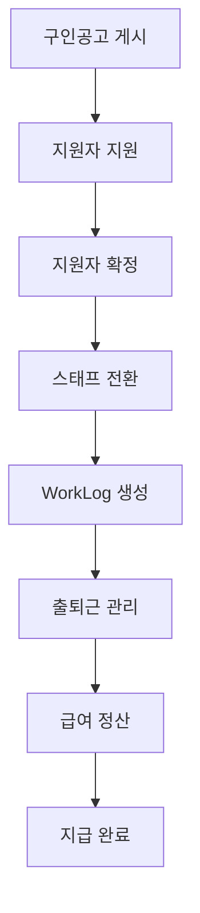
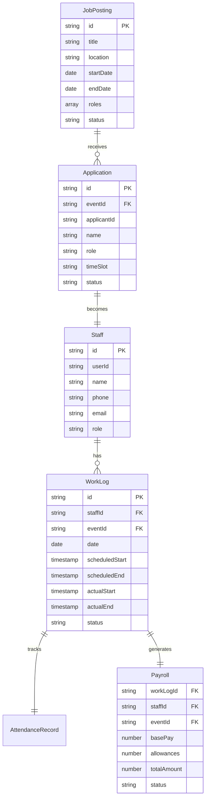

# 지원자-스태프-정산 통합 흐름도

**최종 업데이트**: 2025년 1월 29일  
**버전**: 2.0 (표준 필드 사용)

## 📊 전체 프로세스 개요



## 🔄 상세 데이터 흐름

### 1단계: 구인공고 생성 및 게시

```typescript
// jobPostings 컬렉션
{
  id: "event-001",
  title: "2025년 1월 토너먼트",
  location: "강남 포커룸",
  startDate: "2025-01-30",
  endDate: "2025-01-31",
  roles: [
    {
      role: "Dealer",
      count: 10,
      hourlyWage: 15000,
      timeSlots: ["09:00-18:00", "18:00-03:00"]
    },
    {
      role: "Manager",
      count: 2,
      dailyWage: 200000,
      timeSlots: ["09:00-22:00"]
    }
  ],
  status: "published"
}
```

### 2단계: 지원자 지원

```typescript
// applications 컬렉션
{
  id: "app-001",
  eventId: "event-001",  // ✅ 표준 필드 (jobPostingId 제거됨)
  applicantId: "user-123",
  name: "홍길동",
  phone: "010-1234-5678",
  email: "hong@example.com",
  role: "Dealer",
  timeSlot: "09:00-18:00",
  assignedDate: "2025-01-30",
  status: "pending",  // pending → confirmed → rejected
  appliedAt: Timestamp,
  preQuestionAnswers: [...]
}
```

### 3단계: 지원자 확정 → 스태프 전환

```typescript
// 지원자 확정 시 처리 플로우
async function confirmApplicant(applicationId: string) {
  // 1. application 상태 업데이트
  await updateDoc(doc(db, 'applications', applicationId), {
    status: 'confirmed',
    confirmedAt: Timestamp.now()
  });
  
  // 2. staff 컬렉션에 추가 (없으면 생성)
  const staffData = {
    id: generateStaffId(),
    userId: applicant.userId,
    name: applicant.name,
    phone: applicant.phone,
    email: applicant.email,
    role: applicant.role,
    createdAt: Timestamp.now()
  };
  await setDoc(doc(db, 'staff', staffData.id), staffData);
  
  // 3. WorkLog 자동 생성
  await createWorkLog({
    staffId: staffData.id,  // ✅ 표준 필드 (dealerId 제거됨)
    staffName: staffData.name,  // ✅ 표준 필드 (dealerName 제거됨)
    eventId: applicant.eventId,  // ✅ 표준 필드 (jobPostingId 제거됨)
    date: applicant.assignedDate,
    scheduledStartTime: parseTime(applicant.timeSlot.split('-')[0]),
    scheduledEndTime: parseTime(applicant.timeSlot.split('-')[1]),
    status: 'not_started'
  });
}
```

### 4단계: WorkLog 생성 및 관리

```typescript
// workLogs 컬렉션
{
  id: "worklog-001",
  staffId: "staff-123",  // ✅ 표준 필드
  staffName: "홍길동",   // ✅ 표준 필드
  eventId: "event-001",  // ✅ 표준 필드
  date: "2025-01-30",
  
  // 예정 시간 (공고에서 가져옴)
  scheduledStartTime: Timestamp("2025-01-30T09:00:00"),
  scheduledEndTime: Timestamp("2025-01-30T18:00:00"),
  
  // 실제 시간 (출퇴근 시 기록)
  actualStartTime: null,  // ✅ 체크인 시 기록 (checkInTime 제거됨)
  actualEndTime: null,    // ✅ 체크아웃 시 기록 (checkOutTime 제거됨)
  
  status: "not_started",  // not_started → checked_in → checked_out
  
  // 급여 정보 (공고에서 자동 설정)
  salaryType: "hourly",
  salaryAmount: 15000,
  
  createdAt: Timestamp,
  updatedAt: Timestamp
}
```

### 5단계: 출퇴근 관리

```typescript
// 출퇴근 상태 변경 플로우
async function updateAttendanceStatus(workLogId: string, action: 'checkIn' | 'checkOut') {
  const updates: any = {
    updatedAt: Timestamp.now()
  };
  
  if (action === 'checkIn') {
    updates.status = 'checked_in';
    updates.actualStartTime = Timestamp.now();
  } else if (action === 'checkOut') {
    updates.status = 'checked_out';
    updates.actualEndTime = Timestamp.now();
  }
  
  await updateDoc(doc(db, 'workLogs', workLogId), updates);
  
  // attendanceRecords에도 기록
  await addDoc(collection(db, 'attendanceRecords'), {
    staffId: workLog.staffId,
    eventId: workLog.eventId,
    action: action,
    timestamp: Timestamp.now()
  });
}
```

### 6단계: 급여 정산

```typescript
// 급여 계산 로직
function calculatePayroll(workLog: WorkLog, jobPosting: JobPosting) {
  const role = jobPosting.roles.find(r => r.role === workLog.role);
  
  // 1. 실제 근무 시간 계산
  const actualHours = calculateHours(
    workLog.actualStartTime || workLog.scheduledStartTime,
    workLog.actualEndTime || workLog.scheduledEndTime
  );
  
  // 2. 급여 타입별 계산
  let basePay = 0;
  switch (workLog.salaryType) {
    case 'hourly':
      basePay = actualHours * workLog.salaryAmount;
      break;
    case 'daily':
      basePay = workLog.salaryAmount;
      break;
    case 'monthly':
      basePay = workLog.salaryAmount / 30; // 일할 계산
      break;
  }
  
  // 3. 수당 추가
  const allowances = {
    meal: 10000,           // 식비
    transportation: 20000,  // 교통비
    bonus: 0,              // 보너스
  };
  
  // 4. 최종 금액
  return {
    staffId: workLog.staffId,
    eventId: workLog.eventId,
    workLogId: workLog.id,
    actualHours,
    basePay,
    allowances,
    totalAmount: basePay + Object.values(allowances).reduce((a, b) => a + b, 0),
    status: 'pending'  // pending → confirmed → paid
  };
}
```

## 📋 데이터 관계도



## 🔑 핵심 포인트

### 1. 표준 필드 사용
- **staffId**: 모든 스태프 관련 데이터의 기준
- **eventId**: 모든 이벤트/공고 관련 데이터의 기준
- ~~dealerId~~, ~~jobPostingId~~ 사용 금지

### 2. 자동화 프로세스
1. 지원자 확정 → 스태프 자동 생성
2. 스태프 생성 → WorkLog 자동 생성
3. WorkLog 생성 → 급여 정보 자동 설정
4. 출퇴근 완료 → 정산 자동 계산

### 3. 실시간 동기화
```typescript
// 모든 데이터는 onSnapshot으로 실시간 구독
onSnapshot(
  query(collection(db, 'workLogs'), 
    where('eventId', '==', eventId),
    where('date', '==', todayString)
  ),
  (snapshot) => {
    // 실시간 업데이트 처리
  }
);
```

### 4. 상태 관리 흐름

```
지원자: pending → confirmed/rejected
   ↓
스태프: active/inactive
   ↓
WorkLog: not_started → checked_in → checked_out
   ↓
정산: pending → confirmed → paid
```

## 🛠️ 주요 Hook 및 컴포넌트

### Hooks
- `useApplicantData(eventId)`: 지원자 데이터 관리
- `useStaffManagement(eventId)`: 스태프 관리
- `useUnifiedWorkLogs({ eventId })`: WorkLog 통합 관리
- `useEnhancedPayroll(eventId)`: 급여 정산
- `useAttendanceStatus(staffId)`: 출퇴근 상태

### 주요 컴포넌트
- `ApplicantListTab`: 지원자 목록 및 확정
- `StaffManagementTab`: 스태프 관리
- `AttendanceStatusPopover`: 출퇴근 버튼
- `EnhancedPayrollTab`: 급여 정산
- `WorkTimeEditor`: 근무 시간 편집

## 📝 구현 예시

```typescript
// 지원자 확정 및 전체 프로세스 실행
const handleConfirmApplicant = async (applicationId: string) => {
  try {
    // 1. 지원자 정보 가져오기
    const application = await getDoc(doc(db, 'applications', applicationId));
    const appData = application.data();
    
    // 2. 스태프 생성 또는 업데이트
    const staffId = await createOrUpdateStaff(appData);
    
    // 3. WorkLog 생성
    await createWorkLog({
      staffId,
      eventId: appData.eventId,
      date: appData.assignedDate,
      ...parseTimeSlot(appData.timeSlot)
    });
    
    // 4. 지원서 상태 업데이트
    await updateDoc(doc(db, 'applications', applicationId), {
      status: 'confirmed',
      confirmedAt: Timestamp.now(),
      staffId  // 연결된 스태프 ID 저장
    });
    
    logger.info('지원자 확정 완료', { applicationId, staffId });
  } catch (error) {
    logger.error('지원자 확정 실패', error);
  }
};
```

---

*마지막 업데이트: 2025년 1월 29일*