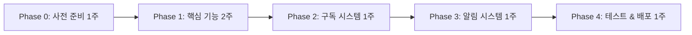

# 🎰 칩 시스템 구현 가이드

**작성일**: 2025년 11월 22일
**버전**: v1.0
**상태**: 📋 구현 준비

---

## 📋 목차

1. [구현 우선순위 로드맵](#-구현-우선순위-로드맵)
2. [Phase 0: 사전 준비](#-phase-0-사전-준비-1주)
3. [Phase 1: 핵심 기능](#-phase-1-핵심-기능-2주)
4. [Phase 2: 구독 시스템](#-phase-2-구독-시스템-1주)
5. [Phase 3: 알림 시스템](#-phase-3-알림-시스템-1주)
6. [최종 체크리스트](#-최종-우선순위-체크리스트)

---

## 🎯 구현 우선순위 로드맵



**총 구현 기간**: 6주
**핵심 개발자**: Frontend 1명 + Backend 1명

---

## ✅ Phase 0: 사전 준비 (1주)

### 1. 결제 시스템 선택 및 계약

**긴급도**: ⭐⭐⭐⭐⭐ (최우선)

#### 해야 할 일
```yaml
PG사 선택:
  - 토스페이먼츠 (추천)
  - 아임포트
  - 나이스페이

계약 절차:
  1. 사업자등록증 준비
  2. 통신판매업 신고증 준비
  3. PG사 가입 신청
  4. 심사 대기 (3-5일)
  5. 테스트 계정 발급
  6. API 키 발급
```

#### 추천: 토스페이먼츠
```yaml
장점:
  - 간편한 연동 (SDK 제공)
  - 낮은 수수료 (3.3% + ₩100)
  - 좋은 개발 문서
  - D+1 정산 (영업일 기준)

필요 정보:
  - 사업자등록번호
  - 대표자명
  - 계좌 정보
  - 정산 주기 선택
```

#### 참고 링크
- 토스페이먼츠: https://docs.tosspayments.com/
- 가입 신청: https://www.tosspayments.com/

---

### 2. 법률 검토

**긴급도**: ⭐⭐⭐⭐⭐ (최우선)

#### 해야 할 일
```yaml
법률 자문 항목:
  1. 전자상거래법 검토
     - 칩(이용권)의 법적 성격
     - 서비스 제공의 전자적 수단 정의

  2. 약관 작성
     - 서비스 이용약관
     - 칩(이용권) 정책
     - 개인정보 처리방침

  3. 환불 정책
     - 7일 이내 미사용 100% 환불
     - 부분 사용 80% 환불 (수수료 20%)
     - 환불 제한 조건

  4. 미성년자 보호
     - 만 19세 미만 구매 금지
     - 본인인증 절차
     - 법정대리인 동의 정책
```

#### 예산
```yaml
비용: ₩300,000 ~ ₩500,000
기간: 1주
담당: 법무법인 또는 전문 변호사
```

#### 주요 약관 내용

**제1조: 칩의 정의**
```
칩은 T-HOLDEM 플랫폼 내 서비스 제공의 전자적 수단으로,
「전자상거래법」상 서비스 이용권에 해당합니다.
현금, 재화, 경제적 가치로 환전 불가하며,
오직 T-HOLDEM 서비스 이용 목적으로만 사용됩니다.
```

**제2조: 환불 정책**
```
- 미사용 칩: 구매 후 7일 이내 100% 환불
- 부분 사용: 미사용분의 80% 환불 (수수료 20%)
- 환불 제한: 월 1회, 연 3회까지
```

---

### 3. Firestore 데이터 스키마 설계

**긴급도**: ⭐⭐⭐⭐⭐ (최우선)

#### 컬렉션 구조

```typescript
// users/{userId}
{
  // 기존 필드들...

  // 칩 잔액 (신규)
  chips: {
    blue: number;          // 파란칩 잔액
    red: number;           // 빨간칩 잔액
    blueExpiry: Timestamp; // 파란칩 소멸일 (월말)
    redExpiry: Timestamp;  // 빨간칩 소멸일 (구매일 + 1년)
  },

  // 구독 정보 (신규)
  subscription: {
    plan: 'free' | 'basic' | 'pro';
    status: 'active' | 'cancelled' | 'expired';
    startDate: Timestamp;
    nextBillingDate: Timestamp;
  }
}

// users/{userId}/chipTransactions/{txId}
{
  type: 'earn' | 'spend' | 'purchase' | 'expire';
  chipType: 'blue' | 'red';
  amount: number;          // 변동 칩 개수
  balance: number;         // 거래 후 잔액
  reason: string;          // 사유 (예: "지원 신청", "칩 구매")
  relatedId?: string;      // 관련 문서 ID (예: 공고 ID)
  createdAt: Timestamp;
}

// subscriptions/{subscriptionId}
{
  userId: string;
  plan: 'basic' | 'pro';
  status: 'active' | 'cancelled' | 'expired';
  startDate: Timestamp;
  nextBillingDate: Timestamp;
  billingKey: string;      // 토스페이먼츠 자동결제 키
  price: number;           // 월 구독료
  createdAt: Timestamp;
  updatedAt: Timestamp;
}

// purchases/{purchaseId}
{
  userId: string;
  packageId: 'basic' | 'popular' | 'recommended' | 'best';
  chips: number;           // 구매한 칩 개수
  amount: number;          // 결제 금액
  status: 'pending' | 'completed' | 'refunded';
  paymentKey: string;      // 토스페이먼츠 결제 키
  orderId: string;         // 주문 번호
  refundedAt?: Timestamp;  // 환불 일자
  refundAmount?: number;   // 환불 금액
  createdAt: Timestamp;
}
```

#### Security Rules

```javascript
// firestore.rules
rules_version = '2';
service cloud.firestore {
  match /databases/{database}/documents {

    // 사용자 문서
    match /users/{userId} {
      // 본인만 읽기/쓰기 가능
      allow read, write: if request.auth.uid == userId;

      // 칩 차감은 Functions만 가능
      allow update: if request.auth.uid == userId
        && !request.resource.data.chips.diff(resource.data.chips).affectedKeys().hasAny(['blue', 'red']);
    }

    // 칩 거래 내역
    match /users/{userId}/chipTransactions/{txId} {
      // 본인만 읽기, Functions만 쓰기
      allow read: if request.auth.uid == userId;
      allow write: if false; // Functions only
    }

    // 구독 정보
    match /subscriptions/{subscriptionId} {
      // 본인 또는 관리자만
      allow read: if request.auth.uid == resource.data.userId
        || get(/databases/$(database)/documents/users/$(request.auth.uid)).data.role == 'admin';
      allow write: if false; // Functions only
    }

    // 구매 정보
    match /purchases/{purchaseId} {
      // 본인 또는 관리자만
      allow read: if request.auth.uid == resource.data.userId
        || get(/databases/$(database)/documents/users/$(request.auth.uid)).data.role == 'admin';
      allow write: if false; // Functions only
    }
  }
}
```

---

## 🚀 Phase 1: 핵심 기능 (2주)

### Week 1: 칩 기본 시스템

#### Day 1-2: 칩 데이터 모델

**파일**: `app2/src/types/chip.types.ts`

```typescript
/**
 * 칩 잔액 인터페이스
 */
export interface ChipBalance {
  blue: number;          // 파란칩 (구독)
  red: number;           // 빨간칩 (충전)
  blueExpiry: Date;      // 파란칩 소멸일
  redExpiry: Date;       // 빨간칩 소멸일
}

/**
 * 칩 거래 타입
 */
export type ChipTransactionType = 'earn' | 'spend' | 'purchase' | 'expire';

/**
 * 칩 종류
 */
export type ChipType = 'blue' | 'red';

/**
 * 칩 거래 내역
 */
export interface ChipTransaction {
  id: string;
  type: ChipTransactionType;
  chipType: ChipType;
  amount: number;        // 변동 칩 개수
  balance: number;       // 거래 후 잔액
  reason: string;        // 사유
  relatedId?: string;    // 관련 ID (공고 ID 등)
  createdAt: Date;
}

/**
 * 칩 패키지 정의
 */
export interface ChipPackage {
  id: 'basic' | 'popular' | 'recommended' | 'best';
  name: string;
  chips: number;
  price: number;
  pricePerChip: number;
  discount: number;      // 할인율 (%)
  savings: number;       // 절약 금액
  badge?: string;        // 배지 (⭐, 🏆, 🔥)
  description: string;   // 설명
}

/**
 * 칩 패키지 목록
 */
export const CHIP_PACKAGES: ChipPackage[] = [
  {
    id: 'basic',
    name: '기본 패키지',
    chips: 21,
    price: 4900,
    pricePerChip: 233,
    discount: 0,
    savings: 0,
    badge: '🥉',
    description: '소형 펍 (1주일)',
  },
  {
    id: 'popular',
    name: '인기 패키지',
    chips: 50,
    price: 9900,
    pricePerChip: 198,
    discount: 15,
    savings: 735,
    badge: '⭐',
    description: '중형 펍 (2주일) - BEST',
  },
  {
    id: 'recommended',
    name: '추천 패키지',
    chips: 115,
    price: 19900,
    pricePerChip: 173,
    discount: 26,
    savings: 3895,
    badge: '🏆',
    description: '대형 펍 (1개월)',
  },
  {
    id: 'best',
    name: '최대 할인',
    chips: 310,
    price: 49900,
    pricePerChip: 161,
    discount: 31,
    savings: 22430,
    badge: '🔥',
    description: '체인점 (3개월)',
  },
];

/**
 * 구독 플랜
 */
export type SubscriptionPlan = 'free' | 'basic' | 'pro';

/**
 * 구독 상태
 */
export type SubscriptionStatus = 'active' | 'cancelled' | 'expired';

/**
 * 구독 정보
 */
export interface Subscription {
  id: string;
  userId: string;
  plan: SubscriptionPlan;
  status: SubscriptionStatus;
  startDate: Date;
  nextBillingDate: Date;
  billingKey?: string;
  price: number;
  createdAt: Date;
  updatedAt: Date;
}

/**
 * 구매 정보
 */
export interface Purchase {
  id: string;
  userId: string;
  packageId: ChipPackage['id'];
  chips: number;
  amount: number;
  status: 'pending' | 'completed' | 'refunded';
  paymentKey: string;
  orderId: string;
  refundedAt?: Date;
  refundAmount?: number;
  createdAt: Date;
}
```

---

#### Day 3-4: Zustand Store 생성

**파일**: `app2/src/stores/chipStore.ts`

```typescript
import { create } from 'zustand';
import { doc, onSnapshot, collection, query, orderBy, limit } from 'firebase/firestore';
import { db } from '@/config/firebase';
import { ChipBalance, ChipTransaction } from '@/types/chip.types';
import { logger } from '@/utils/logger';

interface ChipStore {
  // State
  balance: ChipBalance | null;
  transactions: ChipTransaction[];
  loading: boolean;
  error: string | null;

  // Actions
  fetchBalance: (userId: string) => void;
  fetchTransactions: (userId: string) => void;
  spendChip: (userId: string, amount: number, reason: string) => Promise<boolean>;
  cleanup: () => void;
}

// 구독 해제 함수 저장
let balanceUnsubscribe: (() => void) | null = null;
let transactionsUnsubscribe: (() => void) | null = null;

export const useChipStore = create<ChipStore>((set, get) => ({
  balance: null,
  transactions: [],
  loading: false,
  error: null,

  /**
   * 칩 잔액 실시간 구독
   */
  fetchBalance: (userId: string) => {
    if (!userId) {
      logger.warn('fetchBalance: userId is required');
      return;
    }

    set({ loading: true, error: null });

    try {
      // 기존 구독 해제
      if (balanceUnsubscribe) {
        balanceUnsubscribe();
      }

      // Firestore 실시간 구독
      balanceUnsubscribe = onSnapshot(
        doc(db, `users/${userId}`),
        (snapshot) => {
          if (snapshot.exists()) {
            const data = snapshot.data();
            const chips = data.chips || { blue: 0, red: 0 };

            set({
              balance: {
                blue: chips.blue || 0,
                red: chips.red || 0,
                blueExpiry: chips.blueExpiry?.toDate() || new Date(),
                redExpiry: chips.redExpiry?.toDate() || new Date(),
              },
              loading: false,
            });

            logger.info('칩 잔액 업데이트', { balance: chips });
          } else {
            set({ balance: null, loading: false });
          }
        },
        (error) => {
          logger.error('칩 잔액 조회 실패', error);
          set({ error: error.message, loading: false });
        }
      );
    } catch (error) {
      logger.error('fetchBalance error', error);
      set({ error: (error as Error).message, loading: false });
    }
  },

  /**
   * 칩 거래 내역 조회
   */
  fetchTransactions: (userId: string) => {
    if (!userId) {
      logger.warn('fetchTransactions: userId is required');
      return;
    }

    try {
      // 기존 구독 해제
      if (transactionsUnsubscribe) {
        transactionsUnsubscribe();
      }

      // 최근 50개 거래 내역 조회
      const q = query(
        collection(db, `users/${userId}/chipTransactions`),
        orderBy('createdAt', 'desc'),
        limit(50)
      );

      transactionsUnsubscribe = onSnapshot(
        q,
        (snapshot) => {
          const transactions: ChipTransaction[] = snapshot.docs.map((doc) => {
            const data = doc.data();
            return {
              id: doc.id,
              type: data.type,
              chipType: data.chipType,
              amount: data.amount,
              balance: data.balance,
              reason: data.reason,
              relatedId: data.relatedId,
              createdAt: data.createdAt?.toDate() || new Date(),
            };
          });

          set({ transactions });
          logger.info('칩 거래 내역 업데이트', { count: transactions.length });
        },
        (error) => {
          logger.error('칩 거래 내역 조회 실패', error);
          set({ error: error.message });
        }
      );
    } catch (error) {
      logger.error('fetchTransactions error', error);
      set({ error: (error as Error).message });
    }
  },

  /**
   * 칩 사용 (지원 신청 등)
   */
  spendChip: async (userId: string, amount: number, reason: string): Promise<boolean> => {
    const { balance } = get();

    if (!balance) {
      logger.error('칩 잔액 정보 없음');
      return false;
    }

    const totalChips = balance.blue + balance.red;

    if (totalChips < amount) {
      logger.warn('칩 부족', { required: amount, available: totalChips });
      return false;
    }

    try {
      // Firebase Functions 호출
      const spendChipFunction = httpsCallable(functions, 'spendChip');
      const result = await spendChipFunction({
        userId,
        amount,
        reason,
      });

      if (result.data.success) {
        logger.info('칩 사용 성공', { amount, reason });
        return true;
      } else {
        logger.error('칩 사용 실패', result.data.error);
        return false;
      }
    } catch (error) {
      logger.error('spendChip error', error);
      return false;
    }
  },

  /**
   * 구독 정리
   */
  cleanup: () => {
    if (balanceUnsubscribe) {
      balanceUnsubscribe();
      balanceUnsubscribe = null;
    }
    if (transactionsUnsubscribe) {
      transactionsUnsubscribe();
      transactionsUnsubscribe = null;
    }
    set({ balance: null, transactions: [], loading: false, error: null });
  },
}));
```

---

#### Day 5: 칩 UI 컴포넌트

**파일**: `app2/src/components/chip/ChipBalance.tsx`

```typescript
import React from 'react';
import { useChipStore } from '@/stores/chipStore';
import { format, differenceInDays } from 'date-fns';
import { ko } from 'date-fns/locale';

export const ChipBalance: React.FC = () => {
  const { balance, loading } = useChipStore();

  if (loading) {
    return (
      <div className="bg-white dark:bg-gray-800 rounded-lg p-6 animate-pulse">
        <div className="h-6 bg-gray-200 dark:bg-gray-700 rounded w-1/3 mb-4"></div>
        <div className="h-10 bg-gray-200 dark:bg-gray-700 rounded w-1/2 mb-6"></div>
        <div className="space-y-4">
          <div className="h-20 bg-gray-200 dark:bg-gray-700 rounded"></div>
          <div className="h-20 bg-gray-200 dark:bg-gray-700 rounded"></div>
        </div>
      </div>
    );
  }

  if (!balance) {
    return (
      <div className="bg-white dark:bg-gray-800 rounded-lg p-6">
        <p className="text-gray-500 dark:text-gray-400">칩 정보를 불러올 수 없습니다.</p>
      </div>
    );
  }

  const totalChips = balance.blue + balance.red;
  const blueExpireDays = differenceInDays(balance.blueExpiry, new Date());
  const redExpireDays = differenceInDays(balance.redExpiry, new Date());

  return (
    <div className="bg-white dark:bg-gray-800 rounded-lg p-6 shadow-sm">
      {/* 헤더 */}
      <div className="flex items-center justify-between mb-4">
        <h3 className="text-lg font-bold text-gray-900 dark:text-gray-100">
          🎰 보유 칩
        </h3>
        <button className="text-sm text-blue-600 dark:text-blue-400 hover:underline">
          충전하기
        </button>
      </div>

      {/* 총 칩 개수 */}
      <div className="mb-6">
        <div className="text-4xl font-bold text-gray-900 dark:text-gray-100">
          총 {totalChips}칩
        </div>
        <div className="h-2 bg-gray-200 dark:bg-gray-700 rounded-full mt-2">
          <div
            className="h-2 bg-gradient-to-r from-blue-500 to-red-500 rounded-full transition-all"
            style={{ width: `${totalChips > 0 ? 100 : 0}%` }}
          ></div>
        </div>
      </div>

      {/* 칩 상세 */}
      <div className="space-y-4">
        {/* 파란칩 */}
        <div className="bg-blue-50 dark:bg-blue-900/20 rounded-lg p-4">
          <div className="flex items-start justify-between">
            <div className="flex items-start gap-3">
              <span className="text-3xl">🔵</span>
              <div>
                <div className="font-semibold text-gray-900 dark:text-gray-100">
                  파란칩: {balance.blue}개
                </div>
                <div className="text-sm text-gray-600 dark:text-gray-400 mt-1">
                  매월 지급 구독 칩
                </div>
              </div>
            </div>
            <div className="text-right">
              <div
                className={`text-sm font-medium ${
                  blueExpireDays <= 3
                    ? 'text-red-600 dark:text-red-400'
                    : blueExpireDays <= 7
                    ? 'text-orange-600 dark:text-orange-400'
                    : 'text-gray-600 dark:text-gray-400'
                }`}
              >
                ⏰ {format(balance.blueExpiry, 'MM/dd 소멸', { locale: ko })}
              </div>
              {blueExpireDays <= 7 && (
                <div className="text-xs text-red-600 dark:text-red-400 mt-1">
                  {blueExpireDays}일 남음!
                </div>
              )}
            </div>
          </div>
        </div>

        {/* 빨간칩 */}
        <div className="bg-red-50 dark:bg-red-900/20 rounded-lg p-4">
          <div className="flex items-start justify-between">
            <div className="flex items-start gap-3">
              <span className="text-3xl">🔴</span>
              <div>
                <div className="font-semibold text-gray-900 dark:text-gray-100">
                  빨간칩: {balance.red}개
                </div>
                <div className="text-sm text-gray-600 dark:text-gray-400 mt-1">
                  충전 구매 칩
                </div>
              </div>
            </div>
            <div className="text-right">
              <div className="text-sm text-gray-600 dark:text-gray-400">
                ♾️ {format(balance.redExpiry, 'yyyy/MM/dd까지', { locale: ko })}
              </div>
              <div className="text-xs text-gray-500 dark:text-gray-500 mt-1">
                {redExpireDays}일 남음
              </div>
            </div>
          </div>
        </div>
      </div>

      {/* 사용 순서 안내 */}
      <div className="mt-4 p-3 bg-blue-50 dark:bg-blue-900/20 rounded-lg border border-blue-200 dark:border-blue-800">
        <div className="flex items-start gap-2">
          <span className="text-lg">💡</span>
          <div className="text-sm">
            <div className="font-semibold text-gray-900 dark:text-gray-100 mb-1">
              사용 순서
            </div>
            <div className="text-gray-600 dark:text-gray-400">
              파란칩 먼저 → 빨간칩 나중에
            </div>
          </div>
        </div>
      </div>
    </div>
  );
};
```

**파일**: `app2/src/components/chip/ChipTransactionHistory.tsx`

```typescript
import React from 'react';
import { useChipStore } from '@/stores/chipStore';
import { format } from 'date-fns';
import { ko } from 'date-fns/locale';

export const ChipTransactionHistory: React.FC = () => {
  const { transactions, loading } = useChipStore();

  if (loading) {
    return <div className="animate-pulse">로딩 중...</div>;
  }

  if (transactions.length === 0) {
    return (
      <div className="text-center py-8 text-gray-500 dark:text-gray-400">
        거래 내역이 없습니다.
      </div>
    );
  }

  return (
    <div className="bg-white dark:bg-gray-800 rounded-lg shadow-sm">
      <div className="p-4 border-b border-gray-200 dark:border-gray-700">
        <h3 className="text-lg font-bold text-gray-900 dark:text-gray-100">
          칩 사용 내역
        </h3>
      </div>

      <div className="divide-y divide-gray-200 dark:divide-gray-700">
        {transactions.map((tx) => (
          <div key={tx.id} className="p-4 hover:bg-gray-50 dark:hover:bg-gray-700/50">
            <div className="flex items-center justify-between">
              <div className="flex items-center gap-3">
                {/* 아이콘 */}
                <div className="text-2xl">
                  {tx.chipType === 'blue' ? '🔵' : '🔴'}
                </div>

                {/* 내용 */}
                <div>
                  <div className="font-medium text-gray-900 dark:text-gray-100">
                    {tx.reason}
                  </div>
                  <div className="text-sm text-gray-500 dark:text-gray-400">
                    {format(tx.createdAt, 'yyyy년 MM월 dd일 HH:mm', { locale: ko })}
                  </div>
                </div>
              </div>

              {/* 금액 */}
              <div className="text-right">
                <div
                  className={`font-semibold ${
                    tx.type === 'earn' || tx.type === 'purchase'
                      ? 'text-green-600 dark:text-green-400'
                      : 'text-red-600 dark:text-red-400'
                  }`}
                >
                  {tx.type === 'earn' || tx.type === 'purchase' ? '+' : '-'}
                  {tx.amount}칩
                </div>
                <div className="text-sm text-gray-500 dark:text-gray-400">
                  잔액: {tx.balance}칩
                </div>
              </div>
            </div>
          </div>
        ))}
      </div>
    </div>
  );
};
```

---

### Week 2: 결제 연동

#### Day 1-2: 토스페이먼츠 연동

**1. 패키지 설치**
```bash
cd app2
npm install @tosspayments/payment-sdk
```

**2. 환경 변수 설정**

**파일**: `app2/.env`
```bash
# 토스페이먼츠
VITE_TOSS_CLIENT_KEY=test_ck_xxxxxxxxxx
VITE_TOSS_SECRET_KEY=test_sk_xxxxxxxxxx
```

**3. 결제 서비스 작성**

**파일**: `app2/src/services/payment.ts`

```typescript
import { loadTossPayments } from '@tosspayments/payment-sdk';
import { CHIP_PACKAGES, ChipPackage } from '@/types/chip.types';
import { logger } from '@/utils/logger';

const CLIENT_KEY = import.meta.env.VITE_TOSS_CLIENT_KEY;

/**
 * 칩 구매 (토스페이먼츠)
 */
export const purchaseChips = async (
  userId: string,
  packageId: ChipPackage['id']
): Promise<void> => {
  const pkg = CHIP_PACKAGES.find((p) => p.id === packageId);

  if (!pkg) {
    throw new Error('Invalid package ID');
  }

  try {
    // 1. 토스페이먼츠 SDK 로드
    const tossPayments = await loadTossPayments(CLIENT_KEY);

    // 2. 주문 ID 생성
    const orderId = `chip_${userId}_${Date.now()}`;

    logger.info('칩 구매 시작', { packageId, orderId, amount: pkg.price });

    // 3. 결제 요청
    await tossPayments.requestPayment('카드', {
      amount: pkg.price,
      orderId,
      orderName: `빨간칩 ${pkg.chips}개`,
      customerName: userId,
      successUrl: `${window.location.origin}/payment/success`,
      failUrl: `${window.location.origin}/payment/fail`,
    });
  } catch (error) {
    logger.error('칩 구매 실패', error);
    throw error;
  }
};

/**
 * 구독 시작 (자동결제)
 */
export const startSubscription = async (
  userId: string,
  plan: 'basic' | 'pro'
): Promise<string> => {
  try {
    const tossPayments = await loadTossPayments(CLIENT_KEY);

    logger.info('구독 시작', { plan, userId });

    // 빌링키 발급 요청
    const billingKey = await tossPayments.requestBillingAuth('카드', {
      customerKey: userId,
      successUrl: `${window.location.origin}/subscription/success?plan=${plan}`,
      failUrl: `${window.location.origin}/subscription/fail`,
    });

    return billingKey;
  } catch (error) {
    logger.error('구독 시작 실패', error);
    throw error;
  }
};
```

---

#### Day 3-4: Firebase Functions (결제 승인)

**파일**: `functions/src/payments/approvePayment.ts`

```typescript
import * as functions from 'firebase-functions';
import * as admin from 'firebase-admin';
import { logger } from 'firebase-functions';

const db = admin.firestore();
const FieldValue = admin.firestore.FieldValue;

const TOSS_SECRET_KEY = functions.config().toss.secret_key;

interface ApprovePaymentData {
  paymentKey: string;
  orderId: string;
  amount: number;
  packageId: 'basic' | 'popular' | 'recommended' | 'best';
  chips: number;
}

/**
 * 결제 승인 (토스페이먼츠)
 */
export const approvePayment = functions
  .region('asia-northeast3')
  .https.onCall(async (data: ApprovePaymentData, context) => {
    const userId = context.auth?.uid;

    if (!userId) {
      throw new functions.https.HttpsError('unauthenticated', '인증이 필요합니다.');
    }

    const { paymentKey, orderId, amount, packageId, chips } = data;

    try {
      logger.info('결제 승인 시작', { userId, orderId, amount });

      // 1. 토스페이먼츠 결제 승인 API 호출
      const response = await fetch('https://api.tosspayments.com/v1/payments/confirm', {
        method: 'POST',
        headers: {
          Authorization: `Basic ${Buffer.from(TOSS_SECRET_KEY + ':').toString('base64')}`,
          'Content-Type': 'application/json',
        },
        body: JSON.stringify({
          paymentKey,
          orderId,
          amount,
        }),
      });

      if (!response.ok) {
        const error = await response.json();
        logger.error('토스페이먼츠 승인 실패', error);
        throw new functions.https.HttpsError('internal', '결제 승인 실패');
      }

      const payment = await response.json();

      if (payment.status !== 'DONE') {
        throw new functions.https.HttpsError('failed-precondition', '결제가 완료되지 않았습니다.');
      }

      // 2. Firestore 트랜잭션으로 처리
      const purchaseRef = db.collection('purchases').doc();

      await db.runTransaction(async (transaction) => {
        const userRef = db.doc(`users/${userId}`);
        const userDoc = await transaction.get(userRef);

        if (!userDoc.exists) {
          throw new Error('사용자를 찾을 수 없습니다.');
        }

        const currentChips = userDoc.data()?.chips || { blue: 0, red: 0 };

        // 2-1. 구매 기록 저장
        transaction.set(purchaseRef, {
          userId,
          packageId,
          chips,
          amount,
          status: 'completed',
          paymentKey,
          orderId,
          createdAt: FieldValue.serverTimestamp(),
        });

        // 2-2. 사용자에게 빨간칩 지급
        transaction.update(userRef, {
          'chips.red': FieldValue.increment(chips),
          'chips.redExpiry': new Date(Date.now() + 365 * 24 * 60 * 60 * 1000), // 1년 후
        });

        // 2-3. 거래 내역 기록
        const txRef = db.collection(`users/${userId}/chipTransactions`).doc();
        transaction.set(txRef, {
          type: 'purchase',
          chipType: 'red',
          amount: chips,
          balance: currentChips.blue + currentChips.red + chips,
          reason: `빨간칩 ${chips}개 구매 (${packageId})`,
          relatedId: purchaseRef.id,
          createdAt: FieldValue.serverTimestamp(),
        });
      });

      logger.info('결제 승인 완료', { userId, purchaseId: purchaseRef.id });

      return {
        success: true,
        purchaseId: purchaseRef.id,
        chips,
      };
    } catch (error) {
      logger.error('결제 승인 오류', error);
      throw new functions.https.HttpsError('internal', '결제 처리 중 오류가 발생했습니다.');
    }
  });
```

**파일**: `functions/src/payments/spendChip.ts`

```typescript
import * as functions from 'firebase-functions';
import * as admin from 'firebase-admin';
import { logger } from 'firebase-functions';

const db = admin.firestore();
const FieldValue = admin.firestore.FieldValue;

interface SpendChipData {
  userId: string;
  amount: number;
  reason: string;
  relatedId?: string;
}

/**
 * 칩 사용 (지원 신청 등)
 */
export const spendChip = functions
  .region('asia-northeast3')
  .https.onCall(async (data: SpendChipData, context) => {
    const authUserId = context.auth?.uid;

    if (!authUserId) {
      throw new functions.https.HttpsError('unauthenticated', '인증이 필요합니다.');
    }

    const { userId, amount, reason, relatedId } = data;

    if (authUserId !== userId) {
      throw new functions.https.HttpsError('permission-denied', '권한이 없습니다.');
    }

    if (amount <= 0) {
      throw new functions.https.HttpsError('invalid-argument', '유효하지 않은 금액입니다.');
    }

    try {
      logger.info('칩 사용 시작', { userId, amount, reason });

      await db.runTransaction(async (transaction) => {
        const userRef = db.doc(`users/${userId}`);
        const userDoc = await transaction.get(userRef);

        if (!userDoc.exists) {
          throw new Error('사용자를 찾을 수 없습니다.');
        }

        const chips = userDoc.data()?.chips || { blue: 0, red: 0 };
        let blueChips = chips.blue || 0;
        let redChips = chips.red || 0;

        const totalChips = blueChips + redChips;

        // 칩 부족 확인
        if (totalChips < amount) {
          throw new Error('칩이 부족합니다.');
        }

        // 칩 차감 로직 (파란칩 우선)
        let remainingAmount = amount;

        if (blueChips >= remainingAmount) {
          // 파란칩만으로 충분
          blueChips -= remainingAmount;
          remainingAmount = 0;
        } else {
          // 파란칩 전부 사용 + 빨간칩 사용
          remainingAmount -= blueChips;
          blueChips = 0;
          redChips -= remainingAmount;
          remainingAmount = 0;
        }

        // 사용자 칩 업데이트
        transaction.update(userRef, {
          'chips.blue': blueChips,
          'chips.red': redChips,
        });

        // 거래 내역 기록
        const txRef = db.collection(`users/${userId}/chipTransactions`).doc();
        transaction.set(txRef, {
          type: 'spend',
          chipType: amount <= chips.blue ? 'blue' : 'red',
          amount: -amount,
          balance: blueChips + redChips,
          reason,
          relatedId,
          createdAt: FieldValue.serverTimestamp(),
        });
      });

      logger.info('칩 사용 완료', { userId, amount });

      return { success: true };
    } catch (error) {
      logger.error('칩 사용 오류', error);
      throw new functions.https.HttpsError('internal', (error as Error).message);
    }
  });
```

---

#### Day 5: 결제 성공/실패 페이지

**파일**: `app2/src/pages/PaymentSuccessPage.tsx`

```typescript
import React, { useEffect, useState } from 'react';
import { useNavigate, useSearchParams } from 'react-router-dom';
import { httpsCallable } from 'firebase/functions';
import { functions } from '@/config/firebase';
import { toast } from 'react-hot-toast';
import { logger } from '@/utils/logger';

export const PaymentSuccessPage: React.FC = () => {
  const navigate = useNavigate();
  const [searchParams] = useSearchParams();
  const [processing, setProcessing] = useState(true);

  const paymentKey = searchParams.get('paymentKey');
  const orderId = searchParams.get('orderId');
  const amount = searchParams.get('amount');

  useEffect(() => {
    if (!paymentKey || !orderId || !amount) {
      toast.error('잘못된 결제 정보입니다.');
      navigate('/chip/purchase');
      return;
    }

    const approvePayment = async () => {
      try {
        setProcessing(true);

        // orderId에서 패키지 정보 추출
        // 예: chip_userId_timestamp_packageId
        const packageId = orderId.split('_')[3] as 'basic' | 'popular' | 'recommended' | 'best';

        const packages = {
          basic: 21,
          popular: 50,
          recommended: 115,
          best: 310,
        };

        const chips = packages[packageId] || 0;

        logger.info('결제 승인 요청', { paymentKey, orderId, amount, chips });

        // Firebase Functions 호출
        const approvePaymentFn = httpsCallable(functions, 'approvePayment');
        const result = await approvePaymentFn({
          paymentKey,
          orderId,
          amount: Number(amount),
          packageId,
          chips,
        });

        const data = result.data as { success: boolean; purchaseId: string; chips: number };

        if (data.success) {
          toast.success(`🎉 빨간칩 ${data.chips}개 충전 완료!`);
          logger.info('결제 승인 성공', data);

          // 3초 후 대시보드로 이동
          setTimeout(() => {
            navigate('/dashboard');
          }, 3000);
        } else {
          throw new Error('결제 승인 실패');
        }
      } catch (error) {
        logger.error('결제 승인 오류', error);
        toast.error('결제 처리 중 오류가 발생했습니다.');
        navigate('/chip/purchase');
      } finally {
        setProcessing(false);
      }
    };

    approvePayment();
  }, [paymentKey, orderId, amount, navigate]);

  return (
    <div className="flex flex-col items-center justify-center min-h-screen bg-gray-50 dark:bg-gray-900">
      <div className="bg-white dark:bg-gray-800 rounded-lg shadow-lg p-8 max-w-md w-full text-center">
        {processing ? (
          <>
            <div className="text-6xl mb-4 animate-bounce">🎰</div>
            <h1 className="text-2xl font-bold mb-2 text-gray-900 dark:text-gray-100">
              결제 처리 중...
            </h1>
            <p className="text-gray-600 dark:text-gray-400">칩을 충전하고 있습니다.</p>
            <div className="mt-6">
              <div className="animate-spin rounded-full h-12 w-12 border-b-2 border-blue-600 mx-auto"></div>
            </div>
          </>
        ) : (
          <>
            <div className="text-6xl mb-4">🎉</div>
            <h1 className="text-2xl font-bold mb-2 text-gray-900 dark:text-gray-100">
              결제 완료!
            </h1>
            <p className="text-gray-600 dark:text-gray-400">칩 충전이 완료되었습니다.</p>
            <p className="text-sm text-gray-500 dark:text-gray-500 mt-4">
              잠시 후 대시보드로 이동합니다...
            </p>
          </>
        )}
      </div>
    </div>
  );
};
```

**파일**: `app2/src/pages/PaymentFailPage.tsx`

```typescript
import React from 'react';
import { useNavigate, useSearchParams } from 'react-router-dom';

export const PaymentFailPage: React.FC = () => {
  const navigate = useNavigate();
  const [searchParams] = useSearchParams();

  const code = searchParams.get('code');
  const message = searchParams.get('message');

  return (
    <div className="flex flex-col items-center justify-center min-h-screen bg-gray-50 dark:bg-gray-900">
      <div className="bg-white dark:bg-gray-800 rounded-lg shadow-lg p-8 max-w-md w-full text-center">
        <div className="text-6xl mb-4">😢</div>
        <h1 className="text-2xl font-bold mb-2 text-gray-900 dark:text-gray-100">결제 실패</h1>
        <p className="text-gray-600 dark:text-gray-400 mb-4">
          {message || '결제 중 오류가 발생했습니다.'}
        </p>

        {code && (
          <div className="text-sm text-gray-500 dark:text-gray-500 mb-6">
            오류 코드: {code}
          </div>
        )}

        <div className="space-y-3">
          <button
            onClick={() => navigate('/chip/purchase')}
            className="w-full btn-primary py-3"
          >
            다시 시도
          </button>
          <button
            onClick={() => navigate('/dashboard')}
            className="w-full btn-secondary py-3"
          >
            대시보드로 돌아가기
          </button>
        </div>
      </div>
    </div>
  );
};
```

---

## 💎 Phase 2: 구독 시스템 (1주)

### Day 1-2: 구독 관리 Functions

**파일**: `functions/src/subscriptions/createSubscription.ts`

```typescript
import * as functions from 'firebase-functions';
import * as admin from 'firebase-admin';
import { logger } from 'firebase-functions';
import { endOfMonth } from 'date-fns';

const db = admin.firestore();
const FieldValue = admin.firestore.FieldValue;

const TOSS_SECRET_KEY = functions.config().toss.secret_key;

interface CreateSubscriptionData {
  plan: 'basic' | 'pro';
  billingKey: string;
}

const PLANS = {
  basic: { price: 5500, chips: 30 },
  pro: { price: 14900, chips: 80 },
};

/**
 * 구독 생성
 */
export const createSubscription = functions
  .region('asia-northeast3')
  .https.onCall(async (data: CreateSubscriptionData, context) => {
    const userId = context.auth?.uid;

    if (!userId) {
      throw new functions.https.HttpsError('unauthenticated', '인증이 필요합니다.');
    }

    const { plan, billingKey } = data;

    if (!PLANS[plan]) {
      throw new functions.https.HttpsError('invalid-argument', '유효하지 않은 플랜입니다.');
    }

    try {
      logger.info('구독 생성 시작', { userId, plan });

      const planInfo = PLANS[plan];
      const now = new Date();
      const nextBillingDate = new Date(now.getTime() + 30 * 24 * 60 * 60 * 1000); // 30일 후

      // 1. 첫 결제 (토스페이먼츠 자동결제)
      const paymentResponse = await fetch('https://api.tosspayments.com/v1/billing/pay', {
        method: 'POST',
        headers: {
          Authorization: `Basic ${Buffer.from(TOSS_SECRET_KEY + ':').toString('base64')}`,
          'Content-Type': 'application/json',
        },
        body: JSON.stringify({
          billingKey,
          customerKey: userId,
          amount: planInfo.price,
          orderId: `sub_${userId}_${Date.now()}`,
          orderName: `${plan} 플랜 구독`,
        }),
      });

      if (!paymentResponse.ok) {
        const error = await paymentResponse.json();
        logger.error('첫 결제 실패', error);
        throw new Error('결제에 실패했습니다.');
      }

      // 2. Firestore 트랜잭션
      const subscriptionRef = db.collection('subscriptions').doc();

      await db.runTransaction(async (transaction) => {
        const userRef = db.doc(`users/${userId}`);
        const userDoc = await transaction.get(userRef);

        if (!userDoc.exists) {
          throw new Error('사용자를 찾을 수 없습니다.');
        }

        // 2-1. 구독 생성
        transaction.set(subscriptionRef, {
          userId,
          plan,
          status: 'active',
          startDate: FieldValue.serverTimestamp(),
          nextBillingDate,
          billingKey,
          price: planInfo.price,
          createdAt: FieldValue.serverTimestamp(),
          updatedAt: FieldValue.serverTimestamp(),
        });

        // 2-2. 즉시 파란칩 지급
        transaction.update(userRef, {
          'chips.blue': planInfo.chips,
          'chips.blueExpiry': endOfMonth(now),
          'subscription.plan': plan,
          'subscription.status': 'active',
          'subscription.startDate': FieldValue.serverTimestamp(),
          'subscription.nextBillingDate': nextBillingDate,
        });

        // 2-3. 거래 내역 기록
        const txRef = db.collection(`users/${userId}/chipTransactions`).doc();
        transaction.set(txRef, {
          type: 'earn',
          chipType: 'blue',
          amount: planInfo.chips,
          balance: planInfo.chips,
          reason: `${plan} 플랜 첫 지급`,
          relatedId: subscriptionRef.id,
          createdAt: FieldValue.serverTimestamp(),
        });
      });

      logger.info('구독 생성 완료', { userId, subscriptionId: subscriptionRef.id });

      return {
        success: true,
        subscriptionId: subscriptionRef.id,
        plan,
        chips: planInfo.chips,
      };
    } catch (error) {
      logger.error('구독 생성 오류', error);
      throw new functions.https.HttpsError('internal', (error as Error).message);
    }
  });
```

---

### Day 3-4: 월초 자동 칩 지급 (Cron)

**파일**: `functions/src/subscriptions/monthlyChipGrant.ts`

```typescript
import * as functions from 'firebase-functions';
import * as admin from 'firebase-admin';
import { logger } from 'firebase-functions';
import { endOfMonth } from 'date-fns';

const db = admin.firestore();
const FieldValue = admin.firestore.FieldValue;

const PLANS = {
  basic: { chips: 30 },
  pro: { chips: 80 },
};

/**
 * 월초 파란칩 자동 지급
 * 매월 1일 00시 실행
 */
export const monthlyChipGrant = functions
  .region('asia-northeast3')
  .pubsub.schedule('0 0 1 * *') // 매월 1일 00시
  .timeZone('Asia/Seoul')
  .onRun(async (context) => {
    logger.info('월간 칩 지급 시작');

    try {
      // 1. 활성 구독 조회
      const subscriptionsSnapshot = await db
        .collection('subscriptions')
        .where('status', '==', 'active')
        .get();

      if (subscriptionsSnapshot.empty) {
        logger.info('활성 구독 없음');
        return null;
      }

      logger.info(`활성 구독 ${subscriptionsSnapshot.size}개 발견`);

      const batch = db.batch();
      const now = new Date();
      const expiryDate = endOfMonth(now);

      for (const doc of subscriptionsSnapshot.docs) {
        const sub = doc.data();
        const userId = sub.userId;
        const plan = sub.plan as 'basic' | 'pro';

        if (!PLANS[plan]) {
          logger.warn('유효하지 않은 플랜', { userId, plan });
          continue;
        }

        const chips = PLANS[plan].chips;

        // 2. 파란칩 지급
        const userRef = db.doc(`users/${userId}`);
        batch.update(userRef, {
          'chips.blue': chips,
          'chips.blueExpiry': expiryDate,
        });

        // 3. 거래 내역 기록
        const txRef = db.collection(`users/${userId}/chipTransactions`).doc();
        batch.set(txRef, {
          type: 'earn',
          chipType: 'blue',
          amount: chips,
          balance: chips, // 정확한 잔액은 클라이언트에서 계산
          reason: `${plan} 플랜 월간 칩 지급`,
          relatedId: doc.id,
          createdAt: FieldValue.serverTimestamp(),
        });

        logger.info('칩 지급 예정', { userId, plan, chips });
      }

      // 4. 배치 커밋
      await batch.commit();

      logger.info(`월간 칩 지급 완료: ${subscriptionsSnapshot.size}명`);

      return null;
    } catch (error) {
      logger.error('월간 칩 지급 오류', error);
      throw error;
    }
  });
```

**파일**: `functions/src/subscriptions/monthlyBilling.ts`

```typescript
import * as functions from 'firebase-functions';
import * as admin from 'firebase-admin';
import { logger } from 'firebase-functions';

const db = admin.firestore();
const TOSS_SECRET_KEY = functions.config().toss.secret_key;

/**
 * 월간 정기 결제
 * 매일 01시 실행 (결제일 확인)
 */
export const monthlyBilling = functions
  .region('asia-northeast3')
  .pubsub.schedule('0 1 * * *') // 매일 01시
  .timeZone('Asia/Seoul')
  .onRun(async (context) => {
    logger.info('월간 정기 결제 시작');

    try {
      const today = new Date();
      today.setHours(0, 0, 0, 0);

      // 오늘이 결제일인 구독 조회
      const subscriptionsSnapshot = await db
        .collection('subscriptions')
        .where('status', '==', 'active')
        .where('nextBillingDate', '<=', today)
        .get();

      if (subscriptionsSnapshot.empty) {
        logger.info('결제할 구독 없음');
        return null;
      }

      logger.info(`결제 대상 구독 ${subscriptionsSnapshot.size}개`);

      for (const doc of subscriptionsSnapshot.docs) {
        const sub = doc.data();
        const { userId, billingKey, plan, price } = sub;

        try {
          // 자동 결제 시도
          const response = await fetch('https://api.tosspayments.com/v1/billing/pay', {
            method: 'POST',
            headers: {
              Authorization: `Basic ${Buffer.from(TOSS_SECRET_KEY + ':').toString('base64')}`,
              'Content-Type': 'application/json',
            },
            body: JSON.stringify({
              billingKey,
              customerKey: userId,
              amount: price,
              orderId: `sub_${userId}_${Date.now()}`,
              orderName: `${plan} 플랜 정기 결제`,
            }),
          });

          if (response.ok) {
            // 결제 성공
            const nextBillingDate = new Date(today.getTime() + 30 * 24 * 60 * 60 * 1000);

            await doc.ref.update({
              nextBillingDate,
              updatedAt: admin.firestore.FieldValue.serverTimestamp(),
            });

            logger.info('정기 결제 성공', { userId, plan, price });
          } else {
            // 결제 실패
            const error = await response.json();
            logger.error('정기 결제 실패', { userId, error });

            // 구독 상태를 'expired'로 변경
            await doc.ref.update({
              status: 'expired',
              updatedAt: admin.firestore.FieldValue.serverTimestamp(),
            });

            // TODO: 사용자에게 결제 실패 알림 발송
          }
        } catch (error) {
          logger.error('정기 결제 오류', { userId, error });
        }
      }

      return null;
    } catch (error) {
      logger.error('월간 정기 결제 오류', error);
      throw error;
    }
  });
```

---

### Day 5: 구독 관리 UI

**파일**: `app2/src/pages/SubscriptionPage.tsx`

```typescript
import React, { useState } from 'react';
import { useNavigate } from 'react-router-dom';
import { useAuth } from '@/contexts/AuthContext';
import { startSubscription } from '@/services/payment';
import { toast } from 'react-hot-toast';

export const SubscriptionPage: React.FC = () => {
  const navigate = useNavigate();
  const { currentUser } = useAuth();
  const [selectedPlan, setSelectedPlan] = useState<'basic' | 'pro'>('basic');
  const [loading, setLoading] = useState(false);

  const handleSubscribe = async () => {
    if (!currentUser) {
      toast.error('로그인이 필요합니다.');
      navigate('/login');
      return;
    }

    try {
      setLoading(true);

      // 자동결제 등록 (빌링키 발급)
      await startSubscription(currentUser.uid, selectedPlan);
    } catch (error) {
      toast.error('구독 시작에 실패했습니다.');
      console.error(error);
    } finally {
      setLoading(false);
    }
  };

  return (
    <div className="max-w-6xl mx-auto p-6">
      <div className="text-center mb-12">
        <h1 className="text-4xl font-bold mb-4 text-gray-900 dark:text-gray-100">
          구독 플랜 선택
        </h1>
        <p className="text-lg text-gray-600 dark:text-gray-400">
          매월 자동으로 파란칩을 받고 서비스를 이용하세요
        </p>
      </div>

      <div className="grid grid-cols-1 md:grid-cols-3 gap-8">
        {/* 프리 플랜 */}
        <div className="bg-white dark:bg-gray-800 rounded-xl shadow-sm p-8 border border-gray-200 dark:border-gray-700">
          <div className="text-center mb-6">
            <h3 className="text-2xl font-bold mb-2 text-gray-900 dark:text-gray-100">
              프리 플랜
            </h3>
            <div className="text-4xl font-bold my-4 text-gray-900 dark:text-gray-100">
              ₩0<span className="text-lg text-gray-500">/월</span>
            </div>
          </div>

          <ul className="space-y-3 mb-8">
            <li className="flex items-start gap-2">
              <span className="text-green-500 mt-1">✓</span>
              <span className="text-gray-700 dark:text-gray-300">🔵 파란칩 5개 (1회)</span>
            </li>
            <li className="flex items-start gap-2">
              <span className="text-green-500 mt-1">✓</span>
              <span className="text-gray-700 dark:text-gray-300">내 스케줄 조회</span>
            </li>
            <li className="flex items-start gap-2">
              <span className="text-red-500 mt-1">✗</span>
              <span className="text-gray-400 dark:text-gray-600">토너먼트 관리 불가</span>
            </li>
          </ul>

          <button className="w-full btn-secondary py-3" disabled>
            현재 플랜
          </button>
        </div>

        {/* 일반 플랜 */}
        <div
          className={`bg-white dark:bg-gray-800 rounded-xl shadow-lg p-8 border-2 ${
            selectedPlan === 'basic'
              ? 'border-blue-500'
              : 'border-gray-200 dark:border-gray-700'
          } cursor-pointer transition-all`}
          onClick={() => setSelectedPlan('basic')}
        >
          <div className="text-center mb-6">
            <h3 className="text-2xl font-bold mb-2 text-gray-900 dark:text-gray-100">
              💼 일반 플랜
            </h3>
            <div className="text-4xl font-bold my-4 text-gray-900 dark:text-gray-100">
              ₩5,500<span className="text-lg text-gray-500">/월</span>
            </div>
          </div>

          <ul className="space-y-3 mb-8">
            <li className="flex items-start gap-2">
              <span className="text-green-500 mt-1">✓</span>
              <span className="text-gray-700 dark:text-gray-300">🔵 파란칩 30개 (매월)</span>
            </li>
            <li className="flex items-start gap-2">
              <span className="text-green-500 mt-1">✓</span>
              <span className="text-gray-700 dark:text-gray-300">내 스케줄 무제한</span>
            </li>
            <li className="flex items-start gap-2">
              <span className="text-red-500 mt-1">✗</span>
              <span className="text-gray-400 dark:text-gray-600">토너먼트 관리 불가</span>
            </li>
          </ul>

          {selectedPlan === 'basic' && (
            <div className="text-center mb-4">
              <span className="text-sm text-blue-600 dark:text-blue-400 font-semibold">
                ✓ 선택됨
              </span>
            </div>
          )}
        </div>

        {/* 프로 플랜 */}
        <div
          className={`bg-white dark:bg-gray-800 rounded-xl shadow-lg p-8 border-2 ${
            selectedPlan === 'pro'
              ? 'border-blue-500'
              : 'border-gray-200 dark:border-gray-700'
          } cursor-pointer transition-all relative`}
          onClick={() => setSelectedPlan('pro')}
        >
          <div className="absolute -top-4 left-1/2 transform -translate-x-1/2">
            <span className="bg-blue-500 text-white px-4 py-1 rounded-full text-sm font-semibold">
              추천
            </span>
          </div>

          <div className="text-center mb-6">
            <h3 className="text-2xl font-bold mb-2 text-gray-900 dark:text-gray-100">
              🚀 프로 플랜
            </h3>
            <div className="text-4xl font-bold my-4 text-gray-900 dark:text-gray-100">
              ₩14,900<span className="text-lg text-gray-500">/월</span>
            </div>
          </div>

          <ul className="space-y-3 mb-8">
            <li className="flex items-start gap-2">
              <span className="text-green-500 mt-1">✓</span>
              <span className="text-gray-700 dark:text-gray-300">🔵 파란칩 80개 (매월)</span>
            </li>
            <li className="flex items-start gap-2">
              <span className="text-green-500 mt-1">✓</span>
              <span className="text-gray-700 dark:text-gray-300">모든 기능 무제한</span>
            </li>
            <li className="flex items-start gap-2">
              <span className="text-green-500 mt-1">✓</span>
              <span className="text-gray-700 dark:text-gray-300">🎰 토너먼트 관리</span>
            </li>
            <li className="flex items-start gap-2">
              <span className="text-green-500 mt-1">✓</span>
              <span className="text-gray-700 dark:text-gray-300">👥 스태프 관리</span>
            </li>
          </ul>

          {selectedPlan === 'pro' && (
            <div className="text-center mb-4">
              <span className="text-sm text-blue-600 dark:text-blue-400 font-semibold">
                ✓ 선택됨
              </span>
            </div>
          )}
        </div>
      </div>

      {/* 구독하기 버튼 */}
      <div className="mt-12 text-center">
        <button
          onClick={handleSubscribe}
          disabled={loading}
          className="btn-primary px-12 py-4 text-lg disabled:opacity-50 disabled:cursor-not-allowed"
        >
          {loading ? '처리 중...' : '구독하기'}
        </button>

        <p className="text-sm text-gray-500 dark:text-gray-400 mt-4">
          언제든지 취소할 수 있습니다.
        </p>
      </div>

      {/* 안내 사항 */}
      <div className="mt-16 bg-blue-50 dark:bg-blue-900/20 rounded-lg p-6">
        <h4 className="font-semibold text-gray-900 dark:text-gray-100 mb-3">
          💡 구독 안내
        </h4>
        <ul className="space-y-2 text-sm text-gray-700 dark:text-gray-300">
          <li>• 매월 1일 자동으로 파란칩이 지급됩니다.</li>
          <li>• 파란칩은 해당 월 말일 24시에 자동 소멸됩니다.</li>
          <li>• 구독 해지 시 남은 파란칩은 환불되지 않습니다.</li>
          <li>• 자동 결제는 매월 가입일에 진행됩니다.</li>
        </ul>
      </div>
    </div>
  );
};
```

---

## 🔔 Phase 3: 알림 시스템 (1주)

### Day 1-2: 칩 소멸 알림 Cron

**파일**: `functions/src/notifications/chipExpiryNotifications.ts`

```typescript
import * as functions from 'firebase-functions';
import * as admin from 'firebase-admin';
import { logger } from 'firebase-functions';
import { differenceInDays, startOfDay, endOfDay } from 'date-fns';

const db = admin.firestore();

/**
 * 파란칩 소멸 30일 전 알림
 */
export const chipExpiry30Days = functions
  .region('asia-northeast3')
  .pubsub.schedule('0 9 * * *') // 매일 오전 9시
  .timeZone('Asia/Seoul')
  .onRun(async () => {
    logger.info('파란칩 30일 전 알림 시작');

    try {
      const targetDate = new Date();
      targetDate.setDate(targetDate.getDate() + 30);

      const startDate = startOfDay(targetDate);
      const endDate = endOfDay(targetDate);

      // 30일 후 소멸 예정인 사용자 조회
      const usersSnapshot = await db
        .collection('users')
        .where('chips.blueExpiry', '>=', startDate)
        .where('chips.blueExpiry', '<=', endDate)
        .get();

      logger.info(`30일 전 알림 대상: ${usersSnapshot.size}명`);

      for (const doc of usersSnapshot.docs) {
        const user = doc.data();
        const blueChips = user.chips?.blue || 0;
        const fcmToken = user.fcmToken;

        if (!fcmToken || blueChips === 0) {
          continue;
        }

        // FCM 푸시 알림 발송
        await admin.messaging().send({
          token: fcmToken,
          notification: {
            title: '📅 칩 소멸 안내',
            body: `🔵 파란칩 ${blueChips}개가 30일 후 소멸됩니다. 지금 지원하고 칩을 알차게 사용하세요!`,
          },
          data: {
            type: 'chip_expiry_30d',
            action: 'open_job_board',
            chips: String(blueChips),
          },
          android: {
            priority: 'normal',
          },
          apns: {
            payload: {
              aps: {
                sound: 'default',
              },
            },
          },
        });

        logger.info('30일 전 알림 발송', { userId: doc.id, chips: blueChips });
      }

      return null;
    } catch (error) {
      logger.error('30일 전 알림 오류', error);
      throw error;
    }
  });

/**
 * 파란칩 소멸 7일 전 알림
 */
export const chipExpiry7Days = functions
  .region('asia-northeast3')
  .pubsub.schedule('0 9 * * *')
  .timeZone('Asia/Seoul')
  .onRun(async () => {
    logger.info('파란칩 7일 전 알림 시작');

    try {
      const targetDate = new Date();
      targetDate.setDate(targetDate.getDate() + 7);

      const startDate = startOfDay(targetDate);
      const endDate = endOfDay(targetDate);

      const usersSnapshot = await db
        .collection('users')
        .where('chips.blueExpiry', '>=', startDate)
        .where('chips.blueExpiry', '<=', endDate)
        .get();

      logger.info(`7일 전 알림 대상: ${usersSnapshot.size}명`);

      for (const doc of usersSnapshot.docs) {
        const user = doc.data();
        const blueChips = user.chips?.blue || 0;
        const fcmToken = user.fcmToken;
        const email = user.email;

        if (blueChips === 0) {
          continue;
        }

        // 1. FCM 푸시 알림
        if (fcmToken) {
          await admin.messaging().send({
            token: fcmToken,
            notification: {
              title: '⚠️ 칩 소멸 주의!',
              body: `🔵 파란칩 ${blueChips}개가 7일 후 소멸됩니다. 이번 주 안에 꼭 사용하세요!`,
            },
            data: {
              type: 'chip_expiry_7d',
              action: 'open_job_board',
              chips: String(blueChips),
            },
            android: {
              priority: 'high',
            },
          });
        }

        // 2. 이메일 발송 (선택)
        if (email) {
          // TODO: 이메일 발송 구현
          logger.info('이메일 발송 예정', { email });
        }
      }

      return null;
    } catch (error) {
      logger.error('7일 전 알림 오류', error);
      throw error;
    }
  });

/**
 * 파란칩 소멸 3일 전 알림
 */
export const chipExpiry3Days = functions
  .region('asia-northeast3')
  .pubsub.schedule('0 9 * * *')
  .timeZone('Asia/Seoul')
  .onRun(async () => {
    logger.info('파란칩 3일 전 알림 시작');

    try {
      const targetDate = new Date();
      targetDate.setDate(targetDate.getDate() + 3);

      const startDate = startOfDay(targetDate);
      const endDate = endOfDay(targetDate);

      const usersSnapshot = await db
        .collection('users')
        .where('chips.blueExpiry', '>=', startDate)
        .where('chips.blueExpiry', '<=', endDate)
        .get();

      logger.info(`3일 전 알림 대상: ${usersSnapshot.size}명`);

      for (const doc of usersSnapshot.docs) {
        const user = doc.data();
        const blueChips = user.chips?.blue || 0;
        const fcmToken = user.fcmToken;

        if (!fcmToken || blueChips === 0) {
          continue;
        }

        // 긴급 알림
        await admin.messaging().send({
          token: fcmToken,
          notification: {
            title: '🚨 칩 소멸 임박!',
            body: `🔵 파란칩 ${blueChips}개가 3일 후 소멸됩니다! 지금 사용하지 않으면 사라집니다!`,
          },
          data: {
            type: 'chip_expiry_3d',
            action: 'open_job_board',
            chips: String(blueChips),
          },
          android: {
            priority: 'high',
            notification: {
              sound: 'default',
              vibrationPattern: [0, 500, 500, 500],
            },
          },
        });
      }

      return null;
    } catch (error) {
      logger.error('3일 전 알림 오류', error);
      throw error;
    }
  });

/**
 * 파란칩 소멸 당일 알림 (오전 9시)
 */
export const chipExpiryToday9AM = functions
  .region('asia-northeast3')
  .pubsub.schedule('0 9 * * *')
  .timeZone('Asia/Seoul')
  .onRun(async () => {
    logger.info('파란칩 당일 오전 알림 시작');

    try {
      const today = startOfDay(new Date());
      const endToday = endOfDay(new Date());

      const usersSnapshot = await db
        .collection('users')
        .where('chips.blueExpiry', '>=', today)
        .where('chips.blueExpiry', '<=', endToday)
        .get();

      logger.info(`당일 오전 알림 대상: ${usersSnapshot.size}명`);

      for (const doc of usersSnapshot.docs) {
        const user = doc.data();
        const blueChips = user.chips?.blue || 0;
        const fcmToken = user.fcmToken;

        if (!fcmToken || blueChips === 0) {
          continue;
        }

        // 최종 경고 알림
        await admin.messaging().send({
          token: fcmToken,
          notification: {
            title: '🔥 오늘 자정에 칩 소멸!',
            body: `🔵 파란칩 ${blueChips}개가 오늘 24시에 사라집니다! 마지막 기회입니다!`,
          },
          data: {
            type: 'chip_expiry_today_am',
            action: 'open_job_board',
            chips: String(blueChips),
          },
          android: {
            priority: 'high',
            notification: {
              sound: 'default',
              vibrationPattern: [0, 500, 500, 500, 500, 500],
            },
          },
        });
      }

      return null;
    } catch (error) {
      logger.error('당일 오전 알림 오류', error);
      throw error;
    }
  });

/**
 * 파란칩 소멸 당일 알림 (오후 6시)
 */
export const chipExpiryToday6PM = functions
  .region('asia-northeast3')
  .pubsub.schedule('0 18 * * *')
  .timeZone('Asia/Seoul')
  .onRun(async () => {
    logger.info('파란칩 당일 오후 알림 시작');

    try {
      const today = startOfDay(new Date());
      const endToday = endOfDay(new Date());

      const usersSnapshot = await db
        .collection('users')
        .where('chips.blueExpiry', '>=', today)
        .where('chips.blueExpiry', '<=', endToday)
        .get();

      logger.info(`당일 오후 알림 대상: ${usersSnapshot.size}명`);

      for (const doc of usersSnapshot.docs) {
        const user = doc.data();
        const blueChips = user.chips?.blue || 0;
        const fcmToken = user.fcmToken;

        if (!fcmToken || blueChips === 0) {
          continue;
        }

        // 최종 최종 경고
        await admin.messaging().send({
          token: fcmToken,
          notification: {
            title: '🔥🔥 6시간 후 칩 소멸!',
            body: `🔵 파란칩 ${blueChips}개가 자정에 완전히 사라집니다! 지금 사용하지 않으면 영원히 잃습니다!`,
          },
          data: {
            type: 'chip_expiry_today_pm',
            action: 'open_job_board',
            chips: String(blueChips),
          },
          android: {
            priority: 'high',
            notification: {
              sound: 'default',
              vibrationPattern: [0, 500, 500, 500, 500, 500, 500],
            },
          },
        });
      }

      return null;
    } catch (error) {
      logger.error('당일 오후 알림 오류', error);
      throw error;
    }
  });
```

---

## 📋 최종 우선순위 체크리스트

### ✅ 즉시 시작 (1주 안에)

```yaml
Phase 0: 사전 준비
  [ ] 1. PG사 계약 (토스페이먼츠) ⭐⭐⭐⭐⭐
      - 사업자등록증 준비
      - 통신판매업 신고증 준비
      - 가입 신청 및 심사 (3-5일)
      - 테스트 계정 발급
      - API 키 발급

  [ ] 2. 법률 자문 (약관/환불정책) ⭐⭐⭐⭐⭐
      - 전자상거래법 검토
      - 약관 작성 (서비스 이용약관, 칩 정책)
      - 환불 정책 법률 자문
      - 미성년자 보호 정책

  [ ] 3. Firestore 스키마 설계 ⭐⭐⭐⭐⭐
      - 컬렉션 구조 설계
      - Security Rules 작성
      - 인덱스 설정

  [ ] 4. 칩 데이터 모델 작성 (TypeScript) ⭐⭐⭐⭐
      - chip.types.ts 작성
      - 타입 정의

  [ ] 5. Zustand 칩 스토어 생성 ⭐⭐⭐⭐
      - chipStore.ts 작성
      - 실시간 구독 로직
```

### 🚀 Week 2-3: 핵심 기능

```yaml
Phase 1: 칩 기본 시스템
  [ ] 6. 칩 잔액 UI 컴포넌트 ⭐⭐⭐⭐
      - ChipBalance.tsx
      - ChipTransactionHistory.tsx

  [ ] 7. 토스페이먼츠 SDK 연동 ⭐⭐⭐⭐⭐
      - 패키지 설치
      - 환경 변수 설정
      - payment.ts 작성

  [ ] 8. 결제 승인 Firebase Functions ⭐⭐⭐⭐⭐
      - approvePayment.ts
      - spendChip.ts

  [ ] 9. 결제 성공/실패 페이지 ⭐⭐⭐
      - PaymentSuccessPage.tsx
      - PaymentFailPage.tsx

  [ ] 10. 충전 패키지 UI (4개 패키지) ⭐⭐⭐⭐
      - ChipPurchasePage.tsx
      - 패키지 카드 컴포넌트
```

### 📅 Week 4: 구독 시스템

```yaml
Phase 2: 구독 관리
  [ ] 11. 구독 생성 Functions ⭐⭐⭐⭐
      - createSubscription.ts

  [ ] 12. 월초 자동 칩 지급 Cron ⭐⭐⭐⭐
      - monthlyChipGrant.ts
      - monthlyBilling.ts

  [ ] 13. 구독 관리 UI ⭐⭐⭐
      - SubscriptionPage.tsx
      - 플랜 비교 카드

  [ ] 14. 구독 취소 기능 ⭐⭐⭐
      - cancelSubscription.ts
      - UI 추가
```

### 🔔 Week 5: 알림 시스템

```yaml
Phase 3: 알림 시스템
  [ ] 15. 칩 소멸 알림 Cron ⭐⭐⭐⭐
      - chipExpiry30Days.ts
      - chipExpiry7Days.ts
      - chipExpiry3Days.ts
      - chipExpiryToday9AM.ts
      - chipExpiryToday6PM.ts

  [ ] 16. FCM 토큰 등록 ⭐⭐⭐
      - 앱 시작 시 FCM 토큰 발급
      - Firestore에 저장

  [ ] 17. 알림 설정 UI ⭐⭐
      - NotificationSettingsPage.tsx
      - 알림 ON/OFF 토글
```

### 🧪 Week 6: 테스트 & 배포

```yaml
Phase 4: 테스트 & 배포
  [ ] 18. 단위 테스트 작성 ⭐⭐⭐
      - chipStore 테스트
      - payment 테스트

  [ ] 19. 통합 테스트 ⭐⭐⭐
      - 결제 플로우 테스트
      - 구독 플로우 테스트

  [ ] 20. Security Rules 배포 ⭐⭐⭐⭐⭐
      - firestore.rules 검증
      - 배포

  [ ] 21. Functions 배포 ⭐⭐⭐⭐⭐
      - 테스트 환경 배포
      - 프로덕션 배포

  [ ] 22. 프론트엔드 배포 ⭐⭐⭐⭐
      - 빌드 테스트
      - Firebase Hosting 배포

  [ ] 23. 모니터링 설정 ⭐⭐⭐
      - Sentry 연동
      - Firebase Analytics
      - 에러 트래킹
```

---

## 📚 참고 자료

### 공식 문서
- 토스페이먼츠: https://docs.tosspayments.com/
- Firebase Functions: https://firebase.google.com/docs/functions
- Firestore: https://firebase.google.com/docs/firestore
- FCM: https://firebase.google.com/docs/cloud-messaging

### 추가 학습
- 전자상거래법: https://www.law.go.kr/
- 결제 보안: PCI DSS 표준
- 구독 결제 모범 사례

---

**문서 종료**

이 문서는 UNIQN 칩 시스템 구현을 위한 종합 가이드입니다.