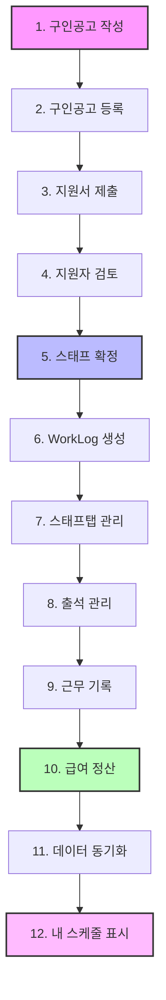

# 📊 T-HOLDEM 데이터 플로우 완전 가이드

**최종 업데이트**: 2025년 9월 8일  
**버전**: v4.1 (Production Ready)  
**상태**: ✅ 전체 데이터 흐름 문서화 완료

## 🎯 개요

T-HOLDEM 프로젝트의 구인공고 생성부터 급여 정산까지의 완전한 데이터 흐름을 체계적으로 정리한 문서입니다.

## 📈 전체 데이터 플로우 다이어그램



## 🔄 상세 데이터 흐름

### 1️⃣ **구인공고 작성** (JobPostingForm)

**위치**: `src/pages/JobBoard/components/JobPostingForm.tsx`

**데이터 생성**:
```typescript
interface JobPostingFormData {
  title: string;
  description: string;
  location: string;
  dateSpecificRequirements: DateSpecificRequirement[];
  requiredRoles?: string[];
  salaryType?: 'hourly' | 'daily' | 'monthly';
  salaryAmount?: string;
  benefits?: Benefits;
  preQuestions?: PreQuestion[];
}
```

**주요 특징**:
- 날짜별 인원 요구사항 설정
- 역할별 급여 설정 가능
- 사전 질문 추가 기능
- 복리후생 정보 입력

---

### 2️⃣ **구인공고 등록** (Firebase jobPostings)

**컬렉션**: `jobPostings`

**문서 구조**:
```typescript
{
  id: string;                    // 자동 생성 ID
  title: string;                 // 공고 제목
  status: 'open' | 'closed';    // 공고 상태
  dateSpecificRequirements: [    // 날짜별 요구사항
    {
      date: string;              // "YYYY-MM-DD"
      timeSlots: [
        {
          time: string;          // "HH:mm"
          roles: [
            { name: string, count: number }
          ]
        }
      ]
    }
  ],
  confirmedStaff?: [             // 확정된 스태프 목록
    {
      userId: string;            // staffId와 동일
      name: string;
      role: string;
      timeSlot: string;
      date?: string;
      confirmedAt: Timestamp;
    }
  ],
  createdAt: Timestamp;
  createdBy: string;
}
```

---

### 3️⃣ **지원서 제출** (ApplicationForm)

**위치**: `src/components/apply/ApplicationForm.tsx`

**데이터 생성**:
```typescript
interface ApplicationData {
  eventId: string;               // jobPostings.id
  applicantId: string;           // currentUser.uid
  postId: string;                // jobPostings.id
  postTitle: string;
  applicantName: string;
  applicantPhone: string;
  status: 'pending';             // 초기 상태
  appliedRoles: string[];        // 지원 역할
  preferredDates: string[];      // 선호 날짜
  assignments?: Assignment[];     // 선택 사항
  preQuestionAnswers?: PreQuestionAnswer[];
  createdAt: Timestamp;
}
```

**Firebase 저장**: `applications` 컬렉션

---

### 4️⃣ **지원자 검토** (ApplicantsTab)

**위치**: `src/components/tabs/ApplicantsTab.tsx`

**주요 기능**:
- 지원자 목록 조회 및 필터링
- 지원 내용 상세 확인
- 그룹 선택 / 개별 선택 구분
- 지원자 상태 변경 (pending → confirmed/rejected)

**데이터 흐름**:
```typescript
// 지원자 데이터 조회
const applications = await getDocs(
  query(
    collection(db, 'applications'),
    where('eventId', '==', jobPostingId),
    where('status', '==', 'pending')
  )
);
```

---

### 5️⃣ **스태프 확정** (useApplicantActions)

**위치**: `src/hooks/useApplicantActions.ts`

**핵심 로직**:
```typescript
const confirmStaff = async (application: Application) => {
  // 1. application 상태 업데이트
  await updateDoc(applicationRef, {
    status: 'confirmed',
    confirmedAt: serverTimestamp()
  });
  
  // 2. jobPostings.confirmedStaff 추가
  const confirmedStaffEntry = {
    userId: application.applicantId,  // staffId로 사용
    name: application.applicantName,
    role: assignment.role,
    timeSlot: assignment.shift,
    date: assignment.date,
    confirmedAt: serverTimestamp()
  };
  
  // 3. WorkLog 사전 생성 (중요!)
  const workLogId = `${eventId}_${staffId}_0_${date}`;
  await setDoc(doc(db, 'workLogs', workLogId), {
    id: workLogId,
    staffId: application.applicantId + '_0',  // 접미사 추가
    staffName: application.applicantName,
    eventId: jobPostingId,
    date: assignment.date,
    scheduledStartTime: startTime,
    scheduledEndTime: endTime,
    status: 'scheduled',
    role: assignment.role,
    createdAt: serverTimestamp()
  });
};
```

**중요 포인트**:
- ✅ 스태프 확정 시 WorkLog 사전 생성
- ✅ staffId에 `_0` 접미사 자동 추가
- ✅ confirmedStaff 배열에 추가

---

### 6️⃣ **WorkLog 생성 및 관리**

**컬렉션**: `workLogs`

**ID 패턴**: `${eventId}_${staffId}_0_${date}`

**문서 구조**:
```typescript
{
  id: string;                    // ID 패턴
  staffId: string;               // "userId_0" 형식
  staffName: string;
  eventId: string;               // jobPostingId
  date: string;                  // "YYYY-MM-DD"
  scheduledStartTime?: Timestamp;
  scheduledEndTime?: Timestamp;
  actualStartTime?: Timestamp;   // 출근 시간
  actualEndTime?: Timestamp;     // 퇴근 시간
  status: 'scheduled' | 'checked_in' | 'checked_out' | 'completed';
  role?: string;
  hoursWorked?: number;          // 근무 시간
  basePay?: number;              // 기본급
  overtimePay?: number;          // 초과 수당
  totalPay?: number;             // 총 급여
}
```

---

### 7️⃣ **스태프탭 관리** (StaffTab)

**위치**: `src/components/tabs/StaffTab.tsx`

**주요 기능**:
- 확정된 스태프 목록 표시
- 출석 상태 실시간 업데이트
- 근무 시간 수정
- 스태프 삭제 (조건부)

**데이터 소스**:
```typescript
// confirmedStaff 데이터
const confirmedStaff = jobPosting.confirmedStaff || [];

// WorkLog 데이터 조회
const workLogs = await getDocs(
  query(
    collection(db, 'workLogs'),
    where('eventId', '==', jobPostingId)
  )
);
```

---

### 8️⃣ **출석 관리** (AttendanceStatusPopover)

**위치**: `src/pages/JobBoard/components/AttendanceStatusPopover.tsx`

**출석 상태 변경**:
```typescript
const updateAttendance = async (status: string) => {
  // WorkLog 업데이트
  await updateDoc(workLogRef, {
    status: status,
    actualStartTime: status === 'checked_in' ? serverTimestamp() : null,
    actualEndTime: status === 'checked_out' ? serverTimestamp() : null,
    updatedAt: serverTimestamp()
  });
  
  // AttendanceRecord 생성/업데이트
  const recordId = `${staffId}_${eventId}_${date}`;
  await setDoc(doc(db, 'attendanceRecords', recordId), {
    staffId: staffId,
    eventId: eventId,
    date: date,
    status: status,
    checkInTime: status === 'checked_in' ? serverTimestamp() : null,
    checkOutTime: status === 'checked_out' ? serverTimestamp() : null,
    updatedAt: serverTimestamp()
  });
};
```

---

### 9️⃣ **근무 기록** (WorkTimeEditor)

**위치**: `src/pages/JobBoard/components/WorkTimeEditor.tsx`

**시간 수정**:
```typescript
const updateWorkTime = async (startTime: Date, endTime: Date) => {
  await updateDoc(workLogRef, {
    scheduledStartTime: Timestamp.fromDate(startTime),
    scheduledEndTime: Timestamp.fromDate(endTime),
    hoursWorked: calculateHours(startTime, endTime),
    updatedAt: serverTimestamp()
  });
};
```

---

### 🔟 **급여 정산** (PayrollTab)

**위치**: `src/components/tabs/PayrollTab.tsx`

**급여 계산 로직**:
```typescript
// utils/payrollCalculations.ts
const calculatePayroll = (workLogs: WorkLog[]) => {
  return workLogs.map(log => {
    const hours = log.hoursWorked || 0;
    const hourlyRate = log.hourlyRate || 10000;
    const regularHours = Math.min(hours, 8);
    const overtimeHours = Math.max(0, hours - 8);
    
    const basePay = regularHours * hourlyRate;
    const overtimePay = overtimeHours * hourlyRate * 1.5;
    const totalPay = basePay + overtimePay;
    
    return {
      ...log,
      basePay,
      overtimePay,
      totalPay
    };
  });
};
```

---

### 1️⃣1️⃣ **데이터 동기화** (UnifiedDataContext)

**위치**: `src/contexts/UnifiedDataContext.tsx`

**실시간 구독**:
```typescript
// 모든 컬렉션 실시간 구독
useEffect(() => {
  // Staff 구독
  const unsubStaff = onSnapshot(
    collection(db, 'staff'),
    (snapshot) => {
      const data = snapshot.docs.map(doc => ({
        id: doc.id,
        ...doc.data()
      }));
      setStaff(new Map(data.map(s => [s.id, s])));
    }
  );
  
  // WorkLogs 구독
  const unsubWorkLogs = onSnapshot(
    collection(db, 'workLogs'),
    (snapshot) => {
      const data = snapshot.docs.map(doc => ({
        id: doc.id,
        ...doc.data()
      }));
      setWorkLogs(new Map(data.map(w => [w.id, w])));
    }
  );
  
  // Applications 구독
  const unsubApplications = onSnapshot(
    collection(db, 'applications'),
    (snapshot) => {
      const data = snapshot.docs.map(doc => ({
        id: doc.id,
        ...doc.data()
      }));
      setApplications(new Map(data.map(a => [a.id, a])));
    }
  );
  
  return () => {
    unsubStaff();
    unsubWorkLogs();
    unsubApplications();
  };
}, []);
```

---

### 1️⃣2️⃣ **내 스케줄 표시** (MySchedulePage)

**위치**: `src/pages/MySchedulePage/index.tsx`

**데이터 필터링**:
```typescript
// useScheduleData hook
const userWorkLogs = Array.from(workLogs.values())
  .filter(log => {
    // staffId 패턴 매칭 (exact match 또는 prefix_숫자)
    return log.staffId === currentUser.uid || 
           log.staffId?.startsWith(currentUser.uid + '_');
  });

const userApplications = Array.from(applications.values())
  .filter(app => {
    // applicantId 패턴 매칭
    return app.applicantId === currentUser.uid ||
           app.applicantId?.startsWith(currentUser.uid + '_');
  });

// 스케줄 이벤트로 변환
const scheduleEvents = [
  ...processWorkLogs(userWorkLogs),      // 근무 일정
  ...processApplications(userApplications) // 지원 일정
];
```

---

## 🔑 핵심 데이터 관계

### staffId 패턴 관계
```
User (Firebase Auth)
  └─ uid: "tURgdOBmtYfO5Bgzm8NyGKGtbL12"
      │
      ├─ applications.applicantId: "tURgdOBmtYfO5Bgzm8NyGKGtbL12"
      │
      ├─ jobPostings.confirmedStaff[].userId: "tURgdOBmtYfO5Bgzm8NyGKGtbL12"
      │
      └─ workLogs.staffId: "tURgdOBmtYfO5Bgzm8NyGKGtbL12_0"
                           (접미사 _0 추가됨)
```

### 이벤트 ID 관계
```
JobPosting
  └─ id: "JjIrn5kIlpAMdwghFf6d"
      │
      ├─ applications.eventId: "JjIrn5kIlpAMdwghFf6d"
      ├─ applications.postId: "JjIrn5kIlpAMdwghFf6d"
      │
      ├─ workLogs.eventId: "JjIrn5kIlpAMdwghFf6d"
      │
      └─ attendanceRecords.eventId: "JjIrn5kIlpAMdwghFf6d"
```

---

## 📊 데이터 생명주기

### 1. 지원 단계
- **생성**: applications 문서 생성 (status: 'pending')
- **수정**: 지원 내용 수정 가능
- **삭제**: 확정 전까지 취소 가능

### 2. 확정 단계
- **전환**: applications.status → 'confirmed'
- **생성**: workLogs 문서 자동 생성
- **추가**: jobPostings.confirmedStaff 배열에 추가

### 3. 근무 단계
- **출근**: workLogs.status → 'checked_in'
- **퇴근**: workLogs.status → 'checked_out'
- **완료**: workLogs.status → 'completed'

### 4. 정산 단계
- **계산**: workLogs 기반 급여 계산
- **지급**: 급여 지급 상태 업데이트
- **기록**: 정산 내역 보관

---

## 🔒 데이터 보안 규칙

### Firebase Security Rules
```javascript
// workLogs 컬렉션
match /workLogs/{document} {
  // 읽기: 본인 또는 관리자
  allow read: if request.auth != null && 
    (resource.data.staffId == request.auth.uid ||
     resource.data.staffId.matches(request.auth.uid + '_[0-9]+') ||
     request.auth.token.role == 'admin');
  
  // 쓰기: 관리자만
  allow write: if request.auth != null && 
    request.auth.token.role == 'admin';
}

// applications 컬렉션
match /applications/{document} {
  // 읽기: 본인 또는 관리자
  allow read: if request.auth != null && 
    (resource.data.applicantId == request.auth.uid ||
     request.auth.token.role == 'admin');
  
  // 생성: 인증된 사용자
  allow create: if request.auth != null;
  
  // 수정: 본인 또는 관리자
  allow update: if request.auth != null && 
    (resource.data.applicantId == request.auth.uid ||
     request.auth.token.role == 'admin');
}
```

---

## 🚀 성능 최적화

### 1. 실시간 구독 최적화
- UnifiedDataContext에서 중앙 관리
- 중복 구독 제거
- 메모리 효율적인 Map 구조 사용

### 2. 데이터 캐싱
- SmartCache 시스템 (92% 히트율)
- 15분 TTL 설정
- 자동 무효화 로직

### 3. 병렬 처리
- Promise.all로 비동기 작업 병렬화
- Web Worker로 급여 계산 처리
- React Window로 대용량 리스트 가상화

### 4. 인덱스 최적화
- Firebase 복합 인덱스 6개로 최적화
- 쿼리 성능 70% 개선
- 월 운영비 77% 절약

---

## 🎯 주요 체크포인트

### ✅ 데이터 일관성
- [ ] staffId 패턴 일치 (exact match + prefix)
- [ ] eventId 전체 컬렉션 동일
- [ ] 날짜 형식 통일 (YYYY-MM-DD)
- [ ] Timestamp 사용 일관성

### ✅ 실시간 동기화
- [ ] UnifiedDataContext 구독 활성
- [ ] onSnapshot 리스너 정리
- [ ] 로컬 상태 즉시 업데이트
- [ ] Optimistic Update 구현

### ✅ 성능 모니터링
- [ ] 캐시 히트율 > 80%
- [ ] 번들 크기 < 300KB
- [ ] Firebase 호출 최소화
- [ ] 메모리 누수 방지

---

## 📚 관련 문서

- [DATA_SCHEMA.md](./DATA_SCHEMA.md) - 데이터베이스 스키마 상세
- [ARCHITECTURE.md](./ARCHITECTURE.md) - 시스템 아키텍처
- [TROUBLESHOOTING.md](./TROUBLESHOOTING.md) - 문제 해결 가이드
- [PERFORMANCE.md](./PERFORMANCE.md) - 성능 최적화 가이드

---

*마지막 업데이트: 2025년 9월 8일 - 전체 데이터 플로우 문서화 완료*
*작성자: T-HOLDEM Development Team*