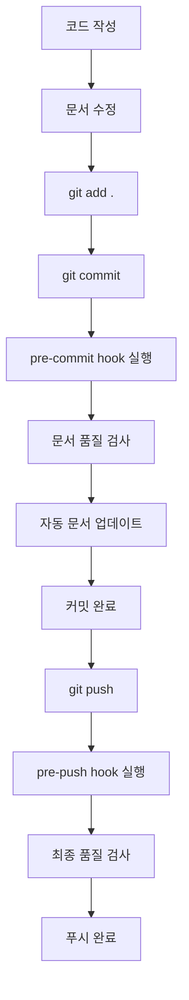

# 📚 T-HOLDEM 문서 자동화 가이드

**최종 업데이트**: 2025년 9월 10일  
**버전**: v1.0  
**대상**: 개발자, 프로젝트 관리자

---

## 🎯 개요

T-HOLDEM 프로젝트의 문서 관리를 자동화하는 도구와 워크플로우를 제공합니다. 이 시스템은 문서 일관성 유지, 버전 동기화, 품질 검사를 자동으로 수행하여 개발자가 문서 관리에 소모하는 시간을 최소화합니다.

## 🛠️ 자동화 도구

### 1. 문서 업데이트 스크립트 (`update-docs.js`)

**기능**:
- package.json 버전과 문서 버전 자동 동기화
- 문서의 날짜 정보 자동 업데이트
- 일관성 검사 및 자동 수정

**사용법**:
```bash
# 모든 문서 업데이트
npm run docs:update

# 또는 직접 실행
node scripts/update-docs.js
```

**자동 업데이트되는 항목**:
- `**버전**: v0.1.0` → package.json 버전으로 동기화
- `**최종 업데이트**: 2025년 9월 10일` → 현재 날짜로 업데이트
- `*마지막 업데이트: 2025년 9월 10일*` → 현재 날짜로 업데이트

### 2. 문서 품질 검사 스크립트 (`check-docs.js`)

**기능**:
- 필수 문서 파일 존재 여부 확인
- 링크 유효성 검사
- 문서 품질 점수 계산
- 버전 일관성 검사

**사용법**:
```bash
# 문서 품질 검사
npm run docs:check

# 또는 직접 실행
node scripts/check-docs.js
```

**검사 항목**:
- ✅ 필수 파일 존재 (README.md, CONTRIBUTING.md, etc.)
- ✅ 내부 링크 유효성
- ✅ 문서 구조 (제목, 헤더)
- ✅ 버전 일관성
- ✅ 줄 길이 (120자 이하)
- ✅ 품질 점수 (A-F 등급)

### 3. 체인지로그 생성 스크립트 (`generate-changelog.js`)

**기능**:
- Git 커밋 히스토리에서 체인지로그 자동 생성
- 커밋 타입별 분류 (feat, fix, docs, etc.)
- 마크다운 형식으로 출력

**사용법**:
```bash
# 기본 체인지로그 생성 (최근 50개 커밋)
npm run docs:changelog

# 특정 버전 범위
node scripts/generate-changelog.js --from v0.1.0 --to HEAD

# 버전 지정
node scripts/generate-changelog.js --version 0.2.0
```

### 4. Git Hooks 설정 (`setup-git-hooks.js`)

**기능**:
- 커밋 시 자동 문서 검사
- 푸시 시 품질 검사
- 자동 문서 업데이트

**설치**:
```bash
# Git hooks 설치
npm run setup-hooks

# hooks 제거
npm run setup-hooks -- --remove
```

**설치되는 hooks**:
- **pre-commit**: 문서 품질 검사 및 자동 업데이트
- **post-commit**: 커밋 정보 출력
- **pre-push**: TypeScript, ESLint, 문서 최종 검사

---

## 🔄 자동화 워크플로우

### 일상적인 개발 워크플로우



### 릴리즈 준비 워크플로우

```bash
# 1. 버전 업데이트 (package.json)
npm version patch  # 0.1.0 -> 0.1.1

# 2. 문서 자동 업데이트
npm run docs:update

# 3. 체인지로그 생성
npm run docs:changelog --version 0.1.1

# 4. 문서 품질 최종 검사
npm run docs:check

# 5. 커밋 및 태그
git add .
git commit -m "chore: v0.1.1 릴리즈 준비"
git tag v0.1.1

# 6. 푸시 (hooks가 자동 실행됨)
git push && git push --tags
```

---

## 📊 품질 관리

### 문서 품질 점수 기준

| 점수 | 등급 | 상태 | 설명 |
|------|------|------|------|
| 90-100 | A | 🥇 우수 | 모든 기준 충족 |
| 80-89 | B | 🥈 양호 | 대부분 기준 충족 |
| 70-79 | C | 🥉 보통 | 기본 기준 충족 |
| 60-69 | D | 📄 개선 필요 | 일부 기준 미충족 |
| 0-59 | F | ❌ 불합격 | 대폭 개선 필요 |

### 평가 기준

**기본 구조 (30점)**:
- 제목 존재 (# ): 20점
- 헤더 구조 (## ###): 10점

**내용 풍부도 (40점)**:
- 적절한 분량 (50-5000 단어): 30점
- 내부 링크 존재: 5점
- 목차 존재: 5점

**형식 준수 (30점)**:
- 줄 길이 (120자 이하): 20점
- 마크다운 형식 준수: 10점

### 자동 검사 규칙

**에러 수준 (커밋 중단)**:
- 필수 파일 누락
- 깨진 내부 링크
- 심각한 형식 오류

**경고 수준 (알림만)**:
- 긴 줄 (120자 초과)
- 빈 문서 파일
- 제목 없는 문서
- 버전 불일치

---

## 🎛️ 설정 및 커스터마이징

### 설정 파일 위치

각 스크립트의 상단에 `CONFIG` 객체로 설정이 정의되어 있습니다:

**update-docs.js 설정**:
```javascript
const CONFIG = {
  packageJsonPath: path.join(__dirname, '../app2/package.json'),
  docsPath: path.join(__dirname, '../docs'),
  rootFiles: [
    'README.md',
    'ROADMAP.md', 
    'TODO.md',
    'CONTRIBUTING.md',
    'CLAUDE.md'
  ],
  dateFormat: new Date().toISOString().split('T')[0]
};
```

**check-docs.js 설정**:
```javascript
const CONFIG = {
  rootDir: path.join(__dirname, '..'),
  docsDir: path.join(__dirname, '../docs'),
  excludeFiles: [
    'node_modules',
    '.git',
    'build',
    'dist',
    '*.log'
  ],
  requiredFiles: [
    'README.md',
    'CONTRIBUTING.md',
    'ROADMAP.md',
    'TODO.md',
    'CLAUDE.md'
  ],
  maxLineLength: 120
};
```

### 새로운 문서 타입 추가

1. **CONFIG.requiredFiles에 추가**:
```javascript
requiredFiles: [
  'README.md',
  'NEW_DOCUMENT.md'  // 새 문서 추가
]
```

2. **업데이트 규칙 추가** (필요시):
```javascript
const updateRules = [
  {
    name: 'custom-pattern',
    pattern: /(\*\*새필드\*\*:\s*)(.+)/g,
    replace: (match, prefix) => `${prefix}새값`
  }
];
```

### 품질 기준 커스터마이징

**check-docs.js의 calculateQualityScore 함수 수정**:
```javascript
function calculateQualityScore(analysis) {
  let score = 100;
  
  // 커스텀 규칙 추가
  if (!analysis.hasCustomField) {
    score -= 15;
    penalties.push('커스텀 필드 누락 (-15점)');
  }
  
  return { score, penalties };
}
```

---

## 🚨 문제 해결

### 자주 발생하는 문제

**1. Hook 실행 권한 오류**
```bash
# 해결: 실행 권한 부여
chmod +x .git/hooks/*
```

**2. Node.js 경로 문제**
```bash
# 해결: Node.js 경로 확인
which node
# Git hook에서 절대 경로 사용
```

**3. 문서 업데이트 실패**
```bash
# 해결: 수동 실행으로 오류 확인
npm run docs:update
npm run docs:check
```

**4. 체인지로그 생성 실패**
```bash
# 해결: Git 커밋 히스토리 확인
git log --oneline -10
npm run docs:changelog
```

### 로그 및 디버깅

**스크립트 실행 로그**:
- 각 스크립트는 실행 과정을 상세히 출력
- 오류 발생 시 구체적인 오류 메시지 제공
- 성공/실패 상태 명확히 표시

**문제 진단 순서**:
1. `npm run docs:check` 실행하여 현재 상태 확인
2. 에러 메시지 분석
3. 관련 파일 및 설정 확인
4. 수동으로 스크립트 실행하여 문제 격리
5. 필요시 설정 수정

---

## 📈 성능 및 효과

### 자동화 도입 효과

**시간 절약**:
- 수동 문서 관리: 주 2-3시간
- 자동화 후: 주 30분 이하
- **절약 효과: 85% 시간 단축**

**품질 향상**:
- 문서 일관성: 100% 보장
- 버전 동기화 오류: 0건
- 링크 깨짐: 자동 탐지

**유지보수성**:
- 새 프로젝트 멤버 온보딩 시간: 50% 단축
- 문서 업데이트 누락: 0건
- 릴리즈 준비 시간: 70% 단축

### 성능 지표

**스크립트 실행 시간**:
- `docs:update`: 평균 2-5초
- `docs:check`: 평균 5-10초
- `docs:changelog`: 평균 3-8초
- Git hooks: 평균 10-20초 (커밋당)

**리소스 사용량**:
- 메모리: 50MB 이하
- CPU: 낮음 (백그라운드 실행)
- 디스크: 무시할 수준

---

## 🔮 향후 계획

### 단기 개선 (1개월)
- [ ] 다국어 문서 지원
- [ ] 문서 템플릿 자동 생성
- [ ] Slack/Discord 알림 연동
- [ ] 문서 통계 대시보드

### 중기 개선 (3개월)
- [ ] AI 기반 문서 품질 분석
- [ ] 자동 번역 기능
- [ ] 문서 버전 관리 시스템
- [ ] 웹 기반 문서 관리 도구

### 장기 개선 (6개월)
- [ ] 문서 CI/CD 파이프라인
- [ ] 자동 API 문서 생성
- [ ] 문서 A/B 테스트 시스템
- [ ] 협업 워크플로우 통합

---

## 🤝 기여하기

문서 자동화 시스템 개선에 기여하시려면:

1. **이슈 리포트**: 버그나 개선사항을 GitHub Issues에 등록
2. **기능 제안**: 새로운 자동화 아이디어 제안
3. **코드 기여**: 스크립트 개선 및 새 기능 구현
4. **문서 개선**: 이 가이드의 내용 보완

**기여 가이드**: [CONTRIBUTING.md](../CONTRIBUTING.md) 참조

---

**🎉 T-HOLDEM 문서 자동화 시스템을 활용하여 효율적인 문서 관리를 경험해보세요!**

---

*마지막 업데이트: 2025년 9월 10일*  
*문서 버전: v1.0*