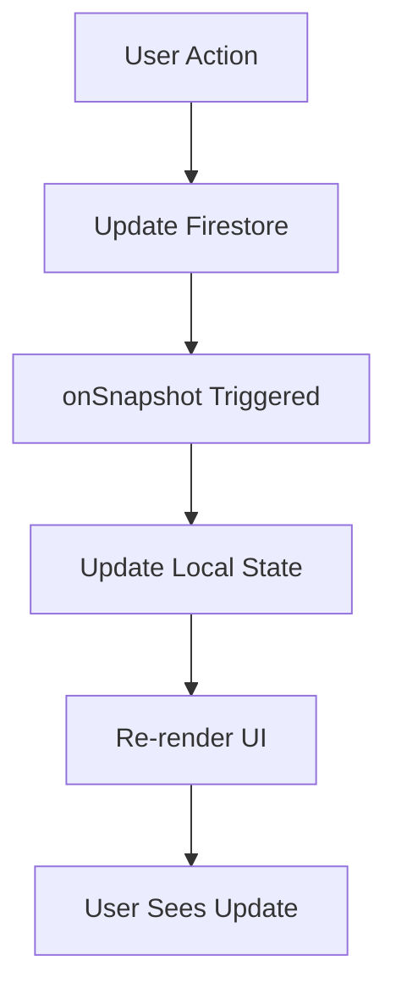

# Firebase 데이터 구조 및 흐름

**최종 업데이트**: 2025년 1월 29일 오후 7시  
**버전**: 4.1 (날짜 형식 표준화 및 UI 개선 반영)

## 📊 데이터 모델 개요

T-HOLDEM은 Firebase Firestore를 사용하여 실시간 데이터 동기화를 구현합니다.  
**ID 표준화 완료: eventId와 userId로 통일되었습니다.**

## 🗂️ 컬렉션 구조 (v4.0 - 서브컬렉션 기반)

### 📁 새로운 서브컬렉션 구조
```
jobPostings/
├── {eventId}/
│   ├── info (문서) - 이벤트 기본 정보
│   ├── staff/ (서브컬렉션)
│   │   └── {userId}/ - 스태프 정보
│   └── workLogs/ (서브컬렉션)
│       └── {workLogId}/ - 근무 기록
```

## 🗂️ 컬렉션 구조 (레거시 - 참고용)

### 1. staff (스태프)
```typescript
interface Staff {
  id: string;              // 문서 ID
  userId: string;          // Firebase Auth UID
  name: string;            // 스태프 이름
  email: string;           // 이메일
  phone: string;           // 전화번호
  role: string;            // 역할 (dealer, manager, etc.)
  createdAt: Timestamp;    // 생성 시간
  updatedAt: Timestamp;    // 수정 시간
}
```

### 2. workLogs (근무 기록)
```typescript
interface WorkLog {
  id: string;              // 문서 ID
  staffId: string;         // 스태프 ID ✅
  staffName: string;       // 스태프 이름 ✅
  eventId: string;         // 이벤트 ID ✅
  date: string;            // 근무 날짜 (YYYY-MM-DD)
  scheduledStartTime: Timestamp;  // 예정 시작 시간
  scheduledEndTime: Timestamp;    // 예정 종료 시간
  actualStartTime?: Timestamp;    // 실제 시작 시간 ✅
  actualEndTime?: Timestamp;      // 실제 종료 시간 ✅
  status: 'not_started' | 'checked_in' | 'checked_out';
  createdAt: Timestamp;
  updatedAt: Timestamp;
  // ❌ 제거된 필드: dealerId, checkInTime, checkOutTime
}
```

### 3. attendanceRecords (출석 기록)
```typescript
interface AttendanceRecord {
  id: string;              // 문서 ID
  staffId: string;         // 스태프 ID ✅
  eventId: string;         // 이벤트 ID ✅
  actualStartTime?: Timestamp;    // 실제 시작 시간 ✅
  actualEndTime?: Timestamp;      // 실제 종료 시간 ✅
  status: 'present' | 'absent' | 'late';
  createdAt: Timestamp;
  // ❌ 제거된 필드: checkInTime, checkOutTime
}
```

### 4. jobPostings (구인공고)
```typescript
interface JobPosting {
  id: string;              // 문서 ID
  title: string;           // 공고 제목
  location: string;        // 장소
  startDate: string;       // 시작일
  endDate: string;         // 종료일
  roles: RoleRequirement[]; // 역할별 요구사항
  status: 'draft' | 'published' | 'closed';
  createdAt: Timestamp;
  updatedAt: Timestamp;
}
```

### 5. applications (지원서)
```typescript
interface Application {
  id: string;              // 문서 ID
  eventId: string;         // 이벤트 ID (표준화 완료) ✅
  applicantId: string;     // 지원자 ID (userId와 동일)
  role: string;            // 지원 역할
  timeSlot: string;        // 지원 시간대
  status: 'pending' | 'confirmed' | 'rejected';
  createdAt: Timestamp;
  // ❌ 제거된 필드: jobPostingId, postId
}
```

### 6. tournaments (토너먼트)
```typescript
interface Tournament {
  id: string;              // 문서 ID
  title: string;           // 토너먼트 명
  date: string;            // 날짜
  status: 'upcoming' | 'ongoing' | 'completed';
  blindLevel: number;      // 블라인드 레벨
  participants: number;    // 참가자 수
  createdAt: Timestamp;
  updatedAt: Timestamp;
}
```

## 🔄 데이터 흐름

### 1. 실시간 구독 패턴
```typescript
// ✅ 올바른 패턴: onSnapshot 사용
const unsubscribe = onSnapshot(
  query(collection(db, 'workLogs'), 
    where('eventId', '==', eventId)
  ),
  (snapshot) => {
    const data = snapshot.docs.map(doc => ({
      id: doc.id,
      ...doc.data()
    }));
    setWorkLogs(data);
  }
);

// ❌ 잘못된 패턴: getDocs 사용
const snapshot = await getDocs(query(...));
```

### 2. 데이터 업데이트 플로우



### 3. 통합 데이터 처리

```typescript
// WorkLog와 Staff 데이터 통합
const enrichedWorkLogs = workLogs.map(log => ({
  ...log,
  staffName: staff.find(s => s.id === log.staffId)?.name,
  // 표준 필드만 사용
}));
```

## 🔐 보안 규칙

### Firestore Security Rules
```javascript
rules_version = '2';
service cloud.firestore {
  match /databases/{database}/documents {
    // 인증된 사용자만 읽기 가능
    match /{document=**} {
      allow read: if request.auth != null;
    }
    
    // 관리자만 쓰기 가능
    match /staff/{staffId} {
      allow write: if request.auth != null && 
        get(/databases/$(database)/documents/users/$(request.auth.uid)).data.role == 'admin';
    }
    
    // WorkLog는 본인 것만 수정 가능
    match /workLogs/{workLogId} {
      allow update: if request.auth != null && 
        resource.data.staffId == request.auth.uid;
    }
  }
}
```

## 📈 성능 최적화

### 1. 인덱스 설정
```yaml
# firestore.indexes.json
{
  "indexes": [
    {
      "collectionGroup": "workLogs",
      "queryScope": "COLLECTION",
      "fields": [
        { "fieldPath": "eventId", "order": "ASCENDING" },
        { "fieldPath": "date", "order": "DESCENDING" }
      ]
    },
    {
      "collectionGroup": "attendanceRecords",
      "queryScope": "COLLECTION",
      "fields": [
        { "fieldPath": "staffId", "order": "ASCENDING" },
        { "fieldPath": "createdAt", "order": "DESCENDING" }
      ]
    }
  ]
}
```

### 2. 쿼리 최적화
```typescript
// ✅ 최적화된 쿼리: 필요한 필드만 선택
const q = query(
  collection(db, 'workLogs'),
  where('eventId', '==', eventId),
  where('date', '==', todayString),
  limit(50)
);

// ❌ 비효율적: 전체 컬렉션 로드
const q = collection(db, 'workLogs');
```

### 3. 캐싱 전략
```typescript
// Firestore 오프라인 지속성 활성화
enableIndexedDbPersistence(db).catch((err) => {
  if (err.code === 'failed-precondition') {
    // 여러 탭이 열려있는 경우
  } else if (err.code === 'unimplemented') {
    // 브라우저가 지원하지 않는 경우
  }
});
```

## 🚨 주의사항

1. **표준 필드 사용**: `staffId`, `eventId`만 사용 (레거시 필드 금지)
2. **실시간 구독**: 항상 `onSnapshot` 사용
3. **에러 처리**: 모든 Firebase 작업에 try-catch 적용
4. **타입 안전성**: TypeScript 인터페이스 정의 필수
5. **성능**: 대량 데이터는 페이지네이션 적용
6. **날짜 형식**: 모든 사용자 대면 날짜는 "8월 25일 (월)" 형식 사용

---

*마지막 업데이트: 2025년 1월 29일 오후 7시*