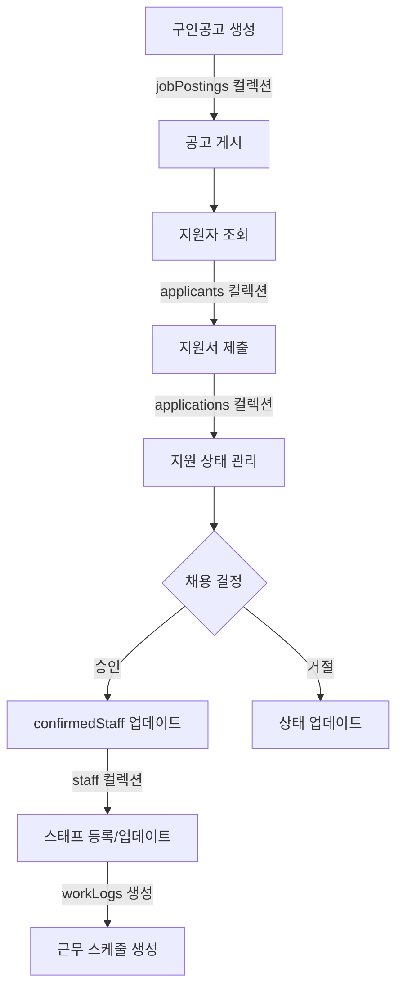
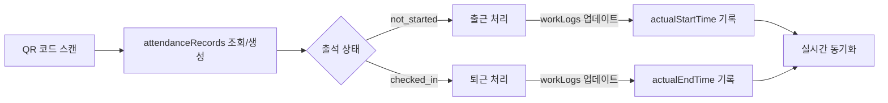
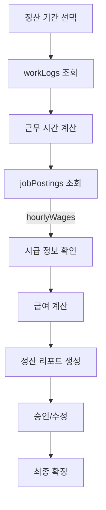

# Firebase 데이터 구조 및 흐름도

## 📊 Firebase Collections 구조

### 1. 핵심 컬렉션

```
Firebase Firestore
├── 📁 jobPostings (구인공고)
│   ├── id: string
│   ├── title: string (공고 제목)
│   ├── location: string (근무지)
│   ├── eventDate: Timestamp (행사 날짜)
│   ├── requiredRoles: string[] (필요 역할)
│   ├── hourlyWages: Record<string, number> (역할별 시급)
│   ├── confirmedStaff: ConfirmedStaff[] (확정 스태프)
│   ├── applicants: string[] (지원자 ID 목록)
│   └── status: 'active' | 'closed' | 'cancelled'
│
├── 📁 staff (스태프 기본 정보)
│   ├── id: string (= staffId)
│   ├── name: string
│   ├── phone: string
│   ├── role: string (기본 역할)
│   ├── email?: string
│   └── createdAt: Timestamp
│
├── 📁 workLogs (근무 기록)
│   ├── id: string
│   ├── staffId: string (스태프 참조)
│   ├── eventId: string (구인공고 참조)
│   ├── date: string (YYYY-MM-DD)
│   ├── scheduledStartTime?: string
│   ├── scheduledEndTime?: string
│   ├── actualStartTime?: string
│   ├── actualEndTime?: string
│   └── status: 'scheduled' | 'working' | 'completed'
│
├── 📁 attendanceRecords (출석 기록)
│   ├── id: string
│   ├── staffId: string
│   ├── eventId: string
│   ├── date: string
│   ├── status: 'not_started' | 'checked_in' | 'checked_out'
│   ├── checkInTime?: Timestamp
│   └── checkOutTime?: Timestamp
│
├── 📁 applications (지원서)
│   ├── id: string
│   ├── jobPostingId: string (구인공고 참조)
│   ├── applicantId: string (지원자 참조)
│   ├── status: 'pending' | 'accepted' | 'rejected'
│   ├── appliedAt: Timestamp
│   └── notes?: string
│
└── 📁 applicants (지원자 정보)
    ├── id: string
    ├── name: string
    ├── phone: string
    ├── email?: string
    ├── availableRoles: string[]
    └── applicationHistory: string[] (지원 이력)
```

## 🔄 데이터 흐름도

### 1. 구인공고 생성 및 지원 프로세스



### 2. 출근/퇴근 관리 흐름



### 3. 급여 정산 프로세스



## 🔗 주요 데이터 관계

### 1. 1:N 관계
- **jobPostings → applications**: 하나의 공고에 여러 지원서
- **staff → workLogs**: 한 스태프의 여러 근무 기록
- **staff → attendanceRecords**: 한 스태프의 여러 출석 기록
- **applicants → applications**: 한 지원자의 여러 지원서

### 2. N:N 관계 (중간 테이블 사용)
- **jobPostings ↔ staff**: confirmedStaff 배열로 관리
- **jobPostings ↔ applicants**: applications 컬렉션으로 연결

### 3. 참조 관계
- **workLogs.staffId** → staff.id
- **workLogs.eventId** → jobPostings.id
- **attendanceRecords.staffId** → staff.id
- **applications.jobPostingId** → jobPostings.id
- **applications.applicantId** → applicants.id

## 🔥 실시간 동기화 구현

### Firebase onSnapshot 구독 위치
```typescript
// 1. 구인공고 실시간 구독
useJobPostings() {
  onSnapshot(collection(db, 'jobPostings'), (snapshot) => {
    // 공고 목록 실시간 업데이트
  });
}

// 2. 스태프 및 근무 기록 구독
useStaffManagement() {
  // staff 컬렉션 구독
  onSnapshot(collection(db, 'staff'), ...);
  
  // workLogs 컬렉션 구독
  onSnapshot(
    query(collection(db, 'workLogs'), 
    where('date', '==', selectedDate)),
    ...
  );
}

// 3. 출석 상태 구독
useAttendanceStatus() {
  onSnapshot(
    query(collection(db, 'attendanceRecords'),
    where('date', '==', selectedDate)),
    ...
  );
}
```

## 📝 데이터 우선순위 규칙

### 시간 데이터 표시 우선순위
1. **workLogs.scheduledStartTime/EndTime** (최우선)
2. **staff.assignedTime** (폴백)
3. **'미정'** (기본값)

### 출석 상태 관리
- **단일 진실 소스**: attendanceRecords.status
- **독립적 관리**: workLogs와 별도로 관리
- **실시간 동기화**: onSnapshot으로 즉시 반영

### 스태프 정보 병합
```typescript
// workLogs 데이터를 우선으로, staff 데이터를 폴백으로 사용
const mergedData = {
  ...staffData,      // 기본 정보
  ...workLogData,    // 날짜별 정보 (덮어쓰기)
  attendanceStatus   // 출석 상태
};
```

## 🚀 성능 최적화 전략

### 1. 쿼리 최적화
- 복합 인덱스 활용: `(date, staffId)`, `(eventId, date)`
- 페이지네이션: 대량 데이터 조회 시 limit/startAfter 사용
- 필터링: where 절로 필요한 데이터만 조회

### 2. 캐싱 전략
- React Query: 5분 staleTime, 10분 gcTime
- 로컬 상태 관리: Zustand로 자주 사용되는 데이터 캐싱

### 3. 실시간 업데이트
- onSnapshot 구독으로 수동 새로고침 제거
- 변경된 문서만 업데이트하는 diff 알고리즘

## 🔒 보안 규칙

### Firestore Security Rules
```javascript
// 읽기 권한: 인증된 사용자만
allow read: if request.auth != null;

// 쓰기 권한: 역할 기반
allow write: if request.auth != null && 
  request.auth.token.role in ['admin', 'manager'];

// 자기 정보 수정: 본인만
allow update: if request.auth.uid == resource.data.userId;
```

## 📊 데이터 일관성 보장

### 트랜잭션 사용 케이스
1. **스태프 확정**: jobPostings.confirmedStaff + staff 생성/업데이트
2. **출근 처리**: attendanceRecords + workLogs 동시 업데이트
3. **지원 승인**: applications.status + jobPostings.confirmedStaff

### 배치 작업
- 여러 문서 동시 업데이트 시 writeBatch() 사용
- 실패 시 전체 롤백으로 일관성 유지