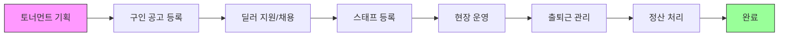

# T-HOLDEM 플랫폼 v2.0 - 워크플로우 및 프로세스 흐름도

## 📋 문서 개요

**문서 버전**: 2.1  
**작성일**: 2025-01-17  
**문서 목적**: T-HOLDEM 플랫폼의 주요 비즈니스 프로세스와 시스템 흐름을 시각화

---

## 🔄 핵심 비즈니스 프로세스

### 1. 전체 운영 프로세스



---

## 👤 사용자별 워크플로우

### 2. 매니저(주최자) 워크플로우

```
┌─────────────────┐
│  토너먼트 기획  │
└────────┬────────┘
         ▼
┌─────────────────┐
│  구인공고 작성  │
│   - 일정 설정   │
│   - 인원 설정   │
│   - 시급 설정   │
└────────┬────────┘
         ▼
┌─────────────────┐
│  지원자 검토    │
│   - 프로필 확인 │
│   - 경력 검토   │
└────────┬────────┘
         ▼
┌─────────────────┐
│   채용 확정     │
│  - 합격자 선정  │
│  - 알림 발송    │
└────────┬────────┘
         ▼
┌─────────────────┐
│  현장 운영      │
│  - QR 코드 생성 │
│  - 출석 모니터링│
└────────┬────────┘
         ▼
┌─────────────────┐
│   정산 처리     │
│  - 근무시간 확인│
│  - 급여 계산    │
│  - 지급 승인    │
└─────────────────┘
```

### 3. 스태프(딜러) 워크플로우

```
┌─────────────────┐
│  공고 탐색      │
│  - 조건 필터링  │
│  - 일정 확인    │
└────────┬────────┘
         ▼
┌─────────────────┐
│   지원 신청     │
│  - 일정 선택    │
│  - 프로필 제출  │
└────────┬────────┘
         ▼
┌─────────────────┐
│  채용 결과 확인 │
│  - 알림 수신    │
│  - 일정 확정    │
└────────┬────────┘
         ▼
┌─────────────────┐
│   출근 체크     │
│  - QR 스캔      │
│  - 위치 인증    │
└────────┬────────┘
         ▼
┌─────────────────┐
│    근무 수행    │
└────────┬────────┘
         ▼
┌─────────────────┐
│   퇴근 체크     │
│  - QR 스캔      │
│  - 시간 기록    │
└────────┬────────┘
         ▼
┌─────────────────┐
│   정산 확인     │
│  - 근무시간 확인│
│  - 급여 내역    │
└─────────────────┘
```

---

## 🔀 시스템 상호작용 흐름

### 4. 구인/구직 매칭 프로세스

```
매니저                  시스템                    딜러
  │                      │                        │
  ├──[공고 등록]────────▶│                        │
  │                      ├──[알림 발송]──────────▶│
  │                      │                        │
  │                      │◀──[지원 신청]──────────┤
  │◀──[지원자 알림]──────┤                        │
  │                      │                        │
  ├──[채용 확정]────────▶│                        │
  │                      ├──[합격 알림]──────────▶│
  │                      ├──[스태프 자동 등록]    │
  │                      │                        │
  │◀──[등록 완료]────────┤                        │
```

### 5. QR 출석 체크 프로세스

```
스태프 앱              QR 시스템              관리자 대시보드
    │                     │                        │
    ├──[QR 스캔]────────▶│                        │
    │                     ├──[위치/시간 검증]      │
    │                     ├──[출근 기록 생성]      │
    │                     │                        │
    │◀──[체크인 성공]─────┤                        │
    │                     ├──[실시간 업데이트]────▶│
    │                     │                        │
    │                     │                        │◀──[모니터링]
    ├──[퇴근 QR 스캔]───▶│                        │
    │                     ├──[퇴근 기록 업데이트]  │
    │◀──[체크아웃 성공]───┤                        │
    │                     ├──[실시간 업데이트]────▶│
```

---

## 💾 데이터 플로우

### 6. Firebase 실시간 동기화

```
┌─────────────────────────────────────────────┐
│              Firebase Firestore              │
├─────────────────────────────────────────────┤
│  Collections:                               │
│  • users                                    │
│  • jobPostings                              │
│  • applications                             │
│  • staff                                    │
│  • workLogs ← [핵심]                        │
│  • attendanceRecords                        │
│  • tournaments                              │
└────────────┬────────────────────────────────┘
             │
     ┌───────┴────────┬────────────┬──────────┐
     ▼                ▼            ▼          ▼
[JobBoardPage]  [StaffManagement] [Attendance] [Payroll]
     │                │            │          │
     └────────────────┴────────────┴──────────┘
                      │
              [onSnapshot 구독]
                      │
                 [실시간 UI 업데이트]
```

### 7. workLogs 중심 데이터 구조

```
workLogs Collection (날짜별 독립 관리)
├── Document ID: auto-generated
│   ├── staffId: string
│   ├── staffName: string
│   ├── date: string (YYYY-MM-DD)
│   ├── eventId?: string
│   ├── scheduledStartTime?: string
│   ├── scheduledEndTime?: string
│   ├── actualStartTime?: string
│   ├── actualEndTime?: string
│   ├── status: 'not_started' | 'checked_in' | 'checked_out'
│   └── timestamps
│
└── 실시간 구독
    ├── useStaffManagement Hook
    ├── useAttendanceStatus Hook
    └── useSimplePayroll Hook
```

---

## 📊 상태 관리 플로우

### 8. Context API + Zustand 하이브리드

```
┌──────────────────────────────────┐
│         전역 상태 관리            │
├──────────────────────────────────┤
│  Context API:                    │
│  • AuthContext (사용자 인증)      │
│  • TournamentContext (대회 정보)  │
│                                  │
│  Zustand:                        │
│  • toastStore (알림 메시지)       │
│  • jobPostingStore (구인공고)     │
└──────────────────────────────────┘
            │
    ┌───────┴────────┬──────────┐
    ▼                ▼          ▼
[Components]    [Pages]    [Hooks]
```

### 9. 컴포넌트 통신 패턴

```
Parent Component
    │
    ├── Props Drilling (1-2 depth)
    │   └── Child Component
    │
    ├── Context (3+ depth)
    │   └── Deep Child Component
    │
    └── Zustand (Cross-cutting)
        └── Any Component
```

---

## 🔐 인증/권한 플로우

### 10. 로그인 및 권한 확인

```
사용자 → [로그인 페이지]
            │
            ▼
    [Firebase Auth 인증]
            │
    ┌───────┴────────┐
    ▼                ▼
[성공]            [실패]
    │                │
    ▼                ▼
[Firestore         [에러 메시지]
 프로필 조회]           │
    │                   └──→ [재시도]
    ▼
[권한 확인]
    │
    ├── Admin → [관리자 대시보드]
    ├── Manager → [매니저 대시보드]
    └── Staff → [스태프 페이지]
```

### 11. 보호된 라우트 접근

```
사용자 요청 → [PrivateRoute]
                  │
                  ▼
            [인증 상태 확인]
                  │
        ┌─────────┴──────────┐
        ▼                    ▼
    [인증됨]              [미인증]
        │                    │
        ▼                    ▼
  [RoleBasedRoute]      [로그인 리다이렉트]
        │
        ▼
   [권한 확인]
        │
   ┌────┴────┐
   ▼         ▼
[허용]    [거부]
   │         │
   ▼         ▼
[페이지]  [403 에러]
```

---

## ⚡ 성능 최적화 플로우

### 12. 번들 로딩 최적화

```
Initial Load
    │
    ▼
[Critical Bundle]
• React Core
• Router
• Auth
• Main Layout
    │
    ▼
[Lazy Load] ─── Parallel ───▶ [Code Split Bundles]
                              • JobBoard.chunk.js
                              • Dashboard.chunk.js
                              • Payroll.chunk.js
    │
    ▼
[Route Activation]
    │
    ▼
[Dynamic Import]
    │
    ▼
[Component Render]
```

### 13. Firebase 쿼리 최적화

```
Component Mount
    │
    ▼
[Initial Query]
• Indexed fields
• Limit(10)
• OrderBy
    │
    ▼
[Snapshot Listener]
    │
    ├── [Added] ──→ [Append to List]
    ├── [Modified] ──→ [Update Item]
    └── [Removed] ──→ [Remove from List]
    │
    ▼
[Component Unmount]
    │
    ▼
[Unsubscribe]
```

---

## 🚨 에러 처리 플로우

### 14. 전역 에러 처리

```
Error Occurrence
    │
    ▼
[Error Boundary]
    │
    ├── [Firebase Error] ──→ [FirebaseErrorBoundary]
    │                            │
    │                            ▼
    │                        [Auto Recovery]
    │                            │
    │                            ├── [Success] ──→ [Resume]
    │                            └── [Fail] ──→ [Fallback UI]
    │
    ├── [Network Error] ──→ [Retry Logic]
    │                           │
    │                           ▼
    │                       [3 Retries]
    │                           │
    │                           ├── [Success] ──→ [Continue]
    │                           └── [Fail] ──→ [Offline Mode]
    │
    └── [Unknown Error] ──→ [Sentry Report]
                               │
                               ▼
                           [Error Page]
```

### 15. 폼 검증 플로우

```
User Input
    │
    ▼
[Client Validation]
    │
    ├── [Valid] ──────────────→ [Submit]
    │                               │
    └── [Invalid]                   ▼
         │                    [Server Validation]
         ▼                          │
    [Error Message]                 ├── [Success] ──→ [Process]
         │                          │
         ▼                          └── [Fail] ──→ [Error Response]
    [Field Highlight]                                    │
         │                                              ▼
         ▼                                        [Display Error]
    [Focus Field]
```

---

## 📱 모바일 반응형 플로우

### 16. 디바이스별 레이아웃 전환

```
Device Detection
    │
    ├── Mobile (<640px)
    │   ├── Single Column
    │   ├── Stacked Cards
    │   ├── Bottom Navigation
    │   └── Touch Gestures
    │
    ├── Tablet (640-1024px)
    │   ├── Two Column
    │   ├── Side Navigation
    │   └── Mixed Layout
    │
    └── Desktop (>1024px)
        ├── Multi Column
        ├── Top Navigation
        └── Full Features
```

---

## 🔄 CI/CD 파이프라인

### 17. 배포 프로세스

```
Developer Push → GitHub
                   │
                   ▼
            [GitHub Actions]
                   │
        ┌──────────┴──────────┐
        ▼                     ▼
    [main branch]         [feature branch]
        │                     │
        ▼                     ▼
    [Production]          [Preview]
        │                     │
        ├── npm ci            ├── npm ci
        ├── npm test          ├── npm test
        ├── npm build         └── npm build
        ├── Firebase Deploy
        └── Sentry Release
```

---

## 📈 모니터링 플로우

### 18. 실시간 모니터링 시스템

```
Application
    │
    ├── Performance Metrics ──→ [PerformanceMonitor]
    │                                │
    │                                ▼
    │                          [Web Vitals]
    │                          • FCP
    │                          • LCP
    │                          • CLS
    │                                │
    │                                ▼
    │                          [Dashboard]
    │
    ├── Error Tracking ──────→ [Sentry]
    │                                │
    │                                ▼
    │                          [Alert Rules]
    │                                │
    │                                ▼
    │                          [Notifications]
    │
    └── User Analytics ──────→ [Google Analytics]
                                     │
                                     ▼
                               [Reports]
```

---

## 🔧 개발 워크플로우

### 19. 기능 개발 프로세스

```
1. 요구사항 분석
       │
       ▼
2. 기술 설계
       │
       ├── TypeScript Interface 정의
       ├── Firebase 스키마 설계
       └── 컴포넌트 구조 계획
       │
       ▼
3. 구현
       │
       ├── Feature Branch 생성
       ├── TDD (Test First)
       ├── 컴포넌트 개발
       └── Hook 구현
       │
       ▼
4. 테스트
       │
       ├── Unit Tests
       ├── Integration Tests
       └── Manual Testing
       │
       ▼
5. 코드 리뷰
       │
       ├── ESLint Check
       ├── TypeScript Check
       └── PR Review
       │
       ▼
6. 배포
       │
       ├── Merge to main
       ├── CI/CD Pipeline
       └── Production Deploy
```

### 20. 버그 수정 프로세스

```
Bug Report
    │
    ▼
[재현 시도]
    │
    ├── [재현 성공] ──→ [원인 분석]
    │                       │
    │                       ▼
    │                   [수정 구현]
    │                       │
    │                       ▼
    │                   [테스트]
    │                       │
    │                       ▼
    │                   [배포]
    │
    └── [재현 실패] ──→ [추가 정보 요청]
                            │
                            ▼
                        [로그 분석]
```

---

## 📝 부록

### A. 플로우차트 범례

```
┌─────┐  프로세스/액션
│     │
└─────┘

◇       결정 포인트

──→     플로우 방향

[Name]  시스템/컴포넌트

• Item  리스트 항목
```

### B. 주요 Hook 플로우

```typescript
// useStaffManagement
Component → Hook → Firebase Query → Snapshot → State Update → Re-render

// useSimplePayroll
Date Range → workLogs Query → Calculate → Aggregate → Display

// usePermissions
User Role → Permission Check → Resource Access → UI Update
```

### C. 상태 코드 참조

```typescript
// 출석 상태
'not_started' → 'checked_in' → 'checked_out'

// 지원 상태
'pending' → 'accepted' | 'rejected'

// 공고 상태
'draft' → 'open' → 'closed'
```

---

**© 2025 T-HOLDEM. All rights reserved.**