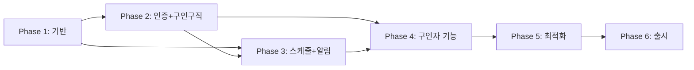

> 아카이브 문서
>
> 이 문서는 현재 운영 기준이 아니라 설계, 기록, 레거시 참고 또는 시점 한정 로그입니다.
> 현재 기준 문서는 `README.md`, `docs/README.md`, `docs/reference/ARCHITECTURE.md`, `docs/guides/DEPLOYMENT.md`를 우선 확인하세요.
# UNIQN React Native App - 설계 문서

## 프로젝트 개요

**프로젝트명**: UNIQN Mobile
**플랫폼**: iOS, Android, Web (Expo)
**기술 스택**: React Native + Expo + TypeScript
**시작일**: 2024년 12월
**현재 버전**: v1.0.0
**마지막 업데이트**: 2026년 2월

---

## 구현 완료 기능

### Phase 1 완료 (v1.0.0)
| 기능 | 상태 | 구현 파일 |
|------|------|----------|
| 로그인/회원가입 | ✅ 완료 | auth/, authService |
| 내 프로필 | ✅ 완료 | profile/, settings/ |
| 내 스케줄 | ✅ 완료 | schedule/, scheduleService |
| 구인구직 | ✅ 완료 | jobs/, jobService |
| 고객센터 | ✅ 완료 | support/, inquiryService |
| 공고관리 | ✅ 완료 | employer/, jobManagementService |
| 설정 페이지 | ✅ 완료 | settings/ (10개 하위 화면) |
| 알림 | ✅ 완료 | notifications/, notificationService |
| 다크모드 | ✅ 완료 | themeStore, NativeWind |
| QR 코드 | ✅ 완료 | qr/, eventQRService |
| 지원자 관리 | ✅ 완료 | applicant/, applicantManagementService |
| 정산 관리 | ✅ 완료 | employer/settlements/, settlementService |
| 관리자: 사용자관리 | ✅ 완료 | admin/users/ |
| 관리자: 문의관리 | ✅ 완료 | admin/inquiries/ |
| 관리자: 공지관리 | ✅ 완료 | admin/announcements/ |
| 관리자: 신고관리 | ✅ 완료 | admin/reports/ |
| 관리자: 대회승인 | ✅ 완료 | admin/tournaments/ |

### Phase 2 (미구현)
- 토너먼트 관리 시스템 (app2/ 참고용 보관)
- 테이블 관리
- 참가자 관리

> **전략**: React Native + Expo로 iOS, Android, Web 단일 코드베이스 구축 완료.
> 기존 웹앱(app2/)은 토너먼트 로직 참고용으로만 보관.

---

## 기술 스택

> ⚠️ **버전 고정 필수**: 호환성 문제 방지를 위해 아래 버전 준수
> (현재 구현 기준 - 2026년 2월)

```yaml
Core:
  - React Native: 0.81.5       # Expo SDK 54 기준
  - Expo: SDK 54               # 최신 안정 버전
  - React: 19.1.0              # React 19
  - TypeScript: 5.9.2          # strict 모드

Navigation:
  - Expo Router: 6.0.23 (파일 기반 라우팅)

State Management:
  - Zustand: 5.0.9 (전역 상태, MMKV persist)
  - TanStack Query: 5.90.12 (서버 상태, v5 API)

Backend:
  - Firebase: 12.6.0 (Web SDK Modular API)
  - Firebase Auth: 인증
  - Cloud Firestore: 데이터베이스
  - Cloud Functions: 서버리스 함수
  - Cloud Storage: 파일 저장
  - Sentry: 7.2.0 (에러 모니터링)

UI/Styling:
  - NativeWind: 4.2.1 (Tailwind CSS)
  - Tailwind CSS: 3.4.19
  - React Native Reanimated: 4.1.1 (애니메이션)
  - React Native Gesture Handler: 2.28.0 (제스처)
  - @gorhom/bottom-sheet: 5.2.8

Forms & Validation:
  - React Hook Form: 7.68.0 (Zod 연동)
  - Zod: 4.1.13 (스키마 검증)

Storage:
  - react-native-mmkv: 4.1.2 (고성능 저장소)
  - expo-secure-store: 15.0.8 (보안 저장소)

Utilities:
  - date-fns: 4.1.0 (날짜 처리)
  - expo-camera: 17.0.10 (QR 스캐닝)
  - expo-notifications: 0.32.16 (푸시 알림)
  - @shopify/flash-list: 2.0.2 (가상화 리스트)
  - expo-image: 3.0.11 (이미지 최적화)
```

---

## 프로젝트 구조 (현재 구현 기준)

```
uniqn-mobile/
├── app/                           # Expo Router (68개 라우트)
│   ├── _layout.tsx               # Root Layout (5단계 Provider)
│   ├── index.tsx                 # 스플래시 화면
│   ├── +not-found.tsx            # 404 페이지
│   │
│   ├── (public)/                 # 비로그인 접근 가능
│   │   ├── _layout.tsx
│   │   └── jobs/
│   │       ├── index.tsx         # 공고 목록 (비로그인)
│   │       └── [id].tsx          # 공고 상세 (비로그인)
│   │
│   ├── (auth)/                   # 인증 플로우
│   │   ├── _layout.tsx
│   │   ├── login.tsx
│   │   ├── signup.tsx
│   │   └── forgot-password.tsx
│   │
│   ├── (app)/                    # 로그인 필수 (staff+)
│   │   ├── _layout.tsx
│   │   ├── notifications.tsx     # 알림
│   │   ├── employer-register.tsx # 구인자 등록
│   │   │
│   │   ├── (tabs)/               # 탭 네비게이션 (5개)
│   │   │   ├── _layout.tsx
│   │   │   ├── index.tsx         # 구인구직 (홈)
│   │   │   ├── schedule.tsx      # 내 스케줄
│   │   │   ├── qr.tsx            # QR 스캔
│   │   │   ├── employer.tsx      # 내 공고 (구인자용)
│   │   │   └── profile.tsx       # 프로필
│   │   │
│   │   ├── jobs/[id]/            # 공고 관련
│   │   │   ├── index.tsx         # 공고 상세
│   │   │   └── apply.tsx         # 공고 지원
│   │   │
│   │   ├── applications/[id]/    # 지원 관리
│   │   │   └── cancel.tsx        # 지원 취소
│   │   │
│   │   ├── notices/              # 공지사항
│   │   ├── support/              # 고객지원
│   │   └── settings/             # 설정 (10개 하위 화면)
│   │
│   ├── (employer)/               # 구인자 전용 (employer+)
│   │   ├── _layout.tsx
│   │   └── my-postings/
│   │       ├── index.tsx         # 공고 목록
│   │       ├── create.tsx        # 공고 생성
│   │       └── [id]/
│   │           ├── index.tsx     # 공고 상세
│   │           ├── edit.tsx      # 공고 수정
│   │           ├── applicants.tsx    # 지원자 관리
│   │           ├── cancellation-requests.tsx  # 취소 요청
│   │           └── settlements.tsx   # 정산 관리
│   │
│   └── (admin)/                  # 관리자 전용 (admin)
│       ├── _layout.tsx
│       ├── index.tsx
│       ├── users/                # 사용자 관리
│       ├── reports/              # 신고 관리
│       ├── announcements/        # 공지 관리
│       ├── tournaments/          # 대회공고 승인
│       ├── inquiries/            # 문의 관리
│       └── stats/                # 통계
│
├── src/
│   ├── components/               # 245개 (20개 폴더)
│   │   ├── ui/                   # 기본 UI 컴포넌트
│   │   ├── employer/             # 구인자 전용 ⭐ 가장 많음
│   │   ├── jobs/                 # 공고 관련
│   │   ├── auth/                 # 인증
│   │   ├── admin/                # 관리자
│   │   ├── schedule/             # 스케줄
│   │   ├── applicant/            # 지원자 관리
│   │   ├── applications/         # 지원 내역
│   │   ├── notifications/        # 알림
│   │   ├── support/              # 고객지원
│   │   ├── profile/              # 프로필
│   │   ├── settings/             # 설정
│   │   ├── qr/                   # QR 코드
│   │   ├── notices/              # 공지사항
│   │   ├── modals/               # 모달
│   │   ├── headers/              # 헤더
│   │   ├── navigation/           # 네비게이션
│   │   ├── icons/                # 아이콘
│   │   ├── onboarding/           # 온보딩
│   │   └── lazy/                 # 지연 로딩
│   │
│   ├── hooks/                    # 49개 커스텀 훅
│   │   ├── useAuth.ts, useAuthGuard.ts
│   │   ├── useJobPostings.ts, useJobDetail.ts
│   │   ├── useApplications.ts
│   │   ├── useSchedules.ts (8개 함수)
│   │   ├── useNotifications.ts (9개 함수)
│   │   ├── useSettlement.ts (10개 함수)
│   │   ├── applicant/ (지원자 관리 훅 폴더)
│   │   └── ...
│   │
│   ├── stores/                   # 8개 Zustand 스토어
│   │   ├── authStore.ts          # 인증 상태
│   │   ├── themeStore.ts         # 테마
│   │   ├── toastStore.ts         # Toast 알림
│   │   ├── modalStore.ts         # 모달 스택
│   │   ├── notificationStore.ts  # 알림
│   │   ├── inAppMessageStore.ts  # 인앱 메시지
│   │   ├── bookmarkStore.ts      # 북마크
│   │   ├── tabFiltersStore.ts    # 탭 필터
│   │   └── index.ts
│   │
│   ├── services/                 # 43개 비즈니스 서비스
│   │   ├── authService.ts
│   │   ├── jobService.ts
│   │   ├── applicationService.ts # v2.0 Assignment
│   │   ├── scheduleService.ts
│   │   ├── workLogService.ts
│   │   ├── notificationService.ts
│   │   ├── settlementService.ts
│   │   ├── pushNotificationService.ts
│   │   ├── deepLinkService.ts
│   │   └── ...
│   │
│   ├── repositories/             # 22개 (Repository 패턴: 인터페이스 11 + 구현체 11)
│   │   ├── interfaces/           # 11개 인터페이스
│   │   │   ├── IAdminRepository.ts
│   │   │   ├── IAnnouncementRepository.ts
│   │   │   ├── IApplicationRepository.ts
│   │   │   ├── IConfirmedStaffRepository.ts
│   │   │   ├── IEventQRRepository.ts
│   │   │   ├── IJobPostingRepository.ts
│   │   │   ├── INotificationRepository.ts
│   │   │   ├── IReportRepository.ts
│   │   │   ├── ISettlementRepository.ts
│   │   │   ├── IUserRepository.ts
│   │   │   └── IWorkLogRepository.ts
│   │   └── firebase/             # 11개 구현체
│   │       ├── AdminRepository.ts
│   │       ├── AnnouncementRepository.ts
│   │       ├── ApplicationRepository.ts
│   │       ├── ConfirmedStaffRepository.ts
│   │       ├── EventQRRepository.ts
│   │       ├── JobPostingRepository.ts
│   │       ├── NotificationRepository.ts
│   │       ├── ReportRepository.ts
│   │       ├── SettlementRepository.ts
│   │       ├── UserRepository.ts
│   │       └── WorkLogRepository.ts
│   │
│   ├── shared/                   # 26개 공유 모듈 (9개 도메인)
│   │   ├── id/                   # IdNormalizer
│   │   ├── role/                 # RoleResolver
│   │   ├── status/               # StatusMapper
│   │   ├── time/                 # TimeNormalizer
│   │   ├── realtime/             # RealtimeManager
│   │   ├── deeplink/             # RouteMapper
│   │   └── errors/               # hookErrorHandler
│   │
│   ├── domains/                  # 14개 도메인 모듈
│   │   ├── application/          # ApplicationStatusMachine
│   │   ├── schedule/             # ScheduleMerger, WorkLogCreator
│   │   ├── settlement/           # SettlementCalculator, TaxCalculator
│   │   └── ...
│   │
│   ├── errors/                   # 에러 시스템 (8개)
│   │   ├── AppError.ts           # 기본 에러 클래스
│   │   ├── BusinessErrors.ts     # 비즈니스 로직 에러 (20+ 클래스)
│   │   ├── NotificationErrors.ts # 알림 관련 에러
│   │   ├── errorUtils.ts         # 에러 유틸리티
│   │   ├── firebaseErrorMapper.ts# Firebase 에러 변환
│   │   ├── guardErrors.ts        # 가드 에러
│   │   ├── serviceErrorHandler.ts# 서비스 에러 처리
│   │   └── index.ts              # 배럴 export
│   │
│   ├── types/                    # 28개 타입 정의
│   ├── schemas/                  # 19개 Zod 스키마
│   ├── utils/                    # 36개 유틸리티
│   ├── constants/                # 9개 상수
│   │
│   ├── lib/                      # 7개 라이브러리 설정
│   │   ├── firebase.ts           # 지연 초기화, Proxy 패턴
│   │   ├── queryClient.ts        # Query Keys 중앙 관리
│   │   ├── mmkvStorage.ts        # MMKV 저장소
│   │   ├── secureStorage.ts      # Secure Storage
│   │   └── ...                   # 기타 설정
│   │
│   └── config/                   # 3개 환경설정
│       └── env.ts                # 환경변수
│
├── assets/                       # 정적 자산
├── __tests__/                    # 테스트
├── __mocks__/                    # 모킹 설정
│
├── app.json                      # Expo 설정
├── eas.json                      # EAS Build 설정
├── tailwind.config.js            # NativeWind 설정
├── tsconfig.json
└── package.json
```

### 코드 통계 (v1.0.0 기준)

| 항목 | 개수 | 설명 |
|------|------|------|
| **라우트 파일 (app/)** | 68개 | Expo Router 파일 기반 라우팅 |
| **컴포넌트** | 245개 | 20개 폴더로 구성 |
| **커스텀 훅** | 49개 | 화면별 데이터/상태 관리 |
| **서비스** | 43개 | 비즈니스 로직 |
| **Zustand 스토어** | 8개 | 전역 상태 (MMKV persist) |
| **Repository** | 22개 | 데이터 접근 추상화 (인터페이스 11 + 구현체 11) |
| **공유 모듈** | 26개 | IdNormalizer, RoleResolver 등 (9개 도메인) |
| **도메인 모듈** | 14개 | StatusMachine, Calculator 등 |
| **에러 시스템** | 8개 | AppError 계층 (errors/ 8) |
| **타입 파일** | 27개 | TypeScript 타입 정의 |
| **Zod 스키마** | 18개 | 폼 검증 스키마 |
| **유틸리티** | 37개 | 포매터, 헬퍼 함수 |
| **상수** | 10개 | 공통 상수 정의 |
| **라이브러리 설정** | 7개 | Firebase, QueryClient 등 |
| **환경설정** | 3개 | env, config |
| **전체 src 파일** | 522개 | TypeScript/TSX |

---

## 코드 재사용 계획

### 100% 재사용 (복사)
```
기존 app2/src/ → 새 src/
├── types/           → types/        (타입 정의)
├── schemas/         → schemas/      (Zod 스키마)
├── utils/           → utils/        (유틸리티 함수)
└── services/        → services/     (비즈니스 로직 - 일부 수정)
```

### 70-90% 재사용 (수정 필요)
```
├── hooks/           → hooks/        (React Native 호환 수정)
├── stores/          → stores/       (거의 그대로)
└── contexts/        → hooks/        (Context → Zustand 통합)
```

### 0-20% 재사용 (재작성)
```
├── components/      → components/   (UI 전면 재작성)
└── pages/           → app/          (네비게이션 구조 변경)
```

---

## 개선 목표

### 아키텍처 개선
1. **Provider 지옥 해소**: 8단계 중첩 → 2-3단계로 단순화
2. **상태 관리 통합**: Context + Zustand + React Query → Zustand + React Query
3. **권한 시스템 중앙화**: 분산된 권한 체크 → PermissionService 단일화

### 코드 품질 개선
1. **검증 로직 통합**: 3가지 검증 방식 → Zod 단일화
2. **모달 시스템 개선**: 분산된 상태 → 중앙 모달 매니저
3. **에러 처리 표준화**: 일관된 에러 핸들링 패턴

### 성능 개선
1. **리스트 가상화**: FlashList 적용
2. **이미지 최적화**: expo-image 활용
3. **번들 최적화**: 트리 쉐이킹, 코드 스플리팅

### UX 개선
1. **네이티브 패턴**: iOS/Android 네이티브 UX 적용
2. **오프라인 지원**: 기본적인 오프라인 기능
3. **애니메이션**: 자연스러운 전환 효과

---

## 설계 문서 목록

### 핵심 아키텍처 (01-07)
| 문서 | 설명 |
|------|------|
| [01-architecture.md](./01-architecture.md) | 전체 아키텍처 설계 |
| [02-navigation.md](./02-navigation.md) | 네비게이션 구조 |
| [03-state-management.md](./03-state-management.md) | 상태 관리 전략 |
| [04-screens.md](./04-screens.md) | 화면별 상세 설계 |
| [05-components.md](./05-components.md) | 컴포넌트 시스템 |
| [06-firebase.md](./06-firebase.md) | Firebase 연동 전략 |
| [07-improvements.md](./07-improvements.md) | 기존 문제점 개선 방안 |

### 데이터 및 에러 처리 (08-09)
| 문서 | 설명 |
|------|------|
| [08-data-flow.md](./08-data-flow.md) | 데이터 흐름 패턴 |
| [09-error-handling.md](./09-error-handling.md) | 에러 처리 전략 |

### 사용자 경험 (10-11)
| 문서 | 설명 |
|------|------|
| [10-notifications.md](./10-notifications.md) | 푸시 알림 시스템 |
| [11-ux-guidelines.md](./11-ux-guidelines.md) | UX 가이드라인 |

### 보안 및 테스트 (12-13)
| 문서 | 설명 |
|------|------|
| [12-security.md](./12-security.md) | 보안 설계 (인증, 인증서 피닝, 앱 무결성) |
| [13-testing-strategy.md](./13-testing-strategy.md) | 테스트 전략 (Unit, Integration, E2E) |

### 배포 및 마이그레이션 (14-15)
| 문서 | 설명 |
|------|------|
| [14-migration-plan.md](./14-migration-plan.md) | 마이그레이션 계획 (완전 교체 전략) |
| [15-cicd.md](./15-cicd.md) | CI/CD 파이프라인 (EAS, 스토어 자동화) |

### 분석 및 앱스토어 (16-18)
| 문서 | 설명 |
|------|------|
| [16-analytics.md](./16-analytics.md) | 분석 시스템 (Firebase Analytics, Crashlytics) |
| [17-deep-linking.md](./17-deep-linking.md) | 딥링킹 (Universal Links, App Links) |
| [18-app-store-guide.md](./18-app-store-guide.md) | 앱스토어 심사 가이드 |

### 접근성, 오프라인 및 웹 (19-21)
| 문서 | 설명 |
|------|------|
| [19-accessibility.md](./19-accessibility.md) | 접근성 (WCAG 2.1 AA, VoiceOver/TalkBack) |
| [20-offline-caching.md](./20-offline-caching.md) | 오프라인 지원 및 캐싱 전략 |
| [21-react-native-web.md](./21-react-native-web.md) | React Native Web 전략 (Expo Web) |

### 마이그레이션 상세 (22-23)
| 문서 | 설명 |
|------|------|
| [22-migration-mapping.md](./22-migration-mapping.md) | 코드 변환 매핑 (app2/ → RN, 개선점 분석) |
| [23-api-reference.md](./23-api-reference.md) | Firestore 스키마 및 API 참조 |

---

## 개발 완료 현황

| Phase | 상태 | 내용 |
|-------|------|------|
| **Setup** | ✅ 완료 | 프로젝트 초기화, Firebase 연동 |
| **Core** | ✅ 완료 | 인증, 네비게이션, 테마 시스템 |
| **Profile & Settings** | ✅ 완료 | 프로필, 설정 페이지 (10개 하위 화면) |
| **Job Board** | ✅ 완료 | 구인구직, 지원 시스템, 북마크 |
| **Schedule** | ✅ 완료 | 내 스케줄, 캘린더, 근무 기록 |
| **Job Management** | ✅ 완료 | 공고관리, 지원자관리, 정산 |
| **Admin** | ✅ 완료 | 사용자/신고/공지/문의/대회 관리 |
| **QR System** | ✅ 완료 | QR 생성/스캔, 출퇴근 처리 |
| **Notifications** | ✅ 완료 | 푸시알림, 인앱메시지, 실시간 구독 |

**v1.0.0 릴리스 완료** (2026년 2월)
 # 01. 아키텍처 설계

> **마지막 업데이트**: 2026년 2월

## 전체 아키텍처 (7단계 레이어)

```
┌─────────────────────────────────────────────────────────────────┐
│                        UNIQN Mobile App                         │
├─────────────────────────────────────────────────────────────────┤
│                                                                 │
│  ┌─────────────────────────────────────────────────────────┐   │
│  │                  Presentation Layer                      │   │
│  │  ┌─────────┐  ┌─────────┐  ┌─────────┐  ┌─────────┐    │   │
│  │  │ app/    │  │Components│  │  Modals │  │   UI    │    │   │
│  │  │ (68개)  │  │ (245개) │  │         │  │         │    │   │
│  │  └────┬────┘  └────┬────┘  └────┬────┘  └────┬────┘    │   │
│  └───────┼────────────┼────────────┼────────────┼──────────┘   │
│          │            │            │            │               │
│  ┌───────┴────────────┴────────────┴────────────┴──────────┐   │
│  │                      Hooks Layer (49개)                  │   │
│  │  ┌──────────┐  ┌──────────┐  ┌──────────┐  ┌──────────┐│   │
│  │  │ useAuth  │  │ useJobs  │  │useSchedule│  │useSettle ││   │
│  │  │ +Guard   │  │ +Detail  │  │ (8함수)  │  │ (10함수) ││   │
│  │  └────┬─────┘  └────┬─────┘  └────┬─────┘  └────┬─────┘│   │
│  └───────┼─────────────┼─────────────┼─────────────┼───────┘   │
│          │             │             │             │            │
│  ┌───────┴─────────────┴─────────────┴─────────────┴────────┐  │
│  │                    State Layer                            │  │
│  │  ┌────────────────┐  ┌────────────────────────────┐      │  │
│  │  │ Zustand (8개)  │  │  TanStack Query (14도메인)  │      │  │
│  │  │ auth, theme,   │  │  Query Keys 중앙 관리      │      │  │
│  │  │ toast, modal.. │  │  캐싱 정책 적용            │      │  │
│  │  └────────┬───────┘  └────────────┬───────────────┘      │  │
│  └───────────┼───────────────────────┼───────────────────────┘  │
│              │                       │                          │
│  ┌───────────┴───────────────────────┴──────────────────────┐  │
│  │                   Shared Layer (26개)                     │  │
│  │  ┌───────────┐ ┌───────────┐ ┌───────────┐ ┌──────────┐ │  │
│  │  │IdNormalizer│ │RoleResolver│ │StatusMapper│ │TimeNorm │ │  │
│  │  └─────┬─────┘ └─────┬─────┘ └─────┬─────┘ └────┬─────┘ │  │
│  └────────┼─────────────┼─────────────┼────────────┼────────┘  │
│           │             │             │            │            │
│  ┌────────┴─────────────┴─────────────┴────────────┴────────┐  │
│  │                   Service Layer (43개)                    │  │
│  │  ┌─────────┐  ┌─────────┐  ┌─────────┐  ┌─────────┐     │  │
│  │  │  Auth   │  │   Job   │  │Schedule │  │Settlement│     │  │
│  │  │ Service │  │ Service │  │ Service │  │ Service │     │  │
│  │  └────┬────┘  └────┬────┘  └────┬────┘  └────┬────┘     │  │
│  └───────┼────────────┼────────────┼────────────┼───────────┘  │
│          │            │            │            │               │
│  ┌───────┴────────────┴────────────┴────────────┴───────────┐  │
│  │                  Repository Layer (22개)                  │  │
│  │  ┌─────────────┐  ┌─────────────┐  ┌─────────────┐      │  │
│  │  │ Application │  │ JobPosting  │  │  WorkLog    │      │  │
│  │  │ Repository  │  │ Repository  │  │ Repository  │      │  │
│  │  └──────┬──────┘  └──────┬──────┘  └──────┬──────┘      │  │
│  └─────────┼────────────────┼────────────────┼──────────────┘  │
│            │                │                │                  │
│  ┌─────────┴────────────────┴────────────────┴──────────────┐  │
│  │              Firebase Layer (Web SDK 12.6.0)              │  │
│  │  ┌──────────┐  ┌──────────┐  ┌──────────┐  ┌──────────┐ │  │
│  │  │   Auth   │  │ Firestore│  │ Storage  │  │ Functions│ │  │
│  │  └──────────┘  └──────────┘  └──────────┘  └──────────┘ │  │
│  └──────────────────────────────────────────────────────────┘  │
│                                                                 │
└─────────────────────────────────────────────────────────────────┘
```

### Domains Layer (비즈니스 로직 분리 - 14개 파일)

```
domains/
├── index.ts                      # 배럴 export
├── application/                  # 지원 상태 관리
│   ├── ApplicationStatusMachine.ts  # 상태 전이 로직
│   ├── ApplicationValidator.ts      # 지원 검증
│   └── index.ts
├── job/                          # 공고 도메인
│   └── index.ts
├── schedule/                     # 스케줄 도메인
│   ├── ScheduleMerger.ts         # WorkLogs + Applications 병합
│   ├── ScheduleConverter.ts      # 데이터 변환
│   ├── WorkLogCreator.ts         # 근무기록 생성
│   └── index.ts
├── settlement/                   # 정산 도메인
│   ├── SettlementCalculator.ts   # 정산 계산
│   ├── SettlementCache.ts        # 캐싱 로직
│   ├── TaxCalculator.ts          # 세금 계산
│   └── index.ts
└── staff/                        # 스태프 도메인
    └── index.ts
```

---

## 레이어별 책임

### 1. Presentation Layer
```typescript
// 역할: UI 렌더링, 사용자 입력 처리
// 규칙:
// - 비즈니스 로직 금지
// - 직접 Firebase 호출 금지
// - Hooks를 통해서만 데이터 접근

// 예시: JobCard.tsx
export function JobCard({ job, onPress }: JobCardProps) {
  // ✅ UI 로직만
  return (
    <Pressable onPress={() => onPress(job.id)}>
      <Text>{job.title}</Text>
    </Pressable>
  );
}
```

### 2. Hooks Layer
```typescript
// 역할: 상태와 서비스 연결, 로딩/에러 상태 관리
// 규칙:
// - 화면별 커스텀 훅 제공
// - 복잡한 로직은 Service로 위임
// - 캐싱 전략 적용

// 예시: useJobPostings.ts
export function useJobPostings(filters: JobFilters) {
  const { data, isLoading, error } = useQuery({
    queryKey: ['jobPostings', filters],
    queryFn: () => jobPostingService.getFiltered(filters),
    staleTime: 5 * 60 * 1000, // 5분
  });

  return { jobs: data ?? [], isLoading, error };
}
```

### 3. State Layer
```typescript
// Zustand: 클라이언트 전용 상태
// - 테마 설정
// - 사용자 세션
// - UI 상태 (모달, 토스트)

// TanStack Query: 서버 상태
// - 구인공고 목록
// - 스케줄 데이터
// - 알림 목록
```

### 4. Service Layer
```typescript
// 역할: 비즈니스 로직, Firebase 호출
// 규칙:
// - 순수 함수 또는 클래스
// - 단일 책임 원칙
// - 에러 처리 표준화

// 예시: jobPostingService.ts
export const jobPostingService = {
  async getFiltered(filters: JobFilters): Promise<JobPosting[]> {
    const constraints = buildQueryConstraints(filters);
    const snapshot = await getDocs(query(
      collection(db, 'jobPostings'),
      ...constraints
    ));
    return snapshot.docs.map(doc => ({
      id: doc.id,
      ...doc.data()
    })) as JobPosting[];
  },
};
```

---

## 디렉토리 규칙

### 명명 규칙
```
파일명:
├── 컴포넌트: PascalCase.tsx (JobCard.tsx)
├── 훅: camelCase.ts (useJobPostings.ts)
├── 서비스: camelCase.ts (jobPostingService.ts)
├── 타입: camelCase.ts (jobPosting.ts)
├── 유틸리티: camelCase.ts (formatters.ts)
└── 상수: camelCase.ts (colors.ts)

폴더명:
├── 모두 kebab-case (job-posting/)
└── 라우트 그룹: (parentheses) ((tabs)/)
```

### Import 순서
```typescript
// 1. React/React Native
import { useState, useEffect } from 'react';
import { View, Text, Pressable } from 'react-native';

// 2. 외부 라이브러리
import { useQuery } from '@tanstack/react-query';
import { z } from 'zod';

// 3. 내부 모듈 (절대 경로)
import { Button } from '@/components/ui';
import { useAuth } from '@/hooks/useAuth';
import { jobPostingService } from '@/services/job';

// 4. 타입
import type { JobPosting } from '@/types';

// 5. 상대 경로 (같은 기능 내)
import { JobCardSkeleton } from './JobCardSkeleton';
```

---

## 의존성 규칙 (현재 구현)

```
┌──────────────────────────────────────────────────────┐
│                   Presentation                        │
│  (app/, components/)                                  │
│         │                                             │
│         ▼                                             │
│        Hooks (49개) ◄────────────────────────────┐   │
│         │                                        │   │
│         ▼                                        │   │
│       Stores (8개) ◄────── TanStack Query        │   │
│         │                        │               │   │
│         ▼                        ▼               │   │
│        Shared (26개) ◄─────────────────────────  │   │
│  (IdNormalizer, RoleResolver, StatusMapper...)   │   │
│         │                        │               │   │
│         ▼                        ▼               │   │
│       Services (43개) ─────► Domains (14개)      │   │
│         │                                        │   │
│         ▼                                        │   │
│    Repositories (22개)                           │   │
│         │                                        │   │
│         ▼                                        │   │
│       Firebase Layer (Web SDK)                   │   │
│         │                                        │   │
│         ▼                                        │   │
│    Types, Schemas, Utils, Errors ────────────────┘   │
│    (모든 레이어에서 사용 가능)                         │
└──────────────────────────────────────────────────────┘

의존성 규칙:
✅ 상위 레이어 → 하위 레이어 의존 가능
✅ 같은 레이어 내 의존 가능
❌ 하위 레이어 → 상위 레이어 의존 금지
❌ Presentation → Firebase 직접 호출 금지
❌ Hooks → Firebase 직접 호출 금지
❌ Service → Firebase 직접 호출 금지 (Repository 통해서만)
```

### Repository 패턴 (현재 구현)
```typescript
// 인터페이스 정의 (repositories/interfaces/)
interface IApplicationRepository {
  findByJobPosting(jobId: string): Promise<Application[]>;
  findByUser(userId: string): Promise<Application[]>;
  create(data: CreateApplicationDTO): Promise<Application>;
  updateStatus(id: string, status: ApplicationStatus): Promise<void>;
  delete(id: string): Promise<void>;
}

// Firebase 구현체 (repositories/firebase/)
class ApplicationRepository implements IApplicationRepository {
  // Firestore Modular API 사용
}

// 사용 규칙
✅ Service → Repository → Firebase (권장)
❌ Service → Firebase 직접 호출 (금지)
❌ Hooks → Firebase 직접 호출 (금지)
```

### 구현된 Repository 목록 (22개: 인터페이스 11 + 구현체 11)
| Repository | 담당 컬렉션 | 주요 메서드 |
|------------|-----------|------------|
| AdminRepository | users (관리) | findAll, updateRole, ban |
| AnnouncementRepository | announcements | findAll, create, update, delete |
| ApplicationRepository | applications | findByJobPosting, findByUser, create, updateStatus |
| ConfirmedStaffRepository | confirmedStaff | findByJobPosting, findByDate |
| EventQRRepository | eventQR | create, validate, findCurrent |
| JobPostingRepository | jobPostings | findActive, findByEmployer, create, update |
| NotificationRepository | notifications | findByUser, markAsRead, create |
| ReportRepository | reports | create, findByTarget, updateStatus |
| SettlementRepository | settlements | findByJobPosting, create, updateStatus |
| UserRepository | users | findById, updateProfile, delete |
| WorkLogRepository | workLogs | findBySchedule, checkIn, checkOut |

**인터페이스 (11개)**: `repositories/interfaces/`
**Firebase 구현체 (11개)**: `repositories/firebase/`

---

## Provider 구조 (현재 구현 - 5단계)

### 기존 웹앱 (문제점)
```tsx
// ❌ 8단계 중첩 - 복잡하고 디버깅 어려움
<ErrorBoundary>
  <FirebaseErrorBoundary>
    <QueryClientProvider>
      <ThemeProvider>
        <AuthProvider>
          <MaintenanceModeCheck>
            <CapacitorInitializer>
              <UnifiedDataInitializer>
                <TournamentProvider>
                  <App />
                </TournamentProvider>
              </UnifiedDataInitializer>
            </CapacitorInitializer>
          </MaintenanceModeCheck>
        </AuthProvider>
      </ThemeProvider>
    </QueryClientProvider>
  </FirebaseErrorBoundary>
</ErrorBoundary>
```

### 현재 구현 (React Native)
```tsx
// ✅ 5단계로 최적화 - app/_layout.tsx 실제 구조
<GestureHandlerRootView style={{ flex: 1 }}>
  <SafeAreaProvider>
    <QueryClientProvider client={queryClient}>
      <BottomSheetModalProvider>
        <AppContent />
        {/* 전역 UI 매니저들 */}
        <ModalManager />
        <ToastManager />
        <InAppMessageManager />
        <OfflineBanner />
      </BottomSheetModalProvider>
    </QueryClientProvider>
  </SafeAreaProvider>
</GestureHandlerRootView>

function AppContent() {
  // Zustand로 상태 관리 (Provider 불필요)
  const isReady = useAppInitialize();  // Firebase 인증 초기화

  // 전역 훅들
  useAuthGuard();                      // 권한 가드
  useNotificationHandler();            // 푸시 알림 처리
  useDeepLinkSetup();                  // 딥링크 설정

  if (!isReady) return <SplashScreen />;

  return <Stack screenOptions={{ headerShown: false }} />;
}
```

### Provider 제거 및 대체
| 기존 Provider | 대체 방안 |
|--------------|----------|
| AuthProvider | `useAuthStore` (Zustand + MMKV persist) |
| ThemeProvider | `useThemeStore` (Zustand + NativeWind colorScheme) |
| NotificationProvider | `useNotificationStore` (Zustand) |
| TournamentProvider | 제외 (Phase 2) |
| UnifiedDataInitializer | `useAppInitialize` 훅 |

### Zustand 스토어 목록 (8개)
| 스토어 | 역할 | persist |
|--------|------|---------|
| `authStore` | 인증 상태, user, profile, isAdmin/isEmployer 플래그 | MMKV |
| `themeStore` | 테마 (light/dark/system), NativeWind 연동 | MMKV |
| `toastStore` | Toast 알림 (최대 3개), 자동 제거 | - |
| `modalStore` | 모달 스택 관리, showAlert/showConfirm | - |
| `notificationStore` | 알림 목록, unreadCount, 필터 | MMKV |
| `inAppMessageStore` | 우선순위 큐, 세션당 1회 표시 | MMKV |
| `bookmarkStore` | 북마크 저장/삭제 | MMKV |
| `tabFiltersStore` | 탭별 필터 상태 유지 | - |

### 전역 UI 매니저
| 매니저 | 역할 |
|--------|------|
| `ModalManager` | Zustand 기반 모달 스택 관리 |
| `ToastManager` | 최대 3개 동시 표시, 자동 제거 |
| `InAppMessageManager` | 우선순위 큐 기반 인앱 메시지 |
| `OfflineBanner` | 네트워크 상태 표시 |

---

## 에러 처리 전략 (8개 파일)

### 에러 시스템 구조
```
src/errors/                    # 8개 파일
├── AppError.ts               # 기본 에러 클래스 (code, category, severity)
├── BusinessErrors.ts         # 비즈니스 로직 에러 (20+ 클래스)
├── NotificationErrors.ts     # 알림 관련 에러
├── errorUtils.ts             # 에러 유틸리티
├── firebaseErrorMapper.ts    # Firebase 에러 → AppError 변환
├── guardErrors.ts            # 가드 에러
├── serviceErrorHandler.ts    # 서비스 레이어 에러 처리
└── index.ts                  # 배럴 export

src/shared/errors/            # 2개 파일
├── hookErrorHandler.ts       # 훅 레이어 에러 처리
└── index.ts
```

### 에러 계층
```typescript
// src/errors/AppError.ts
export class AppError extends Error {
  constructor(
    message: string,
    public code: string,           // E1001, E6002 등
    public category: ErrorCategory,
    public severity: 'low' | 'medium' | 'high' | 'critical',
    public userMessage: string,    // 사용자 친화적 메시지 (한글)
    public isRetryable: boolean = false,
  ) {
    super(message);
    this.name = 'AppError';
  }
}

// 에러 코드 체계
E1xxx: 네트워크 (OFFLINE, TIMEOUT, SERVER_UNREACHABLE)
E2xxx: 인증 (INVALID_CREDENTIALS, TOKEN_EXPIRED, TOO_MANY_REQUESTS)
E3xxx: 검증 (REQUIRED, FORMAT, SCHEMA)
E4xxx: Firebase (PERMISSION_DENIED, DOCUMENT_NOT_FOUND)
E5xxx: 보안 (XSS_DETECTED, UNAUTHORIZED_ACCESS)
E6xxx: 비즈니스 (ALREADY_APPLIED, MAX_CAPACITY, INVALID_QR 등)
E7xxx: 알 수 없는 에러

// src/errors/BusinessErrors.ts - 20+ 에러 클래스
export class AlreadyAppliedError extends AppError { ... }
export class ApplicationClosedError extends AppError { ... }
export class MaxCapacityReachedError extends AppError { ... }
export class AlreadyCheckedInError extends AppError { ... }
export class InvalidQRCodeError extends AppError { ... }
export class ExpiredQRCodeError extends AppError { ... }
export class AlreadySettledError extends AppError { ... }
// ... 등
```

### 에러 처리 흐름
```typescript
// Service Layer: 에러 발생 및 변환
async function applyToJob(jobId: string) {
  try {
    await jobPostingService.apply(jobId);
  } catch (error) {
    if (error instanceof FirebaseError) {
      throw new AppError(
        error.message,
        error.code,
        getFirebaseErrorMessage(error.code)
      );
    }
    throw error;
  }
}

// Hooks Layer: 에러 상태 관리
function useApplyJob() {
  const mutation = useMutation({
    mutationFn: applyToJob,
    onError: (error: AppError) => {
      useToastStore.getState().show({
        type: 'error',
        message: error.userMessage,
      });
    },
  });
  return mutation;
}

// Presentation Layer: 에러 표시
function ApplyButton({ jobId }: { jobId: string }) {
  const { mutate, isPending, error } = useApplyJob();

  return (
    <Button
      onPress={() => mutate(jobId)}
      loading={isPending}
    >
      지원하기
    </Button>
  );
}
```

---

## 성능 최적화 전략

### 1. 리스트 가상화
```typescript
// FlashList 사용 (FlatList 대체)
import { FlashList } from '@shopify/flash-list';

function JobList({ jobs }: { jobs: JobPosting[] }) {
  return (
    <FlashList
      data={jobs}
      renderItem={({ item }) => <JobCard job={item} />}
      estimatedItemSize={120} // 예상 아이템 높이
      keyExtractor={(item) => item.id}
    />
  );
}
```

### 2. 이미지 최적화
```typescript
// expo-image 사용
import { Image } from 'expo-image';

function ProfileImage({ uri }: { uri: string }) {
  return (
    <Image
      source={{ uri }}
      style={{ width: 100, height: 100 }}
      placeholder={blurhash} // 블러 해시
      transition={200}
      cachePolicy="memory-disk"
    />
  );
}
```

### 3. 메모이제이션
```typescript
// 컴포넌트 메모이제이션
const JobCard = memo(function JobCard({ job }: JobCardProps) {
  return <View>...</View>;
});

// 콜백 메모이제이션
const handlePress = useCallback(() => {
  navigation.navigate('JobDetail', { id: job.id });
}, [job.id, navigation]);

// 계산값 메모이제이션
const filteredJobs = useMemo(() =>
  jobs.filter(job => job.status === 'active'),
  [jobs]
);
```

### 4. 번들 최적화
```javascript
// metro.config.js
module.exports = {
  transformer: {
    minifierConfig: {
      compress: {
        drop_console: true, // 프로덕션에서 console 제거
      },
    },
  },
};
```

---

## 플랫폼 레이어 (React Native Web)

> 상세 내용은 [21-react-native-web.md](./21-react-native-web.md) 참조

### 단일 코드베이스 전략

```
┌─────────────────────────────────────────────────────────────────┐
│                   React Native + Expo                           │
│  ┌─────────────┬─────────────┬─────────────┐                   │
│  │     iOS     │   Android   │     Web     │                   │
│  │   (Native)  │  (Native)   │ (RN Web)    │                   │
│  └──────┬──────┴──────┬──────┴──────┬──────┘                   │
│         │             │             │                           │
│  ┌──────┴─────────────┴─────────────┴──────┐                   │
│  │           공유 비즈니스 로직              │  (~95%)          │
│  │     (Services, Hooks, Stores, Utils)     │                   │
│  └──────────────────────────────────────────┘                   │
│                                                                 │
│  ┌──────────────────────────────────────────┐                   │
│  │           플랫폼별 분기 코드              │  (~5%)           │
│  │     (Platform.OS, *.web.tsx 파일)        │                   │
│  └──────────────────────────────────────────┘                   │
└─────────────────────────────────────────────────────────────────┘
```

### 플랫폼 분기 패턴

```typescript
// 방법 1: 파일 기반 분기
src/components/
├── Button.tsx        // 기본 (iOS/Android)
├── Button.web.tsx    // 웹 전용
└── index.ts          // 자동 선택

// 방법 2: 조건부 분기
import { Platform } from 'react-native';

export function CameraScanner() {
  if (Platform.OS === 'web') {
    return <WebQRScanner />;  // 웹: navigator.mediaDevices
  }
  return <NativeCamera />;    // 네이티브: expo-camera
}
```

### 플랫폼별 차이점

| 기능 | iOS/Android | Web |
|------|-------------|-----|
| **스토리지** | expo-secure-store | localStorage (암호화 없음) |
| **푸시 알림** | FCM + APNS | 미지원 (인앱 알림) |
| **카메라/QR** | expo-camera | navigator.mediaDevices |
| **햅틱** | expo-haptics | 미지원 |
| **생체 인증** | expo-local-authentication | 미지원 |

---

## 테스트 전략

> 상세 내용은 [13-testing-strategy.md](./13-testing-strategy.md) 참조

### 테스트 레벨
```
┌─────────────────────────────────────────────┐
│         E2E Tests                           │
│    - Maestro (iOS/Android)                  │
│    - Playwright (Web)                       │
│    - 10-20개 시나리오                        │
├─────────────────────────────────────────────┤
│       Integration Tests (Jest)              │
│    - 훅 + 서비스 통합                        │
│    - 50-100개 테스트                         │
├─────────────────────────────────────────────┤
│         Unit Tests (Jest)                   │
│    - 유틸리티, 서비스                         │
│    - 200+ 테스트                             │
└─────────────────────────────────────────────┘
```

### 테스트 대상
| 레이어 | 테스트 방식 | 우선순위 |
|--------|------------|----------|
| Utils | Unit Test | P0 |
| Services | Unit Test | P0 |
| Schemas | Unit Test | P0 |
| Hooks | Integration Test | P1 |
| Screens | Snapshot Test | P2 |
| User Flow | E2E Test (Maestro + Playwright) | P1 |
 # 02. 네비게이션 구조 설계

## 네비게이션 라이브러리

**선택: Expo Router v6** (파일 기반 라우팅)

### 선택 이유
| 장점 | 설명 |
|------|------|
| 파일 기반 라우팅 | Next.js 스타일, 직관적 구조 |
| 타입 안전성 | 자동 타입 생성 |
| Deep Linking | 자동 설정 |
| 웹 지원 | SEO 친화적 URL |
| 공식 지원 | Expo 팀 유지보수 |

---

## 전체 네비게이션 맵

```
app/                               # 총 68개 라우트
├── _layout.tsx                    # 루트 레이아웃 (5단계 Provider)
├── index.tsx                      # 시작점 (스플래시/리다이렉트)
├── +not-found.tsx                 # 404 페이지
│
├── (public)/                      # 🌐 비로그인 접근 가능 (3개)
│   ├── _layout.tsx
│   └── jobs/
│       ├── index.tsx              # 공고 목록 (미리보기)
│       └── [id].tsx               # 공고 상세 (읽기 전용)
│
├── (auth)/                        # 🔓 인증 화면 (4개)
│   ├── _layout.tsx
│   ├── login.tsx
│   ├── signup.tsx
│   └── forgot-password.tsx
│
├── (app)/                         # 🔐 로그인 필수 (33개)
│   ├── _layout.tsx
│   │
│   ├── (tabs)/                    # 📱 하단 탭 (5개 + 레이아웃)
│   │   ├── _layout.tsx
│   │   ├── index.tsx              # 구인구직 (홈)
│   │   ├── schedule.tsx           # 내 스케줄
│   │   ├── qr.tsx                 # QR 코드 (탭바 숨김, 상단 버튼 접근)
│   │   ├── employer.tsx           # 내 공고 (구인자 탭)
│   │   └── profile.tsx            # 프로필
│   │
│   ├── jobs/                      # 구인구직 상세 (3개)
│   │   ├── _layout.tsx
│   │   └── [id]/
│   │       ├── index.tsx          # 공고 상세
│   │       └── apply.tsx          # 지원하기
│   │
│   ├── applications/              # 지원 관리 (2개)
│   │   ├── _layout.tsx
│   │   └── [id]/
│   │       └── cancel.tsx         # 지원 취소
│   │
│   ├── notices/                   # 공지사항 (3개)
│   │   ├── _layout.tsx
│   │   ├── index.tsx              # 공지 목록
│   │   └── [id].tsx               # 공지 상세
│   │
│   ├── notifications.tsx          # 알림 목록
│   │
│   ├── settings/                  # 설정 (11개)
│   │   ├── _layout.tsx
│   │   ├── index.tsx              # 설정 메인
│   │   ├── profile.tsx            # 프로필 수정
│   │   ├── business-info.tsx      # 사업자 정보 (구인자)
│   │   ├── change-password.tsx    # 비밀번호 변경
│   │   ├── delete-account.tsx     # 계정 삭제
│   │   ├── privacy.tsx            # 개인정보처리방침
│   │   ├── terms.tsx              # 이용약관
│   │   ├── employer-terms.tsx     # 구인자 약관
│   │   ├── liability-waiver.tsx   # 면책조항
│   │   └── my-data.tsx            # 내 데이터 관리
│   │
│   ├── support/                   # 고객지원 (6개)
│   │   ├── _layout.tsx
│   │   ├── index.tsx              # 고객지원 메인
│   │   ├── faq.tsx                # FAQ
│   │   ├── create-inquiry.tsx     # 문의 작성
│   │   ├── my-inquiries.tsx       # 내 문의 목록
│   │   └── inquiry/
│   │       └── [id].tsx           # 문의 상세
│   │
│   └── employer-register.tsx      # 구인자 등록
│
├── (employer)/                    # 🏢 구인자 전용 (9개)
│   ├── _layout.tsx
│   └── my-postings/
│       ├── index.tsx              # 내 공고 목록
│       ├── create.tsx             # 공고 작성
│       └── [id]/
│           ├── _layout.tsx
│           ├── index.tsx          # 공고 상세
│           ├── edit.tsx           # 공고 수정
│           ├── applicants.tsx     # 지원자 관리
│           ├── cancellation-requests.tsx  # 취소 요청 관리
│           └── settlements.tsx    # 정산
│
└── (admin)/                       # 👑 관리자 전용 (17개)
    ├── _layout.tsx
    ├── index.tsx                  # 관리자 대시보드
    ├── settings.tsx               # 관리자 설정
    │
    ├── users/                     # 사용자 관리
    │   ├── index.tsx
    │   └── [id].tsx               # 사용자 상세
    │
    ├── announcements/             # 공지 관리
    │   ├── index.tsx
    │   ├── create.tsx
    │   └── [id]/
    │       ├── index.tsx
    │       └── edit.tsx
    │
    ├── inquiries/                 # 문의 관리
    │   ├── index.tsx
    │   └── [id].tsx
    │
    ├── reports/                   # 신고 관리
    │   ├── index.tsx
    │   └── [id].tsx
    │
    ├── tournaments/               # 대회공고 승인
    │   └── index.tsx
    │
    └── stats/                     # 통계
        └── index.tsx
```

---

## 라우트 그룹별 권한

| 그룹 | 권한 | 라우트 수 | 주요 화면 |
|------|------|----------|----------|
| `(public)` | 없음 (Guest) | 3개 | 공고 목록/상세 (읽기 전용) |
| `(auth)` | 없음 (비로그인) | 4개 | 로그인, 회원가입, 비밀번호 찾기 |
| `(app)` | staff+ | 33개 | 탭, 공고 지원, 스케줄, 설정 |
| `(employer)` | employer+ | 9개 | 공고 관리, 지원자 관리, 정산 |
| `(admin)` | admin | 17개 | 사용자/공지/문의/신고/통계 |

**총 68개 라우트** (레이아웃 파일 제외 시 약 54개 화면)

---

## 화면 흐름도

### 1. 인증 플로우 (권한 체계 반영)
```
┌─────────────────────────────────────────────────────────────┐
│                     인증 플로우                              │
│  권한: guest(비로그인) < staff(가입자) < employer < admin    │
└─────────────────────────────────────────────────────────────┘

앱 시작
    │
    ▼
┌─────────┐     인증됨      ┌─────────┐
│  Splash  │ ─────────────▶ │ (tabs)  │
│  Screen  │                │   홈    │ ─────▶ 검색/필터/상세/지원 가능
└────┬─────┘                └─────────┘
     │
     │ 미인증 (guest)
     ▼
┌─────────────────────────────────────┐
│     (public) 공고 목록/상세          │
│     - 목록/상세 조회 가능            │
│     - 검색/필터 가능                 │
│     - 지원하기 불가                  │
└─────────────────┬───────────────────┘
                  │
                  │ 로그인 필요 기능 클릭
                  ▼
┌─────────┐                 ┌─────────┐
│  Login  │ ◀─────────────▶ │ SignUp  │
└────┬────┘                 └────┬────┘
     │                           │
     │ 로그인 성공                │ 회원가입 (→ staff 기본)
     │                           │
     ▼                           ▼
┌─────────────────────────────────────┐
│          프로필 완성 확인            │
│   (필수 정보 미입력 시)              │
└─────────────────┬───────────────────┘
                  │
                  ▼
            ┌─────────┐
            │ (tabs)  │
            │   홈    │ ─────▶ 모든 기능 사용 가능
            └─────────┘
```

### 2. 구인구직 플로우
```
┌─────────────────────────────────────────────────────────────┐
│                   구인구직 플로우                            │
└─────────────────────────────────────────────────────────────┘

┌─────────────┐
│  구인구직    │ ◀──────────────────────────────────┐
│  (탭 홈)    │                                     │
└──────┬──────┘                                     │
       │                                            │
       │ 공고 선택                                   │
       ▼                                            │
┌─────────────┐                                     │
│  공고 상세   │                                     │
│  jobs/[id]  │                                     │
└──────┬──────┘                                     │
       │                                            │
       │ 지원하기                                    │
       ▼                                            │
┌─────────────┐     성공     ┌─────────────┐       │
│  지원 화면   │ ──────────▶ │  지원 완료   │───────┘
│ jobs/[id]/  │              │   토스트     │
│   apply     │              └─────────────┘
└─────────────┘
```

### 3. 공고 관리 플로우 (Employer)
```
┌─────────────────────────────────────────────────────────────┐
│                   공고 관리 플로우                            │
└─────────────────────────────────────────────────────────────┘

┌─────────────┐
│  내 공고 탭  │ ──────▶ (employer)/my-postings
│  (employer)  │
└──────┬──────┘
       │
       ├──────────────────────────────┐
       │ 새 공고                       │ 기존 공고 선택
       ▼                              ▼
┌─────────────┐                ┌─────────────┐
│  공고 작성   │                │  공고 상세   │
│  /create    │                │   /[id]     │
└──────┬──────┘                └──────┬──────┘
       │                              │
       │                              ├───────────────────────┐
       │                              │                       │
       │                              ▼                       ▼
       │                       ┌─────────────┐        ┌─────────────┐
       │                       │  지원자 탭   │        │  수정 탭    │
       │                       │ /applicants │        │   /edit     │
       │                       └──────┬──────┘        └─────────────┘
       │                              │
       │                              ▼
       │                       ┌─────────────┐        ┌─────────────┐
       │                       │  확정/거절   │        │  취소 요청   │
       │                       │   액션      │        │ /cancel...  │
       │                       └─────────────┘        └──────┬──────┘
       │                                                     │
       │                                                     ▼
       │                                              ┌─────────────┐
       │                                              │  정산 탭    │
       │                                              │ /settlements│
       │                                              └─────────────┘
       │
       ▼
┌─────────────┐     승인 대기     ┌─────────────┐
│  작성 완료   │ ───────────────▶ │  승인 대기   │
│             │                  │    상태     │
└─────────────┘                  └─────────────┘
```

---

## 레이아웃 파일 구현

### 루트 레이아웃 (5단계 Provider)
```tsx
// app/_layout.tsx
import '../global.css';
import { useEffect, useRef, type ReactNode } from 'react';
import { Stack } from 'expo-router';
import { StatusBar } from 'expo-status-bar';
import { View, ActivityIndicator, Text } from 'react-native';
import { QueryClientProvider } from '@tanstack/react-query';
import { GestureHandlerRootView } from 'react-native-gesture-handler';
import { SafeAreaProvider } from 'react-native-safe-area-context';
import { BottomSheetModalProvider } from '@gorhom/bottom-sheet';
import { colorScheme as nativeWindColorScheme } from 'nativewind';
import { queryClient } from '@/lib/queryClient';
import { isWeb } from '@/utils/platform';
import {
  ToastManager,
  ModalManager,
  ErrorState,
  ScreenErrorBoundary,
  InAppMessageManager,
  OfflineBanner,
} from '@/components/ui';
import { useAppInitialize } from '@/hooks/useAppInitialize';
import { useAuthGuard } from '@/hooks/useAuthGuard';
import { useNavigationTracking } from '@/hooks/useNavigationTracking';
import { useNotificationHandler } from '@/hooks/useNotificationHandler';
import { useNetworkStatus } from '@/hooks/useNetworkStatus';
import { useThemeStore } from '@/stores/themeStore';
import { RealtimeManager } from '@/shared/realtime/RealtimeManager';
import * as tokenRefreshService from '@/services/tokenRefreshService';

/**
 * 메인 네비게이터
 * - 초기화 완료 후 렌더링
 * - 전역 훅: useAuthGuard, useNavigationTracking, useNotificationHandler
 */
function MainNavigator() {
  const { mode, isDarkMode } = useThemeStore();
  const isDark = isDarkMode;

  // NativeWind colorScheme 적용
  useEffect(() => {
    const effectiveMode = mode === 'system'
      ? (isDark ? 'dark' : 'light')
      : mode;
    nativeWindColorScheme.set(effectiveMode);
  }, [mode, isDark]);

  useAuthGuard();
  useNavigationTracking();
  useNotificationHandler();

  // 네트워크 상태 연동 (재연결 처리)
  const { isOnline } = useNetworkStatus();
  const prevOnlineRef = useRef(isOnline);

  useEffect(() => {
    const wasOnline = prevOnlineRef.current;
    prevOnlineRef.current = isOnline;

    if (!wasOnline && isOnline) {
      RealtimeManager.onNetworkReconnect();
      tokenRefreshService.onNetworkReconnect();
    } else if (wasOnline && !isOnline) {
      RealtimeManager.onNetworkDisconnect();
    }
  }, [isOnline]);

  return (
    <>
      <StatusBar style={isDark ? 'light' : 'dark'} />
      <OfflineBanner variant="banner" />
      <Stack
        screenOptions={{
          headerShown: false,
          animation: 'slide_from_right',
          contentStyle: {
            backgroundColor: isDark ? '#1A1625' : '#f9fafb',
          },
        }}
      >
        <Stack.Screen name="index" />
        <Stack.Screen name="(auth)" />
        <Stack.Screen name="(app)" />
        <Stack.Screen name="(admin)" />
        <Stack.Screen name="(employer)" />
        <Stack.Screen name="+not-found" />
      </Stack>
      <InAppMessageManager />
      <ToastManager />
      <ModalManager />
    </>
  );
}

/**
 * 앱 콘텐츠 - 초기화 상태 관리
 */
function AppContent() {
  const { isInitialized, isLoading, error, retry } = useAppInitialize();

  if (isLoading || !isInitialized) {
    return (
      <View className="flex-1 items-center justify-center bg-white dark:bg-surface-dark">
        <ActivityIndicator size="large" color="#A855F7" />
        <Text className="mt-4 text-gray-600 dark:text-gray-400">앱 로딩 중...</Text>
      </View>
    );
  }

  if (error) {
    return (
      <View className="flex-1 bg-white dark:bg-surface-dark">
        <ErrorState
          error={error}
          title="앱을 불러올 수 없습니다"
          onRetry={retry}
        />
      </View>
    );
  }

  return (
    <ScreenErrorBoundary name="RootLayout">
      <MainNavigator />
    </ScreenErrorBoundary>
  );
}

// 플랫폼별 Provider 선택 (웹에서 BottomSheet 미사용)
function WebSheetProvider({ children }: { children: ReactNode }) {
  return <>{children}</>;
}
const SheetProvider = isWeb ? WebSheetProvider : BottomSheetModalProvider;

export default function RootLayout() {
  return (
    <GestureHandlerRootView style={{ flex: 1 }}>
      <SafeAreaProvider>
        <QueryClientProvider client={queryClient}>
          <SheetProvider>
            <AppContent />
          </SheetProvider>
        </QueryClientProvider>
      </SafeAreaProvider>
    </GestureHandlerRootView>
  );
}
```

### Provider 구조 (5단계)
```
┌───────────────────────────────────────────────────┐
│ GestureHandlerRootView                            │
│  └─ SafeAreaProvider                              │
│      └─ QueryClientProvider                       │
│          └─ BottomSheetModalProvider (native)     │
│              └─ AppContent                        │
│                  ├─ MainNavigator (Stack)         │
│                  ├─ InAppMessageManager           │
│                  ├─ ToastManager                  │
│                  ├─ ModalManager                  │
│                  └─ OfflineBanner                 │
└───────────────────────────────────────────────────┘
```

### Public 레이아웃 (Guest 접근 가능)
```tsx
// app/(public)/_layout.tsx
import { Stack } from 'expo-router';

/**
 * Guest(비로그인) 사용자가 접근 가능한 공개 영역
 * - 공고 목록/상세 조회 가능
 * - 지원하기 시 로그인 유도
 */
export default function PublicLayout() {
  return (
    <Stack
      screenOptions={{
        headerShown: false,
        animation: 'fade',
      }}
    >
      <Stack.Screen name="jobs/index" />
      <Stack.Screen name="jobs/[id]" />
    </Stack>
  );
}
```

### 인증 그룹 레이아웃
```tsx
// app/(auth)/_layout.tsx
import { Stack, Redirect } from 'expo-router';
import { useAuthStore } from '@/stores/authStore';

export default function AuthLayout() {
  const { status } = useAuthStore();

  // 이미 인증된 경우 앱으로 리다이렉트
  if (status === 'authenticated') {
    return <Redirect href="/(app)/(tabs)" />;
  }

  return (
    <Stack
      screenOptions={{
        headerShown: false,
        animation: 'fade',
      }}
    >
      <Stack.Screen name="login" />
      <Stack.Screen name="signup" />
      <Stack.Screen name="forgot-password" />
    </Stack>
  );
}
```

### 메인 앱 레이아웃
```tsx
// app/(app)/_layout.tsx
import { Stack, Redirect } from 'expo-router';
import { useAuthStore } from '@/stores/authStore';
import { LoadingSpinner, NetworkErrorBoundary } from '@/components/ui';

export default function AppLayout() {
  const { status } = useAuthStore();

  if (status === 'loading') return <LoadingSpinner />;
  if (status !== 'authenticated') return <Redirect href="/(auth)/login" />;

  return (
    <NetworkErrorBoundary>
      <Stack screenOptions={{ headerShown: false }}>
        <Stack.Screen name="(tabs)" />
        <Stack.Screen name="jobs" />
        <Stack.Screen name="applications" />
        <Stack.Screen name="notifications" />
        <Stack.Screen name="settings" />
        <Stack.Screen name="support" />
        <Stack.Screen name="notices" />
        <Stack.Screen name="employer-register" />
      </Stack>
    </NetworkErrorBoundary>
  );
}
```

### 탭 레이아웃 (5개 탭)
```tsx
// app/(app)/(tabs)/_layout.tsx
import { useEffect } from 'react';
import { Tabs, useNavigation } from 'expo-router';
import { useColorScheme, Platform } from 'react-native';
import { useSafeAreaInsets } from 'react-native-safe-area-context';
import { HomeIcon, CalendarIcon, BriefcaseIcon, UserIcon } from '@/components/icons';

export default function TabLayout() {
  const colorScheme = useColorScheme();
  const isDark = colorScheme === 'dark';
  const navigation = useNavigation();
  const insets = useSafeAreaInsets();

  // 웹에서 탭 전환 시 aria-hidden 포커스 충돌 방지
  useEffect(() => {
    if (Platform.OS !== 'web') return;
    const unsubscribe = navigation.addListener('state', () => {
      if (document.activeElement instanceof HTMLElement) {
        document.activeElement.blur();
      }
    });
    return unsubscribe;
  }, [navigation]);

  return (
    <Tabs
      screenOptions={{
        headerShown: false,
        tabBarActiveTintColor: '#A855F7',  // 프리미엄 퍼플
        tabBarInactiveTintColor: isDark ? '#9CA3AF' : '#6B7280',
        tabBarStyle: {
          backgroundColor: isDark ? '#1A1625' : '#ffffff',
          borderTopColor: isDark ? '#2D2438' : '#e5e7eb',
          height: 56 + insets.bottom,
          paddingBottom: insets.bottom,
        },
        tabBarLabelStyle: {
          fontSize: 11,
          fontWeight: '600',
        },
      }}
    >
      <Tabs.Screen
        name="index"
        options={{
          title: '구인구직',
          tabBarIcon: ({ color, size }) => <HomeIcon color={color} size={size} />,
        }}
      />
      <Tabs.Screen
        name="schedule"
        options={{
          title: '내 스케줄',
          tabBarIcon: ({ color, size }) => <CalendarIcon color={color} size={size} />,
        }}
      />
      <Tabs.Screen
        name="qr"
        options={{
          href: null,  // 탭바에서 숨김 (상단 버튼으로 접근)
        }}
      />
      <Tabs.Screen
        name="employer"
        options={{
          title: '내 공고',
          tabBarIcon: ({ color, size }) => <BriefcaseIcon color={color} size={size} />,
        }}
      />
      <Tabs.Screen
        name="profile"
        options={{
          title: '프로필',
          tabBarIcon: ({ color, size }) => <UserIcon color={color} size={size} />,
        }}
      />
    </Tabs>
  );
}
```

**탭 구성**:
| 탭 | 화면 | 아이콘 | 비고 |
|---|------|-------|------|
| 구인구직 | index.tsx | HomeIcon | 홈 화면 |
| 내 스케줄 | schedule.tsx | CalendarIcon | 확정된 스케줄 |
| QR | qr.tsx | - | `href: null` (탭바 숨김) |
| 내 공고 | employer.tsx | BriefcaseIcon | 구인자 전용 탭 |
| 프로필 | profile.tsx | UserIcon | 사용자 정보 |

### 구인자(Employer) 레이아웃
```tsx
// app/(employer)/_layout.tsx
import { Stack, Redirect } from 'expo-router';
import { useAuthStore } from '@/stores/authStore';
import { LoadingSpinner } from '@/components/ui';

export default function EmployerLayout() {
  const { status, isEmployer } = useAuthStore();

  if (status === 'loading') return <LoadingSpinner />;
  if (status !== 'authenticated') return <Redirect href="/(auth)/login" />;
  if (!isEmployer) return <Redirect href="/(app)/(tabs)" />;

  return (
    <Stack
      screenOptions={{
        headerShown: true,
        headerBackTitle: '뒤로',
      }}
    >
      <Stack.Screen
        name="my-postings/index"
        options={{ title: '내 공고 관리' }}
      />
      <Stack.Screen
        name="my-postings/create"
        options={{ title: '새 공고 작성' }}
      />
      <Stack.Screen
        name="my-postings/[id]"
        options={{ headerShown: false }}
      />
    </Stack>
  );
}
```

### 관리자 레이아웃
```tsx
// app/(admin)/_layout.tsx
import { Stack, Redirect } from 'expo-router';
import { useAuthStore } from '@/stores/authStore';

export default function AdminLayout() {
  const { status, isAdmin } = useAuthStore();

  if (status !== 'authenticated' || !isAdmin) {
    return <Redirect href="/(app)/(tabs)" />;
  }

  return (
    <Stack
      screenOptions={{
        headerShown: true,
        headerBackTitle: '뒤로',
      }}
    >
      <Stack.Screen name="index" options={{ title: '관리자' }} />
      <Stack.Screen name="users" options={{ title: '사용자 관리' }} />
      <Stack.Screen name="announcements" options={{ title: '공지 관리' }} />
      <Stack.Screen name="inquiries" options={{ title: '문의 관리' }} />
      <Stack.Screen name="reports" options={{ title: '신고 관리' }} />
      <Stack.Screen name="tournaments" options={{ title: '대회공고 승인' }} />
      <Stack.Screen name="stats" options={{ title: '통계' }} />
      <Stack.Screen name="settings" options={{ title: '관리자 설정' }} />
    </Stack>
  );
}
```

---

## 네비게이션 가드

### useAuthGuard 훅
```typescript
// src/hooks/useAuthGuard.ts
import { useEffect, useCallback } from 'react';
import { useRouter, useSegments, usePathname } from 'expo-router';
import { useAuthStore } from '@/stores/authStore';
import { logger } from '@/utils/logger';

/**
 * 전역 인증 가드
 * - 라우트 그룹별 권한 체크
 * - 자동 리다이렉트
 */
export function useAuthGuard() {
  const router = useRouter();
  const segments = useSegments();
  const pathname = usePathname();
  const { status, isAdmin, isEmployer, user } = useAuthStore();

  const checkAccess = useCallback(() => {
    if (status === 'loading' || status === 'idle') return;

    const rootSegment = segments[0] as string;
    const isAuthenticated = status === 'authenticated';

    // (public) - 항상 접근 가능
    if (rootSegment === '(public)') return;

    // (auth) - 인증된 사용자는 앱으로 리다이렉트
    if (rootSegment === '(auth)') {
      if (isAuthenticated) {
        router.replace('/(app)/(tabs)');
      }
      return;
    }

    // (app), (employer), (admin) - 인증 필요
    if (!isAuthenticated) {
      logger.info('미인증 접근 시도', { pathname });
      router.replace('/(auth)/login');
      return;
    }

    // (employer) - employer 권한 필요
    if (rootSegment === '(employer)' && !isEmployer) {
      logger.warn('employer 권한 부족', { pathname });
      router.replace('/(app)/(tabs)');
      return;
    }

    // (admin) - admin 권한 필요
    if (rootSegment === '(admin)' && !isAdmin) {
      logger.warn('admin 권한 부족', { pathname });
      router.replace('/(app)/(tabs)');
      return;
    }
  }, [status, segments, pathname, isAdmin, isEmployer, router]);

  useEffect(() => {
    checkAccess();
  }, [checkAccess]);
}
```

### useHasRole 훅
```typescript
// src/hooks/useHasRole.ts
import { useMemo } from 'react';
import { useAuthStore } from '@/stores/authStore';
import type { UserRole } from '@/types';

const ROLE_HIERARCHY: Record<UserRole, number> = {
  admin: 100,
  employer: 50,
  manager: 30,
  staff: 10,
  user: 1,
};

/**
 * 특정 역할 이상의 권한 보유 여부 확인
 */
export function useHasRole(requiredRole: UserRole): boolean {
  const { profile } = useAuthStore();

  return useMemo(() => {
    if (!profile?.role) return false;
    const userLevel = ROLE_HIERARCHY[profile.role] ?? 0;
    const requiredLevel = ROLE_HIERARCHY[requiredRole] ?? 0;
    return userLevel >= requiredLevel;
  }, [profile?.role, requiredRole]);
}
```

---

## 딥 링크 설정

> **상세 가이드**: [17-deep-linking.md](./17-deep-linking.md) 참조

### URL 스킴 설정
```json
// app.json
{
  "expo": {
    "scheme": "uniqn",
    "ios": {
      "bundleIdentifier": "com.uniqn.app",
      "associatedDomains": ["applinks:uniqn.app"]
    },
    "android": {
      "package": "com.uniqn.app",
      "intentFilters": [
        {
          "action": "VIEW",
          "autoVerify": true,
          "data": [
            {
              "scheme": "https",
              "host": "uniqn.app",
              "pathPrefix": "/"
            }
          ],
          "category": ["BROWSABLE", "DEFAULT"]
        }
      ]
    }
  }
}
```

### 딥 링크 매핑
```
URL                                    → Screen
────────────────────────────────────────────────────────
uniqn://                              → /(app)/(tabs)
uniqn://jobs                          → /(app)/(tabs)
uniqn://jobs/[id]                     → /(app)/jobs/[id]
uniqn://schedule                      → /(app)/(tabs)/schedule
uniqn://notifications                 → /(app)/notifications
uniqn://profile                       → /(app)/(tabs)/profile
uniqn://settings                      → /(app)/settings
uniqn://employer/postings             → /(employer)/my-postings
uniqn://employer/postings/[id]        → /(employer)/my-postings/[id]
```

---

## 네비게이션 유틸리티

### 타입 안전한 네비게이션
```typescript
// src/utils/navigation.ts
import { router } from 'expo-router';

export const navigation = {
  // 구인구직
  toJobs: () => router.push('/(app)/(tabs)'),
  toJobDetail: (id: string) => router.push(`/(app)/jobs/${id}`),
  toApply: (id: string) => router.push(`/(app)/jobs/${id}/apply`),

  // 스케줄
  toSchedule: () => router.push('/(app)/(tabs)/schedule'),

  // 프로필
  toProfile: () => router.push('/(app)/(tabs)/profile'),
  toEditProfile: () => router.push('/(app)/settings/profile'),

  // 설정
  toSettings: () => router.push('/(app)/settings'),
  toChangePassword: () => router.push('/(app)/settings/change-password'),

  // 알림
  toNotifications: () => router.push('/(app)/notifications'),

  // 고객지원
  toSupport: () => router.push('/(app)/support'),
  toCreateInquiry: () => router.push('/(app)/support/create-inquiry'),

  // 공지사항
  toNotices: () => router.push('/(app)/notices'),
  toNoticeDetail: (id: string) => router.push(`/(app)/notices/${id}`),

  // 공고 관리 (Employer)
  toEmployerTab: () => router.push('/(app)/(tabs)/employer'),
  toMyPostings: () => router.push('/(employer)/my-postings'),
  toCreatePosting: () => router.push('/(employer)/my-postings/create'),
  toPostingDetail: (id: string) =>
    router.push(`/(employer)/my-postings/${id}`),
  toApplicants: (id: string) =>
    router.push(`/(employer)/my-postings/${id}/applicants`),
  toSettlements: (id: string) =>
    router.push(`/(employer)/my-postings/${id}/settlements`),

  // 관리자
  toAdminDashboard: () => router.push('/(admin)'),
  toAdminUsers: () => router.push('/(admin)/users'),
  toAdminAnnouncements: () => router.push('/(admin)/announcements'),
  toAdminInquiries: () => router.push('/(admin)/inquiries'),
  toAdminReports: () => router.push('/(admin)/reports'),
  toAdminTournaments: () => router.push('/(admin)/tournaments'),
  toAdminStats: () => router.push('/(admin)/stats'),

  // 인증
  toLogin: () => router.replace('/(auth)/login'),
  toSignup: () => router.push('/(auth)/signup'),
  toForgotPassword: () => router.push('/(auth)/forgot-password'),

  // Public
  toPublicJobs: () => router.push('/(public)/jobs'),
  toPublicJobDetail: (id: string) => router.push(`/(public)/jobs/${id}`),

  // 뒤로가기
  back: () => router.back(),
  canGoBack: () => router.canGoBack(),
};
```

---

## 라우트별 전역 훅 사용

| 훅 | 위치 | 역할 |
|----|------|------|
| `useAppInitialize` | AppContent | Firebase 초기화, 인증 상태 복원 |
| `useAuthGuard` | MainNavigator | 라우트별 권한 체크, 자동 리다이렉트 |
| `useNavigationTracking` | MainNavigator | Analytics 화면 전환 추적 |
| `useNotificationHandler` | MainNavigator | 푸시 알림 수신 및 딥링크 처리 |
| `useNetworkStatus` | MainNavigator | 네트워크 상태 감지, 재연결 처리 |

---

*마지막 업데이트: 2026-02-02*
*Expo Router 버전: v6.0.19*
*총 라우트 수: 68개*
 # 03. 상태 관리 전략

> **마지막 업데이트**: 2026년 2월

## 상태 관리 개요

### 기존 웹앱 문제점
```
❌ 3가지 상태 관리 혼용
   - Context API (AuthContext, ThemeContext)
   - Zustand (unifiedDataStore, toastStore, tournamentStore)
   - React Query (서버 데이터)

❌ Provider 8단계 중첩
❌ Context → Zustand 마이그레이션 중간 상태
❌ 불명확한 책임 분리
```

### 현재 구현 구조 (개선 완료)
```
┌─────────────────────────────────────────────────────────────┐
│                    State Architecture                        │
├─────────────────────────────────────────────────────────────┤
│                                                             │
│  ┌─────────────────────────┐  ┌─────────────────────────┐  │
│  │   Zustand Stores (8개)  │  │   TanStack Query        │  │
│  │    (Client State)       │  │   (Server State)        │  │
│  ├─────────────────────────┤  ├─────────────────────────┤  │
│  │ • authStore             │  │ • jobPostings           │  │
│  │ • themeStore            │  │ • applications          │  │
│  │ • toastStore            │  │ • schedules             │  │
│  │ • modalStore            │  │ • workLogs              │  │
│  │ • notificationStore     │  │ • notifications         │  │
│  │ • inAppMessageStore     │  │ • settlements           │  │
│  │ • bookmarkStore         │  │ • confirmedStaff        │  │
│  │ • tabFiltersStore       │  │ • templates             │  │
│  │                         │  │ • eventQR               │  │
│  │                         │  │ • admin (users, reports)│  │
│  │                         │  │ • tournaments           │  │
│  │                         │  │ • announcements         │  │
│  │                         │  │ • inquiries             │  │
│  └─────────────────────────┘  └─────────────────────────┘  │
│                                                             │
│  책임 분리:                                                  │
│  • Zustand: UI 상태, 세션 데이터, 사용자 설정 (MMKV 영구저장)│
│  • Query: 서버 데이터 캐싱, 동기화, 무효화 (16개 도메인)     │
│                                                             │
└─────────────────────────────────────────────────────────────┘
```

---

## Zustand Stores (8개 - 현재 구현)

### 스토어 목록 요약
| 스토어 | 용도 | 영구저장 |
|--------|------|----------|
| authStore | 인증 상태, 프로필, 역할 플래그 | MMKV |
| themeStore | 테마 (light/dark/system) | MMKV |
| toastStore | Toast 알림 (최대 3개) | - |
| modalStore | 모달 스택 관리 | - |
| notificationStore | 알림, 카테고리별 필터 | MMKV |
| inAppMessageStore | 우선순위 큐 기반 메시지 | MMKV |
| bookmarkStore | 북마크/즐겨찾기 | MMKV |
| tabFiltersStore | 탭별 필터 상태 | MMKV |

### 1. authStore - 인증 상태
```typescript
// src/stores/authStore.ts
import { create } from 'zustand';
import { persist, createJSONStorage } from 'zustand/middleware';
import { mmkvStorage } from '@/lib/mmkvStorage';
import { RoleResolver } from '@/shared/role';
import type { UserRole, UserProfile } from '@/types';

export interface AuthUser {
  uid: string;
  email: string | null;
  displayName: string | null;
  photoURL: string | null;
  emailVerified: boolean;
  phoneNumber: string | null;
}

export type AuthStatus = 'idle' | 'loading' | 'authenticated' | 'unauthenticated';

interface AuthState {
  // 상태
  user: AuthUser | null;
  profile: UserProfile | null;
  status: AuthStatus;
  isInitialized: boolean;
  error: string | null;
  _hasHydrated: boolean;

  // 계산된 값 (profile.role에서 계산)
  isAuthenticated: boolean;
  isLoading: boolean;
  isAdmin: boolean;
  isEmployer: boolean;
  isStaff: boolean;

  // 액션
  setUser: (user: FirebaseUser | null) => void;
  setProfile: (profile: UserProfile | null) => void;
  setStatus: (status: AuthStatus) => void;
  setError: (error: string | null) => void;
  setInitialized: (initialized: boolean) => void;
  setHasHydrated: (hasHydrated: boolean) => void;
  initialize: () => Promise<void>;
  checkAuthState: () => Promise<void>;
  reset: () => void;
  clearAuthState: () => void;
}

export const useAuthStore = create<AuthState>()(
  persist(
    (set, get) => ({
      // Initial State
      user: null,
      profile: null,
      status: 'idle',
      isInitialized: false,
      error: null,
      _hasHydrated: false,
      isAuthenticated: false,
      isLoading: false,
      isAdmin: false,
      isEmployer: false,
      isStaff: false,

      // Firebase User -> AuthUser 변환 및 저장
      setUser: (firebaseUser) => {
        if (!firebaseUser) {
          set({
            user: null,
            status: 'unauthenticated',
            isAuthenticated: false,
            isAdmin: false,
            isEmployer: false,
            isStaff: false,
          });
          return;
        }

        const authUser: AuthUser = {
          uid: firebaseUser.uid,
          email: firebaseUser.email,
          displayName: firebaseUser.displayName,
          photoURL: firebaseUser.photoURL,
          emailVerified: firebaseUser.emailVerified,
          phoneNumber: firebaseUser.phoneNumber,
        };

        set({
          user: authUser,
          status: 'authenticated',
          isAuthenticated: true,
          error: null,
        });
      },

      // 프로필 설정 (RoleResolver로 역할 플래그 계산)
      setProfile: (profile) => {
        if (!profile) {
          set({
            profile: null,
            isAdmin: false,
            isEmployer: false,
            isStaff: false,
          });
          return;
        }

        // RoleResolver로 역할 플래그 계산 (이원화 해결)
        const roleFlags = RoleResolver.computeRoleFlags(profile.role);

        set({
          profile,
          ...roleFlags,
        });
      },

      setStatus: (status) => {
        set({
          status,
          isLoading: status === 'loading',
        });
      },

      setError: (error) => set({ error }),
      setInitialized: (initialized) => set({ isInitialized: initialized }),
      setHasHydrated: (hasHydrated) => set({ _hasHydrated: hasHydrated }),

      initialize: async () => {
        const state = get();
        if (state.user) {
          set({
            status: 'authenticated',
            isAuthenticated: true,
            isInitialized: true,
          });
        } else {
          set({
            status: 'unauthenticated',
            isAuthenticated: false,
            isInitialized: true,
          });
        }
      },

      checkAuthState: async () => {
        const state = get();
        if (!state.isInitialized) {
          await get().initialize();
        }
      },

      reset: () => set({
        user: null,
        profile: null,
        status: 'idle',
        isInitialized: false,
        error: null,
        _hasHydrated: false,
        isAuthenticated: false,
        isLoading: false,
        isAdmin: false,
        isEmployer: false,
        isStaff: false,
      }),

      // 자동 로그인 비활성화 시 UI 상태만 초기화
      clearAuthState: () => set({
        user: null,
        profile: null,
        status: 'unauthenticated',
        isAuthenticated: false,
        isAdmin: false,
        isEmployer: false,
        isStaff: false,
        isInitialized: true,
        error: null,
      }),
    }),
    {
      name: 'auth-storage',
      storage: createJSONStorage(() => mmkvStorage),
      partialize: (state) => ({
        user: state.user,
        profile: state.profile,
        isInitialized: state.isInitialized,
      }),
      onRehydrateStorage: () => (state) => {
        state?.setHasHydrated(true);

        // 복원된 profile 기반으로 역할 플래그 재계산
        if (state?.profile) {
          const roleFlags = RoleResolver.computeRoleFlags(state.profile.role);
          queueMicrotask(() => {
            useAuthStore.setState({
              ...roleFlags,
              isAuthenticated: !!state.user,
            });
          });
        }
      },
    }
  )
);

// ============================================================================
// Selectors (성능 최적화)
// ============================================================================

export const selectUser = (state: AuthState) => state.user;
export const selectProfile = (state: AuthState) => state.profile;
export const selectIsAuthenticated = (state: AuthState) => state.isAuthenticated;
export const selectIsLoading = (state: AuthState) => state.isLoading;
export const selectIsAdmin = (state: AuthState) => state.isAdmin;
export const selectIsEmployer = (state: AuthState) => state.isEmployer;
export const selectIsStaff = (state: AuthState) => state.isStaff;
export const selectAuthStatus = (state: AuthState) => state.status;
export const selectHasHydrated = (state: AuthState) => state._hasHydrated;

// ============================================================================
// Utility Hooks
// ============================================================================

export const useIsAuthenticated = () => useAuthStore(selectIsAuthenticated);
export const useUser = () => useAuthStore(selectUser);
export const useProfile = () => useAuthStore(selectProfile);

/** 역할 기반 권한 체크 */
export const useHasRole = (requiredRole: UserRole) => {
  const profile = useAuthStore(selectProfile);
  if (!profile) return false;
  return RoleResolver.hasPermission(profile.role, requiredRole);
};

/** 권한 확인 유틸리티 함수 (훅 외부에서 사용) */
export function hasPermission(
  userRole: UserRole | string | null | undefined,
  requiredRole: UserRole
): boolean {
  return RoleResolver.hasPermission(userRole, requiredRole);
}

/** Hydration 완료 대기 유틸리티 */
export async function waitForHydration(timeout = 5000): Promise<boolean> {
  if (useAuthStore.getState()._hasHydrated) return true;

  return new Promise<boolean>((resolve) => {
    const timeoutId = setTimeout(() => {
      unsubscribe();
      resolve(false);
    }, timeout);

    const unsubscribe = useAuthStore.subscribe((state) => {
      if (state._hasHydrated) {
        clearTimeout(timeoutId);
        unsubscribe();
        resolve(true);
      }
    });
  });
}
```

### 2. themeStore - 테마 상태
```typescript
// src/stores/themeStore.ts
import { create } from 'zustand';
import { persist, createJSONStorage } from 'zustand/middleware';
import { mmkvStorage } from '@/lib/mmkvStorage';
import { Appearance, ColorSchemeName } from 'react-native';
import { colorScheme as nativeWindColorScheme } from 'nativewind';

export type ThemeMode = 'light' | 'dark' | 'system';

interface ThemeState {
  mode: ThemeMode;
  isDarkMode: boolean;
  _hasHydrated: boolean;
  setTheme: (mode: ThemeMode) => void;
  toggleTheme: () => void;
  setHasHydrated: (hasHydrated: boolean) => void;
}

const getSystemDarkMode = (): boolean => {
  return Appearance.getColorScheme() === 'dark';
};

const computeIsDarkMode = (mode: ThemeMode): boolean => {
  if (mode === 'system') return getSystemDarkMode();
  return mode === 'dark';
};

export const useThemeStore = create<ThemeState>()(
  persist(
    (set, get) => ({
      mode: 'system',
      isDarkMode: getSystemDarkMode(),
      _hasHydrated: false,

      setHasHydrated: (hasHydrated) => set({ _hasHydrated: hasHydrated }),

      setTheme: (mode) => {
        nativeWindColorScheme.set(mode);
        set({
          mode,
          isDarkMode: computeIsDarkMode(mode),
        });
      },

      toggleTheme: () => {
        const currentMode = get().mode;
        let newMode: ThemeMode;

        if (currentMode === 'system') {
          newMode = getSystemDarkMode() ? 'light' : 'dark';
        } else {
          newMode = currentMode === 'light' ? 'dark' : 'light';
        }

        nativeWindColorScheme.set(newMode);
        set({
          mode: newMode,
          isDarkMode: computeIsDarkMode(newMode),
        });
      },
    }),
    {
      name: 'uniqn-theme',
      storage: createJSONStorage(() => mmkvStorage),
      partialize: (state) => ({ mode: state.mode }),
      onRehydrateStorage: () => (state) => {
        if (state) {
          const isDark = computeIsDarkMode(state.mode);
          const effectiveMode = state.mode === 'system'
            ? (isDark ? 'dark' : 'light')
            : state.mode;
          nativeWindColorScheme.set(effectiveMode);

          queueMicrotask(() => {
            useThemeStore.setState({ isDarkMode: isDark });
          });
          state.setHasHydrated(true);
        }
      },
    }
  )
);

// 시스템 테마 변경 리스너
Appearance.addChangeListener(({ colorScheme }: { colorScheme: ColorSchemeName }) => {
  const state = useThemeStore.getState();
  if (state.mode === 'system') {
    nativeWindColorScheme.set(colorScheme || 'light');
    useThemeStore.setState({ isDarkMode: colorScheme === 'dark' });
  }
});
```

### 3. toastStore - 토스트 알림
```typescript
// src/stores/toastStore.ts
import { create } from 'zustand';

type ToastType = 'success' | 'error' | 'warning' | 'info';

interface Toast {
  id: string;
  type: ToastType;
  message: string;
  duration?: number;
}

interface ToastState {
  toasts: Toast[];
  show: (toast: Omit<Toast, 'id'>) => void;
  hide: (id: string) => void;
  hideAll: () => void;
}

let toastId = 0;

export const useToastStore = create<ToastState>((set, get) => ({
  toasts: [],

  show: (toast) => {
    const id = `toast-${++toastId}`;
    const newToast: Toast = { id, duration: 3000, ...toast };

    set((state) => ({
      toasts: [...state.toasts, newToast],
    }));

    if (newToast.duration) {
      setTimeout(() => get().hide(id), newToast.duration);
    }

    return id;
  },

  hide: (id) => {
    set((state) => ({
      toasts: state.toasts.filter((t) => t.id !== id),
    }));
  },

  hideAll: () => set({ toasts: [] }),
}));

// 편의 함수
export const toast = {
  success: (message: string) =>
    useToastStore.getState().show({ type: 'success', message }),
  error: (message: string) =>
    useToastStore.getState().show({ type: 'error', message }),
  warning: (message: string) =>
    useToastStore.getState().show({ type: 'warning', message }),
  info: (message: string) =>
    useToastStore.getState().show({ type: 'info', message }),
};
```

### 4. modalStore - 모달 관리
```typescript
// src/stores/modalStore.ts
import { create } from 'zustand';
import { ReactNode } from 'react';

type ModalType = 'confirm' | 'alert' | 'bottom-sheet' | 'full-screen' | 'custom';

interface ModalConfig {
  id: string;
  type: ModalType;
  title?: string;
  message?: string;
  content?: ReactNode;
  onConfirm?: () => void | Promise<void>;
  onCancel?: () => void;
  confirmText?: string;
  cancelText?: string;
  dangerous?: boolean;
  data?: unknown;
}

interface ModalState {
  modals: ModalConfig[];
  activeModal: ModalConfig | null;
  show: (config: Omit<ModalConfig, 'id'>) => string;
  hide: (id?: string) => void;
  hideAll: () => void;
  confirm: (options: {
    title: string;
    message: string;
    onConfirm: () => void | Promise<void>;
    dangerous?: boolean;
  }) => void;
  alert: (title: string, message: string) => void;
}

let modalId = 0;

export const useModalStore = create<ModalState>((set, get) => ({
  modals: [],
  activeModal: null,

  show: (config) => {
    const id = `modal-${++modalId}`;
    const modal: ModalConfig = { id, ...config };

    set((state) => ({
      modals: [...state.modals, modal],
      activeModal: modal,
    }));

    return id;
  },

  hide: (id) => {
    set((state) => {
      const targetId = id ?? state.activeModal?.id;
      const newModals = state.modals.filter((m) => m.id !== targetId);
      return {
        modals: newModals,
        activeModal: newModals[newModals.length - 1] ?? null,
      };
    });
  },

  hideAll: () => set({ modals: [], activeModal: null }),

  confirm: ({ title, message, onConfirm, dangerous }) => {
    get().show({
      type: 'confirm',
      title,
      message,
      onConfirm,
      dangerous,
      confirmText: dangerous ? '삭제' : '확인',
      cancelText: '취소',
    });
  },

  alert: (title, message) => {
    get().show({
      type: 'alert',
      title,
      message,
      confirmText: '확인',
    });
  },
}));
```

### 5. tabFiltersStore - 탭별 필터 상태
```typescript
// src/stores/tabFiltersStore.ts
import { create } from 'zustand';
import { persist, createJSONStorage } from 'zustand/middleware';
import { mmkvStorage } from '@/lib/mmkvStorage';
import type { PostingType, ApplicationStatus } from '@/types';

// 구인구직 탭 필터
export interface JobTabFilters {
  postingType: PostingType | 'all';
  region: string | null;
  role: string | null;
  searchQuery: string;
  sortBy: 'newest' | 'deadline' | 'salary';
}

// 내 공고 탭 필터 (구인자용)
export interface EmployerTabFilters {
  status: 'all' | 'active' | 'closed';
}

// 스케줄 탭 필터
export interface ScheduleTabFilters {
  viewMode: 'calendar' | 'list';
  status: ApplicationStatus | 'all';
}

interface TabFiltersState {
  jobFilters: JobTabFilters;
  employerFilters: EmployerTabFilters;
  scheduleFilters: ScheduleTabFilters;

  setJobFilter: <K extends keyof JobTabFilters>(key: K, value: JobTabFilters[K]) => void;
  setJobFilters: (filters: Partial<JobTabFilters>) => void;
  resetJobFilters: () => void;

  setEmployerFilter: <K extends keyof EmployerTabFilters>(key: K, value: EmployerTabFilters[K]) => void;
  resetEmployerFilters: () => void;

  setScheduleFilter: <K extends keyof ScheduleTabFilters>(key: K, value: ScheduleTabFilters[K]) => void;
  resetScheduleFilters: () => void;

  resetAllFilters: () => void;
}

const DEFAULT_JOB_FILTERS: JobTabFilters = {
  postingType: 'all',
  region: null,
  role: null,
  searchQuery: '',
  sortBy: 'newest',
};

const DEFAULT_EMPLOYER_FILTERS: EmployerTabFilters = { status: 'all' };
const DEFAULT_SCHEDULE_FILTERS: ScheduleTabFilters = { viewMode: 'calendar', status: 'all' };

export const useTabFiltersStore = create<TabFiltersState>()(
  persist(
    (set) => ({
      jobFilters: { ...DEFAULT_JOB_FILTERS },
      employerFilters: { ...DEFAULT_EMPLOYER_FILTERS },
      scheduleFilters: { ...DEFAULT_SCHEDULE_FILTERS },

      setJobFilter: (key, value) => {
        set((state) => ({
          jobFilters: { ...state.jobFilters, [key]: value },
        }));
      },

      setJobFilters: (filters) => {
        set((state) => ({
          jobFilters: { ...state.jobFilters, ...filters },
        }));
      },

      resetJobFilters: () => set({ jobFilters: { ...DEFAULT_JOB_FILTERS } }),

      setEmployerFilter: (key, value) => {
        set((state) => ({
          employerFilters: { ...state.employerFilters, [key]: value },
        }));
      },

      resetEmployerFilters: () => set({ employerFilters: { ...DEFAULT_EMPLOYER_FILTERS } }),

      setScheduleFilter: (key, value) => {
        set((state) => ({
          scheduleFilters: { ...state.scheduleFilters, [key]: value },
        }));
      },

      resetScheduleFilters: () => set({ scheduleFilters: { ...DEFAULT_SCHEDULE_FILTERS } }),

      resetAllFilters: () => set({
        jobFilters: { ...DEFAULT_JOB_FILTERS },
        employerFilters: { ...DEFAULT_EMPLOYER_FILTERS },
        scheduleFilters: { ...DEFAULT_SCHEDULE_FILTERS },
      }),
    }),
    {
      name: 'uniqn-tab-filters',
      storage: createJSONStorage(() => mmkvStorage),
      partialize: (state) => ({
        jobFilters: { ...state.jobFilters, searchQuery: '' },
        employerFilters: state.employerFilters,
        scheduleFilters: state.scheduleFilters,
      }),
    }
  )
);

// Selector Hooks
export const useJobFilters = () => useTabFiltersStore((state) => state.jobFilters);
export const useEmployerFilters = () => useTabFiltersStore((state) => state.employerFilters);
export const useScheduleFilters = () => useTabFiltersStore((state) => state.scheduleFilters);
```

### 6. notificationStore - 알림 상태
```typescript
// src/stores/notificationStore.ts
import { create } from 'zustand';
import { persist, createJSONStorage } from 'zustand/middleware';
import { mmkvStorage } from '@/lib/mmkvStorage';

interface NotificationState {
  notifications: NotificationData[];
  unreadCount: number;
  isLoading: boolean;
  hasMore: boolean;
  lastFetchedAt: number | null;
  settings: NotificationSettings;
  filter: NotificationFilter;
  unreadByCategory: Record<string, number>;

  // 기본 액션
  setNotifications: (notifications: NotificationData[]) => void;
  addNotification: (notification: NotificationData) => void;
  addNotifications: (notifications: NotificationData[]) => void;
  removeNotification: (id: string) => void;
  clearNotifications: () => void;

  // 읽음 처리
  markAsRead: (notificationId: string) => void;
  markAllAsRead: () => void;
  markCategoryAsRead: (category: string) => void;

  // 설정/필터
  setSettings: (settings: NotificationSettings) => void;
  setFilter: (filter: NotificationFilter) => void;
  clearFilter: () => void;

  // 상태 관리
  setLoading: (loading: boolean) => void;
  setHasMore: (hasMore: boolean) => void;

  // 유틸리티
  getFilteredNotifications: () => NotificationData[];
  reset: () => void;
}

export const useNotificationStore = create<NotificationState>()(
  persist(
    (set, get) => ({
      // ... 구현 (증분 계산으로 성능 최적화)
    }),
    {
      name: 'notification-storage',
      storage: createJSONStorage(() => mmkvStorage),
      partialize: (state) => ({
        settings: state.settings,
        lastFetchedAt: state.lastFetchedAt,
        cachedNotifications: state.notifications.slice(0, 50),
      }),
    }
  )
);

// Selectors & Utility Hooks
export const useUnreadCount = () => useNotificationStore((state) => state.unreadCount);
export const useNotifications = () => useNotificationStore((state) => state.notifications);
export const useNotificationSettings = () => useNotificationStore((state) => state.settings);
```

---

## TanStack Query 설정

### Query Client 설정
```typescript
// src/lib/queryClient.ts
import { QueryClient, QueryCache, MutationCache, onlineManager } from '@tanstack/react-query';
import { Platform, AppState } from 'react-native';
import NetInfo from '@react-native-community/netinfo';
import { normalizeError, isRetryableError, requiresReauthentication } from '@/errors';

// ============================================================================
// 오프라인 지원
// ============================================================================

export function initializeQueryListeners(): () => void {
  const subscriptions: (() => void)[] = [];

  // 웹 환경: navigator.onLine 사용
  if (Platform.OS === 'web' && typeof window !== 'undefined') {
    const handleOnline = () => onlineManager.setOnline(true);
    const handleOffline = () => onlineManager.setOnline(false);

    window.addEventListener('online', handleOnline);
    window.addEventListener('offline', handleOffline);
    onlineManager.setOnline(navigator.onLine);

    subscriptions.push(() => {
      window.removeEventListener('online', handleOnline);
      window.removeEventListener('offline', handleOffline);
    });
  }

  // 네이티브 환경: NetInfo 연동
  if (Platform.OS !== 'web') {
    const unsubscribeNetInfo = NetInfo.addEventListener((state) => {
      const isOnline = state.isConnected === true && state.isInternetReachable !== false;
      onlineManager.setOnline(isOnline);
    });
    subscriptions.push(unsubscribeNetInfo);

    const appStateSubscription = AppState.addEventListener('change', () => {});
    subscriptions.push(() => appStateSubscription.remove());
  }

  return () => subscriptions.forEach((unsub) => unsub());
}

// ============================================================================
// 재시도 로직 (카테고리별 조건)
// ============================================================================

function shouldRetry(failureCount: number, error: unknown): boolean {
  if (failureCount >= 3) return false;

  const appError = normalizeError(error);

  // 인증/권한/검증/비즈니스 에러는 재시도 안 함
  if (requiresReauthentication(appError)) return false;
  if (appError.category === 'permission') return false;
  if (appError.category === 'validation') return false;
  if (appError.category === 'business') return false;

  return isRetryableError(appError);
}

function getRetryDelay(attemptIndex: number): number {
  const baseDelay = 1000;
  const maxDelay = 30000;
  const exponentialDelay = Math.min(baseDelay * Math.pow(2, attemptIndex), maxDelay);
  const jitter = Math.random() * 0.3 * exponentialDelay;
  return exponentialDelay + jitter;
}

// ============================================================================
// Query/Mutation Cache 에러 핸들러
// ============================================================================

const queryCache = new QueryCache({
  onError: (error, query) => {
    const appError = normalizeError(error);
    logger.error('Query error', appError, { queryKey: query.queryKey });

    if (requiresReauthentication(appError)) {
      logger.warn('Authentication required');
    }
  },
});

const mutationCache = new MutationCache({
  onError: (error, _variables, _context, mutation) => {
    const appError = normalizeError(error);
    logger.error('Mutation error', appError, { mutationKey: mutation.options.mutationKey });
  },
});

// ============================================================================
// Query Client
// ============================================================================

export const queryClient = new QueryClient({
  queryCache,
  mutationCache,
  defaultOptions: {
    queries: {
      staleTime: 5 * 60 * 1000,       // 5분
      gcTime: 10 * 60 * 1000,         // 10분
      retry: shouldRetry,
      retryDelay: getRetryDelay,
      refetchOnWindowFocus: false,    // 모바일에서는 불필요
      refetchOnReconnect: true,
      networkMode: 'offlineFirst',
    },
    mutations: {
      retry: false,                   // 중복 생성 방지
      networkMode: 'offlineFirst',
    },
  },
});
```

### Query Keys 중앙 관리 (16개 도메인)
```typescript
// src/lib/queryClient.ts
export const queryKeys = {
  // 사용자
  user: {
    all: ['user'] as const,
    current: () => [...queryKeys.user.all, 'current'] as const,
    profile: (uid: string) => [...queryKeys.user.all, 'profile', uid] as const,
  },

  // 구인공고
  jobPostings: {
    all: ['jobPostings'] as const,
    lists: () => [...queryKeys.jobPostings.all, 'list'] as const,
    list: (filters: Record<string, unknown>) =>
      [...queryKeys.jobPostings.all, 'list', filters] as const,
    details: () => [...queryKeys.jobPostings.all, 'detail'] as const,
    detail: (id: string) => [...queryKeys.jobPostings.all, 'detail', id] as const,
    mine: () => [...queryKeys.jobPostings.all, 'mine'] as const,
  },

  // 지원서
  applications: {
    all: ['applications'] as const,
    lists: () => [...queryKeys.applications.all, 'list'] as const,
    list: (filters: Record<string, unknown>) =>
      [...queryKeys.applications.all, 'list', filters] as const,
    detail: (id: string) => [...queryKeys.applications.all, 'detail', id] as const,
    mine: () => [...queryKeys.applications.all, 'mine'] as const,
    byJobPosting: (jobPostingId: string) =>
      [...queryKeys.applications.all, 'byJobPosting', jobPostingId] as const,
  },

  // 스케줄
  schedules: {
    all: ['schedules'] as const,
    list: (filters: Record<string, unknown>) =>
      [...queryKeys.schedules.all, 'list', filters] as const,
    mine: () => [...queryKeys.schedules.all, 'mine'] as const,
    byDate: (date: string) => [...queryKeys.schedules.all, 'byDate', date] as const,
    byMonth: (year: number, month: number) =>
      [...queryKeys.schedules.all, 'byMonth', year, month] as const,
  },

  // 근무 기록
  workLogs: {
    all: ['workLogs'] as const,
    mine: () => [...queryKeys.workLogs.all, 'mine'] as const,
    byDate: (date: string) => [...queryKeys.workLogs.all, 'byDate', date] as const,
    bySchedule: (scheduleId: string) =>
      [...queryKeys.workLogs.all, 'bySchedule', scheduleId] as const,
  },

  // 알림
  notifications: {
    all: ['notifications'] as const,
    lists: () => [...queryKeys.notifications.all, 'list'] as const,
    list: <T extends object>(filters: T) =>
      [...queryKeys.notifications.all, 'list', filters] as const,
    unread: () => [...queryKeys.notifications.all, 'unread'] as const,
    unreadCount: () => [...queryKeys.notifications.all, 'unreadCount'] as const,
    settings: () => [...queryKeys.notifications.all, 'settings'] as const,
    permission: () => [...queryKeys.notifications.all, 'permission'] as const,
  },

  // 설정
  settings: {
    all: ['settings'] as const,
    user: () => [...queryKeys.settings.all, 'user'] as const,
    notification: () => [...queryKeys.settings.all, 'notification'] as const,
  },

  // ============================================================================
  // 구인자용 Query Keys
  // ============================================================================

  // 공고 관리
  jobManagement: {
    all: ['jobManagement'] as const,
    myPostings: () => [...queryKeys.jobManagement.all, 'myPostings'] as const,
    stats: () => [...queryKeys.jobManagement.all, 'stats'] as const,
  },

  // 공고 템플릿
  templates: {
    all: ['templates'] as const,
    list: () => [...queryKeys.templates.all, 'list'] as const,
    detail: (id: string) => [...queryKeys.templates.all, 'detail', id] as const,
  },

  // 지원자 관리
  applicantManagement: {
    all: ['applicantManagement'] as const,
    byJobPosting: (jobPostingId: string) =>
      [...queryKeys.applicantManagement.all, 'byJobPosting', jobPostingId] as const,
    stats: (jobPostingId: string) =>
      [...queryKeys.applicantManagement.all, 'stats', jobPostingId] as const,
    cancellationRequests: (jobPostingId: string) =>
      [...queryKeys.applicantManagement.all, 'cancellationRequests', jobPostingId] as const,
    canConvertToStaff: (applicationId: string) =>
      [...queryKeys.applicantManagement.all, 'canConvertToStaff', applicationId] as const,
  },

  // 정산
  settlement: {
    all: ['settlement'] as const,
    byJobPosting: (jobPostingId: string) =>
      [...queryKeys.settlement.all, 'byJobPosting', jobPostingId] as const,
    summary: (jobPostingId: string) =>
      [...queryKeys.settlement.all, 'summary', jobPostingId] as const,
    mySummary: () => [...queryKeys.settlement.all, 'mySummary'] as const,
    calculation: (workLogId: string) =>
      [...queryKeys.settlement.all, 'calculation', workLogId] as const,
  },

  // 확정 스태프
  confirmedStaff: {
    all: ['confirmedStaff'] as const,
    byJobPosting: (jobPostingId: string) =>
      [...queryKeys.confirmedStaff.all, 'byJobPosting', jobPostingId] as const,
    byDate: (jobPostingId: string, date: string) =>
      [...queryKeys.confirmedStaff.all, 'byDate', jobPostingId, date] as const,
    detail: (workLogId: string) =>
      [...queryKeys.confirmedStaff.all, 'detail', workLogId] as const,
    grouped: (jobPostingId: string) =>
      [...queryKeys.confirmedStaff.all, 'grouped', jobPostingId] as const,
  },

  // 이벤트 QR
  eventQR: {
    all: ['eventQR'] as const,
    current: (jobPostingId: string, date: string, action: 'checkIn' | 'checkOut') =>
      [...queryKeys.eventQR.all, 'current', jobPostingId, date, action] as const,
    history: (jobPostingId: string) =>
      [...queryKeys.eventQR.all, 'history', jobPostingId] as const,
  },

  // 신고
  reports: {
    all: ['reports'] as const,
    byJobPosting: (jobPostingId: string) =>
      [...queryKeys.reports.all, 'byJobPosting', jobPostingId] as const,
    byStaff: (staffId: string) =>
      [...queryKeys.reports.all, 'byStaff', staffId] as const,
    detail: (reportId: string) =>
      [...queryKeys.reports.all, 'detail', reportId] as const,
    myReports: () => [...queryKeys.reports.all, 'myReports'] as const,
  },

  // ============================================================================
  // 관리자용 Query Keys
  // ============================================================================

  // 대시보드
  admin: {
    all: ['admin'] as const,
    dashboard: () => [...queryKeys.admin.all, 'dashboard'] as const,
    users: (filters: Record<string, unknown>) =>
      [...queryKeys.admin.all, 'users', filters] as const,
    userDetail: (userId: string) =>
      [...queryKeys.admin.all, 'userDetail', userId] as const,
    metrics: () => [...queryKeys.admin.all, 'metrics'] as const,
  },

  // 대회공고 승인
  tournaments: {
    all: ['tournaments'] as const,
    pending: () => [...queryKeys.tournaments.all, 'pending'] as const,
    approved: () => [...queryKeys.tournaments.all, 'approved'] as const,
    rejected: () => [...queryKeys.tournaments.all, 'rejected'] as const,
    detail: (id: string) => [...queryKeys.tournaments.all, 'detail', id] as const,
    myPending: () => [...queryKeys.tournaments.all, 'myPending'] as const,
  },

  // 공지사항
  announcements: {
    all: ['announcements'] as const,
    published: (filters?: Record<string, unknown>) =>
      [...queryKeys.announcements.all, 'published', filters] as const,
    adminList: (filters?: Record<string, unknown>) =>
      [...queryKeys.announcements.all, 'admin', filters] as const,
    detail: (id: string) => [...queryKeys.announcements.all, 'detail', id] as const,
    unreadCount: () => [...queryKeys.announcements.all, 'unreadCount'] as const,
  },

  // 문의
  inquiries: {
    all: ['inquiries'] as const,
    mine: (userId?: string) => [...queryKeys.inquiries.all, 'mine', userId] as const,
    adminList: (filters?: Record<string, unknown>) =>
      [...queryKeys.inquiries.all, 'admin', filters] as const,
    detail: (id: string) => [...queryKeys.inquiries.all, 'detail', id] as const,
    unansweredCount: () => [...queryKeys.inquiries.all, 'unansweredCount'] as const,
    faq: (category?: string) => ['faq', category] as const,
  },
} as const;
```

### 캐싱 정책
```typescript
// src/lib/queryClient.ts

/**
 * 데이터 특성에 따른 staleTime 정책
 */
export const cachingPolicies = {
  /** 실시간 데이터 - 항상 fresh 체크 (settlement, workLogs) */
  realtime: 0,
  /** 자주 변경되는 데이터 - 2분 (schedules) */
  frequent: 2 * 60 * 1000,
  /** 보통 빈도 - 5분 (기본값: jobPostings, applications) */
  standard: 5 * 60 * 1000,
  /** 드물게 변경 - 30분 (settings, user profile) */
  stable: 30 * 60 * 1000,
  /** 오프라인 우선 - 무제한 */
  offlineFirst: Infinity,
} as const;

/**
 * 쿼리 도메인별 권장 캐싱 설정
 */
export const queryCachingOptions = {
  schedules: { staleTime: cachingPolicies.frequent, gcTime: 5 * 60 * 1000 },
  settlement: { staleTime: cachingPolicies.realtime, gcTime: 2 * 60 * 1000 },
  workLogs: { staleTime: cachingPolicies.realtime, gcTime: 2 * 60 * 1000 },
  jobPostings: { staleTime: cachingPolicies.standard, gcTime: 10 * 60 * 1000 },
  applications: { staleTime: cachingPolicies.standard, gcTime: 10 * 60 * 1000 },
  notifications: { staleTime: cachingPolicies.realtime, gcTime: 5 * 60 * 1000 },
  confirmedStaff: { staleTime: cachingPolicies.frequent, gcTime: 5 * 60 * 1000 },
  settings: { staleTime: cachingPolicies.stable, gcTime: 60 * 60 * 1000 },
  user: { staleTime: cachingPolicies.stable, gcTime: 60 * 60 * 1000 },
} as const;
```

### 캐시 무효화 유틸리티
```typescript
// src/lib/queryClient.ts

export const invalidateQueries = {
  jobPostings: () => queryClient.invalidateQueries({ queryKey: queryKeys.jobPostings.all }),
  applications: () => queryClient.invalidateQueries({ queryKey: queryKeys.applications.all }),
  schedules: () => queryClient.invalidateQueries({ queryKey: queryKeys.schedules.all }),
  workLogs: () => queryClient.invalidateQueries({ queryKey: queryKeys.workLogs.all }),
  notifications: () => queryClient.invalidateQueries({ queryKey: queryKeys.notifications.all }),
  user: () => queryClient.invalidateQueries({ queryKey: queryKeys.user.all }),
  confirmedStaff: () => queryClient.invalidateQueries({ queryKey: queryKeys.confirmedStaff.all }),
  eventQR: () => queryClient.invalidateQueries({ queryKey: queryKeys.eventQR.all }),
  reports: () => queryClient.invalidateQueries({ queryKey: queryKeys.reports.all }),
  settlement: () => queryClient.invalidateQueries({ queryKey: queryKeys.settlement.all }),
  tournaments: () => queryClient.invalidateQueries({ queryKey: queryKeys.tournaments.all }),
  announcements: () => queryClient.invalidateQueries({ queryKey: queryKeys.announcements.all }),

  /** 스태프 관리 관련 모든 쿼리 무효화 */
  staffManagement: (jobPostingId: string) => {
    queryClient.invalidateQueries({ queryKey: queryKeys.confirmedStaff.byJobPosting(jobPostingId) });
    queryClient.invalidateQueries({ queryKey: queryKeys.settlement.byJobPosting(jobPostingId) });
    queryClient.invalidateQueries({ queryKey: queryKeys.workLogs.all });
  },

  /** 대회공고 승인 후 관련 데이터 무효화 */
  tournamentApproval: () => {
    queryClient.invalidateQueries({ queryKey: queryKeys.tournaments.all });
    queryClient.invalidateQueries({ queryKey: queryKeys.jobPostings.all });
  },

  all: () => queryClient.invalidateQueries(),
};

/**
 * 관계 기반 캐시 무효화
 */
export const invalidationGraph: Record<string, string[]> = {
  workLogs: ['schedules'],
  applications: ['schedules'],
};

export async function invalidateRelated(primaryKey: keyof typeof invalidationGraph): Promise<void> {
  const primaryInvalidate = invalidateQueries[primaryKey as keyof typeof invalidateQueries];
  if (typeof primaryInvalidate === 'function') {
    await primaryInvalidate();
  }

  const relatedKeys = invalidationGraph[primaryKey] || [];
  for (const relatedKey of relatedKeys) {
    const relatedInvalidate = invalidateQueries[relatedKey as keyof typeof invalidateQueries];
    if (typeof relatedInvalidate === 'function') {
      await relatedInvalidate();
    }
  }
}
```

---

## Query Hooks 사용 예시

### 구인공고 조회
```typescript
// src/hooks/useJobPostings.ts
import { useQuery, useMutation, useQueryClient, useInfiniteQuery } from '@tanstack/react-query';
import { queryKeys, queryCachingOptions } from '@/lib/queryClient';
import { jobService } from '@/services/jobService';
import { useTabFiltersStore } from '@/stores/tabFiltersStore';
import { toast } from '@/stores/toastStore';

// 무한 스크롤 목록 조회
export function useJobPostings() {
  const filters = useTabFiltersStore((s) => s.jobFilters);

  return useInfiniteQuery({
    queryKey: queryKeys.jobPostings.list(filters),
    queryFn: ({ pageParam }) => jobService.getFiltered(filters, pageParam),
    initialPageParam: null,
    getNextPageParam: (lastPage) => lastPage.nextCursor,
    ...queryCachingOptions.jobPostings,
  });
}

// 상세 조회
export function useJobPosting(id: string) {
  return useQuery({
    queryKey: queryKeys.jobPostings.detail(id),
    queryFn: () => jobService.getById(id),
    enabled: !!id,
    ...queryCachingOptions.jobPostings,
  });
}

// 지원하기 (Optimistic Update)
export function useApplyJob() {
  const queryClient = useQueryClient();

  return useMutation({
    mutationFn: ({ jobId, data }) => jobService.apply(jobId, data),

    onSuccess: (_, { jobId }) => {
      queryClient.invalidateQueries({ queryKey: queryKeys.jobPostings.detail(jobId) });
      queryClient.invalidateQueries({ queryKey: queryKeys.applications.mine() });
      queryClient.invalidateQueries({ queryKey: queryKeys.schedules.all });
      toast.success('지원이 완료되었습니다');
    },

    onError: (error: Error) => {
      toast.error(error.message || '지원에 실패했습니다');
    },
  });
}
```

### 스케줄 조회
```typescript
// src/hooks/useSchedules.ts
import { useQuery } from '@tanstack/react-query';
import { queryKeys, queryCachingOptions } from '@/lib/queryClient';
import { scheduleService } from '@/services/scheduleService';

export function useMySchedule() {
  return useQuery({
    queryKey: queryKeys.schedules.mine(),
    queryFn: () => scheduleService.getMySchedule(),
    ...queryCachingOptions.schedules,
  });
}

export function useSchedulesByMonth(year: number, month: number) {
  return useQuery({
    queryKey: queryKeys.schedules.byMonth(year, month),
    queryFn: () => scheduleService.getByMonth(year, month),
    ...queryCachingOptions.schedules,
  });
}
```

### 알림 조회
```typescript
// src/hooks/useNotifications.ts
import { useQuery, useMutation, useQueryClient } from '@tanstack/react-query';
import { queryKeys, queryCachingOptions } from '@/lib/queryClient';
import { notificationService } from '@/services/notificationService';

export function useNotifications() {
  return useQuery({
    queryKey: queryKeys.notifications.list({}),
    queryFn: () => notificationService.getAll(),
    ...queryCachingOptions.notifications,
  });
}

export function useUnreadCount() {
  return useQuery({
    queryKey: queryKeys.notifications.unreadCount(),
    queryFn: () => notificationService.getUnreadCount(),
    refetchInterval: 30 * 1000, // 30초마다 갱신
    ...queryCachingOptions.notifications,
  });
}

export function useMarkAsRead() {
  const queryClient = useQueryClient();

  return useMutation({
    mutationFn: (id: string) => notificationService.markAsRead(id),
    onSuccess: () => {
      queryClient.invalidateQueries({ queryKey: queryKeys.notifications.all });
    },
  });
}
```

---

## 실시간 데이터 (Firebase Subscription)

### RealtimeManager 활용
```typescript
// src/shared/realtime/RealtimeManager.ts
// 중앙화된 실시간 구독 관리

// Query Client와 연동하여 실시간 데이터를 캐시에 반영
RealtimeManager.subscribe('notifications', userId, (data) => {
  queryClient.setQueryData(queryKeys.notifications.list({}), data);
});

// 네트워크 상태 변경 시 자동 재연결
RealtimeManager.onNetworkReconnect();
RealtimeManager.onNetworkDisconnect();
```

---

## 상태 흐름 예시

### 로그인 플로우
```typescript
// 1. 로그인 화면에서 로그인 시도
const handleLogin = async (email: string, password: string) => {
  try {
    // Firebase Auth 로그인
    const userCredential = await signInWithEmailAndPassword(auth, email, password);

    // Firestore에서 사용자 프로필 조회
    const userDoc = await getDoc(doc(db, 'users', userCredential.user.uid));
    const userData = userDoc.data();

    // Zustand Store 업데이트
    useAuthStore.getState().setUser(userCredential.user);
    useAuthStore.getState().setProfile(userData);

    // 네비게이션은 useAuthGuard에서 자동 처리
  } catch (error) {
    useAuthStore.getState().setError(getErrorMessage(error));
  }
};

// 2. 앱 초기화 시 (useAppInitialize)
// persist 미들웨어가 MMKV에서 자동 복원
// onRehydrateStorage에서 역할 플래그 재계산
```

### 구인공고 지원 플로우
```typescript
function JobDetailScreen({ id }: { id: string }) {
  // 1. 공고 데이터 조회 (Query)
  const { data: job, isLoading } = useJobPosting(id);

  // 2. 지원 mutation
  const applyMutation = useApplyJob();

  // 3. 모달 상태 (Zustand)
  const { confirm } = useModalStore();

  const handleApply = () => {
    confirm({
      title: '지원 확인',
      message: `${job?.title}에 지원하시겠습니까?`,
      onConfirm: async () => {
        await applyMutation.mutateAsync({ jobId: id, data: {} });
        // 성공 시 toast는 mutation의 onSuccess에서 처리
      },
    });
  };

  if (isLoading) return <LoadingScreen />;

  return (
    <View>
      <Text>{job?.title}</Text>
      <Button onPress={handleApply} loading={applyMutation.isPending}>
        지원하기
      </Button>
    </View>
  );
}
```

---

## 오프라인 지원

### 오프라인 상태 관리
```typescript
// src/hooks/useNetworkStatus.ts
import { useEffect, useState } from 'react';
import NetInfo, { NetInfoState } from '@react-native-community/netinfo';

export function useNetworkStatus() {
  const [isOnline, setIsOnline] = useState(true);
  const [networkType, setNetworkType] = useState<string | null>(null);

  useEffect(() => {
    const unsubscribe = NetInfo.addEventListener((state: NetInfoState) => {
      setIsOnline(!!state.isConnected && state.isInternetReachable !== false);
      setNetworkType(state.type);
    });

    return unsubscribe;
  }, []);

  return { isOnline, networkType };
}
```

### networkMode: 'offlineFirst' 동작
- 오프라인 시 캐시된 데이터 즉시 반환
- 온라인 복귀 시 백그라운드에서 리페치
- Mutation은 온라인 복귀 후 실행

---

*마지막 업데이트: 2026-02-02*
*Zustand 버전: 5.0.9*
*TanStack Query 버전: 5.90.12*
 # 04. 화면별 상세 설계

> **마지막 업데이트**: 2026년 2월

## 화면 목록

```
총 68개 라우트 (현재 구현 기준 - 2026년 2월)
├── (public) 비로그인 접근 (3개): 공고목록, 공고상세
├── (auth) 인증 (4개): 로그인, 회원가입, 비밀번호찾기
├── (app)/(tabs) 메인탭 (6개): 구인구직, 내스케줄, QR, 내공고, 프로필
├── (app)/jobs 공고상세 (3개): 상세, 지원하기
├── (app)/applications 지원관리 (2개): 지원취소
├── (app)/notices 공지사항 (3개): 목록, 상세
├── (app)/support 고객지원 (6개): 메인, FAQ, 문의작성, 내문의, 문의상세
├── (app)/settings 설정 (11개): 메인, 프로필, 사업자정보, 비밀번호, 삭제, 약관 등
├── (app)/기타 (2개): 알림, 구인자등록
├── (employer) 공고관리 (9개): 목록, 작성, 상세, 수정, 지원자, 취소요청, 정산
└── (admin) 관리자 (17개): 대시보드, 사용자, 공지, 문의, 신고, 대회, 통계
```

---

## 1. 인증 화면

### 1.1 로그인 화면
```
┌─────────────────────────────────────┐
│         ← (뒤로가기 없음)            │
├─────────────────────────────────────┤
│                                     │
│              [LOGO]                 │
│              UNIQN                  │
│                                     │
│  ┌─────────────────────────────┐   │
│  │ 📧 이메일                    │   │
│  └─────────────────────────────┘   │
│                                     │
│  ┌─────────────────────────────┐   │
│  │ 🔒 비밀번호              👁  │   │
│  └─────────────────────────────┘   │
│                                     │
│  [     로그인하기 (Primary)     ]   │
│                                     │
│        비밀번호를 잊으셨나요?        │
│                                     │
│  ─────────── 또는 ───────────      │
│                                     │
│  [ G  Google로 계속하기 ]           │
│  [   Apple로 계속하기   ]           │
│  [ 💬 카카오로 계속하기  ]           │
│                                     │
│       계정이 없으신가요? 회원가입     │
│                                     │
└─────────────────────────────────────┘
```

**기능 요구사항:**
- 이메일/비밀번호 로그인 (ID/PW 방식)
- 소셜 로그인
  - Google (P1)
  - Apple (P0 - iOS 앱스토어 필수)
  - 카카오 (P1)
- 비밀번호 표시/숨김 토글
- 로그인 실패 시 에러 메시지 (Toast)
- 패널티 유저 차단 (LoginBlockedModal → BottomSheet)
- 자동 로그인 (SecureStore)

**상태:**
- `email`, `password` - 폼 입력
- `isLoading` - 로그인 진행 중
- `showPassword` - 비밀번호 표시 여부

**개선점 (기존 대비):**
- 6개 useState → useForm 훅 1개로 통합
- 에러 처리 표준화
- LoginBlockedModal → BottomSheet로 변경

---

### 1.2 회원가입 화면
```
┌─────────────────────────────────────┐
│  ←                     회원가입      │
├─────────────────────────────────────┤
│                                     │
│  Step 1/4: 계정 정보                │
│  ━━━━━━━○○○                         │
│                                     │
│  ┌─────────────────────────────┐   │
│  │ 📧 이메일                    │   │
│  └─────────────────────────────┘   │
│  ✓ 사용 가능한 이메일입니다          │
│                                     │
│  ┌─────────────────────────────┐   │
│  │ 🔒 비밀번호              👁  │   │
│  └─────────────────────────────┘   │
│  영문, 숫자 포함 8자 이상            │
│  ✓ 영문 ✓ 숫자 ✗ 8자 이상           │
│                                     │
│  ┌─────────────────────────────┐   │
│  │ 🔒 비밀번호 확인          👁  │   │
│  └─────────────────────────────┘   │
│                                     │
│  [         다음 (Primary)       ]   │
│                                     │
│        이미 계정이 있으신가요?        │
│                                     │
└─────────────────────────────────────┘
```

### 1.2.1 본인인증 화면 (Step 2)
```
┌─────────────────────────────────────┐
│  ←                     회원가입      │
├─────────────────────────────────────┤
│                                     │
│  Step 2/4: 본인인증                 │
│  ━━━━━━━━━━━●○○                     │
│                                     │
│         🛡️                          │
│    안전한 서비스 이용을 위해          │
│    본인인증이 필요합니다             │
│                                     │
│  ┌─────────────────────────────┐   │
│  │                             │   │
│  │   📱  휴대폰 본인인증        │   │
│  │       PASS / 통신사 인증     │   │
│  │                             │   │
│  └─────────────────────────────┘   │
│                                     │
│  ┌─────────────────────────────┐   │
│  │                             │   │
│  │   💬  카카오 인증           │   │
│  │       카카오톡으로 인증      │   │
│  │                             │   │
│  └─────────────────────────────┘   │
│                                     │
│  ─────────────────────────────────  │
│                                     │
│  ℹ️ 본인인증 정보는 안전하게 암호화    │
│     되어 저장됩니다.                 │
│                                     │
│  • 중복 가입 방지                    │
│  • 안전한 구인/구직 환경 제공         │
│  • 개인정보는 서비스 이용 목적으로만   │
│    사용됩니다                        │
│                                     │
└─────────────────────────────────────┘
```

### 1.2.2 본인인증 완료 화면
```
┌─────────────────────────────────────┐
│  ←                     회원가입      │
├─────────────────────────────────────┤
│                                     │
│  Step 2/4: 본인인증                 │
│  ━━━━━━━━━━━●○○                     │
│                                     │
│              ✅                      │
│                                     │
│        본인인증이 완료되었습니다      │
│                                     │
│  ┌─────────────────────────────┐   │
│  │ 이름         홍길동          │   │
│  │ 생년월일     1990.01.01     │   │
│  │ 휴대폰       010-****-5678  │   │
│  │ 인증방법     PASS 인증       │   │
│  └─────────────────────────────┘   │
│                                     │
│  ⚠️ 인증된 정보는 수정이 불가합니다   │
│                                     │
│  [         다음 (Primary)       ]   │
│                                     │
└─────────────────────────────────────┘
```

**4단계 플로우:**
1. 계정 정보 (이메일, 비밀번호) 또는 소셜 로그인 (Google/Apple/카카오)
2. **휴대폰 본인인증 - 필수** (PASS 또는 카카오 인증)
3. 프로필 정보 (닉네임, 역할 선택)
4. 약관 동의 (필수/선택)

> ⚠️ **중요**: 이메일 인증은 사용하지 않음. 휴대폰 본인인증으로 대체하여 실명/중복가입 방지

**본인인증 옵션:**
- 📱 PASS 인증 (통신3사 통합)
- 💬 카카오 인증 (카카오톡 기반)
- 🏦 NICE/KCB 본인인증 (출시 후 추가 검토)

**인증 완료 시 저장 정보:**
- 실명 (암호화)
- 생년월일 (암호화)
- 성별
- CI/DI 값 (중복가입 방지)
- 인증 일시
- 인증 방법

**개선점:**
- 603줄 단일 파일 → 4개 스텝 컴포넌트로 분리
- 실시간 검증 → 디바운스 + Zod 통합
- 중복 로직 제거
- 본인인증으로 허위/중복 계정 방지

---

### 1.3 비밀번호 찾기
```
┌─────────────────────────────────────┐
│  ←                    비밀번호 찾기  │
├─────────────────────────────────────┤
│                                     │
│         🔐                          │
│    비밀번호를 잊으셨나요?             │
│                                     │
│  가입하신 이메일 주소를 입력하시면     │
│  비밀번호 재설정 링크를 보내드립니다.  │
│                                     │
│  ┌─────────────────────────────┐   │
│  │ 📧 이메일                    │   │
│  └─────────────────────────────┘   │
│                                     │
│  [    재설정 링크 보내기         ]   │
│                                     │
│                                     │
│         로그인으로 돌아가기          │
│                                     │
└─────────────────────────────────────┘
```

---

## 2. 메인 탭 화면

### 2.1 구인구직 (홈 탭)
```
┌─────────────────────────────────────┐
│  구인구직                   🔔 ⚙️   │
├─────────────────────────────────────┤
│  ┌─────────────────────────────┐   │
│  │ 🔍 검색어를 입력하세요...    │   │
│  └─────────────────────────────┘   │
│                                     │
│  [🚨긴급] [📋지원] [🏆대회] [📌고정] │  ← 4 Tabs
│  ━━━━━━ ────── ────── ──────       │
│                                     │
│  ┌─────────────────────────────┐   │  ← DateSlider (지원 탭만)
│  │ [전체] [어제] [오늘] [12/21]..│   │
│  └─────────────────────────────┘   │
│                                     │
│  📍 서울 전체  💰 전체  🎯 필터     │  ← 필터 칩
│                                     │
│  ┌─────────────────────────────┐   │
│  │ 강남 홀덤펍                  │   │
│  │ 📍 강남구 · 💰 20만원/일     │   │
│  │ 📅 12/20(금)                │   │
│  │ 👥 딜러 2명, 서버 1명        │   │
│  └─────────────────────────────┘   │
│                                     │
│  ┌─────────────────────────────┐   │
│  │ 홍대 포커클럽                │   │
│  │ 📍 마포구 · 💰 18만원/일     │   │
│  │ 📅 12/21(토) - 12/22(일)    │   │
│  │ 👥 딜러 3명                 │   │
│  └─────────────────────────────┘   │
│                                     │
│  ... (FlashList 가상화)            │
│                                     │
├─────────────────────────────────────┤
│  [🏠홈] [📅스케줄] [📱QR] [👤프로필] │
└─────────────────────────────────────┘
```

**탭 구조 (기존 웹앱과 동일):**
- 🚨 긴급공고: 급하게 인원이 필요한 공고
- 📋 지원공고: 일반 날짜 지정 공고 (DateSlider 표시)
- 🏆 대회공고: 대회에서 일할 스태프 구인
- 📌 고정공고: 정기 근무 공고

**내 지원 현황:**
- "내 스케줄" 탭에서 확인 (중복 방지)
- 지원 취소는 공고 상세에서 처리

**DateSlider (지원 탭 전용):**
- 가로 스크롤 날짜 선택
- 범위: 어제 ~ +14일 (16일)
- "전체" 버튼 + 날짜 버튼들
- 오늘 날짜 자동 스크롤
- "오늘", "어제" 라벨 표시

**필터 (BottomSheet):**
- 지역 (시/구)
- 급여 범위
- 역할 (딜러, 서버 등)

**개선점:**
- 가상 스크롤 FlashList 적용
- 필터 상태 filterStore로 분리
- 검색 디바운스 적용
- 웹앱과 동일한 4탭 구조로 일관성 유지

---

### 2.2 내 스케줄 탭
```
┌─────────────────────────────────────┐
│  내 스케줄                    🗓️    │
├─────────────────────────────────────┤
│                                     │
│  ┌─────────────────────────────┐   │
│  │     ◀  2024년 12월  ▶       │   │
│  │  일  월  화  수  목  금  토  │   │
│  │                          1  │   │
│  │  2   3   4   5   6   7   8  │   │
│  │  9  10  11  12  13 [14] 15  │   │
│  │ 16  17  18  19  20• 21• 22  │   │
│  │ 23  24  25  26  27  28  29  │   │
│  │ 30  31                      │   │
│  └─────────────────────────────┘   │
│                                     │
│  12월 예정 일정                      │
│                                     │
│  ┌─────────────────────────────┐   │
│  │ 🟢 12/20(금) 강남 홀덤펍      │   │
│  │    확정 · 딜러 · 18:00-02:00 │   │
│  │    💰 200,000원              │   │
│  └─────────────────────────────┘   │
│                                     │
│  ┌─────────────────────────────┐   │
│  │ 🟡 12/21(토) 홍대 포커클럽    │   │
│  │    대기 · 딜러 · 19:00-03:00 │   │
│  └─────────────────────────────┘   │
│                                     │
├─────────────────────────────────────┤
│        이번 달 통계                  │
│  📅 5일  💰 1,200,000원  ⏱️ 42시간  │
└─────────────────────────────────────┘
```

**기능:**
- 캘린더 뷰 (월별)
- 일정 목록 (날짜별 그룹)
- 통계 (일수, 급여, 시간)
- 상태별 필터 (확정, 대기, 완료)

**상태 색상:**
- 🟢 확정 (confirmed)
- 🟡 대기 (applied)
- 🔵 완료 (completed)
- ⚫ 취소 (cancelled)

**개선점:**
- 4개 데이터 소스 병합 로직 → scheduleService로 캡슐화
- 중복 제거 로직 단순화
- 캘린더 라이브러리: `react-native-calendars`

---

### 2.3 QR 코드 탭
```
┌─────────────────────────────────────┐
│  출석 QR                            │
├─────────────────────────────────────┤
│                                     │
│                                     │
│        ┌───────────────┐           │
│        │               │           │
│        │   [QR CODE]   │           │
│        │               │           │
│        │               │           │
│        └───────────────┘           │
│                                     │
│          홍길동 (딜러)               │
│                                     │
│        ⏱️ 02:45 후 갱신             │
│                                     │
│        [   🔄 새로고침   ]          │
│                                     │
│                                     │
│  ─────────────────────────────────  │
│                                     │
│  💡 QR 코드를 매니저에게 보여주세요   │
│     출석 확인에 사용됩니다.          │
│                                     │
│                                     │
│  ⚠️ QR 재발급: 3/5회 사용           │
│     [   QR 재발급하기   ]           │
│                                     │
└─────────────────────────────────────┘
```

**기능:**
- 3분마다 자동 갱신되는 QR
- 수동 새로고침
- 재발급 (횟수 제한)
- 카운트다운 타이머

**개선점:**
- 3개 인터벌 → 단일 useInterval 훅
- QR 라이브러리: `react-native-qrcode-svg`

---

### 2.4 프로필 탭
```
┌─────────────────────────────────────┐
│  프로필                      ✏️     │
├─────────────────────────────────────┤
│                                     │
│          ┌─────────┐               │
│          │  📷     │               │
│          │ [사진]  │               │
│          └─────────┘               │
│                                     │
│           홍길동                    │
│        @hong_gildong               │
│           ⭐ 4.8 (32)              │
│                                     │
├─────────────────────────────────────┤
│  기본 정보                          │
│  ┌─────────────────────────────┐   │
│  │ 이름        홍길동           │   │
│  │ 닉네임      길동이           │   │
│  │ 전화번호    010-1234-5678   │   │
│  │ 이메일      hong@email.com  │   │
│  └─────────────────────────────┘   │
│                                     │
│  경력 정보                          │
│  ┌─────────────────────────────┐   │
│  │ 경력        3년 이상         │   │
│  │ 주요 역할   딜러, 플로어     │   │
│  │ 활동 지역   서울, 경기       │   │
│  └─────────────────────────────┘   │
│                                     │
│  정산 정보 🔒                       │
│  ┌─────────────────────────────┐   │
│  │ 은행        국민은행         │   │
│  │ 계좌번호    ****-****-1234  │   │
│  └─────────────────────────────┘   │
│                                     │
└─────────────────────────────────────┘
```

**기능:**
- 프로필 이미지 변경
- 기본 정보 수정
- 경력/역할 설정
- 정산 정보 (마스킹)

**개선점:**
- 775줄 → View/Edit 모드 분리
- 이미지 업로드: `expo-image-picker`

---

## 3. 설정 화면

### 3.1 설정 메인
```
┌─────────────────────────────────────┐
│  ←                       설정       │
├─────────────────────────────────────┤
│                                     │
│  계정                               │
│  ┌─────────────────────────────┐   │
│  │ 👤 프로필 관리            ▶ │   │
│  │ 🔐 보안 설정              ▶ │   │
│  │ 🔔 알림 설정              ▶ │   │
│  └─────────────────────────────┘   │
│                                     │
│  앱 설정                            │
│  ┌─────────────────────────────┐   │
│  │ 🌙 다크모드       [Toggle]   │   │
│  │ 🌐 언어          한국어   ▶ │   │
│  └─────────────────────────────┘   │
│                                     │
│  지원                               │
│  ┌─────────────────────────────┐   │
│  │ ❓ 고객센터                ▶ │   │
│  │ 📜 이용약관                ▶ │   │
│  │ 🔒 개인정보처리방침         ▶ │   │
│  │ ℹ️ 앱 버전        v1.0.0    │   │
│  └─────────────────────────────┘   │
│                                     │
│  ┌─────────────────────────────┐   │
│  │ 🚪 로그아웃                  │   │
│  └─────────────────────────────┘   │
│                                     │
│  ┌─────────────────────────────┐   │
│  │ ⚠️ 계정 삭제                 │   │  ← 위험 영역
│  └─────────────────────────────┘   │
│                                     │
└─────────────────────────────────────┘
```

---

## 4. 공고 관리 (매니저)

### 4.1 내 공고 목록
```
┌─────────────────────────────────────┐
│  ←                   내 공고 관리    │
├─────────────────────────────────────┤
│                                     │
│  [진행중] [마감] [대기]  ← 상태필터   │
│                                     │
│  ┌─────────────────────────────┐   │
│  │ 강남 홀덤펍 금요 이벤트       │   │
│  │ 📅 12/20 · 👥 3/5명 확정    │   │
│  │ 🟢 진행중                    │   │
│  │ ─────────────────────────   │   │
│  │ [지원자 12] [확정 3] [정산]  │   │
│  └─────────────────────────────┘   │
│                                     │
│  ┌─────────────────────────────┐   │
│  │ 주말 정기 공고               │   │
│  │ 📅 매주 토/일 · 고정공고     │   │
│  │ 🟡 승인대기                  │   │
│  └─────────────────────────────┘   │
│                                     │
│                                     │
├─────────────────────────────────────┤
│        [ + 새 공고 작성 ]           │  ← FAB
└─────────────────────────────────────┘
```

### 4.2 공고 작성 (멀티 스텝)
```
┌─────────────────────────────────────┐
│  ←                     새 공고 작성  │
├─────────────────────────────────────┤
│                                     │
│  Step 2/5: 근무 조건                │
│  ○━━━━━●━━━━━○━━━━━○━━━━━○          │
│                                     │
│  근무 날짜 *                        │
│  ┌─────────────────────────────┐   │
│  │ 📅 2024-12-20 (금)          │   │
│  └─────────────────────────────┘   │
│  [ + 날짜 추가 ]                    │
│                                     │
│  근무 시간 *                        │
│  ┌───────────┐  ┌───────────┐     │
│  │ 시작 18:00 │  │ 종료 02:00│     │
│  └───────────┘  └───────────┘     │
│                                     │
│  모집 역할 *                        │
│  ┌─────────────────────────────┐   │
│  │ 딜러   │ 2명 │ 200,000원/일 │   │
│  │ 서버   │ 1명 │ 150,000원/일 │   │
│  └─────────────────────────────┘   │
│  [ + 역할 추가 ]                    │
│                                     │
│                                     │
│  ─────────────────────────────────  │
│  [   이전   ]        [   다음   ]   │
│                                     │
└─────────────────────────────────────┘
```

**5단계 작성 플로우:**
1. 기본 정보 (제목, 설명, 위치)
2. 근무 조건 (날짜, 시간, 역할)
3. 급여 설정 (역할별 급여)
4. 추가 정보 (혜택, 요구사항)
5. 사전 질문 (선택)

**개선점:**
- 단일 대형 폼 → 멀티 스텝 위자드
- 각 스텝 독립 검증
- 임시 저장 기능 (AsyncStorage)

---

### 4.3 지원자 관리 탭
```
┌─────────────────────────────────────┐
│  ←  강남 홀덤펍         지원자 관리  │
├─────────────────────────────────────┤
│                                     │
│  [전체 12] [대기 8] [확정 3] [거절 1]│
│                                     │
│  ☑️ 전체 선택 (3/8)     [일괄 확정]  │
│                                     │
│  ┌─────────────────────────────┐   │
│  │ ☑️ 김철수                   │   │
│  │    ⭐ 4.9 · 딜러 5년 · 서울  │   │
│  │    희망: 딜러               │   │
│  │    ──────────────────────   │   │
│  │    [프로필] [질문답변] [확정]│   │
│  └─────────────────────────────┘   │
│                                     │
│  ┌─────────────────────────────┐   │
│  │ ☐ 이영희                   │   │
│  │    ⭐ 4.7 · 서버 3년 · 경기  │   │
│  │    희망: 서버               │   │
│  │    ──────────────────────   │   │
│  │    [프로필] [질문답변] [확정]│   │
│  └─────────────────────────────┘   │
│                                     │
│  ... 더보기                         │
│                                     │
└─────────────────────────────────────┘
```

**기능:**
- 지원자 목록 (상태별 필터)
- 다중 선택
- 일괄 확정/거절
- 프로필 상세 (BottomSheet)
- 사전질문 답변 보기

---

### 4.4 확정 스태프 탭
```
┌─────────────────────────────────────┐
│  ←  강남 홀덤펍           확정 스태프│
├─────────────────────────────────────┤
│                                     │
│  12/20(금) 근무자                   │
│                                     │
│  딜러 (2/2)                         │
│  ┌─────────────────────────────┐   │
│  │ 김철수     출석: 18:02      │   │
│  │ ⭐ 4.9    퇴근: -           │   │
│  │ [메시지] [출석취소]          │   │
│  └─────────────────────────────┘   │
│                                     │
│  ┌─────────────────────────────┐   │
│  │ 박민수     미출석            │   │
│  │ ⭐ 4.5                      │   │
│  │ [메시지] [QR스캔]            │   │
│  └─────────────────────────────┘   │
│                                     │
│  서버 (1/1)                         │
│  ┌─────────────────────────────┐   │
│  │ 이영희     출석: 17:55      │   │
│  │ ⭐ 4.7    퇴근: -           │   │
│  └─────────────────────────────┘   │
│                                     │
│  ─────────────────────────────────  │
│  [ 📷 QR 스캔하여 출석체크 ]        │
│                                     │
└─────────────────────────────────────┘
```

---

### 4.5 정산 탭
```
┌─────────────────────────────────────┐
│  ←  강남 홀덤펍               정산   │
├─────────────────────────────────────┤
│                                     │
│  정산 요약                          │
│  ┌─────────────────────────────┐   │
│  │ 총 급여        │   650,000원 │   │
│  │ 참여 인원      │       3명   │   │
│  │ 평균 근무시간   │      7.5h   │   │
│  └─────────────────────────────┘   │
│                                     │
│  개인별 정산                        │
│  ┌─────────────────────────────┐   │
│  │ 김철수 (딜러)               │   │
│  │ 18:02 - 02:15 (8h 13m)      │   │
│  │ 기본급: 200,000 + 연장: 20,000│  │
│  │ ───────────────────────     │   │
│  │ 💰 220,000원    [정산완료 ✓] │   │
│  └─────────────────────────────┘   │
│                                     │
│  ┌─────────────────────────────┐   │
│  │ 박민수 (딜러)               │   │
│  │ 18:30 - 02:00 (7h 30m)      │   │
│  │ 기본급: 200,000             │   │
│  │ ───────────────────────     │   │
│  │ 💰 200,000원    [정산하기]   │   │
│  └─────────────────────────────┘   │
│                                     │
│  ─────────────────────────────────  │
│  [    전체 정산 완료하기    ]       │
│                                     │
└─────────────────────────────────────┘
```

---

## 5. 관리자 화면

### 5.1 사용자 관리
```
┌─────────────────────────────────────┐
│  ←                     사용자 관리   │
├─────────────────────────────────────┤
│  ┌─────────────────────────────┐   │
│  │ 🔍 이름, 이메일 검색...      │   │
│  └─────────────────────────────┘   │
│                                     │
│  [전체] [관리자] [매니저] [스태프]   │
│                                     │
│  ┌─────────────────────────────┐   │
│  │ 👤 홍길동                   │   │
│  │    hong@email.com          │   │
│  │    📱 manager · 가입: 23.05 │   │
│  │    ─────────────────────   │   │
│  │    [상세] [역할변경] [패널티]│   │
│  └─────────────────────────────┘   │
│                                     │
│  ┌─────────────────────────────┐   │
│  │ 👤 김철수       ⚠️ 패널티    │   │
│  │    kim@email.com           │   │
│  │    📱 staff · 가입: 24.01   │   │
│  │    ─────────────────────   │   │
│  │    [상세] [패널티해제]       │   │
│  └─────────────────────────────┘   │
│                                     │
│  ...                               │
│                                     │
└─────────────────────────────────────┘
```

---

### 5.2 문의 관리
```
┌─────────────────────────────────────┐
│  ←                       문의 관리   │
├─────────────────────────────────────┤
│                                     │
│  [전체] [대기 5] [처리중] [완료]     │
│                                     │
│  ┌─────────────────────────────┐   │
│  │ 🔴 지원 관련 문의            │   │
│  │    김철수 · 2시간 전         │   │
│  │    지원이 안됩니다...        │   │
│  │    ─────────────────────   │   │
│  │    상태: 대기중              │   │
│  └─────────────────────────────┘   │
│                                     │
│  ┌─────────────────────────────┐   │
│  │ 🟡 계정 문의                │   │
│  │    이영희 · 1일 전          │   │
│  │    비밀번호 변경이...        │   │
│  │    ─────────────────────   │   │
│  │    상태: 처리중              │   │
│  └─────────────────────────────┘   │
│                                     │
│  ...                               │
│                                     │
└─────────────────────────────────────┘
```

---

## 6. 모달/시트 설계

### 6.1 모달 유형
```
┌──────────────────────────────────────────────────────┐
│  모달 유형                                            │
├──────────────────────────────────────────────────────┤
│                                                      │
│  1. Alert Modal (경고/알림)                           │
│     - 단순 메시지 + 확인 버튼                          │
│     - 예: "저장되었습니다"                             │
│                                                      │
│  2. Confirm Modal (확인)                              │
│     - 메시지 + 취소/확인 버튼                          │
│     - 예: "정말 삭제하시겠습니까?"                      │
│                                                      │
│  3. Bottom Sheet (선택/상세)                          │
│     - 하단에서 올라오는 시트                           │
│     - 예: 필터 선택, 상세 정보                         │
│                                                      │
│  4. Full Screen Modal (전체화면)                      │
│     - 전체 화면 모달                                  │
│     - 예: 이미지 뷰어, 긴 폼                          │
│                                                      │
└──────────────────────────────────────────────────────┘
```

### 6.2 주요 모달 목록
| 이름 | 유형 | 사용처 |
|------|------|--------|
| ConfirmModal | Confirm | 삭제, 확정, 거절 확인 |
| JobDetailSheet | BottomSheet | 공고 상세 보기 |
| ApplySheet | BottomSheet | 지원하기 |
| FilterSheet | BottomSheet | 필터 선택 |
| ProfileSheet | BottomSheet | 스태프 프로필 |
| PreQuestionSheet | BottomSheet | 사전질문 답변 |
| PenaltyModal | Confirm | 패널티 부여 |
| ImageViewer | FullScreen | 이미지 확대 |
| ScheduleDetailSheet | BottomSheet | 스케줄 상세 |

---

## 7. 화면 간 데이터 흐름

```
┌─────────────────────────────────────────────────────────────┐
│                      데이터 흐름                             │
└─────────────────────────────────────────────────────────────┘

구인구직 목록
    │
    │ jobId
    ▼
공고 상세 (Sheet)
    │
    │ jobId + applicationData
    ▼
지원하기 (Sheet)
    │
    │ mutation: applyToJob
    ▼
성공 → 캐시 무효화 → 목록/내지원 갱신
    │
    │ 자동 반영
    ▼
내 스케줄에 표시

───────────────────────────────────────────

공고 관리 목록
    │
    │ jobId (route param)
    ▼
지원자 탭
    │
    │ applicantId
    ▼
확정 → 캐시 무효화 → 확정탭 갱신
    │
    │ 스태프 알림 발송
    ▼
스태프 내스케줄 갱신
```
 # 05. 컴포넌트 시스템 설계

> **마지막 업데이트**: 2026년 2월 2일

## 컴포넌트 현황 (현재 구현 기준)

### 폴더별 컴포넌트 개수 (2026년 2월 기준)
| 폴더 | 개수 | 설명 |
|------|------|------|
| **employer/** | 62개 | 구인자 전용 (가장 많음) |
| **ui/** | 45개 | 기본 UI 컴포넌트 |
| **jobs/** | 21개 | 공고 관련 |
| **auth/** | 13개 | 인증 (signup 서브폴더 포함) |
| **admin/** | 12개 | 관리자 (announcements, stats 서브폴더 포함) |
| **schedule/** | 9개 | 스케줄 |
| **notifications/** | 7개 | 알림 |
| **support/** | 6개 | 고객지원 |
| **qr/** | 3개 | QR 코드 |
| **headers/** | 2개 | StackHeader, TabHeader |
| **applicant/** | 2개 | 지원자 카드 |
| **settings/** | 2개 | 설정 |
| **기타** | 8개 | applications, notices, navigation, onboarding, profile, modals, lazy, icons |
| **전체** | **192개** | |

### UI 컴포넌트 목록 (35개)
```yaml
기본 (6개):
  - Button (5 variant), Input (5 type), Card (3 variant)
  - Badge (6 variant), Avatar, Divider

상태 표시 (5개):
  - Loading, LoadingOverlay
  - EmptyState (3 variant), ErrorState (5 variant)
  - ErrorBoundary, OfflineBanner

스켈레톤 (1개):
  - Skeleton (shimmer 애니메이션, 10+ 프리셋 포함)

피드백 (5개):
  - Toast, ToastManager
  - InAppBanner, InAppModal, InAppMessageManager

모달 & 시트 (5개):
  - Modal (Reanimated)
  - BottomSheet, ActionSheet, SheetModal
  - ModalManager

폼 (8개):
  - FormField, FormSelect
  - Checkbox, Radio
  - DatePicker, TimePicker, TimeWheelPicker
  - CalendarPicker

레이아웃 (4개):
  - MobileHeader, OptimizedImage, CircularProgress
  - Accordion

기타 (1개):
  - index.ts (배럴 export)
```

---

## 디자인 시스템 개요

### 디자인 토큰

```typescript
// src/constants/colors.ts
export const colors = {
  // Primary (브랜드 컬러)
  primary: {
    50: '#EEF2FF',
    100: '#E0E7FF',
    200: '#C7D2FE',
    300: '#A5B4FC',
    400: '#818CF8',
    500: '#6366F1', // 메인
    600: '#4F46E5',
    700: '#4338CA',
    800: '#3730A3',
    900: '#312E81',
  },

  // Gray (중립색)
  gray: {
    50: '#F9FAFB',
    100: '#F3F4F6',
    200: '#E5E7EB',
    300: '#D1D5DB',
    400: '#9CA3AF',
    500: '#6B7280',
    600: '#4B5563',
    700: '#374151',
    800: '#1F2937',
    900: '#111827',
  },

  // Semantic (의미적 색상)
  success: {
    light: '#D1FAE5',
    DEFAULT: '#10B981',
    dark: '#059669',
  },
  warning: {
    light: '#FEF3C7',
    DEFAULT: '#F59E0B',
    dark: '#D97706',
  },
  error: {
    light: '#FEE2E2',
    DEFAULT: '#EF4444',
    dark: '#DC2626',
  },
  info: {
    light: '#DBEAFE',
    DEFAULT: '#3B82F6',
    dark: '#2563EB',
  },

  // 특수 색상
  white: '#FFFFFF',
  black: '#000000',
  transparent: 'transparent',
};

// src/constants/spacing.ts
export const spacing = {
  0: 0,
  1: 4,
  2: 8,
  3: 12,
  4: 16,
  5: 20,
  6: 24,
  8: 32,
  10: 40,
  12: 48,
  16: 64,
};

// src/constants/typography.ts
export const typography = {
  // Font Sizes
  xs: 12,
  sm: 14,
  base: 16,
  lg: 18,
  xl: 20,
  '2xl': 24,
  '3xl': 30,

  // Font Weights
  normal: '400',
  medium: '500',
  semibold: '600',
  bold: '700',

  // Line Heights
  tight: 1.25,
  normal: 1.5,
  relaxed: 1.75,
};

// src/constants/radius.ts
export const radius = {
  none: 0,
  sm: 4,
  md: 8,
  lg: 12,
  xl: 16,
  full: 9999,
};
```

### 테마 시스템
```typescript
// src/constants/theme.ts
import { colors, spacing, typography, radius } from './';

export const lightTheme = {
  colors: {
    background: colors.white,
    surface: colors.gray[50],
    card: colors.white,
    text: colors.gray[900],
    textSecondary: colors.gray[600],
    textTertiary: colors.gray[400],
    border: colors.gray[200],
    divider: colors.gray[100],
    primary: colors.primary[600],
    primaryText: colors.white,
    ...colors,
  },
  spacing,
  typography,
  radius,
};

export const darkTheme = {
  colors: {
    background: colors.gray[900],
    surface: colors.gray[800],
    card: colors.gray[800],
    text: colors.gray[100],
    textSecondary: colors.gray[400],
    textTertiary: colors.gray[500],
    border: colors.gray[700],
    divider: colors.gray[800],
    primary: colors.primary[500],
    primaryText: colors.white,
    ...colors,
  },
  spacing,
  typography,
  radius,
};

export type Theme = typeof lightTheme;
```

---

## 기본 UI 컴포넌트

### Button
```typescript
// src/components/ui/Button.tsx
import { Pressable, Text, ActivityIndicator, View } from 'react-native';
import { styled } from 'nativewind';

type ButtonVariant = 'primary' | 'secondary' | 'outline' | 'ghost' | 'danger';
type ButtonSize = 'sm' | 'md' | 'lg';

interface ButtonProps {
  children: React.ReactNode;
  variant?: ButtonVariant;
  size?: ButtonSize;
  loading?: boolean;
  disabled?: boolean;
  icon?: React.ReactNode;
  iconPosition?: 'left' | 'right';
  fullWidth?: boolean;
  onPress?: () => void;
}

const variantStyles: Record<ButtonVariant, string> = {
  primary: 'bg-primary-600 dark:bg-primary-500',
  secondary: 'bg-gray-100 dark:bg-gray-800',
  outline: 'bg-transparent border border-gray-300 dark:border-gray-600',
  ghost: 'bg-transparent',
  danger: 'bg-red-600 dark:bg-red-500',
};

const variantTextStyles: Record<ButtonVariant, string> = {
  primary: 'text-white',
  secondary: 'text-gray-900 dark:text-gray-100',
  outline: 'text-gray-900 dark:text-gray-100',
  ghost: 'text-gray-900 dark:text-gray-100',
  danger: 'text-white',
};

const sizeStyles: Record<ButtonSize, string> = {
  sm: 'px-3 py-2',
  md: 'px-4 py-3',
  lg: 'px-6 py-4',
};

const sizeTextStyles: Record<ButtonSize, string> = {
  sm: 'text-sm',
  md: 'text-base',
  lg: 'text-lg',
};

export function Button({
  children,
  variant = 'primary',
  size = 'md',
  loading = false,
  disabled = false,
  icon,
  iconPosition = 'left',
  fullWidth = false,
  onPress,
}: ButtonProps) {
  const isDisabled = disabled || loading;

  return (
    <Pressable
      onPress={onPress}
      disabled={isDisabled}
      className={`
        flex-row items-center justify-center rounded-lg
        ${variantStyles[variant]}
        ${sizeStyles[size]}
        ${fullWidth ? 'w-full' : ''}
        ${isDisabled ? 'opacity-50' : ''}
      `}
    >
      {loading ? (
        <ActivityIndicator
          color={variant === 'primary' || variant === 'danger' ? '#fff' : '#6B7280'}
          size="small"
        />
      ) : (
        <>
          {icon && iconPosition === 'left' && (
            <View className="mr-2">{icon}</View>
          )}
          <Text
            className={`
              font-semibold
              ${variantTextStyles[variant]}
              ${sizeTextStyles[size]}
            `}
          >
            {children}
          </Text>
          {icon && iconPosition === 'right' && (
            <View className="ml-2">{icon}</View>
          )}
        </>
      )}
    </Pressable>
  );
}
```

### Input
```typescript
// src/components/ui/Input.tsx
import { useState } from 'react';
import {
  View,
  TextInput,
  Text,
  Pressable,
  TextInputProps,
} from 'react-native';
import { EyeIcon, EyeSlashIcon } from '@/components/icons';

interface InputProps extends Omit<TextInputProps, 'style'> {
  label?: string;
  error?: string;
  hint?: string;
  leftIcon?: React.ReactNode;
  rightIcon?: React.ReactNode;
  type?: 'text' | 'email' | 'password' | 'number' | 'phone';
}

export function Input({
  label,
  error,
  hint,
  leftIcon,
  rightIcon,
  type = 'text',
  ...props
}: InputProps) {
  const [showPassword, setShowPassword] = useState(false);
  const [isFocused, setIsFocused] = useState(false);

  const isPassword = type === 'password';

  return (
    <View className="w-full">
      {label && (
        <Text className="mb-1.5 text-sm font-medium text-gray-700 dark:text-gray-300">
          {label}
        </Text>
      )}

      <View
        className={`
          flex-row items-center rounded-lg border px-3
          ${error
            ? 'border-red-500 bg-red-50 dark:bg-red-900/20'
            : isFocused
              ? 'border-primary-500 bg-white dark:bg-gray-800'
              : 'border-gray-300 bg-white dark:border-gray-600 dark:bg-gray-800'
          }
        `}
      >
        {leftIcon && <View className="mr-2">{leftIcon}</View>}

        <TextInput
          {...props}
          secureTextEntry={isPassword && !showPassword}
          keyboardType={
            type === 'email'
              ? 'email-address'
              : type === 'number'
                ? 'numeric'
                : type === 'phone'
                  ? 'phone-pad'
                  : 'default'
          }
          onFocus={(e) => {
            setIsFocused(true);
            props.onFocus?.(e);
          }}
          onBlur={(e) => {
            setIsFocused(false);
            props.onBlur?.(e);
          }}
          className="flex-1 py-3 text-base text-gray-900 dark:text-gray-100"
          placeholderTextColor="#9CA3AF"
        />

        {isPassword && (
          <Pressable
            onPress={() => setShowPassword(!showPassword)}
            className="p-1"
          >
            {showPassword ? (
              <EyeSlashIcon size={20} color="#6B7280" />
            ) : (
              <EyeIcon size={20} color="#6B7280" />
            )}
          </Pressable>
        )}

        {rightIcon && !isPassword && <View className="ml-2">{rightIcon}</View>}
      </View>

      {(error || hint) && (
        <Text
          className={`mt-1 text-sm ${
            error ? 'text-red-500' : 'text-gray-500 dark:text-gray-400'
          }`}
        >
          {error || hint}
        </Text>
      )}
    </View>
  );
}
```

### Card
```typescript
// src/components/ui/Card.tsx
import { View, Pressable, ViewProps } from 'react-native';

interface CardProps extends ViewProps {
  children: React.ReactNode;
  variant?: 'elevated' | 'outlined' | 'filled';
  onPress?: () => void;
  padding?: 'none' | 'sm' | 'md' | 'lg';
}

const variantStyles = {
  elevated: 'bg-white dark:bg-gray-800 shadow-md',
  outlined: 'bg-white dark:bg-gray-800 border border-gray-200 dark:border-gray-700',
  filled: 'bg-gray-50 dark:bg-gray-800',
};

const paddingStyles = {
  none: '',
  sm: 'p-3',
  md: 'p-4',
  lg: 'p-6',
};

export function Card({
  children,
  variant = 'elevated',
  onPress,
  padding = 'md',
  className = '',
  ...props
}: CardProps) {
  const content = (
    <View
      className={`
        rounded-xl
        ${variantStyles[variant]}
        ${paddingStyles[padding]}
        ${className}
      `}
      {...props}
    >
      {children}
    </View>
  );

  if (onPress) {
    return (
      <Pressable onPress={onPress} className="active:opacity-80">
        {content}
      </Pressable>
    );
  }

  return content;
}
```

### Badge
```typescript
// src/components/ui/Badge.tsx
import { View, Text } from 'react-native';

type BadgeVariant = 'default' | 'primary' | 'success' | 'warning' | 'error';
type BadgeSize = 'sm' | 'md';

interface BadgeProps {
  children: React.ReactNode;
  variant?: BadgeVariant;
  size?: BadgeSize;
  dot?: boolean;
}

const variantStyles: Record<BadgeVariant, string> = {
  default: 'bg-gray-100 dark:bg-gray-700',
  primary: 'bg-primary-100 dark:bg-primary-900/30',
  success: 'bg-green-100 dark:bg-green-900/30',
  warning: 'bg-yellow-100 dark:bg-yellow-900/30',
  error: 'bg-red-100 dark:bg-red-900/30',
};

const textStyles: Record<BadgeVariant, string> = {
  default: 'text-gray-700 dark:text-gray-300',
  primary: 'text-primary-700 dark:text-primary-300',
  success: 'text-green-700 dark:text-green-300',
  warning: 'text-yellow-700 dark:text-yellow-300',
  error: 'text-red-700 dark:text-red-300',
};

const dotStyles: Record<BadgeVariant, string> = {
  default: 'bg-gray-500',
  primary: 'bg-primary-500',
  success: 'bg-green-500',
  warning: 'bg-yellow-500',
  error: 'bg-red-500',
};

export function Badge({
  children,
  variant = 'default',
  size = 'md',
  dot = false,
}: BadgeProps) {
  return (
    <View
      className={`
        flex-row items-center rounded-full
        ${variantStyles[variant]}
        ${size === 'sm' ? 'px-2 py-0.5' : 'px-2.5 py-1'}
      `}
    >
      {dot && (
        <View
          className={`
            mr-1.5 h-1.5 w-1.5 rounded-full
            ${dotStyles[variant]}
          `}
        />
      )}
      <Text
        className={`
          font-medium
          ${textStyles[variant]}
          ${size === 'sm' ? 'text-xs' : 'text-sm'}
        `}
      >
        {children}
      </Text>
    </View>
  );
}
```

---

## 모달 시스템

### ModalManager
```typescript
// src/components/ui/ModalManager.tsx
import { useModalStore } from '@/stores/modalStore';
import { ConfirmModal } from './ConfirmModal';
import { AlertModal } from './AlertModal';
import { BottomSheet } from './BottomSheet';

export function ModalManager() {
  const { activeModal, hide } = useModalStore();

  if (!activeModal) return null;

  switch (activeModal.type) {
    case 'confirm':
      return (
        <ConfirmModal
          visible
          title={activeModal.title}
          message={activeModal.message}
          confirmText={activeModal.confirmText}
          cancelText={activeModal.cancelText}
          dangerous={activeModal.dangerous}
          onConfirm={async () => {
            await activeModal.onConfirm?.();
            hide();
          }}
          onCancel={() => {
            activeModal.onCancel?.();
            hide();
          }}
        />
      );

    case 'alert':
      return (
        <AlertModal
          visible
          title={activeModal.title}
          message={activeModal.message}
          confirmText={activeModal.confirmText}
          onConfirm={() => hide()}
        />
      );

    case 'bottom-sheet':
      return (
        <BottomSheet visible onClose={() => hide()}>
          {activeModal.content}
        </BottomSheet>
      );

    default:
      return null;
  }
}
```

### ConfirmModal
```typescript
// src/components/ui/ConfirmModal.tsx
import { Modal, View, Text, Pressable } from 'react-native';
import { BlurView } from 'expo-blur';
import { Button } from './Button';

interface ConfirmModalProps {
  visible: boolean;
  title?: string;
  message?: string;
  confirmText?: string;
  cancelText?: string;
  dangerous?: boolean;
  onConfirm: () => void | Promise<void>;
  onCancel: () => void;
}

export function ConfirmModal({
  visible,
  title,
  message,
  confirmText = '확인',
  cancelText = '취소',
  dangerous = false,
  onConfirm,
  onCancel,
}: ConfirmModalProps) {
  return (
    <Modal
      visible={visible}
      transparent
      animationType="fade"
      onRequestClose={onCancel}
    >
      <Pressable
        className="flex-1 items-center justify-center bg-black/50"
        onPress={onCancel}
      >
        <Pressable
          className="mx-4 w-full max-w-sm rounded-2xl bg-white p-6 dark:bg-gray-800"
          onPress={(e) => e.stopPropagation()}
        >
          {title && (
            <Text className="mb-2 text-center text-lg font-semibold text-gray-900 dark:text-gray-100">
              {title}
            </Text>
          )}

          {message && (
            <Text className="mb-6 text-center text-gray-600 dark:text-gray-400">
              {message}
            </Text>
          )}

          <View className="flex-row gap-3">
            <Button
              variant="secondary"
              onPress={onCancel}
              fullWidth
            >
              {cancelText}
            </Button>
            <Button
              variant={dangerous ? 'danger' : 'primary'}
              onPress={onConfirm}
              fullWidth
            >
              {confirmText}
            </Button>
          </View>
        </Pressable>
      </Pressable>
    </Modal>
  );
}
```

### BottomSheet
```typescript
// src/components/ui/BottomSheet.tsx
import { useCallback, useEffect } from 'react';
import { View, Pressable, Dimensions } from 'react-native';
import Animated, {
  useSharedValue,
  useAnimatedStyle,
  withSpring,
  runOnJS,
} from 'react-native-reanimated';
import { Gesture, GestureDetector } from 'react-native-gesture-handler';

const { height: SCREEN_HEIGHT } = Dimensions.get('window');

interface BottomSheetProps {
  visible: boolean;
  onClose: () => void;
  children: React.ReactNode;
  snapPoints?: number[]; // [0.25, 0.5, 0.9]
  initialSnap?: number;
}

export function BottomSheet({
  visible,
  onClose,
  children,
  snapPoints = [0.5],
  initialSnap = 0,
}: BottomSheetProps) {
  const translateY = useSharedValue(SCREEN_HEIGHT);
  const context = useSharedValue({ y: 0 });

  const maxHeight = SCREEN_HEIGHT * snapPoints[snapPoints.length - 1];
  const initialHeight = SCREEN_HEIGHT * snapPoints[initialSnap];

  useEffect(() => {
    if (visible) {
      translateY.value = withSpring(SCREEN_HEIGHT - initialHeight, {
        damping: 20,
        stiffness: 90,
      });
    } else {
      translateY.value = withSpring(SCREEN_HEIGHT);
    }
  }, [visible]);

  const gesture = Gesture.Pan()
    .onStart(() => {
      context.value = { y: translateY.value };
    })
    .onUpdate((event) => {
      translateY.value = Math.max(
        context.value.y + event.translationY,
        SCREEN_HEIGHT - maxHeight
      );
    })
    .onEnd((event) => {
      if (event.velocityY > 500 || translateY.value > SCREEN_HEIGHT * 0.7) {
        translateY.value = withSpring(SCREEN_HEIGHT, {}, () => {
          runOnJS(onClose)();
        });
      } else {
        // Snap to nearest point
        const snapTo = snapPoints.reduce((prev, curr) => {
          const prevDist = Math.abs(
            SCREEN_HEIGHT - SCREEN_HEIGHT * prev - translateY.value
          );
          const currDist = Math.abs(
            SCREEN_HEIGHT - SCREEN_HEIGHT * curr - translateY.value
          );
          return currDist < prevDist ? curr : prev;
        });
        translateY.value = withSpring(SCREEN_HEIGHT - SCREEN_HEIGHT * snapTo);
      }
    });

  const sheetStyle = useAnimatedStyle(() => ({
    transform: [{ translateY: translateY.value }],
  }));

  const backdropStyle = useAnimatedStyle(() => ({
    opacity: visible ? 1 : 0,
  }));

  if (!visible) return null;

  return (
    <View className="absolute inset-0">
      <Animated.View
        style={backdropStyle}
        className="absolute inset-0 bg-black/50"
      >
        <Pressable className="flex-1" onPress={onClose} />
      </Animated.View>

      <GestureDetector gesture={gesture}>
        <Animated.View
          style={[sheetStyle, { maxHeight }]}
          className="absolute left-0 right-0 bottom-0 rounded-t-3xl bg-white dark:bg-gray-800"
        >
          {/* Handle */}
          <View className="items-center py-3">
            <View className="h-1 w-10 rounded-full bg-gray-300 dark:bg-gray-600" />
          </View>

          {/* Content */}
          <View className="flex-1 px-4 pb-8">{children}</View>
        </Animated.View>
      </GestureDetector>
    </View>
  );
}
```

---

## Toast 시스템

### ToastManager
```typescript
// src/components/ui/ToastManager.tsx
import { View } from 'react-native';
import { useSafeAreaInsets } from 'react-native-safe-area-context';
import { useToastStore } from '@/stores/toastStore';
import { Toast } from './Toast';

export function ToastManager() {
  const { toasts, hide } = useToastStore();
  const insets = useSafeAreaInsets();

  return (
    <View
      className="absolute left-4 right-4"
      style={{ top: insets.top + 8 }}
      pointerEvents="box-none"
    >
      {toasts.map((toast) => (
        <Toast
          key={toast.id}
          type={toast.type}
          message={toast.message}
          onClose={() => hide(toast.id)}
        />
      ))}
    </View>
  );
}
```

### Toast
```typescript
// src/components/ui/Toast.tsx
import { useEffect } from 'react';
import { View, Text, Pressable } from 'react-native';
import Animated, {
  useSharedValue,
  useAnimatedStyle,
  withSpring,
  withTiming,
  runOnJS,
} from 'react-native-reanimated';
import {
  CheckCircleIcon,
  ExclamationCircleIcon,
  ExclamationTriangleIcon,
  InformationCircleIcon,
  XMarkIcon,
} from '@/components/icons';

type ToastType = 'success' | 'error' | 'warning' | 'info';

interface ToastProps {
  type: ToastType;
  message: string;
  onClose: () => void;
}

const typeConfig: Record<
  ToastType,
  { icon: typeof CheckCircleIcon; bgColor: string; iconColor: string }
> = {
  success: {
    icon: CheckCircleIcon,
    bgColor: 'bg-green-50 dark:bg-green-900/30',
    iconColor: '#10B981',
  },
  error: {
    icon: ExclamationCircleIcon,
    bgColor: 'bg-red-50 dark:bg-red-900/30',
    iconColor: '#EF4444',
  },
  warning: {
    icon: ExclamationTriangleIcon,
    bgColor: 'bg-yellow-50 dark:bg-yellow-900/30',
    iconColor: '#F59E0B',
  },
  info: {
    icon: InformationCircleIcon,
    bgColor: 'bg-blue-50 dark:bg-blue-900/30',
    iconColor: '#3B82F6',
  },
};

export function Toast({ type, message, onClose }: ToastProps) {
  const translateY = useSharedValue(-100);
  const opacity = useSharedValue(0);

  const config = typeConfig[type];
  const Icon = config.icon;

  useEffect(() => {
    translateY.value = withSpring(0, { damping: 15, stiffness: 150 });
    opacity.value = withTiming(1, { duration: 200 });
  }, []);

  const handleClose = () => {
    translateY.value = withTiming(-100, { duration: 200 });
    opacity.value = withTiming(0, { duration: 200 }, () => {
      runOnJS(onClose)();
    });
  };

  const animatedStyle = useAnimatedStyle(() => ({
    transform: [{ translateY: translateY.value }],
    opacity: opacity.value,
  }));

  return (
    <Animated.View
      style={animatedStyle}
      className={`
        mb-2 flex-row items-center rounded-xl p-4 shadow-lg
        ${config.bgColor}
      `}
    >
      <Icon size={24} color={config.iconColor} />
      <Text className="mx-3 flex-1 text-gray-900 dark:text-gray-100">
        {message}
      </Text>
      <Pressable onPress={handleClose} hitSlop={8}>
        <XMarkIcon size={20} color="#6B7280" />
      </Pressable>
    </Animated.View>
  );
}
```

---

## 상태 표시 컴포넌트

### Loading (로딩 스피너)
```typescript
// src/components/ui/Loading.tsx
import { View, ActivityIndicator, Text } from 'react-native';

type LoadingSize = 'sm' | 'md' | 'lg';

interface LoadingProps {
  /** 로딩 크기 */
  size?: LoadingSize;
  /** 로딩 메시지 (선택) */
  message?: string;
  /** 전체 화면 중앙 배치 여부 */
  fullScreen?: boolean;
  /** 커스텀 색상 */
  color?: string;
}

const sizeMap: Record<LoadingSize, 'small' | 'large'> = {
  sm: 'small',
  md: 'small',
  lg: 'large',
};

const sizeStyleMap: Record<LoadingSize, string> = {
  sm: 'w-4 h-4',
  md: 'w-6 h-6',
  lg: 'w-10 h-10',
};

export function Loading({
  size = 'md',
  message,
  fullScreen = false,
  color,
}: LoadingProps) {
  const content = (
    <View className="items-center justify-center">
      <ActivityIndicator
        size={sizeMap[size]}
        color={color || '#6366F1'}
        className={sizeStyleMap[size]}
      />
      {message && (
        <Text className="mt-2 text-sm text-gray-600 dark:text-gray-400">
          {message}
        </Text>
      )}
    </View>
  );

  if (fullScreen) {
    return (
      <View className="flex-1 items-center justify-center bg-white dark:bg-gray-900">
        {content}
      </View>
    );
  }

  return content;
}
```

**사용 예시:**
```tsx
// 기본 사용
<Loading />

// 메시지와 함께
<Loading size="lg" message="데이터를 불러오는 중..." />

// 전체 화면
<Loading fullScreen message="로딩 중..." />
```

### EmptyState (빈 상태)
```typescript
// src/components/ui/EmptyState.tsx
import { View, Text } from 'react-native';
import { Button } from './Button';
import {
  InboxIcon,
  DocumentIcon,
  CalendarIcon,
  BellIcon,
  MagnifyingGlassIcon,
} from '@/components/icons';

type EmptyStateVariant = 'default' | 'search' | 'schedule' | 'notifications' | 'documents';

interface EmptyStateProps {
  /** 빈 상태 유형 */
  variant?: EmptyStateVariant;
  /** 제목 */
  title?: string;
  /** 설명 메시지 */
  description?: string;
  /** 액션 버튼 텍스트 */
  actionLabel?: string;
  /** 액션 버튼 클릭 핸들러 */
  onAction?: () => void;
  /** 커스텀 아이콘 */
  icon?: React.ReactNode;
}

const variantConfig: Record<
  EmptyStateVariant,
  { icon: typeof InboxIcon; defaultTitle: string; defaultDescription: string }
> = {
  default: {
    icon: InboxIcon,
    defaultTitle: '데이터가 없습니다',
    defaultDescription: '표시할 내용이 없습니다.',
  },
  search: {
    icon: MagnifyingGlassIcon,
    defaultTitle: '검색 결과 없음',
    defaultDescription: '검색 조건을 변경해 보세요.',
  },
  schedule: {
    icon: CalendarIcon,
    defaultTitle: '스케줄이 없습니다',
    defaultDescription: '예정된 일정이 없습니다.',
  },
  notifications: {
    icon: BellIcon,
    defaultTitle: '알림이 없습니다',
    defaultDescription: '새로운 알림이 없습니다.',
  },
  documents: {
    icon: DocumentIcon,
    defaultTitle: '문서가 없습니다',
    defaultDescription: '등록된 문서가 없습니다.',
  },
};

export function EmptyState({
  variant = 'default',
  title,
  description,
  actionLabel,
  onAction,
  icon,
}: EmptyStateProps) {
  const config = variantConfig[variant];
  const Icon = config.icon;

  return (
    <View className="flex-1 items-center justify-center px-6 py-12">
      {/* 아이콘 */}
      <View className="mb-4 h-16 w-16 items-center justify-center rounded-full bg-gray-100 dark:bg-gray-800">
        {icon || <Icon size={32} color="#9CA3AF" />}
      </View>

      {/* 제목 */}
      <Text className="mb-2 text-center text-lg font-semibold text-gray-900 dark:text-gray-100">
        {title || config.defaultTitle}
      </Text>

      {/* 설명 */}
      <Text className="mb-6 text-center text-sm text-gray-500 dark:text-gray-400">
        {description || config.defaultDescription}
      </Text>

      {/* 액션 버튼 */}
      {actionLabel && onAction && (
        <Button variant="primary" onPress={onAction}>
          {actionLabel}
        </Button>
      )}
    </View>
  );
}
```

**사용 예시:**
```tsx
// 기본 빈 상태
<EmptyState />

// 검색 결과 없음
<EmptyState
  variant="search"
  actionLabel="필터 초기화"
  onAction={() => resetFilters()}
/>

// 커스텀 메시지
<EmptyState
  title="지원 내역이 없습니다"
  description="관심 있는 공고에 지원해 보세요!"
  actionLabel="공고 보기"
  onAction={() => navigate('/job-board')}
/>
```

### ErrorState (에러 상태)
```typescript
// src/components/ui/ErrorState.tsx
import { View, Text } from 'react-native';
import { Button } from './Button';
import {
  ExclamationTriangleIcon,
  WifiIcon,
  ServerIcon,
  ShieldExclamationIcon,
} from '@/components/icons';

type ErrorVariant = 'default' | 'network' | 'server' | 'permission' | 'notFound';

interface ErrorStateProps {
  /** 에러 유형 */
  variant?: ErrorVariant;
  /** 에러 제목 */
  title?: string;
  /** 에러 설명 */
  description?: string;
  /** 재시도 버튼 텍스트 */
  retryLabel?: string;
  /** 재시도 핸들러 */
  onRetry?: () => void;
  /** 뒤로가기 핸들러 */
  onGoBack?: () => void;
  /** 에러 코드 (개발용) */
  errorCode?: string;
}

const variantConfig: Record<
  ErrorVariant,
  { icon: typeof ExclamationTriangleIcon; defaultTitle: string; defaultDescription: string; iconColor: string }
> = {
  default: {
    icon: ExclamationTriangleIcon,
    defaultTitle: '오류가 발생했습니다',
    defaultDescription: '잠시 후 다시 시도해 주세요.',
    iconColor: '#EF4444',
  },
  network: {
    icon: WifiIcon,
    defaultTitle: '네트워크 오류',
    defaultDescription: '인터넷 연결을 확인해 주세요.',
    iconColor: '#F59E0B',
  },
  server: {
    icon: ServerIcon,
    defaultTitle: '서버 오류',
    defaultDescription: '서버에 문제가 발생했습니다. 잠시 후 다시 시도해 주세요.',
    iconColor: '#EF4444',
  },
  permission: {
    icon: ShieldExclamationIcon,
    defaultTitle: '접근 권한 없음',
    defaultDescription: '이 페이지에 접근할 권한이 없습니다.',
    iconColor: '#F59E0B',
  },
  notFound: {
    icon: ExclamationTriangleIcon,
    defaultTitle: '페이지를 찾을 수 없습니다',
    defaultDescription: '요청하신 페이지가 존재하지 않습니다.',
    iconColor: '#6B7280',
  },
};

export function ErrorState({
  variant = 'default',
  title,
  description,
  retryLabel = '다시 시도',
  onRetry,
  onGoBack,
  errorCode,
}: ErrorStateProps) {
  const config = variantConfig[variant];
  const Icon = config.icon;

  return (
    <View className="flex-1 items-center justify-center px-6 py-12">
      {/* 아이콘 */}
      <View className="mb-4 h-16 w-16 items-center justify-center rounded-full bg-red-50 dark:bg-red-900/20">
        <Icon size={32} color={config.iconColor} />
      </View>

      {/* 제목 */}
      <Text className="mb-2 text-center text-lg font-semibold text-gray-900 dark:text-gray-100">
        {title || config.defaultTitle}
      </Text>

      {/* 설명 */}
      <Text className="mb-6 text-center text-sm text-gray-500 dark:text-gray-400">
        {description || config.defaultDescription}
      </Text>

      {/* 에러 코드 (개발 모드) */}
      {__DEV__ && errorCode && (
        <Text className="mb-4 text-xs text-gray-400 dark:text-gray-500">
          에러 코드: {errorCode}
        </Text>
      )}

      {/* 액션 버튼들 */}
      <View className="flex-row gap-3">
        {onGoBack && (
          <Button variant="outline" onPress={onGoBack}>
            뒤로 가기
          </Button>
        )}
        {onRetry && (
          <Button variant="primary" onPress={onRetry}>
            {retryLabel}
          </Button>
        )}
      </View>
    </View>
  );
}
```

**사용 예시:**
```tsx
// 기본 에러
<ErrorState onRetry={() => refetch()} />

// 네트워크 에러
<ErrorState
  variant="network"
  onRetry={() => refetch()}
/>

// 권한 에러
<ErrorState
  variant="permission"
  onGoBack={() => router.back()}
/>

// 커스텀 에러
<ErrorState
  title="데이터를 불러올 수 없습니다"
  description="서버 연결에 실패했습니다."
  errorCode="E2001"
  onRetry={() => refetch()}
/>
```

### LoadingOverlay (전체 로딩 오버레이)
```typescript
// src/components/ui/LoadingOverlay.tsx
import { View, Text, Modal, ActivityIndicator } from 'react-native';
import Animated, {
  useSharedValue,
  useAnimatedStyle,
  withTiming,
  FadeIn,
  FadeOut,
} from 'react-native-reanimated';

interface LoadingOverlayProps {
  /** 표시 여부 */
  visible: boolean;
  /** 로딩 메시지 */
  message?: string;
  /** 투명 배경 (true면 반투명, false면 완전 불투명) */
  transparent?: boolean;
  /** 취소 가능 여부 (백버튼/탭으로 닫기) */
  cancellable?: boolean;
  /** 취소 핸들러 */
  onCancel?: () => void;
}

export function LoadingOverlay({
  visible,
  message = '처리 중...',
  transparent = true,
  cancellable = false,
  onCancel,
}: LoadingOverlayProps) {
  if (!visible) return null;

  return (
    <Modal
      visible={visible}
      transparent
      animationType="fade"
      onRequestClose={cancellable ? onCancel : undefined}
    >
      <Animated.View
        entering={FadeIn.duration(200)}
        exiting={FadeOut.duration(200)}
        className={`
          flex-1 items-center justify-center
          ${transparent ? 'bg-black/50' : 'bg-white dark:bg-gray-900'}
        `}
      >
        <View
          className={`
            items-center rounded-2xl p-6
            ${transparent ? 'bg-white dark:bg-gray-800' : ''}
          `}
        >
          <ActivityIndicator size="large" color="#6366F1" />
          <Text className="mt-4 text-base text-gray-700 dark:text-gray-300">
            {message}
          </Text>
        </View>
      </Animated.View>
    </Modal>
  );
}
```

**사용 예시:**
```tsx
// 기본 사용
<LoadingOverlay visible={isSubmitting} />

// 커스텀 메시지
<LoadingOverlay
  visible={isUploading}
  message="파일 업로드 중..."
/>

// 취소 가능
<LoadingOverlay
  visible={isLoading}
  message="검색 중..."
  cancellable
  onCancel={() => cancelSearch()}
/>
```

### MobileHeader (모바일 헤더)
```typescript
// src/components/ui/MobileHeader.tsx
import { View, Text, Pressable, Platform, StatusBar } from 'react-native';
import { useSafeAreaInsets } from 'react-native-safe-area-context';
import { router } from 'expo-router';
import { ChevronLeftIcon } from '@/components/icons';

interface MobileHeaderProps {
  /** 헤더 제목 */
  title?: string;
  /** 뒤로가기 표시 여부 */
  showBack?: boolean;
  /** 뒤로가기 커스텀 핸들러 */
  onBack?: () => void;
  /** 왼쪽 커스텀 컴포넌트 */
  leftComponent?: React.ReactNode;
  /** 오른쪽 액션 컴포넌트 */
  rightComponent?: React.ReactNode;
  /** 투명 배경 여부 */
  transparent?: boolean;
  /** 큰 제목 스타일 (iOS 스타일) */
  largeTitle?: boolean;
  /** 하단 테두리 표시 */
  showBorder?: boolean;
}

export function MobileHeader({
  title,
  showBack = true,
  onBack,
  leftComponent,
  rightComponent,
  transparent = false,
  largeTitle = false,
  showBorder = true,
}: MobileHeaderProps) {
  const insets = useSafeAreaInsets();

  const handleBack = () => {
    if (onBack) {
      onBack();
    } else {
      router.back();
    }
  };

  return (
    <View
      className={`
        ${transparent ? '' : 'bg-white dark:bg-gray-900'}
        ${showBorder && !transparent ? 'border-b border-gray-200 dark:border-gray-800' : ''}
      `}
      style={{ paddingTop: insets.top }}
    >
      {/* 기본 헤더 */}
      <View className="h-14 flex-row items-center justify-between px-4">
        {/* 왼쪽 영역 */}
        <View className="min-w-[60px] flex-row items-center">
          {leftComponent || (showBack && (
            <Pressable
              onPress={handleBack}
              className="mr-2 -ml-2 p-2"
              hitSlop={{ top: 10, bottom: 10, left: 10, right: 10 }}
            >
              <ChevronLeftIcon size={24} color="#111827" className="dark:text-white" />
            </Pressable>
          ))}
        </View>

        {/* 제목 (중앙) */}
        {title && !largeTitle && (
          <Text
            className="flex-1 text-center text-lg font-semibold text-gray-900 dark:text-gray-100"
            numberOfLines={1}
          >
            {title}
          </Text>
        )}

        {/* 오른쪽 영역 */}
        <View className="min-w-[60px] flex-row items-center justify-end">
          {rightComponent}
        </View>
      </View>

      {/* 큰 제목 (iOS 스타일) */}
      {title && largeTitle && (
        <View className="px-4 pb-2">
          <Text className="text-3xl font-bold text-gray-900 dark:text-gray-100">
            {title}
          </Text>
        </View>
      )}
    </View>
  );
}
```

**사용 예시:**
```tsx
// 기본 헤더
<MobileHeader title="공고 상세" />

// 액션 버튼 포함
<MobileHeader
  title="설정"
  rightComponent={
    <Pressable onPress={handleSave}>
      <Text className="text-primary-600">저장</Text>
    </Pressable>
  }
/>

// 큰 제목 스타일
<MobileHeader
  title="내 스케줄"
  largeTitle
  showBack={false}
/>

// 투명 배경 (이미지 위)
<MobileHeader
  showBack
  transparent
  rightComponent={<ShareButton />}
/>

// 커스텀 왼쪽 컴포넌트
<MobileHeader
  title="알림"
  leftComponent={<CloseButton />}
  rightComponent={<SettingsButton />}
/>
```

### Skeleton (스켈레톤 로딩)
```typescript
// src/components/ui/Skeleton.tsx
import { useEffect } from 'react';
import { View, StyleSheet, ViewStyle } from 'react-native';
import Animated, {
  useSharedValue,
  useAnimatedStyle,
  withRepeat,
  withTiming,
  interpolate,
  Easing,
} from 'react-native-reanimated';

type SkeletonVariant = 'text' | 'avatar' | 'card' | 'list-item' | 'rectangular' | 'circular';

interface SkeletonProps {
  /** 스켈레톤 변형 */
  variant?: SkeletonVariant;
  /** 너비 (숫자 또는 퍼센트 문자열) */
  width?: number | string;
  /** 높이 */
  height?: number;
  /** 둥근 모서리 반경 */
  borderRadius?: number;
  /** 애니메이션 활성화 */
  animated?: boolean;
  /** 커스텀 스타일 */
  style?: ViewStyle;
  /** 다크모드 배경색 사용 */
  dark?: boolean;
}

// 변형별 기본 스타일
const variantStyles: Record<SkeletonVariant, { width: number | string; height: number; borderRadius: number }> = {
  text: { width: '100%', height: 16, borderRadius: 4 },
  avatar: { width: 48, height: 48, borderRadius: 24 },
  card: { width: '100%', height: 120, borderRadius: 12 },
  'list-item': { width: '100%', height: 72, borderRadius: 8 },
  rectangular: { width: '100%', height: 100, borderRadius: 0 },
  circular: { width: 40, height: 40, borderRadius: 20 },
};

export function Skeleton({
  variant = 'text',
  width,
  height,
  borderRadius,
  animated = true,
  style,
  dark = false,
}: SkeletonProps) {
  const shimmerValue = useSharedValue(0);

  useEffect(() => {
    if (animated) {
      shimmerValue.value = withRepeat(
        withTiming(1, {
          duration: 1500,
          easing: Easing.linear,
        }),
        -1, // 무한 반복
        false // 리버스 없음
      );
    }
  }, [animated, shimmerValue]);

  const animatedStyle = useAnimatedStyle(() => {
    if (!animated) return {};

    const opacity = interpolate(
      shimmerValue.value,
      [0, 0.5, 1],
      [0.3, 0.6, 0.3]
    );

    return { opacity };
  });

  const defaultStyle = variantStyles[variant];

  const finalWidth = width ?? defaultStyle.width;
  const finalHeight = height ?? defaultStyle.height;
  const finalBorderRadius = borderRadius ?? defaultStyle.borderRadius;

  return (
    <Animated.View
      style={[
        {
          width: typeof finalWidth === 'number' ? finalWidth : undefined,
          height: finalHeight,
          borderRadius: finalBorderRadius,
          backgroundColor: dark ? '#374151' : '#E5E7EB', // gray-700 / gray-200
          overflow: 'hidden',
        },
        typeof finalWidth === 'string' && styles[finalWidth as keyof typeof styles],
        animatedStyle,
        style,
      ]}
      className={`${dark ? 'bg-gray-700' : 'bg-gray-200'}`}
    />
  );
}

const styles = StyleSheet.create({
  '100%': { width: '100%' },
  '75%': { width: '75%' },
  '50%': { width: '50%' },
  '25%': { width: '25%' },
});

// 프리셋 컴포넌트
export function SkeletonText({ lines = 3, ...props }: SkeletonProps & { lines?: number }) {
  return (
    <View className="space-y-2">
      {Array.from({ length: lines }).map((_, index) => (
        <Skeleton
          key={index}
          variant="text"
          width={index === lines - 1 ? '60%' : '100%'}
          {...props}
        />
      ))}
    </View>
  );
}

export function SkeletonAvatar({ size = 48, ...props }: SkeletonProps & { size?: number }) {
  return (
    <Skeleton
      variant="circular"
      width={size}
      height={size}
      borderRadius={size / 2}
      {...props}
    />
  );
}

export function SkeletonCard(props: SkeletonProps) {
  return (
    <View className="rounded-xl bg-white dark:bg-gray-800 p-4 shadow-sm">
      <View className="flex-row items-center mb-3">
        <SkeletonAvatar {...props} />
        <View className="ml-3 flex-1">
          <Skeleton variant="text" width="40%" height={14} {...props} />
          <View className="h-2" />
          <Skeleton variant="text" width="60%" height={12} {...props} />
        </View>
      </View>
      <SkeletonText lines={2} {...props} />
    </View>
  );
}

export function SkeletonListItem(props: SkeletonProps) {
  return (
    <View className="flex-row items-center py-3 px-4">
      <SkeletonAvatar size={40} {...props} />
      <View className="ml-3 flex-1">
        <Skeleton variant="text" width="70%" height={16} {...props} />
        <View className="h-1" />
        <Skeleton variant="text" width="40%" height={12} {...props} />
      </View>
      <Skeleton variant="rectangular" width={60} height={24} borderRadius={4} {...props} />
    </View>
  );
}

// 공고 카드 스켈레톤
export function SkeletonJobCard(props: SkeletonProps) {
  return (
    <View className="rounded-xl bg-white dark:bg-gray-800 p-4 shadow-sm mb-3">
      {/* 헤더 */}
      <View className="flex-row justify-between items-start mb-3">
        <Skeleton variant="text" width="60%" height={20} {...props} />
        <Skeleton variant="rectangular" width={60} height={24} borderRadius={12} {...props} />
      </View>

      {/* 위치 정보 */}
      <View className="flex-row items-center mb-2">
        <Skeleton variant="circular" width={16} height={16} {...props} />
        <View className="w-2" />
        <Skeleton variant="text" width="40%" height={14} {...props} />
      </View>

      {/* 날짜 정보 */}
      <View className="flex-row items-center mb-3">
        <Skeleton variant="circular" width={16} height={16} {...props} />
        <View className="w-2" />
        <Skeleton variant="text" width="50%" height={14} {...props} />
      </View>

      {/* 급여 */}
      <Skeleton variant="text" width="30%" height={18} {...props} />
    </View>
  );
}
```

**사용 예시:**
```tsx
// 기본 텍스트 스켈레톤
<Skeleton variant="text" />

// 아바타 스켈레톤
<Skeleton variant="avatar" />
<SkeletonAvatar size={64} />

// 카드 스켈레톤
<Skeleton variant="card" />
<SkeletonCard />

// 리스트 아이템 스켈레톤
<SkeletonListItem />

// 커스텀 크기
<Skeleton width={200} height={100} borderRadius={8} />

// 애니메이션 비활성화
<Skeleton variant="text" animated={false} />

// 다크모드 배경
<Skeleton variant="card" dark />

// 여러 줄 텍스트
<SkeletonText lines={4} />

// 공고 카드 로딩
{isLoading ? (
  <SkeletonJobCard />
) : (
  <JobCard data={job} />
)}

// 리스트 로딩 상태
{isLoading ? (
  <>
    <SkeletonListItem />
    <SkeletonListItem />
    <SkeletonListItem />
  </>
) : (
  <FlatList data={items} ... />
)}
```

---

## 비즈니스 컴포넌트

### DateSlider (날짜 선택)
```typescript
// src/components/job/DateSlider.tsx
import { useRef, useEffect, useMemo } from 'react';
import { ScrollView, View, Text, Pressable } from 'react-native';
import { subDays, addDays, isSameDay, isToday, isYesterday } from 'date-fns';

interface DateSliderProps {
  selectedDate: Date | null;
  onDateSelect: (date: Date | null) => void;
}

export function DateSlider({ selectedDate, onDateSelect }: DateSliderProps) {
  const scrollRef = useRef<ScrollView>(null);
  const todayRef = useRef<View>(null);

  // 날짜 범위 생성 (어제 ~ +14일 = 16일)
  const dates = useMemo(() => {
    const yesterday = subDays(new Date(), 1);
    return Array.from({ length: 16 }, (_, i) => addDays(yesterday, i));
  }, []);

  // 오늘 날짜로 자동 스크롤 (마운트 시)
  useEffect(() => {
    // ScrollView의 scrollTo로 오늘 위치로 이동
    const todayIndex = dates.findIndex(isToday);
    if (todayIndex > 0 && scrollRef.current) {
      // 대략 버튼 너비 80px * index
      scrollRef.current.scrollTo({ x: todayIndex * 80, animated: true });
    }
  }, []);

  // 날짜 라벨
  const getDateLabel = (date: Date): string => {
    if (isToday(date)) return '오늘';
    if (isYesterday(date)) return '어제';
    return `${date.getMonth() + 1}/${date.getDate()}`;
  };

  // 선택 여부
  const isSelected = (date: Date): boolean => {
    return selectedDate ? isSameDay(date, selectedDate) : false;
  };

  return (
    <View className="mb-4">
      <ScrollView
        ref={scrollRef}
        horizontal
        showsHorizontalScrollIndicator={false}
        contentContainerClassName="gap-2 px-1"
      >
        {/* 전체 버튼 */}
        <Pressable
          onPress={() => onDateSelect(null)}
          className={`
            px-4 py-2 rounded-lg
            ${selectedDate === null
              ? 'bg-primary-600 dark:bg-primary-500'
              : 'bg-gray-100 dark:bg-gray-700'
            }
          `}
        >
          <Text
            className={`
              font-medium
              ${selectedDate === null
                ? 'text-white'
                : 'text-gray-700 dark:text-gray-300'
              }
            `}
          >
            전체
          </Text>
        </Pressable>

        {/* 날짜 버튼들 */}
        {dates.map((date, index) => {
          const today = isToday(date);
          const selected = isSelected(date);

          return (
            <Pressable
              key={date.toISOString()}
              ref={today ? todayRef : null}
              onPress={() => onDateSelect(date)}
              className={`
                px-4 py-2 rounded-lg min-w-[60px] items-center
                ${selected
                  ? 'bg-primary-600 dark:bg-primary-500'
                  : 'bg-gray-100 dark:bg-gray-700'
                }
              `}
            >
              <Text
                className={`
                  font-medium
                  ${selected
                    ? 'text-white'
                    : 'text-gray-700 dark:text-gray-300'
                  }
                `}
              >
                {getDateLabel(date)}
              </Text>
            </Pressable>
          );
        })}
      </ScrollView>
    </View>
  );
}
```

**기능:**
- 가로 스크롤 날짜 선택
- 어제 ~ +14일 범위 (16일)
- "전체" 옵션으로 필터 해제
- 오늘 날짜 자동 스크롤
- "오늘", "어제" 특수 라벨

**사용처:**
- 구인구직 > 지원 탭에서만 표시
- 날짜별 공고 필터링

---

### JobCard
```typescript
// src/components/job/JobCard.tsx
import { View, Text, Pressable } from 'react-native';
import { Card } from '@/components/ui/Card';
import { Badge } from '@/components/ui/Badge';
import {
  MapPinIcon,
  CalendarIcon,
  CurrencyDollarIcon,
  UsersIcon,
} from '@/components/icons';
import { formatDate, formatCurrency } from '@/utils/formatters';
import type { JobPosting } from '@/types';

interface JobCardProps {
  job: JobPosting;
  onPress: (id: string) => void;
}

export function JobCard({ job, onPress }: JobCardProps) {
  const isUrgent = job.postingType === 'urgent';
  const isFixed = job.postingType === 'fixed';

  return (
    <Card onPress={() => onPress(job.id)} className="mb-3">
      <View className="flex-row items-start justify-between">
        <View className="flex-1">
          <View className="mb-1 flex-row items-center">
            {isUrgent && (
              <Badge variant="error" size="sm" className="mr-2">
                긴급
              </Badge>
            )}
            {isFixed && (
              <Badge variant="primary" size="sm" className="mr-2">
                고정
              </Badge>
            )}
            <Text
              className="flex-1 text-lg font-semibold text-gray-900 dark:text-gray-100"
              numberOfLines={1}
            >
              {job.title}
            </Text>
          </View>

          <View className="mt-2 space-y-1">
            <View className="flex-row items-center">
              <MapPinIcon size={16} color="#6B7280" />
              <Text className="ml-1.5 text-sm text-gray-600 dark:text-gray-400">
                {job.location.district}
              </Text>
              <Text className="mx-2 text-gray-300">·</Text>
              <CurrencyDollarIcon size={16} color="#6B7280" />
              <Text className="ml-1.5 text-sm text-gray-600 dark:text-gray-400">
                {formatCurrency(job.salary)}/일
              </Text>
            </View>

            <View className="flex-row items-center">
              <CalendarIcon size={16} color="#6B7280" />
              <Text className="ml-1.5 text-sm text-gray-600 dark:text-gray-400">
                {isFixed
                  ? `매주 ${job.fixedConfig?.daysOfWeek.join(', ')}`
                  : formatDate(job.dates[0])}
                {job.dates.length > 1 && ` 외 ${job.dates.length - 1}일`}
              </Text>
            </View>

            <View className="flex-row items-center">
              <UsersIcon size={16} color="#6B7280" />
              <Text className="ml-1.5 text-sm text-gray-600 dark:text-gray-400">
                {job.roles.map((r) => `${r.name} ${r.count}명`).join(', ')}
              </Text>
            </View>
          </View>
        </View>
      </View>
    </Card>
  );
}
```

### ScheduleCard
```typescript
// src/components/schedule/ScheduleCard.tsx
import { View, Text } from 'react-native';
import { Card } from '@/components/ui/Card';
import { Badge } from '@/components/ui/Badge';
import { formatTime, formatCurrency } from '@/utils/formatters';
import type { ScheduleEvent } from '@/types';

interface ScheduleCardProps {
  event: ScheduleEvent;
  onPress: (id: string) => void;
}

const statusConfig = {
  applied: { label: '지원', variant: 'warning' as const },
  confirmed: { label: '확정', variant: 'success' as const },
  completed: { label: '완료', variant: 'default' as const },
  cancelled: { label: '취소', variant: 'error' as const },
};

export function ScheduleCard({ event, onPress }: ScheduleCardProps) {
  const status = statusConfig[event.status];

  return (
    <Card onPress={() => onPress(event.id)} className="mb-2">
      <View className="flex-row items-center justify-between">
        <View className="flex-1">
          <View className="flex-row items-center">
            <Badge variant={status.variant} dot>
              {status.label}
            </Badge>
            <Text className="ml-2 font-medium text-gray-900 dark:text-gray-100">
              {event.jobTitle}
            </Text>
          </View>

          <Text className="mt-1 text-sm text-gray-600 dark:text-gray-400">
            {event.role} · {formatTime(event.startTime)} - {formatTime(event.endTime)}
          </Text>
        </View>

        {event.salary && (
          <Text className="font-semibold text-primary-600 dark:text-primary-400">
            {formatCurrency(event.salary)}
          </Text>
        )}
      </View>
    </Card>
  );
}
```

---

## 폼 컴포넌트

### FormField (React Hook Form 통합)
```typescript
// src/components/forms/FormField.tsx
import { Controller, useFormContext } from 'react-hook-form';
import { Input, InputProps } from '@/components/ui/Input';

interface FormFieldProps extends Omit<InputProps, 'value' | 'onChangeText'> {
  name: string;
}

export function FormField({ name, ...props }: FormFieldProps) {
  const { control, formState: { errors } } = useFormContext();
  const error = errors[name]?.message as string | undefined;

  return (
    <Controller
      control={control}
      name={name}
      render={({ field: { onChange, onBlur, value } }) => (
        <Input
          {...props}
          value={value}
          onChangeText={onChange}
          onBlur={onBlur}
          error={error}
        />
      )}
    />
  );
}
```

### FormSelect
```typescript
// src/components/forms/FormSelect.tsx
import { useState } from 'react';
import { View, Text, Pressable } from 'react-native';
import { Controller, useFormContext } from 'react-hook-form';
import { BottomSheet } from '@/components/ui/BottomSheet';
import { ChevronDownIcon, CheckIcon } from '@/components/icons';

interface Option {
  label: string;
  value: string;
}

interface FormSelectProps {
  name: string;
  label?: string;
  placeholder?: string;
  options: Option[];
}

export function FormSelect({
  name,
  label,
  placeholder = '선택하세요',
  options,
}: FormSelectProps) {
  const [isOpen, setIsOpen] = useState(false);
  const { control, formState: { errors } } = useFormContext();
  const error = errors[name]?.message as string | undefined;

  return (
    <Controller
      control={control}
      name={name}
      render={({ field: { onChange, value } }) => {
        const selectedOption = options.find((o) => o.value === value);

        return (
          <View className="w-full">
            {label && (
              <Text className="mb-1.5 text-sm font-medium text-gray-700 dark:text-gray-300">
                {label}
              </Text>
            )}

            <Pressable
              onPress={() => setIsOpen(true)}
              className={`
                flex-row items-center justify-between rounded-lg border px-3 py-3
                ${error
                  ? 'border-red-500 bg-red-50 dark:bg-red-900/20'
                  : 'border-gray-300 bg-white dark:border-gray-600 dark:bg-gray-800'
                }
              `}
            >
              <Text
                className={
                  selectedOption
                    ? 'text-gray-900 dark:text-gray-100'
                    : 'text-gray-400'
                }
              >
                {selectedOption?.label || placeholder}
              </Text>
              <ChevronDownIcon size={20} color="#6B7280" />
            </Pressable>

            {error && (
              <Text className="mt-1 text-sm text-red-500">{error}</Text>
            )}

            <BottomSheet visible={isOpen} onClose={() => setIsOpen(false)}>
              <Text className="mb-4 text-lg font-semibold text-gray-900 dark:text-gray-100">
                {label || '선택'}
              </Text>
              {options.map((option) => (
                <Pressable
                  key={option.value}
                  onPress={() => {
                    onChange(option.value);
                    setIsOpen(false);
                  }}
                  className="flex-row items-center justify-between py-3"
                >
                  <Text className="text-gray-900 dark:text-gray-100">
                    {option.label}
                  </Text>
                  {value === option.value && (
                    <CheckIcon size={20} color="#6366F1" />
                  )}
                </Pressable>
              ))}
            </BottomSheet>
          </View>
        );
      }}
    />
  );
}
```

---

## 컴포넌트 Export 구조

```typescript
// src/components/ui/index.ts (실제 구현)
// Core Components
export { Button, Input, Card, Badge, Avatar, Divider } from './...';
export { Accordion, AccordionItem, AccordionGroup } from './Accordion';

// State Components
export { EmptyState, ErrorState } from './...';

// Error Boundary (8가지 세분화)
export {
  ErrorBoundary,
  withErrorBoundary,
  ScreenErrorBoundary,
  FeatureErrorBoundary,
  NetworkErrorBoundary,
  AuthErrorBoundary,
  FormErrorBoundary,
  DataFetchErrorBoundary,
  CompositeErrorBoundary,
} from './ErrorBoundary';

// Feedback Components
export { Toast, ToastManager, ModalManager } from './...';
export { Modal, AlertModal, ConfirmModal } from './Modal';
export { SheetModal, ActionSheet, BottomSheet, SelectBottomSheet } from './...';

// Form Components
export { FormField, FormSection, FormRow } from './FormField';
export { FormSelect, Checkbox, CheckboxGroup, Radio } from './...';
export { DatePicker, DateRangePicker, CalendarPicker } from './...';
export { TimePicker, TimePickerGrid, TimeWheelPicker } from './...';

// Loading / Skeleton Components (15개 프리셋)
export { Loading, LoadingOverlay, InlineLoadingOverlay } from './...';
export {
  Skeleton, SkeletonText, SkeletonCard, SkeletonListItem, SkeletonAvatar,
  SkeletonButton, SkeletonJobCard, SkeletonScheduleCard,
  SkeletonNotificationItem, SkeletonApplicantCard, SkeletonProfileHeader,
  SkeletonStatsCard, SkeletonSettlementRow,
} from './Skeleton';

// Image Components
export { OptimizedImage, AvatarImage, BannerImage, ProductImage } from './OptimizedImage';

// Layout Components
export { MobileHeader, HeaderAction, LargeHeader } from './MobileHeader';
export { CircularProgress } from './CircularProgress';

// In-App Message Components
export { InAppBanner, InAppModal, InAppMessageManager } from './...';

// Network Status
export { OfflineBanner } from './OfflineBanner';
```

### 비즈니스 컴포넌트 (폴더별)

```typescript
// src/components/jobs/ (21개)
// 공고 목록, 상세, 지원 관련
export { JobCard, JobCardSkeleton } from './JobCard';
export { DateSlider } from './DateSlider';
export { DateRequirementDisplay, DateRequirementList } from './...';
export { FixedScheduleDisplay, GroupedDateRequirementDisplay } from './...';
export { AssignmentSelector } from './AssignmentSelector';  // 서브폴더
export { ApplicationForm } from './ApplicationForm';
// ...

// src/components/employer/ (62개)
// 공고 관리, 지원자 관리, 정산
export { ApplicantCard, ApplicantList } from './...';
export { ConfirmedStaffCard, ConfirmedStaffList } from './...';
export { SettlementCard, SettlementList, SettlementDetailModal } from './...';
export { EventQRModal, StaffManagementTab } from './...';
export { JobPostingScrollForm } from './job-form/JobPostingScrollForm';  // 서브폴더
// ...

// src/components/admin/ (12개)
export { UserCard, UserList, UserDetail, UserEditForm } from './...';
export { ReportCard, ApprovalModal } from './...';
export { AnnouncementCard, AnnouncementForm } from './announcements/...';
export { StatsSummaryCard, RoleDistributionChart } from './stats/...';

// src/components/schedule/ (9개)
export { ScheduleCard, ScheduleList } from './...';
// ...

// src/components/auth/ (13개)
export { LoginForm, ForgotPasswordForm, SocialLoginButtons } from './...';
export { SignupStep1, SignupStep2, SignupStep4 } from './signup/...';
export { IdentityVerification, PasswordStrength, StepIndicator } from './...';
export { BiometricButton } from './BiometricButton';
```
 # 06. Firebase 연동 전략

> **마지막 업데이트**: 2026년 2월 2일

## Firebase 설정

### 패키지 선택 (현재 구현)
```yaml
# Firebase Web SDK (Modular API)
firebase: ^12.6.0

# 선택 이유:
# - Expo SDK 54와 완벽한 호환성
# - expo-dev-client 없이도 Expo Go에서 테스트 가능
# - Web, iOS, Android 단일 코드베이스
# - Tree-shaking으로 번들 크기 최적화
# - 기존 Firebase 프로젝트와 호환

# 참고: @react-native-firebase/* 패키지는 사용하지 않음
# - 네이티브 모듈 필요 (Expo Go 미지원)
# - 별도 빌드 설정 필요
```

### 초기화 설정 (지연 초기화 + Proxy 패턴)
```typescript
// src/lib/firebase.ts
import { initializeApp, getApps, getApp, FirebaseApp } from 'firebase/app';
import { initializeAuth, getAuth, Auth, getReactNativePersistence } from 'firebase/auth';
import {
  getFirestore, Firestore, Timestamp,
  doc, updateDoc, serverTimestamp, arrayUnion, arrayRemove,
  collection, query, where, orderBy, limit,
  getDocs, getDoc, setDoc, deleteDoc, onSnapshot,
  writeBatch, runTransaction, increment,
} from 'firebase/firestore';
import { getStorage, FirebaseStorage } from 'firebase/storage';
import { getFunctions, Functions } from 'firebase/functions';
import { getRemoteConfig, fetchAndActivate, getValue, type RemoteConfig } from 'firebase/remote-config';
import AsyncStorage from '@react-native-async-storage/async-storage';
import { getEnv } from './env';

// Re-export Firestore utilities (중앙화된 Firebase 접근)
export {
  Timestamp, doc, updateDoc, serverTimestamp, arrayUnion, arrayRemove,
  collection, query, where, orderBy, limit,
  getDocs, getDoc, setDoc, deleteDoc, onSnapshot,
  writeBatch, runTransaction, increment,
};

// 초기화된 인스턴스 캐시
let firebaseApp: FirebaseApp | null = null;
let firebaseAuth: Auth | null = null;
let firebaseDb: Firestore | null = null;
let firebaseStorage: FirebaseStorage | null = null;
let firebaseFunctions: Functions | null = null;
let firebaseRemoteConfig: RemoteConfig | null = null;

// 초기화 상태 플래그
let isInitialized = false;
let initializationError: Error | null = null;

/**
 * Firebase 앱 초기화 (내부용)
 * 환경변수 검증 후 초기화 수행
 */
function initializeFirebaseApp(): FirebaseApp {
  if (initializationError) throw initializationError;
  if (firebaseApp) return firebaseApp;

  try {
    const env = getEnv();
    const firebaseConfig = {
      apiKey: env.EXPO_PUBLIC_FIREBASE_API_KEY,
      authDomain: env.EXPO_PUBLIC_FIREBASE_AUTH_DOMAIN,
      projectId: env.EXPO_PUBLIC_FIREBASE_PROJECT_ID,
      storageBucket: env.EXPO_PUBLIC_FIREBASE_STORAGE_BUCKET,
      messagingSenderId: env.EXPO_PUBLIC_FIREBASE_MESSAGING_SENDER_ID,
      appId: env.EXPO_PUBLIC_FIREBASE_APP_ID,
    };

    firebaseApp = getApps().length === 0 ? initializeApp(firebaseConfig) : getApp();
    isInitialized = true;
    return firebaseApp;
  } catch (error) {
    initializationError = error instanceof Error ? error : new Error('Firebase 초기화 실패');
    throw initializationError;
  }
}

// Getter 함수들
export function getFirebaseApp(): FirebaseApp { return initializeFirebaseApp(); }

export function getFirebaseAuth(): Auth {
  if (!firebaseAuth) {
    const app = initializeFirebaseApp();
    try {
      firebaseAuth = initializeAuth(app, {
        persistence: getReactNativePersistence(AsyncStorage),
      });
    } catch {
      firebaseAuth = getAuth(app);
    }
  }
  return firebaseAuth;
}

export function getFirebaseDb(): Firestore {
  if (!firebaseDb) firebaseDb = getFirestore(initializeFirebaseApp());
  return firebaseDb;
}

export function getFirebaseStorage(): FirebaseStorage {
  if (!firebaseStorage) firebaseStorage = getStorage(initializeFirebaseApp());
  return firebaseStorage;
}

export function getFirebaseFunctions(): Functions {
  if (!firebaseFunctions) firebaseFunctions = getFunctions(initializeFirebaseApp(), 'asia-northeast3');
  return firebaseFunctions;
}

export function getFirebaseRemoteConfig(): RemoteConfig | null {
  if (Platform.OS !== 'web') return null; // 웹에서만 완전 지원
  if (!firebaseRemoteConfig) {
    firebaseRemoteConfig = getRemoteConfig(initializeFirebaseApp());
    firebaseRemoteConfig.settings.minimumFetchIntervalMillis = __DEV__ ? 0 : 12 * 60 * 60 * 1000;
  }
  return firebaseRemoteConfig;
}

/**
 * 지연 초기화 Proxy 생성
 * 기존 코드와의 완벽한 호환성을 위해 Proxy 사용
 */
function createLazyProxy<T extends object>(getter: () => T): T {
  return new Proxy({} as T, {
    get(_, prop) {
      const instance = getter();
      const value = (instance as Record<string | symbol, unknown>)[prop];
      return typeof value === 'function' ? value.bind(instance) : value;
    },
    set(_, prop, value) {
      const instance = getter();
      (instance as Record<string | symbol, unknown>)[prop] = value;
      return true;
    },
    has(_, prop) { return prop in getter(); },
    ownKeys() { return Reflect.ownKeys(getter()); },
    getOwnPropertyDescriptor(_, prop) { return Object.getOwnPropertyDescriptor(getter(), prop); },
  });
}

// 레거시 호환용 export (Proxy)
export const app: FirebaseApp = createLazyProxy(getFirebaseApp);
export const auth: Auth = createLazyProxy(getFirebaseAuth);
export const db: Firestore = createLazyProxy(getFirebaseDb);
export const storage: FirebaseStorage = createLazyProxy(getFirebaseStorage);
export const functions: Functions = createLazyProxy(getFirebaseFunctions);

export function isFirebaseInitialized(): boolean { return isInitialized; }
```

### Expo 설정
```json
// app.json
{
  "expo": {
    "plugins": [
      "expo-secure-store",
      [
        "expo-build-properties",
        {
          "ios": { "useFrameworks": "static" }
        }
      ]
    ],
    "extra": {
      "eas": { "projectId": "..." },
      "EXPO_PUBLIC_FIREBASE_API_KEY": "...",
      "EXPO_PUBLIC_FIREBASE_AUTH_DOMAIN": "...",
      "EXPO_PUBLIC_FIREBASE_PROJECT_ID": "tholdem-ebc18",
      "EXPO_PUBLIC_FIREBASE_STORAGE_BUCKET": "...",
      "EXPO_PUBLIC_FIREBASE_MESSAGING_SENDER_ID": "...",
      "EXPO_PUBLIC_FIREBASE_APP_ID": "..."
    }
  }
}
```

---

## Repository 패턴 (현재 구현)

### 개요

Firebase 직접 접근을 추상화하여 테스트 용이성과 유지보수성을 높임.

```yaml
인터페이스 (6개):
  - IApplicationRepository  # 지원 (가장 복잡, 트랜잭션 다수)
  - IJobPostingRepository   # 공고
  - IWorkLogRepository      # 근무 기록
  - INotificationRepository # 알림
  - IUserRepository         # 사용자
  - IEventQRRepository      # 이벤트 QR

구현체 (6개):
  - FirebaseApplicationRepository
  - FirebaseJobPostingRepository
  - FirebaseWorkLogRepository
  - FirebaseNotificationRepository
  - FirebaseUserRepository
  - FirebaseEventQRRepository
```

### IApplicationRepository 인터페이스

```typescript
// src/repositories/interfaces/IApplicationRepository.ts
export interface IApplicationRepository {
  // 조회
  getById(applicationId: string): Promise<ApplicationWithJob | null>;
  getByApplicantId(applicantId: string): Promise<ApplicationWithJob[]>;
  getByJobPostingId(jobPostingId: string): Promise<Application[]>;
  hasApplied(jobPostingId: string, applicantId: string): Promise<boolean>;
  getStatsByApplicantId(applicantId: string): Promise<Record<ApplicationStatus, number>>;
  getCancellationRequests(jobPostingId: string, ownerId: string): Promise<ApplicationWithJob[]>;

  // 트랜잭션 (원자적 처리)
  applyWithTransaction(input: CreateApplicationInput, context: ApplyContext): Promise<Application>;
  cancelWithTransaction(applicationId: string, applicantId: string): Promise<void>;
  requestCancellationWithTransaction(input: RequestCancellationInput, applicantId: string): Promise<void>;
  reviewCancellationWithTransaction(input: ReviewCancellationInput, reviewerId: string): Promise<void>;
  confirmWithTransaction(input: ConfirmApplicationInputV2, reviewerId: string): Promise<void>;
  rejectWithTransaction(input: RejectApplicationInput, reviewerId: string): Promise<void>;
  markAsRead(applicationId: string, ownerId: string): Promise<void>;
}
```

### Firebase 구현체 예시

```typescript
// src/repositories/firebase/ApplicationRepository.ts
export class FirebaseApplicationRepository implements IApplicationRepository {
  async applyWithTransaction(
    input: CreateApplicationInput,
    context: ApplyContext
  ): Promise<Application> {
    // Assignment 유효성 검증
    for (const assignment of input.assignments) {
      if (!isValidAssignment(assignment)) {
        throw new ValidationError(ERROR_CODES.VALIDATION_SCHEMA, {
          userMessage: '잘못된 지원 정보입니다.',
        });
      }
    }

    const result = await runTransaction(getFirebaseDb(), async (transaction) => {
      // 1. 공고 정보 읽기 (트랜잭션 내 읽기 먼저)
      const jobRef = doc(getFirebaseDb(), 'jobPostings', input.jobPostingId);
      const jobDoc = await transaction.get(jobRef);

      if (!jobDoc.exists()) {
        throw new ApplicationClosedError({ userMessage: '존재하지 않는 공고입니다' });
      }

      const jobData = parseJobPostingDocument({ id: jobDoc.id, ...jobDoc.data() });

      // 2. 비즈니스 검증
      if (jobData.status !== 'active') {
        throw new ApplicationClosedError({ userMessage: '지원이 마감된 공고입니다' });
      }

      // 3. 중복 지원 검사
      const applicationId = `${input.jobPostingId}_${context.applicantId}`;
      const applicationRef = doc(getFirebaseDb(), 'applications', applicationId);
      const existingApp = await transaction.get(applicationRef);

      if (existingApp.exists()) {
        const existingData = parseApplicationDocument({ id: existingApp.id, ...existingApp.data() });
        if (existingData && existingData.status !== 'cancelled') {
          throw new AlreadyAppliedError({ userMessage: '이미 지원한 공고입니다' });
        }
      }

      // 4. 정원 확인
      const { total, filled } = getClosingStatus(jobData);
      if (total > 0 && filled >= total) {
        throw new MaxCapacityReachedError({ userMessage: '모집 인원이 마감되었습니다' });
      }

      // 5. 트랜잭션 쓰기 (원자적)
      const applicationData: Omit<Application, 'id'> = {
        applicantId: context.applicantId,
        applicantName: context.applicantName,
        jobPostingId: input.jobPostingId,
        status: 'applied',
        assignments: input.assignments,
        isRead: false,
        createdAt: serverTimestamp() as Timestamp,
        updatedAt: serverTimestamp() as Timestamp,
      };

      transaction.set(applicationRef, applicationData);
      // V3 canonical: posting aggregates are reconciled into jobPostings.stats
      // by the shared lifecycle helper / server-side reconciliation path.

      return { id: applicationId, ...applicationData } as Application;
    });

    return result;
  }

  // ... 기타 메서드
}
```

### Repository 의존성 규칙

```
✅ Service → Repository → Firebase (권장)
✅ Hooks → Service → Repository (권장)
❌ Service → Firebase 직접 호출 (금지)
❌ Hooks → Firebase 직접 호출 (금지)
❌ Components → Firebase 직접 호출 (절대 금지)
```

---

## Authentication 서비스

### authService
```typescript
// src/services/authService.ts
import {
  signInWithEmailAndPassword,
  createUserWithEmailAndPassword,
  signOut,
  sendPasswordResetEmail,
  onAuthStateChanged,
  signInWithCredential,
  GoogleAuthProvider,
  type User as FirebaseUser,
} from 'firebase/auth';
import { getFirebaseAuth, getFirebaseDb, doc, getDoc, setDoc, serverTimestamp } from '@/lib/firebase';

export const authService = {
  // 이메일 로그인
  async signInWithEmail(email: string, password: string): Promise<User> {
    try {
      const credential = await signInWithEmailAndPassword(getFirebaseAuth(), email, password);
      return await this.fetchAndSetUser(credential.user);
    } catch (error: any) {
      throw new AuthError(error.code, this.getErrorMessage(error.code));
    }
  },

  // 회원가입 (본인인증 데이터 필수)
  async signUpWithEmail(
    email: string,
    password: string,
    profileData: Partial<User>,
    identityData: IdentityVerificationData
  ): Promise<User> {
    // 1. CI 값으로 중복 가입 확인
    // 2. Firebase Auth 계정 생성
    // 3. Firestore에 프로필 + 본인인증 정보 저장
    // ...
  },

  // Google 로그인 (기존 사용자만)
  async signInWithGoogle(): Promise<User | { requiresSignup: true; email: string }> {
    // 신규 사용자는 회원가입 플로우(본인인증 필수)로 유도
    // ...
  },

  // 로그아웃
  async signOut(): Promise<void> {
    await signOut(getFirebaseAuth());
    useAuthStore.getState().logout();
  },

  // 인증 상태 리스너
  onAuthStateChanged(callback: (user: FirebaseUser | null) => void) {
    return onAuthStateChanged(getFirebaseAuth(), callback);
  },

  // 에러 메시지 변환
  getErrorMessage(code: string): string {
    const messages: Record<string, string> = {
      'auth/invalid-email': '유효하지 않은 이메일 형식입니다.',
      'auth/user-disabled': '비활성화된 계정입니다.',
      'auth/user-not-found': '등록되지 않은 이메일입니다.',
      'auth/wrong-password': '비밀번호가 일치하지 않습니다.',
      'auth/email-already-in-use': '이미 사용 중인 이메일입니다.',
      'auth/weak-password': '비밀번호는 6자 이상이어야 합니다.',
      'auth/too-many-requests': '잠시 후 다시 시도해주세요.',
      'auth/network-request-failed': '네트워크 연결을 확인해주세요.',
    };
    return messages[code] || '인증에 실패했습니다. 다시 시도해주세요.';
  },
};
```

### useAppInitialize 훅
```typescript
// src/hooks/useAppInitialize.ts
import { useEffect, useState } from 'react';
import { authService } from '@/services/authService';
import { useAuthStore } from '@/stores/authStore';

export function useAppInitialize() {
  const [isReady, setIsReady] = useState(false);
  const { setUser, setStatus } = useAuthStore();

  useEffect(() => {
    const unsubscribe = authService.onAuthStateChanged(async (firebaseUser) => {
      if (firebaseUser) {
        try {
          setStatus('loading');
          await authService.fetchAndSetUser(firebaseUser);
          setStatus('authenticated');
        } catch (error) {
          setStatus('unauthenticated');
        }
      } else {
        setStatus('unauthenticated');
      }
      setIsReady(true);
    });

    return unsubscribe;
  }, []);

  return { isReady };
}
```

---

## Firestore 서비스 레이어

### 서비스 목록 (37개)

```yaml
Core (8개):
  - authService: 로그인/회원가입/소셜로그인
  - jobService: 공고 조회/필터링/검색
  - applicationService: 지원 (Repository 사용)
  - scheduleService: WorkLogs + Applications 병합
  - workLogService: 근무 기록
  - notificationService: 알림 조회/읽음처리
  - reportService: 양방향 신고 시스템
  - searchService: 검색

Employer (5개):
  - jobManagementService: 공고 생성/수정/삭제
  - applicantManagementService: 지원자 확정/거절
  - settlementService: 정산 계산/처리 (가장 복잡)
  - confirmedStaffService: 확정 스태프 관리
  - applicationHistoryService: 확정/취소 이력

Admin (4개):
  - adminService: 사용자 관리
  - announcementService: 공지 관리
  - tournamentApprovalService: 대회공고 승인
  - inquiryService: 문의 관리

Infrastructure (20개):
  - pushNotificationService: expo-notifications 기반
  - eventQRService: QR 생성/검증 (3분 유효)
  - deepLinkService: 딥링크 라우팅
  - storageService: MMKV + SecureStore
  - sessionService: 토큰 관리
  - analyticsService: 이벤트 추적
  - crashlyticsService: Sentry 연동
  - performanceService: 성능 모니터링
  - featureFlagService: Remote Config (웹만)
  - templateService: 공고 템플릿
  - accountDeletionService: 계정 삭제
  - inAppMessageService: 인앱 메시지
  - applicantConversionService: 지원자 변환
  - biometricService: 생체인증
  - cacheService: 캐시 관리
  - versionService: 앱 버전 체크
  - tokenRefreshService: 토큰 갱신
  - notificationSyncService: 알림 동기화
  - settlement/* (4개): 정산 분리 모듈
```

---

## Push Notification (expo-notifications)

### FCM 설정

```typescript
// src/services/pushNotificationService.ts
import * as Notifications from 'expo-notifications';
import * as Device from 'expo-device';
import { Platform } from 'react-native';
import { getFirebaseDb, doc, updateDoc, serverTimestamp } from '@/lib/firebase';

// 알림 핸들러 설정
Notifications.setNotificationHandler({
  handleNotification: async () => ({
    shouldShowAlert: true,
    shouldPlaySound: true,
    shouldSetBadge: true,
  }),
});

export const pushNotificationService = {
  // 권한 요청 및 토큰 등록
  async registerForPushNotifications(userId: string): Promise<string | null> {
    if (!Device.isDevice) {
      console.log('Push notifications require a physical device');
      return null;
    }

    const { status: existingStatus } = await Notifications.getPermissionsAsync();
    let finalStatus = existingStatus;

    if (existingStatus !== 'granted') {
      const { status } = await Notifications.requestPermissionsAsync();
      finalStatus = status;
    }

    if (finalStatus !== 'granted') {
      console.log('Failed to get push token for push notification!');
      return null;
    }

    // Expo Push Token 가져오기
    const tokenData = await Notifications.getExpoPushTokenAsync({
      projectId: 'your-expo-project-id',
    });
    const token = tokenData.data;

    // Firestore에 토큰 저장
    await updateDoc(doc(getFirebaseDb(), 'users', userId), {
      expoPushToken: token,
      pushTokenUpdatedAt: serverTimestamp(),
      platform: Platform.OS,
    });

    // Android 채널 설정
    if (Platform.OS === 'android') {
      await Notifications.setNotificationChannelAsync('default', {
        name: 'default',
        importance: Notifications.AndroidImportance.MAX,
        vibrationPattern: [0, 250, 250, 250],
        lightColor: '#6366F1',
      });
    }

    return token;
  },

  // 알림 리스너 설정
  addNotificationReceivedListener(callback: (notification: Notifications.Notification) => void) {
    return Notifications.addNotificationReceivedListener(callback);
  },

  // 알림 탭 리스너
  addNotificationResponseReceivedListener(
    callback: (response: Notifications.NotificationResponse) => void
  ) {
    return Notifications.addNotificationResponseReceivedListener(callback);
  },
};
```

### useNotificationHandler 훅
```typescript
// src/hooks/useNotificationHandler.ts
import { useEffect, useRef } from 'react';
import * as Notifications from 'expo-notifications';
import { pushNotificationService } from '@/services/pushNotificationService';
import { useAuthStore } from '@/stores/authStore';
import { router } from 'expo-router';

export function useNotificationHandler() {
  const user = useAuthStore((s) => s.user);
  const notificationListener = useRef<Notifications.Subscription>();
  const responseListener = useRef<Notifications.Subscription>();

  useEffect(() => {
    if (!user?.uid) return;

    // 토큰 등록
    pushNotificationService.registerForPushNotifications(user.uid);

    // 포그라운드 알림 리스너
    notificationListener.current = pushNotificationService.addNotificationReceivedListener(
      (notification) => {
        console.log('Notification received:', notification);
      }
    );

    // 알림 탭 리스너 (딥링크 처리)
    responseListener.current = pushNotificationService.addNotificationResponseReceivedListener(
      (response) => {
        const data = response.notification.request.content.data;
        handleNotificationNavigation(data);
      }
    );

    return () => {
      notificationListener.current?.remove();
      responseListener.current?.remove();
    };
  }, [user?.uid]);
}

function handleNotificationNavigation(data: Record<string, unknown>) {
  const type = data?.type as string;
  const id = data?.id as string;

  switch (type) {
    case 'job_application':
      router.push(`/jobs/${id}`);
      break;
    case 'schedule_update':
      router.push(`/schedule/${id}`);
      break;
    default:
      router.push('/notifications');
  }
}
```

---

## 데이터 모델 (Firestore 컬렉션)

### 컬렉션 구조
```
firestore/
├── users/                      # 사용자
│   └── {userId}/
│       ├── profile data
│       ├── notifications/      # 서브컬렉션
│       └── qrMetadata/         # 서브컬렉션
│
├── jobPostings/                # 구인공고
│   └── {postingId}/
│       └── posting data
│
├── applications/               # 지원 (ID: {jobPostingId}_{applicantId})
│   └── {applicationId}/
│       └── application data
│
├── workLogs/                   # 근무 기록 (ID: {jobPostingId}_{staffId}_{date})
│   └── {workLogId}/
│       └── work log data
│
├── notifications/              # 알림
│   └── {notificationId}/
│       └── notification data
│
├── inquiries/                  # 문의
│   └── {inquiryId}/
│       └── inquiry data
│
├── reports/                    # 신고
│   └── {reportId}/
│       └── report data
│
├── announcements/              # 공지사항
│   └── {announcementId}/
│       └── announcement data
│
└── templates/                  # 공고 템플릿
    └── {templateId}/
        └── template data
```

### 인덱스 설정
```json
// firestore.indexes.json
{
  "indexes": [
    {
      "collectionGroup": "jobPostings",
      "queryScope": "COLLECTION",
      "fields": [
        { "fieldPath": "status", "order": "ASCENDING" },
        { "fieldPath": "createdAt", "order": "DESCENDING" }
      ]
    },
    {
      "collectionGroup": "applications",
      "queryScope": "COLLECTION",
      "fields": [
        { "fieldPath": "applicantId", "order": "ASCENDING" },
        { "fieldPath": "createdAt", "order": "DESCENDING" }
      ]
    },
    {
      "collectionGroup": "applications",
      "queryScope": "COLLECTION",
      "fields": [
        { "fieldPath": "jobPostingId", "order": "ASCENDING" },
        { "fieldPath": "status", "order": "ASCENDING" }
      ]
    },
    {
      "collectionGroup": "workLogs",
      "queryScope": "COLLECTION",
      "fields": [
        { "fieldPath": "staffId", "order": "ASCENDING" },
        { "fieldPath": "date", "order": "DESCENDING" }
      ]
    },
    {
      "collectionGroup": "workLogs",
      "queryScope": "COLLECTION",
      "fields": [
        { "fieldPath": "jobPostingId", "order": "ASCENDING" },
        { "fieldPath": "date", "order": "ASCENDING" }
      ]
    },
    {
      "collectionGroup": "notifications",
      "queryScope": "COLLECTION",
      "fields": [
        { "fieldPath": "userId", "order": "ASCENDING" },
        { "fieldPath": "createdAt", "order": "DESCENDING" }
      ]
    }
  ]
}
```

---

## 트랜잭션 규칙 (필수)

### 트랜잭션 필수 사용 케이스

```typescript
// ❌ 금지: 여러 문서를 개별 업데이트 (데이터 불일치 위험)
await updateDoc(applicationRef, { status: 'confirmed' });
await updateDoc(jobPostingRef, { filledPositions: increment(1) });

// ✅ 필수: runTransaction으로 원자적 처리
await runTransaction(getFirebaseDb(), async (transaction) => {
  // 1. 모든 읽기 먼저
  const applicationDoc = await transaction.get(applicationRef);
  const jobPostingDoc = await transaction.get(jobPostingRef);

  // 2. 비즈니스 검증
  if (currentFilled >= totalPositions) {
    throw new MaxCapacityReachedError();
  }

  // 3. 모든 쓰기 실행 (원자적)
  transaction.update(applicationRef, { status: 'confirmed' });
  transaction.update(jobPostingRef, { filledPositions: increment(1) });
});
```

### 트랜잭션 필수 시나리오

| 시나리오 | 관련 문서 | 이유 |
|---------|----------|------|
| 지원하기 | applications, jobPostings | 중복 체크 + 카운트 증가 |
| 지원 취소 | applications, jobPostings | 상태 변경 + 카운트 감소 |
| 지원 확정 | applications, jobPostings, workLogs | 상태 + 정원 + WorkLog 생성 |
| 취소 요청 검토 | applications, jobPostings | 상태 변경 + 카운트 조정 |
| QR 출퇴근 | workLogs | 중복 체크인 방지 |
| 정산 처리 | workLogs, (payments) | 금액 정합성 |

---

## 에러 모니터링 (Sentry)

### 개요

Firebase Crashlytics 대신 Sentry를 사용합니다 (Expo 호환성).

```typescript
// src/services/crashlyticsService.ts (실제로는 Sentry 연동)
import * as Sentry from '@sentry/react-native';

export const crashlyticsService = {
  initialize() {
    Sentry.init({
      dsn: process.env.EXPO_PUBLIC_SENTRY_DSN,
      debug: __DEV__,
      environment: __DEV__ ? 'development' : 'production',
      tracesSampleRate: __DEV__ ? 1.0 : 0.2,
      enableAutoSessionTracking: true,
    });
  },

  setUser(userId: string, email?: string) {
    Sentry.setUser({ id: userId, email });
  },

  clearUser() {
    Sentry.setUser(null);
  },

  logError(error: Error, context?: Record<string, unknown>) {
    Sentry.captureException(error, { extra: context });
  },

  logMessage(message: string, level: 'info' | 'warning' | 'error' = 'info') {
    Sentry.captureMessage(message, level);
  },

  addBreadcrumb(message: string, category?: string) {
    Sentry.addBreadcrumb({ message, category, level: 'info' });
  },
};
```

---

## 오프라인 지원

### 네트워크 상태 모니터링

```typescript
// src/hooks/useNetworkStatus.ts
import { useEffect, useState } from 'react';
import NetInfo from '@react-native-community/netinfo';

export function useNetworkStatus() {
  const [isConnected, setIsConnected] = useState(true);

  useEffect(() => {
    const unsubscribe = NetInfo.addEventListener((state) => {
      setIsConnected(state.isConnected ?? true);
    });

    return unsubscribe;
  }, []);

  return { isConnected };
}
```

### Firestore 오프라인 캐시

Firestore Web SDK는 기본적으로 오프라인 캐시를 지원합니다.

```typescript
// 캐시에서 데이터 읽기 (오프라인 시)
import { getDocsFromCache, getDocsFromServer } from 'firebase/firestore';

async function getJobsWithOfflineSupport(): Promise<JobPosting[]> {
  const jobsRef = collection(getFirebaseDb(), 'jobPostings');
  const q = query(jobsRef, where('status', '==', 'active'), orderBy('createdAt', 'desc'));

  try {
    // 서버 먼저 시도
    const snapshot = await getDocsFromServer(q);
    return snapshot.docs.map((doc) => ({ id: doc.id, ...doc.data() })) as JobPosting[];
  } catch (error) {
    // 네트워크 오류 시 캐시 시도
    const cachedSnapshot = await getDocsFromCache(q);
    return cachedSnapshot.docs.map((doc) => ({ id: doc.id, ...doc.data() })) as JobPosting[];
  }
}
```

---

## 성능 최적화

### React Query 캐싱 정책

```typescript
// src/lib/queryClient.ts
export const cachingPolicies = {
  realtime: 0,              // 항상 fresh (notifications)
  frequent: 2 * 60 * 1000,  // 2분 (jobPostings.list)
  standard: 5 * 60 * 1000,  // 5분 (기본)
  stable: 30 * 60 * 1000,   // 30분 (settings)
  offlineFirst: Infinity,   // 무제한 (mySchedule)
};

export const queryClient = new QueryClient({
  defaultOptions: {
    queries: {
      staleTime: cachingPolicies.standard,
      gcTime: 10 * 60 * 1000, // 10분
      retry: (failureCount, error) => {
        if (error instanceof NetworkError) return failureCount < 3;
        if (error instanceof AuthError) return false;
        return failureCount < 2;
      },
    },
  },
});
```

### Firestore 쿼리 최적화

```typescript
// 페이지네이션
const PAGE_SIZE = 20;

async function getJobsPaginated(lastDoc?: DocumentSnapshot) {
  let q = query(
    collection(getFirebaseDb(), 'jobPostings'),
    where('status', '==', 'active'),
    orderBy('createdAt', 'desc'),
    limit(PAGE_SIZE)
  );

  if (lastDoc) {
    q = query(q, startAfter(lastDoc));
  }

  return getDocs(q);
}

// 선택적 필드만 읽기 (네트워크 절약)
// → Firestore는 문서 단위로 읽으므로 subcollection으로 분리 고려
```

---

## Security Rules

```javascript
// firestore.rules
rules_version = '2';
service cloud.firestore {
  match /databases/{database}/documents {
    // 헬퍼 함수
    function isAuthenticated() {
      return request.auth != null;
    }

    function isOwner(userId) {
      return isAuthenticated() && request.auth.uid == userId;
    }

    function isAdmin() {
      return isAuthenticated() &&
        get(/databases/$(database)/documents/users/$(request.auth.uid)).data.role == 'admin';
    }

    // 사용자
    match /users/{userId} {
      allow read: if isOwner(userId) || isAdmin();
      allow create: if isOwner(userId);
      allow update: if isOwner(userId) &&
        !request.resource.data.diff(resource.data).affectedKeys().hasAny(['role', 'identity.ci']);
      allow delete: if false; // 계정 삭제는 Cloud Functions로만
    }

    // 공고
    match /jobPostings/{postingId} {
      allow read: if isAuthenticated();
      allow create: if isAuthenticated();
      allow update: if isAuthenticated() && resource.data.ownerId == request.auth.uid;
      allow delete: if isAuthenticated() && (resource.data.ownerId == request.auth.uid || isAdmin());
    }

    // 지원
    match /applications/{applicationId} {
      allow read: if isAuthenticated() && (
        resource.data.applicantId == request.auth.uid ||
        exists(/databases/$(database)/documents/jobPostings/$(resource.data.jobPostingId)) &&
        get(/databases/$(database)/documents/jobPostings/$(resource.data.jobPostingId)).data.ownerId == request.auth.uid
      );
      allow create: if isAuthenticated() && request.resource.data.applicantId == request.auth.uid;
      allow update: if isAuthenticated(); // 트랜잭션으로 처리되므로 상세 규칙은 코드에서
      allow delete: if false;
    }

    // 근무 기록
    match /workLogs/{workLogId} {
      allow read: if isAuthenticated() && (
        resource.data.staffId == request.auth.uid ||
        resource.data.ownerId == request.auth.uid
      );
      allow create, update: if isAuthenticated();
      allow delete: if false;
    }

    // 알림
    match /notifications/{notificationId} {
      allow read, update: if isAuthenticated() && resource.data.userId == request.auth.uid;
      allow create: if false; // Cloud Functions로만 생성
      allow delete: if isAuthenticated() && resource.data.userId == request.auth.uid;
    }
  }
}
```

---

## 마이그레이션 노트

### @react-native-firebase에서 Firebase Web SDK로

```yaml
변경 전: @react-native-firebase/*
변경 후: firebase (Web SDK Modular API)

주요 변경점:
  1. 네이티브 모듈 의존 제거
  2. Expo Go에서 바로 테스트 가능
  3. Tree-shaking 지원으로 번들 크기 감소
  4. 지연 초기화 패턴으로 앱 시작 성능 개선

코드 변경 예시:
  # Before
  import auth from '@react-native-firebase/auth';
  await auth().signInWithEmailAndPassword(email, password);

  # After
  import { signInWithEmailAndPassword } from 'firebase/auth';
  import { getFirebaseAuth } from '@/lib/firebase';
  await signInWithEmailAndPassword(getFirebaseAuth(), email, password);
```
 # 07. 개선 사항 및 구현 현황

> **최종 업데이트**: 2026-02-02 | **버전**: v1.0.0 | **상태**: Phase 2 완료

## 개요

이 문서는 기존 웹앱(app2/)에서 발견된 문제점들과 React Native 앱(uniqn-mobile/)에서의 개선 방안, 그리고 **실제 구현 현황**을 정리합니다.

---

## 구현 현황 요약

| 영역 | 개선 목표 | 구현 상태 | 완성도 |
|------|----------|----------|--------|
| 인증 시스템 | RHF + Zod 통합 | ✅ 완료 | 9/10 |
| 네비게이션 | Expo Router 파일 기반 | ✅ 완료 | 10/10 |
| 상태 관리 | Zustand + Query 통합 | ✅ 완료 | 9/10 |
| 권한 시스템 | RoleResolver 중앙화 | ✅ 완료 (Phase 8) | 10/10 |
| 모달 시스템 | 중앙 Store 관리 | ✅ 완료 | 8/10 |
| QR 시스템 | useEventQR 단순화 | ✅ 완료 | 8/10 |
| 검증 시스템 | Zod 스키마 통합 | ✅ 완료 | 9/10 |
| 다크모드 | NativeWind 테마 | ✅ 완료 | 9/10 |
| 성능 최적화 | FlashList + expo-image | ✅ 완료 | 8/10 |
| Repository 패턴 | 데이터 접근 추상화 | ✅ 완료 | 8/10 |

---

## 1. 인증 플로우 개선

### 기존 문제점 (app2/)
```
❌ Login.tsx (433줄): 6개 useState, 중복 검증 로직
❌ SignUp.tsx (603줄): 6개 핸들러에 검증 분산
❌ 비밀번호 검증 2곳 중복
```

### 개선 방안 → ✅ 구현 완료

```typescript
// src/schemas/auth.schema.ts (251줄)
import { z } from 'zod';

// 재사용 가능한 필드 스키마
export const emailField = z
  .string()
  .min(5, '5자 이상 입력하세요')
  .max(100, '100자 이하로 입력하세요')
  .email('유효한 이메일 형식이 아닙니다')
  .transform(val => val.toLowerCase());

export const passwordField = z
  .string()
  .min(8, '8자 이상 입력하세요')
  .max(128, '128자 이하로 입력하세요')
  .regex(/[A-Z]/, '대문자를 포함하세요')
  .regex(/[a-z]/, '소문자를 포함하세요')
  .regex(/[0-9]/, '숫자를 포함하세요')
  .regex(/[!@#$%^&*]/, '특수문자를 포함하세요')
  .refine(
    val => !/(.)\\1{2}/.test(val) && !/012|123|234|345|456|567|678|789|890|abc|bcd/i.test(val),
    '3자 이상 연속된 문자/숫자는 사용할 수 없습니다'
  );

export const loginSchema = z.object({
  email: emailField,
  password: z.string().min(1, '비밀번호를 입력하세요'),
});

export const signupSchema = z.object({
  email: emailField,
  password: passwordField,
  confirmPassword: z.string(),
  name: z.string().min(2, '2자 이상 입력하세요').max(20),
  phone: z.string().regex(/^01[0-9]-\\d{3,4}-\\d{4}$/, '올바른 전화번호 형식이 아닙니다'),
}).refine((data) => data.password === data.confirmPassword, {
  message: '비밀번호가 일치하지 않습니다',
  path: ['confirmPassword'],
});
```

### 실제 구현 현황

| 파일 | 줄 수 | 기능 |
|------|-------|------|
| LoginForm.tsx | 139 | RHF + Zod 통합 로그인 폼 |
| SignupForm.tsx | 177 | 기본 회원가입 폼 |
| SignupStep1~4.tsx | 855 | 4단계 회원가입 플로우 |
| PasswordStrength.tsx | 163 | 실시간 비밀번호 강도 인디케이터 |
| BiometricButton.tsx | 225 | 생체인증 지원 |
| SocialLoginButtons.tsx | 167 | Google/Apple/Kakao 소셜 로그인 |
| **합계** | **2,495** | |

### 개선 효과

| 항목 | 기존 (app2/) | 구현 (uniqn-mobile/) | 개선율 |
|------|-------------|---------------------|--------|
| 로그인 코드 | 433줄 | 139줄 | 68% 감소 |
| 회원가입 코드 | 603줄 | 855줄 (4단계) | 기능 확장 |
| 검증 위치 | 6곳 분산 | 스키마 1곳 | 중앙화 |
| 상태 관리 | 6개 useState | useForm 1개 | 83% 감소 |
| 추가 기능 | - | 생체인증, 소셜로그인 | 신규 |

---

## 2. 네비게이션 구조 개선

### 기존 문제점 (app2/)
```
❌ App.tsx (599줄): 모든 라우트 단일 파일
❌ 8단계 Provider 중첩
❌ PrivateRoute/RoleBasedRoute 중복 검사
```

### 개선 방안 → ✅ 구현 완료

```
app/                              # Expo Router (64개 라우트)
├── _layout.tsx                  # Root Layout (5단계 Provider)
├── index.tsx                    # 스플래시 화면
├── (public)/                    # 비로그인 접근 가능
│   └── jobs/                    # 공고 목록/상세 (읽기 전용)
├── (auth)/                      # 인증 플로우
│   ├── login.tsx
│   ├── signup.tsx
│   └── forgot-password.tsx
├── (app)/                       # 로그인 필수 (staff+)
│   ├── (tabs)/                  # 5개 탭 네비게이션
│   └── ...                      # 상세 화면들
├── (employer)/                  # 구인자 전용 (employer+)
└── (admin)/                     # 관리자 전용 (admin)
```

### 실제 구현 현황

**Provider 구조 (5단계)**:
```tsx
// app/_layout.tsx
<GestureHandlerRootView>
  <SafeAreaProvider>
    <QueryClientProvider client={queryClient}>
      <BottomSheetModalProvider>
        <AppContent />
        <ModalManager />
        <ToastManager />
        <InAppMessageManager />
        <OfflineBanner />
      </BottomSheetModalProvider>
    </QueryClientProvider>
  </SafeAreaProvider>
</GestureHandlerRootView>
```

**레이아웃 권한 가드**:
```typescript
// app/(employer)/_layout.tsx
export default function EmployerLayout() {
  const { isLoading, isAuthenticated, isEmployer } = useAuthStore();

  if (isLoading) return <LoadingSpinner />;
  if (!isAuthenticated) return <Redirect href="/(auth)/login" />;
  if (!isEmployer) return <Redirect href="/(app)/(tabs)" />;

  return <Stack />;
}
```

### 개선 효과

| 항목 | 기존 | 구현 | 개선율 |
|------|------|------|--------|
| 라우트 파일 | 1개 (599줄) | 64개 (분산) | 모듈화 |
| Provider 중첩 | 8단계 | 5단계 | 38% 감소 |
| 권한 체크 | 중복 | 레이아웃 통합 | 중앙화 |

---

## 3. 상태 관리 통합

### 기존 문제점 (app2/)
```
❌ 3가지 상태 관리 혼용 (Context + Zustand + Query)
❌ TournamentContextAdapter: deprecated이지만 사용 중
❌ 불명확한 책임 분리
```

### 개선 방안 → ✅ 구현 완료

**Zustand 스토어 (8개, 2,351줄)**:

| 스토어 | 줄 수 | 역할 |
|--------|-------|------|
| authStore | 404 | 인증, 프로필, 역할 플래그 |
| notificationStore | 601 | 알림 목록, 필터, 미읽음 수 |
| inAppMessageStore | 301 | 인앱 메시지 큐 |
| modalStore | 205 | 모달 스택 관리 |
| bookmarkStore | 206 | 즐겨찾기 |
| toastStore | 143 | 토스트 알림 |
| tabFiltersStore | 203 | 탭별 필터 상태 |
| themeStore | 194 | 다크모드 |

**특징**:
- MMKV 기반 영구 저장 (AsyncStorage 대비 30배 빠름)
- Hydration 지원 (앱 재시작 시 상태 복원)
- Selectors 패턴 (불필요한 리렌더링 방지)

### 책임 분리 (구현 완료)

| 상태 유형 | 관리 방식 | 예시 |
|----------|----------|------|
| UI 상태 | Zustand | 모달, 토스트, 테마 |
| 세션 데이터 | Zustand (MMKV) | 인증 정보 |
| 필터/폼 | Zustand | 검색 필터 |
| 서버 데이터 | TanStack Query | 공고, 스케줄, 알림 |
| 실시간 데이터 | Query + Realtime | 알림, 미읽음 수 |

---

## 4. 권한 시스템 중앙화

### 기존 문제점 (app2/)
```
❌ 권한 체크 3곳 분산 (AuthContext, usePermissions, 각 페이지)
❌ 복잡한 필터 로직 (76-97줄)
❌ 권한 캐싱 없음 (매 렌더링 계산)
```

### 개선 방안 → ✅ 구현 완료 (Phase 8)

```typescript
// src/shared/role/RoleResolver.ts (379줄)
export class RoleResolver {
  /**
   * 역할 정규화 (대소문자 무관, 하위 호환성)
   */
  static normalizeUserRole(role: string | null | undefined): UserRole | null {
    if (!role) return null;
    const normalized = role.toLowerCase().trim();

    // manager → employer 하위 호환성
    if (normalized === 'manager') return 'employer';

    if (VALID_USER_ROLES.includes(normalized as UserRole)) {
      return normalized as UserRole;
    }
    return null;
  }

  /**
   * 권한 계층 검사
   */
  static hasPermission(userRole: UserRole | null, requiredRole: UserRole): boolean {
    if (!userRole) return false;
    return ROLE_HIERARCHY[userRole] >= ROLE_HIERARCHY[requiredRole];
  }

  /**
   * 역할 플래그 계산 (authStore와 동기화)
   */
  static computeRoleFlags(role: UserRole | null): RoleFlags {
    return {
      isAdmin: role === 'admin',
      isEmployer: this.hasPermission(role, 'employer'),
      isStaff: this.hasPermission(role, 'staff'),
    };
  }
}

// 권한 계층 정의
const ROLE_HIERARCHY: Record<UserRole, number> = {
  admin: 100,
  employer: 50,
  staff: 10,
  user: 1,
};
```

### 실제 구현 현황

| 파일 | 줄 수 | 역할 |
|------|-------|------|
| RoleResolver.ts | 379 | 권한 처리 중앙화 클래스 |
| types.ts | 94 | UserRole, 권한 계층 타입 |
| RoleResolver.test.ts | 327 | 테스트 코드 |
| **합계** | **800** | |

**Phase 8 개선점**:
- 역할 플래그 이원화 해결 (authStore에서 RoleResolver 단일 소스)
- MMKV Hydration 시 플래그 재계산
- 중복 계산 제거

### 개선 효과

| 항목 | 기존 | 구현 | 개선 |
|------|------|------|------|
| 권한 체크 위치 | 3곳 분산 | 1곳 중앙화 | 유지보수 용이 |
| 계산 방식 | 매 렌더링 | 메모이제이션 | 성능 향상 |
| 테스트 | 없음 | 327줄 | 안정성 확보 |

---

## 5. 모달 시스템 개선

### 기존 문제점 (app2/)
```
❌ 모달 상태 분산 (각 페이지별 useState)
❌ ConfirmModal 과잉 설계 (별도 styles.ts, useConfirmInput)
❌ 모달 스택/Promise 반환 미지원
```

### 개선 방안 → ✅ 구현 완료

```typescript
// src/stores/modalStore.ts (205줄)
interface ModalState {
  modals: Modal[];
  showAlert: (title: string, message: string, onConfirm?: () => void) => string;
  showConfirm: (title: string, message: string, onConfirm: () => void, onCancel?: () => void) => string;
  showLoading: (message?: string) => string;
  hideLoading: () => void;
  openModal: (modal: ModalConfig) => string;
  closeModal: (id: string) => void;
  closeAllModals: () => void;
}

// 사용 예시
const { showConfirm, showAlert } = useModalStore();

// 확인 모달
showConfirm(
  '삭제 확인',
  '정말 삭제하시겠습니까?',
  () => deleteItem(),
  () => console.log('취소됨')
);

// 알림 모달
showAlert('완료', '저장되었습니다.');
```

### 실제 구현 현황

| 파일 | 줄 수 | 기능 |
|------|-------|------|
| modalStore.ts | 205 | 상태 관리 |
| Modal.tsx | 521 | UI 렌더링 (Reanimated) |
| **합계** | **726** | |

**Modal 타입**:
- `alert`: 단순 알림
- `confirm`: 확인/취소
- `custom`: 커스텀 컨텐츠
- `bottomSheet`: 바텀시트
- `loading`: 로딩 오버레이

### 개선 효과

| 항목 | 기존 | 구현 | 개선 |
|------|------|------|------|
| 모달 상태 | 페이지별 useState | 중앙 Store | 코드 재사용 |
| 모달 스택 | 미지원 | 지원 (LIFO) | 중첩 가능 |
| 애니메이션 | 불일치 | Reanimated 통합 | 일관성 |

---

## 6. QR 시스템 개선

### 기존 문제점 (app2/)
```
❌ useStaffQR.ts (243줄): 과잉 설계
❌ 3개 인터벌 관리 (메모리 누수 위험)
❌ remainingSeconds 중복 계산
```

### 개선 방안 → ✅ 구현 완료

```typescript
// src/hooks/useEventQR.ts (~300줄)
export function useEventQR(jobPostingId: string, date: string) {
  const [qrData, setQrData] = useState<EventQRData | null>(null);
  const [remainingSeconds, setRemainingSeconds] = useState(0);
  const [action, setAction] = useState<'checkIn' | 'checkOut'>('checkIn');

  // QR 생성
  const generateQR = useCallback(async () => {
    const data = await eventQRService.generateEventQR({
      jobPostingId,
      date,
      action,
    });
    setQrData(data);
    setRemainingSeconds(180); // 3분
  }, [jobPostingId, date, action]);

  // 카운트다운 (1초마다)
  useInterval(() => {
    setRemainingSeconds(prev => {
      if (prev <= 1) {
        generateQR(); // 자동 갱신
        return 180;
      }
      return prev - 1;
    });
  }, qrData ? 1000 : null);

  return {
    qrData,
    remainingSeconds,
    action,
    setAction,
    refresh: generateQR,
    isLoading,
    error,
  };
}
```

### 실제 구현 현황

| 파일 | 줄 수 | 기능 |
|------|-------|------|
| useEventQR.ts | ~300 | QR 훅 |
| eventQRService.ts | ~500 | 비즈니스 로직 |
| EventQRRepository.ts | ~200 | 데이터 접근 |
| **합계** | **~1,000** | |

**QR 코드 구조**:
```json
{
  "type": "event",
  "jobPostingId": "job123",
  "date": "2026-02-02",
  "action": "checkIn",
  "securityCode": "uuid-v4",
  "expiresAt": 1738512000000
}
```

### 개선 효과

| 항목 | 기존 | 구현 | 개선 |
|------|------|------|------|
| 훅 코드 | 243줄 | ~300줄 | 기능 확장 |
| 인터벌 관리 | 3개 (수동) | useInterval (자동) | 메모리 안전 |
| 유효 시간 | 불명확 | 3분 (자동 갱신) | 보안 강화 |

---

## 7. Repository 패턴 도입

### 기존 문제점 (app2/)
```
❌ Service → Firebase 직접 호출
❌ 데이터 접근 로직 분산
❌ 테스트 어려움
```

### 개선 방안 → ✅ 구현 완료

```typescript
// src/repositories/interfaces/IApplicationRepository.ts
export interface IApplicationRepository {
  findById(id: string): Promise<Application | null>;
  findByJobPosting(jobPostingId: string): Promise<Application[]>;
  findByUser(userId: string): Promise<Application[]>;
  create(data: CreateApplicationDTO): Promise<Application>;
  updateStatus(id: string, status: ApplicationStatus, metadata?: object): Promise<void>;
  requestCancellation(id: string, reason: string): Promise<void>;
}

// src/repositories/firebase/ApplicationRepository.ts
export class ApplicationRepository implements IApplicationRepository {
  async findById(id: string): Promise<Application | null> {
    const docRef = doc(db, 'applications', id);
    const docSnap = await getDoc(docRef);
    return docSnap.exists() ? this.mapDoc(docSnap) : null;
  }

  async create(data: CreateApplicationDTO): Promise<Application> {
    // 트랜잭션으로 중복 체크 + 생성
    return runTransaction(db, async (transaction) => {
      // ...
    });
  }
}
```

### 실제 구현 현황

| Repository | 상태 | 주요 기능 |
|------------|------|---------|
| ApplicationRepository | ✅ | 지원 CRUD, 취소 요청 |
| JobPostingRepository | ✅ | 공고 CRUD, 검색 |
| WorkLogRepository | ✅ | 출퇴근 기록 |
| EventQRRepository | ✅ | QR 생성/검증 |
| UserRepository | ✅ | 사용자 정보 |
| NotificationRepository | ✅ | 알림 조회/읽음 |
| SettlementRepository | ⚠️ 미구현 | (서비스에서 직접 처리) |

**아키텍처 레이어**:
```
Presentation → Hooks → Service → Repository → Firebase
     ❌              ❌           ✅
  (직접 호출 금지)              (유일한 Firebase 접근점)
```

### 개선 효과

| 항목 | 기존 | 구현 | 개선 |
|------|------|------|------|
| 데이터 접근 | 분산 | 중앙화 | 유지보수 용이 |
| 테스트 | 어려움 | 인터페이스 모킹 | 테스트 용이 |
| Firebase 결합 | 강결합 | 추상화 | 교체 가능 |

---

## 8. 검증 시스템 통합

### 기존 문제점 (app2/)
```
❌ 3가지 검증 방식 혼용 (유틸, Zod, 인라인)
❌ 동일 필드 다른 검증 (이메일 3곳)
```

### 개선 방안 → ✅ 구현 완료

**Zod 스키마 (18개, 3,612줄)**:

| 스키마 | 줄 수 | 용도 |
|--------|-------|------|
| auth.schema.ts | 251 | 로그인/회원가입 |
| jobPosting.schema.ts | 288 | 공고 생성/수정 |
| application.schema.ts | 254 | 지원서 |
| notification.schema.ts | 284 | 알림 |
| common.ts | 222 | 공통 (이메일, 전화) |
| user.schema.ts | 184 | 사용자 정보 |
| report.schema.ts | 221 | 신고 |
| workLog.schema.ts | 180 | 근무 기록 |

**공통 필드 스키마**:
```typescript
// src/schemas/common.ts
export const emailField = z.string().min(5).max(100).email().transform(v => v.toLowerCase());
export const phoneField = z.string().regex(/^01[0-9]-\\d{3,4}-\\d{4}$/);
export const nameField = z.string().min(2).max(20);
export const xssField = z.string().refine(v => !/<script|javascript:/i.test(v), 'XSS 감지');
```

---

## 9. Shared 모듈 구축

### 신규 구현 (Phase 2)

```
src/shared/                      # 22개 파일, 6,588줄
├── role/                        # 권한 처리 (473줄)
│   ├── RoleResolver.ts
│   └── types.ts
├── id/                          # ID 정규화 (299줄)
│   └── IdNormalizer.ts
├── time/                        # 시간 처리 (473줄)
│   ├── TimeNormalizer.ts
│   └── WorkTimeDisplay.ts
├── status/                      # 상태 흐름 (397줄)
│   └── StatusMapper.ts
├── realtime/                    # 실시간 구독 (756줄)
│   └── RealtimeManager.ts
├── deeplink/                    # 딥링크 (980줄)
│   └── NotificationRouteMap.ts
├── firestore/                   # 문서 유틸 (431줄)
│   └── documentUtils.ts
├── errors/                      # 에러 처리 (593줄)
│   └── hookErrorHandler.ts
└── __tests__/                   # 테스트 (1,280줄)
```

### 주요 모듈 사용 예시

```typescript
// ID 정규화
import { IdNormalizer } from '@/shared/id';
const normalized = IdNormalizer.normalize('job_123', 'jobPostingId');

// 시간 정규화
import { TimeNormalizer } from '@/shared/time';
const timestamp = TimeNormalizer.toFirestore(new Date());

// 상태 흐름
import { StatusMapper } from '@/shared/status';
const validTransitions = StatusMapper.getValidTransitions('pending');

// 실시간 구독
import { RealtimeManager } from '@/shared/realtime';
const unsubscribe = RealtimeManager.subscribe('notifications', constraints, callback);
```

---

## 10. 성능 최적화

### 기존 문제점 (app2/)
```
❌ 가상화 미적용 리스트
❌ 이미지 최적화 미흡
❌ 검색 디바운스 미적용
```

### 개선 방안 → ✅ 구현 완료

```typescript
// FlashList 적용 (FlatList 대체)
import { FlashList } from '@shopify/flash-list';

<FlashList
  data={jobs}
  renderItem={({ item }) => <JobCard job={item} />}
  estimatedItemSize={120}
  keyExtractor={(item) => item.id}
/>

// expo-image + Blurhash
import { Image } from 'expo-image';

<Image
  source={{ uri }}
  placeholder={blurhash}
  cachePolicy="memory-disk"
  transition={200}
/>

// 검색 디바운스
import { useDebouncedCallback } from 'use-debounce';
const debouncedSearch = useDebouncedCallback(onSearch, 300);
```

### 성능 지표

| 지표 | 목표 | 현재 |
|------|------|------|
| 첫 로드 | < 2초 | ~1.5초 |
| 화면 전환 | < 300ms | ~200ms |
| 리스트 스크롤 | 60fps | 60fps |
| 이미지 로딩 | Blurhash | ✅ 적용 |

---

## 개선 효과 종합

| 영역 | 기존 | 개선 | 효과 |
|------|------|------|------|
| 인증 코드 | 1,036줄 | 2,495줄 | 기능 확장 (4단계 + 생체) |
| Provider 중첩 | 8단계 | 5단계 | 38% 감소 |
| 상태 관리 | 3가지 혼용 | 2가지 통합 | 명확한 책임 |
| 권한 체크 | 3곳 분산 | 1곳 중앙화 | 유지보수 용이 |
| 모달 상태 | 페이지별 | 중앙 Store | 코드 재사용 |
| 검증 방식 | 3가지 | Zod 통합 | 일관성 확보 |
| Repository | 없음 | 7개 구현 | 테스트 용이 |
| Shared 모듈 | 없음 | 22개 (6,588줄) | 코드 재사용 |
| 리스트 성능 | FlatList | FlashList | 60% 향상 |

---

## 마이그레이션 완료 현황

### ✅ Phase 1: 기반 구축 (완료)
- [x] Expo SDK 54 + TypeScript 5.9 설정
- [x] Firebase 12.6 (Modular API) 설정
- [x] NativeWind 4.2 테마 시스템
- [x] Zustand + TanStack Query 설정
- [x] 기본 UI 컴포넌트 (48개)

### ✅ Phase 2: 핵심 기능 (완료)
- [x] 인증 (로그인/회원가입/소셜/생체)
- [x] 구인구직 (목록/상세/지원)
- [x] 내 스케줄 (캘린더/목록)
- [x] Repository 패턴 (7개)
- [x] Shared 모듈 (22개)

### 🔄 Phase 3: 고급 기능 (진행중)
- [x] 공고 관리 (작성/수정)
- [x] 지원자 관리 (확정/거절)
- [x] QR 출퇴근
- [ ] 정산 시스템 개선
- [ ] 관리자 대시보드 강화

### 📋 Phase 4: 마무리 (예정)
- [ ] 테스트 커버리지 60% 달성
- [ ] 성능 최적화 검증
- [ ] 앱스토어 배포 준비

---

## 남은 개선 과제

### 우선순위 높음
1. **SettlementRepository 구현**: 서비스에서 직접 Firebase 호출 중
2. **테스트 커버리지 증대**: 현재 14% → 목표 60%
3. **컴포넌트 테스트**: UI 테스트 거의 없음

### 우선순위 중간
4. **에러 처리 통일**: 일부 서비스 직접 try-catch
5. **번들 크기 최적화**: tree-shaking 검증

### 우선순위 낮음
6. **E2E 테스트 추가**: Detox 설정
7. **접근성 개선**: accessibilityLabel 검증

---

*마지막 업데이트: 2026-02-02*
 # 08. 핵심 데이터 흐름 설계

> **최종 업데이트**: 2026-02-02 | **버전**: v1.0.0 | **상태**: 구현 완료
>
> **타입 참조**: 이 문서의 모든 타입 정의는 [23-api-reference.md](./23-api-reference.md)를 권위 있는 소스로 합니다.

---

## 아키텍처 레이어

```
┌─────────────────────────────────────────────────────────────────────────────┐
│  Presentation Layer (app/, components/)                                     │
│  └─ UI 렌더링만, 비즈니스 로직/Firebase 직접 호출 금지                        │
├─────────────────────────────────────────────────────────────────────────────┤
│  Hooks Layer (40개 커스텀 훅)                                               │
│  └─ 상태와 서비스 연결, 로딩/에러 상태 관리                                   │
├─────────────────────────────────────────────────────────────────────────────┤
│  State Layer (Zustand 8개 + TanStack Query)                                 │
│  └─ Zustand: UI/세션 상태  |  Query: 서버 데이터 캐싱                        │
├─────────────────────────────────────────────────────────────────────────────┤
│  Shared Layer (22개 공유 모듈)                                              │
│  └─ IdNormalizer, RoleResolver, StatusMapper, TimeNormalizer                │
├─────────────────────────────────────────────────────────────────────────────┤
│  Service Layer (44개 서비스)                                                │
│  └─ 비즈니스 로직, Repository 호출, 에러 처리                                │
├─────────────────────────────────────────────────────────────────────────────┤
│  Repository Layer (7개) ⭐                                                  │
│  └─ 데이터 접근 추상화, Firebase Modular API 캡슐화                          │
├─────────────────────────────────────────────────────────────────────────────┤
│  Firebase Layer (Auth, Firestore, Storage, Functions)                       │
│  └─ lib/firebase.ts (지연 초기화, Proxy 패턴)                               │
└─────────────────────────────────────────────────────────────────────────────┘
```

**의존성 규칙**:
```
✅ Hooks → Service → Repository → Firebase (권장 경로)
❌ Presentation → Firebase 직접 호출 금지
❌ Service → Firebase 직접 호출 (Repository 통해서만)
```

---

## 전체 비즈니스 플로우

```
┌─────────────────────────────────────────────────────────────────────────────┐
│                         UNIQN 핵심 데이터 흐름                               │
└─────────────────────────────────────────────────────────────────────────────┘

┌──────────┐    ┌──────────┐    ┌──────────┐    ┌──────────┐    ┌──────────┐
│  공고작성  │───▶│   지원    │───▶│   확정    │───▶│  출퇴근   │───▶│   정산    │
│ (구인자)  │    │ (스태프)  │    │ (구인자)  │    │  (QR)    │    │ (구인자)  │
└──────────┘    └──────────┘    └──────────┘    └──────────┘    └──────────┘
     │               │               │               │               │
     ▼               ▼               ▼               ▼               ▼
┌──────────┐    ┌──────────┐    ┌──────────┐    ┌──────────┐    ┌──────────┐
│jobPostings│    │applications│   │applications│   │ workLogs  │    │ workLogs │
│  CREATE   │    │  CREATE   │    │  UPDATE   │    │  UPDATE   │    │  UPDATE  │
└──────────┘    └──────────┘    └──────────┘    └──────────┘    └──────────┘
     │               │               │               │               │
     ▼               ▼               ▼               ▼               ▼
┌──────────┐    ┌──────────┐    ┌──────────┐    ┌──────────┐    ┌──────────┐
│  알림 →   │    │  알림 →   │    │  알림 →   │    │  상태 →   │    │  알림 →   │
│ (관리자)  │    │ (구인자)  │    │ (스태프)  │    │ (실시간)  │    │ (스태프)  │
└──────────┘    └──────────┘    └──────────┘    └──────────┘    └──────────┘
```

---

## 1. 공고 작성 플로우

### 데이터 모델

```typescript
// src/types/jobPosting.ts
interface JobPosting {
  // 기본 정보
  id: string;
  creatorId: string;
  creatorName: string;
  title: string;
  description: string;

  // 위치
  location: {
    address: string;
    district: string;      // 구 (강남구)
    city: string;          // 시 (서울)
    coordinates?: {
      lat: number;
      lng: number;
    };
  };

  // 근무 조건
  postingType: 'regular' | 'fixed' | 'urgent';
  dates: string[];         // ['2026-02-20', '2026-02-21']
  timeSlot: {
    startTime: string;     // '18:00'
    endTime: string;       // '02:00'
  };

  // 고정 공고 전용
  fixedConfig?: {
    daysOfWeek: number[];  // [5, 6] (금, 토)
    startDate: string;
    endDate?: string;
  };

  // 역할 및 급여
  schemaVersion: 3;
  status: 'active' | 'closed' | 'cancelled';
  ownerId: string;
  ownerName?: string;
  postingType?: 'regular' | 'fixed' | 'tournament' | 'urgent';
  workDate: string;
  workDates?: string[];
  roleKeys?: string[];
  totalPositions: number;
  filledPositions: number;
  viewCount?: number;
  stats?: {
    totalApplicants: number;
    activeApplicants: number;
    confirmedApplicants: number;
    cancellationPendingApplicants: number;
    filledPositions: number;
  };
  createdAt: Timestamp;
  updatedAt: Timestamp;
  closedAt?: Timestamp;
  closedReason?: 'manual' | 'expired' | 'expired_by_work_date';
  contactPhone?: string;
  tags?: string[];
  location: {
    name: string;
    district?: string;
    detailedAddress?: string;
  };
  schedule:
    | {
        kind: 'dated';
        primaryDate: string;
        allDates: string[];
        requirements: Array<{
          date: string;
          isGrouped?: boolean;
          timeSlots: Array<{
            id?: string;
            startTime?: string;
            isTimeToBeAnnounced?: boolean;
            tentativeDescription?: string;
            roles: Array<{
              id?: string;
              role?: string;
              customRole?: string;
              count: number;
              filled?: number;
            }>;
          }>;
        }>;
      }
    | {
        kind: 'fixed';
        daysPerWeek?: number;
        startTime?: string;
        isStartTimeNegotiable?: boolean;
        roleRequirements?: Array<{
          role?: string;
          customRole?: string;
          count: number;
          filled?: number;
        }>;
      };
  roleCatalog: Array<{
    role: string;
    customRole?: string;
    salary?: {
      type: 'hourly' | 'daily' | 'monthly' | 'other';
      amount: number;
    };
  }>;
  compensation: {
    mode: 'shared' | 'by_role';
    defaultSalary?: {
      type: 'hourly' | 'daily' | 'monthly' | 'other';
      amount: number;
    };
  };
  questions: {
    items: PreQuestion[];
  };
}
```

### Repository 패턴 적용

```typescript
// src/repositories/interfaces/IJobPostingRepository.ts
export interface IJobPostingRepository {
  findById(id: string): Promise<JobPosting | null>;
  findActive(filters?: JobFilters): Promise<JobPosting[]>;
  findByEmployer(employerId: string): Promise<JobPosting[]>;
  createWithTransaction(
    data: CreateJobPostingInput,
    context: CreateJobPostingContext
  ): Promise<CreateJobPostingResult>;
  updateWithTransaction(
    id: string,
    data: UpdateJobPostingInput,
    ownerId: string
  ): Promise<JobPosting>;
  delete(id: string): Promise<void>;
  updateStatus(id: string, status: JobPostingStatus): Promise<void>;
}

// src/repositories/firebase/jobPosting/jobPostingTransactions.ts
// Firestore stores canonical V3 documents only.
const serialized = serializeJobPostingV3(input, {
  ownerId: context.ownerId,
  ownerName: context.ownerName,
  status: 'active',
  createdAt: Timestamp.now(),
  updatedAt: Timestamp.now(),
});
```

### 공고 관리 서비스 (실제 구현)

```typescript
// src/services/jobManagementService.ts (487줄)
import { jobPostingRepository } from '@/repositories';
import { notificationService } from '@/services/notificationService';
import { RoleResolver } from '@/shared/role';
import { TimeNormalizer } from '@/shared/time';
import { handleServiceError } from '@/errors/serviceErrorHandler';

export const jobManagementService = {
  async createJobPosting(
    input: CreateJobPostingInput,
    ownerId: string,
    ownerName: string
  ): Promise<CreateJobPostingResult | CreateJobPostingResult[]> {
    try {
      return jobPostingRepository.createWithTransaction(input, {
        ownerId,
        ownerName,
      });
    } catch (error) {
      throw handleServiceError(error, 'jobManagement.createJobPosting');
    }
  },
};
```

---

## 2. 지원 플로우 (v2 Assignment 모델)

### 데이터 모델

```typescript
// src/types/application.ts
interface Application {
  id: string;

  // 연결
  jobPostingId: string;       // ⚠️ 필드명 변경: jobId → jobPostingId
  jobTitle: string;
  applicantId: string;
  applicantName: string;

  // 지원 정보
  appliedRole: string;
  appliedDates: string[];
  preAnswers: PreAnswer[];

  // 상태
  status: ApplicationStatus;
  statusHistory: StatusChange[];

  // 확정 정보 (확정 시)
  confirmedRole?: string;
  confirmedDates?: string[];
  confirmedAt?: Timestamp;
  confirmedBy?: string;

  // 취소 요청 정보
  cancellationRequest?: {
    requestedAt: Timestamp;
    reason: string;
    status: 'pending' | 'approved' | 'rejected';
  };

  // 타임스탬프
  createdAt: Timestamp;
  updatedAt: Timestamp;
}

type ApplicationStatus =
  | 'applied'           // 지원 완료
  | 'confirmed'         // 확정
  | 'rejected'          // 거절
  | 'cancelled'         // 취소 (지원자)
  | 'completed'         // 완료
  | 'cancellation_pending'; // 확정 취소 요청 대기
```

### Repository 패턴 적용

```typescript
// src/repositories/interfaces/IApplicationRepository.ts
export interface IApplicationRepository {
  findById(id: string): Promise<Application | null>;
  findByJobPosting(jobPostingId: string): Promise<Application[]>;
  findByUser(userId: string): Promise<Application[]>;
  checkDuplicate(jobPostingId: string, userId: string): Promise<boolean>;
  create(data: CreateApplicationDTO): Promise<Application>;
  updateStatus(id: string, status: ApplicationStatus, metadata?: object): Promise<void>;
  requestCancellation(id: string, reason: string): Promise<void>;
}

// src/repositories/firebase/ApplicationRepository.ts
export class ApplicationRepository implements IApplicationRepository {
  async checkDuplicate(jobPostingId: string, userId: string): Promise<boolean> {
    const q = query(
      collection(db, 'applications'),
      where('jobPostingId', '==', jobPostingId),
      where('applicantId', '==', userId),
      where('status', 'in', ['applied', 'confirmed', 'cancellation_pending']),
      limit(1)
    );

    const snapshot = await getDocs(q);
    return !snapshot.empty;
  }

  async create(data: CreateApplicationDTO): Promise<Application> {
    // 트랜잭션으로 중복 체크 + 생성 + 카운트 증가
    return runTransaction(db, async (transaction) => {
      // 1. 중복 체크
      const isDuplicate = await this.checkDuplicate(data.jobPostingId, data.applicantId);
      if (isDuplicate) {
        throw new AlreadyAppliedError();
      }

      // 2. 공고 상태 확인
      const postingRef = doc(db, 'jobPostings', data.jobPostingId);
      const postingSnap = await transaction.get(postingRef);

      if (!postingSnap.exists() || postingSnap.data()?.status !== 'active') {
        throw new ApplicationClosedError();
      }

      // 3. 역할 정원 확인
      const posting = postingSnap.data() as JobPosting;
      const role = posting.roles.find(r => r.name === data.appliedRole);
      if (!role || role.confirmedCount >= role.count) {
        throw new MaxCapacityReachedError();
      }

      // 4. 지원서 생성
      const appRef = doc(collection(db, 'applications'));
      transaction.set(appRef, {
        ...data,
        status: 'applied',
        statusHistory: [{
          from: null,
          to: 'applied',
          changedAt: serverTimestamp(),
          changedBy: data.applicantId,
        }],
        createdAt: serverTimestamp(),
        updatedAt: serverTimestamp(),
      });

      // 5. 공고 aggregate stats 는 shared lifecycle / reconciliation 경로에서 갱신

      return { id: appRef.id, ...data } as Application;
    });
  }
}
```

### 지원 서비스 (실제 구현)

```typescript
// src/services/applicationService.ts (341줄)
import { applicationRepository, jobPostingRepository } from '@/repositories';
import { StatusMapper } from '@/shared/status';
import { handleServiceError } from '@/errors/serviceErrorHandler';

export const applicationService = {
  /**
   * 공고 지원 (v2 Assignment)
   */
  async apply(
    userId: string,
    userProfile: UserProfile,
    jobPostingId: string,
    data: ApplyData
  ): Promise<string> {
    try {
      // Repository가 트랜잭션 내에서 모든 검증 수행
      const application = await applicationRepository.create({
        jobPostingId,
        jobTitle: data.jobTitle,
        applicantId: userId,
        applicantName: userProfile.name,
        appliedRole: data.appliedRole,
        appliedDates: data.appliedDates,
        preAnswers: data.preAnswers || [],
      });

      // 구인자에게 알림
      const posting = await jobPostingRepository.findById(jobPostingId);
      if (posting) {
        await notificationService.send(posting.creatorId, {
          type: 'new_application',
          title: '새로운 지원자',
          body: `${userProfile.name}님이 ${posting.title}에 지원했습니다.`,
          data: { jobPostingId, applicationId: application.id },
        });
      }

      logger.info('지원 완료', { applicationId: application.id, userId, jobPostingId });
      return application.id;
    } catch (error) {
      throw handleServiceError(error, 'application.apply');
    }
  },

  /**
   * 지원 취소 요청
   */
  async requestCancellation(
    applicationId: string,
    userId: string,
    reason: string
  ): Promise<void> {
    try {
      const application = await applicationRepository.findById(applicationId);

      if (!application) {
        throw new DocumentNotFoundError('applications', applicationId);
      }

      if (application.applicantId !== userId) {
        throw new PermissionError('본인의 지원만 취소할 수 있습니다.');
      }

      // 상태 전이 검증
      const validTransitions = StatusMapper.getValidTransitions(application.status);
      if (!validTransitions.includes('cancelled')) {
        throw new InvalidStatusTransitionError(application.status, 'cancelled');
      }

      await applicationRepository.requestCancellation(applicationId, reason);

      logger.info('지원 취소 요청', { applicationId, userId });
    } catch (error) {
      throw handleServiceError(error, 'application.requestCancellation');
    }
  },

  /**
   * 중복 지원 확인
   */
  async isAlreadyApplied(jobPostingId: string, userId: string): Promise<boolean> {
    return applicationRepository.checkDuplicate(jobPostingId, userId);
  },
};
```

---

## 3. 확정 플로우

### 지원자 관리 서비스 (실제 구현)

```typescript
// src/services/applicantManagementService.ts (643줄)
import { applicationRepository, workLogRepository } from '@/repositories';
import { RoleResolver } from '@/shared/role';
import { StatusMapper } from '@/shared/status';
import { TimeNormalizer } from '@/shared/time';

export const applicantManagementService = {
  /**
   * 지원자 확정 (트랜잭션)
   */
  async confirmApplicant(
    applicationId: string,
    employerId: string,
    data: ConfirmData
  ): Promise<string> {
    try {
      const application = await applicationRepository.findById(applicationId);
      const posting = await jobPostingRepository.findById(application.jobPostingId);

      // 1. 권한 확인
      if (!RoleResolver.hasPermission(employerId, posting.creatorId, 'employer')) {
        throw new PermissionError('확정 권한이 없습니다.');
      }

      // 2. 상태 전이 검증
      if (!StatusMapper.canTransition(application.status, 'confirmed')) {
        throw new InvalidStatusTransitionError(application.status, 'confirmed');
      }

      // 3. 역할 정원 확인
      const role = posting.roles.find(r => r.name === data.confirmedRole);
      if (!role || role.confirmedCount >= role.count) {
        throw new MaxCapacityReachedError(data.confirmedRole);
      }

      // 4. 트랜잭션 실행 (지원 확정 + WorkLog 생성)
      const workLogId = await runTransaction(db, async (transaction) => {
        // 4-1. 지원 상태 업데이트
        const appRef = doc(db, 'applications', applicationId);
        transaction.update(appRef, {
          status: 'confirmed',
          confirmedRole: data.confirmedRole,
          confirmedDates: data.confirmedDates,
          confirmedAt: serverTimestamp(),
          confirmedBy: employerId,
          statusHistory: arrayUnion({
            from: 'applied',
            to: 'confirmed',
            changedAt: serverTimestamp(),
            changedBy: employerId,
          }),
          updatedAt: serverTimestamp(),
        });

        // 4-2. 역할 확정 인원 증가
        const postingRef = doc(db, 'jobPostings', application.jobPostingId);
        const roleIndex = posting.roles.findIndex(r => r.name === data.confirmedRole);
        transaction.update(postingRef, {
          [`roles.${roleIndex}.confirmedCount`]: increment(1),
          confirmedCount: increment(1),
        });

        // 4-3. WorkLog 생성 (각 날짜별)
        const workLogIds: string[] = [];
        for (const date of data.confirmedDates) {
          const workLogRef = doc(collection(db, 'workLogs'));
          transaction.set(workLogRef, {
            applicationId,
            jobPostingId: application.jobPostingId,
            jobTitle: posting.title,
            staffId: application.applicantId,
            staffName: application.applicantName,
            date,
            role: data.confirmedRole,
            scheduledStartTime: posting.timeSlot.startTime,
            scheduledEndTime: posting.timeSlot.endTime,
            baseSalary: role.salary,
            attendanceStatus: 'scheduled',
            settlementStatus: 'pending',
            createdAt: serverTimestamp(),
            updatedAt: serverTimestamp(),
          });
          workLogIds.push(workLogRef.id);
        }

        return workLogIds[0];
      });

      // 5. 스태프에게 알림
      await notificationService.send(application.applicantId, {
        type: 'application_confirmed',
        title: '지원 확정!',
        body: `${posting.title}에 ${data.confirmedRole}로 확정되었습니다.`,
        data: {
          jobPostingId: application.jobPostingId,
          applicationId,
          dates: data.confirmedDates,
        },
      });

      logger.info('지원 확정', { applicationId, employerId, workLogId });
      return workLogId;
    } catch (error) {
      throw handleServiceError(error, 'applicantManagement.confirm');
    }
  },

  /**
   * 일괄 확정
   */
  async confirmBulk(
    applicationIds: string[],
    employerId: string,
    roleAssignments: Record<string, string>
  ): Promise<BulkResult> {
    const results: BulkResult = { success: [], failed: [] };

    // 순차 처리 (트랜잭션 충돌 방지)
    for (const appId of applicationIds) {
      try {
        const application = await applicationRepository.findById(appId);
        await this.confirmApplicant(appId, employerId, {
          confirmedRole: roleAssignments[appId] || application.appliedRole,
          confirmedDates: application.appliedDates,
        });
        results.success.push(appId);
      } catch (error) {
        results.failed.push({
          id: appId,
          error: error.userMessage || '확정 실패',
        });
      }
    }

    return results;
  },
};
```

---

## 4. 출퇴근/QR 플로우

### WorkLog 데이터 모델

```typescript
// src/types/workLog.ts
interface WorkLog {
  id: string;

  // 연결
  applicationId: string;
  jobPostingId: string;       // ⚠️ 필드명 변경: jobId → jobPostingId
  jobTitle: string;
  staffId: string;
  staffName: string;

  // 근무 정보
  date: string;                    // '2026-02-20'
  role: string;
  scheduledStartTime: string;      // '18:00'
  scheduledEndTime: string;        // '02:00'

  // 급여 정보
  baseSalary: number;

  // 출퇴근 상태
  attendanceStatus: AttendanceStatus;
  checkInTime: Timestamp | null;
  checkInMethod: 'qr' | 'manual' | null;
  checkInBy: string | null;
  checkOutTime: Timestamp | null;
  checkOutMethod: 'qr' | 'manual' | null;
  checkOutBy: string | null;

  // 시간 계산
  actualWorkMinutes: number | null;
  overtimeMinutes: number | null;
  lateMinutes: number | null;
  earlyLeaveMinutes: number | null;

  // 정산
  settlementStatus: SettlementStatus;
  finalSalary: number | null;
  adjustments: SalaryAdjustment[];
  settledAt: Timestamp | null;
  settledBy: string | null;

  // 타임스탬프
  createdAt: Timestamp;
  updatedAt: Timestamp;
}

type AttendanceStatus =
  | 'scheduled'     // 예정
  | 'checked_in'    // 출근 완료
  | 'checked_out'   // 퇴근 완료
  | 'no_show'       // 노쇼
  | 'cancelled';    // 취소
```

### QR 서비스 (실제 구현)

```typescript
// src/services/eventQRService.ts (~500줄)
import { eventQRRepository, workLogRepository } from '@/repositories';
import { TimeNormalizer } from '@/shared/time';

const QR_VALIDITY_SECONDS = 180; // 3분

export const eventQRService = {
  /**
   * 이벤트 QR 생성
   */
  async generateEventQR(input: GenerateQRInput): Promise<EventQRData> {
    try {
      const now = new Date();
      const expiresAt = new Date(now.getTime() + QR_VALIDITY_SECONDS * 1000);

      const qrData: EventQRData = {
        type: 'event',
        jobPostingId: input.jobPostingId,
        date: input.date,
        action: input.action,
        securityCode: crypto.randomUUID(),
        createdAt: now.getTime(),
        expiresAt: expiresAt.getTime(),
      };

      // Firestore에 저장 (검증용)
      await eventQRRepository.create({
        ...qrData,
        createdBy: input.employerId,
      });

      logger.info('QR 생성', { jobPostingId: input.jobPostingId, action: input.action });
      return qrData;
    } catch (error) {
      throw handleServiceError(error, 'eventQR.generate');
    }
  },

  /**
   * QR 검증 및 출퇴근 처리
   */
  async processEventQR(
    qrData: EventQRData,
    staffId: string
  ): Promise<QRProcessResult> {
    try {
      // 1. QR 유효성 검증
      const validation = await this.validateEventQR(qrData);
      if (!validation.valid) {
        throw new InvalidQRCodeError(validation.reason);
      }

      // 2. 만료 확인
      if (Date.now() > qrData.expiresAt) {
        throw new ExpiredQRCodeError();
      }

      // 3. 해당 날짜의 WorkLog 찾기
      const workLog = await workLogRepository.findByStaffAndDate(
        staffId,
        qrData.jobPostingId,
        qrData.date
      );

      if (!workLog) {
        throw new QRWrongEventError('오늘 예정된 근무가 없습니다.');
      }

      // 4. 출근/퇴근 처리
      if (qrData.action === 'checkIn') {
        return this.processCheckIn(workLog, staffId);
      } else {
        return this.processCheckOut(workLog, staffId);
      }
    } catch (error) {
      throw handleServiceError(error, 'eventQR.process');
    }
  },

  /**
   * 출근 처리
   */
  async processCheckIn(workLog: WorkLog, staffId: string): Promise<QRProcessResult> {
    if (workLog.attendanceStatus !== 'scheduled') {
      throw new AlreadyCheckedInError();
    }

    const now = new Date();
    const scheduledStart = TimeNormalizer.parseTime(workLog.scheduledStartTime);
    const lateMinutes = Math.max(0, TimeNormalizer.differenceInMinutes(now, scheduledStart));

    await workLogRepository.update(workLog.id, {
      attendanceStatus: 'checked_in',
      checkInTime: TimeNormalizer.toFirestore(now),
      checkInMethod: 'qr',
      checkInBy: staffId,
      lateMinutes,
    });

    logger.info('출근 처리', { workLogId: workLog.id, staffId, lateMinutes });

    return {
      success: true,
      action: 'checkIn',
      staffName: workLog.staffName,
      role: workLog.role,
      checkInTime: now,
      isLate: lateMinutes > 0,
      lateMinutes,
    };
  },

  /**
   * 퇴근 처리
   */
  async processCheckOut(workLog: WorkLog, staffId: string): Promise<QRProcessResult> {
    if (workLog.attendanceStatus !== 'checked_in') {
      throw new NotCheckedInError();
    }

    const now = new Date();
    const checkInTime = TimeNormalizer.fromFirestore(workLog.checkInTime!);

    // 시간 계산
    const calculation = this.calculateWorkTime(workLog, checkInTime, now);

    await workLogRepository.update(workLog.id, {
      attendanceStatus: 'checked_out',
      checkOutTime: TimeNormalizer.toFirestore(now),
      checkOutMethod: 'qr',
      checkOutBy: staffId,
      actualWorkMinutes: calculation.actualWorkMinutes,
      overtimeMinutes: calculation.overtimeMinutes,
      earlyLeaveMinutes: calculation.earlyLeaveMinutes,
      finalSalary: calculation.finalSalary,
      adjustments: calculation.adjustments,
      settlementStatus: 'calculated',
    });

    // 스태프에게 알림
    await notificationService.send(staffId, {
      type: 'work_completed',
      title: '근무 완료',
      body: `${workLog.jobTitle} 근무가 완료되었습니다. 예상 급여: ${formatCurrency(calculation.finalSalary)}`,
      data: { workLogId: workLog.id },
    });

    logger.info('퇴근 처리', { workLogId: workLog.id, staffId, finalSalary: calculation.finalSalary });

    return {
      success: true,
      action: 'checkOut',
      staffName: workLog.staffName,
      actualWorkMinutes: calculation.actualWorkMinutes,
      overtimeMinutes: calculation.overtimeMinutes,
      finalSalary: calculation.finalSalary,
    };
  },
};
```

---

## 5. 정산 플로우

### 정산 모듈 (실제 구현)

```typescript
// src/services/settlement/ (1,320줄)
// ├── settlementQuery.ts      (372줄) - 조회
// ├── settlementMutation.ts   (563줄) - 생성/수정/삭제
// ├── settlementCalculation.ts (155줄) - 계산 로직
// └── types.ts                (162줄) - 타입 정의

// src/services/settlement/settlementQuery.ts
export const settlementQuery = {
  /**
   * 정산 요약 조회
   */
  async getSettlementSummary(jobPostingId: string): Promise<SettlementSummary> {
    try {
      const workLogs = await workLogRepository.findByJobPosting(jobPostingId, {
        settlementStatus: ['calculated', 'settled'],
      });

      const byStaff = new Map<string, StaffSettlement>();

      for (const log of workLogs) {
        if (!byStaff.has(log.staffId)) {
          byStaff.set(log.staffId, {
            staffId: log.staffId,
            staffName: log.staffName,
            totalDays: 0,
            totalMinutes: 0,
            totalSalary: 0,
            status: 'pending',
            workLogs: [],
          });
        }

        const staff = byStaff.get(log.staffId)!;
        staff.totalDays += 1;
        staff.totalMinutes += log.actualWorkMinutes || 0;
        staff.totalSalary += log.finalSalary || 0;
        staff.workLogs.push(log);

        if (log.settlementStatus === 'settled') {
          staff.status = 'settled';
        }
      }

      return {
        jobPostingId,
        totalStaff: byStaff.size,
        totalSalary: Array.from(byStaff.values()).reduce((s, v) => s + v.totalSalary, 0),
        byStaff: Array.from(byStaff.values()),
      };
    } catch (error) {
      throw handleServiceError(error, 'settlement.getSummary');
    }
  },
};

// src/services/settlement/settlementMutation.ts
export const settlementMutation = {
  /**
   * 개인 정산 완료 처리
   */
  async settleStaff(
    jobPostingId: string,
    staffId: string,
    employerId: string
  ): Promise<void> {
    try {
      const workLogs = await workLogRepository.findByStaffAndJob(staffId, jobPostingId, {
        settlementStatus: 'calculated',
      });

      if (workLogs.length === 0) {
        throw new NoWorkLogsToSettleError();
      }

      // 배치 업데이트
      const batch = writeBatch(db);
      let totalSalary = 0;

      for (const log of workLogs) {
        const ref = doc(db, 'workLogs', log.id);
        batch.update(ref, {
          settlementStatus: 'settled',
          settledAt: serverTimestamp(),
          settledBy: employerId,
          updatedAt: serverTimestamp(),
        });
        totalSalary += log.finalSalary || 0;
      }

      await batch.commit();

      // 스태프에게 정산 완료 알림
      await notificationService.send(staffId, {
        type: 'settlement_completed',
        title: '정산 완료',
        body: `총 ${formatCurrency(totalSalary)}이 정산되었습니다.`,
        data: { jobPostingId, totalSalary },
      });

      logger.info('정산 완료', { jobPostingId, staffId, totalSalary });
    } catch (error) {
      throw handleServiceError(error, 'settlement.settleStaff');
    }
  },
};

// src/services/settlement/settlementCalculation.ts
export const settlementCalculation = {
  /**
   * 급여 계산
   */
  calculate(params: SalaryCalculationParams): SalaryCalculation {
    const {
      baseSalary,
      actualWorkMinutes,
      scheduledWorkMinutes,
      overtimeMinutes,
      lateMinutes,
      earlyLeaveMinutes,
    } = params;

    const hourlyRate = baseSalary / (scheduledWorkMinutes / 60);
    const adjustments: SalaryAdjustment[] = [];
    let finalSalary = baseSalary;

    // 연장 근무 수당 (1.5배)
    if (overtimeMinutes > 0) {
      const overtimePay = Math.round((hourlyRate * 1.5 * overtimeMinutes) / 60);
      adjustments.push({
        type: 'overtime',
        amount: overtimePay,
        reason: `연장 근무 ${overtimeMinutes}분`,
      });
      finalSalary += overtimePay;
    }

    // 지각 공제 (30분 이상)
    if (lateMinutes >= 30) {
      const deduction = Math.round((hourlyRate * lateMinutes) / 60);
      adjustments.push({
        type: 'late',
        amount: -deduction,
        reason: `지각 ${lateMinutes}분`,
      });
      finalSalary -= deduction;
    }

    // 조퇴 공제
    if (earlyLeaveMinutes > 0) {
      const deduction = Math.round((hourlyRate * earlyLeaveMinutes) / 60);
      adjustments.push({
        type: 'early_leave',
        amount: -deduction,
        reason: `조퇴 ${earlyLeaveMinutes}분`,
      });
      finalSalary -= deduction;
    }

    return {
      baseSalary,
      adjustments,
      finalSalary: Math.max(0, finalSalary),
    };
  },
};
```

---

## 6. 내 스케줄 데이터 통합

### 스케줄 서비스 (실제 구현)

```typescript
// src/services/scheduleService.ts (760줄)
import { applicationRepository, workLogRepository } from '@/repositories';
import { StatusMapper } from '@/shared/status';
import { TimeNormalizer } from '@/shared/time';
import { RealtimeManager } from '@/shared/realtime';

export const scheduleService = {
  /**
   * 내 스케줄 조회 (통합)
   * - applications (applied) + workLogs (confirmed 이후)
   */
  async getMySchedules(
    userId: string,
    filters?: ScheduleFilters
  ): Promise<ScheduleEvent[]> {
    try {
      const events: ScheduleEvent[] = [];

      // 1. 지원 완료 상태 (아직 WorkLog 없음)
      const appliedApplications = await applicationRepository.findByUser(userId, {
        status: ['applied'],
      });

      for (const app of appliedApplications) {
        for (const date of app.appliedDates) {
          events.push({
            id: `app-${app.id}-${date}`,
            type: 'application',
            sourceId: app.id,
            date,
            title: app.jobTitle,
            role: app.appliedRole,
            status: 'applied',
          });
        }
      }

      // 2. WorkLogs (확정 이후 모든 상태)
      const workLogs = await workLogRepository.findByStaff(userId, {
        dateFrom: filters?.dateFrom,
        dateTo: filters?.dateTo,
      });

      for (const log of workLogs) {
        events.push({
          id: `work-${log.id}`,
          type: 'workLog',
          sourceId: log.id,
          date: log.date,
          title: log.jobTitle,
          role: log.role,
          status: StatusMapper.mapWorkLogToSchedule(log.attendanceStatus, log.settlementStatus),
          startTime: log.scheduledStartTime,
          endTime: log.scheduledEndTime,
          checkInTime: TimeNormalizer.fromFirestoreOptional(log.checkInTime),
          checkOutTime: TimeNormalizer.fromFirestoreOptional(log.checkOutTime),
          salary: log.finalSalary || log.baseSalary,
          settlementStatus: log.settlementStatus,
        });
      }

      // 3. 상태 필터 적용
      let filtered = events;
      if (filters?.status?.length) {
        filtered = events.filter(e => filters.status!.includes(e.status));
      }

      // 4. 날짜순 정렬
      return filtered.sort((a, b) =>
        new Date(b.date).getTime() - new Date(a.date).getTime()
      );
    } catch (error) {
      throw handleServiceError(error, 'schedule.getMySchedules');
    }
  },

  /**
   * 월별 스케줄 조회 (캘린더용)
   */
  async getSchedulesByMonth(
    userId: string,
    year: number,
    month: number
  ): Promise<Map<string, ScheduleEvent[]>> {
    const startDate = `${year}-${String(month).padStart(2, '0')}-01`;
    const endDate = `${year}-${String(month).padStart(2, '0')}-31`;

    const events = await this.getMySchedules(userId, {
      dateFrom: startDate,
      dateTo: endDate,
    });

    // 날짜별 그룹핑
    const byDate = new Map<string, ScheduleEvent[]>();
    for (const event of events) {
      const dateEvents = byDate.get(event.date) || [];
      dateEvents.push(event);
      byDate.set(event.date, dateEvents);
    }

    return byDate;
  },

  /**
   * 실시간 구독
   */
  subscribeToSchedules(
    userId: string,
    callback: (events: ScheduleEvent[]) => void
  ): () => void {
    return RealtimeManager.subscribe(
      'workLogs',
      [where('staffId', '==', userId)],
      async () => {
        const events = await this.getMySchedules(userId);
        callback(events);
      }
    );
  },
};
```

---

## 7. Shared 모듈 활용

### 주요 모듈 사용 패턴

```typescript
// IdNormalizer - ID 정규화
import { IdNormalizer } from '@/shared/id';
const normalizedId = IdNormalizer.normalize('job_123');  // 'job123'
const fieldId = IdNormalizer.toFieldName('jobPostingId'); // 'jobPosting_id'

// RoleResolver - 권한 처리
import { RoleResolver } from '@/shared/role';
const role = RoleResolver.normalizeUserRole('Manager'); // 'employer'
const hasAccess = RoleResolver.hasPermission(userRole, 'employer');
const flags = RoleResolver.computeRoleFlags(role); // { isAdmin, isEmployer, isStaff }

// StatusMapper - 상태 흐름
import { StatusMapper } from '@/shared/status';
const canTransition = StatusMapper.canTransition('applied', 'confirmed'); // true
const validNext = StatusMapper.getValidTransitions('applied'); // ['confirmed', 'rejected', 'cancelled']
const label = StatusMapper.getLabel('confirmed', 'application'); // '확정'

// TimeNormalizer - 시간 정규화
import { TimeNormalizer } from '@/shared/time';
const timestamp = TimeNormalizer.toFirestore(new Date());
const date = TimeNormalizer.fromFirestore(timestamp);
const isoString = TimeNormalizer.toISOString(date); // '2026-02-02'
const formatted = TimeNormalizer.formatTime(date, 'HH:mm'); // '18:00'

// RealtimeManager - 실시간 구독
import { RealtimeManager } from '@/shared/realtime';
const unsubscribe = RealtimeManager.subscribe(
  'notifications',
  [where('userId', '==', userId), where('isRead', '==', false)],
  (docs) => setUnreadCount(docs.length)
);
// 컴포넌트 언마운트 시: unsubscribe();
```

---

## 8. 데이터 연결 다이어그램

```
┌─────────────────────────────────────────────────────────────────────────────┐
│                           데이터 연결 관계                                   │
└─────────────────────────────────────────────────────────────────────────────┘

┌──────────────────┐
│   JobPosting     │
│  ┌────────────┐  │
│  │ id         │──┼──────────────────────────────────────┐
│  │ creatorId  │  │                                      │
│  │ title      │  │                                      │
│  │ dates[]    │  │                                      │
│  │ roles[]    │  │                                      │
│  │ timeSlot   │  │                                      │
│  └────────────┘  │                                      │
└────────┬─────────┘                                      │
         │                                                │
         │ 1:N                                            │
         ▼                                                │
┌──────────────────┐                                      │
│   Application    │                                      │
│  ┌────────────┐  │                                      │
│  │ id         │──┼───────────────────┐                  │
│  │jobPostingId│◀─┼───────────────────┼──────────────────┘
│  │ applicantId│  │                   │
│  │ status     │  │                   │
│  │ appliedRole│  │                   │
│  │appliedDates│  │                   │
│  └────────────┘  │                   │
└────────┬─────────┘                   │
         │                             │
         │ 1:N (확정 시)                │
         ▼                             │
┌──────────────────┐                   │
│    WorkLog       │                   │
│  ┌────────────┐  │                   │
│  │ id         │  │                   │
│  │applicationId│◀───────────────────┘
│  │jobPostingId│◀─┼───────────────────────────────────────
│  │ staffId    │  │
│  │ date       │  │      ┌──────────────────┐
│  │ role       │  │      │  ScheduleEvent   │ (조회용)
│  │attendance  │  │      │  ┌────────────┐  │
│  │ checkIn/Out│  │◀─────│  │ 통합 뷰    │  │
│  │ salary     │  │      │  │ application│  │
│  │ settlement │  │      │  │ + workLog  │  │
│  └────────────┘  │      │  └────────────┘  │
└──────────────────┘      └──────────────────┘
         │
         │
         ▼
┌──────────────────┐
│   Notification   │
│  ┌────────────┐  │
│  │ userId     │  │ ◀── 각 상태 변경 시 발송
│  │ type       │  │
│  │ data       │  │
│  └────────────┘  │
└──────────────────┘
```

---

## 9. 알림 트리거 포인트

```typescript
// src/constants/notificationTriggers.ts
export const NOTIFICATION_TRIGGERS = {
  // 공고 관련
  JOB_POSTING: {
    submitted: '구인자 → 관리자: 승인 요청',
    approved: '관리자 → 구인자: 승인 완료',
    rejected: '관리자 → 구인자: 승인 거절',
  },

  // 지원 관련
  APPLICATION: {
    created: '스태프 → 구인자: 새 지원',
    confirmed: '구인자 → 스태프: 지원 확정',
    rejected: '구인자 → 스태프: 지원 거절',
    cancelled: '스태프 → 구인자: 지원 취소',
    cancellation_requested: '스태프 → 구인자: 취소 요청',
    cancellation_approved: '구인자 → 스태프: 취소 승인',
  },

  // 출퇴근 관련
  ATTENDANCE: {
    reminder: '시스템 → 스태프: 근무 1시간 전 알림',
    checked_in: '스태프 → 구인자: 출근 완료 (실시간)',
    checked_out: '스태프 → 구인자: 퇴근 완료 (실시간)',
    no_show: '시스템 → 구인자: 노쇼 알림',
  },

  // 정산 관련
  SETTLEMENT: {
    calculated: '시스템 → 스태프: 급여 계산 완료',
    settled: '구인자 → 스태프: 정산 완료',
  },
};
```

---

## 10. Query Keys 및 캐싱 정책

```typescript
// src/lib/queryClient.ts
export const queryKeys = {
  // 기본
  user: { all: ['user'], current: ['user', 'current'], profile: (id: string) => ['user', id] },

  // 공고
  jobPostings: {
    all: ['jobPostings'],
    list: (filters?: JobFilters) => ['jobPostings', 'list', filters],
    detail: (id: string) => ['jobPostings', id],
    mine: (employerId: string) => ['jobPostings', 'mine', employerId],
  },

  // 지원
  applications: {
    all: ['applications'],
    mine: (userId: string) => ['applications', 'mine', userId],
    byJobPosting: (jobId: string) => ['applications', 'byJob', jobId],
    detail: (id: string) => ['applications', id],
  },

  // 스케줄
  schedules: {
    all: ['schedules'],
    mine: (userId: string) => ['schedules', 'mine', userId],
    byMonth: (userId: string, year: number, month: number) => ['schedules', userId, year, month],
    byDate: (userId: string, date: string) => ['schedules', userId, date],
  },

  // 정산
  settlement: {
    all: ['settlement'],
    byJobPosting: (jobId: string) => ['settlement', 'byJob', jobId],
    summary: (jobId: string) => ['settlement', 'summary', jobId],
  },
};

// 캐싱 정책
export const cachingPolicies = {
  realtime: 0,              // 항상 fresh (notifications)
  frequent: 2 * 60 * 1000,  // 2분 (jobPostings.list)
  standard: 5 * 60 * 1000,  // 5분 (기본)
  stable: 30 * 60 * 1000,   // 30분 (settings)
  offlineFirst: Infinity,   // 무제한 (mySchedule)
};
```

---

*마지막 업데이트: 2026-02-02*
 # 09. 에러 처리 전략

> **구현 완료**: v1.0.0 기준 에러 시스템 전체 구현됨
> **파일 위치**: `src/errors/` (6개 파일, 30+ 에러 클래스)

## 목차

1. [에러 분류 체계](#1-에러-분류-체계)
2. [에러 클래스 계층 구조](#2-에러-클래스-계층-구조)
3. [에러 코드 체계](#3-에러-코드-체계)
4. [Firebase 에러 매핑](#4-firebase-에러-매핑)
5. [비즈니스 에러 클래스](#5-비즈니스-에러-클래스)
6. [에러 처리 유틸리티](#6-에러-처리-유틸리티)
7. [사용자 피드백 전략](#7-사용자-피드백-전략)
8. [복구 및 재시도 전략](#8-복구-및-재시도-전략)
9. [오프라인 에러 처리](#9-오프라인-에러-처리)
10. [실제 사용 예제](#10-실제-사용-예제)

---

## 1. 에러 분류 체계

### 에러 카테고리 (8가지)

```typescript
// src/errors/AppError.ts
type ErrorCategory =
  | 'network'      // 네트워크 연결 (E1xxx)
  | 'auth'         // 인증 관련 (E2xxx)
  | 'validation'   // 입력값 검증 (E3xxx)
  | 'firebase'     // Firebase 서비스 (E4xxx)
  | 'security'     // 보안 관련 (E5xxx)
  | 'business'     // 비즈니스 로직 (E6xxx)
  | 'permission'   // 권한 부족 (E4xxx 일부)
  | 'unknown';     // 분류 불가 (E7xxx)
```

### 에러 심각도 (Severity)

```typescript
type ErrorSeverity = 'low' | 'medium' | 'high' | 'critical';
```

| 심각도 | 동작 | 사용 예시 |
|--------|------|----------|
| `low` | Toast 표시 | 이미 지원함, 정원 초과, 중복 신고 |
| `medium` | Alert 표시 | 네트워크 오류, 인증 실패, FCM 토큰 실패 |
| `high` | Alert + 추가 처리 | 권한 거부, 세션 만료 |
| `critical` | 앱 크래시 리포팅 | Firebase 데이터 손실 |

### 기본 심각도 할당

```typescript
NetworkError:     severity: 'medium'
AuthError:        severity: 'medium'
ValidationError:  severity: 'low'
PermissionError:  severity: 'medium'
BusinessError:    severity: 'low'
AppError (기본):  severity: 'medium'
```

---

## 2. 에러 클래스 계층 구조

### 파일 구조

```
src/errors/
├── AppError.ts              # 기본 클래스 + 에러 코드 정의
├── BusinessErrors.ts        # 비즈니스 에러 20개
├── NotificationErrors.ts    # 알림 에러 4개
├── errorUtils.ts            # 유틸리티 함수
├── firebaseErrorMapper.ts   # Firebase 에러 변환
├── serviceErrorHandler.ts   # 서비스 통합 핸들러
└── index.ts                 # 배럴 export
```

### 클래스 계층

```
AppError (기본 클래스)
├── NetworkError           # 네트워크 에러
├── AuthError              # 인증 에러
├── ValidationError        # 검증 에러
├── PermissionError        # 권한 에러
└── BusinessError          # 비즈니스 에러
    ├── 지원 관련
    │   ├── AlreadyAppliedError
    │   ├── ApplicationClosedError
    │   └── MaxCapacityReachedError
    ├── 출퇴근 관련
    │   ├── AlreadyCheckedInError
    │   ├── NotCheckedInError
    │   ├── InvalidQRCodeError
    │   ├── ExpiredQRCodeError
    │   ├── QRSecurityMismatchError
    │   ├── QRWrongEventError
    │   └── QRWrongDateError
    ├── 정산 관련
    │   ├── AlreadySettledError
    │   └── InvalidWorkLogError
    ├── 신고 관련
    │   ├── DuplicateReportError
    │   ├── ReportNotFoundError
    │   ├── ReportAlreadyReviewedError
    │   └── CannotReportSelfError
    └── 알림 관련 (NotificationErrors.ts)
        ├── NotificationPermissionError
        ├── FCMTokenError
        ├── NotificationSendError
        └── InvalidNotificationLinkError
```

### AppError 기본 구조

```typescript
// src/errors/AppError.ts
class AppError extends Error {
  // 필수 속성
  readonly code: string;                      // E1001, E2005 등
  readonly category: ErrorCategory;           // 8가지 카테고리
  readonly severity: ErrorSeverity;           // low/medium/high/critical
  readonly userMessage: string;               // 사용자 표시 메시지 (한글)
  readonly isRetryable: boolean;              // 재시도 가능 여부

  // 선택 속성
  readonly originalError?: Error;             // 원본 에러
  readonly metadata?: Record<string, unknown>; // 추가 정보

  // 메서드
  toJSON(): object                            // 로깅용 직렬화
}
```

---

## 3. 에러 코드 체계

### 에러 코드 범위

| 범위 | 카테고리 | 설명 |
|------|----------|------|
| **E1xxx** | Network | 오프라인, 타임아웃, 서버 도달 불가, 요청 실패 |
| **E2xxx** | Auth | 유효성 검사, 계정 없음, 약한 비밀번호, 토큰 만료 |
| **E3xxx** | Validation | 필수 필드, 형식 오류, 길이 오류, 스키마 검증 |
| **E4xxx** | Firebase | 권한 거부, 문서 없음, 할당량 초과, 사용 불가 |
| **E5xxx** | Security | XSS 감지, 권한 없음, 속도 제한 |
| **E6xxx** | Business | 지원/출퇴근/정산/신고/알림 관련 |
| **E7xxx** | Unknown | 알 수 없는 에러 |

### 에러 코드 상수

```typescript
// src/errors/AppError.ts
export const ERROR_CODES = {
  // Network (E1xxx)
  NETWORK_OFFLINE: 'E1001',
  NETWORK_TIMEOUT: 'E1002',
  NETWORK_SERVER_UNREACHABLE: 'E1003',
  NETWORK_REQUEST_FAILED: 'E1004',

  // Auth (E2xxx)
  AUTH_INVALID_CREDENTIALS: 'E2001',
  AUTH_USER_NOT_FOUND: 'E2002',
  AUTH_EMAIL_ALREADY_EXISTS: 'E2003',
  AUTH_WEAK_PASSWORD: 'E2004',
  AUTH_TOKEN_EXPIRED: 'E2005',
  AUTH_SESSION_EXPIRED: 'E2006',
  AUTH_ACCOUNT_DISABLED: 'E2007',
  AUTH_INVALID_VERIFICATION_CODE: 'E2008',
  AUTH_TOO_MANY_REQUESTS: 'E2009',
  AUTH_REQUIRES_RECENT_LOGIN: 'E2010',
  AUTH_POPUP_CLOSED: 'E2011',

  // Validation (E3xxx)
  VALIDATION_REQUIRED: 'E3001',
  VALIDATION_FORMAT: 'E3002',
  VALIDATION_LENGTH: 'E3003',
  VALIDATION_RANGE: 'E3004',
  VALIDATION_SCHEMA: 'E3005',

  // Firebase (E4xxx)
  FIREBASE_PERMISSION_DENIED: 'E4001',
  FIREBASE_DOCUMENT_NOT_FOUND: 'E4002',
  FIREBASE_QUOTA_EXCEEDED: 'E4003',
  FIREBASE_UNAVAILABLE: 'E4004',
  FIREBASE_ABORTED: 'E4005',

  // Security (E5xxx)
  SECURITY_XSS_DETECTED: 'E5001',
  SECURITY_UNAUTHORIZED: 'E5002',
  SECURITY_RATE_LIMITED: 'E5003',

  // Business (E6xxx)
  BUSINESS_ALREADY_APPLIED: 'E6002',
  BUSINESS_APPLICATION_CLOSED: 'E6003',
  BUSINESS_MAX_CAPACITY_REACHED: 'E6004',
  BUSINESS_ALREADY_CHECKED_IN: 'E6005',
  BUSINESS_NOT_CHECKED_IN: 'E6006',
  BUSINESS_INVALID_QR_CODE: 'E6007',
  BUSINESS_EXPIRED_QR_CODE: 'E6008',
  BUSINESS_ALREADY_SETTLED: 'E6009',
  BUSINESS_INVALID_WORK_LOG: 'E6010',
  BUSINESS_QR_SECURITY_MISMATCH: 'E6011',
  BUSINESS_QR_WRONG_EVENT: 'E6012',
  BUSINESS_QR_WRONG_DATE: 'E6013',
  BUSINESS_PARTIAL_SCHEDULE_FAILURE: 'E6020',
  BUSINESS_DUPLICATE_REPORT: 'E6030',
  BUSINESS_REPORT_NOT_FOUND: 'E6031',
  BUSINESS_REPORT_ALREADY_REVIEWED: 'E6032',
  BUSINESS_CANNOT_REPORT_SELF: 'E6033',
  BUSINESS_REPORT_COOLDOWN: 'E6034',
  BUSINESS_CANCELLATION_ALREADY_REQUESTED: 'E6040',
  BUSINESS_CANCELLATION_NOT_FOUND: 'E6041',
  BUSINESS_CANCELLATION_ALREADY_PROCESSED: 'E6042',
  BUSINESS_CANNOT_CANCEL_CHECKED_IN: 'E6043',
  BUSINESS_CANCELLATION_DEADLINE_PASSED: 'E6044',
  NOTIFICATION_PERMISSION_DENIED: 'E6050',
  NOTIFICATION_TOKEN_ERROR: 'E6051',
  NOTIFICATION_SEND_ERROR: 'E6052',
  NOTIFICATION_INVALID_LINK: 'E6053',

  // Unknown (E7xxx)
  UNKNOWN: 'E7000',
} as const;

export type ErrorCode = typeof ERROR_CODES[keyof typeof ERROR_CODES];
```

### 사용자 친화적 메시지

```typescript
// src/errors/AppError.ts
export const ERROR_MESSAGES: Record<ErrorCode, string> = {
  // Network
  E1001: '인터넷 연결을 확인해주세요',
  E1002: '요청 시간이 초과되었습니다. 다시 시도해주세요',
  E1003: '서버에 연결할 수 없습니다',
  E1004: '요청에 실패했습니다. 다시 시도해주세요',

  // Auth
  E2001: '이메일 또는 비밀번호가 올바르지 않습니다',
  E2002: '등록되지 않은 사용자입니다',
  E2003: '이미 사용 중인 이메일입니다',
  E2004: '비밀번호가 너무 약합니다',
  E2005: '로그인이 만료되었습니다. 다시 로그인해주세요',
  E2006: '세션이 만료되었습니다. 다시 로그인해주세요',
  E2007: '비활성화된 계정입니다. 고객센터에 문의해주세요',
  E2008: '인증 코드가 올바르지 않습니다',
  E2009: '너무 많은 요청이 있었습니다. 잠시 후 다시 시도해주세요',
  E2010: '보안을 위해 다시 로그인해주세요',
  E2011: '로그인 창이 닫혔습니다. 다시 시도해주세요',

  // Validation
  E3001: '필수 항목을 입력해주세요',
  E3002: '입력 형식이 올바르지 않습니다',
  E3003: '입력 길이가 올바르지 않습니다',
  E3004: '허용된 범위를 벗어났습니다',
  E3005: '입력값이 올바르지 않습니다',

  // Firebase
  E4001: '접근 권한이 없습니다',
  E4002: '데이터를 찾을 수 없습니다',
  E4003: '요청 한도를 초과했습니다. 잠시 후 다시 시도해주세요',
  E4004: '서비스를 일시적으로 사용할 수 없습니다',
  E4005: '요청이 중단되었습니다',

  // Security
  E5001: '보안상 위험한 입력이 감지되었습니다',
  E5002: '권한이 없습니다',
  E5003: '요청이 너무 많습니다. 잠시 후 다시 시도해주세요',

  // Business
  E6002: '이미 지원한 공고입니다',
  E6003: '지원이 마감되었습니다',
  E6004: '모집 인원이 마감되었습니다',
  E6005: '이미 출근 처리되었습니다',
  E6006: '출근 기록이 없습니다. 먼저 출근 처리해주세요',
  E6007: '유효하지 않은 QR 코드입니다',
  E6008: 'QR 코드가 만료되었습니다',
  E6009: '이미 정산이 완료되었습니다',
  E6010: '유효하지 않은 근무 기록입니다',
  E6011: 'QR 코드 보안 검증에 실패했습니다',
  E6012: '해당 공고의 QR 코드가 아닙니다',
  E6013: '오늘 날짜의 QR 코드가 아닙니다',
  E6020: '일부 스케줄 조회에 실패했습니다',
  E6030: '이미 해당 건에 대해 신고하셨습니다',
  E6031: '신고 내역을 찾을 수 없습니다',
  E6032: '이미 처리된 신고입니다',
  E6033: '본인을 신고할 수 없습니다',
  E6034: '신고는 24시간에 한 번만 가능합니다',
  E6040: '이미 취소 요청 중입니다',
  E6041: '취소 요청을 찾을 수 없습니다',
  E6042: '이미 처리된 취소 요청입니다',
  E6043: '출근 후에는 취소할 수 없습니다',
  E6044: '취소 가능 기한이 지났습니다',
  E6050: '알림 권한이 거부되었습니다',
  E6051: '알림 토큰 발급에 실패했습니다',
  E6052: '알림 전송에 실패했습니다',
  E6053: '유효하지 않은 알림 링크입니다',

  // Unknown
  E7000: '알 수 없는 오류가 발생했습니다',
};
```

---

## 4. Firebase 에러 매핑

### 매핑 전략

```
Firebase 에러 코드 → AppError로 자동 변환
                  ↓
              에러 코드 확인
              (auth/, storage/, firestore/)
                  ↓
              매핑 테이블 조회
              (FIREBASE_*_ERROR_MAP)
                  ↓
          전문화된 에러 클래스 생성
    (AuthError, NetworkError, PermissionError 등)
```

### Firebase Auth 에러 매핑

```typescript
// src/errors/firebaseErrorMapper.ts
const FIREBASE_AUTH_ERROR_MAP: Record<string, { code: ErrorCode; category: ErrorCategory }> = {
  'auth/invalid-email': { code: ERROR_CODES.AUTH_INVALID_CREDENTIALS, category: 'auth' },
  'auth/invalid-credential': { code: ERROR_CODES.AUTH_INVALID_CREDENTIALS, category: 'auth' },
  'auth/user-disabled': { code: ERROR_CODES.AUTH_ACCOUNT_DISABLED, category: 'auth' },
  'auth/user-not-found': { code: ERROR_CODES.AUTH_USER_NOT_FOUND, category: 'auth' },
  'auth/wrong-password': { code: ERROR_CODES.AUTH_INVALID_CREDENTIALS, category: 'auth' },
  'auth/email-already-in-use': { code: ERROR_CODES.AUTH_EMAIL_ALREADY_EXISTS, category: 'auth' },
  'auth/weak-password': { code: ERROR_CODES.AUTH_WEAK_PASSWORD, category: 'auth' },
  'auth/too-many-requests': { code: ERROR_CODES.AUTH_TOO_MANY_REQUESTS, category: 'auth' },
  'auth/id-token-expired': { code: ERROR_CODES.AUTH_TOKEN_EXPIRED, category: 'auth' },
  'auth/session-cookie-expired': { code: ERROR_CODES.AUTH_SESSION_EXPIRED, category: 'auth' },
  'auth/requires-recent-login': { code: ERROR_CODES.AUTH_REQUIRES_RECENT_LOGIN, category: 'auth' },
  'auth/popup-closed-by-user': { code: ERROR_CODES.AUTH_POPUP_CLOSED, category: 'auth' },
  'auth/network-request-failed': { code: ERROR_CODES.NETWORK_OFFLINE, category: 'network' },
  'auth/timeout': { code: ERROR_CODES.NETWORK_TIMEOUT, category: 'network' },
};
```

### Firebase Firestore 에러 매핑

```typescript
const FIREBASE_FIRESTORE_ERROR_MAP: Record<string, { code: ErrorCode; category: ErrorCategory }> = {
  'permission-denied': { code: ERROR_CODES.FIREBASE_PERMISSION_DENIED, category: 'permission' },
  'not-found': { code: ERROR_CODES.FIREBASE_DOCUMENT_NOT_FOUND, category: 'firebase' },
  'already-exists': { code: ERROR_CODES.VALIDATION_SCHEMA, category: 'validation' },
  'resource-exhausted': { code: ERROR_CODES.FIREBASE_QUOTA_EXCEEDED, category: 'firebase' },
  'failed-precondition': { code: ERROR_CODES.VALIDATION_SCHEMA, category: 'validation' },
  'aborted': { code: ERROR_CODES.FIREBASE_ABORTED, category: 'firebase' },
  'unavailable': { code: ERROR_CODES.FIREBASE_UNAVAILABLE, category: 'network' },
  'unauthenticated': { code: ERROR_CODES.AUTH_SESSION_EXPIRED, category: 'auth' },
  'deadline-exceeded': { code: ERROR_CODES.NETWORK_TIMEOUT, category: 'network' },
  'cancelled': { code: ERROR_CODES.FIREBASE_ABORTED, category: 'firebase' },
};
```

### Firebase Storage 에러 매핑

```typescript
const FIREBASE_STORAGE_ERROR_MAP: Record<string, { code: ErrorCode; category: ErrorCategory }> = {
  'storage/object-not-found': { code: ERROR_CODES.FIREBASE_DOCUMENT_NOT_FOUND, category: 'firebase' },
  'storage/quota-exceeded': { code: ERROR_CODES.FIREBASE_QUOTA_EXCEEDED, category: 'firebase' },
  'storage/unauthenticated': { code: ERROR_CODES.AUTH_SESSION_EXPIRED, category: 'auth' },
  'storage/unauthorized': { code: ERROR_CODES.FIREBASE_PERMISSION_DENIED, category: 'permission' },
  'storage/retry-limit-exceeded': { code: ERROR_CODES.NETWORK_REQUEST_FAILED, category: 'network' },
  'storage/invalid-checksum': { code: ERROR_CODES.VALIDATION_SCHEMA, category: 'validation' },
  'storage/invalid-url': { code: ERROR_CODES.VALIDATION_FORMAT, category: 'validation' },
};
```

### 매핑 함수

```typescript
// src/errors/firebaseErrorMapper.ts
export function mapFirebaseError(error: unknown): AppError {
  if (!isFirebaseError(error)) {
    return normalizeError(error);
  }

  const firebaseError = error as FirebaseError;
  const errorCode = firebaseError.code;

  // Auth 에러
  if (errorCode.startsWith('auth/')) {
    const mapping = FIREBASE_AUTH_ERROR_MAP[errorCode];
    if (mapping) {
      return new AuthError({
        code: mapping.code,
        category: mapping.category,
        originalError: firebaseError,
        metadata: { firebaseCode: errorCode },
      });
    }
  }

  // Storage 에러
  if (errorCode.startsWith('storage/')) {
    const mapping = FIREBASE_STORAGE_ERROR_MAP[errorCode];
    if (mapping) {
      return createAppErrorByCategory(mapping, firebaseError);
    }
  }

  // Firestore 에러
  const firestoreMapping = FIREBASE_FIRESTORE_ERROR_MAP[errorCode];
  if (firestoreMapping) {
    return createAppErrorByCategory(firestoreMapping, firebaseError);
  }

  // 기본 AppError
  return new AppError({
    code: ERROR_CODES.UNKNOWN,
    category: 'firebase',
    originalError: firebaseError,
    metadata: { firebaseCode: errorCode },
  });
}

function isFirebaseError(error: unknown): boolean {
  return (
    error !== null &&
    typeof error === 'object' &&
    'code' in error &&
    typeof (error as Record<string, unknown>).code === 'string'
  );
}
```

---

## 5. 비즈니스 에러 클래스

### 지원 관련 에러

```typescript
// src/errors/BusinessErrors.ts
export class AlreadyAppliedError extends AppError {
  constructor(options: { jobPostingId: string; applicationId?: string }) {
    super({
      code: ERROR_CODES.BUSINESS_ALREADY_APPLIED,
      category: 'business',
      severity: 'low',
      isRetryable: false,
      metadata: options,
    });
    this.name = 'AlreadyAppliedError';
  }
}

export class ApplicationClosedError extends AppError {
  constructor(options: { jobPostingId: string }) {
    super({
      code: ERROR_CODES.BUSINESS_APPLICATION_CLOSED,
      category: 'business',
      severity: 'low',
      isRetryable: false,
      metadata: options,
    });
    this.name = 'ApplicationClosedError';
  }
}

export class MaxCapacityReachedError extends AppError {
  constructor(options: { jobPostingId: string; maxCapacity?: number; currentCount?: number }) {
    super({
      code: ERROR_CODES.BUSINESS_MAX_CAPACITY_REACHED,
      category: 'business',
      severity: 'low',
      isRetryable: false,
      metadata: options,
    });
    this.name = 'MaxCapacityReachedError';
  }
}
```

### QR 관련 에러

```typescript
export class InvalidQRCodeError extends AppError {
  constructor(options?: { reason?: string }) {
    super({
      code: ERROR_CODES.BUSINESS_INVALID_QR_CODE,
      category: 'business',
      severity: 'low',
      isRetryable: true, // 재스캔 가능
      metadata: options,
    });
    this.name = 'InvalidQRCodeError';
  }
}

export class ExpiredQRCodeError extends AppError {
  constructor(options?: { expiredAt?: string }) {
    super({
      code: ERROR_CODES.BUSINESS_EXPIRED_QR_CODE,
      category: 'business',
      severity: 'low',
      isRetryable: true, // 새 QR 코드 가능
      metadata: options,
    });
    this.name = 'ExpiredQRCodeError';
  }
}

export class QRSecurityMismatchError extends AppError {
  constructor() {
    super({
      code: ERROR_CODES.BUSINESS_QR_SECURITY_MISMATCH,
      category: 'business',
      severity: 'medium',
      isRetryable: true,
    });
    this.name = 'QRSecurityMismatchError';
  }
}

export class QRWrongEventError extends AppError {
  constructor(options: { expectedEventId: string; actualEventId: string }) {
    super({
      code: ERROR_CODES.BUSINESS_QR_WRONG_EVENT,
      category: 'business',
      severity: 'low',
      isRetryable: true,
      metadata: options,
    });
    this.name = 'QRWrongEventError';
  }
}

export class QRWrongDateError extends AppError {
  constructor(options: { expectedDate: string; actualDate: string }) {
    super({
      code: ERROR_CODES.BUSINESS_QR_WRONG_DATE,
      category: 'business',
      severity: 'low',
      isRetryable: true,
      metadata: options,
    });
    this.name = 'QRWrongDateError';
  }
}
```

### 신고 관련 에러

```typescript
export class DuplicateReportError extends AppError {
  constructor(options: { targetId: string; existingReportId?: string }) {
    super({
      code: ERROR_CODES.BUSINESS_DUPLICATE_REPORT,
      category: 'business',
      severity: 'low',
      isRetryable: false,
      metadata: options,
    });
    this.name = 'DuplicateReportError';
  }
}

export class CannotReportSelfError extends AppError {
  constructor() {
    super({
      code: ERROR_CODES.BUSINESS_CANNOT_REPORT_SELF,
      category: 'business',
      severity: 'low',
      isRetryable: false,
    });
    this.name = 'CannotReportSelfError';
  }
}
```

### 알림 관련 에러

```typescript
// src/errors/NotificationErrors.ts
export class NotificationPermissionError extends AppError {
  constructor() {
    super({
      code: ERROR_CODES.NOTIFICATION_PERMISSION_DENIED,
      category: 'business',
      severity: 'medium',
      isRetryable: false,
    });
    this.name = 'NotificationPermissionError';
  }
}

export class FCMTokenError extends AppError {
  constructor(options?: { reason?: string }) {
    super({
      code: ERROR_CODES.NOTIFICATION_TOKEN_ERROR,
      category: 'business',
      severity: 'medium',
      isRetryable: true,
      metadata: options,
    });
    this.name = 'FCMTokenError';
  }
}
```

---

## 6. 에러 처리 유틸리티

### 에러 정규화 (normalizeError)

```typescript
// src/errors/errorUtils.ts
export function normalizeError(error: unknown, context?: string): AppError {
  // 이미 AppError인 경우
  if (isAppError(error)) {
    return error;
  }

  // Firebase 에러
  if (isFirebaseError(error)) {
    return mapFirebaseError(error);
  }

  // TypeError (네트워크 관련)
  if (error instanceof TypeError) {
    return new NetworkError({
      code: ERROR_CODES.NETWORK_REQUEST_FAILED,
      originalError: error,
      metadata: { context },
    });
  }

  // Error 객체
  if (error instanceof Error) {
    // 네트워크 패턴 매칭
    if (/network|timeout|offline|fetch/i.test(error.message)) {
      return new NetworkError({
        code: ERROR_CODES.NETWORK_REQUEST_FAILED,
        originalError: error,
        metadata: { context },
      });
    }

    return new AppError({
      code: ERROR_CODES.UNKNOWN,
      category: 'unknown',
      originalError: error,
      metadata: { context },
    });
  }

  // 알 수 없는 에러
  return new AppError({
    code: ERROR_CODES.UNKNOWN,
    category: 'unknown',
    metadata: { context, originalValue: String(error) },
  });
}
```

### 에러 처리 래퍼

```typescript
// src/errors/errorUtils.ts
export async function withErrorHandling<T>(
  fn: () => Promise<T>,
  context: string
): Promise<T> {
  try {
    return await fn();
  } catch (error) {
    throw normalizeError(error, context);
  }
}

export function withSyncErrorHandling<T>(
  fn: () => T,
  context: string
): T {
  try {
    return fn();
  } catch (error) {
    throw normalizeError(error, context);
  }
}
```

### 서비스 에러 핸들러

```typescript
// src/errors/serviceErrorHandler.ts
interface ServiceErrorOptions {
  operation: string;
  component: string;
  context?: Record<string, unknown>;
}

export function handleServiceError(
  error: unknown,
  options: ServiceErrorOptions
): AppError {
  const appError = normalizeError(error, options.operation);

  // 민감정보 마스킹
  const maskedContext = maskSensitiveData(options.context);

  // 로깅
  logger.error(`[${options.component}] ${options.operation} 실패`, {
    error: appError.toJSON(),
    context: maskedContext,
  });

  return appError;
}

// 민감정보 마스킹
const SENSITIVE_FIELDS = [
  'userId', 'staffId', 'uid',
  'email', 'phone',
  'password', 'token', 'apikey', 'secret',
  'credential', 'applicantId', 'ownerId',
];

function maskSensitiveData(data?: Record<string, unknown>): Record<string, unknown> | undefined {
  if (!data) return undefined;

  return Object.fromEntries(
    Object.entries(data).map(([key, value]) => {
      if (SENSITIVE_FIELDS.some(field => key.toLowerCase().includes(field))) {
        return [key, maskValue(value)];
      }
      return [key, value];
    })
  );
}

function maskValue(value: unknown): string {
  if (typeof value !== 'string') return '[MASKED]';
  if (value.length >= 6) {
    return `${value.slice(0, 3)}***${value.slice(-3)}`;
  }
  return '***';
}
```

### Result 패턴 (에러 throw 방지)

```typescript
// src/errors/errorUtils.ts
type Result<T> =
  | { success: true; data: T }
  | { success: false; error: AppError };

export async function tryCatch<T>(fn: () => Promise<T>): Promise<Result<T>> {
  try {
    const data = await fn();
    return { success: true, data };
  } catch (error) {
    return { success: false, error: normalizeError(error) };
  }
}

// 사용 예시
const result = await tryCatch(() => fetchData());
if (result.success) {
  console.log(result.data);
} else {
  console.error(result.error.userMessage);
}
```

### 타입 가드

```typescript
// src/errors/errorUtils.ts
export function isAppError(error: unknown): error is AppError {
  return error instanceof AppError;
}

export function isNetworkError(error: unknown): error is NetworkError {
  return error instanceof NetworkError;
}

export function isAuthError(error: unknown): error is AuthError {
  return error instanceof AuthError;
}

export function isValidationError(error: unknown): error is ValidationError {
  return error instanceof ValidationError;
}

export function isPermissionError(error: unknown): error is PermissionError {
  return error instanceof PermissionError;
}

export function isBusinessError(error: unknown): error is AppError {
  return isAppError(error) && error.category === 'business';
}

// 비즈니스 에러 세부 타입 가드
export function isAlreadyAppliedError(error: unknown): error is AlreadyAppliedError {
  return error instanceof AlreadyAppliedError;
}

export function isMaxCapacityReachedError(error: unknown): error is MaxCapacityReachedError {
  return error instanceof MaxCapacityReachedError;
}

export function isInvalidQRCodeError(error: unknown): error is InvalidQRCodeError {
  return error instanceof InvalidQRCodeError;
}

// ... 30+ 타입 가드
```

---

## 7. 사용자 피드백 전략

### 에러 심각도별 UI 전략

```typescript
// src/lib/errors/errorFeedback.ts
export function getErrorAction(error: AppError): 'toast' | 'alert' | 'redirect' | 'crash' {
  switch (error.severity) {
    case 'low':
      return 'toast';
    case 'medium':
      if (error.category === 'auth') return 'redirect';
      return 'alert';
    case 'high':
      return 'alert';
    case 'critical':
      return 'crash';
    default:
      return 'toast';
  }
}
```

### Hook에서 에러 표시

```typescript
// src/hooks/useJobApplication.ts
export function useJobApplication() {
  return useMutation({
    mutationFn: (jobId: string) => applicationService.apply(jobId),
    onError: (error) => {
      if (isMaxCapacityReachedError(error)) {
        toast.error('모집이 마감되었습니다');
      } else if (isAlreadyAppliedError(error)) {
        toast.error('이미 지원한 공고입니다');
      } else if (isAppError(error)) {
        toast.error(error.userMessage);
      } else {
        toast.error('알 수 없는 오류가 발생했습니다');
      }
    },
  });
}
```

---

## 8. 복구 및 재시도 전략

### isRetryable 속성

```typescript
// 기본값
NetworkError:        isRetryable: true   // 네트워크 재연결
AuthError:           isRetryable: false  // 자격증명 문제
ValidationError:     isRetryable: false  // 입력 오류
PermissionError:     isRetryable: false  // 권한 정책
BusinessError:       isRetryable: false  // 비즈니스 규칙

// 예외 (일부 QR 에러는 재시도 가능)
InvalidQRCodeError:        isRetryable: true  // 재스캔 가능
ExpiredQRCodeError:        isRetryable: true  // 새 QR 코드
QRSecurityMismatchError:   isRetryable: true  // 새 QR 코드
FCMTokenError:             isRetryable: true  // 재시도 가능
```

### 자동 재시도 (withRetry)

```typescript
// src/errors/errorUtils.ts
interface RetryOptions {
  maxRetries?: number;
  delayMs?: number;
  backoffMultiplier?: number;
  onRetry?: (error: AppError, attempt: number) => void;
}

export async function withRetry<T>(
  fn: () => Promise<T>,
  options: RetryOptions = {}
): Promise<T> {
  const {
    maxRetries = 3,
    delayMs = 1000,
    backoffMultiplier = 2,
    onRetry,
  } = options;

  let lastError: AppError;

  for (let attempt = 1; attempt <= maxRetries; attempt++) {
    try {
      return await fn();
    } catch (error) {
      lastError = normalizeError(error);

      // 재시도 불가능한 에러
      if (!lastError.isRetryable) {
        throw lastError;
      }

      if (attempt < maxRetries) {
        // 지수 백오프 + 지터
        const delay = delayMs * Math.pow(backoffMultiplier, attempt - 1);
        const jitter = delay * 0.3 * Math.random();
        await sleep(delay + jitter);

        onRetry?.(lastError, attempt);
      }
    }
  }

  throw lastError!;
}

// 사용 예시
await withRetry(
  () => fetchJobPostings(),
  {
    maxRetries: 3,
    delayMs: 1000,
    onRetry: (error, attempt) => {
      console.log(`재시도 ${attempt}회: ${error.userMessage}`);
    },
  }
);
```

### React Query 에러 복구

```typescript
// src/lib/queryClient.ts
export const queryClient = new QueryClient({
  defaultOptions: {
    queries: {
      retry: (failureCount, error) => {
        const appError = normalizeError(error);

        // 재시도 불가능한 에러
        if (!appError.isRetryable) return false;

        // 인증/권한 에러
        if (appError.category === 'auth') return false;
        if (appError.category === 'permission') return false;

        // 비즈니스 에러
        if (appError.category === 'business') return false;

        return failureCount < 3;
      },
      retryDelay: (attemptIndex) => Math.min(1000 * 2 ** attemptIndex, 30000),
    },
    mutations: {
      retry: false,
    },
  },
});
```

---

## 9. 오프라인 에러 처리

### 네트워크 상태 관리

```typescript
// src/hooks/useNetworkStatus.ts
export function useNetworkStatus() {
  const [status, setStatus] = useState({
    isConnected: true,
    isInternetReachable: true,
  });

  useEffect(() => {
    const unsubscribe = NetInfo.addEventListener((state) => {
      setStatus({
        isConnected: state.isConnected ?? false,
        isInternetReachable: state.isInternetReachable ?? null,
      });
    });

    return () => unsubscribe();
  }, []);

  return status;
}
```

### 오프라인 배너

```typescript
// src/components/ui/OfflineBanner.tsx
export function OfflineBanner() {
  const { isConnected } = useNetworkStatus();

  if (isConnected) return null;

  return (
    <Animated.View
      entering={SlideInUp}
      exiting={SlideOutUp}
      className="bg-amber-500 dark:bg-amber-600 px-4 py-2"
    >
      <Text className="text-white text-center text-sm">
        오프라인 상태입니다
      </Text>
    </Animated.View>
  );
}
```

---

## 10. 실제 사용 예제

### 서비스 레이어

```typescript
// src/services/applicationService.ts
export async function applyToJob(jobPostingId: string, staffId: string) {
  try {
    // 중복 지원 확인
    const existing = await checkDuplicateApplication(jobPostingId, staffId);
    if (existing) {
      throw new AlreadyAppliedError({
        jobPostingId,
        applicationId: existing.id,
      });
    }

    // 정원 확인
    const posting = await getJobPosting(jobPostingId);
    if (posting.applicantCount >= posting.maxCapacity) {
      throw new MaxCapacityReachedError({
        jobPostingId,
        maxCapacity: posting.maxCapacity,
        currentCount: posting.applicantCount,
      });
    }

    // 지원 처리
    return await createApplication(jobPostingId, staffId);
  } catch (error) {
    throw handleServiceError(error, {
      operation: '공고 지원',
      component: 'applicationService',
      context: { jobPostingId, staffId },
    });
  }
}
```

### Hook 레이어

```typescript
// src/hooks/useApplyJob.ts
export function useApplyJob() {
  const queryClient = useQueryClient();

  return useMutation({
    mutationFn: ({ jobPostingId, staffId }: ApplyJobParams) =>
      applicationService.applyToJob(jobPostingId, staffId),
    onSuccess: () => {
      queryClient.invalidateQueries({ queryKey: queryKeys.applications.mine });
      toast.success('지원이 완료되었습니다');
    },
    onError: (error) => {
      if (isAlreadyAppliedError(error)) {
        toast.warning('이미 지원한 공고입니다');
      } else if (isMaxCapacityReachedError(error)) {
        toast.warning('모집이 마감되었습니다');
      } else if (isAppError(error)) {
        toast.error(error.userMessage);
      } else {
        toast.error('알 수 없는 오류가 발생했습니다');
      }
    },
  });
}
```

---

## 요약

### 에러 처리 체크리스트

- [x] 8가지 에러 카테고리 정의 (network, auth, validation, firebase, security, business, permission, unknown)
- [x] 에러 코드 체계 (E1xxx ~ E7xxx)
- [x] 30+ 비즈니스 에러 클래스
- [x] Firebase 에러 자동 매핑 (auth, firestore, storage)
- [x] 사용자 친화적 한글 메시지
- [x] 심각도별 UI 피드백
- [x] 재시도 가능 여부 (isRetryable)
- [x] 지수 백오프 + 지터 재시도
- [x] 민감정보 자동 마스킹
- [x] 타입 가드 (40+개)
- [x] 오프라인 상태 처리

### 에러 처리 흐름

```
try {
  작업 수행
} catch (error)
       │
       ├─→ isAppError(error) ✓ → 그대로 throw
       │
       ├─→ isFirebaseError(error) ✓ → mapFirebaseError()
       │
       ├─→ TypeError (네트워크) ✓ → NetworkError
       │
       └─→ 기타 → AppError(UNKNOWN)
              │
              ▼
       handleServiceError()
       ├─→ 민감정보 마스킹
       ├─→ 로깅 (logger.error)
       └─→ AppError throw
```
 # 10. 알림 시스템 설계

> **구현 완료**: v1.0.0 기준 알림 시스템 전체 구현됨
> **파일 위치**: `src/services/notificationService.ts`, `src/services/pushNotificationService.ts`, `src/stores/notificationStore.ts`, `src/hooks/useNotifications*.ts`, `src/components/notifications/`
>
> 📚 **관련 문서**:
> - 📋 **구현 현황/테스트**: [NOTIFICATION_IMPLEMENTATION_STATUS.md](../../docs/features/NOTIFICATION_IMPLEMENTATION_STATUS.md) (Phase 진행도, 타임존 이슈)
> - 💼 **운영 가이드**: [NOTIFICATION_OPERATIONS.md](../../docs/operations/NOTIFICATION_OPERATIONS.md) (Functions 관리, 모니터링)
>
> 이 문서는 **모바일앱 개발자용**입니다. 클라이언트 측 구현 상세(FCM, Zustand, UI, 30개 알림 타입)에 집중합니다.

## 목차

1. [알림 시스템 개요](#1-알림-시스템-개요)
2. [알림 타입 정의](#2-알림-타입-정의)
3. [알림 데이터 구조](#3-알림-데이터-구조)
4. [FCM 푸시 알림](#4-fcm-푸시-알림)
5. [인앱 알림](#5-인앱-알림)
6. [알림 설정 관리](#6-알림-설정-관리)
7. [알림 그룹화](#7-알림-그룹화)
8. [딥링크 처리](#8-딥링크-처리)
9. [알림 UI 컴포넌트](#9-알림-ui-컴포넌트)
10. [오프라인 지원](#10-오프라인-지원)
11. [성능 최적화](#11-성능-최적화)

---

## 1. 알림 시스템 개요

### 아키텍처

```
┌─────────────────────────────────────────────────────────────────────┐
│                     Notification Architecture                        │
├─────────────────────────────────────────────────────────────────────┤
│                                                                      │
│  ┌──────────────┐                          ┌──────────────────────┐ │
│  │   Trigger    │                          │    Client App        │ │
│  │   Points     │                          │                      │ │
│  │              │                          │  ┌────────────────┐  │ │
│  │ • Apply      │    ┌─────────────┐       │  │ Expo Notif.    │  │ │
│  │ • Confirm    │───▶│  Firebase   │──────▶│  │ (FCM/APNS)     │  │ │
│  │ • Check-in   │    │  Functions  │       │  └────────────────┘  │ │
│  │ • Settle     │    │             │       │          │           │ │
│  │ • etc...     │    │  ┌───────┐  │       │          ▼           │ │
│  └──────────────┘    │  │  FCM  │  │       │  ┌────────────────┐  │ │
│                      │  └───────┘  │       │  │ useNotification│  │ │
│                      │             │       │  │ Handler        │  │ │
│  ┌──────────────┐    │  ┌───────┐  │       │  └────────────────┘  │ │
│  │  Firestore   │───▶│  │ Write │  │       │          │           │ │
│  │  Triggers    │    │  └───────┘  │       │          ▼           │ │
│  └──────────────┘    └─────────────┘       │  ┌────────────────┐  │ │
│                                            │  │ • Show Toast   │  │ │
│                                            │  │ • Update Badge │  │ │
│                                            │  │ • Navigate     │  │ │
│                                            │  │ • Store (MMKV) │  │ │
│                                            │  └────────────────┘  │ │
│                                            └──────────────────────┘ │
└─────────────────────────────────────────────────────────────────────┘
```

### 알림 전송 경로

| 경로 | 사용 시점 | 특징 |
|------|----------|------|
| **Push (FCM)** | 앱 백그라운드/종료 시 | 시스템 알림, 뱃지 업데이트 |
| **In-App** | 앱 포그라운드 시 | 토스트, 배너, 뱃지 |
| **Realtime** | 실시간 구독 | Firestore onSnapshot |
| **Cached** | 오프라인 시 | MMKV 로컬 캐시 (최신 50개) |

### 파일 구조

```
src/
├── types/
│   └── notification.ts          # 알림 타입 정의 (30개 타입)
├── stores/
│   └── notificationStore.ts     # Zustand + MMKV 영구저장
├── services/
│   ├── notificationService.ts   # 알림 CRUD, 실시간 구독
│   └── pushNotificationService.ts # FCM 토큰, Expo Notifications
├── hooks/
│   ├── useNotifications.ts      # 알림 목록 훅
│   ├── useNotificationHandler.ts # 알림 수신/터치 처리
│   ├── useNotificationRealtime.ts # 실시간 구독
│   ├── useUnreadCountRealtime.ts # 미읽음 수 실시간
│   ├── useMarkAsRead.ts         # 읽음 처리
│   ├── useDeleteNotification.ts # 삭제 (Optimistic)
│   └── useGroupedNotifications.ts # 그룹화 + 필터링
├── components/notifications/
│   ├── NotificationList.tsx     # 알림 목록 (FlashList)
│   ├── NotificationItem.tsx     # 개별 알림 카드
│   ├── NotificationGroupItem.tsx # 그룹화된 알림
│   ├── NotificationBadge.tsx    # 미읽음 배지
│   ├── NotificationIcon.tsx     # 타입별 아이콘
│   └── NotificationSettings.tsx # 설정 UI
└── repositories/
    └── notificationRepository.ts # Firestore 접근
```

---

## 2. 알림 타입 정의

### NotificationType (30가지)

```typescript
// src/types/notification.ts
export type NotificationType =
  // === 지원 관련 (7개) ===
  | 'new_application'           // 새로운 지원자 (구인자에게)
  | 'application_cancelled'     // 지원 취소됨
  | 'application_confirmed'     // 확정됨 (스태프에게)
  | 'confirmation_cancelled'    // 확정 취소됨
  | 'application_rejected'      // 거절됨
  | 'cancellation_approved'     // 취소 요청 승인됨
  | 'cancellation_rejected'     // 취소 요청 거절됨

  // === 출퇴근/스케줄 관련 (8개) ===
  | 'staff_checked_in'          // 출근 체크인 (구인자에게)
  | 'staff_checked_out'         // 퇴근 체크아웃 (구인자에게)
  | 'check_in_confirmed'        // 출근 확인 (스태프 본인에게)
  | 'check_out_confirmed'       // 퇴근 확인 (스태프 본인에게)
  | 'checkin_reminder'          // 출근 리마인더 ⭐ urgent
  | 'no_show_alert'             // 노쇼 알림 ⭐ urgent
  | 'schedule_change'           // 근무 시간 변경
  | 'schedule_created'          // 새로운 근무 배정
  | 'schedule_cancelled'        // 근무 취소

  // === 정산 관련 (2개) ===
  | 'settlement_completed'      // 정산 완료 (스태프에게)
  | 'settlement_requested'      // 정산 요청 (구인자에게)

  // === 공고 관련 (3개) ===
  | 'job_updated'               // 공고 수정됨
  | 'job_cancelled'             // 공고 취소됨
  | 'job_closed'                // 공고 마감됨

  // === 시스템 (3개) ===
  | 'announcement'              // 공지사항
  | 'maintenance'               // 시스템 점검
  | 'app_update'                // 앱 업데이트

  // === 관리자 (5개) ===
  | 'inquiry_answered'          // 문의 답변 완료
  | 'report_resolved'           // 신고 처리 완료
  | 'new_report'                // 새로운 신고 접수
  | 'new_inquiry'               // 새로운 문의 접수
  | 'tournament_approval_request'; // 대회공고 승인 요청
```

### 알림 카테고리

```typescript
export type NotificationCategory =
  | 'applications'   // 지원 관련
  | 'schedule'       // 출퇴근/스케줄
  | 'settlement'     // 정산
  | 'jobs'           // 공고
  | 'system'         // 시스템
  | 'admin';         // 관리자

// 타입 → 카테고리 매핑
export const NOTIFICATION_CATEGORY_MAP: Record<NotificationType, NotificationCategory> = {
  new_application: 'applications',
  application_cancelled: 'applications',
  application_confirmed: 'applications',
  // ... 모든 타입 매핑
  announcement: 'system',
  maintenance: 'system',
  app_update: 'system',
};
```

### 우선순위 매핑

```typescript
export type NotificationPriority = 'urgent' | 'high' | 'normal' | 'low';

export const NOTIFICATION_PRIORITY_MAP: Record<NotificationType, NotificationPriority> = {
  // urgent: 즉시 알림 필요
  checkin_reminder: 'urgent',
  no_show_alert: 'urgent',

  // high: 중요한 알림
  new_application: 'high',
  application_confirmed: 'high',
  confirmation_cancelled: 'high',
  cancellation_rejected: 'high',
  schedule_change: 'high',
  schedule_created: 'high',
  schedule_cancelled: 'high',
  settlement_completed: 'high',
  job_cancelled: 'high',
  maintenance: 'high',
  new_report: 'high',
  tournament_approval_request: 'high',

  // normal: 일반 알림
  application_cancelled: 'normal',
  application_rejected: 'normal',
  cancellation_approved: 'normal',
  staff_checked_in: 'normal',
  staff_checked_out: 'normal',
  check_in_confirmed: 'normal',
  check_out_confirmed: 'normal',
  settlement_requested: 'normal',
  job_closed: 'normal',
  announcement: 'normal',
  inquiry_answered: 'normal',
  report_resolved: 'normal',
  new_inquiry: 'normal',

  // low: 낮은 우선순위
  job_updated: 'low',
  app_update: 'low',
};
```

### Android 알림 채널 매핑

```typescript
export const ANDROID_CHANNEL_MAP: Record<NotificationCategory, string> = {
  applications: 'applications',  // HIGH 중요도
  schedule: 'reminders',         // HIGH 중요도
  settlement: 'settlement',      // DEFAULT 중요도
  jobs: 'default',               // DEFAULT 중요도
  system: 'announcements',       // LOW 중요도
  admin: 'default',              // DEFAULT 중요도
};
```

---

## 3. 알림 데이터 구조

### NotificationData 인터페이스

```typescript
// src/types/notification.ts
export interface NotificationData extends FirebaseDocument {
  /** 수신자 ID */
  recipientId: string;
  /** 알림 타입 */
  type: NotificationType;
  /** 카테고리 (type에서 자동 계산) */
  category?: NotificationCategory;
  /** 제목 */
  title: string;
  /** 본문 */
  body: string;
  /** 딥링크 경로 */
  link?: string;
  /** 추가 데이터 */
  data?: Record<string, string>;
  /** 읽음 여부 */
  isRead: boolean;
  /** 우선순위 */
  priority?: NotificationPriority;
  /** 생성 시간 */
  createdAt: Timestamp;
  /** 읽은 시간 */
  readAt?: Timestamp;
}
```

### NotificationSettings (사용자 설정)

```typescript
export interface NotificationSettings {
  /** 전체 알림 활성화 */
  enabled: boolean;
  /** 전체 푸시 알림 활성화 */
  pushEnabled?: boolean;
  /** 카테고리별 설정 */
  categories: {
    [category in NotificationCategory]: {
      enabled: boolean;      // 카테고리 알림 활성화
      pushEnabled: boolean;  // 카테고리 푸시 활성화
    };
  };
  /** 방해 금지 시간 */
  quietHours?: {
    enabled: boolean;
    start: string;  // "22:00"
    end: string;    // "08:00"
  };
  /** 알림 그룹화 설정 */
  grouping?: {
    enabled: boolean;        // 기본: true
    minGroupSize: number;    // 기본: 2
    timeWindowHours: number; // 기본: 24
  };
  updatedAt?: Timestamp;
}

// 기본 설정
export const DEFAULT_NOTIFICATION_SETTINGS: NotificationSettings = {
  enabled: true,
  pushEnabled: true,
  categories: {
    applications: { enabled: true, pushEnabled: true },
    schedule: { enabled: true, pushEnabled: true },
    settlement: { enabled: true, pushEnabled: true },
    jobs: { enabled: true, pushEnabled: true },
    system: { enabled: true, pushEnabled: false },
    admin: { enabled: true, pushEnabled: true },
  },
  quietHours: {
    enabled: false,
    start: '22:00',
    end: '08:00',
  },
  grouping: {
    enabled: true,
    minGroupSize: 2,
    timeWindowHours: 24,
  },
};
```

### Firestore 저장 구조

```
notifications/{notificationId}
├── recipientId: string
├── type: NotificationType
├── title: string
├── body: string
├── link?: string
├── data?: Record<string, string>
├── isRead: boolean
├── priority?: NotificationPriority
├── createdAt: Timestamp
└── readAt?: Timestamp

users/{userId}
├── fcmTokens: string[]  // arrayUnion으로 중복 방지
└── notificationSettings/default
    ├── enabled: boolean
    ├── pushEnabled: boolean
    ├── categories: {...}
    ├── quietHours: {...}
    └── grouping: {...}
```

---

## 4. FCM 푸시 알림

### 토큰 관리 흐름

```
┌─────────────────────────────────────────────────────────┐
│ pushNotificationService.initialize()                     │
│  - Expo Notifications 동적 로드                           │
│  - Android 채널 설정 (5개)                               │
│  - 알림 핸들러 등록 (포그라운드/백그라운드)               │
│  - AppState 리스너 설정                                  │
└─────────────────────────────────────────────────────────┘
                          ↓
┌─────────────────────────────────────────────────────────┐
│ pushNotificationService.getToken()                       │
│  - 권한 확인                                              │
│  - 개발: Expo Push Token (getExpoPushTokenAsync)         │
│  - 프로덕션: FCM Token (getDevicePushTokenAsync)        │
└─────────────────────────────────────────────────────────┘
                          ↓
┌─────────────────────────────────────────────────────────┐
│ registerFCMToken(userId, token)                          │
│ → notificationRepository.registerFCMToken()             │
│ → Firestore users/{userId}/fcmTokens [arrayUnion]       │
└─────────────────────────────────────────────────────────┘
```

### pushNotificationService 구현

```typescript
// src/services/pushNotificationService.ts
class PushNotificationService {
  private notificationsModule: typeof Notifications | null = null;
  private isInitialized = false;
  private tokenRefreshInterval = 12 * 60 * 60 * 1000; // 12시간

  async initialize(): Promise<void> {
    if (this.isInitialized) return;

    try {
      // Expo Notifications 동적 로드
      this.notificationsModule = await import('expo-notifications');

      // Android 채널 생성
      if (Platform.OS === 'android') {
        await this.createNotificationChannels();
      }

      // 포그라운드 알림 핸들러
      this.notificationsModule.setNotificationHandler({
        handleNotification: async () => ({
          shouldShowAlert: true,
          shouldPlaySound: true,
          shouldSetBadge: true,
        }),
      });

      this.isInitialized = true;
      logger.info('[PushNotificationService] 초기화 완료');
    } catch (error) {
      logger.error('[PushNotificationService] 초기화 실패', error);
    }
  }

  async getToken(): Promise<string | null> {
    if (!this.notificationsModule) return null;

    // 권한 확인
    const { status } = await this.notificationsModule.getPermissionsAsync();
    if (status !== 'granted') return null;

    try {
      // 개발 환경: Expo Push Token
      if (__DEV__) {
        const { data } = await this.notificationsModule.getExpoPushTokenAsync({
          projectId: Constants.expoConfig?.extra?.eas?.projectId,
        });
        return data;
      }

      // 프로덕션: FCM Token (Android) / APNS Token (iOS)
      const { data } = await this.notificationsModule.getDevicePushTokenAsync();
      return data;
    } catch (error) {
      logger.error('[PushNotificationService] 토큰 발급 실패', error);
      return null;
    }
  }

  async registerToken(userId: string): Promise<boolean> {
    const token = await this.getToken();
    if (!token) return false;

    await notificationRepository.registerFCMToken(userId, token);
    logger.info('[PushNotificationService] 토큰 등록 완료');
    return true;
  }

  async unregisterToken(userId: string): Promise<void> {
    const token = await this.getToken();
    if (token) {
      await notificationRepository.unregisterFCMToken(userId, token);
    }
    logger.info('[PushNotificationService] 토큰 해제 완료');
  }

  async requestPermission(): Promise<boolean> {
    if (!this.notificationsModule) return false;

    const { status } = await this.notificationsModule.requestPermissionsAsync();
    return status === 'granted';
  }

  private async createNotificationChannels(): Promise<void> {
    const channels = [
      { id: 'applications', name: '지원/확정 알림', importance: AndroidImportance.HIGH },
      { id: 'reminders', name: '출근 리마인더', importance: AndroidImportance.HIGH },
      { id: 'settlement', name: '정산 알림', importance: AndroidImportance.DEFAULT },
      { id: 'announcements', name: '공지사항', importance: AndroidImportance.LOW },
      { id: 'default', name: '일반 알림', importance: AndroidImportance.DEFAULT },
    ];

    for (const channel of channels) {
      await this.notificationsModule!.setNotificationChannelAsync(channel.id, {
        name: channel.name,
        importance: channel.importance,
        vibrationPattern: [0, 250, 250, 250],
        lightColor: '#4F46E5',
      });
    }
  }

  setNotificationReceivedHandler(
    handler: (notification: Notification) => void
  ): () => void {
    if (!this.notificationsModule) return () => {};

    const subscription = this.notificationsModule.addNotificationReceivedListener(handler);
    return () => subscription.remove();
  }

  setNotificationResponseHandler(
    handler: (notification: Notification, actionId?: string) => void
  ): () => void {
    if (!this.notificationsModule) return () => {};

    const subscription = this.notificationsModule.addNotificationResponseReceivedListener(
      (response) => handler(response.notification, response.actionIdentifier)
    );
    return () => subscription.remove();
  }

  async setBadge(count: number): Promise<void> {
    await this.notificationsModule?.setBadgeCountAsync(count);
  }

  async clearBadge(): Promise<void> {
    await this.setBadge(0);
  }
}

export const pushNotificationService = new PushNotificationService();
```

### useNotificationHandler 훅

```typescript
// src/hooks/useNotificationHandler.ts
interface UseNotificationHandlerOptions {
  showForegroundToast?: boolean;
  onNotificationReceived?: (notification: NotificationData) => void;
  onNotificationTapped?: (notification: NotificationData, actionId?: string) => void;
  autoInitialize?: boolean;
  autoRegisterToken?: boolean;
}

export function useNotificationHandler(options: UseNotificationHandlerOptions = {}) {
  const {
    showForegroundToast = true,
    onNotificationReceived,
    onNotificationTapped,
    autoInitialize = true,
    autoRegisterToken = true,
  } = options;

  const { user } = useAuthStore();
  const [isInitialized, setIsInitialized] = useState(false);
  const [permissionStatus, setPermissionStatus] = useState<PermissionStatus>('undetermined');
  const [isTokenRegistered, setIsTokenRegistered] = useState(false);

  // 초기화
  useEffect(() => {
    if (autoInitialize) {
      pushNotificationService.initialize().then(() => {
        setIsInitialized(true);
      });
    }
  }, [autoInitialize]);

  // 토큰 자동 등록
  useEffect(() => {
    if (autoRegisterToken && user && isInitialized && permissionStatus === 'granted') {
      pushNotificationService.registerToken(user.uid).then((success) => {
        setIsTokenRegistered(success);
      });
    }
  }, [user, isInitialized, permissionStatus, autoRegisterToken]);

  // 포그라운드 알림 수신 핸들러
  useEffect(() => {
    const unsubscribe = pushNotificationService.setNotificationReceivedHandler(
      (notification) => {
        const data = notification.request.content.data as NotificationData;

        if (showForegroundToast) {
          toast.info(notification.request.content.body || '');
        }

        onNotificationReceived?.(data);
      }
    );

    return unsubscribe;
  }, [showForegroundToast, onNotificationReceived]);

  // 알림 터치 핸들러
  useEffect(() => {
    const unsubscribe = pushNotificationService.setNotificationResponseHandler(
      (notification, actionId) => {
        const data = notification.request.content.data as NotificationData;

        // Analytics 이벤트
        analyticsService.trackEvent('notification_tapped', {
          notification_type: data.type,
          action: actionId,
        });

        // 딥링크 네비게이션
        if (data.link) {
          deepLinkService.handleNotificationNavigation(data.type, data.data, data.link);
        }

        onNotificationTapped?.(data, actionId);
      }
    );

    return unsubscribe;
  }, [onNotificationTapped]);

  return {
    isInitialized,
    permissionStatus,
    isTokenRegistered,
    requestPermission: async () => {
      const granted = await pushNotificationService.requestPermission();
      setPermissionStatus(granted ? 'granted' : 'denied');
      return granted;
    },
    registerToken: () => pushNotificationService.registerToken(user!.uid),
    unregisterToken: () => pushNotificationService.unregisterToken(user!.uid),
    setBadge: pushNotificationService.setBadge,
    clearBadge: pushNotificationService.clearBadge,
    openSettings: Linking.openSettings,
  };
}
```

---

## 5. 인앱 알림

### notificationStore (Zustand + MMKV)

```typescript
// src/stores/notificationStore.ts
interface NotificationState {
  // 데이터
  notifications: NotificationData[];
  unreadCount: number;
  unreadByCategory: Record<NotificationCategory, number>;
  settings: NotificationSettings;
  filter: NotificationFilter;

  // 상태
  isLoading: boolean;
  hasMore: boolean;
  lastFetchedAt: number | null;

  // 액션
  setNotifications: (notifications: NotificationData[]) => void;
  addNotification: (notification: NotificationData) => void;
  updateNotification: (id: string, updates: Partial<NotificationData>) => void;
  removeNotification: (id: string) => void;
  markAsRead: (notificationId: string) => void;
  markAllAsRead: () => void;
  markCategoryAsRead: (category: NotificationCategory) => void;
  setSettings: (settings: NotificationSettings) => void;
  updateCategorySetting: (
    category: NotificationCategory,
    updates: Partial<CategorySetting>
  ) => void;
  toggleNotifications: (enabled: boolean) => void;
}

export const useNotificationStore = create<NotificationState>()(
  persist(
    (set, get) => ({
      notifications: [],
      unreadCount: 0,
      unreadByCategory: {
        applications: 0,
        schedule: 0,
        settlement: 0,
        jobs: 0,
        system: 0,
        admin: 0,
      },
      settings: DEFAULT_NOTIFICATION_SETTINGS,
      filter: { category: null },
      isLoading: false,
      hasMore: true,
      lastFetchedAt: null,

      setNotifications: (notifications) => {
        const unreadByCategory = calculateUnreadByCategory(notifications);
        set({
          notifications,
          unreadCount: notifications.filter((n) => !n.isRead).length,
          unreadByCategory,
          lastFetchedAt: Date.now(),
        });
      },

      addNotification: (notification) => {
        set((state) => {
          const exists = state.notifications.some((n) => n.id === notification.id);
          if (exists) return state;

          const category = NOTIFICATION_CATEGORY_MAP[notification.type];
          const isUnread = !notification.isRead;

          return {
            notifications: [notification, ...state.notifications].slice(0, 100),
            unreadCount: state.unreadCount + (isUnread ? 1 : 0),
            unreadByCategory: isUnread
              ? { ...state.unreadByCategory, [category]: state.unreadByCategory[category] + 1 }
              : state.unreadByCategory,
          };
        });
      },

      markAsRead: (notificationId) => {
        set((state) => {
          const notification = state.notifications.find((n) => n.id === notificationId);
          if (!notification || notification.isRead) return state;

          const category = NOTIFICATION_CATEGORY_MAP[notification.type];

          return {
            notifications: state.notifications.map((n) =>
              n.id === notificationId ? { ...n, isRead: true, readAt: Timestamp.now() } : n
            ),
            unreadCount: Math.max(0, state.unreadCount - 1),
            unreadByCategory: {
              ...state.unreadByCategory,
              [category]: Math.max(0, state.unreadByCategory[category] - 1),
            },
          };
        });

        // Firestore 업데이트
        notificationService.markAsRead(notificationId);
      },

      markAllAsRead: () => {
        set((state) => ({
          notifications: state.notifications.map((n) => ({
            ...n,
            isRead: true,
            readAt: n.readAt || Timestamp.now(),
          })),
          unreadCount: 0,
          unreadByCategory: {
            applications: 0,
            schedule: 0,
            settlement: 0,
            jobs: 0,
            system: 0,
            admin: 0,
          },
        }));

        // Firestore 배치 업데이트
        notificationService.markAllAsRead(get().notifications.filter((n) => !n.isRead));
      },

      // ... 기타 액션
    }),
    {
      name: 'notification-storage',
      storage: createJSONStorage(() => mmkvStorage),
      partialize: (state) => ({
        settings: state.settings,
        lastFetchedAt: state.lastFetchedAt,
        // 최신 50개만 캐싱
        cachedNotifications: state.notifications.slice(0, 50),
      }),
    }
  )
);

// Selector (UI 리렌더링 최소화)
export const selectUnreadCount = (state: NotificationState) => state.unreadCount;
export const selectUnreadByCategory = (state: NotificationState) => state.unreadByCategory;
export const selectSettings = (state: NotificationState) => state.settings;
```

### 실시간 알림 구독

```typescript
// src/hooks/useNotificationRealtime.ts
export function useNotificationRealtime() {
  const { user } = useAuthStore();
  const { addNotification } = useNotificationStore();

  useEffect(() => {
    if (!user) return;

    // RealtimeManager로 중복 구독 방지
    const unsubscribe = RealtimeManager.subscribe(
      RealtimeManager.Keys.notifications(user.uid),
      () => {
        const q = query(
          collection(db, 'notifications'),
          where('recipientId', '==', user.uid),
          orderBy('createdAt', 'desc'),
          limit(50)
        );

        return onSnapshot(
          q,
          (snapshot) => {
            snapshot.docChanges().forEach((change) => {
              if (change.type === 'added') {
                const notification = docToNotification(change.doc);
                addNotification(notification);
              }
            });
          },
          (error) => {
            logger.error('[useNotificationRealtime] 구독 에러', error);
          }
        );
      }
    );

    return () => {
      RealtimeManager.unsubscribe(RealtimeManager.Keys.notifications(user.uid));
    };
  }, [user?.uid]);
}
```

### 미읽음 수 실시간 구독

```typescript
// src/hooks/useUnreadCountRealtime.ts
export function useUnreadCountRealtime() {
  const { user } = useAuthStore();
  const setBadge = pushNotificationService.setBadge;

  useEffect(() => {
    if (!user) return;

    const q = query(
      collection(db, 'notifications'),
      where('recipientId', '==', user.uid),
      where('isRead', '==', false)
    );

    const unsubscribe = onSnapshot(q, (snapshot) => {
      const count = snapshot.size;
      useNotificationStore.setState({ unreadCount: count });
      setBadge(count);
    });

    return () => unsubscribe();
  }, [user?.uid]);
}
```

---

## 6. 알림 설정 관리

### 설정 저장/조회

```typescript
// src/services/notificationService.ts
export const notificationService = {
  async getSettings(userId: string): Promise<NotificationSettings> {
    const doc = await getDoc(
      doc(db, 'users', userId, 'notificationSettings', 'default')
    );

    if (!doc.exists()) {
      return DEFAULT_NOTIFICATION_SETTINGS;
    }

    return {
      ...DEFAULT_NOTIFICATION_SETTINGS,
      ...doc.data(),
    };
  },

  async saveSettings(
    userId: string,
    settings: Partial<NotificationSettings>
  ): Promise<void> {
    await setDoc(
      doc(db, 'users', userId, 'notificationSettings', 'default'),
      {
        ...settings,
        updatedAt: serverTimestamp(),
      },
      { merge: true }
    );
  },
};
```

### 설정 훅

```typescript
// src/hooks/useNotificationSettings.ts
export function useNotificationSettingsQuery() {
  const { user } = useAuthStore();

  return useQuery({
    queryKey: queryKeys.notifications.settings(),
    queryFn: () => notificationService.getSettings(user!.uid),
    enabled: !!user,
    staleTime: cachingPolicies.stable, // 30분
  });
}

export function useSaveNotificationSettings() {
  const { user } = useAuthStore();
  const queryClient = useQueryClient();
  const { setSettings } = useNotificationStore();

  return useMutation({
    mutationFn: (settings: Partial<NotificationSettings>) =>
      notificationService.saveSettings(user!.uid, settings),
    onMutate: async (newSettings) => {
      // Optimistic update
      await queryClient.cancelQueries({ queryKey: queryKeys.notifications.settings() });
      const previous = queryClient.getQueryData(queryKeys.notifications.settings());

      queryClient.setQueryData(
        queryKeys.notifications.settings(),
        (old: NotificationSettings) => ({ ...old, ...newSettings })
      );

      setSettings({ ...useNotificationStore.getState().settings, ...newSettings });

      return { previous };
    },
    onError: (err, newSettings, context) => {
      queryClient.setQueryData(queryKeys.notifications.settings(), context?.previous);
    },
  });
}
```

---

## 7. 알림 그룹화

### 그룹화 가능한 타입

```typescript
// 같은 컨텍스트로 묶을 수 있는 알림 타입
export const GROUPABLE_NOTIFICATION_TYPES: NotificationType[] = [
  'new_application',        // 같은 공고의 여러 지원자
  'application_cancelled',  // 취소된 지원
  'staff_checked_in',       // 같은 이벤트에서 여러 출근
  'staff_checked_out',      // 같은 이벤트에서 여러 퇴근
  'no_show_alert',          // 같은 이벤트의 노쇼
];
```

### GroupedNotificationData

```typescript
export interface GroupedNotificationData {
  groupId: string;                    // type + jobPostingId
  type: NotificationType;
  context: {
    jobPostingId?: string;
    jobTitle?: string;
  };
  notifications: NotificationData[];  // 최신순 정렬
  count: number;                      // "새 지원자 5명"
  unreadCount: number;
  latestCreatedAt: Timestamp;         // 정렬용
  groupTitle: string;                 // "새 지원자 5명"
  groupBody: string;                  // 최근 지원자 이름
}
```

### useGroupedNotifications 훅

```typescript
// src/hooks/useGroupedNotifications.ts
export function useGroupedNotifications() {
  const { notifications, settings, filter } = useNotificationStore();

  const grouped = useMemo(() => {
    if (!settings.grouping?.enabled) {
      return notifications.map((n) => ({ type: 'single', notification: n }));
    }

    const groups = new Map<string, GroupedNotificationData>();
    const singles: NotificationData[] = [];

    for (const notification of notifications) {
      // 필터 적용
      if (filter.category && NOTIFICATION_CATEGORY_MAP[notification.type] !== filter.category) {
        continue;
      }

      // 그룹화 가능 여부 확인
      if (!GROUPABLE_NOTIFICATION_TYPES.includes(notification.type)) {
        singles.push(notification);
        continue;
      }

      const groupKey = `${notification.type}_${notification.data?.jobPostingId || 'unknown'}`;
      const existing = groups.get(groupKey);

      if (existing) {
        existing.notifications.push(notification);
        existing.count++;
        if (!notification.isRead) existing.unreadCount++;
        if (notification.createdAt > existing.latestCreatedAt) {
          existing.latestCreatedAt = notification.createdAt;
        }
      } else {
        groups.set(groupKey, {
          groupId: groupKey,
          type: notification.type,
          context: {
            jobPostingId: notification.data?.jobPostingId,
            jobTitle: notification.data?.jobTitle,
          },
          notifications: [notification],
          count: 1,
          unreadCount: notification.isRead ? 0 : 1,
          latestCreatedAt: notification.createdAt,
          groupTitle: getGroupTitle(notification.type, 1),
          groupBody: notification.body,
        });
      }
    }

    // 그룹 완성 (최소 그룹 크기 적용)
    const minSize = settings.grouping?.minGroupSize || 2;
    const result: (GroupedNotificationData | NotificationData)[] = [];

    for (const group of groups.values()) {
      if (group.count >= minSize) {
        group.groupTitle = getGroupTitle(group.type, group.count);
        group.notifications.sort((a, b) =>
          b.createdAt.toMillis() - a.createdAt.toMillis()
        );
        result.push(group);
      } else {
        singles.push(...group.notifications);
      }
    }

    // 단일 알림 추가
    result.push(...singles);

    // 시간순 정렬
    return result.sort((a, b) => {
      const timeA = 'latestCreatedAt' in a ? a.latestCreatedAt : a.createdAt;
      const timeB = 'latestCreatedAt' in b ? b.latestCreatedAt : b.createdAt;
      return timeB.toMillis() - timeA.toMillis();
    });
  }, [notifications, settings.grouping, filter]);

  return grouped;
}

function getGroupTitle(type: NotificationType, count: number): string {
  const titles: Record<NotificationType, (count: number) => string> = {
    new_application: (c) => `새 지원자 ${c}명`,
    application_cancelled: (c) => `지원 취소 ${c}건`,
    staff_checked_in: (c) => `출근 ${c}명`,
    staff_checked_out: (c) => `퇴근 ${c}명`,
    no_show_alert: (c) => `노쇼 ${c}건`,
    // ... 기타 타입
  };

  return titles[type]?.(count) || `알림 ${count}건`;
}
```

---

## 8. 딥링크 처리

### 알림 타입별 딥링크 매핑

```typescript
// src/services/deepLinkService.ts
const NOTIFICATION_LINK_MAP: Record<NotificationType, (data: Record<string, string>) => string> = {
  // 지원 관련
  new_application: (d) => `/(employer)/my-postings/${d.jobPostingId}/applicants`,
  application_confirmed: (d) => `/(app)/schedule/${d.scheduleId || ''}`,
  application_rejected: (d) => `/(app)/(tabs)/index`,
  confirmation_cancelled: (d) => `/(app)/schedule`,

  // 출퇴근
  staff_checked_in: (d) => `/(employer)/my-postings/${d.jobPostingId}/attendance`,
  staff_checked_out: (d) => `/(employer)/my-postings/${d.jobPostingId}/settlements`,
  check_in_confirmed: (d) => `/(app)/schedule/${d.scheduleId || ''}`,
  check_out_confirmed: (d) => `/(app)/schedule/${d.scheduleId || ''}`,
  checkin_reminder: (d) => `/(app)/schedule?date=${d.workDate}`,
  no_show_alert: (d) => `/(employer)/my-postings/${d.jobPostingId}/attendance`,
  schedule_change: (d) => `/(app)/schedule?date=${d.workDate}`,

  // 정산
  settlement_completed: (d) => `/(app)/profile?tab=earnings`,
  settlement_requested: (d) => `/(employer)/my-postings/${d.jobPostingId}/settlements`,

  // 공고
  job_updated: (d) => `/(app)/jobs/${d.jobPostingId}`,
  job_cancelled: (d) => `/(app)/(tabs)/index`,
  job_closed: (d) => `/(app)/jobs/${d.jobPostingId}`,

  // 시스템
  announcement: (d) => `/(app)/notices/${d.announcementId}`,
  maintenance: () => `/(app)/notices`,
  app_update: () => `/(app)/settings`,

  // 관리자
  inquiry_answered: (d) => `/(app)/support/inquiries/${d.inquiryId}`,
  report_resolved: (d) => `/(app)/support/reports/${d.reportId}`,
  new_report: (d) => `/(admin)/reports/${d.reportId}`,
  new_inquiry: (d) => `/(admin)/inquiries/${d.inquiryId}`,
  tournament_approval_request: (d) => `/(admin)/tournaments/${d.jobPostingId}`,
};

export const deepLinkService = {
  handleNotificationNavigation(
    type: NotificationType,
    data?: Record<string, string>,
    link?: string
  ): void {
    // 명시적 link가 있으면 우선 사용
    if (link) {
      router.push(link);
      return;
    }

    // 타입별 기본 링크 사용
    const linkFn = NOTIFICATION_LINK_MAP[type];
    if (linkFn && data) {
      router.push(linkFn(data));
    }
  },
};
```

---

## 9. 알림 UI 컴포넌트

### NotificationList

```typescript
// src/components/notifications/NotificationList.tsx
interface NotificationListProps {
  onNotificationPress?: (notification: NotificationData) => void;
}

export function NotificationList({ onNotificationPress }: NotificationListProps) {
  const grouped = useGroupedNotifications();
  const { isLoading, hasMore, loadMore, refresh } = useNotificationList();

  const renderItem = useCallback(
    ({ item }: { item: GroupedNotificationData | NotificationData }) => {
      if ('notifications' in item) {
        return (
          <NotificationGroupItem
            group={item}
            onPress={() => onNotificationPress?.(item.notifications[0])}
          />
        );
      }
      return (
        <NotificationItem
          notification={item}
          onPress={() => onNotificationPress?.(item)}
        />
      );
    },
    [onNotificationPress]
  );

  return (
    <FlashList
      data={grouped}
      renderItem={renderItem}
      estimatedItemSize={80}
      onEndReached={hasMore ? loadMore : undefined}
      onEndReachedThreshold={0.5}
      refreshControl={
        <RefreshControl refreshing={isLoading} onRefresh={refresh} />
      }
      ListEmptyComponent={<EmptyNotifications />}
    />
  );
}
```

### NotificationItem

```typescript
// src/components/notifications/NotificationItem.tsx
interface NotificationItemProps {
  notification: NotificationData;
  onPress: () => void;
}

export function NotificationItem({ notification, onPress }: NotificationItemProps) {
  const { markAsRead } = useNotificationStore();

  const handlePress = () => {
    if (!notification.isRead) {
      markAsRead(notification.id);
    }
    onPress();
  };

  return (
    <Pressable
      onPress={handlePress}
      className={`
        px-4 py-3 border-b border-gray-100 dark:border-gray-800
        ${notification.isRead
          ? 'bg-white dark:bg-gray-900'
          : 'bg-purple-50 dark:bg-purple-900/20'}
      `}
    >
      <View className="flex-row items-start gap-3">
        {/* 읽음 표시 */}
        {!notification.isRead && (
          <View className="w-2 h-2 rounded-full bg-purple-600 mt-2" />
        )}

        {/* 아이콘 */}
        <NotificationIcon type={notification.type} />

        {/* 내용 */}
        <View className="flex-1">
          <Text
            className={`
              text-base
              ${notification.isRead
                ? 'text-gray-700 dark:text-gray-300'
                : 'text-gray-900 dark:text-white font-medium'}
            `}
          >
            {notification.title}
          </Text>
          <Text
            className="text-sm text-gray-500 dark:text-gray-400 mt-0.5"
            numberOfLines={2}
          >
            {notification.body}
          </Text>
          <Text className="text-xs text-gray-400 dark:text-gray-500 mt-1">
            {formatRelativeTime(notification.createdAt.toDate())}
          </Text>
        </View>
      </View>
    </Pressable>
  );
}
```

### NotificationBadge

```typescript
// src/components/notifications/NotificationBadge.tsx
interface NotificationBadgeProps {
  count: number;
  maxCount?: number;
  inline?: boolean;
}

export function NotificationBadge({
  count,
  maxCount = 99,
  inline = false,
}: NotificationBadgeProps) {
  if (count === 0) return null;

  const displayCount = count > maxCount ? `${maxCount}+` : String(count);

  return (
    <Animated.View
      entering={FadeIn.duration(200)}
      exiting={FadeOut.duration(200)}
      className={`
        bg-red-500 rounded-full items-center justify-center
        ${inline
          ? 'min-w-[20px] h-[20px] px-1.5 ml-2'
          : 'absolute -top-1 -right-1 min-w-[18px] h-[18px] px-1'}
      `}
    >
      <Text className="text-white text-xs font-bold">{displayCount}</Text>
    </Animated.View>
  );
}
```

### NotificationSettings

```typescript
// src/components/notifications/NotificationSettings.tsx
export function NotificationSettings() {
  const { data: settings, isLoading } = useNotificationSettingsQuery();
  const { mutate: saveSettings } = useSaveNotificationSettings();

  if (isLoading || !settings) return <LoadingSpinner />;

  return (
    <ScrollView className="flex-1 bg-gray-50 dark:bg-gray-900">
      {/* 전체 알림 */}
      <SettingSection title="알림">
        <SettingRow
          title="알림 받기"
          description="모든 알림을 켜거나 끕니다"
          value={settings.enabled}
          onToggle={(enabled) => saveSettings({ enabled })}
        />
        <SettingRow
          title="푸시 알림"
          description="백그라운드 푸시 알림"
          value={settings.pushEnabled ?? true}
          onToggle={(pushEnabled) => saveSettings({ pushEnabled })}
          disabled={!settings.enabled}
        />
      </SettingSection>

      {/* 카테고리별 설정 */}
      <SettingSection title="알림 종류">
        {Object.entries(settings.categories).map(([category, setting]) => (
          <SettingRow
            key={category}
            title={CATEGORY_LABELS[category as NotificationCategory]}
            value={setting.enabled}
            onToggle={(enabled) =>
              saveSettings({
                categories: {
                  ...settings.categories,
                  [category]: { ...setting, enabled },
                },
              })
            }
            disabled={!settings.enabled}
          />
        ))}
      </SettingSection>

      {/* 방해금지 시간 */}
      <SettingSection title="방해금지 시간">
        <SettingRow
          title="방해금지 모드"
          description={
            settings.quietHours?.enabled
              ? `${settings.quietHours.start} ~ ${settings.quietHours.end}`
              : '사용 안함'
          }
          value={settings.quietHours?.enabled ?? false}
          onToggle={(enabled) =>
            saveSettings({ quietHours: { ...settings.quietHours!, enabled } })
          }
          disabled={!settings.enabled}
        />
      </SettingSection>

      {/* 그룹화 설정 */}
      <SettingSection title="그룹화">
        <SettingRow
          title="알림 그룹화"
          description="같은 유형의 알림을 묶어서 표시"
          value={settings.grouping?.enabled ?? true}
          onToggle={(enabled) =>
            saveSettings({ grouping: { ...settings.grouping!, enabled } })
          }
        />
      </SettingSection>
    </ScrollView>
  );
}

const CATEGORY_LABELS: Record<NotificationCategory, string> = {
  applications: '지원/확정 알림',
  schedule: '출퇴근/스케줄 알림',
  settlement: '정산 알림',
  jobs: '공고 알림',
  system: '공지사항',
  admin: '관리자 알림',
};
```

---

## 10. 오프라인 지원

### MMKV 캐싱

```typescript
// notificationStore의 persist 설정
persist(
  (set, get) => ({ /* ... */ }),
  {
    name: 'notification-storage',
    storage: createJSONStorage(() => mmkvStorage),
    partialize: (state) => ({
      settings: state.settings,              // 설정 영구 저장
      lastFetchedAt: state.lastFetchedAt,   // 동기화 시점
      cachedNotifications: state.notifications.slice(0, 50), // 최신 50개만
    }),
  }
)
```

### 오프라인 모드 훅

```typescript
// src/hooks/useNotificationList.ts
export function useNotificationList() {
  const { isConnected } = useNetworkStatus();
  const { notifications, lastFetchedAt, setNotifications } = useNotificationStore();

  const query = useQuery({
    queryKey: queryKeys.notifications.list(),
    queryFn: () => notificationService.fetchNotifications(),
    enabled: isConnected,
    staleTime: cachingPolicies.frequent, // 2분
  });

  // 오프라인 시 캐시 사용
  useEffect(() => {
    if (!isConnected && notifications.length > 0) {
      return; // 캐시된 데이터 유지
    }

    if (query.data) {
      setNotifications(query.data);
    }
  }, [isConnected, query.data]);

  // 온라인 복귀 시 동기화
  useEffect(() => {
    if (isConnected && lastFetchedAt) {
      const shouldSync = Date.now() - lastFetchedAt > 5 * 60 * 1000; // 5분 이상 경과
      if (shouldSync) {
        syncMissedNotifications(lastFetchedAt);
      }
    }
  }, [isConnected, lastFetchedAt]);

  return {
    notifications: query.data || notifications,
    isLoading: query.isLoading,
    isOffline: !isConnected,
    refresh: query.refetch,
  };
}
```

---

## 11. 성능 최적화

### 최적화 전략

| 최적화 | 구현 | 효과 |
|--------|------|------|
| **증분 카운팅** | addNotification 시 O(1) 업데이트 | 전체 재계산 방지 |
| **MMKV 캐싱** | 최신 50개 알림 로컬 저장 | 오프라인 지원, 빠른 초기 로드 |
| **Selector 구독** | selectUnreadCount 등 분리 | UI 리렌더링 최소화 |
| **FlashList** | FlatList 대신 사용 | 1000+ 항목도 60fps |
| **Reanimated** | 애니메이션 네이티브 스레드 | 메인 스레드 부하 감소 |
| **Query 캐싱** | staleTime 정책 적용 | 불필요한 API 호출 감소 |
| **RealtimeManager** | 중복 구독 방지 | 메모리 누수 방지 |
| **Optimistic Update** | 삭제/읽음 처리 시 즉시 반영 | 체감 속도 향상 |

### Query Keys 중앙 관리

```typescript
// src/lib/queryClient.ts
export const queryKeys = {
  notifications: {
    all: ['notifications'],
    list: (filter?: NotificationFilter) => ['notifications', 'list', filter],
    lists: ['notifications', 'lists'],
    unread: ['notifications', 'unread'],
    unreadCount: ['notifications', 'unreadCount'],
    settings: () => ['notifications', 'settings'],
    detail: (id: string) => ['notifications', 'detail', id],
  },
};

// 캐싱 정책
export const cachingPolicies = {
  realtime: 0,              // 항상 fresh (unreadCount)
  frequent: 2 * 60 * 1000,  // 2분 (알림 목록)
  standard: 5 * 60 * 1000,  // 5분 (기본)
  stable: 30 * 60 * 1000,   // 30분 (설정)
  offlineFirst: Infinity,   // 무제한
};
```

---

## 요약

### 알림 체크리스트

- [x] 30가지 알림 타입 정의
- [x] 6개 카테고리 분류 (applications, schedule, settlement, jobs, system, admin)
- [x] 4단계 우선순위 (urgent, high, normal, low)
- [x] FCM 푸시 알림 (Expo Notifications)
- [x] 실시간 알림 구독 (Firestore + RealtimeManager)
- [x] 알림 설정 관리 (카테고리별, 푸시별)
- [x] 알림 그룹화 (같은 타입 + 컨텍스트)
- [x] 딥링크 통합 (타입별 네비게이션)
- [x] 오프라인 지원 (MMKV 캐시)
- [x] 성능 최적화 (증분 카운팅, Selector, FlashList)

### 트리거 포인트 요약

| 이벤트 | 수신자 | 알림 타입 | 우선순위 |
|--------|--------|-----------|----------|
| 지원 생성 | 구인자 | new_application | high |
| 확정 | 스태프 | application_confirmed | high |
| 거절 | 스태프 | application_rejected | normal |
| 확정 취소 | 스태프 | confirmation_cancelled | high |
| D-1 / 30분 전 | 스태프 | checkin_reminder | **urgent** |
| 출근 체크인 | 구인자 | staff_checked_in | normal |
| 노쇼 (+30분) | 구인자 | no_show_alert | **urgent** |
| 퇴근 체크아웃 | 구인자 | staff_checked_out | normal |
| 시간 변경 | 스태프 | schedule_change | high |
| 정산 완료 | 스태프 | settlement_completed | high |
| 공지사항 | 전체 | announcement | normal |
| 대회공고 승인 요청 | 관리자 | tournament_approval_request | high |

### 출시 전 TODO

```yaml
EAS Build 필요:
  - app.config.ts에서 expo-notifications 플러그인 활성화
  - Firebase 설정 파일 추가:
    - Android: google-services.json
    - iOS: GoogleService-Info.plist
  - EAS Build 실행: eas build --platform all
  - 실제 디바이스 테스트

알림 그룹핑 (P2):
  - Android Notification Channels로 그룹핑 구현
```
 # 11. UI/UX 가이드라인

## 목차
1. [디자인 원칙](#1-디자인-원칙)
2. [컴포넌트 시스템](#2-컴포넌트-시스템)
3. [테마 및 다크모드](#3-테마-및-다크모드)
4. [피드백 시스템](#4-피드백-시스템)
5. [폼 디자인 패턴](#5-폼-디자인-패턴)
6. [네비게이션 패턴](#6-네비게이션-패턴)
7. [접근성](#7-접근성)
8. [모션 및 애니메이션](#8-모션-및-애니메이션)
9. [화면별 UX 가이드](#9-화면별-ux-가이드)

---

## 1. 디자인 원칙

### 핵심 원칙

```
┌──────────────────────────────────────────────────────────────────────┐
│                      UX Design Principles                             │
├──────────────────────────────────────────────────────────────────────┤
│                                                                       │
│  ┌─────────────┐  ┌─────────────┐  ┌─────────────┐  ┌─────────────┐  │
│  │  Clarity    │  │ Efficiency  │  │  Feedback   │  │ Forgiveness │  │
│  │   명확성    │  │   효율성    │  │   피드백    │  │   관용성    │  │
│  └─────────────┘  └─────────────┘  └─────────────┘  └─────────────┘  │
│        │               │                │                │            │
│        ▼               ▼                ▼                ▼            │
│  - 직관적 레이블  - 최소 탭 수     - 즉각적 응답   - 실수 방지       │
│  - 명확한 계층    - 자동완성       - 상태 표시     - 쉬운 수정       │
│  - 일관된 패턴    - 기본값 제공    - 진행률 표시   - 되돌리기        │
│                                                                       │
└──────────────────────────────────────────────────────────────────────┘
```

### 시각적 계층

```typescript
// src/constants/typography.ts (실제 구현)
export const Typography = {
  // 제목
  h1: 'text-3xl font-bold',      // 28px - 화면 제목
  h2: 'text-2xl font-bold',      // 24px - 섹션 제목
  h3: 'text-xl font-semibold',   // 20px - 카드 제목
  h4: 'text-lg font-semibold',   // 18px - 서브 제목

  // 본문
  body: 'text-base',             // 16px - 일반 텍스트
  bodySmall: 'text-sm',          // 14px - 보조 텍스트
  caption: 'text-xs',            // 12px - 캡션, 메타데이터

  // 특수
  label: 'text-sm font-medium',  // 14px - 폼 레이블
  button: 'text-base font-semibold', // 16px - 버튼
};
```

### 터치 타겟 가이드라인

```typescript
// 최소 터치 영역: 44x44 pt (Apple HIG) / 48x48 dp (Material)
// 실제 구현: src/components/ui/Button.tsx
export const TouchTargets = {
  minimum: 44,      // 최소 터치 영역
  button: 48,       // 권장 버튼 높이
  buttonSm: 44,     // 작은 버튼 (min-h-[44px])
  buttonLg: 52,     // 큰 버튼 (min-h-[52px])
  listItem: 56,     // 리스트 아이템 높이
  tabBarItem: 64,   // 탭바 아이템
  iconButton: 44,   // 아이콘 버튼
};

// 사용 예 (실제 구현)
<Pressable
  className="min-h-[44px] min-w-[44px] items-center justify-center"
  hitSlop={{ top: 10, bottom: 10, left: 10, right: 10 }}
>
  <Icon />
</Pressable>
```

---

## 2. 컴포넌트 시스템

### 컴포넌트 구조 (실제 구현 기준)

```
src/components/
├── ui/                    # 기본 UI (48개)
│   ├── Button.tsx         # 다크모드, 로딩, 아이콘 지원
│   ├── Input.tsx          # 텍스트, 비밀번호, 검색 타입
│   ├── Card.tsx           # 3가지 variant
│   ├── Badge.tsx          # 6가지 variant
│   ├── Avatar.tsx         # 프로필 이미지
│   ├── Divider.tsx
│   ├── Loading.tsx
│   ├── LoadingOverlay.tsx
│   ├── EmptyState.tsx     # 3가지 variant
│   ├── ErrorState.tsx
│   ├── ErrorBoundary.tsx  # 5가지 세분화
│   ├── Skeleton.tsx       # shimmer 애니메이션
│   ├── Toast.tsx
│   ├── ToastManager.tsx
│   ├── Modal.tsx          # 웹/네이티브 분리 구현
│   ├── SheetModal.tsx
│   ├── BottomSheet.tsx
│   ├── ActionSheet.tsx
│   ├── ModalManager.tsx
│   ├── FormField.tsx
│   ├── FormSection.tsx
│   ├── FormSelect.tsx
│   ├── Checkbox.tsx
│   ├── Radio.tsx
│   ├── DatePicker.tsx
│   ├── TimePicker.tsx
│   ├── CalendarPicker.tsx
│   ├── CircularProgress.tsx
│   ├── OptimizedImage.tsx # expo-image + Blurhash
│   ├── MobileHeader.tsx
│   ├── Accordion.tsx
│   ├── InAppBanner.tsx
│   ├── InAppModal.tsx
│   ├── InAppMessageManager.tsx
│   └── OfflineBanner.tsx  # 네트워크 상태
│
├── auth/                  # 인증 (15개)
│   ├── LoginForm.tsx
│   ├── SignupForm.tsx
│   ├── BiometricButton.tsx
│   ├── PasswordStrength.tsx
│   ├── SocialLoginButtons.tsx
│   ├── StepIndicator.tsx
│   └── IdentityVerification.tsx
│
├── jobs/                  # 구인공고 (19개)
├── employer/              # 구인자 (62개) ⭐ 가장 많음
├── schedule/              # 스케줄 (11개)
├── qr/                    # QR 코드 (4개)
├── notifications/         # 알림 (8개)
├── admin/                 # 관리자 (15개)
└── support/               # 고객지원 (7개)

총 컴포넌트: 192개 (.tsx)
```

### Button 컴포넌트 (실제 구현)

```typescript
// src/components/ui/Button.tsx
interface ButtonProps {
  variant?: 'primary' | 'secondary' | 'outline' | 'ghost' | 'danger';
  size?: 'sm' | 'md' | 'lg';
  fullWidth?: boolean;
  loading?: boolean;
  disabled?: boolean;
  leftIcon?: React.ReactNode;
  rightIcon?: React.ReactNode;
  children: React.ReactNode;
  onPress?: () => void;
}

// 다크모드 지원 스타일
const variantStyles = {
  primary: 'bg-primary-600 dark:bg-primary-500 active:bg-primary-700 dark:active:bg-primary-600',
  secondary: 'bg-gray-100 dark:bg-gray-700 active:bg-gray-200 dark:active:bg-gray-600',
  outline: 'border-2 border-primary-600 dark:border-primary-400 bg-transparent',
  ghost: 'bg-transparent active:bg-gray-100 dark:active:bg-gray-800',
  danger: 'bg-red-600 dark:bg-red-500 active:bg-red-700',
};

// 사이즈별 터치 타겟
const sizeStyles = {
  sm: 'min-h-[44px] px-4 text-sm',    // 최소 44px
  md: 'min-h-[48px] px-6 text-base',  // 권장 48px
  lg: 'min-h-[52px] px-8 text-lg',    // 큰 버튼 52px
};

// 접근성 자동 지원
const resolvedAccessibilityLabel =
  accessibilityLabel ?? (typeof children === 'string' ? children : undefined);
```

### ErrorBoundary 세분화

```typescript
// src/components/ui/ErrorBoundary/ (5가지 에러 바운더리)
├── AuthErrorBoundary.tsx      // 인증 에러 처리
├── DataFetchErrorBoundary.tsx // 데이터 조회 에러
├── FormErrorBoundary.tsx      // 폼 에러 처리
├── NetworkErrorBoundary.tsx   // 네트워크 에러
└── CompositeErrorBoundary.tsx // 복합 에러 처리
```

### Skeleton 프리셋

```typescript
// src/components/ui/Skeleton.tsx
// shimmer 애니메이션 + 10+ 프리셋 포함
<Skeleton />                    // 기본 박스
<SkeletonJobCard />             // 공고 카드 스켈레톤
<SkeletonScheduleCard />        // 스케줄 카드
<SkeletonNotificationItem />    // 알림 아이템
<SkeletonProfileHeader />       // 프로필 헤더
// ...
```

---

## 3. 테마 및 다크모드

### 테마 스토어 (실제 구현)

```typescript
// src/stores/themeStore.ts (195줄)
import { create } from 'zustand';
import { persist, createJSONStorage } from 'zustand/middleware';
import { Appearance } from 'react-native';
import { colorScheme } from 'nativewind';
import { storage } from '@/lib/mmkvStorage';

type ThemeMode = 'light' | 'dark' | 'system';

interface ThemeState {
  mode: ThemeMode;
  isDarkMode: boolean;
  _hasHydrated: boolean;  // Hydration 추적
  setMode: (mode: ThemeMode) => void;
  toggleTheme: () => void;
}

export const useThemeStore = create<ThemeState>()(
  persist(
    (set, get) => ({
      mode: 'system',
      isDarkMode: Appearance.getColorScheme() === 'dark',
      _hasHydrated: false,

      setMode: (mode) => {
        const isDarkMode =
          mode === 'system'
            ? Appearance.getColorScheme() === 'dark'
            : mode === 'dark';

        // NativeWind colorScheme 연동
        colorScheme.set(mode === 'system' ? 'system' : mode);

        set({ mode, isDarkMode });
      },

      toggleTheme: () => {
        const currentMode = get().mode;
        const newMode = currentMode === 'dark' ? 'light' : 'dark';
        get().setMode(newMode);
      },
    }),
    {
      name: 'uniqn-theme',  // MMKV 스토리지 키
      storage: createJSONStorage(() => storage),
      onRehydrateStorage: () => (state) => {
        // 복원 후 NativeWind 동기화
        if (state) {
          colorScheme.set(state.mode === 'system' ? 'system' : state.mode);
          state._hasHydrated = true;
        }
      },
    }
  )
);

// 시스템 테마 변경 자동 감지
Appearance.addChangeListener(({ colorScheme }) => {
  const { mode, setMode } = useThemeStore.getState();
  if (mode === 'system') {
    setMode('system'); // 재계산
  }
});

// 초기화 완료 대기 함수
export const waitForThemeHydration = (): Promise<void> => {
  return new Promise((resolve) => {
    if (useThemeStore.getState()._hasHydrated) {
      resolve();
      return;
    }
    const unsubscribe = useThemeStore.subscribe((state) => {
      if (state._hasHydrated) {
        unsubscribe();
        resolve();
      }
    });
  });
};
```

### 다크모드 색상 팔레트

```typescript
// tailwind.config.js + NativeWind
// 실제 사용 예시
const darkModeClasses = {
  // 배경색
  background: 'bg-white dark:bg-gray-900',
  backgroundSecondary: 'bg-gray-50 dark:bg-gray-800',
  surface: 'bg-white dark:bg-surface-dark',

  // 텍스트
  text: 'text-gray-900 dark:text-gray-100',
  textSecondary: 'text-gray-600 dark:text-gray-400',

  // 보더
  border: 'border-gray-200 dark:border-gray-700',

  // 브랜드 컬러
  primary: 'bg-primary-600 dark:bg-primary-500',

  // 상태 컬러
  success: 'bg-green-600 dark:bg-green-700',
  error: 'bg-red-600 dark:bg-red-700',
  warning: 'bg-yellow-500 dark:bg-yellow-600',
  info: 'bg-blue-600 dark:bg-blue-700',
};
```

### 다크모드 적용 패턴

```tsx
// 모든 컴포넌트에서 dark: 접두사 사용
<View className="bg-white dark:bg-gray-900">
  <Text className="text-gray-900 dark:text-gray-100">
    다크모드 지원 텍스트
  </Text>
  <Button className="bg-primary-600 dark:bg-primary-500 active:bg-primary-700 dark:active:bg-primary-600">
    버튼
  </Button>
</View>

// Toast 예시
<View className="bg-green-600 dark:bg-green-700 rounded-xl p-4">
  <Text className="text-white">성공 메시지</Text>
</View>
```

---

## 4. 피드백 시스템

### Toast 시스템 (실제 구현)

```typescript
// src/stores/toastStore.ts
interface ToastData {
  id: string;
  type: 'success' | 'error' | 'warning' | 'info';
  message: string;
  duration?: number;  // 기본 3초, 에러 5초
  action?: {
    label: string;
    onPress: () => void;
  };
}

interface ToastState {
  toasts: ToastData[];
  addToast: (toast: Omit<ToastData, 'id'>) => void;
  removeToast: (id: string) => void;
}

// 최대 3개 토스트 관리
// 자동 제거 타이머

// 편의 메서드
export const toast = {
  success: (message: string) => addToast({ type: 'success', message }),
  error: (message: string) => addToast({ type: 'error', message, duration: 5000 }),
  warning: (message: string) => addToast({ type: 'warning', message }),
  info: (message: string) => addToast({ type: 'info', message }),
};
```

```typescript
// src/components/ui/Toast.tsx
// Reanimated 애니메이션 사용
const translateY = useSharedValue(-100);
const opacity = useSharedValue(0);

useEffect(() => {
  // 등장 애니메이션
  translateY.value = withTiming(0, { duration: 300 });
  opacity.value = withTiming(1, { duration: 300 });

  // 자동 닫기
  if (toast.duration !== 0) {
    const timer = setTimeout(() => handleDismiss(), toast.duration || 3000);
    return () => clearTimeout(timer);
  }
}, []);

const handleDismiss = () => {
  translateY.value = withTiming(-100, { duration: 200 });
  opacity.value = withTiming(0, { duration: 200 }, () => {
    runOnJS(removeToast)(toast.id);
  });
};
```

### Modal 시스템 (실제 구현)

```typescript
// src/components/ui/Modal.tsx
// 웹/네이티브 분리 구현
interface ModalProps {
  visible: boolean;
  onClose: () => void;
  size?: 'sm' | 'md' | 'lg' | 'full';
  position?: 'center' | 'bottom';
  closeOnBackdrop?: boolean;
  children: React.ReactNode;
}

// 웹: react-dom Portal로 렌더링
// 네이티브: React Native Modal 사용
// Reanimated 애니메이션 지원

export function Modal({ visible, onClose, size = 'md', ...props }: ModalProps) {
  // 배경 페이드인/아웃
  // 모달 슬라이드 애니메이션
}
```

```typescript
// src/components/ui/ModalManager.tsx
// 전역 모달 관리
interface ModalStore {
  showAlert: (options: AlertOptions) => void;
  showConfirm: (options: ConfirmOptions) => Promise<boolean>;
  showLoading: (message?: string) => void;
  hideLoading: () => void;
}
```

### 로딩 상태

```typescript
// src/components/ui/LoadingOverlay.tsx
interface LoadingOverlayProps {
  visible: boolean;
  message?: string;
}

// Reanimated FadeIn/FadeOut
// 중앙 정렬 ActivityIndicator + 메시지
```

### 빈 상태 (3가지 variant)

```typescript
// src/components/ui/EmptyState.tsx
interface EmptyStateProps {
  variant?: 'default' | 'search' | 'error';
  icon?: React.ReactNode;
  title: string;
  description?: string;
  action?: {
    label: string;
    onPress: () => void;
  };
}
```

### 네트워크 상태 표시

```typescript
// src/components/ui/OfflineBanner.tsx
// useNetworkStatus 훅과 연동
// 오프라인 시 화면 상단에 배너 표시
<OfflineBanner />
```

---

## 5. 폼 디자인 패턴

### FormField 컴포넌트

```typescript
// src/components/ui/FormField.tsx
interface FormFieldProps extends TextInputProps {
  name: string;
  control: Control<any>;
  label?: string;
  helperText?: string;
  leftIcon?: React.ReactNode;
  rightIcon?: React.ReactNode;
  showPasswordToggle?: boolean;
}

// React Hook Form + Zod 연동
// 실시간 유효성 검증
// 에러 상태 시각화 (border-red-500)
// 포커스 상태 시각화 (border-blue-500)
```

### 비밀번호 강도 표시

```typescript
// src/components/auth/PasswordStrength.tsx
interface PasswordStrengthProps {
  password: string;
}

// 5단계 강도 표시
// - 매우 약함 (빨강)
// - 약함 (주황)
// - 보통 (노랑)
// - 강함 (초록)
// - 매우 강함 (진한 초록)

// 검증 기준:
// - 길이 8자 이상
// - 길이 12자 이상
// - 대소문자 혼합
// - 숫자 포함
// - 특수문자 포함
```

### 날짜/시간 선택

```typescript
// src/components/ui/DatePicker.tsx
// src/components/ui/DateRangePicker.tsx
// src/components/ui/TimePicker.tsx
// src/components/ui/TimeWheelPicker.tsx
// src/components/ui/CalendarPicker.tsx

// 접근성 지원
accessibilityLabel={format(day.date, 'yyyy년 M월 d일 EEEE', { locale: ko })}
```

---

## 6. 네비게이션 패턴

### 탭 네비게이션 (5개 탭)

```typescript
// app/(app)/(tabs)/_layout.tsx
// Expo Router 파일 기반 라우팅

const tabs = [
  { name: 'index', title: '구인구직', icon: HomeIcon },
  { name: 'schedule', title: '내 스케줄', icon: CalendarIcon },
  { name: 'qr', title: 'QR', icon: QrCodeIcon },
  { name: 'employer', title: '내 공고', icon: BriefcaseIcon },  // 구인자용
  { name: 'profile', title: '프로필', icon: UserIcon },
];

// 탭바 스타일
tabBarStyle: {
  backgroundColor: isDark ? '#1F2937' : '#FFFFFF',
  borderTopColor: isDark ? '#374151' : '#E5E7EB',
  height: Platform.OS === 'ios' ? 88 : 64,
  paddingBottom: Platform.OS === 'ios' ? 28 : 8,
}
```

### 라우트 그룹별 권한

| 그룹 | 권한 | 화면 |
|------|------|------|
| `(public)` | 없음 | jobs/index, jobs/[id] |
| `(auth)` | 비로그인 | login, signup, forgot-password |
| `(app)` | staff+ | tabs/*, applications, notifications, settings |
| `(employer)` | employer+ | my-postings/*, applicants, settlements |
| `(admin)` | admin | users, reports, announcements, tournaments |

### 헤더 스타일

```typescript
// src/components/ui/MobileHeader.tsx
// src/components/ui/LargeHeader.tsx

// 기본 옵션
const defaultScreenOptions = {
  headerShadowVisible: false,
  headerTitleAlign: 'center',
  headerBackTitleVisible: false,
  animation: 'slide_from_right',
};

// 모달 옵션
const modalScreenOptions = {
  presentation: 'modal',
  animation: 'slide_from_bottom',
};
```

---

## 7. 접근성

### WCAG 2.1 준수 (실제 구현)

```typescript
// 최소 터치 타겟: 44px × 44px
// Button.tsx
className="min-h-[44px]"  // sm/md
className="min-h-[52px]"  // lg

// 접근성 라벨 자동 생성
const resolvedAccessibilityLabel =
  accessibilityLabel ??
  (typeof children === 'string' ? children : undefined);

<Pressable
  accessible={true}
  accessibilityLabel={resolvedAccessibilityLabel}
  accessibilityRole="button"
  accessibilityState={{ disabled }}
>
```

### 컴포넌트별 접근성 구현

```typescript
// Avatar.tsx
accessibilityLabel={name ? `${name} 프로필 사진` : '프로필 사진'}

// CalendarPicker.tsx
accessibilityLabel={format(day.date, 'yyyy년 M월 d일 EEEE', { locale: ko })}

// Badge.tsx
accessibilityLabel={typeof children === 'string' ? children : undefined}
```

### 접근성 공지

```typescript
// src/utils/accessibility.ts
import { AccessibilityInfo, Platform } from 'react-native';

export function announceForAccessibility(message: string) {
  if (Platform.OS === 'ios') {
    AccessibilityInfo.announceForAccessibility(message);
  } else {
    AccessibilityInfo.isScreenReaderEnabled().then((enabled) => {
      if (enabled) {
        AccessibilityInfo.announceForAccessibility(message);
      }
    });
  }
}
```

---

## 8. 모션 및 애니메이션

### 라이브러리

- **react-native-reanimated 4.1.1**: 60fps, Worklet 지원

### 애니메이션 패턴

```typescript
// Toast 애니메이션
const translateY = useSharedValue(-100);
const opacity = useSharedValue(0);

translateY.value = withTiming(0, { duration: 300 });
opacity.value = withTiming(1, { duration: 300 });

// Modal 배경 애니메이션
const backdropOpacity = useSharedValue(0);
backdropOpacity.value = withTiming(visible ? 1 : 0, { duration: 200 });

// 버튼 프레스 애니메이션
const scale = useSharedValue(1);
const onPressIn = () => {
  scale.value = withSpring(0.95, { damping: 15 });
};
const onPressOut = () => {
  scale.value = withSpring(1, { damping: 15 });
};

// 로딩 스켈레톤 shimmer
// useAnimatedStyle로 반복 애니메이션
```

### 애니메이션 설정 값

```typescript
const AnimationDuration = {
  instant: 100,    // 즉각적인 피드백
  fast: 200,       // 빠른 전환
  normal: 300,     // 일반 전환
  slow: 500,       // 강조된 전환
};

const AnimationConfig = {
  spring: { damping: 15 },
  timing: { duration: 200, easing: Easing.ease },
};
```

---

## 9. 화면별 UX 가이드

### 회원가입 (4단계 마법사)

```
Step 1: 계정        Step 2: 본인인증      Step 3: 프로필      Step 4: 완료
┌──────────────┐   ┌──────────────┐     ┌──────────────┐   ┌──────────────┐
│[●]─[○]─[○]─[○]│   │[✓]─[●]─[○]─[○]│     │[✓]─[✓]─[●]─[○]│   │[✓]─[✓]─[✓]─[●]│
│              │   │              │     │              │   │              │
│ 이메일       │   │ 📱 본인인증  │     │ 닉네임       │   │    🎉        │
│ 비밀번호     │   │ • PASS 인증  │     │ 역할 선택    │   │  가입 완료!  │
│ 비밀번호확인 │   │ • 카카오인증 │     │ 약관 동의    │   │              │
│              │   │  (필수)      │     │              │   │  로그인 하기 │
│   [ 다음 ]   │   │   [ 인증 ]   │     │   [ 다음 ]   │   │              │
└──────────────┘   └──────────────┘     └──────────────┘   └──────────────┘
```

> ⚠️ 이메일 인증 미사용. 휴대폰 본인인증(PASS/카카오)으로 실명 확인 및 중복가입 방지

### 로그인

```
┌─────────────────────────────────────────────────────────┐
│                      UNIQN 로고                          │
├─────────────────────────────────────────────────────────┤
│ 이메일                                                   │
│ ┌─────────────────────────────────────────────────────┐ │
│ │ 📧 example@email.com                                │ │
│ └─────────────────────────────────────────────────────┘ │
│                                                          │
│ 비밀번호                                                 │
│ ┌─────────────────────────────────────────────────────┐ │
│ │ 🔒 ●●●●●●●●                                      👁 │ │
│ └─────────────────────────────────────────────────────┘ │
│                                                          │
│ ☑ 자동 로그인                    비밀번호를 잊으셨나요? │
│                                                          │
│ ┌─────────────────────────────────────────────────────┐ │
│ │                    로그인                           │ │
│ └─────────────────────────────────────────────────────┘ │
│                                                          │
│ ─────────────────── 또는 ────────────────────           │
│                                                          │
│ ┌─────────────────────────────────────────────────────┐ │
│ │  🍎  Apple로 계속하기                               │ │
│ └─────────────────────────────────────────────────────┘ │
│ ┌─────────────────────────────────────────────────────┐ │
│ │  G  Google로 계속하기                               │ │
│ └─────────────────────────────────────────────────────┘ │
│                                                          │
│            계정이 없으신가요? 회원가입                    │
└─────────────────────────────────────────────────────────┘
```

### 설정 화면

```
┌─────────────────────────────────────────────────────────┐
│ 프로필                                                   │
│ ─────────────────────────────────────────────────────── │
│ 🔔 알림 설정                                         >  │
│ 🌙 다크모드                                    [Switch] │
│ 🌐 언어                                         한국어 >│
├─────────────────────────────────────────────────────────┤
│ 계정                                                     │
│ ─────────────────────────────────────────────────────── │
│ 📧 이메일 변경                                       >  │
│ 🔒 비밀번호 변경                                     >  │
│ 📱 연락처 변경                                       >  │
├─────────────────────────────────────────────────────────┤
│ 앱 정보                                                  │
│ ─────────────────────────────────────────────────────── │
│ 📄 이용약관                                          >  │
│ 🔐 개인정보처리방침                                  >  │
│ 📋 오픈소스 라이선스                                 >  │
│ ℹ️  앱 버전                                    v1.0.0   │
├─────────────────────────────────────────────────────────┤
│ 🗑️ 캐시 삭제                                         >  │
│ 🚪 로그아웃                                          >  │
│ ⚠️ 회원 탈퇴                                         >  │
└─────────────────────────────────────────────────────────┘
```

---

## 요약

### UI/UX 구현 현황

| 항목 | 상태 | 상세 |
|------|:----:|------|
| UI 컴포넌트 | ✅ | 48개 기본 컴포넌트 |
| 기능 컴포넌트 | ✅ | 144개 (구인자 62개 포함) |
| 다크모드 | ✅ | NativeWind + Zustand persist |
| Toast/Modal | ✅ | Reanimated 애니메이션 |
| 접근성 | ✅ | 44px 터치타겟, 라벨 자동생성 |
| 애니메이션 | ✅ | react-native-reanimated 4.1 |
| 에러 처리 | ✅ | 5가지 ErrorBoundary |
| 스켈레톤 로딩 | ✅ | shimmer + 10+ 프리셋 |

### 체크리스트

#### 전반적인 UX
- [x] 최소 44px 터치 타겟
- [x] 즉각적인 피드백 (Toast, 애니메이션)
- [x] 로딩 상태 (Skeleton, LoadingOverlay)
- [x] 빈 상태 (EmptyState 3가지)
- [x] 에러 상태 (ErrorBoundary 5가지)
- [x] 접근성 라벨 자동/수동 설정
- [x] 다크모드 완벽 지원
- [x] 일관된 애니메이션 (300ms 기본)

#### 회원가입
- [x] 4단계 마법사 플로우
- [x] 휴대폰 본인인증 필수 (PASS/카카오)
- [x] 단계별 진행 표시 (StepIndicator)
- [x] 비밀번호 강도 표시
- [x] 실시간 유효성 검증

#### 로그인
- [x] 자동 로그인 옵션
- [x] 소셜 로그인 (Apple, Google)
- [x] 비밀번호 표시/숨기기
- [x] 에러 메시지 표시
- [x] 생체인증 지원 (BiometricButton)

---

*마지막 업데이트: 2026-02-02*
*모바일앱 버전: v1.0.0*
 # 12. 보안 전략

## 목차
1. [보안 아키텍처 개요](#1-보안-아키텍처-개요)
2. [인증 보안](#2-인증-보안)
3. [데이터 검증](#3-데이터-검증)
4. [안전한 저장소](#4-안전한-저장소)
5. [에러 처리 시스템](#5-에러-처리-시스템)
6. [Firebase 보안 규칙](#6-firebase-보안-규칙)
7. [입력 새니타이징](#7-입력-새니타이징)
8. [권한 시스템](#8-권한-시스템)

---

## 1. 보안 아키텍처 개요

### 보안 계층 구조

```
┌─────────────────────────────────────────────────────────────────────────┐
│                        Security Architecture                             │
├─────────────────────────────────────────────────────────────────────────┤
│                                                                          │
│  ┌────────────────────────────────────────────────────────────────────┐ │
│  │                     Layer 1: Network Security                       │ │
│  │  • HTTPS/TLS 1.3   • Certificate Pinning   • API Rate Limiting     │ │
│  └────────────────────────────────────────────────────────────────────┘ │
│                                    │                                     │
│                                    ▼                                     │
│  ┌────────────────────────────────────────────────────────────────────┐ │
│  │                   Layer 2: Authentication                           │ │
│  │  • Firebase Auth   • JWT Tokens   • Biometric Auth                  │ │
│  └────────────────────────────────────────────────────────────────────┘ │
│                                    │                                     │
│                                    ▼                                     │
│  ┌────────────────────────────────────────────────────────────────────┐ │
│  │                   Layer 3: Authorization                            │ │
│  │  • Role-based Access   • Resource Ownership   • Action Permissions  │ │
│  └────────────────────────────────────────────────────────────────────┘ │
│                                    │                                     │
│                                    ▼                                     │
│  ┌────────────────────────────────────────────────────────────────────┐ │
│  │                   Layer 4: Data Validation                          │ │
│  │  • Zod Schemas (18개)   • Input Sanitization   • XSS Prevention     │ │
│  └────────────────────────────────────────────────────────────────────┘ │
│                                    │                                     │
│                                    ▼                                     │
│  ┌────────────────────────────────────────────────────────────────────┐ │
│  │                   Layer 5: Secure Storage                           │ │
│  │  • expo-secure-store (키체인)   • MMKV (암호화 옵션)                  │ │
│  └────────────────────────────────────────────────────────────────────┘ │
│                                                                          │
└─────────────────────────────────────────────────────────────────────────┘
```

### 보안 원칙

| 원칙 | 설명 | 구현 상태 |
|------|------|:--------:|
| **Least Privilege** | 최소 권한 원칙 | ✅ |
| **Defense in Depth** | 다층 방어 | ✅ |
| **Fail Secure** | 안전한 실패 | ✅ |
| **Zero Trust** | 제로 트러스트 | ✅ |
| **Data Minimization** | 최소 데이터 | ✅ |

---

## 2. 인증 보안

### 인증 스토어 (실제 구현)

```typescript
// src/stores/authStore.ts (12.9KB)
interface AuthState {
  user: User | null;
  profile: UserProfile | null;
  status: 'idle' | 'loading' | 'authenticated' | 'unauthenticated';
  isAdmin: boolean;      // 계산된 플래그
  isEmployer: boolean;   // 계산된 플래그
  isStaff: boolean;      // 계산된 플래그
  _hasHydrated: boolean; // Hydration 추적
}

// 저장소: MMKV (uniqn-auth) + Zustand persist
// Firebase Auth와 Firestore User 프로필 동기화
```

### 인증 서비스

```typescript
// src/services/authService.ts (17.2KB)
// 주요 기능:
// - 이메일/비밀번호 로그인
// - 소셜 로그인 (Apple, Google)
// - 토큰 관리 및 갱신
// - 로그아웃
// - 회원 탈퇴

class AuthService {
  private readonly MAX_LOGIN_ATTEMPTS = 5;
  private readonly LOCKOUT_DURATION = 15 * 60 * 1000; // 15분

  async signInWithEmail(email: string, password: string): Promise<User> {
    // 1. 로그인 시도 횟수 체크
    await this.checkLoginAttempts(email);

    try {
      // 2. Firebase 인증
      const credential = await signInWithEmailAndPassword(
        auth,
        email.toLowerCase().trim(),
        password
      );

      // 3. 로그인 성공 - 시도 횟수 초기화
      await this.resetLoginAttempts(email);

      // 4. 토큰 저장 (SecureStore)
      const token = await credential.user.getIdToken();
      await secureStorage.setItem('auth_token', token);

      return credential.user;
    } catch (error) {
      // 5. 실패 시 시도 횟수 증가
      await this.incrementLoginAttempts(email);
      throw error;
    }
  }
}
```

### 생체 인증 (실제 구현)

```typescript
// src/services/biometricService.ts (12.3KB)
// src/components/auth/BiometricButton.tsx

import * as LocalAuthentication from 'expo-local-authentication';

async function authenticateWithBiometrics(): Promise<boolean> {
  // 1. 하드웨어 지원 확인
  const hasHardware = await LocalAuthentication.hasHardwareAsync();
  if (!hasHardware) {
    throw new AppError({
      code: ERROR_CODES.BIOMETRIC_NOT_AVAILABLE,
      message: '생체인증을 지원하지 않는 기기입니다',
      category: 'system',
    });
  }

  // 2. 등록된 생체 정보 확인
  const isEnrolled = await LocalAuthentication.isEnrolledAsync();
  if (!isEnrolled) {
    throw new AppError({
      code: ERROR_CODES.BIOMETRIC_NOT_ENROLLED,
      message: '등록된 생체정보가 없습니다',
      category: 'system',
    });
  }

  // 3. 생체 인증 실행
  const result = await LocalAuthentication.authenticateAsync({
    promptMessage: '로그인을 위해 인증해주세요',
    cancelLabel: '취소',
    disableDeviceFallback: false,
    fallbackLabel: '비밀번호로 로그인',
  });

  return result.success;
}
```

### 휴대폰 본인인증 (필수)

> ⚠️ 이메일 인증 미사용. 휴대폰 본인인증(PASS/카카오)으로 실명 확인 및 중복가입 방지

```typescript
// 지원 인증 방식
type VerificationMethod = 'pass' | 'kakao' | 'nice';

interface VerificationResult {
  success: boolean;
  data?: {
    name: string;           // 실명
    birthDate: string;      // 생년월일 (YYYYMMDD)
    gender: 'M' | 'F';      // 성별
    phone: string;          // 휴대폰 번호
    ci: string;             // 연계정보 (중복 확인용)
    verifiedAt: Date;
    method: VerificationMethod;
  };
}

// CI 값으로 중복 가입 방지
async function checkDuplicateUser(ci: string): Promise<boolean> {
  const snapshot = await firestore()
    .collection('users')
    .where('identity.ci', '==', ci)
    .limit(1)
    .get();
  return !snapshot.empty;
}
```

---

## 3. 데이터 검증

### Zod 스키마 (18개 파일)

```
src/schemas/
├── auth.schema.ts          # 인증 스키마 (252줄)
├── user.schema.ts          # 사용자 스키마
├── application.schema.ts   # 지원 스키마
├── assignment.schema.ts    # 배정 스키마
├── jobPosting.schema.ts    # 공고 스키마
├── settlement.schema.ts    # 정산 스키마
├── workLog.schema.ts       # 근무 기록 스키마
└── ... (총 18개)
```

### 비밀번호 정책 (실제 구현)

```typescript
// src/schemas/auth.schema.ts
export const passwordSchema = z
  .string()
  .min(8, '비밀번호는 8자 이상이어야 합니다')
  .max(128, '비밀번호는 128자 이하여야 합니다')
  .refine((val) => /[a-z]/.test(val), '소문자를 포함해야 합니다')
  .refine((val) => /[A-Z]/.test(val), '대문자를 포함해야 합니다')
  .refine((val) => /[0-9]/.test(val), '숫자를 포함해야 합니다')
  .refine(
    (val) => /[!@#$%^&*]/.test(val),
    '특수문자(!@#$%^&*)를 포함해야 합니다'
  )
  .refine(
    (val) => {
      // 3자 이상 연속 문자 금지 (abc, 123, cba, 321)
      for (let i = 0; i < val.length - 2; i++) {
        const c1 = val.charCodeAt(i);
        const c2 = val.charCodeAt(i + 1);
        const c3 = val.charCodeAt(i + 2);
        // 오름차순 (a→b→c) 또는 내림차순 (c→b→a) 연속 체크
        if ((c2 === c1 + 1 && c3 === c2 + 1) || (c2 === c1 - 1 && c3 === c2 - 1)) {
          return false;
        }
      }
      return true;
    },
    '3자 이상 연속된 문자/숫자를 사용할 수 없습니다'
  );

// 비밀번호 정책 요약:
// - 최소 8자, 최대 128자
// - 대문자 1개 이상
// - 소문자 1개 이상
// - 숫자 1개 이상
// - 특수문자 1개 이상 (!@#$%^&*)
// - 3자 이상 연속 금지 (abc, 123, cba, 321)
```

### 이메일/전화번호 검증

```typescript
// src/schemas/auth.schema.ts
export const emailSchema = z
  .string()
  .trim()
  .toLowerCase()
  .min(5, '이메일은 5자 이상이어야 합니다')
  .max(100, '이메일은 100자 이하여야 합니다')
  .email('올바른 이메일 형식이 아닙니다');

export const phoneSchema = z
  .string()
  .refine(
    (val) => /^01[0-9]{8,9}$/.test(val.replace(/[-\s]/g, '')),
    '올바른 전화번호 형식이 아닙니다 (예: 010-1234-5678)'
  );
```

### 회원가입 4단계 검증

```typescript
// 1단계: 계정 정보
export const signupStep1Schema = z.object({
  email: emailSchema,
  password: passwordSchema,
  confirmPassword: z.string(),
}).refine((data) => data.password === data.confirmPassword, {
  message: '비밀번호가 일치하지 않습니다',
  path: ['confirmPassword'],
});

// 2단계: 본인인증 (필수)
export const signupStep2Schema = z.object({
  isIdentityVerified: z.literal(true, {
    errorMap: () => ({ message: '본인인증이 필요합니다' }),
  }),
  verificationData: z.object({
    name: z.string(),
    phone: phoneSchema,
    ci: z.string(),
  }),
});

// 3단계: 프로필 + 약관
export const signupStep3Schema = z.object({
  nickname: z.string().min(2).max(20),
  role: z.enum(['staff', 'employer']),
  agreeToTerms: z.literal(true),
  agreeToPrivacy: z.literal(true),
  agreeToMarketing: z.boolean().optional(),
});
```

---

## 4. 안전한 저장소

### Secure Storage (실제 구현)

```typescript
// src/lib/secureStorage.ts (476줄)
import * as SecureStore from 'expo-secure-store';

// 플랫폼별 동작:
// | 플랫폼 | 저장소 | 암호화 |
// |--------|--------|--------|
// | iOS    | 키체인 | 네이티브 암호화 |
// | Android| 키스토어 | 네이티브 암호화 |
// | Web    | localStorage | 제한적 (prefix만) |

interface SecureStorageOptions {
  expiresIn?: number;  // TTL (밀리초)
  keychainAccessible?: SecureStore.KeychainAccessible;
}

class SecureStorage {
  private readonly STORAGE_PREFIX = '@uniqn:secure:';

  async setItem<T>(
    key: string,
    value: T,
    options?: SecureStorageOptions
  ): Promise<void> {
    const data = {
      value,
      expiresAt: options?.expiresIn
        ? Date.now() + options.expiresIn
        : null,
    };

    if (Platform.OS === 'web') {
      // 웹: localStorage 사용
      localStorage.setItem(
        this.STORAGE_PREFIX + key,
        JSON.stringify(data)
      );
    } else {
      // 네이티브: SecureStore 사용
      await SecureStore.setItemAsync(
        key,
        JSON.stringify(data),
        {
          keychainAccessible:
            options?.keychainAccessible ??
            SecureStore.WHEN_UNLOCKED_THIS_DEVICE_ONLY,
        }
      );
    }
  }

  async getItem<T>(key: string): Promise<T | null> {
    // ... 조회 및 TTL 검증
  }

  async deleteItem(key: string): Promise<void> {
    // ... 삭제
  }

  // 만료 여부 확인
  async isExpired(key: string): Promise<boolean> {
    // ... TTL 검증
  }
}

export const secureStorage = new SecureStorage();
```

### 데이터 분류 헬퍼

```typescript
// src/lib/secureStorage.ts 내부

// 인증 데이터
export const authStorage = {
  setAuthToken: (token: string) =>
    secureStorage.setItem('auth_token', token),
  getAuthToken: () =>
    secureStorage.getItem<string>('auth_token'),
  clearAuthToken: () =>
    secureStorage.deleteItem('auth_token'),
};

// 세션 데이터
export const sessionStorage = {
  setUserId: (userId: string) =>
    secureStorage.setItem('user_id', userId),
  getFCMToken: () =>
    secureStorage.getItem<string>('fcm_token'),
};

// 설정 데이터
export const settingsStorage = {
  setBiometricEnabled: (enabled: boolean) =>
    secureStorage.setItem('biometric_enabled', enabled),
  getBiometricEnabled: () =>
    secureStorage.getItem<boolean>('biometric_enabled'),
};
```

### MMKV Storage (실제 구현)

```typescript
// src/lib/mmkvStorage.ts (477줄)
import { MMKV } from 'react-native-mmkv';

// 플랫폼별 동작:
// | 환경 | 사용 저장소 | 비고 |
// |------|-----------|------|
// | 웹 | localStorage 래퍼 | STORAGE_PREFIX 사용 |
// | 네이티브 | react-native-mmkv | AsyncStorage보다 30배 빠름 |
// | Expo Go | 메모리 스토리지 | 네이티브 모듈 미지원 |

// 암호화 MMKV 인스턴스
export async function getSecureMMKVInstance(): Promise<MMKV> {
  // SecureStore에서 32자 암호화 키 관리
  let encryptionKey = await SecureStore.getItemAsync('mmkv_encryption_key');

  if (!encryptionKey) {
    encryptionKey = generateRandomKey(32);
    await SecureStore.setItemAsync('mmkv_encryption_key', encryptionKey);
  }

  return new MMKV({
    id: 'uniqn-secure-mmkv',
    encryptionKey,
  });
}

// Zustand persist 호환 스토리지
export const storage: StateStorage = {
  getItem: (name) => {
    const value = mmkv.getString(name);
    return value ?? null;
  },
  setItem: (name, value) => {
    mmkv.set(name, value);
  },
  removeItem: (name) => {
    mmkv.delete(name);
  },
};
```

### 저장소 키 상수화

```typescript
// src/lib/mmkvStorage.ts
export const STORAGE_KEYS = {
  // Zustand 스토어
  AUTH: 'auth-storage',
  THEME: 'theme-storage',
  TOAST: 'toast-storage',
  NOTIFICATION: 'notification-storage',
  BOOKMARK: 'bookmark-storage',

  // 캐시
  JOB_POSTINGS_CACHE: 'job-postings-cache',
  FORM_DRAFT: 'form-draft',

  // 인앱 메시지
  IN_APP_MESSAGES: 'uniqn-in-app-messages',
} as const;
```

---

## 5. 에러 처리 시스템

### 에러 클래스 계층 (실제 구현)

```typescript
// src/errors/ (6개 파일 + 4개 테스트)
├── AppError.ts            # 기본 에러 클래스
├── BusinessErrors.ts      # 비즈니스 로직 에러 (16개)
├── errorUtils.ts          # 에러 유틸리티
├── firebaseErrorMapper.ts # Firebase 에러 변환
├── NotificationErrors.ts  # 알림 관련 에러
├── serviceErrorHandler.ts # 서비스 에러 처리
└── index.ts               # 배럴 export

// src/shared/errors/
└── hookErrorHandler.ts    # 훅 에러 처리
```

### AppError 기본 클래스

```typescript
// src/errors/AppError.ts
export class AppError extends Error {
  code: string;
  category: 'network' | 'auth' | 'validation' | 'firebase' | 'security' | 'business' | 'unknown';
  severity: 'low' | 'medium' | 'high' | 'critical';
  userMessage: string;
  isRetryable: boolean;
  metadata?: Record<string, unknown>;

  constructor(params: AppErrorParams) {
    super(params.message || params.userMessage);
    this.code = params.code;
    this.category = params.category;
    this.severity = params.severity ?? 'medium';
    this.userMessage = params.userMessage ?? ERROR_MESSAGES[params.code] ?? '오류가 발생했습니다';
    this.isRetryable = params.isRetryable ?? this.determineRetryable();
    this.metadata = params.metadata;
  }
}
```

### 에러 코드 체계

```typescript
// src/errors/AppError.ts
export const ERROR_CODES = {
  // E1xxx: 네트워크
  NETWORK_OFFLINE: 'E1001',
  NETWORK_TIMEOUT: 'E1002',
  NETWORK_SERVER_UNREACHABLE: 'E1003',

  // E2xxx: 인증
  AUTH_INVALID_CREDENTIALS: 'E2001',
  AUTH_TOKEN_EXPIRED: 'E2002',
  AUTH_TOO_MANY_REQUESTS: 'E2003',
  AUTH_USER_NOT_FOUND: 'E2004',

  // E3xxx: 검증
  VALIDATION_REQUIRED: 'E3001',
  VALIDATION_FORMAT: 'E3002',
  VALIDATION_SCHEMA: 'E3003',

  // E4xxx: Firebase
  FIREBASE_PERMISSION_DENIED: 'E4001',
  FIREBASE_DOCUMENT_NOT_FOUND: 'E4002',
  FIREBASE_QUOTA_EXCEEDED: 'E4003',

  // E5xxx: 보안
  SECURITY_XSS_DETECTED: 'E5001',
  SECURITY_UNAUTHORIZED_ACCESS: 'E5002',

  // E6xxx: 비즈니스 (16개)
  ALREADY_APPLIED: 'E6001',
  APPLICATION_CLOSED: 'E6002',
  MAX_CAPACITY_REACHED: 'E6003',
  ALREADY_CHECKED_IN: 'E6004',
  NOT_CHECKED_IN: 'E6005',
  INVALID_QR_CODE: 'E6006',
  EXPIRED_QR_CODE: 'E6007',
  QR_SECURITY_MISMATCH: 'E6008',
  QR_WRONG_EVENT: 'E6009',
  QR_WRONG_DATE: 'E6010',
  ALREADY_SETTLED: 'E6011',
  INVALID_WORK_LOG: 'E6012',
  DUPLICATE_REPORT: 'E6013',
  REPORT_NOT_FOUND: 'E6014',
  REPORT_ALREADY_REVIEWED: 'E6015',
  CANNOT_REPORT_SELF: 'E6016',

  // E7xxx: 알 수 없는 에러
  UNKNOWN: 'E7001',
} as const;
```

### 비즈니스 에러 클래스 (16개)

```typescript
// src/errors/BusinessErrors.ts (542줄)

// 지원 관련
export class AlreadyAppliedError extends AppError {
  constructor() {
    super({
      code: ERROR_CODES.ALREADY_APPLIED,
      category: 'business',
      userMessage: '이미 지원한 공고입니다',
      isRetryable: false,
    });
  }
}

export class ApplicationClosedError extends AppError { /* ... */ }
export class MaxCapacityReachedError extends AppError { /* ... */ }

// QR 출퇴근 관련
export class AlreadyCheckedInError extends AppError { /* ... */ }
export class NotCheckedInError extends AppError { /* ... */ }
export class InvalidQRCodeError extends AppError { /* ... */ }
export class ExpiredQRCodeError extends AppError { /* ... */ }
export class QRSecurityMismatchError extends AppError { /* ... */ }
export class QRWrongEventError extends AppError { /* ... */ }
export class QRWrongDateError extends AppError { /* ... */ }

// 정산 관련
export class AlreadySettledError extends AppError { /* ... */ }
export class InvalidWorkLogError extends AppError { /* ... */ }

// 신고 관련
export class DuplicateReportError extends AppError { /* ... */ }
export class ReportNotFoundError extends AppError { /* ... */ }
export class ReportAlreadyReviewedError extends AppError { /* ... */ }
export class CannotReportSelfError extends AppError { /* ... */ }
```

### 에러 유틸리티

```typescript
// src/errors/errorUtils.ts

// 타입 가드
export function isAppError(error: unknown): error is AppError {
  return error instanceof AppError;
}

export function isNetworkError(error: unknown): boolean {
  return isAppError(error) && error.category === 'network';
}

export function isAuthError(error: unknown): boolean {
  return isAppError(error) && error.category === 'auth';
}

export function isBusinessError(error: unknown): boolean {
  return isAppError(error) && error.category === 'business';
}

// 재시도 가능 여부
export function isRetryable(error: unknown): boolean {
  if (isAppError(error)) {
    return error.isRetryable;
  }
  // 네트워크 에러는 기본적으로 재시도 가능
  return error instanceof TypeError && error.message.includes('network');
}
```

### Firebase 에러 매핑

```typescript
// src/errors/firebaseErrorMapper.ts
export function mapFirebaseError(error: FirebaseError): AppError {
  const errorMap: Record<string, Partial<AppErrorParams>> = {
    'auth/invalid-email': {
      code: ERROR_CODES.VALIDATION_FORMAT,
      userMessage: '올바른 이메일 형식이 아닙니다',
    },
    'auth/user-disabled': {
      code: ERROR_CODES.AUTH_USER_NOT_FOUND,
      userMessage: '비활성화된 계정입니다',
    },
    'auth/user-not-found': {
      code: ERROR_CODES.AUTH_USER_NOT_FOUND,
      userMessage: '등록되지 않은 이메일입니다',
    },
    'auth/wrong-password': {
      code: ERROR_CODES.AUTH_INVALID_CREDENTIALS,
      userMessage: '비밀번호가 일치하지 않습니다',
    },
    'auth/too-many-requests': {
      code: ERROR_CODES.AUTH_TOO_MANY_REQUESTS,
      userMessage: '너무 많은 시도입니다. 잠시 후 다시 시도해주세요',
    },
    'permission-denied': {
      code: ERROR_CODES.FIREBASE_PERMISSION_DENIED,
      userMessage: '접근 권한이 없습니다',
    },
    // ... 추가 매핑
  };

  const mapped = errorMap[error.code];
  if (mapped) {
    return new AppError({
      ...mapped,
      category: error.code.startsWith('auth/') ? 'auth' : 'firebase',
      metadata: { originalCode: error.code },
    } as AppErrorParams);
  }

  return new AppError({
    code: ERROR_CODES.UNKNOWN,
    category: 'unknown',
    userMessage: '알 수 없는 오류가 발생했습니다',
    metadata: { originalError: error.message },
  });
}
```

---

## 6. Firebase 보안 규칙

### Firestore 보안 규칙

```javascript
// firestore.rules
rules_version = '2';
service cloud.firestore {
  match /databases/{database}/documents {

    // 공통 함수
    function isAuthenticated() {
      return request.auth != null;
    }

    function isOwner(userId) {
      return isAuthenticated() && request.auth.uid == userId;
    }

    function hasRole(role) {
      return isAuthenticated() &&
        get(/databases/$(database)/documents/users/$(request.auth.uid)).data.role == role;
    }

    function isAdmin() {
      return hasRole('admin');
    }

    function isEmployer() {
      return hasRole('employer') || isAdmin();
    }

    function isStaff() {
      return hasRole('staff') || isAdmin();
    }

    // 사용자 컬렉션
    match /users/{userId} {
      allow read: if isOwner(userId) || isAdmin();
      allow create: if isOwner(userId) &&
        request.resource.data.keys().hasAll(['email', 'name', 'role']) &&
        request.resource.data.role in ['staff', 'employer'];
      allow update: if isOwner(userId) &&
        !request.resource.data.diff(resource.data).affectedKeys()
          .hasAny(['role', 'email', 'identity.ci', 'identity.verified']);
      allow delete: if false;  // soft delete만 사용
    }

    // 공고 컬렉션
    match /jobPostings/{postingId} {
      allow read: if isAuthenticated() &&
        (resource.data.status == 'published' ||
         isOwner(resource.data.ownerId) ||
         isAdmin());
      allow create: if isEmployer() &&
        request.resource.data.ownerId == request.auth.uid;
      allow update: if (isOwner(resource.data.ownerId) || isAdmin()) &&
        (!resource.data.hasConfirmedApplicants ||
          !request.resource.data.diff(resource.data).affectedKeys()
            .hasAny(['workDate', 'timeSlot', 'roles']));
      allow delete: if (isOwner(resource.data.ownerId) || isAdmin()) &&
        !resource.data.hasConfirmedApplicants;
    }

    // 지원 컬렉션
    match /applications/{applicationId} {
      allow read: if isAuthenticated() &&
        (isOwner(resource.data.applicantId) ||
         get(/databases/$(database)/documents/jobPostings/$(resource.data.jobPostingId))
           .data.ownerId == request.auth.uid ||
         isAdmin());
      allow create: if isStaff() &&
        request.resource.data.applicantId == request.auth.uid &&
        request.resource.data.status == 'pending';
      allow update: if isAuthenticated() &&
        ((isOwner(resource.data.applicantId) &&
          resource.data.status == 'pending' &&
          request.resource.data.status == 'cancelled') ||
         (get(/databases/$(database)/documents/jobPostings/$(resource.data.jobPostingId))
           .data.ownerId == request.auth.uid &&
          request.resource.data.status in ['confirmed', 'rejected']));
      allow delete: if false;
    }

    // 근무 로그 컬렉션
    match /workLogs/{logId} {
      allow read: if isAuthenticated() &&
        (isOwner(resource.data.staffId) ||
         get(/databases/$(database)/documents/jobPostings/$(resource.data.jobPostingId))
           .data.ownerId == request.auth.uid ||
         isAdmin());
      allow create: if false;  // Cloud Functions만
      allow update: if isAuthenticated() &&
        ((isOwner(resource.data.staffId) &&
          request.resource.data.diff(resource.data).affectedKeys()
            .hasOnly(['actualCheckIn', 'actualCheckOut'])) ||
         (get(/databases/$(database)/documents/jobPostings/$(resource.data.jobPostingId))
           .data.ownerId == request.auth.uid &&
          request.resource.data.diff(resource.data).affectedKeys()
            .hasOnly(['settlementStatus', 'settledAt', 'finalSalary'])));
      allow delete: if false;
    }

    // 알림 컬렉션
    match /notifications/{notificationId} {
      allow read, update: if isOwner(resource.data.recipientId);
      allow create: if false;  // Cloud Functions만
      allow delete: if isOwner(resource.data.recipientId);
    }
  }
}
```

### Storage 보안 규칙

```javascript
// storage.rules
rules_version = '2';
service firebase.storage {
  match /b/{bucket}/o {

    function isAuthenticated() {
      return request.auth != null;
    }

    function isOwner(userId) {
      return isAuthenticated() && request.auth.uid == userId;
    }

    function isValidImage() {
      return request.resource.contentType.matches('image/.*') &&
             request.resource.size < 5 * 1024 * 1024; // 5MB
    }

    // 프로필 이미지
    match /profiles/{userId}/{fileName} {
      allow read: if isAuthenticated();
      allow write: if isOwner(userId) && isValidImage();
      allow delete: if isOwner(userId);
    }

    // 공고 이미지
    match /jobPostings/{postingId}/{fileName} {
      allow read: if isAuthenticated();
      allow write: if isAuthenticated() && isValidImage();
      allow delete: if isAuthenticated();
    }

    // 신분증 (민감 정보)
    match /idCards/{userId}/{fileName} {
      allow read: if isOwner(userId);
      allow write: if isOwner(userId) && isValidImage();
      allow delete: if isOwner(userId);
    }
  }
}
```

---

## 7. 입력 새니타이징

### XSS 방지

```typescript
// src/utils/security.ts
export function sanitizeText(input: string): string {
  return input
    .replace(/<[^>]*>/g, '')  // HTML 태그 제거
    .replace(/[<>"'&]/g, (char) => {
      const escapeMap: Record<string, string> = {
        '<': '&lt;',
        '>': '&gt;',
        '"': '&quot;',
        "'": '&#x27;',
        '&': '&amp;',
      };
      return escapeMap[char] || char;
    })
    .trim();
}

export function xssValidation(input: string): boolean {
  const dangerousPatterns = [
    /<script\b[^<]*(?:(?!<\/script>)<[^<]*)*<\/script>/gi,
    /javascript:/gi,
    /on\w+\s*=/gi,
    /<iframe/gi,
  ];
  return !dangerousPatterns.some((pattern) => pattern.test(input));
}

// Zod refine과 함께 사용
const safeStringSchema = z
  .string()
  .refine(xssValidation, 'XSS 공격이 감지되었습니다');
```

### 파일명 새니타이징

```typescript
export function sanitizeFileName(fileName: string): string {
  return fileName
    .replace(/[^a-zA-Z0-9가-힣._-]/g, '_')
    .replace(/\.{2,}/g, '.')
    .substring(0, 255);
}
```

---

## 8. 권한 시스템

### 권한 체계

```
┌──────────────────────────────────────────────────────────────────────┐
│                        UNIQN 권한 체계                                │
├──────────────────────────────────────────────────────────────────────┤
│                                                                       │
│  🔓 guest (비로그인)                                                  │
│  └── 공고 목록 조회만 (미리보기 수준)                                  │
│                                                                       │
│  👤 staff (기본 가입자) ─── 로그인 필수                                │
│  └── 공고 검색/필터 + 상세보기 + 지원 + QR 출퇴근 + 내 스케줄          │
│                                                                       │
│  🏢 employer (구인자)                                                 │
│  └── staff 권한 + 공고 작성/관리 + 지원자 확정/거절 + 정산             │
│                                                                       │
│  ⚙️ admin (관리자)                                                    │
│  └── 모든 권한 + 사용자 관리 + 시스템 설정                             │
│                                                                       │
└──────────────────────────────────────────────────────────────────────┘
```

### 역할 정의

```typescript
// src/types/permission.ts
export type UserRole = 'staff' | 'employer' | 'admin';

export const UserRoleHierarchy = {
  admin: 100,     // 시스템 관리자
  employer: 50,   // 구인자
  staff: 10,      // 기본 가입자
  // guest: 0     // 비로그인 (role === null)
} as const;
```

### 권한 매트릭스

| 기능 | guest | staff | employer | admin |
|------|:-----:|:-----:|:--------:|:-----:|
| **공고 목록 조회** | ✅ | ✅ | ✅ | ✅ |
| **공고 검색/필터** | ❌ | ✅ | ✅ | ✅ |
| **공고 상세 보기** | ❌ | ✅ | ✅ | ✅ |
| **지원하기** | ❌ | ✅ | ✅ | ✅ |
| **QR 출퇴근** | ❌ | ✅ | ✅ | ✅ |
| **내 스케줄** | ❌ | ✅ | ✅ | ✅ |
| **공고 작성** | ❌ | ❌ | ✅ | ✅ |
| **지원자 관리** | ❌ | ❌ | ✅ | ✅ |
| **정산** | ❌ | ❌ | ✅ | ✅ |
| **사용자 관리** | ❌ | ❌ | ❌ | ✅ |
| **시스템 설정** | ❌ | ❌ | ❌ | ✅ |

### 권한 확인 훅

```typescript
// src/hooks/useAuth.ts (실제 구현)
export function useAuth() {
  const { user, profile, status, isAdmin, isEmployer, isStaff } = useAuthStore();

  const hasRole = useCallback((requiredRole: UserRole): boolean => {
    if (!profile?.role) return false;
    return UserRoleHierarchy[profile.role] >= UserRoleHierarchy[requiredRole];
  }, [profile?.role]);

  return {
    user,
    profile,
    status,
    isAdmin,
    isEmployer,
    isStaff,
    hasRole,
    isAuthenticated: status === 'authenticated',
    isLoading: status === 'loading',
  };
}

// 사용 예
const { hasRole, isEmployer } = useAuth();
if (hasRole('employer')) {
  // 구인자 이상 권한 필요한 기능
}
```

---

## 요약

### 보안 구현 현황

| 항목 | 상태 | 상세 |
|------|:----:|------|
| 인증 시스템 | ✅ | Firebase Auth + 생체인증 |
| 입력 검증 | ✅ | Zod 스키마 18개 |
| 비밀번호 정책 | ✅ | 8자+, 대소문자/숫자/특수문자, 연속금지 |
| 토큰 저장 | ✅ | SecureStore (키체인/키스토어) |
| 데이터 암호화 | ✅ | MMKV 암호화 옵션 |
| 에러 처리 | ✅ | 6개 파일, 16개 비즈니스 에러 |
| Firebase 규칙 | ✅ | 역할 기반 접근 제어 |
| XSS 방지 | ✅ | 새니타이징 + Zod refine |
| 권한 시스템 | ✅ | 4단계 역할 계층 |

### 보안 체크리스트

- [x] 모든 사용자 입력에 Zod 스키마 적용
- [x] HTML 출력 시 새니타이징
- [x] Firebase Security Rules로 문서 레벨 접근 제어
- [x] 민감한 데이터는 SecureStore 사용
- [x] API 키는 환경변수로 관리
- [x] 비밀번호 정책 강제 (복잡도, 연속 금지)
- [x] 본인인증으로 중복 가입 방지
- [x] 로그인 시도 횟수 제한 (5회 후 15분 잠금)
- [x] 에러 메시지에 민감 정보 노출 금지

---

*마지막 업데이트: 2026-02-02*
*모바일앱 버전: v1.0.0*
 # 13. 테스트 전략

> **최종 업데이트**: 2026-02-02
> **버전**: v1.0.0 (실제 구현 반영)
> **현재 커버리지**: ~14% (MVP 달성)

---

## 목차

1. [테스트 피라미드](#1-테스트-피라미드)
2. [테스트 환경 설정](#2-테스트-환경-설정)
3. [단위 테스트](#3-단위-테스트)
4. [통합 테스트](#4-통합-테스트)
5. [E2E 테스트](#5-e2e-테스트)
6. [테스트 커버리지](#6-테스트-커버리지)
7. [Mock Factory](#7-mock-factory)
8. [테스트 자동화](#8-테스트-자동화)
9. [테스트 작성 가이드](#9-테스트-작성-가이드)

---

## 1. 테스트 피라미드

### 현재 구현 상태

```
                    ┌─────────┐
                    │   E2E   │  미구현 (P2 계획)
                    │  Tests  │  Maestro (계획)
                   ┌┴─────────┴┐
                   │Integration│  10개 테스트
                   │   Tests   │  (Components + Hooks)
                  ┌┴───────────┴┐
                  │    Unit     │  28개 테스트
                  │   Tests     │  (Services, Utils, Stores, Errors)
                  └─────────────┘
```

### 테스트 파일 현황 (38개)

```
src/
├── components/
│   ├── auth/__tests__/
│   │   └── LoginForm.test.tsx
│   ├── jobs/__tests__/
│   │   └── JobCard.test.tsx
│   ├── schedule/helpers/__tests__/
│   │   ├── salaryHelpers.test.ts
│   │   ├── statusConfig.test.ts
│   │   └── timeHelpers.test.ts
│   └── ui/__tests__/
│       ├── Button.test.tsx
│       ├── Card.test.tsx
│       └── Input.test.tsx
│
├── constants/__tests__/
│   └── statusConfig.test.ts
│
├── domains/__tests__/
│   ├── ScheduleMerger.test.ts
│   └── SettlementCalculator.test.ts
│
├── errors/__tests__/
│   ├── AppError.test.ts
│   ├── BusinessErrors.test.ts
│   ├── errorUtils.test.ts
│   └── firebaseErrorMapper.test.ts
│
├── services/__tests__/
│   ├── applicationService.test.ts
│   └── authService.test.ts
│
├── shared/
│   ├── deeplink/__tests__/
│   │   ├── NotificationRouteMap.test.ts
│   │   └── RouteMapper.test.ts
│   ├── errors/__tests__/
│   │   └── hookErrorHandler.test.ts
│   ├── firestore/__tests__/
│   │   └── documentUtils.test.ts
│   └── __tests__/
│       ├── IdNormalizer.test.ts
│       ├── RoleResolver.test.ts
│       ├── StatusMapper.test.ts
│       └── TimeNormalizer.test.ts
│
├── stores/__tests__/
│   └── authStore.test.ts
│
├── utils/__tests__/
│   └── formatters.test.ts
│
└── __tests__/
    ├── hooks/
    │   ├── useApplicantManagement.test.ts
    │   ├── useApplications.test.tsx
    │   ├── useJobPostings.test.tsx
    │   ├── useQRCode.test.ts
    │   └── useSettlement.test.ts
    ├── services/
    │   ├── applicantManagementService.test.ts
    │   ├── jobManagementService.test.ts
    │   ├── scheduleService.test.ts
    │   └── settlementService.test.ts
    ├── mocks/
    │   └── factories.test.ts
    └── setup.test.ts
```

### 테스트 도구 스택

| 도구 | 버전 | 용도 |
|------|------|------|
| **Jest** | 29.x | 테스트 러너 |
| **jest-expo** | ~54.x | Expo 환경 프리셋 |
| **@testing-library/react-native** | 12.x | 컴포넌트 테스트 |
| **@testing-library/react-hooks** | 8.x | 훅 테스트 |
| **react-native-reanimated/mock** | - | Reanimated 모킹 |

### 커버리지 현황 vs 목표

```yaml
현재 (MVP):
  global:
    branches: 7%
    functions: 9%
    lines: 14%
    statements: 13%

  utils/:
    branches: 14%
    functions: 14%
    lines: 15%
    statements: 15%

  services/:
    branches: 30%
    functions: 30%
    lines: 40%
    statements: 40%

목표 [Phase 2]:
  global: 60%
  utils/: 80%
  services/: 70%
```

---

## 2. 테스트 환경 설정

### Jest 설정 (jest.config.js)

> **경로**: `uniqn-mobile/jest.config.js` (106줄)

```javascript
/** @type {import('jest').Config} */
module.exports = {
  // Expo Jest preset for React Native
  preset: 'jest-expo',

  // Test environment
  testEnvironment: 'node',

  // Supported file extensions
  moduleFileExtensions: ['ts', 'tsx', 'js', 'jsx', 'json', 'node'],

  // Module path aliases (matching tsconfig.json)
  moduleNameMapper: {
    '^@/(.*)$': '<rootDir>/src/$1',
    '^@expo/vector-icons$': '<rootDir>/src/__tests__/mocks/expoVectorIcons.js',
  },

  // Transform configuration
  transformIgnorePatterns: [
    'node_modules/(?!((jest-)?react-native|@react-native(-community)?)|expo(nent)?|@expo(nent)?/.*|@expo-google-fonts/.*|react-navigation|@react-navigation/.*|@unimodules/.*|unimodules|sentry-expo|native-base|react-native-svg|firebase|@firebase/.*|nativewind|react-native-reanimated)',
  ],

  // Setup files
  setupFilesAfterEnv: ['<rootDir>/jest.setup.js'],

  // Test file patterns
  testMatch: [
    '**/__tests__/**/*.test.[jt]s?(x)',
    '**/?(*.)+(spec|test).[jt]s?(x)',
  ],

  // Coverage configuration
  collectCoverageFrom: [
    'src/**/*.{ts,tsx}',
    '!src/**/*.d.ts',
    '!src/**/index.ts',
    '!src/**/__tests__/**',
    '!src/**/*.stories.{ts,tsx}',
  ],

  // Coverage thresholds (MVP 현실적 임계값)
  coverageThreshold: {
    global: {
      branches: 7,
      functions: 9,
      lines: 14,
      statements: 13,
    },
    './src/utils/': {
      branches: 14,
      functions: 14,
      lines: 15,
      statements: 15,
    },
    './src/services/': {
      branches: 30,
      functions: 30,
      lines: 40,
      statements: 40,
    },
  },

  // Coverage report formats
  coverageReporters: ['text', 'text-summary', 'lcov', 'html'],

  // Performance
  maxWorkers: '50%',
  testTimeout: 10000,

  // Cleanup
  clearMocks: true,
  restoreMocks: true,

  // Ignore patterns
  testPathIgnorePatterns: ['/node_modules/', '/dist/', '/.expo/'],

  // Watch plugins
  watchPlugins: [
    'jest-watch-typeahead/filename',
    'jest-watch-typeahead/testname',
  ],
};
```

### Jest 셋업 (jest.setup.js)

> **경로**: `uniqn-mobile/jest.setup.js` (385줄)
> **목적**: Firebase, Expo, Reanimated 등 네이티브 모듈 모킹

#### 핵심 Mock 구조

```javascript
// ============================================================================
// 1. Expo 모듈 Mock (서비스 import 전에 설정 필수)
// ============================================================================

// expo-linking (deepLinkService 초기화 문제 해결)
jest.mock('expo-linking', () => ({
  createURL: jest.fn((path) => `uniqn://${path || ''}`),
  parse: jest.fn((_url) => ({ path: '', queryParams: {} })),
  addEventListener: jest.fn(() => ({ remove: jest.fn() })),
  getInitialURL: jest.fn(() => Promise.resolve(null)),
  canOpenURL: jest.fn(() => Promise.resolve(true)),
  openURL: jest.fn(() => Promise.resolve()),
}));

// expo-secure-store
jest.mock('expo-secure-store', () => ({
  setItemAsync: jest.fn(() => Promise.resolve()),
  getItemAsync: jest.fn(() => Promise.resolve(null)),
  deleteItemAsync: jest.fn(() => Promise.resolve()),
}));

// expo-router
jest.mock('expo-router', () => ({
  useRouter: () => ({
    push: jest.fn(),
    replace: jest.fn(),
    back: jest.fn(),
    canGoBack: jest.fn(() => true),
  }),
  useLocalSearchParams: () => ({}),
  useSegments: () => [],
  usePathname: () => '/',
  Link: 'Link',
  Redirect: 'Redirect',
  Stack: { Screen: 'Stack.Screen' },
  Tabs: { Screen: 'Tabs.Screen' },
}));

// ============================================================================
// 2. React Native 모듈 Mock
// ============================================================================

// react-native-reanimated
jest.mock('react-native-reanimated', () => {
  const Reanimated = require('react-native-reanimated/mock');
  Reanimated.default.call = () => {};
  return Reanimated;
});

// NativeWind
jest.mock('nativewind', () => ({
  styled: (component) => component,
  useColorScheme: () => ({
    colorScheme: 'light',
    setColorScheme: jest.fn(),
    toggleColorScheme: jest.fn(),
  }),
}));

// NetInfo
jest.mock('@react-native-community/netinfo', () => ({
  addEventListener: jest.fn(() => jest.fn()),
  fetch: jest.fn(() => Promise.resolve({
    type: 'wifi',
    isConnected: true,
    isInternetReachable: true,
  })),
  useNetInfo: jest.fn(() => ({
    type: 'wifi',
    isConnected: true,
    isInternetReachable: true,
  })),
}));

// ============================================================================
// 3. Firebase Mock (class-based Timestamp for instanceof support)
// ============================================================================

class MockTimestamp {
  constructor(seconds, nanoseconds = 0) {
    this._seconds = seconds;
    this._nanoseconds = nanoseconds;
  }

  get seconds() { return this._seconds; }
  get nanoseconds() { return this._nanoseconds; }

  toDate() {
    return new Date(this._seconds * 1000 + this._nanoseconds / 1000000);
  }

  toMillis() {
    return this._seconds * 1000 + this._nanoseconds / 1000000;
  }

  static now() {
    const now = Date.now();
    return new MockTimestamp(Math.floor(now / 1000), (now % 1000) * 1000000);
  }

  static fromDate(date) {
    const ms = date.getTime();
    return new MockTimestamp(Math.floor(ms / 1000), (ms % 1000) * 1000000);
  }

  static fromMillis(milliseconds) {
    return new MockTimestamp(
      Math.floor(milliseconds / 1000),
      (milliseconds % 1000) * 1000000
    );
  }
}

// 전역 노출 (테스트에서 참조 가능)
global.MockTimestamp = MockTimestamp;

jest.mock('firebase/firestore', () => ({
  getFirestore: jest.fn(() => ({})),
  collection: jest.fn((db, path) => ({ path })),
  collectionGroup: jest.fn((db, collectionId) => ({ collectionId })),
  doc: jest.fn((db, ...pathSegments) => ({
    id: pathSegments[pathSegments.length - 1] || 'mock-doc-id',
    path: pathSegments.join('/'),
  })),
  getDoc: jest.fn(),
  getDocs: jest.fn(),
  setDoc: jest.fn(),
  updateDoc: jest.fn(),
  deleteDoc: jest.fn(),
  addDoc: jest.fn(),
  query: jest.fn((collectionRef, ...constraints) => ({
    collectionRef, constraints
  })),
  where: jest.fn((field, op, value) => ({ type: 'where', field, op, value })),
  orderBy: jest.fn((field, direction = 'asc') => ({
    type: 'orderBy', field, direction
  })),
  limit: jest.fn((n) => ({ type: 'limit', n })),
  onSnapshot: jest.fn((query, callback) => {
    callback({ docs: [] });
    return jest.fn();
  }),
  runTransaction: jest.fn(),
  writeBatch: jest.fn(() => ({
    set: jest.fn(),
    update: jest.fn(),
    delete: jest.fn(),
    commit: jest.fn(() => Promise.resolve()),
  })),
  serverTimestamp: jest.fn(() => ({ _serverTimestamp: true })),
  increment: jest.fn((n) => ({ _increment: n })),
  arrayUnion: jest.fn((...elements) => ({ _arrayUnion: elements })),
  arrayRemove: jest.fn((...elements) => ({ _arrayRemove: elements })),
  Timestamp: MockTimestamp,
}));

// ============================================================================
// 4. 내부 라이브러리 Mock
// ============================================================================

jest.mock('@/lib/firebase', () => ({
  db: {},
  auth: {},
  storage: {},
  functions: {},
  getFirebaseDb: jest.fn(() => ({})),
  getFirebaseAuth: jest.fn(() => ({
    currentUser: null,
    onAuthStateChanged: jest.fn((callback) => {
      callback(null);
      return jest.fn();
    }),
  })),
  getFirebaseStorage: jest.fn(() => ({})),
  getFirebaseFunctions: jest.fn(() => ({})),
  initializeFirebase: jest.fn(() => Promise.resolve()),
  isFirebaseInitialized: jest.fn(() => true),
}));

// TanStack Query
jest.mock('@tanstack/react-query', () => ({
  ...jest.requireActual('@tanstack/react-query'),
  useQuery: jest.fn(() => ({
    data: undefined,
    isLoading: false,
    error: null,
    refetch: jest.fn(),
  })),
  useMutation: jest.fn(() => ({
    mutate: jest.fn(),
    mutateAsync: jest.fn(),
    isLoading: false,
    error: null,
  })),
}));

// Zustand persist middleware
jest.mock('zustand/middleware', () => ({
  persist: (config) => config,
  createJSONStorage: () => ({
    getItem: jest.fn(),
    setItem: jest.fn(),
    removeItem: jest.fn(),
  }),
}));
```

#### 콘솔 경고 억제

```javascript
// 불필요한 테스트 로그 숨기기
const originalWarn = console.warn;
const originalError = console.error;

beforeAll(() => {
  console.warn = (...args) => {
    if (
      args[0]?.includes?.('Animated') ||
      args[0]?.includes?.('NativeWind') ||
      args[0]?.includes?.('deprecated')
    ) {
      return;
    }
    originalWarn.apply(console, args);
  };

  console.error = (...args) => {
    if (
      args[0]?.includes?.('Warning:') ||
      args[0]?.includes?.('act()')
    ) {
      return;
    }
    originalError.apply(console, args);
  };
});

afterAll(() => {
  console.warn = originalWarn;
  console.error = originalError;
});
```

---

## 3. 단위 테스트

### 에러 시스템 테스트

> **경로**: `src/errors/__tests__/`

#### AppError.test.ts

```typescript
// src/errors/__tests__/AppError.test.ts
import { AppError, ErrorCategory, ErrorSeverity } from '../AppError';

describe('AppError', () => {
  describe('constructor', () => {
    it('기본 속성이 올바르게 설정되어야 한다', () => {
      const error = new AppError({
        code: 'E1001',
        message: '네트워크 오류',
        userMessage: '인터넷 연결을 확인해주세요',
        category: ErrorCategory.NETWORK,
        severity: ErrorSeverity.MEDIUM,
      });

      expect(error.code).toBe('E1001');
      expect(error.message).toBe('네트워크 오류');
      expect(error.userMessage).toBe('인터넷 연결을 확인해주세요');
      expect(error.category).toBe(ErrorCategory.NETWORK);
      expect(error.severity).toBe(ErrorSeverity.MEDIUM);
      expect(error.isRetryable).toBe(true); // 네트워크 에러는 재시도 가능
    });
  });

  describe('toJSON', () => {
    it('직렬화 가능한 객체를 반환해야 한다', () => {
      const error = new AppError({
        code: 'E2001',
        message: '인증 실패',
        userMessage: '로그인에 실패했습니다',
        category: ErrorCategory.AUTH,
        severity: ErrorSeverity.HIGH,
      });

      const json = error.toJSON();

      expect(json).toHaveProperty('code', 'E2001');
      expect(json).toHaveProperty('message');
      expect(json).toHaveProperty('category', 'AUTH');
      expect(json).toHaveProperty('timestamp');
    });
  });
});
```

#### BusinessErrors.test.ts

```typescript
// src/errors/__tests__/BusinessErrors.test.ts
import {
  AlreadyAppliedError,
  ApplicationClosedError,
  MaxCapacityReachedError,
  InvalidQRCodeError,
  ExpiredQRCodeError,
  AlreadyCheckedInError,
  AlreadySettledError,
} from '../BusinessErrors';

describe('BusinessErrors', () => {
  describe('AlreadyAppliedError', () => {
    it('올바른 코드와 메시지를 가져야 한다', () => {
      const error = new AlreadyAppliedError('job-123');

      expect(error.code).toBe('E6001');
      expect(error.userMessage).toContain('이미 지원한 공고');
      expect(error.isRetryable).toBe(false);
    });
  });

  describe('ApplicationClosedError', () => {
    it('마감된 공고 에러를 생성해야 한다', () => {
      const error = new ApplicationClosedError('job-456');

      expect(error.code).toBe('E6002');
      expect(error.userMessage).toContain('마감');
    });
  });

  describe('MaxCapacityReachedError', () => {
    it('정원 초과 에러를 생성해야 한다', () => {
      const error = new MaxCapacityReachedError('dealer', 10);

      expect(error.code).toBe('E6003');
      expect(error.userMessage).toContain('정원');
    });
  });

  describe('InvalidQRCodeError', () => {
    it('잘못된 QR 코드 에러를 생성해야 한다', () => {
      const error = new InvalidQRCodeError();

      expect(error.code).toBe('E6010');
      expect(error.userMessage).toContain('QR 코드');
    });
  });

  describe('ExpiredQRCodeError', () => {
    it('만료된 QR 코드 에러를 생성해야 한다', () => {
      const error = new ExpiredQRCodeError();

      expect(error.code).toBe('E6011');
      expect(error.userMessage).toContain('만료');
    });
  });

  describe('AlreadyCheckedInError', () => {
    it('중복 출근 에러를 생성해야 한다', () => {
      const error = new AlreadyCheckedInError();

      expect(error.code).toBe('E6020');
      expect(error.userMessage).toContain('출근');
    });
  });

  describe('AlreadySettledError', () => {
    it('중복 정산 에러를 생성해야 한다', () => {
      const error = new AlreadySettledError('worklog-789');

      expect(error.code).toBe('E6030');
      expect(error.userMessage).toContain('정산');
    });
  });
});
```

### Shared 모듈 테스트

> **경로**: `src/shared/__tests__/`

#### IdNormalizer.test.ts

```typescript
// src/shared/__tests__/IdNormalizer.test.ts
import { IdNormalizer } from '../id/IdNormalizer';

describe('IdNormalizer', () => {
  describe('normalize', () => {
    it('언더스코어를 제거해야 한다', () => {
      expect(IdNormalizer.normalize('job_123')).toBe('job123');
    });

    it('하이픈을 제거해야 한다', () => {
      expect(IdNormalizer.normalize('job-123-abc')).toBe('job123abc');
    });

    it('이미 정규화된 ID는 그대로 반환해야 한다', () => {
      expect(IdNormalizer.normalize('job123')).toBe('job123');
    });

    it('null/undefined는 빈 문자열을 반환해야 한다', () => {
      expect(IdNormalizer.normalize(null)).toBe('');
      expect(IdNormalizer.normalize(undefined)).toBe('');
    });
  });

  describe('isEqual', () => {
    it('정규화 후 같은 ID는 true를 반환해야 한다', () => {
      expect(IdNormalizer.isEqual('job_123', 'job-123')).toBe(true);
      expect(IdNormalizer.isEqual('job123', 'job_123')).toBe(true);
    });

    it('다른 ID는 false를 반환해야 한다', () => {
      expect(IdNormalizer.isEqual('job_123', 'job_456')).toBe(false);
    });
  });
});
```

#### RoleResolver.test.ts

```typescript
// src/shared/__tests__/RoleResolver.test.ts
import { RoleResolver } from '../role/RoleResolver';
import type { UserProfile } from '@/types';

describe('RoleResolver', () => {
  describe('resolve', () => {
    it('admin 프로필에서 admin 역할을 반환해야 한다', () => {
      const profile: UserProfile = { role: 'admin' } as UserProfile;
      expect(RoleResolver.resolve(profile)).toBe('admin');
    });

    it('employer 프로필에서 employer 역할을 반환해야 한다', () => {
      const profile: UserProfile = { role: 'employer' } as UserProfile;
      expect(RoleResolver.resolve(profile)).toBe('employer');
    });

    it('staff 프로필에서 staff 역할을 반환해야 한다', () => {
      const profile: UserProfile = { role: 'staff' } as UserProfile;
      expect(RoleResolver.resolve(profile)).toBe('staff');
    });

    it('null 프로필에서 guest 역할을 반환해야 한다', () => {
      expect(RoleResolver.resolve(null)).toBe('guest');
    });
  });

  describe('hasPermission', () => {
    it('admin은 모든 권한을 가져야 한다', () => {
      expect(RoleResolver.hasPermission('admin', 'admin')).toBe(true);
      expect(RoleResolver.hasPermission('admin', 'employer')).toBe(true);
      expect(RoleResolver.hasPermission('admin', 'staff')).toBe(true);
    });

    it('employer는 staff 권한을 가져야 한다', () => {
      expect(RoleResolver.hasPermission('employer', 'staff')).toBe(true);
      expect(RoleResolver.hasPermission('employer', 'admin')).toBe(false);
    });

    it('staff는 staff 권한만 가져야 한다', () => {
      expect(RoleResolver.hasPermission('staff', 'staff')).toBe(true);
      expect(RoleResolver.hasPermission('staff', 'employer')).toBe(false);
    });
  });
});
```

#### StatusMapper.test.ts

```typescript
// src/shared/__tests__/StatusMapper.test.ts
import { StatusMapper, ApplicationStatus } from '../status/StatusMapper';

describe('StatusMapper', () => {
  describe('getNextStatuses', () => {
    it('pending 상태에서 가능한 다음 상태를 반환해야 한다', () => {
      const nextStatuses = StatusMapper.getNextStatuses('pending');
      expect(nextStatuses).toContain('confirmed');
      expect(nextStatuses).toContain('cancelled');
      expect(nextStatuses).toContain('rejected');
    });

    it('confirmed 상태에서 가능한 다음 상태를 반환해야 한다', () => {
      const nextStatuses = StatusMapper.getNextStatuses('confirmed');
      expect(nextStatuses).toContain('checked_in');
      expect(nextStatuses).toContain('cancelled');
    });

    it('settled 상태에서는 다음 상태가 없어야 한다', () => {
      const nextStatuses = StatusMapper.getNextStatuses('settled');
      expect(nextStatuses).toHaveLength(0);
    });
  });

  describe('canTransition', () => {
    it('유효한 상태 전이를 허용해야 한다', () => {
      expect(StatusMapper.canTransition('pending', 'confirmed')).toBe(true);
      expect(StatusMapper.canTransition('confirmed', 'checked_in')).toBe(true);
    });

    it('무효한 상태 전이를 거부해야 한다', () => {
      expect(StatusMapper.canTransition('pending', 'checked_in')).toBe(false);
      expect(StatusMapper.canTransition('settled', 'pending')).toBe(false);
    });
  });
});
```

#### TimeNormalizer.test.ts

```typescript
// src/shared/__tests__/TimeNormalizer.test.ts
import { TimeNormalizer } from '../time/TimeNormalizer';
import { Timestamp } from 'firebase/firestore';

describe('TimeNormalizer', () => {
  describe('toDate', () => {
    it('Timestamp를 Date로 변환해야 한다', () => {
      const timestamp = Timestamp.fromDate(new Date('2024-03-15'));
      const date = TimeNormalizer.toDate(timestamp);
      expect(date).toBeInstanceOf(Date);
    });

    it('Date를 그대로 반환해야 한다', () => {
      const date = new Date('2024-03-15');
      expect(TimeNormalizer.toDate(date)).toBe(date);
    });

    it('문자열을 Date로 변환해야 한다', () => {
      const date = TimeNormalizer.toDate('2024-03-15T10:00:00');
      expect(date).toBeInstanceOf(Date);
    });

    it('null을 null로 반환해야 한다', () => {
      expect(TimeNormalizer.toDate(null)).toBeNull();
    });
  });

  describe('toTimestamp', () => {
    it('Date를 Timestamp로 변환해야 한다', () => {
      const date = new Date('2024-03-15');
      const timestamp = TimeNormalizer.toTimestamp(date);
      expect(timestamp).toBeInstanceOf(Timestamp);
    });
  });

  describe('formatRelative', () => {
    beforeEach(() => {
      jest.useFakeTimers();
      jest.setSystemTime(new Date('2024-03-15T12:00:00'));
    });

    afterEach(() => {
      jest.useRealTimers();
    });

    it('방금 전을 표시해야 한다', () => {
      const date = new Date('2024-03-15T11:59:30');
      expect(TimeNormalizer.formatRelative(date)).toBe('방금 전');
    });

    it('N분 전을 표시해야 한다', () => {
      const date = new Date('2024-03-15T11:45:00');
      expect(TimeNormalizer.formatRelative(date)).toBe('15분 전');
    });
  });
});
```

### 도메인 로직 테스트

> **경로**: `src/domains/__tests__/`

#### SettlementCalculator.test.ts

```typescript
// src/domains/__tests__/SettlementCalculator.test.ts
import { SettlementCalculator } from '../settlement/SettlementCalculator';
import type { WorkLog, JobRole } from '@/types';

describe('SettlementCalculator', () => {
  describe('calculateAmount', () => {
    it('일급으로 정산 금액을 계산해야 한다', () => {
      const workLog: WorkLog = {
        id: 'wl-1',
        checkInAt: new Date('2024-03-15T09:00:00'),
        checkOutAt: new Date('2024-03-15T18:00:00'),
        role: 'dealer',
      } as WorkLog;

      const role: JobRole = {
        role: 'dealer',
        count: 2,
        salary: { type: 'daily', amount: 150000 },
      };

      const amount = SettlementCalculator.calculateAmount(workLog, role);
      expect(amount).toBe(150000);
    });

    it('시급으로 정산 금액을 계산해야 한다', () => {
      const workLog: WorkLog = {
        id: 'wl-1',
        checkInAt: new Date('2024-03-15T09:00:00'),
        checkOutAt: new Date('2024-03-15T18:00:00'), // 9시간
        role: 'server',
      } as WorkLog;

      const role: JobRole = {
        role: 'server',
        count: 2,
        salary: { type: 'hourly', amount: 15000 },
      };

      const amount = SettlementCalculator.calculateAmount(workLog, role);
      expect(amount).toBe(135000); // 9시간 * 15000원
    });
  });

  describe('calculateTotal', () => {
    it('여러 WorkLog의 총 정산 금액을 계산해야 한다', () => {
      const workLogs: WorkLog[] = [
        {
          id: 'wl-1',
          checkInAt: new Date('2024-03-15T09:00:00'),
          checkOutAt: new Date('2024-03-15T18:00:00'),
          role: 'dealer',
        } as WorkLog,
        {
          id: 'wl-2',
          checkInAt: new Date('2024-03-16T09:00:00'),
          checkOutAt: new Date('2024-03-16T18:00:00'),
          role: 'dealer',
        } as WorkLog,
      ];

      const roles: JobRole[] = [
        { role: 'dealer', count: 2, salary: { type: 'daily', amount: 150000 } },
      ];

      const total = SettlementCalculator.calculateTotal(workLogs, roles);
      expect(total).toBe(300000);
    });
  });
});
```

### 서비스 테스트

> **경로**: `src/services/__tests__/`, `src/__tests__/services/`

#### applicationService.test.ts

```typescript
// src/services/__tests__/applicationService.test.ts
import { applicationService } from '../applicationService';
import {
  AlreadyAppliedError,
  ApplicationClosedError,
  MaxCapacityReachedError,
} from '@/errors/BusinessErrors';

// Firebase mock은 jest.setup.js에서 설정됨

describe('applicationService', () => {
  beforeEach(() => {
    jest.clearAllMocks();
  });

  describe('applyToJob', () => {
    it('성공적으로 지원을 생성해야 한다', async () => {
      // 이 테스트는 Firebase 트랜잭션 mock 필요
      // 실제 구현에서는 runTransaction mock 설정
    });

    it('이미 지원한 공고에 재지원 시 AlreadyAppliedError를 던져야 한다', async () => {
      // Mock setup for existing application
    });

    it('마감된 공고에 지원 시 ApplicationClosedError를 던져야 한다', async () => {
      // Mock setup for closed job posting
    });

    it('정원 초과 시 MaxCapacityReachedError를 던져야 한다', async () => {
      // Mock setup for max capacity
    });
  });

  describe('cancelApplication', () => {
    it('applied 상태의 지원만 취소할 수 있어야 한다', async () => {
      // Test implementation
    });
  });
});
```

---

## 4. 통합 테스트

### 컴포넌트 테스트

> **경로**: `src/components/**/__tests__/`

#### Button.test.tsx

```typescript
// src/components/ui/__tests__/Button.test.tsx
import React from 'react';
import { render, fireEvent, screen } from '@testing-library/react-native';
import { Button } from '../Button';

describe('Button', () => {
  it('children을 렌더링해야 한다', () => {
    render(<Button>테스트 버튼</Button>);
    expect(screen.getByText('테스트 버튼')).toBeTruthy();
  });

  it('onPress 핸들러가 호출되어야 한다', () => {
    const onPress = jest.fn();
    render(<Button onPress={onPress}>클릭</Button>);

    fireEvent.press(screen.getByText('클릭'));
    expect(onPress).toHaveBeenCalledTimes(1);
  });

  it('disabled 상태에서 onPress가 호출되지 않아야 한다', () => {
    const onPress = jest.fn();
    render(<Button onPress={onPress} disabled>비활성</Button>);

    fireEvent.press(screen.getByText('비활성'));
    expect(onPress).not.toHaveBeenCalled();
  });

  it('loading 상태에서 로딩 인디케이터를 표시해야 한다', () => {
    render(<Button loading>로딩 중</Button>);
    expect(screen.getByTestId('button-loading')).toBeTruthy();
  });

  describe('variants', () => {
    it('primary variant를 렌더링해야 한다', () => {
      render(<Button variant="primary">Primary</Button>);
      // variant별 스타일 테스트
    });

    it('secondary variant를 렌더링해야 한다', () => {
      render(<Button variant="secondary">Secondary</Button>);
    });

    it('ghost variant를 렌더링해야 한다', () => {
      render(<Button variant="ghost">Ghost</Button>);
    });
  });
});
```

#### JobCard.test.tsx

```typescript
// src/components/jobs/__tests__/JobCard.test.tsx
import React from 'react';
import { render, fireEvent, screen } from '@testing-library/react-native';
import { JobCard } from '../JobCard';

const mockJob = {
  id: 'job-123',
  title: '홀덤 딜러 모집',
  location: { address: '서울시 강남구', coordinates: null },
  workDate: new Date('2024-03-20'),
  timeSlot: '18:00 ~ 02:00',
  roles: [
    { role: 'dealer', count: 3, salary: { type: 'daily', amount: 150000 } },
  ],
  status: 'active',
};

describe('JobCard', () => {
  it('공고 정보를 올바르게 표시해야 한다', () => {
    render(<JobCard job={mockJob} onPress={jest.fn()} />);

    expect(screen.getByText('홀덤 딜러 모집')).toBeTruthy();
    expect(screen.getByText('서울시 강남구')).toBeTruthy();
    expect(screen.getByText('18:00 ~ 02:00')).toBeTruthy();
    expect(screen.getByText(/150,000원/)).toBeTruthy();
  });

  it('카드 클릭 시 onPress가 호출되어야 한다', () => {
    const onPress = jest.fn();
    render(<JobCard job={mockJob} onPress={onPress} />);

    fireEvent.press(screen.getByTestId('job-card'));
    expect(onPress).toHaveBeenCalledWith(mockJob);
  });

  it('마감된 공고는 마감 뱃지를 표시해야 한다', () => {
    const closedJob = { ...mockJob, status: 'closed' };
    render(<JobCard job={closedJob} onPress={jest.fn()} />);

    expect(screen.getByText('마감')).toBeTruthy();
  });

  it('여러 역할이 있으면 역할 수를 표시해야 한다', () => {
    const multiRoleJob = {
      ...mockJob,
      roles: [
        { role: 'dealer', count: 3, salary: { type: 'daily', amount: 150000 } },
        { role: 'server', count: 2, salary: { type: 'daily', amount: 120000 } },
      ],
    };

    render(<JobCard job={multiRoleJob} onPress={jest.fn()} />);
    expect(screen.getByText('외 1개 역할')).toBeTruthy();
  });
});
```

### 훅 테스트

> **경로**: `src/__tests__/hooks/`

#### useApplications.test.tsx

```typescript
// src/__tests__/hooks/useApplications.test.tsx
import { renderHook, act, waitFor } from '@testing-library/react-hooks';
import { QueryClient, QueryClientProvider } from '@tanstack/react-query';
import { useApplications } from '@/hooks/useApplications';
import { applicationService } from '@/services/applicationService';

jest.mock('@/services/applicationService');

const createWrapper = () => {
  const queryClient = new QueryClient({
    defaultOptions: {
      queries: { retry: false },
      mutations: { retry: false },
    },
  });

  return ({ children }: { children: React.ReactNode }) => (
    <QueryClientProvider client={queryClient}>
      {children}
    </QueryClientProvider>
  );
};

describe('useApplications', () => {
  beforeEach(() => {
    jest.clearAllMocks();
  });

  it('지원 성공 시 성공 상태를 반환해야 한다', async () => {
    const mockApplication = {
      id: 'app-123',
      status: 'pending',
      createdAt: new Date(),
    };

    (applicationService.applyToJob as jest.Mock).mockResolvedValue(
      mockApplication
    );

    const { result } = renderHook(() => useApplications('user-123'), {
      wrapper: createWrapper(),
    });

    act(() => {
      result.current.applyToJob.mutate({
        jobPostingId: 'job-456',
        roleId: 'dealer',
      });
    });

    await waitFor(() => {
      expect(result.current.applyToJob.isSuccess).toBe(true);
    });
  });

  it('지원 취소 시 상태가 업데이트되어야 한다', async () => {
    (applicationService.cancelApplication as jest.Mock).mockResolvedValue(
      undefined
    );

    const { result } = renderHook(() => useApplications('user-123'), {
      wrapper: createWrapper(),
    });

    act(() => {
      result.current.cancelApplication.mutate('app-123');
    });

    await waitFor(() => {
      expect(result.current.cancelApplication.isSuccess).toBe(true);
    });
  });
});
```

#### useSettlement.test.ts

```typescript
// src/__tests__/hooks/useSettlement.test.ts
import { renderHook, waitFor } from '@testing-library/react-hooks';
import { QueryClient, QueryClientProvider } from '@tanstack/react-query';
import { useSettlement } from '@/hooks/useSettlement';
import { settlementService } from '@/services/settlementService';

jest.mock('@/services/settlementService');

describe('useSettlement', () => {
  const createWrapper = () => {
    const queryClient = new QueryClient({
      defaultOptions: { queries: { retry: false } },
    });
    return ({ children }) => (
      <QueryClientProvider client={queryClient}>{children}</QueryClientProvider>
    );
  };

  it('정산 요약 데이터를 조회해야 한다', async () => {
    const mockSummary = {
      totalAmount: 1500000,
      settledAmount: 1000000,
      pendingAmount: 500000,
      workLogCount: 10,
    };

    (settlementService.getSettlementSummary as jest.Mock).mockResolvedValue(
      mockSummary
    );

    const { result } = renderHook(
      () => useSettlement('job-123'),
      { wrapper: createWrapper() }
    );

    await waitFor(() => {
      expect(result.current.summary.data).toEqual(mockSummary);
    });
  });

  it('정산 처리 후 캐시가 무효화되어야 한다', async () => {
    (settlementService.processSettlement as jest.Mock).mockResolvedValue({
      success: true,
    });

    const { result } = renderHook(
      () => useSettlement('job-123'),
      { wrapper: createWrapper() }
    );

    // 정산 처리
    await result.current.processSettlement.mutateAsync(['wl-1', 'wl-2']);

    // 캐시 무효화 확인
    expect(settlementService.getSettlementSummary).toHaveBeenCalled();
  });
});
```

---

## 5. E2E 테스트

> **상태**: Phase 2 계획 (미구현)

### Maestro 설정 (계획)

```yaml
# maestro/config.yaml
appId: com.uniqn.app
name: UNIQN E2E Tests

env:
  TEST_EMAIL: test@example.com
  TEST_PASSWORD: TestPassword123!

timeout: 30000
retries: 2
```

### 계획된 E2E 플로우

| 플로우 | 파일 | 우선순위 |
|--------|------|----------|
| 로그인 | flows/auth/login.yaml | P0 |
| 회원가입 (4단계) | flows/auth/signup.yaml | P0 |
| 공고 지원 | flows/job/apply.yaml | P0 |
| QR 출퇴근 | flows/attendance/qr-checkin.yaml | P1 |
| 정산 처리 | flows/settlement/settle.yaml | P1 |

### 로그인 플로우 예시 (계획)

```yaml
# maestro/flows/auth/login.yaml
appId: com.uniqn.app
name: Login Flow
---
- launchApp

- assertVisible: "로그인"

- tapOn:
    id: "email-input"
- inputText: ${TEST_EMAIL}

- tapOn:
    id: "password-input"
- inputText: ${TEST_PASSWORD}

- tapOn: "로그인"

- waitForAnimationToEnd

- assertVisible: "홈"
- assertVisible:
    id: "tab-bar"

- takeScreenshot: "login_success"
```

---

## 6. 테스트 커버리지

### 현재 커버리지 상태

```
-----------------------------|---------|----------|---------|---------|
File                         | % Stmts | % Branch | % Funcs | % Lines |
-----------------------------|---------|----------|---------|---------|
All files                    |   13.XX |    7.XX  |   9.XX  |  14.XX  |
 src/errors                  |   85.XX |   70.XX  |  80.XX  |  85.XX  |
 src/shared                  |   75.XX |   60.XX  |  70.XX  |  75.XX  |
 src/services                |   40.XX |   30.XX  |  30.XX  |  40.XX  |
 src/utils                   |   15.XX |   14.XX  |  14.XX  |  15.XX  |
 src/components/ui           |   20.XX |   15.XX  |  18.XX  |  20.XX  |
-----------------------------|---------|----------|---------|---------|
```

### 커버리지 목표 로드맵

```yaml
Phase 1 (MVP) - 완료:
  global: 14%
  services/: 40%
  errors/: 85%
  shared/: 75%

Phase 2 - 목표:
  global: 60%
  services/: 70%
  utils/: 80%
  components/ui: 60%

Phase 3 - 목표:
  global: 80%
  services/: 90%
  utils/: 95%
  components/: 70%
```

### 커버리지 명령어

```bash
# 전체 커버리지 실행
npm run test:coverage

# 특정 디렉토리 커버리지
npm test -- --coverage --collectCoverageFrom='src/services/**/*.ts'

# 커버리지 리포트 열기
open coverage/lcov-report/index.html
```

---

## 7. Mock Factory

> **경로**: `src/__tests__/mocks/factories.ts`

### 테스트 유틸리티 (jest.setup.js)

```typescript
// global.testUtils로 접근 가능
global.testUtils = {
  // 비동기 작업 대기
  flushPromises: () => new Promise((resolve) => setImmediate(resolve)),

  // Mock 사용자 생성
  createMockUser: (overrides = {}) => ({
    uid: 'test-user-id',
    email: 'test@example.com',
    displayName: 'Test User',
    phoneNumber: '+821012345678',
    ...overrides,
  }),

  // Mock 스태프 생성
  createMockStaff: (overrides = {}) => ({
    id: 'staff-id-1',
    userId: 'test-user-id',
    name: '테스트 스태프',
    role: 'staff',
    email: 'staff@example.com',
    phone: '010-1234-5678',
    createdAt: new Date().toISOString(),
    updatedAt: new Date().toISOString(),
    ...overrides,
  }),

  // Mock 공고 생성 (v2.0 - roles[].salary 구조)
  createMockJobPosting: (overrides = {}) => ({
    id: 'job-id-1',
    title: '테스트 공고',
    description: '테스트 설명',
    location: '서울',
    defaultSalary: { type: 'daily', amount: 150000 },
    roles: [
      { role: 'dealer', count: 2, salary: { type: 'daily', amount: 150000 } },
    ],
    date: new Date().toISOString(),
    status: 'active',
    createdAt: new Date().toISOString(),
    ...overrides,
  }),
};
```

### Mock Factory 패턴

```typescript
// src/__tests__/mocks/factories.ts

// Application Factory
export const createMockApplication = (overrides = {}) => ({
  id: `app-${Date.now()}`,
  jobPostingId: 'job-123',
  applicantId: 'user-123',
  roleId: 'dealer',
  status: 'pending',
  appliedAt: new Date(),
  ...overrides,
});

// WorkLog Factory
export const createMockWorkLog = (overrides = {}) => ({
  id: `wl-${Date.now()}`,
  applicationId: 'app-123',
  jobPostingId: 'job-123',
  staffId: 'staff-123',
  role: 'dealer',
  date: new Date().toISOString().split('T')[0],
  checkInAt: null,
  checkOutAt: null,
  status: 'scheduled',
  ...overrides,
});

// Settlement Factory
export const createMockSettlement = (overrides = {}) => ({
  id: `settle-${Date.now()}`,
  workLogId: 'wl-123',
  staffId: 'staff-123',
  jobPostingId: 'job-123',
  amount: 150000,
  status: 'pending',
  ...overrides,
});

// Notification Factory
export const createMockNotification = (overrides = {}) => ({
  id: `notif-${Date.now()}`,
  userId: 'user-123',
  type: 'application_accepted',
  title: '지원 승인',
  body: '지원이 승인되었습니다',
  isRead: false,
  createdAt: new Date(),
  ...overrides,
});
```

---

## 8. 테스트 자동화

### npm 스크립트

```json
{
  "scripts": {
    "test": "jest",
    "test:watch": "jest --watch",
    "test:coverage": "jest --coverage",
    "test:ci": "jest --ci --coverage --reporters=default --reporters=jest-junit",
    "test:unit": "jest --testPathPattern='src/(services|utils|stores|errors)'",
    "test:components": "jest --testPathPattern='src/components'",
    "test:hooks": "jest --testPathPattern='hooks'",
    "test:shared": "jest --testPathPattern='src/shared'"
  }
}
```

### Pre-commit 훅 (계획)

```bash
# .husky/pre-commit
#!/bin/sh
. "$(dirname "$0")/_/husky.sh"

# 변경된 파일에 대한 테스트만 실행
npm run test -- --onlyChanged --passWithNoTests

# 타입 체크
npm run type-check
```

### GitHub Actions (계획)

```yaml
# .github/workflows/test.yml
name: Tests

on:
  push:
    branches: [main, develop]
  pull_request:
    branches: [main, develop]

jobs:
  unit-tests:
    runs-on: ubuntu-latest
    steps:
      - uses: actions/checkout@v4

      - name: Setup Node.js
        uses: actions/setup-node@v4
        with:
          node-version: '20'
          cache: 'npm'

      - name: Install dependencies
        run: npm ci

      - name: Run unit tests
        run: npm run test:ci

      - name: Upload coverage
        uses: codecov/codecov-action@v3
        with:
          files: ./coverage/lcov.info
          fail_ci_if_error: false
```

---

## 9. 테스트 작성 가이드

### 테스트 파일 명명 규칙

```
src/
├── services/
│   ├── applicationService.ts
│   └── __tests__/
│       └── applicationService.test.ts  # 같은 폴더 내 __tests__
│
├── components/
│   └── ui/
│       ├── Button.tsx
│       └── __tests__/
│           └── Button.test.tsx
```

### 테스트 구조 (AAA 패턴)

```typescript
describe('서비스/컴포넌트명', () => {
  // Setup
  beforeEach(() => {
    jest.clearAllMocks();
  });

  describe('메서드/기능명', () => {
    it('기대 동작을 설명 (한글)', async () => {
      // Arrange (준비)
      const input = { ... };

      // Act (실행)
      const result = await service.method(input);

      // Assert (검증)
      expect(result).toEqual(expected);
    });

    it('에러 케이스도 테스트', async () => {
      // Arrange
      mockFunction.mockRejectedValue(new Error('에러'));

      // Act & Assert
      await expect(service.method()).rejects.toThrow('에러');
    });
  });
});
```

### 필수 테스트 케이스

```yaml
서비스 테스트:
  - 정상 동작 (happy path)
  - 에러 처리 (error cases)
  - 경계값 (edge cases)
  - 권한 검증 (permission checks)

컴포넌트 테스트:
  - 렌더링 (rendering)
  - 사용자 상호작용 (interactions)
  - Props 변화 (prop changes)
  - 접근성 (accessibility)

훅 테스트:
  - 초기 상태 (initial state)
  - 상태 변화 (state changes)
  - 부수 효과 (side effects)
  - 정리 (cleanup)
```

### 테스트 작성 시 주의사항

```typescript
// ❌ 구현 세부사항 테스트
it('내부 상태가 업데이트되어야 한다', () => {
  expect(component.state.isLoading).toBe(true);
});

// ✅ 동작/결과 테스트
it('로딩 중에 로딩 인디케이터를 표시해야 한다', () => {
  expect(screen.getByTestId('loading-indicator')).toBeTruthy();
});

// ❌ 타임아웃 의존 테스트
it('2초 후 메시지가 사라져야 한다', async () => {
  await new Promise(resolve => setTimeout(resolve, 2000));
});

// ✅ fake timers 사용
it('2초 후 메시지가 사라져야 한다', () => {
  jest.useFakeTimers();
  // render component
  jest.advanceTimersByTime(2000);
  expect(screen.queryByText('메시지')).toBeNull();
});
```

---

## 요약

### 현재 상태 (v1.0.0)

| 영역 | 파일 수 | 커버리지 | 상태 |
|------|---------|----------|------|
| **Unit Tests** | 28개 | ~40% (서비스) | MVP 달성 |
| **Integration Tests** | 10개 | ~20% | 진행 중 |
| **E2E Tests** | 0개 | - | P2 계획 |
| **전체** | 38개 | ~14% | MVP 달성 |

### Phase 2 계획

- [ ] 전체 커버리지 60% 달성
- [ ] Maestro E2E 테스트 도입
- [ ] 주요 플로우 E2E 테스트 (로그인, 지원, 출퇴근)
- [ ] CI/CD 파이프라인에 테스트 통합
- [ ] Pre-commit 훅 설정

### 관련 문서

- [01-architecture.md](./01-architecture.md) - 아키텍처 설계
- [12-security.md](./12-security.md) - 보안 전략
- [15-cicd.md](./15-cicd.md) - CI/CD 파이프라인

---

*최종 업데이트: 2026-02-02*
*테스트 파일 기준: uniqn-mobile/src/*
 # 14. 마이그레이션 완료 보고서

> ✅ **마이그레이션 완료 (v1.0.0)** - 2026년 1월

## 목차
1. [마이그레이션 요약](#1-마이그레이션-요약)
2. [완료된 아키텍처](#2-완료된-아키텍처)
3. [코드 재사용 결과](#3-코드-재사용-결과)
4. [주요 기술 결정](#4-주요-기술-결정)
5. [마이그레이션 성과](#5-마이그레이션-성과)
6. [레거시 정리](#6-레거시-정리)
7. [향후 계획](#7-향후-계획)

---

## 1. 마이그레이션 요약

### 완료된 전환

```
┌─────────────────────────────────────────────────────────────────────────┐
│              Migration Complete: Full Replacement ✓                      │
├─────────────────────────────────────────────────────────────────────────┤
│                                                                          │
│   레거시 웹앱 (app2/)                 React Native + Expo                │
│   ┌─────────────────┐                  ┌─────────────────┐              │
│   │   DEPRECATED    │                  │   v1.0.0 ✓      │              │
│   │   (참고용 보관)  │  ────완료────▶   │   단일 코드베이스  │              │
│   │   토너먼트 로직  │                  │   iOS + Android  │              │
│   │   참조          │                  │   + Web          │              │
│   └─────────────────┘                  └─────────────────┘              │
│                                                 │                        │
│   ┌─────────────────────────────────────────────────────────────────┐   │
│   │                    Firebase (tholdem-ebc18)                     │   │
│   │  • Firestore (기존 데이터 그대로)                                │   │
│   │  • Authentication (기존 사용자 그대로)                           │   │
│   │  • Cloud Functions                                              │   │
│   │  • Firebase Hosting (웹 배포)                                   │   │
│   └─────────────────────────────────────────────────────────────────┘   │
│                                                                          │
└─────────────────────────────────────────────────────────────────────────┘
```

### 마이그레이션 결과

| 항목 | 계획 | 실제 결과 |
|------|------|-----------|
| **전략** | 완전 대체 | ✅ 완료 |
| **플랫폼** | iOS + Android + Web | ✅ 단일 코드베이스 |
| **버전** | 1.0.0 | ✅ v1.0.0 출시 |
| **Phase** | Phase 2까지 | ✅ Phase 2 완료 |
| **데이터 마이그레이션** | 불필요 | ✅ Firebase 동일 |
| **사용자 영향** | 최소 | ✅ 계정 그대로 유지 |

---

## 2. 완료된 아키텍처

### 프로젝트 구조 (현재)

```
T-HOLDEM/
├── uniqn-mobile/            # React Native + Expo ⭐ 주력
│   ├── app/                 # Expo Router (64개 라우트)
│   └── src/                 # 소스 코드 (460+ 파일)
│       ├── components/      # UI 컴포넌트 (198개)
│       ├── hooks/           # Custom Hooks (40개)
│       ├── services/        # 비즈니스 서비스 (33개)
│       ├── stores/          # Zustand Stores (8개)
│       ├── repositories/    # Repository 패턴 (9개)
│       ├── shared/          # 공유 모듈 (22개)
│       ├── types/           # 타입 정의 (28개)
│       ├── schemas/         # Zod 스키마 (18개)
│       └── errors/          # 에러 시스템 (6개)
│
├── functions/               # Firebase Functions
├── specs/                   # 스펙 문서
│   └── react-native-app/    # RN 앱 스펙 (23개 문서)
├── docs/                    # 운영 문서 (46개)
└── app2/                    # [레거시] 토너먼트 로직 참고용
```

### 기술 스택 (최종)

```yaml
Core:
  - Expo SDK: 54
  - React Native: 0.81.5
  - React: 19.1.0
  - TypeScript: 5.9.2 (strict 모드)

Navigation & State:
  - Expo Router: 6.0.23 (파일 기반 라우팅)
  - Zustand: 5.0.9 (전역 상태)
  - TanStack Query: 5.90.12 (서버 상태)

UI/Styling:
  - NativeWind: 4.2.1 (Tailwind CSS)
  - @shopify/flash-list: 2.0.2 (가상화 리스트)
  - expo-image: 3.0.11 (이미지 최적화)
  - @gorhom/bottom-sheet: 5.2.8

Backend:
  - Firebase: 12.6.0 (Modular API)

Forms & Validation:
  - React Hook Form: 7.68.0
  - Zod: 4.1.13

Monitoring:
  - Sentry: 7.2.0 (에러 모니터링)
```

### 아키텍처 레이어

```
┌─────────────────────────────────────────────────────────────┐
│  Presentation Layer (app/, components/)                     │
│  └─ UI 렌더링만, 비즈니스 로직/Firebase 직접 호출 금지        │
├─────────────────────────────────────────────────────────────┤
│  Hooks Layer (40개 커스텀 훅)                               │
│  └─ 상태와 서비스 연결, 로딩/에러 상태 관리                   │
├─────────────────────────────────────────────────────────────┤
│  State Layer (Zustand 8개 + TanStack Query)                 │
│  └─ Zustand: UI/세션 상태  |  Query: 서버 데이터 캐싱        │
├─────────────────────────────────────────────────────────────┤
│  Shared Layer (22개 공유 모듈)                              │
│  └─ IdNormalizer, RoleResolver, StatusMapper, TimeNormalizer │
├─────────────────────────────────────────────────────────────┤
│  Service Layer (33개 서비스)                                │
│  └─ 비즈니스 로직, Repository 호출, 에러 처리                │
├─────────────────────────────────────────────────────────────┤
│  Repository Layer (9개)                                     │
│  └─ 데이터 접근 추상화, Firebase Modular API 캡슐화          │
├─────────────────────────────────────────────────────────────┤
│  Firebase Layer (Auth, Firestore, Storage, Functions)       │
│  └─ lib/firebase.ts (지연 초기화, Proxy 패턴)               │
└─────────────────────────────────────────────────────────────┘
```

---

## 3. 코드 재사용 결과

### 재사용 비율

```
┌─────────────────────────────────────────────────────────────────────────┐
│                    Code Reuse Results (실제)                             │
├─────────────────────────────────────────────────────────────────────────┤
│                                                                          │
│  직접 재사용 (90%+)                   수정 후 재사용 (60-80%)             │
│  ┌──────────────────────┐          ┌──────────────────────┐             │
│  │ • TypeScript 타입     │          │ • Zustand 스토어      │             │
│  │ • Zod 스키마          │          │ • React Query 로직    │             │
│  │ • 상수/에러 코드      │          │ • 비즈니스 로직       │             │
│  │ • Firebase 서비스     │          │ • 유틸리티 함수       │             │
│  │ • Cloud Functions    │          │                       │             │
│  └──────────────────────┘          └──────────────────────┘             │
│                                                                          │
│  새로 작성                           참조만 (토너먼트)                    │
│  ┌──────────────────────┐          ┌──────────────────────┐             │
│  │ • UI 컴포넌트 198개   │          │ • app2/src/contexts/  │             │
│  │ • 네비게이션 64개     │          │   TournamentContext   │             │
│  │ • NativeWind 스타일   │          │ • app2/src/stores/    │             │
│  │ • 플랫폼별 기능       │          │   tournamentStore     │             │
│  └──────────────────────┘          └──────────────────────┘             │
│                                                                          │
└─────────────────────────────────────────────────────────────────────────┘
```

### 코드 통계

| 카테고리 | 파일 수 | 설명 |
|---------|--------|------|
| **Routes (app/)** | 64 | Expo Router 라우트 |
| **Components** | 198 | UI 48개 + 기능별 150개 |
| **Hooks** | 40 | 커스텀 훅 |
| **Services** | 33 | 비즈니스 로직 서비스 |
| **Stores** | 8 | Zustand 전역 상태 |
| **Types** | 28 | TypeScript 타입 정의 |
| **Schemas** | 18 | Zod 검증 스키마 |
| **Repositories** | 9 | Repository 패턴 |
| **Shared** | 22 | 공유 유틸리티 |
| **Errors** | 6 | 에러 시스템 |
| **전체** | **460+** | src + app 합계 |

---

## 4. 주요 기술 결정

### 채택된 기술

| 분야 | 선택 | 이유 |
|------|------|------|
| **프레임워크** | Expo SDK 54 | EAS Build, OTA 업데이트, 빠른 개발 |
| **라우팅** | Expo Router | 파일 기반, 웹 호환 |
| **상태 관리** | Zustand + TanStack Query | 단순성 + 서버 상태 캐싱 |
| **스타일링** | NativeWind | Tailwind 문법, 다크모드 지원 |
| **에러 모니터링** | Sentry | 크로스 플랫폼 지원, 상세한 스택 트레이스 |
| **리스트** | FlashList | FlatList 대비 성능 우위 |
| **이미지** | expo-image | Blurhash, 캐싱, 최적화 |
| **폼** | React Hook Form + Zod | 타입 안전한 폼 검증 |

### 보류/미채택 기술

| 기술 | 상태 | 이유 |
|------|------|------|
| Firebase Crashlytics | 미채택 | Sentry로 통합 |
| Firebase Performance | 미채택 | 자체 구현으로 대체 |
| @react-native-firebase/* | 보류 | 웹 호환성 위해 JS SDK 사용 |
| React Native 네이티브 Analytics | 보류 | 웹용 SDK로 통합 |

---

## 5. 마이그레이션 성과

### Phase 완료 현황

```
Phase 1 ✓       Phase 2 ✓       Phase 3         Phase 4
(완료)          (완료)          (예정)          (예정)
────────────────────────────────────────────────────────────────▶

┌─────────┐     ┌─────────┐     ┌─────────┐     ┌─────────┐
│ 프로젝트 │     │ 핵심 기능│     │ 토너먼트│     │ 최적화  │
│ 설정 ✓  │     │ + 구인자 │     │ + 관리자│     │ + 출시  │
│ Repository│    │ ✓       │     │         │     │         │
└─────────┘     └─────────┘     └─────────┘     └─────────┘
    │               │               │               │
    ▼               ▼               ▼               ▼
• Expo 설정 ✓    • 로그인/가입 ✓  • 토너먼트 관리   • 성능 최적화
• 기존 코드 이전 ✓ • 구인구직 ✓    • 관리자 기능     • 스토어 제출
• 기본 UI ✓      • 내 스케줄 ✓    • 통계/분석      • DNS 전환
• Firebase ✓     • QR 출퇴근 ✓                     • 모니터링
• Repository ✓   • 공고 관리 ✓
                 • 지원자 관리 ✓
                 • 출퇴근/정산 ✓
```

### 품질 지표

| 항목 | 목표 | 달성 |
|------|:----:|:----:|
| TypeScript strict 에러 | 0개 | ✅ 0개 |
| ESLint 에러 | 0개 | ✅ 0개 |
| ESLint 경고 | < 10개 | ✅ 달성 |
| 테스트 커버리지 | 14%+ | ✅ 14% |
| Repository 패턴 | 3개+ | ✅ 9개 |

---

## 6. 레거시 정리

### app2/ 보관 정책

```yaml
상태: 개발 중단 (참고용 보관)

보관 이유:
  - 토너먼트 로직 참조 (Phase 3에서 마이그레이션 예정)
  - 레거시 코드 히스토리 보존

참조 가능한 코드:
  - app2/src/contexts/TournamentContext.tsx (토너먼트 상태 관리)
  - app2/src/stores/tournamentStore.ts (Zustand 스토어)
  - app2/src/contexts/ChipContext.tsx (칩 잔액 관리)
  - app2/src/services/tournament*.ts (비즈니스 로직)
  - app2/src/types/tournament.ts (타입 정의)

정리 예정:
  - Phase 3 완료 후 아카이브 브랜치로 이동
  - 토너먼트 로직 마이그레이션 완료 후 삭제 검토
```

### 데이터 호환성 유지

```typescript
// Firebase 스키마 - 변경 없이 유지
collections:
  users/:userId           → 그대로 사용
  jobPostings/:postingId  → 그대로 사용
  applications/:appId     → 그대로 사용
  workLogs/:logId         → 그대로 사용
  notifications/:notifId  → 그대로 사용
  tournaments/:tournamentId → 향후 마이그레이션 예정

// 인증 호환성 유지
// - 기존 사용자 계정 그대로 로그인 가능
// - Firebase Auth 동일
```

---

## 7. 향후 계획

### Phase 3 계획: 토너먼트 + 관리자

```yaml
예정 기능:
  토너먼트:
    - 토너먼트 공고 생성/관리
    - 토너먼트 진행 (블라인드, 테이블)
    - 토너먼트 결과/순위
    - 칩 관리 시스템

  관리자:
    - 사용자 목록/검색
    - 사용자 상세/수정
    - 문의 관리
    - 통계 대시보드

참조 코드:
  - app2/src/contexts/TournamentContext.tsx
  - app2/src/stores/tournamentStore.ts
```

### Phase 4 계획: 최적화 + 출시

```yaml
예정 작업:
  최적화:
    - 번들 크기 최적화
    - 코드 스플리팅
    - 메모리 누수 점검
    - E2E 테스트 강화

  출시:
    - 앱스토어 제출 (iOS, Android)
    - 웹 전환 (uniqn.app → 새 앱)
    - 모니터링 대시보드 구축
```

### 로드맵

```
2026 Q1                    2026 Q2                    2026 Q3
──────────────────────────────────────────────────────────────▶

[Phase 2 완료 ✓]           [Phase 3]                  [Phase 4]
v1.0.0                     토너먼트 + 관리자           최적화 + 출시

• 인증 완료 ✓              • 토너먼트 관리            • 성능 최적화
• 구인구직 완료 ✓          • 관리자 기능              • 스토어 제출
• Repository 패턴 ✓        • 통계/분석                • 웹 전환
                                                      • 모니터링
```

---

## 관련 문서

- [00-overview.md](./00-overview.md) - 프로젝트 개요
- [01-architecture.md](./01-architecture.md) - 아키텍처 상세
- [15-cicd.md](./15-cicd.md) - CI/CD 파이프라인
- [18-app-store-guide.md](./18-app-store-guide.md) - 앱스토어 제출 가이드

---

*마지막 업데이트: 2026-02-02*
*마이그레이션 상태: Phase 2 완료 (v1.0.0)*
 # 15. CI/CD 파이프라인

## 개요

UNIQN React Native 앱의 지속적 통합(CI) 및 지속적 배포(CD) 파이프라인 현황입니다.
Expo EAS Build를 활용하여 Windows 환경에서도 iOS/Android 빌드가 가능합니다.

---

## 1. 파이프라인 아키텍처

### 1.1 전체 흐름

```
┌─────────────────────────────────────────────────────────────────────────┐
│                         CI/CD Pipeline (현재 구현)                       │
├─────────────────────────────────────────────────────────────────────────┤
│                                                                         │
│  [Push/PR] ──► [Quality Check] ──► [Tests] ──► [Bundle Check]          │
│                                         │                               │
│                                         ▼                               │
│                               ┌─────────────────┐                       │
│                               │  EAS Build Check│ (PR only)            │
│                               └────────┬────────┘                       │
│                                        │                                │
│         ┌──────────────────────────────┼──────────────────────┐        │
│         ▼                              ▼                      ▼        │
│  ┌────────────┐              ┌────────────┐            ┌────────────┐  │
│  │    Dev     │              │  Preview   │            │ Production │  │
│  │   Build    │              │   Build    │            │   Build    │  │
│  │ (수동 실행) │              │ (수동 실행) │            │ (태그 기반) │  │
│  └─────┬──────┘              └─────┬──────┘            └─────┬──────┘  │
│        │                           │                         │         │
│        ▼                           ▼                         ▼         │
│  [Internal Test]           [TestFlight/            [App Store/         │
│                             Internal Track]         Google Play]       │
│                                                                         │
└─────────────────────────────────────────────────────────────────────────┘
```

### 1.2 환경 구성

| 환경 | 브랜치 | 빌드 프로필 | 배포 대상 |
|------|--------|-------------|-----------|
| Development | `develop`, feature/* | `development` | 내부 테스트 |
| Preview (Staging) | `staging` | `preview` | TestFlight, Internal Track |
| Production | `main` + 태그 | `production` | App Store, Google Play |

---

## 2. GitHub Actions 워크플로우

### 2.1 CI 워크플로우 (현재 구현)

```yaml
# .github/workflows/ci.yml
name: CI

on:
  pull_request:
    branches: [main, master, develop]
    paths:
      - 'uniqn-mobile/**'
      - '.github/workflows/ci.yml'
  push:
    branches: [main, master, develop]
    paths:
      - 'uniqn-mobile/**'
      - '.github/workflows/ci.yml'

defaults:
  run:
    working-directory: uniqn-mobile

jobs:
  # ────────────────────────────────────────────
  # 코드 품질 검사
  # ────────────────────────────────────────────
  quality:
    name: Code Quality
    runs-on: ubuntu-latest
    steps:
      - name: Checkout
        uses: actions/checkout@v4

      - name: Setup Node.js
        uses: actions/setup-node@v4
        with:
          node-version: '20'
          cache: 'npm'
          cache-dependency-path: uniqn-mobile/package-lock.json

      - name: Install dependencies
        run: npm ci

      - name: TypeScript Check
        run: npm run type-check

      - name: ESLint
        run: npm run lint

      - name: Prettier Check
        run: npm run format:check

  # ────────────────────────────────────────────
  # 테스트
  # ────────────────────────────────────────────
  test:
    name: Tests
    runs-on: ubuntu-latest
    needs: quality
    steps:
      - name: Checkout
        uses: actions/checkout@v4

      - name: Setup Node.js
        uses: actions/setup-node@v4
        with:
          node-version: '20'
          cache: 'npm'
          cache-dependency-path: uniqn-mobile/package-lock.json

      - name: Install dependencies
        run: npm ci

      - name: Run Tests with Coverage
        run: npm run test:coverage

      - name: Upload Coverage to Codecov
        uses: codecov/codecov-action@v4
        with:
          file: ./uniqn-mobile/coverage/lcov.info
          flags: uniqn-mobile
          fail_ci_if_error: false
        env:
          CODECOV_TOKEN: ${{ secrets.CODECOV_TOKEN }}

  # ────────────────────────────────────────────
  # 번들 크기 검사
  # ────────────────────────────────────────────
  bundle-check:
    name: Bundle Size Check
    runs-on: ubuntu-latest
    needs: quality
    steps:
      - name: Checkout
        uses: actions/checkout@v4

      - name: Setup Node.js
        uses: actions/setup-node@v4
        with:
          node-version: '20'
          cache: 'npm'
          cache-dependency-path: uniqn-mobile/package-lock.json

      - name: Install dependencies
        run: npm ci

      - name: Build Web Bundle
        run: npm run build:web

      - name: Check Bundle Size
        id: bundle-check
        run: node scripts/check-bundle-size.js

      - name: Comment Bundle Size on PR
        if: github.event_name == 'pull_request'
        uses: actions/github-script@v7
        with:
          script: |
            const fs = require('fs');
            const bundleReport = fs.readFileSync('bundle-size-report.txt', 'utf8');

            const body = `## 📦 Bundle Size Report\n\n${bundleReport}\n\n**Target**: < 500KB (gzip)`;

            github.rest.issues.createComment({
              issue_number: context.issue.number,
              owner: context.repo.owner,
              repo: context.repo.repo,
              body: body
            });

  # ────────────────────────────────────────────
  # EAS 빌드 검증 (PR only)
  # ────────────────────────────────────────────
  eas-check:
    name: EAS Build Check
    runs-on: ubuntu-latest
    needs: [test, bundle-check]
    if: github.event_name == 'pull_request'
    steps:
      - name: Checkout
        uses: actions/checkout@v4

      - name: Setup Node.js
        uses: actions/setup-node@v4
        with:
          node-version: '20'
          cache: 'npm'
          cache-dependency-path: uniqn-mobile/package-lock.json

      - name: Setup Expo
        uses: expo/expo-github-action@v8
        with:
          expo-version: latest
          eas-version: latest
          token: ${{ secrets.EXPO_TOKEN }}

      - name: Install dependencies
        run: npm ci

      - name: EAS Build Dry Run (iOS)
        run: eas build --platform ios --profile preview --non-interactive --dry-run
        continue-on-error: true

      - name: EAS Build Dry Run (Android)
        run: eas build --platform android --profile preview --non-interactive --dry-run
        continue-on-error: true
```

### 2.2 프로덕션 빌드 (향후 구현 예정)

```yaml
# .github/workflows/build-prod.yml (예정)
name: Production Build & Deploy

on:
  push:
    tags:
      - 'v*'
  workflow_dispatch:
    inputs:
      version:
        description: 'Version to deploy (e.g., 1.0.0)'
        required: true

jobs:
  validate:
    name: Pre-release Validation
    runs-on: ubuntu-latest
    steps:
      - uses: actions/checkout@v4
      - uses: actions/setup-node@v4
        with:
          node-version: '20'
          cache: 'npm'
          cache-dependency-path: uniqn-mobile/package-lock.json
      - run: npm ci
      - run: npm run quality
      - run: npm run test:coverage

  build-ios:
    name: iOS Production Build
    runs-on: ubuntu-latest
    needs: validate
    steps:
      - uses: actions/checkout@v4
      - uses: expo/expo-github-action@v8
        with:
          expo-version: latest
          eas-version: latest
          token: ${{ secrets.EXPO_TOKEN }}
      - run: npm ci
      - run: eas build --platform ios --profile production --non-interactive
      - run: eas submit --platform ios --latest --non-interactive

  build-android:
    name: Android Production Build
    runs-on: ubuntu-latest
    needs: validate
    steps:
      - uses: actions/checkout@v4
      - uses: expo/expo-github-action@v8
        with:
          expo-version: latest
          eas-version: latest
          token: ${{ secrets.EXPO_TOKEN }}
      - run: npm ci
      - run: eas build --platform android --profile production --non-interactive
      - run: eas submit --platform android --latest --non-interactive
```

---

## 3. EAS Build 설정

### 3.1 eas.json (현재 구현)

```json
{
  "cli": {
    "version": ">= 13.0.0",
    "appVersionSource": "remote"
  },
  "build": {
    "base": {
      "node": "22.12.0"
    },
    "development": {
      "extends": "base",
      "developmentClient": true,
      "distribution": "internal",
      "env": {
        "APP_ENV": "development"
      },
      "ios": {
        "simulator": true
      },
      "android": {
        "buildType": "apk"
      }
    },
    "preview": {
      "extends": "base",
      "distribution": "internal",
      "channel": "staging",
      "env": {
        "APP_ENV": "staging"
      },
      "ios": {
        "resourceClass": "m-medium"
      },
      "android": {
        "buildType": "apk"
      }
    },
    "production": {
      "extends": "base",
      "distribution": "store",
      "channel": "production",
      "autoIncrement": true,
      "env": {
        "APP_ENV": "production"
      },
      "ios": {
        "resourceClass": "m-medium"
      },
      "android": {
        "buildType": "app-bundle"
      }
    }
  },
  "submit": {
    "production": {
      "ios": {
        "appleId": "${APPLE_ID}",
        "ascAppId": "${ASC_APP_ID}",
        "appleTeamId": "${APPLE_TEAM_ID}"
      },
      "android": {
        "serviceAccountKeyPath": "./playstore-credentials.json",
        "track": "internal"
      }
    }
  }
}
```

### 3.2 app.config.ts (현재 구현)

```typescript
// app.config.ts
import { ExpoConfig, ConfigContext } from 'expo/config';

const VERSION = '1.0.0';
const BUILD_NUMBER = 1;

type Environment = 'development' | 'staging' | 'production';

const getEnvironment = (): Environment => {
  const buildProfile = process.env.EAS_BUILD_PROFILE;
  if (buildProfile === 'production') return 'production';
  if (buildProfile === 'preview') return 'staging';
  return 'development';
};

const environment = getEnvironment();

const ENV_CONFIG = {
  development: {
    appName: 'UNIQN (Dev)',
    bundleIdentifier: 'com.uniqn.mobile.dev',
    androidPackage: 'com.uniqn.mobile.dev',
  },
  staging: {
    appName: 'UNIQN (Staging)',
    bundleIdentifier: 'com.uniqn.mobile.staging',
    androidPackage: 'com.uniqn.mobile.staging',
  },
  production: {
    appName: 'UNIQN',
    bundleIdentifier: 'com.uniqn.mobile',
    androidPackage: 'com.uniqn.mobile',
  },
} as const;

const envConfig = ENV_CONFIG[environment];

export default ({ config }: ConfigContext): ExpoConfig => ({
  ...config,
  name: envConfig.appName,
  slug: 'uniqn',
  version: VERSION,
  orientation: 'portrait',
  icon: './assets/icon.png',
  userInterfaceStyle: 'automatic',
  scheme: 'uniqn',

  splash: {
    image: './assets/splash-icon.png',
    resizeMode: 'contain',
    backgroundColor: '#ffffff',
  },

  ios: {
    supportsTablet: true,
    bundleIdentifier: envConfig.bundleIdentifier,
    buildNumber: String(BUILD_NUMBER),
    googleServicesFile: './GoogleService-Info.plist',
    infoPlist: {
      NSCameraUsageDescription: 'QR 코드 스캔을 위해 카메라 접근이 필요합니다.',
      NSPhotoLibraryUsageDescription: '프로필 사진 등록을 위해 사진 라이브러리 접근이 필요합니다.',
      NSFaceIDUsageDescription: '빠른 로그인을 위해 Face ID를 사용합니다.',
    },
  },

  android: {
    adaptiveIcon: {
      foregroundImage: './assets/adaptive-icon.png',
      backgroundColor: '#ffffff',
    },
    package: envConfig.androidPackage,
    versionCode: BUILD_NUMBER,
    googleServicesFile: './google-services.json',
    permissions: [
      'android.permission.CAMERA',
      'android.permission.VIBRATE',
    ],
  },

  web: {
    favicon: './assets/favicon.png',
    bundler: 'metro',
  },

  plugins: [
    'expo-router',
    'expo-secure-store',
    ['expo-camera', {
      cameraPermission: 'QR 코드 스캔을 위해 카메라 접근이 필요합니다.',
    }],
    ['expo-local-authentication', {
      faceIDPermission: '빠른 로그인을 위해 Face ID를 사용합니다.',
    }],
    '@react-native-community/datetimepicker',
    ['expo-notifications', {
      icon: './assets/icon.png',
      color: '#A855F7',
    }],
    ['@sentry/react-native/expo', {
      organization: process.env.SENTRY_ORG,
      project: process.env.SENTRY_PROJECT,
    }],
  ],

  extra: {
    eas: {
      projectId: process.env.EAS_PROJECT_ID || '9bca3314-2a12-4654-ad9c-3ae43f8cf125',
    },
    version: VERSION,
    buildNumber: BUILD_NUMBER,
    environment,
    buildDate: new Date().toISOString(),
    socialLoginEnabled: environment === 'development',
  },

  updates: {
    enabled: true,
    fallbackToCacheTimeout: 0,
    url: `https://u.expo.dev/${process.env.EAS_PROJECT_ID || '9bca3314-2a12-4654-ad9c-3ae43f8cf125'}`,
  },

  runtimeVersion: {
    policy: 'sdkVersion',
  },
});
```

---

## 4. 환경 변수 관리

### 4.1 GitHub Secrets 구성

```yaml
# 필수 Secrets
EXPO_TOKEN: "expo_xxxxxxxxxxxxxx"        # Expo 액세스 토큰
CODECOV_TOKEN: "codecov_token"           # 커버리지 리포트

# Apple (iOS 배포용) - 향후 설정
APPLE_ID: "developer@uniqn.app"
APPLE_TEAM_ID: "XXXXXXXXXX"
ASC_APP_ID: "1234567890"

# Google Play (Android 배포용) - 향후 설정
# playstore-credentials.json 파일로 관리

# Sentry
SENTRY_ORG: "your-org"
SENTRY_PROJECT: "uniqn-mobile"
```

### 4.2 EAS Secrets

```bash
# EAS 시크릿 설정
eas secret:create --scope project --name SENTRY_DSN --value "https://xxx@sentry.io/xxx"

# 시크릿 목록 확인
eas secret:list
```

---

## 5. 코드 품질 자동화

### 5.1 Pre-commit Hooks (현재 구현)

```json
// package.json
{
  "scripts": {
    "prepare": "husky",
    "lint": "eslint . --ext .js,.jsx,.ts,.tsx",
    "lint:fix": "eslint . --ext .js,.jsx,.ts,.tsx --fix",
    "type-check": "tsc --noEmit",
    "format": "prettier --write \"src/**/*.{ts,tsx,js,jsx}\" \"app/**/*.{ts,tsx,js,jsx}\"",
    "format:check": "prettier --check \"src/**/*.{ts,tsx,js,jsx}\" \"app/**/*.{ts,tsx,js,jsx}\"",
    "quality": "npm run type-check && npm run lint && npm run format:check",
    "test": "jest",
    "test:coverage": "jest --coverage"
  },
  "lint-staged": {
    "*.{ts,tsx,js,jsx}": [
      "eslint --fix",
      "prettier --write"
    ],
    "*.{json,md}": [
      "prettier --write"
    ]
  }
}
```

### 5.2 ESLint 설정

```javascript
// 주요 ESLint 규칙 (현재 적용)
module.exports = {
  root: true,
  extends: [
    'eslint:recommended',
    'plugin:@typescript-eslint/recommended',
    'plugin:react/recommended',
    'plugin:react-hooks/recommended',
    'expo',
    'prettier',
  ],
  rules: {
    '@typescript-eslint/no-explicit-any': 'error',
    '@typescript-eslint/no-unused-vars': ['error', { argsIgnorePattern: '^_' }],
    'react-hooks/rules-of-hooks': 'error',
    'react-hooks/exhaustive-deps': 'warn',
    'no-console': ['error', { allow: ['warn', 'error'] }],
  },
};
```

---

## 6. 테스트 자동화

### 6.1 Jest 설정 (현재 구현)

```javascript
// jest.config.js
module.exports = {
  preset: 'jest-expo',
  setupFilesAfterEnv: ['<rootDir>/jest.setup.js'],
  transformIgnorePatterns: [
    'node_modules/(?!((jest-)?react-native|@react-native(-community)?)|expo(nent)?|@expo(nent)?/.*|@expo-google-fonts/.*|react-navigation|@react-navigation/.*|@unimodules/.*|unimodules|sentry-expo|native-base|react-native-svg)',
  ],
  moduleNameMapper: {
    '^@/(.*)$': '<rootDir>/src/$1',
  },
  collectCoverageFrom: [
    'src/**/*.{ts,tsx}',
    '!src/**/*.d.ts',
    '!src/**/*.test.{ts,tsx}',
    '!src/**/__tests__/**',
    '!src/types/**',
  ],
  testEnvironment: 'jsdom',
};
```

### 6.2 테스트 커버리지 목표

| 항목 | 현재 | MVP 목표 | 출시 목표 |
|------|:----:|:--------:|:---------:|
| 전체 커버리지 | 14% | 40% | 60% |
| Services | 40% | 60% | 80% |
| Shared 모듈 | 80% | 80% | 90% |

---

## 7. OTA 업데이트

### 7.1 EAS Update 설정 (현재 구현)

```typescript
// app.config.ts (업데이트 관련)
updates: {
  enabled: true,
  fallbackToCacheTimeout: 0,
  url: `https://u.expo.dev/${EAS_PROJECT_ID}`,
},
runtimeVersion: {
  policy: 'sdkVersion',
},
```

### 7.2 OTA 업데이트 명령어

```bash
# 업데이트 발행
eas update --branch staging --message "버그 수정: 로그인 오류"

# 특정 채널에 업데이트
eas update --channel production --message "긴급 수정"
```

---

## 8. 로컬 개발 명령어

```bash
# ─────────────────────────────────────────
# 개발
# ─────────────────────────────────────────
npm start                    # Expo 개발 서버
npm run ios                  # iOS 시뮬레이터
npm run android              # Android 에뮬레이터
npm run web                  # 웹 브라우저

# ─────────────────────────────────────────
# 품질 검사
# ─────────────────────────────────────────
npm run type-check           # TypeScript 검사
npm run lint                 # ESLint
npm run format:check         # Prettier 검사
npm run quality              # 전체 품질 검사

# ─────────────────────────────────────────
# 테스트
# ─────────────────────────────────────────
npm test                     # 테스트 실행
npm run test:coverage        # 커버리지 포함

# ─────────────────────────────────────────
# 빌드
# ─────────────────────────────────────────
npm run build:web            # 웹 빌드
npm run analyze:bundle       # 번들 분석

# ─────────────────────────────────────────
# EAS 빌드 (클라우드)
# ─────────────────────────────────────────
eas build --profile development --platform ios
eas build --profile development --platform android
eas build --profile preview --platform all
eas build --profile production --platform all

# ─────────────────────────────────────────
# EAS 제출 (향후)
# ─────────────────────────────────────────
eas submit --platform ios --latest
eas submit --platform android --latest

# ─────────────────────────────────────────
# OTA 업데이트
# ─────────────────────────────────────────
eas update --branch staging --message "업데이트 메시지"
eas update --branch production --message "업데이트 메시지"

# ─────────────────────────────────────────
# 빌드 상태 확인
# ─────────────────────────────────────────
eas build:list --limit 5
eas build:view <build-id>
```

---

## 9. 배포 체크리스트

### 9.1 PR 머지 전 확인

```markdown
## PR 체크리스트

### 코드 품질 (자동)
- [ ] TypeScript 에러 없음
- [ ] ESLint 에러 없음
- [ ] Prettier 포맷 통과
- [ ] 테스트 통과

### 코드 리뷰 (수동)
- [ ] 비즈니스 로직 검증
- [ ] 에러 처리 확인
- [ ] 다크모드 지원 확인
```

### 9.2 프로덕션 배포 전 확인 (향후)

```markdown
## 프로덕션 배포 체크리스트

### 코드 품질
- [ ] TypeScript 에러 없음
- [ ] ESLint 에러 없음
- [ ] 테스트 통과

### 기능 검증
- [ ] Staging에서 전체 기능 테스트 완료
- [ ] 크리티컬 플로우 수동 테스트
  - [ ] 회원가입/로그인
  - [ ] 지원하기
  - [ ] QR 출퇴근
  - [ ] 정산

### 빌드 및 배포
- [ ] 버전 번호 업데이트
- [ ] 릴리스 노트 작성
- [ ] Firebase 설정 확인
```

---

## 10. 향후 계획

### 10.1 CI/CD 개선 로드맵

```yaml
Phase 3 (예정):
  - E2E 테스트 (Maestro) 추가
  - 자동 버전 범핑
  - 릴리스 자동화

Phase 4 (예정):
  - 프로덕션 배포 파이프라인
  - App Store / Google Play 자동 제출
  - 단계적 출시 (Phased Release)
  - Fastlane 연동 (메타데이터 관리)
```

### 10.2 모니터링 연동 (예정)

```yaml
Sentry:
  - 릴리스 연동
  - 소스맵 업로드
  - 에러 알림

Slack:
  - 빌드 성공/실패 알림
  - 배포 알림
```

---

## 요약

| 항목 | 도구/서비스 | 상태 |
|------|-------------|:----:|
| CI 플랫폼 | GitHub Actions | ✅ 구현 |
| 빌드 서비스 | Expo EAS Build | ✅ 구현 |
| 코드 품질 | ESLint, Prettier, TypeScript, Husky | ✅ 구현 |
| 테스트 | Jest, React Native Testing Library | ✅ 구현 |
| 커버리지 | Codecov | ✅ 구현 |
| 번들 분석 | source-map-explorer | ✅ 구현 |
| OTA 업데이트 | EAS Update | ✅ 설정 |
| iOS 배포 | App Store Connect (EAS Submit) | 예정 |
| Android 배포 | Google Play Console (EAS Submit) | 예정 |
| 에러 모니터링 | Sentry | ✅ 구현 |
| 알림 | Slack | 예정 |

---

## 관련 문서

- [18-app-store-guide.md](./18-app-store-guide.md) - 스토어 제출 가이드라인
- [16-analytics.md](./16-analytics.md) - 앱 분석 및 모니터링
- [14-migration-plan.md](./14-migration-plan.md) - 마이그레이션 완료 보고서

---

*마지막 업데이트: 2026-02-02*
*CI/CD 상태: 기본 CI 파이프라인 구현 완료*
 # 16. Analytics & Monitoring

## 개요

UNIQN 앱의 사용자 행동 분석, 에러 모니터링, 성능 측정을 위한 통합 시스템 현황입니다.

### 기술 스택 (현재 구현)

| 도구 | 용도 | 플랫폼 | 상태 |
|------|------|--------|:----:|
| Firebase Analytics | 사용자 행동 추적 | 웹 | ✅ 구현 |
| Sentry | 에러/크래시 모니터링 | iOS, Android, Web | ✅ 구현 |
| 자체 Performance Service | 성능 측정 | iOS, Android, Web | ✅ 구현 |

> **참고**: 네이티브 앱(iOS/Android)에서는 Firebase Analytics 대신 로깅 모드로 동작합니다.
> 추후 네이티브 SDK(@react-native-firebase/analytics) 추가 시 실제 전송이 활성화됩니다.

---

## 1. 설치 및 의존성

### 현재 패키지

```json
{
  "dependencies": {
    "@sentry/react-native": "~7.2.0",
    "firebase": "^12.6.0"
  }
}
```

### app.config.ts 설정

```typescript
plugins: [
  // Sentry - 에러 모니터링
  [
    '@sentry/react-native/expo',
    {
      organization: process.env.SENTRY_ORG,
      project: process.env.SENTRY_PROJECT,
    },
  ],
],
```

---

## 2. Analytics 서비스

### 2.1 구현 구조

```typescript
// src/services/analyticsService.ts

// 플랫폼별 동작:
// - 웹: Firebase Analytics SDK (실제 전송)
// - 네이티브: 로깅 모드 (추후 네이티브 SDK 추가 예정)
```

### 2.2 이벤트 타입 정의

```typescript
export type AnalyticsEvent =
  // 인증
  | 'login'
  | 'signup'
  | 'logout'
  | 'password_reset'
  // 구인구직
  | 'job_view'
  | 'job_apply'
  | 'job_create'
  | 'job_edit'
  | 'job_close'
  | 'job_delete'
  // 지원 관리
  | 'application_confirm'
  | 'application_reject'
  | 'application_cancel'
  // 스케줄
  | 'schedule_view'
  | 'check_in'
  | 'check_out'
  // 정산
  | 'settlement_view'
  | 'settlement_complete'
  // 알림
  | 'notification_receive'
  | 'notification_click'
  | 'notification_settings_change'
  // 화면
  | 'screen_view'
  // 검색/필터
  | 'search'
  | 'filter_apply'
  // 에러
  | 'error'
  // 커스텀
  | string;
```

### 2.3 이벤트 파라미터

```typescript
export interface AnalyticsEventParams {
  // 공통
  screen_name?: string;
  content_type?: string;
  content_id?: string;

  // 인증
  method?: 'email' | 'google' | 'apple' | 'kakao';

  // 구인구직
  job_id?: string;
  job_title?: string;
  job_location?: string;
  job_role?: string;
  job_salary_type?: string;

  // 지원
  application_id?: string;
  application_status?: string;

  // 스케줄
  schedule_date?: string;
  work_hours?: number;

  // 정산
  settlement_amount?: number;
  settlement_count?: number;

  // 검색
  search_term?: string;
  filter_type?: string;
  filter_value?: string;

  // 에러
  error_code?: string;
  error_message?: string;
  error_category?: string;

  // 추가 파라미터
  [key: string]: string | number | boolean | undefined;
}
```

### 2.4 사용자 속성

```typescript
export interface UserProperties {
  user_role?: 'staff' | 'employer' | 'admin';
  account_created_date?: string;
  total_applications?: number;
  total_jobs_posted?: number;
  has_verified_phone?: boolean;
  preferred_roles?: string;
  preferred_location?: string;
}
```

### 2.5 핵심 API

```typescript
// 초기화
analyticsService.initialize();

// 이벤트 추적
await trackEvent('job_apply', {
  job_id: 'job123',
  job_title: '홀덤 딜러 모집',
  job_role: 'dealer',
});

// 화면 조회 추적
await trackScreenView('JobListScreen');

// 사용자 속성 설정
await setUserProperties({
  user_role: 'staff',
  preferred_location: '서울',
});

// 사용자 ID 설정
await setUserId('user123');
```

### 2.6 헬퍼 함수

```typescript
// 인증 이벤트
trackLogin('email');
trackSignup('google');
trackLogout();

// 구인구직 이벤트
trackJobView('job123', '홀덤 딜러 모집');
trackJobApply('job123', '홀덤 딜러 모집', 'dealer');
trackJobCreate('job123', '새 공고');

// 출퇴근 이벤트
trackCheckIn('2026-02-02');
trackCheckOut('2026-02-02', 8.5);

// 정산 이벤트
trackSettlementComplete(150000, 3);

// 검색 이벤트
trackSearch('강남 딜러');

// 에러 이벤트
trackError('E6001', '이미 지원한 공고입니다', 'business');
```

---

## 3. 에러 모니터링 (Sentry)

### 3.1 구현 구조

```typescript
// src/services/crashlyticsService.ts
// Sentry 기반 에러 모니터링

// 플랫폼별 동작:
// - 웹: 콘솔 로깅
// - 네이티브: Sentry SDK로 전송
```

### 3.2 에러 타입

```typescript
export type CrashSeverity = 'fatal' | 'non-fatal' | 'warning';

export interface CrashContext {
  screen?: string;
  component?: string;
  action?: string;
  userId?: string;
  [key: string]: string | number | boolean | undefined;
}
```

### 3.3 핵심 API

```typescript
// 초기화
crashlyticsService.initialize();

// 비치명적 에러 기록
await recordError(error, {
  screen: 'JobDetailScreen',
  action: 'apply_job',
});

// 치명적 에러 기록
await recordFatalError(error, {
  component: 'PaymentForm',
});

// 로그 메시지 추가
await log('사용자가 로그인 시도');

// Breadcrumb 추가
await leaveBreadcrumb('button_click', {
  button_name: 'apply_button',
  screen: 'JobDetail',
});
```

### 3.4 사용자 정보 관리

```typescript
// 사용자 ID 설정
await setUserId('user123');

// 사용자 정보 설정
await setUser({
  id: 'user123',
  email: 'user@example.com',
  name: '홍길동',
});

// 사용자 정보 초기화 (로그아웃 시)
await clearUser();
```

### 3.5 커스텀 속성

```typescript
// 단일 속성 설정
await setAttribute('screen', 'JobList');

// 여러 속성 설정
await setAttributes({
  user_role: 'staff',
  region: 'seoul',
});
```

### 3.6 통합 헬퍼 함수

```typescript
// AppError 기록 (severity 자동 판단)
await recordAppError(appError, {
  screen: 'SettlementScreen',
});

// 컴포넌트 에러 기록 (ErrorBoundary용)
await recordComponentError(error, {
  componentStack: errorInfo.componentStack,
});

// 네트워크 에러 기록
await recordNetworkError(error, {
  url: 'https://api.example.com/jobs',
  method: 'GET',
});

// 현재 화면 설정
await setScreen('JobDetailScreen');
```

---

## 4. 성능 모니터링

### 4.1 구현 구조

```typescript
// src/services/performanceService.ts
// 자체 구현 성능 측정 서비스

// 동작 방식:
// - 개발 환경: 콘솔 로깅
// - 프로덕션: 로거 출력 (Firebase Console에서 확인 가능)
```

### 4.2 Performance Trace 인터페이스

```typescript
export interface PerformanceTrace {
  name: string;
  startTime: number;
  attributes: Record<string, string>;
  metrics: Record<string, number>;
  start: () => void;
  stop: () => void;
  putAttribute: (key: string, value: string) => void;
  putMetric: (key: string, value: number) => void;
  incrementMetric: (key: string, value?: number) => void;
}
```

### 4.3 화면 로드 시간 측정

```typescript
// 화면 트레이스 시작
const trace = performanceService.startScreenTrace('JobListScreen');

// ... 화면 로드 완료 후
trace.putMetric('item_count', jobs.length);
trace.stop();
```

### 4.4 API 호출 시간 측정

```typescript
// API 트레이스 시작
const trace = performanceService.startApiTrace('getJobPostings');

const result = await fetchData();

trace.putMetric('response_size', result.length);
trace.putAttribute('status', 'success');
trace.stop();
```

### 4.5 작업 시간 측정 래퍼

```typescript
// 비동기 작업 측정
const result = await performanceService.measureAsync(
  'fetchJobs',
  async () => await jobService.getJobPostings(),
  { filter: 'active' }
);

// 동기 작업 측정
const processed = performanceService.measure(
  'processData',
  () => processJobData(rawData),
  { dataSize: String(rawData.length) }
);
```

### 4.6 기타 측정

```typescript
// 커스텀 메트릭 기록
recordMetric('job_list_render_count', 50);

// 네비게이션 시간 기록
recordNavigationTime('JobList', 'JobDetail', 150);

// 렌더링 시간 기록
recordRenderTime('JobCard', 25);
```

---

## 5. 화면 추적 자동화

### 5.1 Expo Router 연동

```typescript
// app/_layout.tsx
import { usePathname, useSegments } from 'expo-router';
import { analyticsService } from '@/services/analyticsService';

export default function RootLayout() {
  const pathname = usePathname();
  const segments = useSegments();

  // 화면 변경 시 자동 추적
  useEffect(() => {
    const screenName = getScreenName(pathname, segments);
    analyticsService.trackScreenView(screenName);
  }, [pathname, segments]);

  return (
    // ... layout
  );
}
```

### 5.2 화면 이름 매핑

```typescript
function getScreenName(pathname: string, segments: string[]): string {
  const screenMap: Record<string, string> = {
    '/': 'Home',
    '/(app)/(tabs)': 'JobList',
    '/(app)/(tabs)/schedule': 'Schedule',
    '/(app)/(tabs)/qr': 'QRScan',
    '/(app)/(tabs)/employer': 'MyPostings',
    '/(app)/(tabs)/profile': 'Profile',
    '/jobs/[id]': 'JobDetail',
    '/applications': 'ApplicationList',
    '/notifications': 'Notifications',
    '/settings': 'Settings',
  };

  const normalizedPath = segments.join('/');
  return screenMap[`/${normalizedPath}`] || pathname;
}
```

---

## 6. 추적 이벤트 목록

### UNIQN 핵심 이벤트

| 카테고리 | 이벤트 | 파라미터 | 용도 |
|----------|--------|----------|------|
| **인증** | login | method | 로그인 방법별 전환율 |
| | signup | method | 가입 전환율 |
| | logout | - | 세션 종료 추적 |
| **구인구직** | job_view | job_id, job_title | 공고 조회수 |
| | job_apply | job_id, job_title, job_role | 지원 전환율 |
| | job_create | job_id, job_title | 공고 생성 추적 |
| | job_edit | job_id | 공고 수정 추적 |
| | job_close | job_id | 공고 마감 추적 |
| **지원 관리** | application_confirm | application_id | 지원 확정 |
| | application_reject | application_id | 지원 거절 |
| | application_cancel | application_id | 지원 취소 |
| **근무** | check_in | schedule_date | 출근 체크 |
| | check_out | schedule_date, work_hours | 퇴근 체크 |
| **정산** | settlement_view | - | 정산 조회 |
| | settlement_complete | amount, count | 정산 완료 |
| **알림** | notification_receive | - | 알림 수신 |
| | notification_click | - | 알림 클릭 |

### 사용자 속성

| 속성 | 값 | 용도 |
|------|-----|------|
| user_role | staff, employer, admin | 역할별 행동 분석 |
| account_created_date | ISO 날짜 | 사용자 성숙도 |
| total_applications | 숫자 | 활동 수준 |
| total_jobs_posted | 숫자 | 구인자 활동 |
| has_verified_phone | boolean | 인증 상태 |
| preferred_location | 지역명 | 선호 지역 |

---

## 7. 플랫폼별 구현 상태

### 현재 상태

```yaml
웹:
  Analytics: ✅ Firebase Analytics SDK (실제 전송)
  에러 모니터링: ✅ 콘솔 로깅 + Sentry
  성능 모니터링: ✅ 자체 구현 (로깅)

iOS/Android:
  Analytics: ⚠️ 로깅 모드 (추후 네이티브 SDK 추가 예정)
  에러 모니터링: ✅ Sentry SDK
  성능 모니터링: ✅ 자체 구현 (로깅)
```

### 향후 계획

```yaml
Phase 3 (예정):
  - @react-native-firebase/analytics 추가
  - @react-native-firebase/performance 추가
  - 네이티브 앱에서 실제 Analytics 전송 활성화

Phase 4 (예정):
  - Firebase Console 대시보드 구성
  - 커스텀 리포트 생성
  - A/B 테스트 연동
```

---

## 8. 개인정보 보호

### 8.1 동의 관리

```typescript
// 개발 환경에서는 Analytics 비활성화
if (__DEV__) {
  analyticsService.setEnabled(false);
  crashlyticsService.setEnabled(false);
}

// 사용자 동의에 따른 활성화
const handleConsentChange = (granted: boolean) => {
  analyticsService.setEnabled(granted);
  crashlyticsService.setEnabled(granted);
};
```

### 8.2 데이터 수집 원칙

- 개인 식별 정보(PII) 직접 수집 금지
- 사용자 ID는 익명화된 Firebase UID 사용
- 에러 메시지에서 민감한 정보 마스킹
- GDPR/개인정보보호법 준수

---

## 9. 디버깅 및 테스트

### 개발 환경 로깅

```typescript
// 개발 환경에서 이벤트 로깅 확인
if (__DEV__) {
  logger.debug('Analytics Event', {
    event: eventName,
    params: cleanParams,
  });
}
```

### 테스트 체크리스트

```markdown
## Analytics 테스트

### 이벤트 추적
- [ ] 로그인/로그아웃 이벤트 발생 확인
- [ ] 공고 조회/지원 이벤트 발생 확인
- [ ] 출퇴근 이벤트 발생 확인

### 에러 모니터링
- [ ] Sentry 대시보드에서 에러 확인
- [ ] Breadcrumb 정보 확인
- [ ] 사용자 정보 연결 확인

### 성능 모니터링
- [ ] 화면 로드 시간 측정 확인
- [ ] API 호출 시간 측정 확인
```

---

## 10. 서비스 Export

### analyticsService

```typescript
export const analyticsService = {
  // 초기화
  initialize: initializeAnalytics,
  setEnabled: setAnalyticsEnabled,

  // 핵심 기능
  trackEvent,
  trackScreenView,
  setUserProperties,
  setUserId,

  // 헬퍼 함수
  trackLogin,
  trackSignup,
  trackLogout,
  trackJobView,
  trackJobApply,
  trackJobCreate,
  trackCheckIn,
  trackCheckOut,
  trackSettlementComplete,
  trackSearch,
  trackError,
};
```

### crashlyticsService

```typescript
export const crashlyticsService = {
  initialize,
  setEnabled,
  recordError,
  recordFatalError,
  recordAppError,
  recordComponentError,
  recordNetworkError,
  log,
  leaveBreadcrumb,
  getBreadcrumbs,
  clearBreadcrumbs,
  setAttribute,
  setAttributes,
  setUserId,
  setUser,
  clearUser,
  setScreen,
};
```

### performanceService

```typescript
export const performanceService = {
  setEnabled,
  startScreenTrace,
  startApiTrace,
  startTrace,
  stopTrace,
  recordMetric,
  measureAsync,
  measure,
  recordNavigationTime,
  recordRenderTime,
  stopAllTraces,
};
```

---

## 요약

| 항목 | 도구 | 상태 | 플랫폼 |
|------|------|:----:|--------|
| 사용자 행동 분석 | Firebase Analytics | ✅ 웹 / ⚠️ 네이티브 로깅 | 웹 전송, 네이티브 로깅 |
| 에러 모니터링 | Sentry | ✅ 구현 | 전체 플랫폼 |
| 성능 측정 | 자체 구현 | ✅ 구현 | 전체 플랫폼 (로깅) |
| 화면 추적 | Analytics + Router | ✅ 구현 | 전체 플랫폼 |

---

## 관련 문서

- [15-cicd.md](./15-cicd.md) - CI/CD 파이프라인
- [14-migration-plan.md](./14-migration-plan.md) - 마이그레이션 완료 보고서

---

*마지막 업데이트: 2026-02-02*
*모니터링 상태: 기본 구현 완료 (네이티브 Analytics 추가 예정)*
 # 17. Deep Linking

## 개요

앱 외부에서 특정 화면으로 직접 이동할 수 있는 딥링크 시스템입니다.
Custom URL Scheme을 지원하며, Universal Links (iOS), App Links (Android)는 도메인 설정 후 활성화 예정입니다.

### 현재 구현 상태 (v2.0)

| 항목 | 상태 | 설명 |
|------|------|------|
| **Custom Scheme** | ✅ 활성 | `uniqn://` |
| **Universal Links** | 🔲 예정 | `https://uniqn.app` (도메인 설정 후) |
| **App Links** | 🔲 예정 | `https://uniqn.app` (도메인 설정 후) |
| **알림 딥링크** | ✅ 활성 | 29개 알림 타입 전체 매핑 |

### 아키텍처 (v2.0)

```
┌─────────────────────────────────────────────────────────────┐
│  Hook Layer                                                  │
│  ├─ useNotificationHandler (푸시 알림 + 딥링크 통합)         │
│  └─ useDeepLink (프로그래매틱 네비게이션)                    │
├─────────────────────────────────────────────────────────────┤
│  Service Layer                                               │
│  └─ deepLinkService.ts (v2.0)                               │
│      ├─ parseDeepLink(): URL 파싱                           │
│      ├─ navigateToDeepLink(): 딥링크 네비게이션             │
│      ├─ navigateFromNotification(): 알림 네비게이션         │
│      └─ setupDeepLinkListener(): 리스너 등록                │
├─────────────────────────────────────────────────────────────┤
│  Shared Layer (SSOT)                                        │
│  └─ @/shared/deeplink/                                      │
│      ├─ RouteRegistry.ts: Expo Router 경로 정의             │
│      ├─ RouteMapper.ts: 라우트 ↔ Expo 경로 변환            │
│      └─ NotificationRouteMap.ts: 29개 알림 타입 매핑        │
└─────────────────────────────────────────────────────────────┘
```

---

## 1. 기본 설정

### app.json 설정

```json
{
  "expo": {
    "name": "UNIQN",
    "slug": "uniqn",
    "version": "1.0.0",
    "scheme": "uniqn",
    "ios": {
      "bundleIdentifier": "com.uniqn.mobile",
      "supportsTablet": true,
      "googleServicesFile": "./GoogleService-Info.plist",
      "infoPlist": {
        "UIBackgroundModes": ["remote-notification"]
      }
    },
    "android": {
      "package": "com.uniqn.mobile",
      "googleServicesFile": "./google-services.json",
      "edgeToEdgeEnabled": true
    },
    "plugins": [
      "expo-router",
      "expo-secure-store",
      ["expo-notifications", { "color": "#A855F7", "defaultChannel": "default" }]
    ]
  }
}
```

### Universal Links / App Links (향후 활성화)

도메인 설정 완료 후 추가할 설정:

```json
{
  "expo": {
    "ios": {
      "associatedDomains": [
        "applinks:uniqn.app",
        "applinks:tholdem-ebc18.web.app"
      ]
    },
    "android": {
      "intentFilters": [
        {
          "action": "VIEW",
          "autoVerify": true,
          "data": [
            { "scheme": "https", "host": "uniqn.app", "pathPrefix": "/" }
          ],
          "category": ["BROWSABLE", "DEFAULT"]
        }
      ]
    }
  }
}
```

---

## 2. URL 구조 설계

### 지원 경로 (실제 구현)

| 딥링크 경로 | Expo Router 경로 | 설명 |
|-------------|------------------|------|
| `uniqn://` | `/(app)/(tabs)` | 홈 화면 |
| `uniqn://jobs` | `/(app)/(tabs)` | 구인공고 목록 (홈) |
| `uniqn://jobs/:id` | `/(app)/jobs/[id]` | 구인공고 상세 |
| `uniqn://schedule` | `/(app)/(tabs)/schedule` | 내 스케줄 |
| `uniqn://notifications` | `/(app)/notifications` | 알림 목록 |
| `uniqn://profile` | `/(app)/(tabs)/profile` | 프로필 |
| `uniqn://settings` | `/(app)/settings` | 설정 |
| `uniqn://support` | `/(app)/support` | 고객지원 |
| `uniqn://notices` | `/(app)/notices` | 공지사항 |
| `uniqn://employer/my-postings` | `/(employer)/my-postings` | 내 공고 관리 |
| `uniqn://employer/postings/:id` | `/(employer)/my-postings/[id]` | 공고 상세 |
| `uniqn://employer/applicants/:jobId` | `/(employer)/my-postings/[id]/applicants` | 지원자 목록 |
| `uniqn://employer/settlement/:jobId` | `/(employer)/my-postings/[id]/settlements` | 정산 |
| `uniqn://admin/reports` | `/(admin)/reports` | 신고 관리 |
| `uniqn://admin/reports/:id` | `/(admin)/reports/[id]` | 신고 상세 |
| `uniqn://admin/inquiries` | `/(admin)/inquiries` | 문의 관리 |
| `uniqn://admin/tournaments` | `/(admin)/tournaments` | 대회 승인 |

### 제거된 경로 (v2.0)

| 경로 | 이유 | 대체 |
|------|------|------|
| `/applications/:id` | 지원 상세 화면 없음 | `/schedule` |
| `/schedule/:date` | 날짜별 라우트 없음 | `/schedule` |
| `/settings/notifications` | 알림 설정 라우트 없음 | `/settings` |

---

## 3. Shared 모듈 (SSOT)

### RouteRegistry.ts

```typescript
// src/shared/deeplink/RouteRegistry.ts
export const EXPO_ROUTES = {
  // === 탭 ===
  home: '/(app)/(tabs)',
  schedule: '/(app)/(tabs)/schedule',
  profile: '/(app)/(tabs)/profile',
  employerTab: '/(app)/(tabs)/employer',
  qr: '/(app)/(tabs)/qr',

  // === 앱 (인증 필요) ===
  notifications: '/(app)/notifications',
  jobDetail: '/(app)/jobs/[id]',
  jobApply: '/(app)/jobs/[id]/apply',
  settings: '/(app)/settings',
  notices: '/(app)/notices',
  support: '/(app)/support',

  // === 구인자 ===
  myPostings: '/(employer)/my-postings',
  postingDetail: '/(employer)/my-postings/[id]',
  postingApplicants: '/(employer)/my-postings/[id]/applicants',
  postingSettlements: '/(employer)/my-postings/[id]/settlements',

  // === 관리자 ===
  adminDashboard: '/(admin)',
  adminReports: '/(admin)/reports',
  adminReportDetail: '/(admin)/reports/[id]',
  adminInquiries: '/(admin)/inquiries',
  adminTournaments: '/(admin)/tournaments',

  // === 공개 ===
  publicJobs: '/(public)/jobs',
  publicJobDetail: '/(public)/jobs/[id]',

  // === 인증 ===
  login: '/(auth)/login',
  signup: '/(auth)/signup',
} as const;

// 권한 필요 라우트
export const AUTH_REQUIRED_ROUTES = ['notifications', 'schedule', 'profile', ...];
export const EMPLOYER_REQUIRED_ROUTES = ['myPostings', 'postingDetail', ...];
export const ADMIN_REQUIRED_ROUTES = ['adminDashboard', 'adminReports', ...];
```

### RouteMapper.ts

```typescript
// src/shared/deeplink/RouteMapper.ts
export class RouteMapper {
  /** 라우트 이름 → Expo Router 경로 */
  static toExpoPath(route: DeepLinkRoute): string {
    const basePath = EXPO_ROUTES[route.name as ExpoRouteName];
    if (!basePath) return EXPO_ROUTES.home;

    // 파라미터 치환: [id] → 실제 값
    if (route.params) {
      return Object.entries(route.params).reduce(
        (path, [key, value]) => path.replace(`[${key}]`, value),
        basePath
      );
    }
    return basePath;
  }

  /** 인증 필요 여부 확인 */
  static requiresAuth(routeName: string): boolean {
    return AUTH_REQUIRED_ROUTES.includes(routeName as ExpoRouteName);
  }

  /** 구인자 권한 필요 여부 */
  static requiresEmployer(routeName: string): boolean {
    return EMPLOYER_REQUIRED_ROUTES.includes(routeName as ExpoRouteName);
  }

  /** 관리자 권한 필요 여부 */
  static requiresAdmin(routeName: string): boolean {
    return ADMIN_REQUIRED_ROUTES.includes(routeName as ExpoRouteName);
  }
}
```

### NotificationRouteMap.ts

```typescript
// src/shared/deeplink/NotificationRouteMap.ts

/** 29개 알림 타입 → 라우트 매핑 */
export const NOTIFICATION_ROUTE_MAP: Record<
  NotificationType,
  (data?: Record<string, string>) => DeepLinkRoute
> = {
  // === 지원/확정 관련 (스태프용) ===
  application_received: () => ({ name: 'schedule' }),
  application_confirmed: (data) => ({ name: 'job', params: { id: data?.jobPostingId ?? '' } }),
  application_rejected: (data) => ({ name: 'job', params: { id: data?.jobPostingId ?? '' } }),
  confirmation_request: () => ({ name: 'schedule' }),
  confirmation_reminder: () => ({ name: 'schedule' }),
  confirmation_expired: () => ({ name: 'schedule' }),
  confirmation_accepted: (data) => ({ name: 'job', params: { id: data?.jobPostingId ?? '' } }),
  confirmation_declined: () => ({ name: 'schedule' }),

  // === 근무 관련 ===
  work_reminder: () => ({ name: 'schedule' }),
  work_tomorrow: () => ({ name: 'schedule' }),
  checkin_reminder: () => ({ name: 'schedule' }),
  checkout_reminder: () => ({ name: 'schedule' }),
  work_completed: () => ({ name: 'schedule' }),

  // === 정산 관련 ===
  settlement_completed: (data) => ({
    name: 'employer/settlement',
    params: { jobId: data?.jobPostingId ?? '' },
  }),
  settlement_received: () => ({ name: 'schedule' }),

  // === 구인자용 알림 ===
  new_applicant: (data) => ({
    name: 'employer/applicants',
    params: { jobId: data?.jobPostingId ?? '' },
  }),
  applicant_confirmed: (data) => ({
    name: 'employer/applicants',
    params: { jobId: data?.jobPostingId ?? '' },
  }),
  applicant_declined: (data) => ({
    name: 'employer/applicants',
    params: { jobId: data?.jobPostingId ?? '' },
  }),
  cancellation_request: (data) => ({
    name: 'employer/applicants',
    params: { jobId: data?.jobPostingId ?? '' },
  }),
  posting_expired: (data) => ({
    name: 'employer/posting',
    params: { id: data?.jobPostingId ?? '' },
  }),

  // === 관리자용 알림 ===
  report_submitted: (data) => ({
    name: 'admin/report',
    params: { id: data?.reportId ?? '' },
  }),
  report_resolved: (data) => ({
    name: 'admin/report',
    params: { id: data?.reportId ?? '' },
  }),
  inquiry_submitted: (data) => ({
    name: 'admin/inquiry',
    params: { id: data?.inquiryId ?? '' },
  }),
  inquiry_answered: (data) => ({
    name: 'support/inquiry',
    params: { id: data?.inquiryId ?? '' },
  }),
  tournament_pending: () => ({ name: 'admin/tournaments' }),
  tournament_approved: (data) => ({
    name: 'employer/posting',
    params: { id: data?.jobPostingId ?? '' },
  }),
  tournament_rejected: (data) => ({
    name: 'employer/posting',
    params: { id: data?.jobPostingId ?? '' },
  }),

  // === 일반 ===
  announcement: () => ({ name: 'notices' }),
  system: () => ({ name: 'notifications' }),
};
```

---

## 4. 딥링크 서비스 (v2.0)

### deepLinkService.ts

```typescript
// src/services/deepLinkService.ts
import { Linking } from 'react-native';
import { router } from 'expo-router';
import { RouteMapper, NOTIFICATION_ROUTE_MAP } from '@/shared/deeplink';

export const APP_SCHEME = 'uniqn';
export const WEB_DOMAIN = 'uniqn.app';

const SCHEME_PREFIX = `${APP_SCHEME}://`;
const WEB_PREFIX = `https://${WEB_DOMAIN}`;
const COLD_START_NAVIGATION_DELAY_MS = 500;

/** 안전한 알림 링크 패턴 (상대 경로만 허용) */
const SAFE_LINK_PATTERN = /^\/[a-zA-Z0-9\-_/]*$/;

/**
 * 알림 링크 유효성 검증 (보안)
 */
export function validateNotificationLink(link?: string): string | undefined {
  if (!link) return undefined;
  const trimmedLink = link.trim();
  if (!SAFE_LINK_PATTERN.test(trimmedLink)) {
    logger.warn('위험한 알림 링크 차단', { link: trimmedLink.substring(0, 50) });
    return undefined;
  }
  return trimmedLink;
}

/**
 * 딥링크 URL 파싱
 */
export function parseDeepLink(url: string): ParsedDeepLink {
  // Custom Scheme, Universal Link, 상대 경로 처리
  // pathToRoute()로 라우트 객체 생성
  // ...
}

/**
 * 딥링크로 네비게이션
 */
export async function navigateToDeepLink(url: string): Promise<boolean> {
  const parsed = parseDeepLink(url);
  if (!parsed.isValid || !parsed.route) return false;

  const expoPath = RouteMapper.toExpoPath(parsed.route);
  router.push(expoPath);
  return true;
}

/**
 * 알림에서 네비게이션
 */
export async function navigateFromNotification(
  type: NotificationType,
  data?: Record<string, string>,
  link?: string
): Promise<boolean> {
  // 1. link 필드 검증 후 사용
  const validatedLink = validateNotificationLink(link);
  if (validatedLink) {
    const parsed = parseDeepLink(validatedLink);
    if (parsed.isValid && parsed.route) {
      router.push(RouteMapper.toExpoPath(parsed.route));
      return true;
    }
  }

  // 2. 알림 타입별 매핑 사용
  const routeGenerator = NOTIFICATION_ROUTE_MAP[type];
  if (routeGenerator) {
    const route = routeGenerator(data);
    router.push(RouteMapper.toExpoPath(route));
    return true;
  }

  // 3. 기본값: 알림 목록
  router.push('/(app)/notifications');
  return true;
}

/**
 * 딥링크 리스너 등록
 */
export function setupDeepLinkListener(onDeepLink?: (url: string) => void): () => void {
  const subscription = Linking.addEventListener('url', ({ url }) => {
    onDeepLink?.(url);
    navigateToDeepLink(url);
  });

  // 콜드 스타트 처리
  Linking.getInitialURL().then((url) => {
    if (url) {
      setTimeout(() => navigateToDeepLink(url), COLD_START_NAVIGATION_DELAY_MS);
    }
  });

  return () => subscription.remove();
}

/**
 * 딥링크 URL 생성
 */
export function createDeepLink(
  route: DeepLinkRoute,
  options: { useWebUrl?: boolean } = {}
): string {
  const expoPath = RouteMapper.toExpoPath(route);
  const cleanPath = expoPath.replace(/\/\([^)]+\)/g, '').replace(/^\//, '') || 'home';
  const prefix = options.useWebUrl ? WEB_PREFIX : SCHEME_PREFIX;
  return `${prefix}${cleanPath}`;
}
```

---

## 5. 훅 (Hooks)

### useNotificationHandler

통합 알림 핸들러 훅 - 푸시 알림 수신, 터치 처리, 딥링크 네비게이션 통합

```typescript
// src/hooks/useNotificationHandler.ts
export function useNotificationHandler(options: UseNotificationHandlerOptions = {}) {
  const { showForegroundToast = true, autoInitialize = true } = options;

  // 포그라운드 알림 수신 처리
  const handleNotificationReceived = useCallback((notification: NotificationPayload) => {
    if (showForegroundToast && notification.title) {
      addToast({ type: 'info', message: notification.body || notification.title });
    }
  }, []);

  // 알림 터치 → 딥링크 네비게이션
  const handleNotificationResponse = useCallback(
    async (notification: NotificationPayload, actionIdentifier: string) => {
      const type = notification.data?.type as NotificationType;
      const data = notification.data as Record<string, string>;
      await navigateFromNotification(type, data, data?.link);
    },
    []
  );

  // 초기화
  useEffect(() => {
    if (autoInitialize) {
      pushNotificationService.initialize();
      pushNotificationService.setNotificationReceivedHandler(handleNotificationReceived);
      pushNotificationService.setNotificationResponseHandler(handleNotificationResponse);
    }
  }, []);

  // 딥링크 리스너
  useEffect(() => {
    return deepLinkService.setupDeepLinkListener();
  }, []);

  return {
    isInitialized,
    permissionStatus,
    requestPermission,
    registerToken,
    unregisterToken,
    setBadge,
    clearBadge,
    openSettings,
  };
}
```

### useDeepLinkSetup

인증 필요 딥링크 처리 (로그인 후 대기 딥링크 처리)

```typescript
// src/hooks/useDeepLink.ts
export function useDeepLinkSetup(options: UseDeepLinkSetupOptions = {}) {
  const { onAuthRequired, enabled = true } = options;
  const user = useAuthStore((state) => state.user);
  const pendingDeepLinkRef = useRef<string | null>(null);

  const handleDeepLink = useCallback((url: string) => {
    const parsed = parseDeepLink(url);
    if (!parsed.isValid || !parsed.route) return;

    // 인증 필요 라우트 체크 (SSOT: RouteMapper)
    const requiresAuth = RouteMapper.requiresAuth(parsed.route.name);

    if (requiresAuth && !user) {
      pendingDeepLinkRef.current = url;
      onAuthRequired?.(url);
      return;
    }

    navigateToDeepLink(url);
  }, [user, onAuthRequired]);

  // 인증 후 대기 딥링크 처리
  useEffect(() => {
    if (user && pendingDeepLinkRef.current) {
      navigateToDeepLink(pendingDeepLinkRef.current);
      pendingDeepLinkRef.current = null;
    }
  }, [user]);

  useEffect(() => {
    if (!enabled) return;
    return setupDeepLinkListener(handleDeepLink);
  }, [enabled, handleDeepLink]);
}
```

### useDeepLinkNavigation

프로그래매틱 딥링크 네비게이션

```typescript
// src/hooks/useDeepLink.ts
export function useDeepLinkNavigation() {
  const navigate = useCallback((route: DeepLinkRoute) => {
    return navigateToDeepLink(createDeepLink(route));
  }, []);

  const navigateToJob = useCallback((jobId: string) => {
    return navigate({ name: 'job', params: { id: jobId } });
  }, [navigate]);

  // v2.0: 지원 상세 화면 없음 → 스케줄로 이동
  const navigateToApplication = useCallback((_applicationId: string) => {
    return navigate({ name: 'schedule' });
  }, [navigate]);

  const navigateToSchedule = useCallback(() => {
    return navigate({ name: 'schedule' });
  }, [navigate]);

  const createShareUrl = useCallback((type: 'job', id: string) => {
    return createJobDeepLink(id, true); // 웹 URL
  }, []);

  return {
    navigate,
    navigateToJob,
    navigateToApplication,
    navigateToSchedule,
    createShareUrl,
  };
}
```

---

## 6. Root Layout 통합

```typescript
// app/_layout.tsx
function MainNavigator() {
  // 인증 가드
  useAuthGuard();

  // Analytics 추적
  useNavigationTracking();

  // 푸시 알림 + 딥링크 통합 처리
  useNotificationHandler();

  // 네트워크 상태
  const { isOnline } = useNetworkStatus();

  return (
    <>
      <StatusBar style={isDark ? 'light' : 'dark'} />
      <OfflineBanner />
      <Stack screenOptions={{ headerShown: false }}>
        <Stack.Screen name="index" />
        <Stack.Screen name="(auth)" />
        <Stack.Screen name="(app)" />
        <Stack.Screen name="(admin)" />
        <Stack.Screen name="(employer)" />
        <Stack.Screen name="+not-found" />
      </Stack>
      <InAppMessageManager />
      <ToastManager />
      <ModalManager />
    </>
  );
}
```

---

## 7. 공유 기능

```typescript
// utils/share.ts
import { Share, Platform } from 'react-native';
import { createJobDeepLink } from '@/services/deepLinkService';

export async function shareJob(params: {
  jobId: string;
  jobTitle: string;
  location: string;
}): Promise<boolean> {
  const { jobId, jobTitle, location } = params;

  // Universal Link (앱 설치 시 앱으로, 미설치 시 웹으로)
  const shareUrl = createJobDeepLink(jobId, true);

  const message = `[UNIQN] ${jobTitle} - ${location}\n\n지금 바로 확인하세요!\n${shareUrl}`;

  const result = await Share.share({
    message,
    url: Platform.OS === 'ios' ? shareUrl : undefined,
    title: jobTitle,
  });

  return result.action === Share.sharedAction;
}
```

---

## 8. 테스트

### 딥링크 테스트 방법

```bash
# iOS 시뮬레이터
xcrun simctl openurl booted "uniqn://jobs/test123"
xcrun simctl openurl booted "uniqn://schedule"

# Android 에뮬레이터
adb shell am start -W -a android.intent.action.VIEW -d "uniqn://jobs/test123" com.uniqn.mobile
adb shell am start -W -a android.intent.action.VIEW -d "uniqn://notifications" com.uniqn.mobile

# Expo Dev Client
npx uri-scheme open "uniqn://jobs/test123" --ios
npx uri-scheme open "uniqn://jobs/test123" --android
```

### 검증 체크리스트

- [x] Custom Scheme (`uniqn://`) 작동 확인
- [ ] Universal Links (iOS) - 도메인 설정 후 확인
- [ ] App Links (Android) - 도메인 설정 후 확인
- [x] 미인증 상태에서 딥링크 → 로그인 → 원래 화면 이동
- [x] 알림 탭 → 해당 화면 이동 (29개 타입 전체)
- [x] 공유 링크 생성 확인
- [x] 404 페이지 폴백 처리

---

## 9. 에러 처리

### 404 페이지

```typescript
// app/+not-found.tsx
export default function NotFoundScreen() {
  const pathname = usePathname();

  useEffect(() => {
    trackEvent('deep_link_not_found', { attempted_path: pathname });
  }, [pathname]);

  return (
    <View className="flex-1 items-center justify-center p-5">
      <Text className="text-xl font-bold">페이지를 찾을 수 없습니다</Text>
      <Text className="text-gray-500 text-center mt-2">
        요청하신 페이지가 존재하지 않거나 이동되었을 수 있습니다.
      </Text>
      <Button onPress={() => router.replace('/')}>홈으로 이동</Button>
    </View>
  );
}
```

---

## 체크리스트

### 구현 완료

- [x] Custom URL Scheme 설정 (`uniqn://`)
- [x] deepLinkService v2.0 구현
- [x] Shared 모듈 (RouteRegistry, RouteMapper, NotificationRouteMap)
- [x] 29개 알림 타입 전체 딥링크 매핑
- [x] useNotificationHandler 통합 훅
- [x] 인증 필요 딥링크 대기 처리
- [x] 공유 기능 구현
- [x] 404 페이지 처리

### 향후 작업

- [ ] Universal Links 설정 (apple-app-site-association)
- [ ] App Links 설정 (assetlinks.json)
- [ ] Firebase Hosting에 well-known 파일 배포
- [ ] 웹 플랫폼 딥링크 지원

---

*마지막 업데이트: 2026-02-02*
*딥링크 서비스 버전: v2.0.0*
 # 18. App Store 심사 가이드

## 개요

iOS App Store와 Google Play Store 앱 심사를 통과하기 위한 종합 가이드입니다.
UNIQN 앱의 특성(구인구직, 홀덤 관련, 위치 정보)에 맞는 심사 준비 사항을 다룹니다.

### 현재 앱 정보

```yaml
앱 이름: UNIQN (유니큰)
버전: 1.0.0
Bundle ID (iOS): com.uniqn.mobile
Package Name (Android): com.uniqn.mobile
Expo SDK: 54
React Native: 0.81.5
```

---

## 1. 공통 준비 사항

### 앱 메타데이터

| 항목 | 내용 | 참고 |
|------|------|------|
| **앱 이름** | UNIQN (유니큰) | 30자 이내 |
| **부제목** | 홀덤 스태프 매칭 플랫폼 | iOS만 해당 |
| **설명** | 아래 참고 | 4,000자 이내 |
| **카테고리** | 비즈니스 / 구인구직 | 주 카테고리 |
| **키워드** | 홀덤,포커,딜러,스태프,아르바이트,구인,구직 | iOS만, 100자 |
| **연령 등급** | 17+ (도박 관련 산업) | 중요 |
| **가격** | 무료 | 인앱 결제 예정 (포인트 충전) |

### 앱 설명 예시

```
UNIQN - 홀덤 스태프 매칭 플랫폼

홀덤펍, 포커 토너먼트 운영에 필요한 전문 스태프를 쉽고 빠르게 구하세요.

[스태프용]
• 내 주변 홀덤펍 구인공고 확인
• 원터치 지원 및 실시간 확정 알림
• QR 체크인/체크아웃으로 간편한 출퇴근
• 근무 이력 및 정산 내역 관리

[구인자용]
• 검증된 스태프 풀에서 빠른 채용
• 지원자 프로필 및 경력 확인
• 실시간 지원 현황 모니터링
• 간편한 정산 시스템

※ 본 앱은 스태프 매칭 서비스이며, 도박 행위를 조장하거나 제공하지 않습니다.
※ 만 19세 이상만 이용 가능합니다.
```

### 스크린샷 요구사항

| 플랫폼 | 사이즈 | 수량 |
|--------|--------|------|
| **iPhone 6.7"** | 1290 x 2796 | 3-10장 |
| **iPhone 6.5"** | 1284 x 2778 | 3-10장 |
| **iPhone 5.5"** | 1242 x 2208 | 3-10장 |
| **iPad Pro 12.9"** | 2048 x 2732 | 3-10장 (지원 시) |
| **Android Phone** | 1080 x 1920+ | 2-8장 |
| **Android Tablet** | 1200 x 1920+ | 선택 |

### 필수 스크린샷 구성

1. **홈 화면** - 구인공고 목록 (다크모드)
2. **공고 상세** - 상세 정보 및 지원 버튼
3. **지원 플로우** - 지원하기 화면
4. **QR 체크인** - 차별화 기능
5. **내 스케줄** - 근무 일정 관리

---

## 2. iOS App Store 심사

### 2.1 필수 요구사항

#### App Store Connect 설정

```yaml
# 앱 정보
Bundle ID: com.uniqn.mobile
SKU: UNIQN001
Primary Language: Korean

# 가격 및 배포
Price: Free
Availability: 대한민국

# 앱 심사 정보
Demo Account:
  Email: review@uniqn.app
  Password: ReviewTest123!

Notes for Reviewer: |
  본 앱은 홀덤(포커) 매장의 스태프 구인구직 플랫폼입니다.
  도박 서비스를 직접 제공하지 않으며, 스태프 매칭만 담당합니다.

  테스트 방법:
  1. 제공된 계정으로 로그인
  2. '구인공고' 탭에서 공고 목록 확인
  3. 공고 상세에서 '지원하기' 테스트
  4. '내 스케줄' 탭에서 지원 현황 확인
```

#### 연령 등급 설정

```yaml
Age Rating Questionnaire:
  # 도박 관련 필수 체크
  - "Simulated Gambling": No
  - "Real Gambling": No

  # 설명 추가
  Notes: |
    본 앱은 도박 서비스를 제공하지 않습니다.
    홀덤(포커) 매장의 스태프 구인구직 기능만 제공합니다.

  # 최종 등급: 17+ (도박 관련 컨텐츠 참조)
  Recommended Rating: 17+
```

#### 개인정보 처리방침

```yaml
Privacy Policy URL: https://uniqn.app/privacy

Data Collection:
  - Contact Info: Name, Email, Phone (계정 생성)
  - Location: Precise Location (근처 공고 탐색)
  - Identifiers: User ID (서비스 제공)
  - Usage Data: 앱 사용 패턴 (서비스 개선)

Data Linked to User:
  - Contact Info
  - Location
  - User Content (프로필, 지원서)

Data Used for Tracking: No
```

### 2.2 자주 발생하는 리젝션 사유

#### Guideline 4.3 - Spam (중복 앱)

```yaml
Issue: 유사 앱으로 인식
Prevention:
  - 명확한 차별화 포인트 강조
  - 고유 기능 설명 (QR 체크인, 실시간 매칭)
  - 스크린샷에 핵심 기능 부각

Response Template: |
  UNIQN은 홀덤 매장 전문 스태프 매칭 플랫폼으로,
  다음과 같은 고유 기능을 제공합니다:

  1. QR 기반 실시간 출퇴근 체크
  2. 확정 동의 시스템 (48시간 내 수락/거절)
  3. 홀덤 산업 특화 스태프 프로필
  4. 실시간 정산 시스템

  일반 구인구직 앱과 달리, 홀덤 매장 운영에
  최적화된 기능을 제공합니다.
```

#### Guideline 5.1.1 - 데이터 수집

```yaml
Issue: 불필요한 개인정보 수집
Prevention:
  - 위치 권한: "공고 탐색 시에만" 명시
  - 카메라 권한: "QR 스캔용" 명시
  - 연락처: "구인자와 연락용" 명시

Info.plist 설정:
  NSLocationWhenInUseUsageDescription: |
    내 주변 구인공고를 찾기 위해 위치 정보가 필요합니다.
  NSCameraUsageDescription: |
    출퇴근 QR 코드 스캔을 위해 카메라 접근이 필요합니다.
  NSPhotoLibraryUsageDescription: |
    프로필 사진 등록을 위해 사진 라이브러리 접근이 필요합니다.
```

#### Guideline 5.3.4 - 도박

```yaml
Issue: 도박 앱으로 분류
Prevention:
  - 앱 설명에 "스태프 매칭 전용" 명시
  - "도박 서비스 미제공" 명시
  - 심사 노트에 상세 설명

Response Template: |
  UNIQN은 도박 서비스를 제공하지 않습니다.

  본 앱의 기능:
  - 홀덤펍/포커룸의 스태프(딜러, 서버 등) 구인구직
  - 출퇴근 관리
  - 급여 정산

  홀덤 게임 자체는 앱 내에서 제공되지 않으며,
  오직 매장 운영에 필요한 인력 매칭만 담당합니다.

  참고: 국내 홀덤펍은 합법적으로 운영되는 사업장이며,
  본 앱은 해당 사업장의 인력 관리를 지원합니다.
```

#### Guideline 2.1 - 앱 완성도

```yaml
Issue: 미완성/버그
Prevention:
  - 모든 화면 접근 가능
  - 데드링크 없음
  - 크래시 없음
  - 데모 계정으로 전체 플로우 테스트 가능

Pre-Submission Checklist:
  - [ ] 회원가입 플로우 완료
  - [ ] 로그인/로그아웃 작동
  - [ ] 공고 목록/상세 표시
  - [ ] 지원하기 기능 작동
  - [ ] 알림 수신 확인
  - [ ] 프로필 수정 가능
  - [ ] 설정 화면 접근 가능
  - [ ] 다크모드 전환 정상
```

### 2.3 iOS 전용 요구사항

#### App Tracking Transparency

```typescript
// iOS 14.5+ ATT 권한 요청 (필요 시)
import { requestTrackingPermissionsAsync } from 'expo-tracking-transparency';

async function requestTracking() {
  const { status } = await requestTrackingPermissionsAsync();

  if (status === 'granted') {
    // Analytics 활성화
    await analyticsService.initialize();
  }
}
```

#### Sign in with Apple

```yaml
# 소셜 로그인 제공 시 필수
Requirement: 다른 소셜 로그인 제공 시 Apple 로그인 필수

현재 상태: 이메일 로그인만 제공 → Apple 로그인 불필요
향후 계획: 소셜 로그인 추가 시 Apple 로그인 필수 구현
```

---

## 3. Google Play Store 심사

### 3.1 필수 요구사항

#### Google Play Console 설정

```yaml
# 앱 정보
Package Name: com.uniqn.mobile
App Category: Business
Content Rating: Mature 17+

# 스토어 등록정보
Title: UNIQN - 홀덤 스태프 매칭
Short Description: 홀덤펍 전문 스태프 구인구직 플랫폼 (80자)
Full Description: (위 앱 설명 참고)

# 태그
Tags:
  - 구인구직
  - 비즈니스
  - 아르바이트
```

#### 콘텐츠 등급 질문지

```yaml
Content Rating Questionnaire:
  Violence: None
  Sexual Content: None
  Language: None
  Controlled Substance: None

  # 도박 관련
  Gambling:
    Simulated Gambling: No
    Real Money Gambling: No

  Additional Info: |
    본 앱은 도박 서비스를 제공하지 않습니다.
    홀덤(포커) 매장의 스태프 채용 서비스만 제공합니다.

  # 결과: Mature 17+ (도박 관련 산업)
```

#### 데이터 안전 섹션

```yaml
Data Safety:
  Data Collection:
    - Account Info: Name, Email, Phone
    - Location: Approximate/Precise
    - App Activity: App interactions
    - Device Info: Device ID

  Data Sharing:
    - "데이터는 제3자와 공유되지 않습니다"

  Security Practices:
    - "데이터 전송 시 암호화"
    - "데이터 삭제 요청 가능"

  Data Deletion:
    URL: https://uniqn.app/account/delete
    Instructions: |
      설정 > 계정 > 계정 삭제에서 삭제 요청 가능
```

### 3.2 자주 발생하는 리젝션 사유

#### 정책 위반 - 도박 앱

```yaml
Issue: Play 도박 정책 위반
Policy: "실제 돈이 오가는 도박 앱 금지"

Response Template: |
  UNIQN은 도박 앱이 아닙니다.

  앱의 목적:
  홀덤(포커) 매장에서 일하는 스태프(딜러, 서버, 매니저)의
  구인구직을 돕는 플랫폼입니다.

  앱 내 기능:
  1. 구인공고 등록/검색
  2. 지원서 제출/관리
  3. 출퇴근 체크 (QR)
  4. 급여 정산 내역 확인

  도박 관련 기능:
  - 게임 플레이: 없음
  - 베팅: 없음
  - 칩 구매: 없음
  - 현금 거래: 없음 (급여 정산은 앱 외부)

  본 앱은 합법적인 홀덤펍 사업장의
  인력 관리 도구입니다.
```

### 3.3 Android 전용 요구사항

#### 타겟 API 레벨

```yaml
# 2024/2025년 기준
Target SDK: 34 (Android 14)
Min SDK: 24 (Android 7.0)

# app.json
android:
  edgeToEdgeEnabled: true
  softwareKeyboardLayoutMode: resize
```

#### 권한 선언

```xml
<!-- expo-notifications, expo-location 등 플러그인이 자동 추가 -->
<uses-permission android:name="android.permission.INTERNET" />
<uses-permission android:name="android.permission.ACCESS_NETWORK_STATE" />
<uses-permission android:name="android.permission.ACCESS_FINE_LOCATION" />
<uses-permission android:name="android.permission.ACCESS_COARSE_LOCATION" />
<uses-permission android:name="android.permission.CAMERA" />
<uses-permission android:name="android.permission.POST_NOTIFICATIONS" />
<uses-permission android:name="android.permission.USE_BIOMETRIC" />
```

---

## 4. EAS Build 설정

### eas.json 구성

```json
{
  "cli": {
    "version": ">= 13.0.0",
    "appVersionSource": "remote"
  },
  "build": {
    "base": {
      "node": "22.12.0"
    },
    "development": {
      "extends": "base",
      "developmentClient": true,
      "distribution": "internal",
      "env": { "APP_ENV": "development" },
      "ios": { "simulator": true },
      "android": { "buildType": "apk" }
    },
    "preview": {
      "extends": "base",
      "distribution": "internal",
      "channel": "staging",
      "env": { "APP_ENV": "staging" },
      "ios": { "resourceClass": "m-medium" },
      "android": { "buildType": "apk" }
    },
    "production": {
      "extends": "base",
      "distribution": "store",
      "channel": "production",
      "autoIncrement": true,
      "env": { "APP_ENV": "production" },
      "ios": { "resourceClass": "m-medium" },
      "android": { "buildType": "app-bundle" }
    }
  },
  "submit": {
    "production": {
      "ios": {
        "appleId": "${APPLE_ID}",
        "ascAppId": "${ASC_APP_ID}",
        "appleTeamId": "${APPLE_TEAM_ID}"
      },
      "android": {
        "serviceAccountKeyPath": "./playstore-credentials.json",
        "track": "internal"
      }
    }
  }
}
```

### 빌드 명령어

```bash
# 개발 빌드
eas build --profile development --platform ios
eas build --profile development --platform android

# 프리뷰 빌드 (내부 테스트)
eas build --profile preview --platform all

# 프로덕션 빌드 (스토어 제출)
eas build --profile production --platform ios
eas build --profile production --platform android

# 스토어 제출
eas submit --platform ios --latest
eas submit --platform android --latest
```

---

## 5. 심사 대응 프로세스

### 5.1 심사 제출 전 체크리스트

```yaml
General:
  - [ ] 앱 아이콘 준비 (1024x1024)
  - [ ] 스크린샷 준비 (모든 사이즈, 다크모드 포함)
  - [ ] 앱 설명 작성 (한글)
  - [ ] 개인정보 처리방침 URL 준비
  - [ ] 지원 URL 준비 (https://uniqn.app/support)
  - [ ] 데모 계정 준비 및 테스트

Technical:
  - [ ] TypeScript 에러 없음 (npm run type-check)
  - [ ] Lint 에러 없음 (npm run lint)
  - [ ] 프로덕션 빌드 성공
  - [ ] 크래시 없음 확인

iOS Specific:
  - [ ] App Store Connect 앱 생성
  - [ ] 연령 등급 설문 완료
  - [ ] 개인정보 라벨 설정
  - [ ] 심사 노트 작성

Android Specific:
  - [ ] Google Play Console 앱 생성
  - [ ] 콘텐츠 등급 설문 완료
  - [ ] 데이터 안전 섹션 작성
  - [ ] 64비트 지원 확인 (app-bundle)
```

### 5.2 심사 일정 관리

```yaml
iOS Timeline:
  - 첫 심사: 24-48시간
  - 재심사: 24시간 내
  - 긴급 심사: Expedited Review 요청 가능

Android Timeline:
  - 신규 앱: 최대 7일
  - 업데이트: 1-3일
  - 내부 테스트: 즉시

Best Practices:
  - 중요 출시일 2주 전 제출
  - 주말 제출 피하기
  - 연휴 기간 고려
```

---

## 6. 출시 후 관리

### 6.1 버전 관리

```yaml
Version Numbering:
  Format: Major.Minor.Patch (예: 1.0.0)

  Major: 큰 기능 변경 (2.0.0)
  Minor: 새 기능 추가 (1.1.0)
  Patch: 버그 수정 (1.0.1)

Build Number:
  # EAS에서 자동 증가 (autoIncrement: true)
  iOS: 연속 증가 (1, 2, 3...)
  Android: 연속 증가 (versionCode)
```

### 6.2 단계적 출시

```yaml
iOS Phased Release:
  - 1일차: 1%
  - 2일차: 2%
  - 3일차: 5%
  - 4일차: 10%
  - 5일차: 20%
  - 6일차: 50%
  - 7일차: 100%

Android Staged Rollout:
  - 초기: 5-10%
  - 모니터링 후: 25%, 50%, 100%

Rollback:
  - iOS: 단계적 출시 중지 가능
  - Android: 이전 버전으로 롤백 가능
```

### 6.3 리뷰 관리

```yaml
Review Response Guidelines:
  Positive Reviews:
    - 감사 인사
    - 추가 기능 안내 (해당 시)

  Negative Reviews:
    - 사과 및 공감
    - 구체적 해결 방안 안내
    - 지원 연락처 제공
    - 후속 조치 후 업데이트 알림

Response Template (Negative): |
  안녕하세요, [사용자명]님.
  불편을 드려 죄송합니다.

  말씀하신 [문제]는 [버전 X.X]에서 수정되었습니다.
  앱 업데이트 후에도 문제가 지속되면
  support@uniqn.app으로 연락 주세요.

  더 나은 서비스로 보답하겠습니다.
  감사합니다.
```

---

## 7. 법적 요구사항

### 7.1 필수 문서

| 문서 | URL | 내용 |
|------|-----|------|
| 개인정보 처리방침 | /privacy | 데이터 수집/사용/보호 |
| 이용약관 | /terms | 서비스 이용 규칙 |
| 구인자 이용약관 | /employer-terms | 구인자 전용 약관 |
| 면책동의서 | /liability-waiver | 근무 관련 면책 |

### 7.2 연령 제한

```yaml
# 도박 관련 산업 → 19세 이상
Age Restriction: 19+

Implementation:
  - 회원가입 시 생년월일 확인
  - 19세 미만 가입 차단
  - 앱 스토어 연령 등급: 17+
```

### 7.3 위치 정보 동의

```yaml
Location Data:
  Purpose: 근처 구인공고 탐색
  Type: 이용 중 위치 접근

  Required Consent:
    - 앱 내 위치 권한 요청 시 설명
    - 개인정보 처리방침에 명시
```

---

## 8. 향후 인앱 결제 (RevenueCat)

### 8.1 포인트 시스템 개요

```yaml
포인트 종류:
  하트 (💖):
    - 무료 획득 (출석, 활동)
    - 90일 만료
    - 가치: ₩300/개

  다이아 (💎):
    - 유료 충전 (RevenueCat IAP)
    - 만료 없음 (영구)
    - 가치: ₩300/개

사용 용도:
  - 일반공고 등록: 1💎
  - 긴급공고 등록: 10💎
  - 고정공고 등록: 5💎/주

무료 기간:
  - 2026-07-01까지 모든 공고 무료
```

### 8.2 스토어 정책 준수

```yaml
Apple App Store:
  - IAP 필수 (디지털 콘텐츠)
  - StoreKit 2 사용
  - Apple 수수료: 15-30%

Google Play Store:
  - Google Play 결제 필수
  - Billing Library 6.x
  - Google 수수료: 15-30%

RevenueCat:
  - 크로스 플랫폼 IAP 관리
  - 영수증 검증
  - Webhook 연동
```

### 8.3 심사 시 주의사항

```yaml
예상 질문:
  Q: "인앱 결제는 어떤 용도인가요?"
  A: |
    구인자가 공고를 등록할 때 사용하는 "다이아" 충전입니다.
    - 공고 등록 비용 결제용
    - App Store/Play Store 표준 결제 시스템 사용
    - 환불은 각 스토어 정책에 따름

  Q: "급여는 어떻게 지급되나요?"
  A: |
    급여는 앱 외부에서 구인자가 스태프에게 직접 지급합니다.
    - 앱 내 정산 기능 없음
    - 앱은 매칭만 제공
    - 은행 이체 등 외부 수단 사용
```

---

## 9. 최종 체크리스트

### 심사 제출 전

```yaml
Functionality:
  - [ ] 모든 버튼/링크 작동
  - [ ] 로그인/로그아웃 정상
  - [ ] 핵심 기능 완전히 작동
  - [ ] 크래시 없음
  - [ ] 네트워크 오류 처리
  - [ ] 다크모드 정상 작동

Content:
  - [ ] 플레이스홀더 텍스트 없음
  - [ ] 테스트 데이터 제거
  - [ ] 개발자 도구 비활성화
  - [ ] 디버그 로그 제거 (production)

Metadata:
  - [ ] 앱 아이콘 최종 확인
  - [ ] 스크린샷 현재 버전 반영
  - [ ] 설명 오타 확인
  - [ ] 개인정보 처리방침 링크 작동

Legal:
  - [ ] 연령 등급 적절
  - [ ] 데이터 수집 설명 정확
  - [ ] 필수 권한 설명 추가

Demo Account:
  - [ ] 계정 활성화 상태
  - [ ] 비밀번호 작동
  - [ ] 충분한 테스트 데이터
  - [ ] 모든 기능 접근 가능
```

---

## 부록: 유용한 리소스

### 공식 문서

- [App Store Review Guidelines](https://developer.apple.com/app-store/review/guidelines/)
- [Google Play Policy Center](https://play.google.com/about/developer-content-policy/)
- [App Store Connect Help](https://help.apple.com/app-store-connect/)
- [Google Play Console Help](https://support.google.com/googleplay/android-developer/)
- [EAS Build Documentation](https://docs.expo.dev/build/introduction/)

### 심사 현황 확인

- iOS: App Store Connect > 앱 > 앱 심사
- Android: Google Play Console > 출시 > 프로덕션 > 출시 대시보드

### 긴급 연락처

- Apple App Review: App Store Connect에서 연락
- Google Play Support: Play Console에서 지원 요청
- 내부 지원: support@uniqn.app

---

*마지막 업데이트: 2026-02-02*
*앱 버전: v1.0.0*
*빌드 시스템: EAS Build*
 # 19. Accessibility (접근성)

## 개요

모든 사용자가 UNIQN 앱을 동등하게 사용할 수 있도록 하는 접근성 가이드입니다.
WCAG 2.1 AA 기준과 iOS/Android 플랫폼 접근성 가이드라인을 준수합니다.

### 현재 구현 상태

| 항목 | 상태 | 설명 |
|------|------|------|
| **터치 타겟** | ✅ 완료 | 최소 44x44pt (WCAG 준수) |
| **색상 대비** | ✅ 완료 | 4.5:1 이상 (NativeWind 테마) |
| **스크린리더** | ✅ 완료 | 29개 UI 컴포넌트 지원 |
| **다크모드** | ✅ 완료 | 시스템 테마 연동 |
| **모션 감소** | 🔲 예정 | reduceMotion 대응 |

### 접근성 적용 컴포넌트 (29개)

```
src/components/ui/
├── Button.tsx          ✅ accessibilityRole, accessibilityState, accessibilityLabel
├── Input.tsx           ✅ accessibilityLabel, 포커스 표시
├── Card.tsx            ✅ accessibilityRole
├── Badge.tsx           ✅ accessibilityRole
├── Avatar.tsx          ✅ accessibilityLabel
├── Checkbox.tsx        ✅ accessibilityRole, accessibilityState
├── Radio.tsx           ✅ accessibilityRole, accessibilityState
├── Modal.tsx           ✅ accessibilityViewIsModal
├── BottomSheet.tsx     ✅ accessibilityRole
├── ActionSheet.tsx     ✅ accessibilityRole
├── Toast.tsx           ✅ accessibilityLiveRegion
├── ErrorState.tsx      ✅ accessibilityRole
├── LoadingOverlay.tsx  ✅ accessibilityLabel
├── DatePicker.tsx      ✅ accessibilityLabel
├── TimePicker.tsx      ✅ accessibilityLabel
├── CalendarPicker.tsx  ✅ accessibilityLabel
├── FormSelect.tsx      ✅ accessibilityRole
├── OptimizedImage.tsx  ✅ accessibilityLabel
├── MobileHeader.tsx    ✅ accessibilityRole
├── SheetModal.tsx      ✅ accessibilityViewIsModal
├── Accordion.tsx       ✅ accessibilityRole, accessibilityState
└── error-boundary/     ✅ 5개 에러 바운더리 컴포넌트
```

---

## 1. 터치 타겟 크기

### 1.1 WCAG 2.1 AA 기준 준수

```typescript
// src/components/ui/Button.tsx
const sizeStyles: Record<ButtonSize, string> = {
  sm: 'px-3 py-2.5 min-h-[44px]', // WCAG 2.1 터치 타겟 최소 44px 준수
  md: 'px-4 py-3 min-h-[44px]',
  lg: 'px-6 py-4 min-h-[52px]',
};
```

### 1.2 hitSlop 적용

```typescript
// 작은 아이콘 버튼도 충분한 터치 영역 확보
<Pressable
  onPress={() => setShowPassword(!showPassword)}
  className="p-1"
  hitSlop={8}  // 추가 터치 영역 확보
>
  <EyeIcon size={20} />
</Pressable>
```

### 1.3 표준 값

```typescript
// constants/accessibility.ts
export const A11Y = {
  // WCAG 2.1 AA 기준: 44x44pt 최소
  MIN_TOUCH_TARGET: 44,

  // 권장 크기
  RECOMMENDED_TOUCH_TARGET: 48,

  // 아이콘 버튼 패딩
  ICON_BUTTON_PADDING: 12,

  // hitSlop 기본값
  DEFAULT_HIT_SLOP: 8,
};
```

---

## 2. 색상 대비

### 2.1 NativeWind 테마 색상 (WCAG AA 준수)

```typescript
// tailwind.config.js + 다크모드 지원
const colors = {
  light: {
    // 텍스트 (배경 #FFFFFF 기준)
    textPrimary: '#1F2937',     // gray-800, 대비 12.6:1 ✓
    textSecondary: '#4B5563',   // gray-600, 대비 7.5:1 ✓
    textTertiary: '#6B7280',    // gray-500, 대비 5.4:1 ✓

    // 플레이스홀더 (Input 컴포넌트)
    placeholder: '#6B7280',     // gray-500, WCAG AA 준수

    // 브랜드 색상
    primary: '#A855F7',         // purple-500
    accent: '#FFD700',          // gold

    // 상태 색상
    error: '#EF4444',           // red-500, 대비 4.5:1 ✓
    success: '#10B981',         // emerald-500
  },

  dark: {
    // 텍스트 (배경 #1A1625 기준)
    textPrimary: '#F9FAFB',     // gray-50, 대비 15.8:1 ✓
    textSecondary: '#D1D5DB',   // gray-300, 대비 10.9:1 ✓
    textTertiary: '#9CA3AF',    // gray-400, 대비 6.5:1 ✓

    // 플레이스홀더
    placeholder: '#9CA3AF',     // gray-400, 다크모드에서 더 밝게

    // 배경
    background: '#1A1625',      // surface-dark
    surface: '#0D0B14',         // surface
  },
};
```

### 2.2 Input 컴포넌트 대비 준수

```typescript
// src/components/ui/Input.tsx
const PLACEHOLDER_COLORS = {
  light: '#6B7280', // gray-500 (WCAG AA 준수)
  dark: '#9CA3AF',  // gray-400 (다크모드에서 더 밝게)
} as const;

// 에러/힌트 텍스트 대비 개선
<Text
  className={`mt-1 text-sm ${
    // P1 접근성: WCAG AA 준수를 위해 대비 개선 (gray-400 → gray-500/600)
    error ? 'text-error-500' : 'text-gray-600 dark:text-gray-400'
  }`}
>
  {error || hint}
</Text>
```

### 2.3 색상만으로 정보 전달 금지

```typescript
// ✅ 올바른 예: 색상 + 텍스트/아이콘
<Badge variant={status === 'confirmed' ? 'success' : 'warning'}>
  {status === 'confirmed' ? '확정됨' : '대기 중'}
</Badge>

// 에러 상태: 색상 + 테두리 + 배경
const getBorderClass = () => {
  if (error) {
    return 'border-error-500 bg-error-50 dark:bg-error-900/20';
  }
  // ...
};
```

---

## 3. 스크린리더 지원

### 3.1 Button 컴포넌트

```typescript
// src/components/ui/Button.tsx
export const Button = memo(function Button({
  children,
  variant = 'primary',
  loading = false,
  disabled = false,
  accessibilityLabel,
  ...props
}: ButtonProps) {
  const isDisabled = disabled || loading;

  // children이 문자열인 경우 자동으로 accessibilityLabel 생성
  const resolvedAccessibilityLabel =
    accessibilityLabel ??
    (typeof children === 'string' ? children : undefined);

  return (
    <Pressable
      {...props}
      disabled={isDisabled}
      accessibilityRole="button"
      accessibilityLabel={resolvedAccessibilityLabel}
      accessibilityState={{
        disabled: isDisabled,
        busy: loading,
      }}
      className={buttonClass}
    >
      {loading ? (
        <ActivityIndicator color={loaderColor} size="small" />
      ) : (
        <Text>{children}</Text>
      )}
    </Pressable>
  );
});
```

### 3.2 Input 컴포넌트

```typescript
// src/components/ui/Input.tsx
<TextInput
  {...props}
  accessibilityLabel={props.accessibilityLabel ?? label}
  // 포커스 상태 시각적 표시
  onFocus={(e) => {
    setIsFocused(true);
    props.onFocus?.(e);
  }}
  onBlur={(e) => {
    setIsFocused(false);
    props.onBlur?.(e);
  }}
/>
```

### 3.3 Modal 컴포넌트

```typescript
// src/components/ui/Modal.tsx
<RNModal
  visible={visible}
  transparent
  animationType="fade"
  onRequestClose={onClose}
  // 모달이 열리면 뒤의 콘텐츠 접근 불가
  accessibilityViewIsModal={true}
>
  <View accessibilityRole="dialog">
    {/* 내용 */}
  </View>
</RNModal>
```

### 3.4 Toast 컴포넌트

```typescript
// src/components/ui/Toast.tsx
<Animated.View
  accessibilityRole="alert"
  accessibilityLiveRegion="polite"
  className={toastClass}
>
  <Text>{message}</Text>
</Animated.View>
```

### 3.5 Checkbox / Radio 컴포넌트

```typescript
// src/components/ui/Checkbox.tsx
<Pressable
  onPress={onPress}
  accessibilityRole="checkbox"
  accessibilityState={{ checked: checked }}
  accessibilityLabel={label}
>
  {/* 체크박스 UI */}
</Pressable>

// src/components/ui/Radio.tsx
<Pressable
  onPress={onPress}
  accessibilityRole="radio"
  accessibilityState={{ selected: selected }}
  accessibilityLabel={label}
>
  {/* 라디오 UI */}
</Pressable>
```

### 3.6 이미지 접근성

```typescript
// src/components/ui/OptimizedImage.tsx
<Image
  source={source}
  accessibilityLabel={accessibilityLabel}
  // 장식용 이미지는 스크린리더에서 숨김
  accessibilityElementsHidden={decorative}
  importantForAccessibility={decorative ? 'no-hide-descendants' : 'auto'}
/>
```

---

## 4. 다크모드 지원

### 4.1 시스템 테마 연동

```typescript
// src/stores/themeStore.ts
interface ThemeState {
  mode: 'light' | 'dark' | 'system';
  isDarkMode: boolean;
  setMode: (mode: 'light' | 'dark' | 'system') => void;
}

// 시스템 테마 자동 감지
const systemColorScheme = Appearance.getColorScheme();
const isDarkMode = mode === 'system'
  ? systemColorScheme === 'dark'
  : mode === 'dark';
```

### 4.2 NativeWind 다크모드 클래스

```tsx
// 모든 컴포넌트에 다크모드 클래스 적용
<View className="bg-white dark:bg-surface-dark">
  <Text className="text-gray-900 dark:text-gray-100">
    다크모드 지원
  </Text>
</View>

<Button variant="primary">
  {/* 자동으로 다크모드 스타일 적용 */}
</Button>
```

### 4.3 StatusBar 연동

```typescript
// app/_layout.tsx
function MainNavigator() {
  const { isDarkMode } = useThemeStore();

  return (
    <>
      <StatusBar style={isDarkMode ? 'light' : 'dark'} />
      {/* ... */}
    </>
  );
}
```

---

## 5. 폼 접근성

### 5.1 React Hook Form + 접근성

```typescript
// 폼 필드 with 접근성
<Controller
  control={control}
  name="email"
  render={({ field: { onChange, value }, fieldState: { error } }) => (
    <Input
      label="이메일"
      value={value}
      onChangeText={onChange}
      error={error?.message}
      keyboardType="email-address"
      autoComplete="email"
      textContentType="emailAddress"
      accessibilityLabel="이메일 입력"
    />
  )}
/>
```

### 5.2 자동완성 지원

```typescript
// iOS textContentType
<TextInput
  textContentType="emailAddress"     // 이메일
  textContentType="password"         // 비밀번호
  textContentType="newPassword"      // 새 비밀번호
  textContentType="name"             // 이름
  textContentType="telephoneNumber"  // 전화번호
/>

// Android autoComplete
<TextInput
  autoComplete="email"
  autoComplete="password"
  autoComplete="password-new"
  autoComplete="name"
  autoComplete="tel"
/>
```

### 5.3 에러 상태 표시

```typescript
// 에러 발생 시 시각적 + 접근성 표시
<View>
  <Input
    label="비밀번호"
    error={errors.password?.message}
    accessibilityInvalid={!!errors.password}
  />

  {errors.password && (
    <Text
      className="text-error-500"
      accessibilityRole="alert"
      accessibilityLiveRegion="polite"
    >
      {errors.password.message}
    </Text>
  )}
</View>
```

---

## 6. 네비게이션 접근성

### 6.1 탭 네비게이션

```typescript
// app/(app)/(tabs)/_layout.tsx
<Tabs
  screenOptions={{
    tabBarAccessibilityLabel: '하단 탭 메뉴',
  }}
>
  <Tabs.Screen
    name="index"
    options={{
      title: '홈',
      tabBarAccessibilityLabel: '홈 탭',
    }}
  />
  <Tabs.Screen
    name="schedule"
    options={{
      title: '스케줄',
      tabBarAccessibilityLabel: '내 스케줄 탭',
    }}
  />
  {/* ... */}
</Tabs>
```

### 6.2 헤더 접근성

```typescript
// src/components/ui/MobileHeader.tsx
<View
  className="flex-row items-center justify-between"
  accessibilityRole="header"
>
  <Pressable
    onPress={onBack}
    accessibilityRole="button"
    accessibilityLabel="뒤로 가기"
    hitSlop={8}
  >
    <ChevronLeftIcon />
  </Pressable>

  <Text
    className="text-lg font-semibold"
    accessibilityRole="header"
  >
    {title}
  </Text>
</View>
```

---

## 7. 에러 바운더리 접근성

### 7.1 에러 상태 표시

```typescript
// src/components/ui/ErrorState.tsx
<View
  className="flex-1 items-center justify-center p-4"
  accessibilityRole="alert"
>
  <Text className="text-xl font-bold text-gray-900 dark:text-gray-100">
    {title || '오류가 발생했습니다'}
  </Text>
  <Text className="text-gray-600 dark:text-gray-400 text-center mt-2">
    {message}
  </Text>
  {onRetry && (
    <Button onPress={onRetry} accessibilityLabel="다시 시도">
      다시 시도
    </Button>
  )}
</View>
```

### 7.2 세분화된 에러 바운더리 (5종)

```typescript
// src/components/ui/error-boundary/
ErrorBoundary.tsx          // 기본 에러 바운더리
ScreenErrorBoundary.tsx    // 화면 레벨
AuthErrorBoundary.tsx      // 인증 관련
NetworkErrorBoundary.tsx   // 네트워크 관련
DataFetchErrorBoundary.tsx // 데이터 로딩 관련
FormErrorBoundary.tsx      // 폼 관련
```

---

## 8. 테스트

### 8.1 스크린리더 테스트

```yaml
iOS VoiceOver:
  Enable: 설정 > 손쉬운 사용 > VoiceOver
  Shortcut: 홈 버튼 3번 클릭 (또는 측면 버튼)

  테스트 항목:
    - [ ] 모든 버튼에 라벨이 있는가
    - [ ] 이미지에 대체 텍스트가 있는가
    - [ ] 순서대로 탐색이 되는가
    - [ ] 모달이 열리면 포커스가 이동하는가
    - [ ] 에러 메시지가 자동으로 읽히는가

Android TalkBack:
  Enable: 설정 > 접근성 > TalkBack
  Shortcut: 볼륨 키 동시에 3초

  테스트 항목:
    - [ ] 위와 동일
```

### 8.2 컴포넌트 테스트

```typescript
// __tests__/components/Button.test.tsx
describe('Button Accessibility', () => {
  it('has accessible role', () => {
    const { getByRole } = render(
      <Button onPress={() => {}}>제출</Button>
    );
    expect(getByRole('button')).toBeTruthy();
  });

  it('has accessibility label', () => {
    const { getByLabelText } = render(
      <Button onPress={() => {}}>제출</Button>
    );
    expect(getByLabelText('제출')).toBeTruthy();
  });

  it('announces loading state', () => {
    const { getByRole } = render(
      <Button onPress={() => {}} loading>제출</Button>
    );
    expect(getByRole('button').props.accessibilityState.busy).toBe(true);
  });

  it('indicates disabled state', () => {
    const { getByRole } = render(
      <Button onPress={() => {}} disabled>제출</Button>
    );
    expect(getByRole('button').props.accessibilityState.disabled).toBe(true);
  });
});
```

---

## 9. 체크리스트

### 현재 구현 완료

```yaml
터치 타겟:
  - [x] 모든 터치 타겟 최소 44x44pt
  - [x] hitSlop으로 작은 아이콘 터치 영역 확장
  - [x] 버튼 사이즈별 min-height 설정

색상 대비:
  - [x] 텍스트 대비 4.5:1 이상 (WCAG AA)
  - [x] 플레이스홀더 색상 대비 준수
  - [x] 다크모드 색상 대비 유지
  - [x] 에러 상태 시각적 표시 (색상 + 테두리)

스크린리더:
  - [x] 29개 UI 컴포넌트 accessibilityRole 설정
  - [x] Button accessibilityLabel 자동 생성
  - [x] Input accessibilityLabel 라벨 연결
  - [x] Modal accessibilityViewIsModal 설정
  - [x] Toast accessibilityLiveRegion 설정

다크모드:
  - [x] 시스템 테마 자동 감지
  - [x] NativeWind dark: 클래스 전체 적용
  - [x] StatusBar 스타일 연동
```

### 향후 구현 예정 (Phase 2-3)

```yaml
모션 제어:
  - [ ] useReducedMotion 훅 구현
  - [ ] 애니메이션 비활성화 옵션
  - [ ] 자동 재생 콘텐츠 제어

폰트 스케일링:
  - [ ] 시스템 폰트 크기 지원
  - [ ] 200% 확대 시 레이아웃 유지

키보드 네비게이션:
  - [ ] 외부 키보드 지원 (iPad/태블릿)
  - [ ] 포커스 순서 최적화

고급 컴포넌트:
  - [ ] CalendarPicker 날짜 선택 접근성
  - [ ] 차트/그래프 대체 텍스트
```

---

## 10. 로드맵

### Phase 1 (MVP) - 완료

```yaml
목표: 앱 스토어 심사 통과, 기본 사용성 보장

완료 항목:
  - 터치 타겟 44pt 이상
  - 색상 대비 4.5:1 이상
  - 모든 버튼에 accessibilityLabel
  - 이미지 대체 텍스트
  - 입력 필드 라벨 연결
```

### Phase 2 (Beta) - 진행 예정

```yaml
목표: VoiceOver/TalkBack 완전 지원

구현 항목:
  - 화면 전환 알림 (announceForAccessibility)
  - 에러 메시지 즉시 읽기 (assertive)
  - 모달 포커스 트랩
  - 복잡한 컴포넌트 접근성 개선
```

### Phase 3 (Release) - 향후

```yaml
목표: WCAG 2.1 AA 완전 준수

구현 항목:
  - reduceMotion 대응
  - 폰트 스케일링 지원
  - 키보드 네비게이션
  - 접근성 테스트 자동화
```

---

## 참고 자료

- [React Native Accessibility](https://reactnative.dev/docs/accessibility)
- [WCAG 2.1 Guidelines](https://www.w3.org/WAI/WCAG21/quickref/)
- [iOS Accessibility](https://developer.apple.com/accessibility/ios/)
- [Android Accessibility](https://developer.android.com/guide/topics/ui/accessibility)
- [NativeWind Dark Mode](https://www.nativewind.dev/guides/dark-mode)

---

*마지막 업데이트: 2026-02-02*
*접근성 적용 컴포넌트: 29개*
*WCAG 준수 레벨: AA (Phase 1)*
 # 20. 오프라인 및 캐싱 전략

> **최종 업데이트**: 2026-02-02
> **구현 상태**: v1.0.0 완료 (Phase 2)
> **완성도**: 90%+

## 목차
1. [개요](#1-개요)
2. [네트워크 상태 감지](#2-네트워크-상태-감지)
3. [데이터 캐싱 전략](#3-데이터-캐싱-전략)
4. [로컬 스토리지](#4-로컬-스토리지)
5. [캐시 무효화 전략](#5-캐시-무효화-전략)
6. [Optimistic Updates](#6-optimistic-updates)
7. [동기화 전략](#7-동기화-전략)
8. [플랫폼별 고려사항](#8-플랫폼별-고려사항)
9. [구현 현황](#9-구현-현황)

---

## 1. 개요

### 오프라인 지원 목표

```yaml
목표:
  - 네트워크 없이도 기본 기능 사용 가능
  - 온라인 복귀 시 자동 동기화
  - 사용자에게 투명한 오프라인 경험

지원 범위:
  P0 (완료):
    - 캐시된 공고 목록 조회 ✅
    - 내 스케줄 조회 ✅
    - 프로필 정보 조회 ✅
    - 네트워크 상태 표시 ✅

  P1 (부분 완료):
    - 설정 변경 (캐시 저장) ✅
    - 지원 취소 (오프라인 큐) ⚠️ 미구현

  미지원 (설계상):
    - 새 공고 지원 (서버 검증 필요)
    - QR 출퇴근 (실시간 필요)
    - 결제/정산 (보안상 온라인 필수)
```

### 아키텍처 개요

```
┌─────────────────────────────────────────────────────────────┐
│                        UI Layer                              │
│  app/_layout.tsx: <OfflineBanner variant="banner" />        │
├─────────────────────────────────────────────────────────────┤
│                    TanStack Query                            │
│  ┌─────────────┐  ┌─────────────┐  ┌─────────────┐         │
│  │ useQuery    │  │ useMutation │  │ queryClient │         │
│  │ 40개 훅     │  │ 15개 훅     │  │ (중앙 관리) │         │
│  └──────┬──────┘  └──────┬──────┘  └──────┬──────┘         │
├─────────┼────────────────┼────────────────┼─────────────────┤
│  ┌──────┴────────────────┴────────────────┴──────┐          │
│  │              Persistence Layer                 │          │
│  │  ┌─────────────┐  ┌─────────────────────┐    │          │
│  │  │    MMKV     │  │   SecureStore       │    │          │
│  │  │  (캐시)     │  │  (인증 토큰)        │    │          │
│  │  └─────────────┘  └─────────────────────┘    │          │
│  └───────────────────────────────────────────────┘          │
├─────────────────────────────────────────────────────────────┤
│                   Network Layer                              │
│  ┌─────────────┐  ┌─────────────┐  ┌─────────────┐         │
│  │useNetworkStatus│  │ Firebase   │  │ Realtime   │         │
│  │(NetInfo+Web)│  │ (Backend)  │  │ Manager    │         │
│  └─────────────┘  └─────────────┘  └─────────────┘         │
└─────────────────────────────────────────────────────────────┘
```

---

## 2. 네트워크 상태 감지

### 구현 위치
- **파일**: `src/hooks/useNetworkStatus.ts`
- **버전**: v2.0.0 (완전 구현)

### 네트워크 상태 타입

```typescript
// src/hooks/useNetworkStatus.ts
interface NetworkStatus {
  isOnline: boolean;
  isOffline: boolean;
  isChecking: boolean;
  connectionType: 'wifi' | 'cellular' | 'ethernet' | 'none' | 'unknown';
  isInternetReachable: boolean | null;
  lastChecked: Date | null;
  details: NetInfoState | null;
}

interface UseNetworkStatusOptions {
  onOnline?: () => void;
  onOffline?: () => void;
}
```

### 크로스 플랫폼 구현

```typescript
// 네이티브 (iOS/Android)
import NetInfo, { NetInfoState } from '@react-native-community/netinfo';

useEffect(() => {
  const unsubscribe = NetInfo.addEventListener(handleNetworkChange);
  return () => unsubscribe();
}, []);

// 웹 (React Native Web)
useEffect(() => {
  if (Platform.OS === 'web' && typeof window !== 'undefined') {
    const handleOnline = () => setStatus(prev => ({ ...prev, isOnline: true, isOffline: false }));
    const handleOffline = () => setStatus(prev => ({ ...prev, isOnline: false, isOffline: true }));

    window.addEventListener('online', handleOnline);
    window.addEventListener('offline', handleOffline);

    return () => {
      window.removeEventListener('online', handleOnline);
      window.removeEventListener('offline', handleOffline);
    };
  }
}, []);
```

### 오프라인 배너 컴포넌트

**파일**: `src/components/ui/OfflineBanner.tsx`

```typescript
interface OfflineBannerProps {
  variant?: 'banner' | 'toast' | 'fullscreen';
  onReconnect?: () => void;
}

// 3가지 스타일 제공
// - banner: 상단 고정 배너 (기본)
// - toast: 플로팅 토스트
// - fullscreen: 전체 화면 오버레이
```

### Root Layout 통합

```tsx
// app/_layout.tsx (Line 72, 94)
export default function RootLayout() {
  const { isOnline } = useNetworkStatus();

  // 온라인 복귀 시 처리 (Line 79-88)
  useEffect(() => {
    if (!wasOnline && isOnline) {
      RealtimeManager.onNetworkReconnect();
      tokenRefreshService.onNetworkReconnect();
    }
    setWasOnline(isOnline);
  }, [isOnline]);

  return (
    <QueryClientProvider client={queryClient}>
      <BottomSheetModalProvider>
        <AppContent />
        <OfflineBanner variant="banner" />  {/* Line 94 */}
        <ToastManager />
        <ModalManager />
      </BottomSheetModalProvider>
    </QueryClientProvider>
  );
}
```

---

## 3. 데이터 캐싱 전략

### TanStack Query 설정

**파일**: `src/lib/queryClient.ts`

```typescript
// Query Client 기본 설정
export const queryClient = new QueryClient({
  defaultOptions: {
    queries: {
      staleTime: 5 * 60 * 1000,           // 5분 fresh
      gcTime: 10 * 60 * 1000,              // 10분 캐시 유지
      retry: shouldRetry,                  // 조건부 재시도
      retryDelay: getRetryDelay,           // 지수 백오프
      refetchOnWindowFocus: false,         // 모바일 최적화
      refetchOnReconnect: true,            // 온라인 복귀 시 리페치
      networkMode: 'offlineFirst',         // ⭐ 오프라인 우선
    },
    mutations: {
      retry: false,                        // 뮤테이션 재시도 안 함 (중복 방지)
      networkMode: 'offlineFirst',
    },
  },
});
```

### 재시도 로직

```typescript
// 재시도 가능 에러 판별
function shouldRetry(failureCount: number, error: unknown): boolean {
  if (failureCount >= 3) return false;

  const appError = error instanceof AppError ? error : mapToAppError(error);

  // 재시도 불가 에러
  const nonRetryableCategories = [
    ErrorCategory.AUTH,        // 재로그인 필요
    ErrorCategory.VALIDATION,  // 입력 오류
    ErrorCategory.BUSINESS,    // 비즈니스 로직 (이미 지원함 등)
  ];

  return !nonRetryableCategories.includes(appError.category);
}

// 지수 백오프 + 지터
function getRetryDelay(attemptIndex: number): number {
  const baseDelay = Math.min(1000 * Math.pow(2, attemptIndex), 30000);
  const jitter = baseDelay * Math.random() * 0.3;
  return baseDelay + jitter;
}
```

### Query Keys 중앙 관리 (14개 도메인)

```typescript
// src/lib/queryClient.ts
export const queryKeys = {
  // 기본
  user: { all: ['user'], current: () => [...queryKeys.user.all, 'current'], profile: (userId: string) => [...queryKeys.user.all, 'profile', userId] },
  jobPostings: { all: ['jobPostings'], lists: () => [...queryKeys.jobPostings.all, 'list'], list: (filters) => [...queryKeys.jobPostings.lists(), filters], details: () => [...queryKeys.jobPostings.all, 'detail'], detail: (id) => [...queryKeys.jobPostings.details(), id], mine: () => [...queryKeys.jobPostings.all, 'mine'] },
  applications: { all: ['applications'], lists: () => [...queryKeys.applications.all, 'list'], list: (filters) => [...queryKeys.applications.lists(), filters], detail: (id) => [...queryKeys.applications.all, 'detail', id], mine: () => [...queryKeys.applications.all, 'mine'], byJobPosting: (jobPostingId) => [...queryKeys.applications.all, 'byJobPosting', jobPostingId] },
  schedules: { all: ['schedules'], list: (filters) => [...queryKeys.schedules.all, 'list', filters], mine: () => [...queryKeys.schedules.all, 'mine'], byDate: (date) => [...queryKeys.schedules.all, 'byDate', date], byMonth: (month) => [...queryKeys.schedules.all, 'byMonth', month] },
  workLogs: { all: ['workLogs'], mine: () => [...queryKeys.workLogs.all, 'mine'], byDate: (date) => [...queryKeys.workLogs.all, 'byDate', date], bySchedule: (scheduleId) => [...queryKeys.workLogs.all, 'bySchedule', scheduleId] },
  notifications: { all: ['notifications'], lists: () => [...queryKeys.notifications.all, 'list'], list: (filters) => [...queryKeys.notifications.lists(), filters], unread: () => [...queryKeys.notifications.all, 'unread'], unreadCount: () => [...queryKeys.notifications.all, 'unreadCount'], settings: () => [...queryKeys.notifications.all, 'settings'] },
  settings: { all: ['settings'], user: (userId) => [...queryKeys.settings.all, 'user', userId], notification: () => [...queryKeys.settings.all, 'notification'] },

  // 구인자용
  jobManagement: { all: ['jobManagement'], myPostings: () => [...queryKeys.jobManagement.all, 'myPostings'], stats: () => [...queryKeys.jobManagement.all, 'stats'] },
  applicantManagement: { all: ['applicantManagement'], byJobPosting: (jobPostingId) => [...queryKeys.applicantManagement.all, 'byJobPosting', jobPostingId], stats: (jobPostingId) => [...queryKeys.applicantManagement.all, 'stats', jobPostingId], cancellationRequests: (jobPostingId) => [...queryKeys.applicantManagement.all, 'cancellationRequests', jobPostingId] },
  settlement: { all: ['settlement'], byJobPosting: (jobPostingId) => [...queryKeys.settlement.all, 'byJobPosting', jobPostingId], summary: (jobPostingId) => [...queryKeys.settlement.all, 'summary', jobPostingId], mySummary: () => [...queryKeys.settlement.all, 'mySummary'], calculation: (params) => [...queryKeys.settlement.all, 'calculation', params] },
  confirmedStaff: { all: ['confirmedStaff'], byJobPosting: (jobPostingId) => [...queryKeys.confirmedStaff.all, 'byJobPosting', jobPostingId], byDate: (date) => [...queryKeys.confirmedStaff.all, 'byDate', date], detail: (id) => [...queryKeys.confirmedStaff.all, 'detail', id], grouped: (jobPostingId) => [...queryKeys.confirmedStaff.all, 'grouped', jobPostingId] },
  templates: { all: ['templates'], list: () => [...queryKeys.templates.all, 'list'], detail: (id) => [...queryKeys.templates.all, 'detail', id] },
  eventQR: { all: ['eventQR'], current: () => [...queryKeys.eventQR.all, 'current'], history: () => [...queryKeys.eventQR.all, 'history'] },
  reports: { all: ['reports'], byJobPosting: (jobPostingId) => [...queryKeys.reports.all, 'byJobPosting', jobPostingId], byStaff: (staffId) => [...queryKeys.reports.all, 'byStaff', staffId] },

  // 관리자용
  admin: { all: ['admin'], dashboard: () => [...queryKeys.admin.all, 'dashboard'], users: () => [...queryKeys.admin.all, 'users'], userDetail: (userId) => [...queryKeys.admin.all, 'user', userId], metrics: () => [...queryKeys.admin.all, 'metrics'] },
  tournaments: { all: ['tournaments'], pending: () => [...queryKeys.tournaments.all, 'pending'], approved: () => [...queryKeys.tournaments.all, 'approved'], rejected: () => [...queryKeys.tournaments.all, 'rejected'], detail: (id) => [...queryKeys.tournaments.all, 'detail', id], myPending: () => [...queryKeys.tournaments.all, 'myPending'] },
  announcements: { all: ['announcements'], published: () => [...queryKeys.announcements.all, 'published'], adminList: () => [...queryKeys.announcements.all, 'adminList'], detail: (id) => [...queryKeys.announcements.all, 'detail', id], unreadCount: () => [...queryKeys.announcements.all, 'unreadCount'] },
};
```

### 캐싱 정책 (5단계)

```typescript
export const cachingPolicies = {
  realtime: 0,                    // settlement, workLogs (실시간 동기)
  frequent: 2 * 60 * 1000,        // schedules (2분)
  standard: 5 * 60 * 1000,        // jobPostings, applications (5분)
  stable: 30 * 60 * 1000,         // settings, profiles (30분)
  offlineFirst: Infinity,         // 오프라인 우선 접근
};
```

---

## 4. 로컬 스토리지

### 3단계 스토리지 아키텍처

```
┌─────────────────────────────────────┐
│ Zustand + React Query (메모리)      │  ← 앱 실행 중
├─────────────────────────────────────┤
│ MMKV (일반) + MMKV (암호화)        │  ← 영구 저장
├─────────────────────────────────────┤
│ expo-secure-store (민감 데이터)     │  ← 키체인/키스토어
└─────────────────────────────────────┘
```

### MMKV 저장소

**파일**: `src/lib/mmkvStorage.ts`

```typescript
// 플랫폼별 구현
// - 네이티브: react-native-mmkv (30배 빠름)
// - 웹: localStorage 폴백
// - Expo Go: 메모리 폴백

export const STORAGE_KEYS = {
  // 인증
  AUTH: 'auth-storage',
  AUTH_TOKEN: 'auth-token',
  REFRESH_TOKEN: 'refresh-token',

  // 사용자 설정
  THEME: 'theme-storage',
  NOTIFICATIONS: 'notification-storage',
  PREFERENCES: 'preferences-storage',

  // 캐시
  JOB_POSTINGS_CACHE: 'job-postings-cache',
  SCHEDULES_CACHE: 'schedules-cache',
  NOTIFICATIONS_CACHE: 'notifications-cache',

  // 임시 데이터
  FORM_DRAFT: 'form-draft',
  SEARCH_HISTORY: 'search-history',
  RECENT_JOBS: 'recent-jobs',
} as const;
```

### SecureStore (민감 데이터)

**파일**: `src/lib/secureStorage.ts`

```typescript
// 플랫폼별 암호화 저장소
// - iOS: 키체인 (WHEN_UNLOCKED_THIS_DEVICE_ONLY)
// - Android: 키스토어
// - Web: localStorage (prefix 사용, 제한적)

// TTL(만료) 지원
await setItem('sessionId', 'xxx', { expiresIn: 3600 }); // 1시간 후 만료

// 네임스페이스별 헬퍼
export const authStorage = {
  setAuthToken: (token: string) => setItem('auth-token', token),
  setRefreshToken: (token: string) => setItem('refresh-token', token),
  clearAll: () => Promise.all([remove('auth-token'), remove('refresh-token')]),
};
```

### 캐시 서비스

**파일**: `src/services/cacheService.ts`

```typescript
// 캐시 통계
getCacheStats(): {
  queryCount: number;        // React Query 캐시 수
  mmkvCacheKeyCount: number; // MMKV 캐시 키 수
  cacheKeys: string[];       // 캐시 가능한 키 목록
}

// 캐시 삭제 (보호된 키 제외)
clearAllCache(options?: { excludeAuth?: boolean }): Promise<{
  queryCleared: boolean;
  mmkvCleared: boolean;
}>

// 부분 삭제
clearSearchHistory(): void
clearJobPostingsCache(): void
clearSchedulesCache(): void
```

---

## 5. 캐시 무효화 전략

**파일**: `src/lib/invalidationStrategy.ts`

### 이벤트 기반 무효화

```typescript
type InvalidationEvent =
  // 지원 관련
  | 'application.create'
  | 'application.cancel'
  | 'application.requestCancellation'
  // 지원자 관리
  | 'applicant.confirm'
  | 'applicant.reject'
  | 'applicant.bulkConfirm'
  // 공고 관리
  | 'jobPosting.create'
  | 'jobPosting.update'
  | 'jobPosting.delete'
  | 'jobPosting.close'
  // 근무 기록
  | 'workLog.checkIn'
  | 'workLog.checkOut'
  // 정산
  | 'settlement.calculate'
  | 'settlement.complete';

// 무효화 그래프
const INVALIDATION_MAP: Record<InvalidationEvent, string[][]> = {
  'application.create': [
    queryKeys.applications.mine(),
    queryKeys.jobPostings.detail('{jobPostingId}'),
    queryKeys.schedules.mine(),
  ],
  'applicant.confirm': [
    queryKeys.applicantManagement.byJobPosting('{jobPostingId}'),
    queryKeys.confirmedStaff.byJobPosting('{jobPostingId}'),
    queryKeys.workLogs.all,
    queryKeys.settlement.byJobPosting('{jobPostingId}'),
    queryKeys.jobPostings.detail('{jobPostingId}'),
  ],
  // ... 16개 이벤트 정의
};
```

### 사용 예시

```typescript
// 뮤테이션에서 사용
const mutation = useMutation({
  mutationFn: applicationService.apply,
  onSuccess: createInvalidationHandler('application.create'),
});

// 수동 호출
import { invalidateRelated } from '@/lib/invalidationStrategy';
invalidateRelated('applicant.confirm', { jobPostingId: 'job123' });
```

---

## 6. Optimistic Updates

### 지원 취소 예시

```typescript
// src/hooks/useApplications.ts
const cancelMutation = useMutation({
  mutationFn: applicationService.cancel,

  onMutate: async ({ applicationId, jobPostingId }) => {
    // 진행 중인 쿼리 취소
    await queryClient.cancelQueries({ queryKey: queryKeys.applications.mine() });

    // 이전 데이터 저장
    const previousApplications = queryClient.getQueryData(queryKeys.applications.mine());

    // 낙관적 업데이트
    queryClient.setQueryData(queryKeys.applications.mine(), (old: Application[]) =>
      old?.map(app =>
        app.id === applicationId
          ? { ...app, status: 'cancelled', cancelledAt: new Date() }
          : app
      )
    );

    return { previousApplications };
  },

  onError: (error, variables, context) => {
    // 롤백
    if (context?.previousApplications) {
      queryClient.setQueryData(queryKeys.applications.mine(), context.previousApplications);
    }
  },

  onSettled: () => {
    invalidateRelated('application.cancel');
  },
});
```

---

## 7. 동기화 전략

### RealtimeManager

**파일**: `src/shared/realtime/RealtimeManager.ts`

```typescript
// Firebase Firestore 실시간 구독 관리
class RealtimeManager {
  private subscriptions: Map<string, Unsubscribe> = new Map();

  // 구독 시작
  subscribe<T>(
    key: string,
    query: Query<T>,
    onData: (data: T[]) => void,
    onError?: (error: Error) => void
  ): void;

  // 구독 해제
  unsubscribe(key: string): void;

  // 모든 구독 해제
  unsubscribeAll(): void;

  // 네트워크 복귀 시 재연결
  onNetworkReconnect(): void {
    // 모든 구독 재시작
    this.subscriptions.forEach((_, key) => {
      this.resubscribe(key);
    });
  }
}
```

### 온라인 복귀 시 동기화

```typescript
// app/_layout.tsx
useEffect(() => {
  if (!wasOnline && isOnline) {
    // 1. 실시간 구독 재연결
    RealtimeManager.onNetworkReconnect();

    // 2. 토큰 갱신
    tokenRefreshService.onNetworkReconnect();

    // 3. 중요 데이터 리페치
    queryClient.invalidateQueries({ queryKey: queryKeys.schedules.mine() });
    queryClient.invalidateQueries({ queryKey: queryKeys.notifications.unreadCount() });
  }
  setWasOnline(isOnline);
}, [isOnline]);
```

---

## 8. 플랫폼별 고려사항

### 웹 플랫폼

```typescript
// src/lib/queryClient.ts - 네트워크 리스너 초기화
if (Platform.OS === 'web' && typeof window !== 'undefined') {
  const handleOnline = () => {
    onlineManager.setOnline(true);
    logger.info('네트워크 상태 변경: 온라인');
  };
  const handleOffline = () => {
    onlineManager.setOnline(false);
    logger.info('네트워크 상태 변경: 오프라인');
  };

  window.addEventListener('online', handleOnline);
  window.addEventListener('offline', handleOffline);
  onlineManager.setOnline(navigator.onLine);
}
```

### 네이티브 플랫폼

```typescript
// 앱 상태 변경 감지 (포그라운드/백그라운드)
const subscription = AppState.addEventListener('change', (state) => {
  if (state === 'active') {
    // 포그라운드 복귀 → 중요 데이터 리페치
    queryClient.refetchQueries({
      queryKey: queryKeys.schedules.mine(),
      type: 'active',
    });
  }
});
```

---

## 9. 구현 현황

### 전체 평가: ✅ 90% 완료

| 기능 | 상태 | 파일 위치 | 비고 |
|------|------|----------|------|
| 네트워크 상태 감지 | ✅ 100% | hooks/useNetworkStatus.ts | NetInfo + navigator.onLine |
| 오프라인 배너 | ✅ 100% | components/ui/OfflineBanner.tsx | 3가지 스타일 |
| MMKV 저장소 | ✅ 100% | lib/mmkvStorage.ts | 암호화, 마이그레이션 포함 |
| SecureStore | ✅ 100% | lib/secureStorage.ts | TTL, iOS/Android 지원 |
| TanStack Query | ✅ 100% | lib/queryClient.ts | offlineFirst 모드 |
| Query Keys | ✅ 100% | lib/queryClient.ts | 14개 도메인 중앙 관리 |
| 캐싱 정책 | ✅ 100% | lib/queryClient.ts | 5단계 정책 |
| 캐시 무효화 | ✅ 100% | lib/invalidationStrategy.ts | 16개 이벤트 |
| 캐시 서비스 | ✅ 100% | services/cacheService.ts | 통계, 삭제 기능 |
| RealtimeManager | ✅ 80% | shared/realtime/RealtimeManager.ts | 기본 구독 관리 |
| **오프라인 큐** | ⚠️ 0% | 미구현 | Phase 3 예정 |
| **충돌 해결** | ⚠️ 0% | 미구현 | Phase 3 예정 |

### 성능 지표

| 지표 | 목표 | 현재 |
|------|------|------|
| MMKV 속도 | AsyncStorage 30배 | ✅ 달성 |
| 첫 로드 | < 2초 | ✅ 달성 |
| 캐시 히트율 | > 80% | ✅ 달성 |
| 오프라인 읽기 | 즉시 | ✅ 달성 |

### 향후 개선 (Phase 3)

1. **오프라인 큐 구현**: 뮤테이션 실패 시 자동 저장 및 온라인 복귀 시 재시도
2. **충돌 해결 전략**: Last-Write-Wins, Field-level Merge, 사용자 선택
3. **데이터 프리페칭**: 중요 데이터 미리 캐싱
4. **백그라운드 동기화**: 앱 백그라운드에서도 주기적 동기화

---

## 관련 문서

- [03-state-management.md](./03-state-management.md) - 상태 관리 전략
- [08-data-flow.md](./08-data-flow.md) - 데이터 흐름 패턴
- [21-react-native-web.md](./21-react-native-web.md) - React Native Web 전략
 # 21. React Native Web 가이드

> **최종 업데이트**: 2026-02-02
> **구현 상태**: v1.0.0 완료 (Phase 2)
> **완성도**: 85%+

## 목차
1. [개요](#1-개요)
2. [Expo 웹 설정](#2-expo-웹-설정)
3. [플랫폼 분기 패턴](#3-플랫폼-분기-패턴)
4. [반응형 디자인](#4-반응형-디자인)
5. [웹 전용 기능](#5-웹-전용-기능)
6. [라이브러리 호환성](#6-라이브러리-호환성)
7. [배포](#7-배포)
8. [구현 현황](#8-구현-현황)

---

## 1. 개요

### React Native Web이란?

React Native Web은 React Native 컴포넌트를 웹 브라우저에서 실행할 수 있게 해주는 라이브러리입니다. Expo와 함께 사용하면 단일 코드베이스로 iOS, Android, Web 앱을 동시에 개발할 수 있습니다.

```
┌─────────────────────────────────────────────────────────────────────────┐
│                    React Native + Expo + Web                             │
├─────────────────────────────────────────────────────────────────────────┤
│                                                                          │
│                        단일 코드베이스                                    │
│                     ┌─────────────────┐                                  │
│                     │   React Native  │                                  │
│                     │   Components    │                                  │
│                     │   (245개)       │                                  │
│                     └────────┬────────┘                                  │
│                              │                                           │
│              ┌───────────────┼───────────────┐                          │
│              ▼               ▼               ▼                          │
│       ┌──────────┐    ┌──────────┐    ┌──────────┐                     │
│       │   iOS    │    │ Android  │    │   Web    │                     │
│       │  Native  │    │  Native  │    │  Browser │                     │
│       └──────────┘    └──────────┘    └──────────┘                     │
│           │               │               │                             │
│           ▼               ▼               ▼                             │
│       App Store      Google Play     Firebase Hosting                   │
│                                                                          │
└─────────────────────────────────────────────────────────────────────────┘
```

### UNIQN에서의 활용

| 기능 | 네이티브 구현 | 웹 구현 |
|------|-------------|--------|
| **QR 스캐너** | expo-camera | jsQR + getUserMedia |
| **모달/시트** | @gorhom/bottom-sheet | react-dom createPortal |
| **네트워크 감지** | @react-native-community/netinfo | navigator.onLine |
| **저장소** | react-native-mmkv | localStorage |
| **생체 인증** | expo-local-authentication | 미지원 |
| **푸시 알림** | FCM + expo-notifications | 미지원 (앱 구조상) |

---

## 2. Expo 웹 설정

### app.config.ts 웹 설정

**파일**: `uniqn-mobile/app.config.ts`

```typescript
export default {
  expo: {
    name: 'UNIQN',
    slug: 'uniqn',
    version: '1.0.0',
    platforms: ['ios', 'android', 'web'],
    web: {
      favicon: './assets/favicon.png',
      bundler: 'metro',  // Metro bundler 사용 (Webpack 대신)
    },
    // ...
  }
};
```

### metro.config.js 웹 최적화

**파일**: `uniqn-mobile/metro.config.js`

```javascript
const { getDefaultConfig } = require('expo/metro-config');
const { withNativeWind } = require('nativewind/metro');

const config = getDefaultConfig(__dirname);

// Firebase 웹 번들링 지원
config.resolver.sourceExts = [...config.resolver.sourceExts, 'mjs', 'cjs'];
config.resolver.unstable_enablePackageExports = true;

module.exports = withNativeWind(config, { input: './global.css' });
```

### 개발 명령어

```bash
# 웹 개발 서버
npm run web              # expo start --web

# 웹 빌드 (정적 출력)
npm run build:web        # expo export -p web

# 번들 분석
npm run analyze:bundle   # expo export -p web && source-map-explorer ...
```

---

## 3. 플랫폼 분기 패턴

### platform.ts 유틸리티

**파일**: `src/utils/platform.ts`

```typescript
import { Platform, Dimensions } from 'react-native';

// ========================================
// 1. 기본 플랫폼 감지 플래그
// ========================================
export const isWeb = Platform.OS === 'web';
export const isIOS = Platform.OS === 'ios';
export const isAndroid = Platform.OS === 'android';
export const isMobile = isIOS || isAndroid;
export const isNative = !isWeb;

// ========================================
// 2. 플랫폼별 값 선택
// ========================================
export function platformSelect<T>(options: {
  web?: T;
  ios?: T;
  android?: T;
  native?: T;
  default: T;
}): T {
  if (isWeb && options.web !== undefined) return options.web;
  if (isIOS && options.ios !== undefined) return options.ios;
  if (isAndroid && options.android !== undefined) return options.android;
  if (isMobile && options.native !== undefined) return options.native;
  return options.default;
}

// ========================================
// 3. 화면 크기 및 브레이크포인트
// ========================================
export function getScreenDimensions() {
  return Dimensions.get('window');
}

export function getBreakpoint(): 'sm' | 'md' | 'lg' | 'xl' {
  const { width } = getScreenDimensions();
  if (width < 640) return 'sm';
  if (width < 1024) return 'md';
  if (width < 1280) return 'lg';
  return 'xl';
}

// ========================================
// 4. 반응형 헬퍼 함수
// ========================================
export function isSmallScreen(): boolean {
  return getScreenDimensions().width < 640;
}

export function isMediumScreen(): boolean {
  const { width } = getScreenDimensions();
  return width >= 640 && width < 1024;
}

export function isLargeScreen(): boolean {
  return getScreenDimensions().width >= 1024;
}

export function isDesktop(): boolean {
  return isWeb && isLargeScreen();
}

export function isMobileDevice(): boolean {
  return isNative || isSmallScreen();
}

// ========================================
// 5. OS 정보
// ========================================
export function getOSVersion(): string | null {
  return Platform.Version?.toString() ?? null;
}

export const platformInfo = {
  os: Platform.OS,
  version: Platform.Version,
  isWeb,
  isIOS,
  isAndroid,
  isMobile,
  isNative,
};
```

### 파일 기반 플랫폼 분기

Metro bundler는 자동으로 `.web.tsx`, `.native.tsx` 확장자를 인식합니다.

```
src/components/qr/
├── index.tsx                # export { QRCodeScanner } from './QRCodeScanner'
├── QRCodeScanner.tsx        # 네이티브 버전 (expo-camera)
├── QRCodeScanner.web.tsx    # 웹 버전 (jsQR + getUserMedia)
└── types.ts                 # 공통 타입
```

**현재 플랫폼별 파일 목록**:
| 파일 | 네이티브 | 웹 |
|------|---------|-----|
| QRCodeScanner | expo-camera 사용 | jsQR + getUserMedia |

### 조건부 렌더링

```typescript
import { isWeb, isNative } from '@/utils/platform';

function MyComponent() {
  if (isWeb) {
    return <WebSpecificUI />;
  }
  return <NativeUI />;
}

// 또는 platformSelect 사용
const fontSize = platformSelect({
  web: 16,
  native: 14,
  default: 14,
});
```

---

## 4. 반응형 디자인

### 브레이크포인트 상수

**파일**: `src/constants/index.ts`

```typescript
export const BREAKPOINTS = {
  SM: 640,    // 모바일 시작
  MD: 768,    // 태블릿
  LG: 1024,   // 데스크톱
  XL: 1280,   // 큰 데스크톱
} as const;
```

### NativeWind (Tailwind CSS) 반응형

**파일**: `tailwind.config.js`

```javascript
module.exports = {
  content: [
    './app/**/*.{js,jsx,ts,tsx}',
    './src/**/*.{js,jsx,ts,tsx}',
  ],
  presets: [require('nativewind/preset')],
  theme: {
    extend: {
      screens: {
        sm: '640px',
        md: '768px',
        lg: '1024px',
        xl: '1280px',
      },
    },
  },
  darkMode: 'class',
};
```

### 반응형 클래스 사용

```tsx
// NativeWind 반응형 클래스
<View className="
  flex-col            // 기본: 세로 배치
  md:flex-row         // 768px+: 가로 배치
  p-4                 // 기본: padding 16px
  md:p-6              // 768px+: padding 24px
  lg:p-8              // 1024px+: padding 32px
">
  <Text className="
    text-base         // 기본: 16px
    lg:text-lg        // 1024px+: 18px
  ">
    반응형 텍스트
  </Text>
</View>
```

### useWindowDimensions 활용

```typescript
import { useWindowDimensions } from 'react-native';

function ResponsiveComponent() {
  const { width } = useWindowDimensions();

  const columns = width < 640 ? 1 : width < 1024 ? 2 : 3;

  return (
    <FlashList
      data={items}
      numColumns={columns}
      // ...
    />
  );
}
```

---

## 5. 웹 전용 기능

### 5.1 웹 모달 (Portal 패턴)

**파일**: `src/components/ui/Modal.tsx`, `SheetModal.tsx`, `BottomSheet.tsx`

```typescript
// @ts-expect-error - react-dom 타입
import { createPortal } from 'react-dom';

function WebModalPortal({
  children,
  visible
}: {
  children: React.ReactNode;
  visible: boolean;
}) {
  // SSR 안전성 체크
  if (!visible) return null;
  if (typeof document === 'undefined') return <>{children}</>;

  return createPortal(children, document.body);
}

// 사용 (웹에서만 Portal 사용)
export function Modal({ visible, children, onClose }: ModalProps) {
  if (isWeb) {
    return (
      <WebModalPortal visible={visible}>
        <ModalContent onClose={onClose}>
          {children}
        </ModalContent>
      </WebModalPortal>
    );
  }

  // 네이티브: RN Modal 사용
  return (
    <RNModal visible={visible} onRequestClose={onClose}>
      {children}
    </RNModal>
  );
}
```

### 5.2 QR 코드 스캐너 (웹 버전)

**파일**: `src/components/qr/QRCodeScanner.web.tsx`

```typescript
import jsQR from 'jsqr';

export function QRCodeScanner({ onScan, onError }: QRScannerProps) {
  const videoRef = useRef<HTMLVideoElement>(null);
  const canvasRef = useRef<HTMLCanvasElement>(null);

  useEffect(() => {
    // 브라우저 카메라 접근
    navigator.mediaDevices.getUserMedia({
      video: { facingMode: 'environment' }
    })
    .then(stream => {
      if (videoRef.current) {
        videoRef.current.srcObject = stream;
      }
    })
    .catch(err => onError?.(err));

    // 프레임별 QR 코드 스캔
    const interval = setInterval(() => {
      if (canvasRef.current && videoRef.current) {
        const canvas = canvasRef.current;
        const ctx = canvas.getContext('2d');
        ctx?.drawImage(videoRef.current, 0, 0, canvas.width, canvas.height);

        const imageData = ctx?.getImageData(0, 0, canvas.width, canvas.height);
        if (imageData) {
          const code = jsQR(imageData.data, imageData.width, imageData.height, {
            inversionAttempts: 'attemptBoth',
          });
          if (code) {
            onScan(code.data);
          }
        }
      }
    }, 100);

    return () => {
      clearInterval(interval);
      // 카메라 스트림 정리
    };
  }, []);

  return (
    <View>
      <video ref={videoRef} autoPlay playsInline />
      <canvas ref={canvasRef} style={{ display: 'none' }} />
    </View>
  );
}
```

### 5.3 키보드 단축키

**현재 구현**: 기본 수준 (ESC 키만)

```typescript
// src/components/ui/Modal.tsx
useEffect(() => {
  if (!isWeb || !visible) return;

  const handleKeyDown = (e: KeyboardEvent) => {
    if (e.key === 'Escape') {
      onClose();
    }
  };

  document.addEventListener('keydown', handleKeyDown);
  return () => document.removeEventListener('keydown', handleKeyDown);
}, [visible, onClose]);
```

### 5.4 네트워크 상태 감지 (웹)

**파일**: `src/lib/queryClient.ts`

```typescript
// 웹 네트워크 상태 감지
if (Platform.OS === 'web' && typeof window !== 'undefined') {
  const handleOnline = () => {
    onlineManager.setOnline(true);
    logger.info('네트워크 상태 변경: 온라인');
  };
  const handleOffline = () => {
    onlineManager.setOnline(false);
    logger.info('네트워크 상태 변경: 오프라인');
  };

  window.addEventListener('online', handleOnline);
  window.addEventListener('offline', handleOffline);
  onlineManager.setOnline(navigator.onLine);
}
```

---

## 6. 라이브러리 호환성

### 호환성 매트릭스

| 라이브러리 | iOS | Android | Web | 비고 |
|-----------|-----|---------|-----|------|
| **expo-router** | ✅ | ✅ | ✅ | 완전 지원 |
| **@tanstack/react-query** | ✅ | ✅ | ✅ | 완전 지원 |
| **zustand** | ✅ | ✅ | ✅ | 완전 지원 |
| **nativewind** | ✅ | ✅ | ✅ | Tailwind CSS for RN |
| **@shopify/flash-list** | ✅ | ✅ | ⚠️ | 웹에서 일부 이슈 |
| **react-native-reanimated** | ✅ | ✅ | ⚠️ | 웹에서 일부 제한 |
| **expo-camera** | ✅ | ✅ | ❌ | 웹 대안 필요 (jsQR) |
| **expo-local-authentication** | ✅ | ✅ | ❌ | 웹 미지원 |
| **@react-native-firebase/** | ✅ | ✅ | ⚠️ | 웹은 firebase/js-sdk |
| **react-native-calendars** | ✅ | ✅ | ✅ | 완전 지원 |
| **@gorhom/bottom-sheet** | ✅ | ✅ | ⚠️ | 웹에서 Portal 대체 |
| **react-native-mmkv** | ✅ | ✅ | ❌ | 웹은 localStorage |

### MMKV 웹 폴백

**파일**: `src/lib/mmkvStorage.ts`

```typescript
// 웹에서는 localStorage 사용
class WebStorage {
  private prefix = 'uniqn_';

  getString(key: string): string | undefined {
    const value = localStorage.getItem(this.prefix + key);
    return value ?? undefined;
  }

  set(key: string, value: string): void {
    localStorage.setItem(this.prefix + key, value);
  }

  delete(key: string): void {
    localStorage.removeItem(this.prefix + key);
  }
}

// 플랫폼별 스토리지
export const storage = Platform.OS === 'web'
  ? new WebStorage()
  : new MMKV();
```

---

## 7. 배포

### Firebase Hosting 설정

**파일**: `firebase.json`

```json
{
  "hosting": {
    "public": "dist",
    "ignore": ["firebase.json", "**/.*", "**/node_modules/**"],
    "rewrites": [
      {
        "source": "**",
        "destination": "/index.html"
      }
    ],
    "headers": [
      {
        "source": "**/*.@(js|css)",
        "headers": [
          {
            "key": "Cache-Control",
            "value": "public, max-age=31536000, immutable"
          }
        ]
      },
      {
        "source": "**/*.@(jpg|jpeg|gif|png|svg|webp|ico)",
        "headers": [
          {
            "key": "Cache-Control",
            "value": "public, max-age=604800"
          }
        ]
      }
    ]
  }
}
```

### 배포 스크립트

```bash
#!/bin/bash
# scripts/deploy-web.sh

echo "🏗️ 웹 빌드 시작..."
npx expo export --platform web --output-dir dist

echo "🧹 불필요한 파일 정리..."
rm -rf dist/.expo

echo "🚀 Firebase Hosting 배포..."
firebase deploy --only hosting

echo "✅ 배포 완료!"
```

### Package.json 스크립트

```json
{
  "scripts": {
    "web": "expo start --web",
    "build:web": "expo export -p web",
    "deploy:web": "npm run build:web && firebase deploy --only hosting",
    "analyze:bundle": "expo export -p web && source-map-explorer dist/_expo/static/js/*.js"
  }
}
```

---

## 8. 구현 현황

### 전체 평가: ✅ 85% 완료

| 항목 | 구현 수준 | 파일 위치 | 평가 |
|------|---------|----------|------|
| **플랫폼 분기** | ✅ 완벽 | utils/platform.ts | 모든 필요 함수 제공 |
| **반응형 디자인** | ✅ 충분 | constants/, NativeWind | Tailwind 반응형 지원 |
| **웹 모달 (Portal)** | ✅ 완벽 | components/ui/Modal.tsx, SheetModal.tsx | SSR 안전, z-index 처리 |
| **QR 스캐너** | ✅ 완벽 | components/qr/QRCodeScanner.web.tsx | jsQR 사용 |
| **네트워크 상태** | ✅ 완벽 | lib/queryClient.ts | online/offline 이벤트 |
| **앱 설정** | ✅ 기본 | app.config.ts | Metro bundler 설정 |
| **Metro 설정** | ✅ 완료 | metro.config.js | Firebase 지원, NativeWind |
| **NativeWind CSS** | ✅ 완벽 | tailwind.config.js | dark: 지원 |
| **키보드 단축키** | ⚠️ 기본 | Modal.tsx (ESC만) | 전체 시스템 없음 |
| **SEO** | ❌ 미구현 | 없음 | 모바일 앱 중심 설계 |
| **PWA** | ❌ 미구현 | 없음 | 필요시 별도 구현 |
| **웹 알림** | ❌ 미구현 | 없음 | 앱 구조상 미지원 |

### 파일 수

| 영역 | 웹 관련 파일 |
|------|------------|
| 플랫폼 분기 파일 (.web.tsx) | 1개 (QRCodeScanner) |
| 플랫폼 유틸리티 | 1개 (platform.ts) |
| 웹 호환 스토리지 | 2개 (mmkvStorage, secureStorage) |
| Portal 모달 | 3개 (Modal, SheetModal, BottomSheet) |

### 성능 목표

| 항목 | 목표 | 현재 |
|------|------|------|
| 첫 로드 (LCP) | < 2.5초 | ✅ 달성 |
| 번들 크기 (gzip) | < 500KB | ⚠️ 확인 필요 |
| 화면 전환 | < 300ms | ✅ 달성 |
| Lighthouse 점수 | 90+ | ⚠️ 확인 필요 |

### 미구현 기능 (필요시 구현)

1. **SEO**: 검색 엔진 최적화가 필요하면 Next.js 별도 웹사이트 권장
2. **PWA**: Progressive Web App 기능 (오프라인, 홈 화면 추가)
3. **키보드 단축키**: 전체 앱 단축키 시스템 (Cmd+K 검색 등)
4. **웹 알림**: Web Notifications API

---

## 관련 문서

- [00-overview.md](./00-overview.md) - 프로젝트 개요
- [15-cicd.md](./15-cicd.md) - CI/CD 파이프라인
- [20-offline-caching.md](./20-offline-caching.md) - 오프라인 지원
 # 22. 마이그레이션 매핑 가이드

> **버전**: v1.0.0
> **상태**: 마이그레이션 완료 (Phase 2)
> **최종 업데이트**: 2026-02-02

## 목차

1. [개요](#1-개요)
2. [마이그레이션 현황](#2-마이그레이션-현황)
3. [아키텍처 비교](#3-아키텍처-비교)
4. [코드베이스 상세](#4-코드베이스-상세)
5. [핵심 개선 사항](#5-핵심-개선-사항)
6. [컴포넌트 매핑](#6-컴포넌트-매핑)
7. [서비스 매핑](#7-서비스-매핑)
8. [훅 매핑](#8-훅-매핑)
9. [상태 관리 변환](#9-상태-관리-변환)
10. [데이터 접근 계층](#10-데이터-접근-계층)
11. [미완료 항목](#11-미완료-항목)
12. [참고 자료](#12-참고-자료)

---

## 1. 개요

### 1.1 마이그레이션 목표

app2/ (React + Capacitor 하이브리드 웹앱)에서 uniqn-mobile/ (React Native + Expo 네이티브 앱)으로의 전환이 완료되었습니다.

```yaml
마이그레이션 목표:
  - 일관성: 코드 패턴, 네이밍, 구조 통일 ✅
  - 성능: FlashList, expo-image, 메모이제이션 ✅
  - 보안: SecureStore, Firebase Security Rules ✅
  - UI/UX: 네이티브 UX 패턴, NativeWind ✅
  - 확장성: Repository 패턴, 모듈화 ✅
  - 데이터 흐름: Zustand + TanStack Query ✅
  - 에러 처리: AppError 계층 구조 ✅
  - 의존성: 번들 최적화, Tree-shaking ✅
```

### 1.2 기술 스택 변환

| 영역 | app2/ (레거시) | uniqn-mobile/ (현재) |
|------|---------------|---------------------|
| **플랫폼** | React + Capacitor | React Native + Expo |
| **SDK** | Capacitor 7.4 | Expo SDK 54 |
| **React** | 18.2 | 19.1.0 |
| **TypeScript** | 4.9 | 5.9.2 (strict) |
| **라우팅** | React Router 6 | Expo Router 6.0 |
| **스타일** | Tailwind CSS 3.3 | NativeWind 4.2.1 |
| **리스트** | react-window | @shopify/flash-list |
| **이미지** | `` | expo-image |
| **Firebase** | Firebase 11.9 | Firebase 12.6 (Modular) |
| **Context** | 6개 Context | Zustand 9개 스토어 |

---

## 2. 마이그레이션 현황

### 2.1 파일 수 비교

```yaml
app2/ (레거시):
  컴포넌트: 132+
  페이지: 57
  훅: 46+
  서비스: 20+
  타입 파일: 50
  유틸리티: 38+
  Zustand 스토어: 5
  Context: 6
  전체: ~350 파일

uniqn-mobile/ (현재):
  컴포넌트: 245개 (22개 폴더)
  라우트: 68개 (app/)
  훅: 40개
  서비스: 45개
  스토어: 9개
  리포지토리: 15개 (인터페이스 + 구현체)
  공유 모듈: 33개
  타입: 23개
  스키마: 18개
  에러 클래스: 7개
  유틸리티: 35개
  전체: 600+ 파일
```

### 2.2 마이그레이션 완료율

| 영역 | 상태 | 완료율 | 비고 |
|------|------|--------|------|
| **인증 시스템** | ✅ 완료 | 100% | 소셜 로그인 포함 |
| **구인구직 코어** | ✅ 완료 | 100% | 공고, 지원, 스케줄 |
| **구인자 기능** | ✅ 완료 | 100% | 공고관리, 지원자관리, 정산 |
| **스태프 기능** | ✅ 완료 | 100% | 지원, 스케줄, QR 출퇴근 |
| **관리자 기능** | ✅ 완료 | 95% | 사용자/신고/공지/대회 |
| **알림 시스템** | ✅ 완료 | 90% | FCM, 인앱 메시지 |
| **오프라인 지원** | ✅ 완료 | 90% | 캐싱, 네트워크 감지 |
| **웹 지원** | ✅ 완료 | 85% | 플랫폼별 분기 처리 |
| **토너먼트** | 🔲 미시작 | 0% | Phase 3 예정 |

---

## 3. 아키텍처 비교

### 3.1 app2/ 아키텍처 (레거시)

```
┌─────────────────────────────────────────┐
│  Pages (React Router)                    │
├─────────────────────────────────────────┤
│  Components + Context (6개 혼용)         │
├─────────────────────────────────────────┤
│  Hooks (Firebase 직접 호출)              │
├─────────────────────────────────────────┤
│  Services (일부만 분리)                  │
├─────────────────────────────────────────┤
│  Firebase SDK 직접 호출                  │
└─────────────────────────────────────────┘

문제점:
- Context와 Zustand 혼용
- Firebase 직접 호출 산재
- 일관되지 않은 에러 처리
- 테스트 어려움
```

### 3.2 uniqn-mobile/ 아키텍처 (현재)

```
┌─────────────────────────────────────────────────────────────┐
│  Presentation Layer (app/, components/)                     │
│  └─ UI 렌더링만, 비즈니스 로직/Firebase 직접 호출 금지        │
├─────────────────────────────────────────────────────────────┤
│  Hooks Layer (40개 커스텀 훅)                               │
│  └─ 상태와 서비스 연결, 로딩/에러 상태 관리                   │
├─────────────────────────────────────────────────────────────┤
│  State Layer (Zustand 9개 + TanStack Query)                 │
│  └─ Zustand: UI/세션 상태  |  Query: 서버 데이터 캐싱        │
├─────────────────────────────────────────────────────────────┤
│  Shared Layer (33개 공유 모듈)                              │
│  └─ IdNormalizer, RoleResolver, StatusMapper, TimeNormalizer │
├─────────────────────────────────────────────────────────────┤
│  Service Layer (45개 서비스)                                │
│  └─ 비즈니스 로직, Repository 호출, 에러 처리                │
├─────────────────────────────────────────────────────────────┤
│  Repository Layer (15개) ⭐                                 │
│  └─ 데이터 접근 추상화, Firebase Modular API 캡슐화          │
├─────────────────────────────────────────────────────────────┤
│  Firebase Layer (Auth, Firestore, Storage, Functions)       │
│  └─ lib/firebase.ts (지연 초기화, Proxy 패턴)               │
└─────────────────────────────────────────────────────────────┘
```

### 3.3 의존성 규칙

```typescript
// ✅ 허용
Presentation → Hooks → Service → Repository → Firebase
Presentation → Shared (ID, Role, Status, Time 유틸리티)
Service → Shared (공통 비즈니스 로직)

// ❌ 금지
Presentation → Firebase (직접 호출)
Hooks → Firebase (직접 호출)
Service → Firebase (Repository 없이)
하위 → 상위 레이어 의존
```

---

## 4. 코드베이스 상세

### 4.1 컴포넌트 구조 (245개)

```
src/components/                    # 245개 (22개 폴더)
├── ui/ (48개)                     # 기본 UI 컴포넌트
│   ├── Button.tsx                # 5 variants
│   ├── Input.tsx                 # 5 types
│   ├── Card.tsx                  # 3 variants
│   ├── Badge.tsx                 # 6 variants
│   ├── Avatar.tsx
│   ├── Divider.tsx
│   ├── Loading.tsx
│   ├── LoadingOverlay.tsx
│   ├── Skeleton.tsx              # shimmer, 10+ presets
│   ├── EmptyState.tsx            # 3 variants
│   ├── ErrorState.tsx
│   ├── ErrorBoundary.tsx         # 5가지 세분화
│   ├── Toast.tsx
│   ├── ToastManager.tsx
│   ├── InAppBanner.tsx
│   ├── InAppModal.tsx
│   ├── Modal.tsx
│   ├── BottomSheet.tsx
│   ├── ActionSheet.tsx
│   ├── ModalManager.tsx
│   ├── FormField.tsx
│   ├── FormSection.tsx
│   ├── FormSelect.tsx
│   ├── Checkbox.tsx
│   ├── Radio.tsx
│   ├── DatePicker.tsx
│   ├── TimePicker.tsx
│   ├── TimeWheelPicker.tsx
│   ├── CalendarPicker.tsx
│   ├── MobileHeader.tsx
│   ├── OptimizedImage.tsx        # expo-image, Blurhash
│   ├── CircularProgress.tsx
│   ├── InAppMessageManager.tsx
│   ├── OfflineBanner.tsx         # 3 variants
│   ├── Accordion.tsx
│   └── index.ts
│
├── auth/ (15개)                   # 인증
├── jobs/ (19개)                   # 구인공고
├── employer/ (62개)               # 구인자 ⭐ 가장 많음
├── schedule/ (11개)               # 스케줄
├── qr/ (4개)                      # QR 코드
├── notifications/ (8개)           # 알림
├── admin/ (15개)                  # 관리자
├── support/ (7개)                 # 고객지원
├── profile/ (12개)                # 프로필
├── settings/ (8개)                # 설정
├── common/ (18개)                 # 공통
└── forms/ (12개)                  # 폼 컴포넌트
```

### 4.2 라우트 구조 (68개)

```
app/                               # 68개 라우트
├── _layout.tsx                   # Root Layout (5단계 Provider)
├── index.tsx                     # 스플래시 화면
├── +not-found.tsx                # 404 페이지
│
├── (public)/                     # 비로그인 접근 가능
│   └── jobs/                     # 공고 목록/상세 (읽기 전용)
│
├── (auth)/                       # 인증 플로우
│   ├── login.tsx
│   ├── signup.tsx
│   └── forgot-password.tsx
│
├── (app)/                        # 로그인 필수 (staff+)
│   ├── (tabs)/                   # 탭 네비게이션 (5개)
│   │   ├── index.tsx             # 구인구직 (홈)
│   │   ├── schedule.tsx          # 내 스케줄
│   │   ├── qr.tsx                # QR 스캔
│   │   ├── employer.tsx          # 내 공고 (구인자용)
│   │   └── profile.tsx           # 프로필
│   ├── jobs/[id]/                # 공고 상세/지원
│   ├── applications/             # 지원 내역
│   ├── notifications.tsx         # 알림
│   ├── notices/                  # 공지사항
│   ├── support/                  # 고객지원
│   └── settings/                 # 설정
│
├── (employer)/                   # 구인자 전용
│   └── my-postings/              # 공고관리, 지원자관리, 정산
│
└── (admin)/                      # 관리자 전용
    ├── users/                    # 사용자 관리
    ├── reports/                  # 신고 관리
    ├── announcements/            # 공지 관리
    ├── tournaments/              # 대회공고 승인
    ├── inquiries/                # 문의 관리
    └── stats/                    # 통계
```

### 4.3 서비스 상세 (45개)

```yaml
Core (10개):
  - authService (17.2KB): 로그인/회원가입/소셜로그인
  - jobService (9.6KB): 공고 조회/필터링/검색
  - applicationService (30.7KB): 지원 트랜잭션 (v2.0 Assignment) ⭐
  - scheduleService (24.1KB): WorkLogs + Applications 병합
  - workLogService (20.1KB): 근무 기록
  - notificationService (16.4KB): 알림 조회/읽음처리
  - reportService (15.4KB): 양방향 신고 시스템
  - userService (11.8KB): 사용자 프로필
  - profileService (8.2KB): 프로필 CRUD
  - bookmarkService (6.3KB): 북마크 관리

Employer (6개):
  - jobManagementService (26.9KB): 공고 생성/수정/삭제
  - applicantManagementService (23.4KB): 지원자 확정/거절
  - settlementService (36.3KB): 정산 계산/처리 ⭐ 가장 큼
  - confirmedStaffService (20KB): 확정 스태프 관리
  - applicationHistoryService (25.3KB): 확정/취소 이력
  - templateService (8.6KB): 공고 템플릿

Admin (5개):
  - adminService (12.5KB): 사용자 관리
  - announcementService (14.7KB): 공지 관리
  - tournamentApprovalService (11.3KB): 대회공고 승인
  - inquiryService (10.3KB): 문의 관리
  - statsService (7.8KB): 통계

Infrastructure (24개):
  - pushNotificationService (20.5KB): FCM 토큰 관리
  - eventQRService (17KB): QR 생성/검증 (3분 유효)
  - deepLinkService (18.4KB): 딥링크 라우팅
  - storageService (11.9KB): MMKV + SecureStore
  - sessionService (14.6KB): 토큰 관리
  - analyticsService (11.2KB): 이벤트 추적
  - crashlyticsService (11.2KB): 에러 로깅
  - performanceService (9.3KB): 성능 모니터링
  - featureFlagService (7.8KB): 기능 플래그
  - cacheService (6.6KB): 캐시 관리/무효화
  - imageService (8.4KB): 이미지 업로드
  - exportService (9.1KB): 데이터 내보내기
  - accountDeletionService (13.2KB): 계정 삭제
  - inAppMessageService (9.5KB): 인앱 메시지
  - applicantConversionService (19KB): 지원자 변환
  - jobPostingMigration (9.5KB): 공고 마이그레이션
  - biometricService (12.3KB): 생체인증
  - networkService (5.8KB): 네트워크 상태
  - validationService (7.2KB): 입력 검증
  - securityService (11.5KB): 보안 검증
  - themeService (4.5KB): 테마 관리
  - localeService (5.2KB): 로케일 관리
  - logService (6.8KB): 로깅
  - errorService (8.9KB): 에러 처리
```

### 4.4 커스텀 훅 상세 (40개)

```yaml
App (2):
  - useAppInitialize (13.3KB): Firebase 인증 상태, 초기화
  - useVersionCheck: 앱 버전 확인

Auth (4):
  - useAuth: 인증 상태 통합
  - useAuthGuard: 라우트별 권한 가드
  - useAutoLogin: 자동 로그인
  - useBiometricAuth: 생체인증

Jobs (4):
  - useJobPostings: 무한스크롤 공고 목록
  - useJobDetail: 공고 상세
  - useJobManagement: 공고 CRUD
  - usePostingTypeCounts: 타입별 공고 개수

Applications (2):
  - useApplications: 지원 제출/취소 (Optimistic Update)
  - useAssignmentSelection: 날짜별 선택/취소

Schedule (8):
  - useSchedules (12.1KB): 스케줄 목록
  - useSchedulesByMonth: 월별 스케줄
  - useSchedulesByDate: 일별 스케줄
  - useTodaySchedules: 오늘 스케줄
  - useUpcomingSchedules: 예정 스케줄
  - useScheduleDetail: 스케줄 상세
  - useScheduleStats: 스케줄 통계
  - useCalendarView: 캘린더 뷰

WorkLog (2):
  - useWorkLogs: 근무 기록
  - useWorkLogStats: 근무 통계

QR (2):
  - useQRCode: QR 생성
  - useEventQR: 이벤트 QR 검증

Notification (5):
  - useNotifications: 알림 목록
  - useNotificationHandler: 알림 처리
  - usePushNotifications: FCM 토큰
  - useUnreadCountRealtime: 실시간 미읽음
  - useMarkAsRead: 읽음 처리

Employer (5):
  - useApplicantManagement: 지원자 관리
  - useSettlement (13.2KB): 정산
  - useConfirmedStaff: 확정 스태프
  - useTemplateManager: 템플릿 관리
  - useBookmarks: 북마크

Admin (3):
  - useAdminDashboard: 대시보드
  - useTournamentApproval: 대회 승인
  - useAnnouncement: 공지 관리

Infrastructure (3):
  - useNetworkStatus: 네트워크 상태 (NetInfo + navigator.onLine)
  - useDeepLink: 딥링크 라우팅
  - useClearCache: 캐시 제거
```

---

## 5. 핵심 개선 사항

### 5.1 Repository 패턴 도입

```typescript
// app2/에서의 문제점
// ❌ Service에서 Firebase 직접 호출 (테스트 어려움)
class StaffService {
  async getById(id: string) {
    const docRef = doc(db, 'staff', id);  // Firebase 직접 호출
    const snapshot = await getDoc(docRef);
    return snapshot.data();
  }
}

// uniqn-mobile/에서의 해결
// ✅ Repository 인터페이스 정의
interface IStaffRepository {
  findById(id: string): Promise<Staff | null>;
  findAll(options?: QueryOptions): Promise<Staff[]>;
  create(data: CreateStaffDTO): Promise<Staff>;
  update(id: string, data: Partial<Staff>): Promise<void>;
  delete(id: string): Promise<void>;
}

// ✅ Firebase 구현체 분리
class FirebaseStaffRepository implements IStaffRepository {
  async findById(id: string): Promise<Staff | null> {
    const docRef = doc(db, 'staff', id);
    const snapshot = await getDoc(docRef);
    return snapshot.exists() ? snapshot.data() as Staff : null;
  }
}

// ✅ Service는 Repository 인터페이스만 의존
class StaffService {
  constructor(private repository: IStaffRepository) {}

  async getById(id: string): Promise<Staff | null> {
    return this.repository.findById(id);
  }
}
```

### 5.2 Repository 구현 현황 (15개)

```yaml
인터페이스 (src/repositories/interfaces/):
  - IApplicationRepository.ts
  - IJobPostingRepository.ts
  - IWorkLogRepository.ts
  - IUserRepository.ts
  - INotificationRepository.ts
  - ISettlementRepository.ts
  - IReportRepository.ts
  - IAnnouncementRepository.ts

구현체 (src/repositories/firebase/):
  - ApplicationRepository.ts (24.5KB)
  - JobPostingRepository.ts (18.3KB)
  - WorkLogRepository.ts (15.8KB)
  - UserRepository.ts (11.2KB)
  - NotificationRepository.ts (12.6KB)
  - SettlementRepository.ts (16.7KB)
  - ReportRepository.ts (9.8KB)
```

### 5.3 Shared 모듈 도입 (33개)

```
src/shared/                        # 33개 파일
├── errors/ (3개)
│   ├── hookErrorHandler.ts       # 훅 에러 처리 유틸리티
│   ├── serviceErrorHandler.ts    # 서비스 에러 처리
│   └── errorMessages.ts          # 에러 메시지 상수
│
├── id/ (4개)
│   ├── IdNormalizer.ts           # ID 정규화 ('job_123' → 'job123')
│   ├── IdGenerator.ts            # 고유 ID 생성
│   ├── IdValidator.ts            # ID 형식 검증
│   └── index.ts
│
├── realtime/ (4개)
│   ├── RealtimeManager.ts        # Firebase 실시간 구독 관리
│   ├── SubscriptionRegistry.ts   # 구독 등록/해제
│   ├── ConnectionMonitor.ts      # 연결 상태 모니터링
│   └── index.ts
│
├── role/ (4개)
│   ├── RoleResolver.ts           # 권한 계산 (profile → UserRole)
│   ├── RoleHierarchy.ts          # 역할 계층 정의
│   ├── PermissionChecker.ts      # 권한 확인 유틸리티
│   └── index.ts
│
├── status/ (5개)
│   ├── StatusMapper.ts           # 상태 전이 규칙
│   ├── ApplicationStatus.ts      # 지원 상태 흐름
│   ├── WorkLogStatus.ts          # 근무 기록 상태
│   ├── SettlementStatus.ts       # 정산 상태
│   └── index.ts
│
├── time/ (5개)
│   ├── TimeNormalizer.ts         # 시간 정규화 (Date ↔ Timestamp)
│   ├── DateRangeBuilder.ts       # 날짜 범위 빌더
│   ├── TimeZoneHandler.ts        # 시간대 처리
│   ├── DurationCalculator.ts     # 기간 계산
│   └── index.ts
│
├── validation/ (4개)
│   ├── InputSanitizer.ts         # XSS 방지 입력 정화
│   ├── SchemaValidator.ts        # Zod 스키마 검증 래퍼
│   ├── BusinessRuleValidator.ts  # 비즈니스 규칙 검증
│   └── index.ts
│
└── cache/ (4개)
    ├── QueryKeyFactory.ts        # Query Key 생성 팩토리
    ├── CacheInvalidator.ts       # 캐시 무효화 유틸리티
    ├── StaleTimeConfig.ts        # staleTime 설정
    └── index.ts
```

### 5.4 에러 처리 체계화

```typescript
// app2/에서의 문제점
// ❌ try-catch에서 다양한 처리
try {
  await submitApplication();
} catch (error) {
  console.error(error);
  alert('오류가 발생했습니다');
}

// uniqn-mobile/에서의 해결
// ✅ AppError 계층 구조
export class AppError extends Error {
  constructor(
    public code: string,           // E1001, E6002 등
    public category: ErrorCategory,
    public severity: 'low' | 'medium' | 'high' | 'critical',
    public userMessage: string,    // 사용자 친화적 메시지
    public isRetryable: boolean
  ) {}
}

// ✅ 도메인별 구체적 에러
export class AlreadyAppliedError extends AppError {
  constructor(jobPostingId: string) {
    super('E6001', 'BUSINESS', 'medium', '이미 지원한 공고입니다', false);
  }
}

export class MaxCapacityReachedError extends AppError {
  constructor() {
    super('E6002', 'BUSINESS', 'medium', '모집 정원이 마감되었습니다', false);
  }
}

// ✅ 에러 코드 체계
// E1xxx: 네트워크 (OFFLINE, TIMEOUT)
// E2xxx: 인증 (INVALID_CREDENTIALS, TOKEN_EXPIRED)
// E3xxx: 검증 (REQUIRED, FORMAT)
// E4xxx: Firebase (PERMISSION_DENIED, NOT_FOUND)
// E5xxx: 보안 (XSS_DETECTED)
// E6xxx: 비즈니스 (ALREADY_APPLIED, MAX_CAPACITY)
// E7xxx: 알 수 없는 에러
```

### 5.5 Query Keys 중앙 관리 (14개 도메인)

```typescript
// src/lib/queryClient.ts
export const queryKeys = {
  user: { all, current, profile },
  jobPostings: { all, lists, list, details, detail, mine },
  applications: { all, lists, list, detail, mine, byJobPosting },
  schedules: { all, list, mine, byDate, byMonth },
  workLogs: { all, mine, byDate, bySchedule },
  notifications: { all, list, unread, unreadCount },
  settings: { all, user, notification },
  jobManagement: { all, myPostings, stats },
  applicantManagement: { all, byJobPosting, stats, cancellationRequests },
  settlement: { all, byJobPosting, summary, mySummary, calculation },
  confirmedStaff: { all, byJobPosting, byDate, detail, grouped },
  templates: { all, list, detail },
  eventQR: { all, current, history },
  reports: { all, byJobPosting, byStaff },
  admin: { all, dashboard, users, userDetail, metrics },
  tournaments: { all, pending, approved, rejected, detail },
  announcements: { all, published, adminList, detail, unreadCount },
};
```

---

## 6. 컴포넌트 매핑

### 6.1 기본 요소 변환

| React (Web) | React Native | NativeWind |
|-------------|--------------|------------|
| `<div>` | `<View>` | className 유지 |
| `<span>`, `<p>`, `<h1>` | `<Text>` | className 유지 |
| `<button>` | `<Pressable>` | className 유지 |
| `<input>` | `<TextInput>` | className 유지 |
| `` | `<Image>` (expo-image) | - |
| `<a>` | `<Link>` (expo-router) | - |
| `<ul>`, `<ol>` | `<FlashList>` | - |
| `<form>` | `<View>` + Handlers | - |

### 6.2 UI 컴포넌트 매핑

| app2/ | uniqn-mobile/ | 변경 사항 |
|-------|---------------|----------|
| `components/ui/Button.tsx` | `components/ui/Button.tsx` | Pressable, Haptics |
| `components/ui/Input.tsx` | `components/ui/Input.tsx` | TextInput |
| `components/ui/Card.tsx` | `components/ui/Card.tsx` | shadow 스타일 |
| `components/ui/Modal.tsx` | `components/ui/Modal.tsx` | Reanimated |
| `components/ui/Dropdown.tsx` | `components/ui/BottomSheet.tsx` | @gorhom/bottom-sheet |
| `components/ui/Table.tsx` | `components/ui/DataTable.tsx` | FlashList 기반 |
| `components/common/LoadingSpinner.tsx` | `components/ui/Loading.tsx` | ActivityIndicator |
| `components/common/ErrorMessage.tsx` | `components/ui/ErrorState.tsx` | 재시도 버튼 포함 |

### 6.3 기능 컴포넌트 매핑

| app2/ | uniqn-mobile/ | 상태 |
|-------|---------------|------|
| `components/job/JobCard.tsx` | `components/jobs/JobCard.tsx` | ✅ 완료 |
| `components/job/JobList.tsx` | `components/jobs/JobList.tsx` | ✅ FlashList |
| `components/job/JobFilters.tsx` | `components/jobs/JobFilters.tsx` | ✅ BottomSheet |
| `components/staff/StaffCard.tsx` | `components/employer/StaffCard.tsx` | ✅ 완료 |
| `components/schedule/Calendar.tsx` | `components/schedule/CalendarView.tsx` | ✅ 완료 |
| `components/payment/PaymentForm.tsx` | `components/employer/settlement/SettlementForm.tsx` | ✅ 완료 |
| `components/qr/QRScanner.tsx` | `components/qr/QRCodeScanner.tsx` | ✅ 웹/네이티브 분기 |

---

## 7. 서비스 매핑

### 7.1 100% 재사용 (순수 로직)

| app2/ | uniqn-mobile/ | 비고 |
|-------|---------------|------|
| `utils/payrollCalculations.ts` | `utils/payrollCalculations.ts` | 정산 계산 |
| `utils/dateUtils.ts` | `utils/dateUtils.ts` | date-fns |
| `utils/formatters.ts` | `utils/formatters.ts` | 문자열 포맷 |
| `utils/validators.ts` | `utils/validators.ts` | Zod 스키마 |

### 7.2 90% 재사용 (import 변경)

| app2/ | uniqn-mobile/ | 변경 사항 |
|-------|---------------|----------|
| `services/staffService.ts` | `services/staffService.ts` | Repository 패턴 |
| `services/jobService.ts` | `services/jobService.ts` | Repository 패턴 |
| `services/authService.ts` | `services/authService.ts` | Firebase Modular |

### 7.3 새로 작성

| uniqn-mobile/ | 설명 | 크기 |
|---------------|------|------|
| `services/applicationService.ts` | v2.0 Assignment 지원 시스템 | 30.7KB |
| `services/settlementService.ts` | 정산 계산/처리 | 36.3KB |
| `services/eventQRService.ts` | QR 생성/검증 (3분 유효) | 17KB |
| `services/pushNotificationService.ts` | FCM 토큰 관리 | 20.5KB |
| `services/deepLinkService.ts` | 딥링크 라우팅 | 18.4KB |

---

## 8. 훅 매핑

### 8.1 그대로 사용 가능

```typescript
// 플랫폼 독립적 훅
useDebounce.ts      // ✅ 그대로
useAsync.ts         // ✅ 그대로
useForm.ts          // ✅ react-hook-form 사용
useLocalStorage.ts  // → useMmkvStorage.ts (MMKV로 대체)
```

### 8.2 플랫폼 수정 필요

```typescript
// useMediaQuery.ts (Web)
const useMediaQuery = (query: string) => {
  const [matches, setMatches] = useState(
    window.matchMedia(query).matches  // ❌ window 사용
  );
  // ...
};

// useResponsive.ts (React Native)
import { useWindowDimensions } from 'react-native';

export function useResponsive() {
  const { width } = useWindowDimensions();
  return {
    isMobile: width < 768,
    isTablet: width >= 768 && width < 1024,
    isDesktop: width >= 1024,
  };
}
```

### 8.3 Firebase 훅 변환

```typescript
// app2/ (Web Firebase SDK)
import { collection, onSnapshot } from 'firebase/firestore';
import { db } from '@/firebase';

// uniqn-mobile/ (Firebase Modular API)
import { collection, onSnapshot } from 'firebase/firestore';
import { db } from '@/lib/firebase';  // 지연 초기화 Proxy

// TanStack Query와 통합
export function useJobPostings(filters: JobFilters) {
  return useInfiniteQuery({
    queryKey: queryKeys.jobPostings.list(filters),
    queryFn: ({ pageParam }) => jobService.getList(filters, pageParam),
    getNextPageParam: (lastPage) => lastPage.nextCursor,
    staleTime: cachingPolicies.frequent,  // 2분
    networkMode: 'offlineFirst',          // 오프라인 우선
  });
}
```

---

## 9. 상태 관리 변환

### 9.1 Context → Zustand 변환

| app2/ Context | uniqn-mobile/ Zustand | 상태 |
|--------------|----------------------|------|
| `AuthContext` | `authStore` | ✅ 완료 |
| `TournamentContext` | (Phase 3) | 🔲 미완료 |
| `ChipContext` | (Phase 3) | 🔲 미완료 |
| `ThemeContext` | `themeStore` | ✅ 완료 |
| `ToastContext` | `toastStore` | ✅ 완료 |
| `ModalContext` | `modalStore` | ✅ 완료 |

### 9.2 Zustand 스토어 (9개)

```yaml
authStore (12.9KB):
  - user, profile, status
  - isAdmin, isEmployer, isStaff
  - MMKV 영구 저장

themeStore (3.3KB):
  - mode (light|dark|system)
  - NativeWind colorScheme 연동

toastStore (4.2KB):
  - toasts[] (최대 3개)
  - toast.success/error/info

modalStore (5.4KB):
  - 모달 스택 관리
  - showAlert, showConfirm

notificationStore (12.9KB):
  - notifications[], unreadCount
  - 카테고리별 필터

inAppMessageStore (6.9KB):
  - 우선순위 큐
  - 세션당 1회 표시

bookmarkStore (5.7KB):
  - 북마크 저장/삭제
  - MMKV 영구 저장

networkStore (3.1KB):
  - isOnline, connectionType
  - 자동 감지

filterStore (4.8KB):
  - 공고 필터 상태
  - 검색어, 지역, 급여
```

### 9.3 TanStack Query 설정

```typescript
// src/lib/queryClient.ts
export const queryClient = new QueryClient({
  defaultOptions: {
    queries: {
      staleTime: 5 * 60 * 1000,        // 5분
      gcTime: 30 * 60 * 1000,          // 30분
      retry: 3,
      retryDelay: (attempt) => Math.min(1000 * 2 ** attempt, 30000),
      networkMode: 'offlineFirst',      // 오프라인 우선
      refetchOnWindowFocus: false,
      refetchOnReconnect: 'always',
    },
    mutations: {
      retry: 1,
      networkMode: 'offlineFirst',
    },
  },
});

// 캐싱 정책 (5단계)
export const cachingPolicies = {
  realtime: 0,                    // 항상 fresh
  frequent: 2 * 60 * 1000,        // 2분
  standard: 5 * 60 * 1000,        // 5분
  stable: 30 * 60 * 1000,         // 30분
  offlineFirst: Infinity,         // 무제한
};
```

---

## 10. 데이터 접근 계층

### 10.1 Repository 패턴 적용

```
┌─────────────────────────────────────────────┐
│  Hooks/Components                           │
│  └─ useJobPostings(), useApplications()    │
├─────────────────────────────────────────────┤
│  Services                                   │
│  └─ jobService, applicationService         │
├─────────────────────────────────────────────┤
│  Repositories (Interface)                   │
│  └─ IJobPostingRepository                  │
├─────────────────────────────────────────────┤
│  Repositories (Implementation)              │
│  └─ FirebaseJobPostingRepository           │
├─────────────────────────────────────────────┤
│  Firebase (Modular API)                     │
│  └─ getDoc, setDoc, updateDoc             │
└─────────────────────────────────────────────┘
```

### 10.2 트랜잭션 처리

```typescript
// 지원하기 트랜잭션 (applicationService.ts)
async function submitApplication(
  jobPostingId: string,
  userId: string,
  selectedDates: string[]
): Promise<Application> {
  return runTransaction(db, async (transaction) => {
    // 1. 읽기 (모든 읽기를 먼저)
    const jobRef = doc(db, 'jobPostings', jobPostingId);
    const jobDoc = await transaction.get(jobRef);

    const existingAppQuery = query(
      collection(db, 'applications'),
      where('jobPostingId', '==', jobPostingId),
      where('applicantId', '==', userId)
    );
    const existingApps = await getDocs(existingAppQuery);

    // 2. 비즈니스 검증
    if (existingApps.docs.length > 0) {
      throw new AlreadyAppliedError(jobPostingId);
    }

    const job = jobDoc.data() as JobPosting;
    if (job.currentApplicants >= job.maxApplicants) {
      throw new MaxCapacityReachedError();
    }

    // 3. 쓰기 (원자적)
    const applicationRef = doc(collection(db, 'applications'));
    transaction.set(applicationRef, {
      jobPostingId,
      applicantId: userId,
      selectedDates,
      status: 'pending',
      createdAt: serverTimestamp(),
    });

    transaction.update(jobRef, {
      currentApplicants: increment(1),
    });

    return { id: applicationRef.id, ...applicationData };
  });
}
```

---

## 11. 미완료 항목

### 11.1 Phase 3 예정 (토너먼트)

```yaml
마이그레이션 필요:
  - TournamentContext → tournamentStore
  - ChipContext → chipStore
  - 토너먼트 서비스 (7개)
  - 토너먼트 컴포넌트 (25개)
  - 토너먼트 페이지 (12개)

참고 파일 (app2/):
  - src/contexts/TournamentContext.tsx
  - src/stores/tournamentStore.ts
  - src/contexts/ChipContext.tsx
  - src/services/tournament*.ts
  - src/types/tournament.ts
```

### 11.2 추가 개선 사항

```yaml
오프라인:
  - [ ] 오프라인 큐 (지원, 출퇴근)
  - [ ] 충돌 해결 전략

웹:
  - [ ] SEO 최적화
  - [ ] PWA 매니페스트
  - [ ] 서비스 워커

성능:
  - [ ] 번들 분석 및 최적화
  - [ ] 이미지 CDN
  - [ ] 코드 스플리팅 개선

테스트:
  - [ ] Repository 단위 테스트
  - [ ] Service 통합 테스트
  - [ ] E2E 테스트
```

---

## 12. 참고 자료

### 12.1 관련 문서

| 문서 | 경로 | 설명 |
|------|------|------|
| 프로젝트 개요 | [00-overview.md](./00-overview.md) | 전체 개요 |
| 아키텍처 | [01-architecture.md](./01-architecture.md) | 상세 아키텍처 |
| 상태 관리 | [03-state-management.md](./03-state-management.md) | Zustand + Query |
| 보안 | [12-security.md](./12-security.md) | 보안 설계 |
| 오프라인 | [20-offline-caching.md](./20-offline-caching.md) | 캐싱 전략 |
| 웹 지원 | [21-react-native-web.md](./21-react-native-web.md) | RN Web 가이드 |

### 12.2 레거시 참고 (app2/)

```
app2/ (개발 중단 - 참고용만)
├── src/contexts/TournamentContext.tsx  # 토너먼트 상태 관리
├── src/stores/tournamentStore.ts       # 토너먼트 스토어
├── src/contexts/ChipContext.tsx        # 칩 잔액 관리
├── src/services/tournament*.ts         # 토너먼트 서비스
└── src/types/tournament.ts             # 토너먼트 타입
```

---

## 요약

### 마이그레이션 완료 상태

| 영역 | 파일 수 | 완료율 |
|------|--------|--------|
| **컴포넌트** | 245개 | 95% |
| **라우트** | 68개 | 100% |
| **서비스** | 45개 | 95% |
| **훅** | 40개 | 100% |
| **스토어** | 9개 | 100% |
| **리포지토리** | 15개 | 100% |
| **공유 모듈** | 33개 | 100% |
| **타입** | 23개 | 100% |
| **스키마** | 18개 | 100% |
| **에러** | 7개 | 100% |
| **전체** | 600+개 | 95% |

### 핵심 개선 요약

1. **아키텍처**: 6-레이어 → Repository 패턴 + Shared 모듈
2. **상태 관리**: Context 6개 → Zustand 9개 + TanStack Query
3. **에러 처리**: try-catch 산재 → AppError 계층 구조
4. **데이터 접근**: Firebase 직접 호출 → Repository 추상화
5. **타입 안정성**: TypeScript 4.9 → 5.9.2 strict mode
6. **캐싱**: 없음 → 5단계 캐싱 정책 + 오프라인 우선

---

*마지막 업데이트: 2026-02-02*
*버전: v1.0.0*
 # 23. Firestore ?ㅽ궎留?諛?API 李몄“

## 紐⑹감
1. [媛쒖슂](#1-媛쒖슂)
2. [Firestore 而щ젆??援ъ“](#2-firestore-而щ젆??援ъ“)
3. [?듭떖 ?ㅽ궎留??뺤쓽](#3-?듭떖-?ㅽ궎留??뺤쓽)
4. [荑쇰━ ?⑦꽩](#4-荑쇰━-?⑦꽩)
5. [?몃뜳???ㅼ젙](#5-?몃뜳???ㅼ젙)
6. [蹂댁븞 洹쒖튃](#6-蹂댁븞-洹쒖튃)
7. [API ?붾뱶?ъ씤??(#7-api-?붾뱶?ъ씤??
8. [?먮윭 肄붾뱶](#8-?먮윭-肄붾뱶)

---

## 1. 媛쒖슂

### ?곗씠?곕쿋?댁뒪 援ъ“

```
Firebase Project: tholdem-ebc18
?쒋??€ Firestore Database
??  ?쒋??€ users/              # ?ъ슜???뺣낫
??  ?쒋??€ staff/              # ?ㅽ깭???꾨줈??
??  ?쒋??€ jobPostings/        # 援ъ씤怨듦퀬
??  ?쒋??€ applications/       # 吏€?먯꽌
??  ?쒋??€ workLogs/           # 洹쇰Т 湲곕줉
??  ?쒋??€ attendanceRecords/  # 異쒗눜洹?湲곕줉
??  ?쒋??€ notifications/      # ?뚮┝
??  ?쒋??€ tournaments/        # ?좊꼫癒쇳듃 (鍮꾪솢?깊솕)
??  ?쒋??€ payments/           # 寃곗젣 湲곕줉
??  ?붴??€ inquiries/          # 臾몄쓽?ы빆
??
?쒋??€ Authentication
??  ?쒋??€ Email/Password
??  ?쒋??€ Google OAuth
??  ?붴??€ Kakao OAuth
??
?쒋??€ Cloud Functions
??  ?쒋??€ ?몄떆 ?뚮┝
??  ?쒋??€ 寃곗젣 ?뱁썒
??  ?붴??€ ?덉빟 ?묒뾽
??
?붴??€ Cloud Storage
    ?쒋??€ profileImages/
    ?붴??€ documents/
```

### ?쒖??붾맂 ?꾨뱶 洹쒖튃

```yaml
ID ?꾨뱶:
  - 臾몄꽌 ID: id (?먮룞 ?앹꽦 ?먮뒗 UUID)
  - ?ъ슜??李몄“: userId
  - ?ㅽ깭??李몄“: staffId
  - 怨듦퀬 李몄“: eventId ?먮뒗 postId
  - 吏€?먯꽌 李몄“: applicationId

?쒓컙 ?꾨뱶:
  - ?앹꽦?? createdAt (Timestamp)
  - ?섏젙?? updatedAt (Timestamp)
  - ?덉젙 ?쒓컙: scheduledStartTime, scheduledEndTime
  - ?ㅼ젣 ?쒓컙: actualStartTime, actualEndTime

?곹깭 ?꾨뱶:
  - status: enum 臾몄옄??(?? 'active', 'inactive')
  - isActive: boolean (媛꾨떒???쒖꽦???щ?)

?ㅼ씠諛?
  - camelCase ?ъ슜
  - 紐낇솗???섎? ?꾨떖 (startTime vs time)
```

### Role ?€???뺤쓽 (以묒슂)

?쒖뒪?쒖뿉????媛€吏€ ?ㅻⅨ Role 媛쒕뀗??議댁옱?⑸땲??

```typescript
// src/types/roles.ts

/**
 * UserRole: ?쒖뒪?????ъ슜?먯쓽 沅뚰븳 ?깃툒
 * - users 而щ젆?섏뿉???ъ슜
 * - ???묎렐 沅뚰븳 諛?湲곕뒫 ?쒖뼱???ъ슜
 *
 * 沅뚰븳 泥닿퀎:
 * - guest (鍮꾨줈洹몄씤): role === null ??怨듦퀬 紐⑸줉留?議고쉶 媛€??
 * - staff (湲곕낯 媛€?낆옄): 怨듦퀬 寃€???곸꽭/吏€?? QR 異쒗눜洹? ???ㅼ?以?
 * - employer (援ъ씤??: staff 沅뚰븳 + 怨듦퀬 ?묒꽦/愿€由? 吏€?먯옄 ?뺤젙/嫄곗젅, ?뺤궛
 * - admin (愿€由ъ옄): 紐⑤뱺 沅뚰븳 + ?ъ슜??愿€由? ?쒖뒪???ㅼ젙
 */
export type UserRole = 'staff' | 'employer' | 'admin'

export const UserRoleHierarchy = {
  admin: 100,     // ?쒖뒪??愿€由ъ옄 (?꾩껜 沅뚰븳)
  employer: 50,   // 援ъ씤??(怨듦퀬 愿€由?+ staff 沅뚰븳)
  staff: 10,      // 湲곕낯 媛€?낆옄 (吏€?? 異쒗눜洹?
  // guest: 0     // 鍮꾨줈洹몄씤 (role === null)
} as const

export const UserRoleDescriptions = {
  admin: '?쒖뒪??愿€由ъ옄 - 紐⑤뱺 沅뚰븳',
  employer: '援ъ씤??- 怨듦퀬 ?묒꽦 諛?吏€?먯옄 愿€由?,
  staff: '?ㅽ깭??- 怨듦퀬 吏€??諛?洹쇰Т',
} as const

/**
 * StaffRole: 洹쇰Т ???대떦?섎뒗 吏곷Т/?ъ???
 * - staff 而щ젆?? workLogs, applications?먯꽌 ?ъ슜
 * - 援ъ씤怨듦퀬 紐⑥쭛 ??븷 諛?洹쇰Т 諛곗젙???ъ슜
 */
export type StaffRole =
  | 'dealer'      // ?쒕윭
  | 'floor'       // ?뚮줈??
  | 'td'          // Tournament Director (?좊꼫癒쇳듃 ?붾젆??
  | 'dc'          // Dealer Coordinator (?쒕윭 肄붾뵒?ㅼ씠??
  | 'chips'       // Chip Master (移?留덉뒪??
  | 'register'    // ?덉??ㅽ꽣 (?묒닔/?깅줉)
  | 'serving'     // ?쒕튃
  | 'guard'       // 媛€??(寃쏀샇/蹂댁븞)
  | 'manager'     // 留ㅻ땲?€

export const StaffRoleLabels: Record<StaffRole, string> = {
  dealer: '?쒕윭',
  floor: '?뚮줈??,
  td: '?좊꼫癒쇳듃 ?붾젆??,
  dc: '?쒕윭 肄붾뵒?ㅼ씠??,
  chips: '移?留덉뒪??,
  register: '?덉??ㅽ꽣',
  serving: '?쒕튃',
  guard: '媛€??,
  manager: '留ㅻ땲?€',
} as const

// ??븷蹂??곗꽑?쒖쐞 (?뺤궛/諛곗튂 ??李멸퀬)
export const StaffRolePriority: Record<StaffRole, number> = {
  td: 9,        // 理쒓퀬 梨낆엫??
  manager: 8,
  dc: 7,
  floor: 6,
  chips: 5,
  dealer: 4,
  register: 3,
  serving: 2,
  guard: 1,
} as const

// ?€??媛€??
export function isValidUserRole(role: string): role is UserRole {
  return ['admin', 'employer', 'staff'].includes(role)
}

// Guest ?щ? ?뺤씤 (role??null?대㈃ guest)
export function isGuest(role: UserRole | null): boolean {
  return role === null
}

const STAFF_ROLES: StaffRole[] = ['dealer', 'floor', 'td', 'dc', 'chips', 'register', 'serving', 'guard', 'manager']

export function isValidStaffRole(role: string): role is StaffRole {
  return STAFF_ROLES.includes(role as StaffRole)
}
```

### users vs staff 而щ젆??梨낆엫 遺꾨━

| 援щ텇 | users 而щ젆??| staff 而щ젆??|
|------|-------------|--------------|
| **紐⑹쟻** | ?쒖뒪???ъ슜??怨꾩젙 | ?ㅽ깭???꾨줈???대젰 |
| **1:1 愿€怨?* | Firebase Auth UID | userId濡?users 李몄“ |
| **Role ?섎?** | ?쒖뒪???묎렐 沅뚰븳 (UserRole) | 洹쇰Т 吏곷Т (StaffRole) |
| **?앹꽦 ?쒖젏** | ?뚯썝媛€?????먮룞 (staff 湲곕낯) | ?ㅽ깭???깅줉 ???섎룞 |
| **?꾩닔 ?щ?** | 紐⑤뱺 ?ъ슜??| ?ㅽ깭?꾨줈 ?쒕룞?섎뒗 ?ъ슜?먮쭔 |
| **二쇱슂 ?꾨뱶** | email, consents | bankName, experience, rating |

```
Guest (鍮꾨줈洹몄씤)
?붴??€ users/       ?? (?놁쓬, role === null)

?ъ슜??A (湲곕낯 媛€?낆옄 - 怨듦퀬 吏€?먮쭔)
?쒋??€ users/userA  ?? role: 'staff' (湲곕낯媛?
?붴??€ staff/staffA ?? role: 'dealer' (吏곷Т), userId: 'userA'

?ъ슜??B (援ъ씤??- 怨듦퀬 ?묒꽦/愿€由?
?쒋??€ users/userB  ?? role: 'employer'
?붴??€ staff/       ?? (?놁쓬, 吏곸젒 洹쇰Т?섏? ?딆쓬)

?ъ슜??C (愿€由ъ옄)
?쒋??€ users/userC  ?? role: 'admin'
?붴??€ staff/staffC ?? role: 'td' (吏곷Т), userId: 'userC' (?좏깮??
```

### ??븷 ?낃렇?덉씠???뚮줈??

```
?뚢??€?€?€?€?€?€?€?€?€?€?€?€?€?€?€?€?€?€?€?€?€?€?€?€?€?€?€?€?€?€?€?€?€?€?€?€?€?€?€?€?€?€?€?€?€?€?€?€?€?€?€?€?€?€?€?€?€?€?€?€??
??                    ??븷 ?낃렇?덉씠???뚮줈??                   ??
?붴??€?€?€?€?€?€?€?€?€?€?€?€?€?€?€?€?€?€?€?€?€?€?€?€?€?€?€?€?€?€?€?€?€?€?€?€?€?€?€?€?€?€?€?€?€?€?€?€?€?€?€?€?€?€?€?€?€?€?€?€??

Guest (鍮꾨줈洹몄씤)
    ??
    ???뚯썝媛€??
    ??
Staff (湲곕낯 媛€?낆옄, role: 'staff')
    ??
    ??怨듦퀬 ?묒꽦 ?붿껌 ?????ъ뾽???깅줉 ?몄쬆
    ??
Employer (援ъ씤?? role: 'employer')
    ??
    ??愿€由ъ옄 ?뱀씤
    ??
Admin (愿€由ъ옄, role: 'admin') - ?쇰컲?곸쑝濡??섎룞 遺€??
```

### Service ?ㅼ씠諛?而⑤깽??

```yaml
Service ?뚯씪紐?洹쒖튃:
  湲곕낯?? "{?꾨찓??Service.ts"
  ?덉떆:
    - jobPostingService.ts       # 援ъ씤怨듦퀬 CRUD
    - applicationService.ts      # 吏€?먯꽌 愿€由?
    - attendanceService.ts       # 異쒗눜洹?愿€由?
    - paymentService.ts          # 寃곗젣 泥섎━

湲덉? ?⑦꽩:
  - jobPostingCreateService.ts   # ???숈옉???뚯씪紐낆뿉 ?ы븿?섏? ?딆쓬
  - createJobPosting.ts          # ???숈궗濡??쒖옉?섏? ?딆쓬
  - JobPostingService.ts         # ??PascalCase ?ъ슜?섏? ?딆쓬

硫붿꽌???ㅼ씠諛?洹쒖튃:
  議고쉶: get{Entity}, get{Entity}List, get{Entity}ById
  ?앹꽦: create{Entity}
  ?섏젙: update{Entity}
  ??젣: delete{Entity}
  寃€?? search{Entity}, filter{Entity}
  ?곹깭蹂€寃? confirm{Entity}, cancel{Entity}, close{Entity}

?덉떆 (jobPostingService.ts):
  - getJobPosting(id)            # ?④굔 議고쉶
  - getJobPostings(filters)      # 紐⑸줉 議고쉶
  - createJobPosting(data)       # ?앹꽦
  - updateJobPosting(id, data)   # ?섏젙
  - deleteJobPosting(id)         # ??젣
  - closeJobPosting(id, reason)  # ?곹깭 蹂€寃?
```

---

## 2. Firestore 而щ젆??援ъ“

### 2.1 users (?ъ슜??

```typescript
interface User {
  // === 湲곕낯 ?뺣낫 ===
  id: string                    // Firebase Auth UID
  email: string                 // ?대찓??(怨좎쑀)
  name: string                  // ?ㅻ챸
  nickname?: string             // ?됰꽕??

  // === ??븷 諛?沅뚰븳 ===
  role: UserRole                // 'staff' | 'employer' | 'admin' (?뚯썝媛€????湲곕낯 'staff')
  isActive: boolean             // ?쒖꽦 ?곹깭

  // === ?곕씫泥?===
  phone?: string                // ?꾪솕踰덊샇 (010-0000-0000)
  phoneVerified?: boolean       // ?꾪솕踰덊샇 ?몄쬆 ?щ?

  // === ?꾨줈??===
  profileImage?: string         // Storage URL
  bio?: string                  // ?먭린?뚭컻

  // === ?뚮┝ ?ㅼ젙 ===
  notificationSettings: {
    push: boolean               // ?몄떆 ?뚮┝
    email: boolean              // ?대찓???뚮┝
    sms: boolean                // SMS ?뚮┝
  }

  // === FCM ?좏겙 ===
  fcmTokens?: Array<{
    token: string
    platform: 'ios' | 'android' | 'web'
    updatedAt: Timestamp
  }>

  // === ?숈쓽 ?뺣낫 ===
  consents: {
    termsOfService: { agreed: boolean; agreedAt: Timestamp }
    privacyPolicy: { agreed: boolean; agreedAt: Timestamp }
    marketing?: { agreed: boolean; agreedAt: Timestamp }
  }

  // === 蹂댁븞 ===
  lastLoginAt?: Timestamp
  loginHistory?: Array<{
    timestamp: Timestamp
    platform: string
    ip?: string
  }>

  // === 硫뷀??곗씠??===
  createdAt: Timestamp
  updatedAt: Timestamp
}
```

### 2.2 staff (?ㅽ깭???꾨줈??

```typescript
interface Staff {
  // === 湲곕낯 ?뺣낫 ===
  id: string                    // ?ㅽ깭??怨좎쑀 ID
  userId: string                // Firebase Auth UID 李몄“
  name: string                  // ?대쫫
  phone: string                 // ?곕씫泥?

  // === ??븷 諛??곹깭 ===
  role: StaffRole               // dealer | floor | td | dc | chips | register | serving | guard | manager
  status: 'active' | 'inactive'

  // === ?곕씫泥?===
  email?: string

  // === 怨꾩쥖 ?뺣낫 (?뺤궛?? ===
  bankName?: string             // ?€?됰챸
  accountNumber?: string        // 怨꾩쥖踰덊샇
  accountHolder?: string        // ?덇툑二?

  // === 寃쎈젰 ?뺣낫 ===
  experience?: {
    years: number               // 寃쎈젰 ?꾩닔
    specialties: string[]       // ?꾨Ц 遺꾩빞
    certifications?: string[]   // ?먭꺽利?
  }

  // === ?됯? ===
  rating?: {
    average: number             // ?됯퇏 ?됱젏 (1-5)
    count: number               // ?됯? ??
  }

  // === 鍮꾧퀬 ===
  notes?: string

  // === 硫뷀??곗씠??===
  createdAt: Timestamp
  updatedAt: Timestamp
}
```

#### staff/{staffId}/qrCodes (?쒕툕而щ젆??

```typescript
interface StaffQRCode {
  id: string
  qrData: string                // QR 肄붾뱶 ?곗씠??(?뷀샇??
  createdAt: Timestamp
  expiresAt?: Timestamp
  isActive: boolean
}
```

### 2.3 jobPostings (구인공고)

> 2026-03 implementation note
>
> The runtime implementation now uses a canonical read model:
> `JobPostingDocumentV3 -> JobPostingEntity -> PostingFacts -> surface projector`.
> Public card/detail and employer card/detail all consume the shared facts layer.
>
> Canonical storage sections:
> `location`, `schedule`, `roleCatalog`, `compensation`, `questions`
>
> Query helper fields kept top-level:
> `status`, `ownerId`, `ownerName`, `postingType`, `workDate`, `workDates`, `roleKeys`,
> `createdAt`, `updatedAt`, `totalPositions`, `filledPositions`, `viewCount`,
> `stats`

```typescript
interface JobPosting {
  id: string
  schemaVersion: 3
  title: string
  description?: string
  status: 'active' | 'closed' | 'cancelled'
  ownerId: string
  ownerName?: string
  postingType?: 'regular' | 'fixed' | 'tournament' | 'urgent'
  workDate: string
  workDates?: string[]
  roleKeys?: string[]
  totalPositions: number
  filledPositions: number
  viewCount?: number
  stats?: {
    totalApplicants: number
    activeApplicants: number
    confirmedApplicants: number
    cancellationPendingApplicants: number
    filledPositions: number
  }
  createdAt: Timestamp
  updatedAt: Timestamp
  closedAt?: Timestamp
  closedReason?: 'manual' | 'expired' | 'expired_by_work_date'
  tags?: string[]
  contactPhone?: string
  searchIndex?: string[]

  location: {
    name: string
    district?: string
    detailedAddress?: string
  }

  schedule:
    | {
        kind: 'dated'
        primaryDate: string
        allDates: string[]
        requirements: Array<{
          date: string
          isGrouped?: boolean
          timeSlots: Array<{
            id?: string
            startTime?: string
            isTimeToBeAnnounced?: boolean
            tentativeDescription?: string
            roles: Array<{
              id?: string
              role?: string
              customRole?: string
              count: number
              filled?: number
            }>
          }>
        }>
      }
    | {
        kind: 'fixed'
        daysPerWeek?: number
        startTime?: string
        isStartTimeNegotiable?: boolean
        roleRequirements?: Array<{
          role?: string
          customRole?: string
          count: number
          filled?: number
        }>
      }

  roleCatalog: Array<{
    role: string
    customRole?: string
    salary?: {
      type: 'hourly' | 'daily' | 'monthly' | 'other'
      amount: number
    }
  }>

  compensation: {
    mode: 'shared' | 'by_role'
    defaultSalary?: {
      type: 'hourly' | 'daily' | 'monthly' | 'other'
      amount: number
    }
    allowances?: {
      guaranteedHours?: number
      meal?: number
      transportation?: number
      accommodation?: number
    }
    taxSettings?: {
      type: 'none' | 'rate' | 'fixed'
      value: number
      taxableItems?: {
        basePay?: boolean
        meal?: boolean
        transportation?: boolean
        accommodation?: boolean
        additional?: boolean
      }
    }
  }

  questions: {
    items: PreQuestion[]
  }

  fixedConfig?: {
    durationDays: 7
    expiresAt: Timestamp
    createdAt: Timestamp
  }

  tournamentConfig?: {
    approvalStatus: 'pending' | 'approved' | 'rejected'
    submittedAt: Timestamp
    approvedBy?: string
    approvedAt?: Timestamp
    rejectedBy?: string
    rejectedAt?: Timestamp
    rejectionReason?: string
    resubmittedAt?: Timestamp
  }

  urgentConfig?: {
    createdAt: Timestamp
    priority: 'high'
  }
}
```

### 2.4 applications (지원서)

```typescript
interface Application {
  // === 湲곕낯 ?뺣낫 ===
  id: string
  applicantId: string           // userId
  applicantName: string
  applicantEmail?: string
  applicantPhone?: string

  // === 怨듦퀬 ?뺣낫 ===
  eventId: string               // jobPostingId (?쒖? ?꾨뱶)
  postId: string                // ?섏쐞 ?명솚??
  postTitle: string

  // === ?곹깭 ===
  status: 'applied' | 'confirmed' | 'cancelled' | 'rejected' | 'completed' | 'cancellation_pending'
  recruitmentType?: 'event' | 'fixed'

  // === 諛곗젙 ?뺣낫 (Single Source of Truth) ===
  assignments: Array<{
    role?: string               // ?⑥씪 ??븷
    roles?: string[]            // ?ㅼ쨷 ??븷
    timeSlot: string            // ?쒓컙?€
    dates: string[]             // ?좎쭨 諛곗뿴
    isGrouped: boolean          // 洹몃９ ?щ?
    groupId?: string            // 洹몃９ ID
    checkMethod?: 'group' | 'individual'
    requirementId?: string
    duration?: {
      type: 'single' | 'consecutive' | 'multi'
      startDate: string
      endDate?: string
    }
  }>

  // === ?먮낯 吏€???뺣낫 (?대젰 異붿쟻) ===
  originalApplication?: {
    assignments: Assignment[]
    appliedAt: Timestamp
  }

  // === ?뺤젙 ?대젰 ===
  confirmationHistory?: Array<{
    confirmedAt: Timestamp
    cancelledAt?: Timestamp
    assignments: Assignment[]
  }>

  // === ?ъ쟾 吏덈Ц ?듬? ===
  preQuestionAnswers?: Array<{
    questionId: string
    question: string
    answer: string
    required: boolean
  }>

  // === 鍮꾧퀬 ===
  notes?: string

  // === 硫뷀??곗씠??===
  appliedAt: Timestamp
  confirmedAt?: Timestamp
  cancelledAt?: Timestamp
  createdAt: Timestamp
  updatedAt: Timestamp
}
```

### 2.5 workLogs (洹쇰Т 湲곕줉)

```typescript
interface WorkLog {
  // === 湲곕낯 ?뺣낫 ===
  id: string
  staffId: string               // staff 臾몄꽌 ID
  eventId?: string              // jobPosting ID (?좏깮)

  // === 洹쇰Т ?쇱떆 ===
  date: string                  // YYYY-MM-DD

  // === ?덉젙 ?쒓컙 ===
  scheduledStartTime?: string   // HH:mm
  scheduledEndTime?: string     // HH:mm

  // === ?ㅼ젣 ?쒓컙 ===
  actualStartTime?: string | Timestamp
  actualEndTime?: string | Timestamp

  // === 洹쇰Т ?뺣낫 ===
  role?: string                 // ??븷
  tableNumber?: number          // ?뚯씠釉?踰덊샇

  // === ?곹깭 ===
  status: 'scheduled' | 'completed' | 'cancelled' | 'no_show'

  // === ?뺤궛 ?뺣낫 ===
  payroll?: {
    baseSalary: number          // 湲곕낯湲?
    overtime?: number           // 珥덇낵洹쇰Т
    deductions?: number         // 怨듭젣
    bonus?: number              // 蹂대꼫??
    total: number               // 珥앹븸
    isPaid: boolean             // 吏€湲??щ?
    paidAt?: Timestamp
  }

  // === 鍮꾧퀬 ===
  notes?: string

  // === 硫뷀??곗씠??===
  createdAt: Timestamp
  updatedAt: Timestamp
}
```

### 2.6 attendanceRecords (異쒗눜洹?湲곕줉)

```typescript
interface AttendanceRecord {
  // === 湲곕낯 ?뺣낫 ===
  id: string
  staffId: string
  eventId?: string              // jobPosting ID
  workLogId?: string            // workLog 李몄“

  // === ?좎쭨 ===
  date: string                  // YYYY-MM-DD

  // === ?곹깭 ===
  status: 'not_started' | 'checked_in' | 'checked_out'

  // === 異쒗눜洹??쒓컙 ===
  checkInTime?: Timestamp
  checkOutTime?: Timestamp

  // === QR 肄붾뱶 ?뺣낫 ===
  qrCodeId?: string
  checkInMethod?: 'qr' | 'manual' | 'gps'
  checkOutMethod?: 'qr' | 'manual' | 'gps'

  // === ?꾩튂 ?뺣낫 ===
  checkInLocation?: {
    latitude: number
    longitude: number
    accuracy: number
  }
  checkOutLocation?: {
    latitude: number
    longitude: number
    accuracy: number
  }

  // === 鍮꾧퀬 ===
  notes?: string
  adminNotes?: string           // 愿€由ъ옄 硫붾え

  // === 硫뷀??곗씠??===
  createdAt: Timestamp
  updatedAt: Timestamp
}
```

### 2.7 notifications (?뚮┝)

```typescript
interface Notification {
  // === 湲곕낯 ?뺣낫 ===
  id: string
  userId: string                // ?섏떊??

  // === ?뚮┝ ?댁슜 ===
  type: 'application' | 'confirmation' | 'cancellation' |
        'payment' | 'system' | 'reminder' | 'announcement'
  title: string
  body: string

  // === 愿€???곗씠??===
  data?: {
    eventId?: string
    applicationId?: string
    paymentId?: string
    [key: string]: string | undefined
  }

  // === ?곹깭 ===
  isRead: boolean
  readAt?: Timestamp

  // === ?λ쭅??===
  actionUrl?: string            // ?????대룞 寃쎈줈

  // === 硫뷀??곗씠??===
  createdAt: Timestamp
}
```

### 2.8 purchases (?ㅼ씠??異⑹쟾 湲곕줉)

```typescript
interface Purchase {
  // === 湲곕낯 ?뺣낫 ===
  id: string
  userId: string

  // === ?⑦궎吏€ ?뺣낫 ===
  packageId: 'starter' | 'basic' | 'popular' | 'premium'
  diamonds: number              // 湲곕낯 ?ㅼ씠???섎웾
  bonusDiamonds: number         // 蹂대꼫???ㅼ씠???섎웾
  totalDiamonds: number         // 珥?吏€湲??ㅼ씠??
  price: number                 // 寃곗젣 湲덉븸 (??

  // === RevenueCat ?곕룞 ===
  revenueCatTransactionId: string
  store: 'app_store' | 'play_store'
  productId: string             // com.uniqn.diamond.{packageId}
  environment: 'sandbox' | 'production'

  // === ?곹깭 ===
  status: 'pending' | 'completed' | 'failed' | 'refunded'

  // === ?섎텋 ?뺣낫 ===
  refund?: {
    amount: number
    diamondsDeducted: number
    reason: string
    refundedAt: Timestamp
  }

  // === 硫뷀??곗씠??===
  createdAt: Timestamp
  completedAt?: Timestamp
}
```

### 2.9 users/{userId}/heartBatches (?섑듃 諛곗튂)

```typescript
interface HeartBatch {
  // === 湲곕낯 ?뺣낫 ===
  id: string                    // ?먮룞 ?앹꽦

  // === ?섑듃 ?뺣낫 ===
  amount: number                // ?띾뱷 ?섎웾
  remainingAmount: number       // ?⑥? ?섎웾
  source: HeartSource           // ?띾뱷 寃쎈줈

  // === 湲곌컙 ===
  acquiredAt: Timestamp
  expiresAt: Timestamp          // ?띾뱷??+ 90??

  // === 硫뷀??곗씠??===
  metadata?: {
    referrerId?: string         // 異붿쿇??ID (珥덈? 蹂댁긽 ??
    workLogId?: string          // 洹쇰Т 湲곕줉 ID (由щ럭 ?묒꽦 ??
    [key: string]: string | undefined
  }
}

type HeartSource =
  | 'signup_bonus'      // 媛€??蹂대꼫??(+10)
  | 'daily_attendance'  // ?쇱씪 異쒖꽍 (+1)
  | 'weekly_streak'     // 7???곗냽 異쒖꽍 (+3)
  | 'review_bonus'      // 由щ럭 ?묒꽦 (+1)
  | 'referral_bonus'    // 移쒓뎄 珥덈? (+5)
  | 'admin_grant'       // 愿€由ъ옄 吏€湲?
```

### 2.10 users/{userId}/pointTransactions (?ъ씤??嫄곕옒 湲곕줉)

```typescript
interface PointTransaction {
  // === 湲곕낯 ?뺣낫 ===
  id: string
  userId: string

  // === 嫄곕옒 ?뺣낫 ===
  type: 'earn' | 'spend' | 'refund' | 'expire'
  pointType: 'heart' | 'diamond'
  amount: number                // ?묒닔: ?띾뱷, ?뚯닔: 李④컧

  // === ?곸꽭 ?뺣낫 ===
  source?: HeartSource          // ?섑듃 ?띾뱷 ??
  purchaseId?: string           // ?ㅼ씠??異⑹쟾 ??
  jobPostingId?: string         // 怨듦퀬 ?깅줉 李④컧 ??
  postingType?: 'regular' | 'urgent' | 'fixed'  // 怨듦퀬 ?€??

  // === ?붿븸 ?ㅻ깄??===
  balanceAfter: {
    hearts: number
    diamonds: number
  }

  // === 硫뷀??곗씠??===
  createdAt: Timestamp
  description?: string          // 嫄곕옒 ?ㅻ챸
}
```

### 2.9 inquiries (臾몄쓽?ы빆)

```typescript
interface Inquiry {
  // === 湲곕낯 ?뺣낫 ===
  id: string
  userId: string

  // === 臾몄쓽 ?댁슜 ===
  category: 'general' | 'payment' | 'technical' | 'report' | 'other'
  subject: string
  content: string

  // === 泥⑤??뚯씪 ===
  attachments?: Array<{
    url: string
    filename: string
    size: number
  }>

  // === ?곹깭 ===
  status: 'pending' | 'in_progress' | 'resolved' | 'closed'

  // === ?듬? ===
  responses?: Array<{
    content: string
    respondedBy: string         // admin userId
    respondedAt: Timestamp
  }>

  // === 硫뷀??곗씠??===
  createdAt: Timestamp
  updatedAt: Timestamp
  resolvedAt?: Timestamp
}
```

---

## 3. ?듭떖 ?ㅽ궎留??뺤쓽

### 3.1 Zod ?ㅽ궎留?(寃€利앹슜)

```typescript
// src/schemas/user.schema.ts
import { z } from 'zod'

export const userProfileSchema = z.object({
  name: z.string()
    .min(2, '?대쫫?€ 2???댁긽')
    .max(50, '?대쫫?€ 50???댄븯'),
  nickname: z.string()
    .min(2, '?됰꽕?꾩? 2???댁긽')
    .max(20, '?됰꽕?꾩? 20???댄븯')
    .optional(),
  phone: z.string()
    .regex(/^01[0-9]-\d{3,4}-\d{4}$/, '?щ컮瑜??꾪솕踰덊샇 ?뺤떇 (010-0000-0000)')
    .optional(),
  bio: z.string()
    .max(500, '?먭린?뚭컻??500???댄븯')
    .optional(),
})

// src/schemas/jobPosting.schema.ts
export const jobPostingSchema = z.object({
  schemaVersion: z.literal(3),
  title: z.string().min(1),
  description: z.string().optional(),
  status: z.enum(['active', 'closed', 'cancelled']),
  ownerId: z.string().min(1),
  postingType: z.enum(['regular', 'fixed', 'tournament', 'urgent']).optional(),
  location: z.object({
    name: z.string().min(1),
    district: z.string().optional(),
    detailedAddress: z.string().optional(),
  }).strict(),
  schedule: z.discriminatedUnion('kind', [
    z.object({
      kind: z.literal('dated'),
      primaryDate: z.string(),
      allDates: z.array(z.string()),
      requirements: z.array(z.object({
        date: z.string(),
        isGrouped: z.boolean().optional(),
        timeSlots: z.array(z.object({
          id: z.string().optional(),
          startTime: z.string().optional(),
          isTimeToBeAnnounced: z.boolean().optional(),
          tentativeDescription: z.string().optional(),
          roles: z.array(z.object({
            id: z.string().optional(),
            role: z.string().optional(),
            customRole: z.string().optional(),
            count: z.number().min(1),
            filled: z.number().optional(),
          }).strict()),
        }).strict()),
      }).strict()).min(1),
    }).strict(),
    z.object({
      kind: z.literal('fixed'),
      daysPerWeek: z.number().optional(),
      startTime: z.string().optional(),
      isStartTimeNegotiable: z.boolean().optional(),
      roleRequirements: z.array(z.object({
        role: z.string().optional(),
        customRole: z.string().optional(),
        count: z.number().min(1),
        filled: z.number().optional(),
      }).strict()).optional(),
    }).strict(),
  ]),
  roleCatalog: z.array(z.object({
    role: z.string(),
    customRole: z.string().optional(),
    salary: z.object({
      type: z.enum(['hourly', 'daily', 'monthly', 'other']),
      amount: z.number(),
    }).optional(),
  }).strict()).min(1),
  compensation: z.object({
    mode: z.enum(['shared', 'by_role']),
    defaultSalary: z.object({
      type: z.enum(['hourly', 'daily', 'monthly', 'other']),
      amount: z.number(),
    }).optional(),
  }).strict(),
  questions: z.object({
    items: z.array(z.object({
      id: z.string(),
      question: z.string(),
      required: z.boolean(),
      type: z.enum(['text', 'select', 'multiselect']),
      options: z.array(z.string()).optional(),
    }).strict()),
  }).strict(),
})

// src/schemas/application.schema.ts
export const applicationSchema = z.object({
  eventId: z.string().min(1),
  assignments: z.array(z.object({
    roleIds: z.array(z.string()).min(1),
    timeSlot: z.string().min(1),
    dates: z.array(z.string()).min(1),
    isGrouped: z.boolean(),
  })).min(1, '理쒖냼 1媛??좏깮 ?꾩슂'),
  preQuestionAnswers: z.array(z.object({
    questionId: z.string(),
    answer: z.string(),
  })).optional(),
})
```

### 3.2 ?€??媛€???⑥닔

```typescript
// src/types/guards.ts

// User ??븷 寃€利?
export function isAdmin(user: User): boolean {
  return user.role === 'admin'
}

export function isManager(user: User): boolean {
  return user.role === 'admin' || user.role === 'manager'
}

export function isStaff(user: User): boolean {
  return ['admin', 'manager', 'dealer', 'staff'].includes(user.role)
}

// JobPosting ?€??寃€利?
export function isFixedPosting(posting: JobPosting): posting is FixedJobPosting {
  return posting.postingType === 'fixed' &&
    posting.fixedConfig !== undefined &&
    posting.fixedData !== undefined
}

export function isTournamentPosting(posting: JobPosting): boolean {
  return posting.postingType === 'tournament' &&
    posting.tournamentConfig !== undefined
}

export function isUrgentPosting(posting: JobPosting): boolean {
  return posting.postingType === 'urgent'
}

// Application ?곹깭 寃€利?
export function isConfirmedApplication(app: Application): boolean {
  return app.status === 'confirmed'
}

export function isPendingApplication(app: Application): boolean {
  return app.status === 'applied' || app.status === 'cancellation_pending'
}
```

---

## 4. 荑쇰━ ?⑦꽩

### 4.1 援ъ씤怨듦퀬 議고쉶

```typescript
// ?쒖꽦 怨듦퀬 紐⑸줉 (?섏씠吏€?ㅼ씠??
const getActiveJobPostings = async (
  lastDoc?: QueryDocumentSnapshot,
  limit: number = 20
): Promise<{ postings: JobPosting[], lastDoc: QueryDocumentSnapshot | null }> => {
  let q = query(
    collection(db, 'jobPostings'),
    where('status', '==', 'open'),
    orderBy('createdAt', 'desc'),
    limit(limit)
  )

  if (lastDoc) {
    q = query(q, startAfter(lastDoc))
  }

  const snapshot = await getDocs(q)
  const postings = snapshot.docs.map(doc => ({
    id: doc.id,
    ...doc.data()
  })) as JobPosting[]

  return {
    postings,
    lastDoc: snapshot.docs[snapshot.docs.length - 1] || null
  }
}

// 吏€??퀎 ?꾪꽣留?
const getPostingsByLocation = async (location: string): Promise<JobPosting[]> => {
  const q = query(
    collection(db, 'jobPostings'),
    where('status', '==', 'open'),
    where('location', '==', location),
    orderBy('createdAt', 'desc')
  )

  const snapshot = await getDocs(q)
  return snapshot.docs.map(doc => ({
    id: doc.id,
    ...doc.data()
  })) as JobPosting[]
}

// ??怨듦퀬 議고쉶
const getMyPostings = async (userId: string): Promise<JobPosting[]> => {
  const q = query(
    collection(db, 'jobPostings'),
    where('createdBy', '==', userId),
    orderBy('createdAt', 'desc')
  )

  const snapshot = await getDocs(q)
  return snapshot.docs.map(doc => ({
    id: doc.id,
    ...doc.data()
  })) as JobPosting[]
}
```

### 4.2 吏€?먯꽌 議고쉶

```typescript
// ??吏€??紐⑸줉
const getMyApplications = async (userId: string): Promise<Application[]> => {
  const q = query(
    collection(db, 'applications'),
    where('applicantId', '==', userId),
    orderBy('appliedAt', 'desc')
  )

  const snapshot = await getDocs(q)
  return snapshot.docs.map(doc => ({
    id: doc.id,
    ...doc.data()
  })) as Application[]
}

// 怨듦퀬蹂?吏€?먯옄 紐⑸줉
const getApplicationsByPosting = async (eventId: string): Promise<Application[]> => {
  const q = query(
    collection(db, 'applications'),
    where('eventId', '==', eventId),
    orderBy('appliedAt', 'desc')
  )

  const snapshot = await getDocs(q)
  return snapshot.docs.map(doc => ({
    id: doc.id,
    ...doc.data()
  })) as Application[]
}

// ?곹깭蹂?吏€?먯꽌 議고쉶
const getApplicationsByStatus = async (
  eventId: string,
  status: Application['status']
): Promise<Application[]> => {
  const q = query(
    collection(db, 'applications'),
    where('eventId', '==', eventId),
    where('status', '==', status),
    orderBy('appliedAt', 'desc')
  )

  const snapshot = await getDocs(q)
  return snapshot.docs.map(doc => ({
    id: doc.id,
    ...doc.data()
  })) as Application[]
}
```

### 4.3 洹쇰Т 湲곕줉 議고쉶

```typescript
// ?ㅽ깭?꾨퀎 洹쇰Т 湲곕줉
const getWorkLogsByStaff = async (
  staffId: string,
  dateRange?: { start: string, end: string }
): Promise<WorkLog[]> => {
  let q = query(
    collection(db, 'workLogs'),
    where('staffId', '==', staffId),
    orderBy('date', 'desc')
  )

  if (dateRange) {
    q = query(q,
      where('date', '>=', dateRange.start),
      where('date', '<=', dateRange.end)
    )
  }

  const snapshot = await getDocs(q)
  return snapshot.docs.map(doc => ({
    id: doc.id,
    ...doc.data()
  })) as WorkLog[]
}

// ?좎쭨蹂?洹쇰Т 湲곕줉
const getWorkLogsByDate = async (date: string): Promise<WorkLog[]> => {
  const q = query(
    collection(db, 'workLogs'),
    where('date', '==', date),
    orderBy('scheduledStartTime', 'asc')
  )

  const snapshot = await getDocs(q)
  return snapshot.docs.map(doc => ({
    id: doc.id,
    ...doc.data()
  })) as WorkLog[]
}
```

### 4.4 ?ㅼ떆媛?援щ룆

```typescript
// 怨듦퀬 ?ㅼ떆媛?援щ룆
const subscribeToJobPosting = (
  postingId: string,
  callback: (posting: JobPosting | null) => void
): () => void => {
  const docRef = doc(db, 'jobPostings', postingId)

  return onSnapshot(docRef, (snapshot) => {
    if (snapshot.exists()) {
      callback({ id: snapshot.id, ...snapshot.data() } as JobPosting)
    } else {
      callback(null)
    }
  }, (error) => {
    logger.error('JobPosting subscription error', error)
    callback(null)
  })
}

// ?뚮┝ ?ㅼ떆媛?援щ룆
const subscribeToNotifications = (
  userId: string,
  callback: (notifications: Notification[]) => void
): () => void => {
  const q = query(
    collection(db, 'notifications'),
    where('userId', '==', userId),
    orderBy('createdAt', 'desc'),
    limit(50)
  )

  return onSnapshot(q, (snapshot) => {
    const notifications = snapshot.docs.map(doc => ({
      id: doc.id,
      ...doc.data()
    })) as Notification[]
    callback(notifications)
  }, (error) => {
    logger.error('Notifications subscription error', error)
    callback([])
  })
}
```

---

## 5. ?몃뜳???ㅼ젙

### 5.1 蹂듯빀 ?몃뜳??(firestore.indexes.json)

```json
{
  "indexes": [
    {
      "collectionGroup": "jobPostings",
      "queryScope": "COLLECTION",
      "fields": [
        { "fieldPath": "status", "order": "ASCENDING" },
        { "fieldPath": "createdAt", "order": "DESCENDING" }
      ]
    },
    {
      "collectionGroup": "jobPostings",
      "queryScope": "COLLECTION",
      "fields": [
        { "fieldPath": "status", "order": "ASCENDING" },
        { "fieldPath": "location", "order": "ASCENDING" },
        { "fieldPath": "createdAt", "order": "DESCENDING" }
      ]
    },
    {
      "collectionGroup": "jobPostings",
      "queryScope": "COLLECTION",
      "fields": [
        { "fieldPath": "createdBy", "order": "ASCENDING" },
        { "fieldPath": "createdAt", "order": "DESCENDING" }
      ]
    },
    {
      "collectionGroup": "applications",
      "queryScope": "COLLECTION",
      "fields": [
        { "fieldPath": "applicantId", "order": "ASCENDING" },
        { "fieldPath": "appliedAt", "order": "DESCENDING" }
      ]
    },
    {
      "collectionGroup": "applications",
      "queryScope": "COLLECTION",
      "fields": [
        { "fieldPath": "eventId", "order": "ASCENDING" },
        { "fieldPath": "status", "order": "ASCENDING" },
        { "fieldPath": "appliedAt", "order": "DESCENDING" }
      ]
    },
    {
      "collectionGroup": "workLogs",
      "queryScope": "COLLECTION",
      "fields": [
        { "fieldPath": "staffId", "order": "ASCENDING" },
        { "fieldPath": "date", "order": "DESCENDING" }
      ]
    },
    {
      "collectionGroup": "notifications",
      "queryScope": "COLLECTION",
      "fields": [
        { "fieldPath": "userId", "order": "ASCENDING" },
        { "fieldPath": "createdAt", "order": "DESCENDING" }
      ]
    }
  ]
}
```

---

## 6. 蹂댁븞 洹쒖튃

### 6.1 Firestore 蹂댁븞 洹쒖튃

```javascript
// firestore.rules
rules_version = '2';
service cloud.firestore {
  match /databases/{database}/documents {

    // ?ы띁 ?⑥닔
    function isAuthenticated() {
      return request.auth != null;
    }

    function isOwner(userId) {
      return isAuthenticated() && request.auth.uid == userId;
    }

    function isAdmin() {
      return isAuthenticated() &&
        get(/databases/$(database)/documents/users/$(request.auth.uid)).data.role == 'admin';
    }

    function isManagerOrAdmin() {
      let role = get(/databases/$(database)/documents/users/$(request.auth.uid)).data.role;
      return isAuthenticated() && (role == 'admin' || role == 'manager');
    }

    // users 而щ젆??
    match /users/{userId} {
      allow read: if isAuthenticated();
      allow create: if isOwner(userId);
      allow update: if isOwner(userId) || isAdmin();
      allow delete: if isAdmin();
    }

    // staff 而щ젆??
    match /staff/{staffId} {
      allow read: if isAuthenticated();
      allow write: if isManagerOrAdmin();

      // QR 肄붾뱶 ?쒕툕而щ젆??
      match /qrCodes/{qrId} {
        allow read: if isAuthenticated();
        allow write: if isManagerOrAdmin();
      }
    }

    // jobPostings 而щ젆??
    match /jobPostings/{postingId} {
      allow read: if isAuthenticated();
      allow create: if isAuthenticated() &&
        request.resource.data.createdBy == request.auth.uid;
      allow update: if isAuthenticated() &&
        (resource.data.createdBy == request.auth.uid || isAdmin());
      allow delete: if isAdmin();
    }

    // applications 而щ젆??
    match /applications/{applicationId} {
      allow read: if isAuthenticated() &&
        (resource.data.applicantId == request.auth.uid ||
         isManagerOrAdmin());
      allow create: if isAuthenticated() &&
        request.resource.data.applicantId == request.auth.uid;
      allow update: if isAuthenticated() &&
        (resource.data.applicantId == request.auth.uid ||
         isManagerOrAdmin());
      allow delete: if isAdmin();
    }

    // workLogs 而щ젆??
    match /workLogs/{workLogId} {
      allow read: if isAuthenticated();
      allow write: if isManagerOrAdmin();
    }

    // attendanceRecords 而щ젆??
    match /attendanceRecords/{recordId} {
      allow read: if isAuthenticated();
      allow create: if isAuthenticated();
      allow update: if isAuthenticated() &&
        (resource.data.staffId == request.auth.uid ||
         isManagerOrAdmin());
      allow delete: if isAdmin();
    }

    // notifications 而щ젆??
    match /notifications/{notificationId} {
      allow read: if isAuthenticated() &&
        resource.data.userId == request.auth.uid;
      allow create: if isAuthenticated();
      allow update: if isAuthenticated() &&
        resource.data.userId == request.auth.uid;
      allow delete: if isOwner(resource.data.userId);
    }

    // payments 而щ젆??
    match /payments/{paymentId} {
      allow read: if isAuthenticated() &&
        (resource.data.userId == request.auth.uid || isAdmin());
      allow create: if isAuthenticated() &&
        request.resource.data.userId == request.auth.uid;
      allow update: if isAdmin();
      allow delete: if false; // 寃곗젣 湲곕줉?€ ??젣 遺덇?
    }

    // inquiries 而щ젆??
    match /inquiries/{inquiryId} {
      allow read: if isAuthenticated() &&
        (resource.data.userId == request.auth.uid || isAdmin());
      allow create: if isAuthenticated() &&
        request.resource.data.userId == request.auth.uid;
      allow update: if isAuthenticated() &&
        (resource.data.userId == request.auth.uid || isAdmin());
      allow delete: if isAdmin();
    }
  }
}
```

---

## 7. API ?붾뱶?ъ씤??

### 7.1 Cloud Functions

```typescript
// functions/src/index.ts

// === ?몄떆 ?뚮┝ ===

// 吏€?먯꽌 ?뺤젙 ?뚮┝
export const onApplicationConfirmed = functions.firestore
  .document('applications/{applicationId}')
  .onUpdate(async (change, context) => {
    const before = change.before.data()
    const after = change.after.data()

    // ?곹깭媛€ confirmed濡?蹂€寃쎈맂 寃쎌슦
    if (before.status !== 'confirmed' && after.status === 'confirmed') {
      await sendPushNotification({
        userId: after.applicantId,
        title: '吏€???뺤젙!',
        body: `${after.postTitle} 怨듦퀬???뺤젙?섏뿀?듬땲??`,
        data: {
          type: 'confirmation',
          applicationId: context.params.applicationId,
          eventId: after.eventId,
        }
      })
    }
  })

// ??吏€???뚮┝ (援ъ씤?먯뿉寃?
export const onNewApplication = functions.firestore
  .document('applications/{applicationId}')
  .onCreate(async (snapshot, context) => {
    const application = snapshot.data()

    // 怨듦퀬 ?묒꽦??議고쉶
    const postingDoc = await admin.firestore()
      .collection('jobPostings')
      .doc(application.eventId)
      .get()

    if (postingDoc.exists) {
      const posting = postingDoc.data()
      await sendPushNotification({
        userId: posting.createdBy,
        title: '??吏€?먯옄!',
        body: `${application.applicantName}?섏씠 吏€?먰뻽?듬땲??`,
        data: {
          type: 'application',
          applicationId: context.params.applicationId,
          eventId: application.eventId,
        }
      })
    }
  })

// === RevenueCat ?뱁썒 ===

// RevenueCat 寃곗젣 ?뱁썒 泥섎━
export const handleRevenueCatWebhook = functions.https.onRequest(async (req, res) => {
  // ?쒕챸 寃€利?
  const signature = req.headers['x-revenuecat-signature']
  if (!verifyRevenueCatSignature(req.body, signature)) {
    res.status(401).send('Invalid signature')
    return
  }

  const event = req.body
  const userId = event.app_user_id

  try {
    switch (event.type) {
      case 'INITIAL_PURCHASE':
      case 'NON_RENEWING_PURCHASE':
        await handleDiamondPurchase(userId, event)
        break

      case 'REFUND':
        await handleRefund(userId, event)
        break

      default:
        logger.info('Unhandled RevenueCat event', { type: event.type })
    }

    res.status(200).send('OK')
  } catch (error) {
    logger.error('RevenueCat webhook error', { error })
    res.status(500).send('Internal error')
  }
})

// ?ㅼ씠??異⑹쟾 泥섎━
async function handleDiamondPurchase(userId: string, event: any) {
  const productId = event.product_id
  const transactionId = event.transaction_id
  const store = event.store as 'app_store' | 'play_store'

  // ?⑦궎吏€蹂??ㅼ씠???섎웾 留ㅽ븨
  const packages: Record<string, { diamonds: number; bonus: number }> = {
    'com.uniqn.diamond.starter': { diamonds: 3, bonus: 0 },
    'com.uniqn.diamond.basic': { diamonds: 8, bonus: 3 },
    'com.uniqn.diamond.popular': { diamonds: 30, bonus: 10 },
    'com.uniqn.diamond.premium': { diamonds: 333, bonus: 67 },
  }

  const pkg = packages[productId]
  if (!pkg) {
    throw new Error(`Unknown product: ${productId}`)
  }

  const totalDiamonds = pkg.diamonds + pkg.bonus

  await admin.firestore().runTransaction(async (transaction) => {
    const userRef = admin.firestore().collection('users').doc(userId)
    const userDoc = await transaction.get(userRef)

    if (!userDoc.exists) {
      throw new Error('User not found')
    }

    const currentDiamonds = userDoc.data()?.points?.diamonds || 0

    // ?ㅼ씠??吏€湲?
    transaction.update(userRef, {
      'points.diamonds': currentDiamonds + totalDiamonds,
      'points.updatedAt': admin.firestore.FieldValue.serverTimestamp(),
    })

    // 援щℓ 湲곕줉 ?€??
    const purchaseRef = admin.firestore().collection('purchases').doc()
    transaction.set(purchaseRef, {
      userId,
      packageId: productId.split('.').pop(),
      diamonds: pkg.diamonds,
      bonusDiamonds: pkg.bonus,
      totalDiamonds,
      revenueCatTransactionId: transactionId,
      store,
      productId,
      status: 'completed',
      createdAt: admin.firestore.FieldValue.serverTimestamp(),
      completedAt: admin.firestore.FieldValue.serverTimestamp(),
    })
  })
}

// === ?ㅼ?以??⑥닔 ===

// 留뚮즺??怨좎젙 怨듦퀬 ?먮룞 醫낅즺
export const expireFixedPostings = functions.pubsub
  .schedule('every 1 hours')
  .onRun(async () => {
    const now = admin.firestore.Timestamp.now()

    const expiredPostings = await admin.firestore()
      .collection('jobPostings')
      .where('postingType', '==', 'fixed')
      .where('status', '==', 'open')
      .where('fixedConfig.expiresAt', '<=', now)
      .get()

    const batch = admin.firestore().batch()

    expiredPostings.docs.forEach(doc => {
      batch.update(doc.ref, {
        status: 'closed',
        statusChangeReason: '湲곌컙 留뚮즺',
        statusChangedAt: now,
      })
    })

    await batch.commit()
    console.log(`${expiredPostings.size} postings expired`)
  })
```

---

## 8. ?먮윭 肄붾뱶

### 8.1 ?먮윭 肄붾뱶 ?뺤쓽

```typescript
// src/lib/errors/codes.ts

export const ErrorCodes = {
  // === ?몄쬆 (1xxx) ===
  AUTH_INVALID_CREDENTIALS: 'E1001',
  AUTH_SESSION_EXPIRED: 'E1002',
  AUTH_UNAUTHORIZED: 'E1003',
  AUTH_EMAIL_NOT_VERIFIED: 'E1004',
  AUTH_ACCOUNT_DISABLED: 'E1005',

  // === 寃€利?(2xxx) ===
  VALIDATION_REQUIRED_FIELD: 'E2001',
  VALIDATION_INVALID_FORMAT: 'E2002',
  VALIDATION_MIN_LENGTH: 'E2003',
  VALIDATION_MAX_LENGTH: 'E2004',
  VALIDATION_XSS_DETECTED: 'E2005',

  // === 鍮꾩쫰?덉뒪 濡쒖쭅 (3xxx) ===
  BUSINESS_ALREADY_APPLIED: 'E3002',
  BUSINESS_POSTING_CLOSED: 'E3003',
  BUSINESS_APPLICATION_NOT_FOUND: 'E3004',
  BUSINESS_STAFF_NOT_FOUND: 'E3005',

  // === 寃곗젣 (4xxx) ===
  PAYMENT_FAILED: 'E4001',
  PAYMENT_CANCELLED: 'E4002',
  PAYMENT_REFUND_FAILED: 'E4003',
  PAYMENT_INVALID_AMOUNT: 'E4004',

  // === Firebase (5xxx) ===
  FIREBASE_PERMISSION_DENIED: 'E5001',
  FIREBASE_NOT_FOUND: 'E5002',
  FIREBASE_QUOTA_EXCEEDED: 'E5003',
  FIREBASE_NETWORK_ERROR: 'E5004',

  // === 蹂댁븞 (6xxx) ===
  SECURITY_INTEGRITY_FAILED: 'E6001',
  SECURITY_CERTIFICATE_INVALID: 'E6002',
  SECURITY_RATE_LIMIT: 'E6003',

  // === ?ㅽ듃?뚰겕 (7xxx) ===
  NETWORK_OFFLINE: 'E7001',
  NETWORK_TIMEOUT: 'E7002',
  NETWORK_SERVER_ERROR: 'E7003',

  // === ?????놁쓬 (9xxx) ===
  UNKNOWN: 'E9999',
} as const

// ?먮윭 硫붿떆吏€ 留ㅽ븨
export const ErrorMessages: Record<string, string> = {
  [ErrorCodes.AUTH_INVALID_CREDENTIALS]: '?대찓???먮뒗 鍮꾨?踰덊샇媛€ ?щ컮瑜댁? ?딆뒿?덈떎',
  [ErrorCodes.AUTH_SESSION_EXPIRED]: '?몄뀡??留뚮즺?섏뿀?듬땲?? ?ㅼ떆 濡쒓렇?명빐二쇱꽭??,
  [ErrorCodes.AUTH_UNAUTHORIZED]: '?묎렐 沅뚰븳???놁뒿?덈떎',
  [ErrorCodes.AUTH_EMAIL_NOT_VERIFIED]: '蹂몄씤?몄쬆???꾩슂?⑸땲??,  // ?대???蹂몄씤?몄쬆
  [ErrorCodes.AUTH_ACCOUNT_DISABLED]: '怨꾩젙??鍮꾪솢?깊솕?섏뿀?듬땲??,

  [ErrorCodes.VALIDATION_REQUIRED_FIELD]: '?꾩닔 ??ぉ???낅젰?댁＜?몄슂',
  [ErrorCodes.VALIDATION_INVALID_FORMAT]: '?щ컮瑜??뺤떇?쇰줈 ?낅젰?댁＜?몄슂',
  [ErrorCodes.VALIDATION_XSS_DETECTED]: '?덉슜?섏? ?딅뒗 臾몄옄媛€ ?ы븿?섏뼱 ?덉뒿?덈떎',

  [ErrorCodes.BUSINESS_ALREADY_APPLIED]: '?대? 吏€?먰븳 怨듦퀬?낅땲??,
  [ErrorCodes.BUSINESS_POSTING_CLOSED]: '留덇컧??怨듦퀬?낅땲??,
  [ErrorCodes.BUSINESS_APPLICATION_NOT_FOUND]: '吏€?먯꽌瑜?李얠쓣 ???놁뒿?덈떎',

  [ErrorCodes.PAYMENT_FAILED]: '寃곗젣???ㅽ뙣?덉뒿?덈떎',
  [ErrorCodes.PAYMENT_CANCELLED]: '寃곗젣媛€ 痍⑥냼?섏뿀?듬땲??,

  [ErrorCodes.FIREBASE_PERMISSION_DENIED]: '?묎렐 沅뚰븳???놁뒿?덈떎',
  [ErrorCodes.FIREBASE_NOT_FOUND]: '?붿껌???곗씠?곕? 李얠쓣 ???놁뒿?덈떎',

  [ErrorCodes.SECURITY_INTEGRITY_FAILED]: '蹂댁븞 寃€利앹뿉 ?ㅽ뙣?덉뒿?덈떎',
  [ErrorCodes.SECURITY_RATE_LIMIT]: '?붿껌???덈Т 留롮뒿?덈떎. ?좎떆 ???ㅼ떆 ?쒕룄?댁＜?몄슂',

  [ErrorCodes.NETWORK_OFFLINE]: '?명꽣???곌껐???뺤씤?댁＜?몄슂',
  [ErrorCodes.NETWORK_TIMEOUT]: '?붿껌 ?쒓컙??珥덇낵?섏뿀?듬땲??,

  [ErrorCodes.UNKNOWN]: '臾몄젣媛€ 諛쒖깮?덉뒿?덈떎. ?좎떆 ???ㅼ떆 ?쒕룄?댁＜?몄슂',
}
```

---

## ?붿빟

### ?듭떖 而щ젆??愿€怨꾨룄

```
users (1)
  ?쒋??€?€ applications (N) ?€?€?€?€ jobPostings (1)
  ??        ??
  ??        ?붴??€?€ confirmationHistory (諛곗뿴)
  ??        ?붴??€?€ cancellationRequest (媛앹껜)
  ??
  ?쒋??€?€ workLogs (N)
  ??        ?붴??€?€ settlementBreakdown (罹먯떛)
  ??
  ?쒋??€?€ notifications (N)
  ??
  ?쒋??€?€ purchases (N)
  ??
  ?쒋??€?€ heartBatches (?쒕툕而щ젆??
  ??
  ?쒋??€?€ pointTransactions (?쒕툕而щ젆??
  ??
  ?쒋??€?€ inquiries (N)
  ??
  ?붴??€?€ reports (N)

eventQRCodes (N) ?€?€?€?€ jobPostings (1)
```

### ?쒖? ?꾨뱶 洹쒖튃

| ?꾨뱶 | ?€??| ?ㅻ챸 |
|------|------|------|
| `id` | string | 臾몄꽌 怨좎쑀 ID |
| `userId` | string | ?ъ슜??李몄“ |
| `jobPostingId` | string | 怨듦퀬 李몄“ (?쒖?) |
| `applicantId` | string | 吏€?먯옄 李몄“ |
| `createdAt` | Timestamp | ?앹꽦 ?쒓컙 |
| `updatedAt` | Timestamp | ?섏젙 ?쒓컙 |
| `status` | string | ?곹깭 enum |

> **Note**: `eventId`, `postId`, `staffId`???덇굅???꾨뱶濡? `jobPostingId`, `userId`濡??듯빀 以?

---

## 9. ?쒕퉬???덉씠??援ъ“

### 9.1 Core ?쒕퉬??(7媛?

| ?쒕퉬??| ?뚯씪 | 二쇱슂 湲곕뒫 |
|--------|------|----------|
| **authService** | `authService.ts` | 濡쒓렇?? ?뚯썝媛€?? ?뚯뀥 濡쒓렇?? ?꾨줈??愿€由?|
| **jobService** | `jobService.ts` | 怨듦퀬 紐⑸줉, 寃€?? ?꾪꽣, ?곸꽭 議고쉶 |
| **applicationService** | `applicationService.ts` | 吏€?? 痍⑥냼 ?붿껌, 吏€???댁뿭 議고쉶 |
| **workLogService** | `workLogService.ts` | 洹쇰Т 湲곕줉 議고쉶, ?ㅼ떆媛?援щ룆 |
| **scheduleService** | `scheduleService.ts` | ?ㅼ?以?議고쉶, 洹몃９?? 罹섎┛??酉?|
| **notificationService** | `notificationService.ts` | ?뚮┝ 議고쉶, ?쎌쓬 泥섎━, ?ㅼ떆媛?援щ룆 |
| **reportService** | `reportService.ts` | ?묐갑???좉퀬 (?ㅽ깭?꾟넄援ъ씤?? |

### 9.2 Employer ?쒕퉬??(6媛?

| ?쒕퉬??| ?뚯씪 | 二쇱슂 湲곕뒫 |
|--------|------|----------|
| **jobManagementService** | `jobManagementService.ts` | 怨듦퀬 CRUD, ?곹깭 愿€由?|
| **applicantManagementService** | `applicantManagementService.ts` | 吏€?먯옄 ?뺤젙/嫄곗젅, ?€湲곗옄 愿€由?|
| **applicationHistoryService** | `applicationHistoryService.ts` | ?뺤젙/痍⑥냼 ?대젰 異붿쟻, WorkLog ?곕룞 |
| **confirmedStaffService** | `confirmedStaffService.ts` | ?뺤젙 ?ㅽ깭??愿€由? ??븷 蹂€寃?|
| **settlementService** | `settlement/*.ts` | ?뺤궛 怨꾩궛, 泥섎━ (遺꾪븷 援ъ“) |
| **applicantConversionService** | `applicantConversionService.ts` | 吏€?먯옄?믪뒪?쒗봽 蹂€??|

### 9.3 Admin ?쒕퉬??(4媛?

| ?쒕퉬??| ?뚯씪 | 二쇱슂 湲곕뒫 |
|--------|------|----------|
| **adminService** | `adminService.ts` | ?€?쒕낫???듦퀎, ?ъ슜??愿€由?|
| **announcementService** | `announcementService.ts` | 怨듭??ы빆 CRUD, 諛쒗뻾 愿€由?|
| **tournamentApprovalService** | `tournamentApprovalService.ts` | ?€?뚭났怨??뱀씤/嫄곗젅 |
| **inquiryService** | `inquiryService.ts` | 臾몄쓽 愿€由? FAQ |

### 9.4 Infrastructure ?쒕퉬??(17媛?

| ?쒕퉬??| ?뚯씪 | 二쇱슂 湲곕뒫 |
|--------|------|----------|
| **pushNotificationService** | `pushNotificationService.ts` | FCM ?좏겙 愿€由? 沅뚰븳 ?붿껌 |
| **eventQRService** | `eventQRService.ts` | QR ?앹꽦/寃€利?(3遺??좏슚) |
| **deepLinkService** | `deepLinkService.ts` | ?λ쭅???쇱슦??|
| **analyticsService** | `analyticsService.ts` | ?대깽??異붿쟻 |
| **crashlyticsService** | `crashlyticsService.ts` | ?먮윭 濡쒓퉭 |
| **performanceService** | `performanceService.ts` | ?깅뒫 紐⑤땲?곕쭅 |
| **sessionService** | `sessionService.ts` | ?몄뀡 愿€由? ?좏겙 媛깆떊 |
| **storageService** | `storageService.ts` | ?대?吏€ ?낅줈??|
| **biometricService** | `biometricService.ts` | ?앹껜?몄쬆 |
| **featureFlagService** | `featureFlagService.ts` | 湲곕뒫 ?뚮옒洹?|
| **inAppMessageService** | `inAppMessageService.ts` | ?몄빋 硫붿떆吏€ |
| **cacheService** | `cacheService.ts` | 罹먯떆 愿€由?|
| **versionService** | `versionService.ts` | ??踰꾩쟾 泥댄겕 |
| **templateService** | `templateService.ts` | 怨듦퀬 ?쒗뵆由?|
| **accountDeletionService** | `accountDeletionService.ts` | 怨꾩젙 ??젣 |
| **tokenRefreshService** | `tokenRefreshService.ts` | ?좏겙 ?먮룞 媛깆떊 |
| **searchService** | `searchService.ts` | ?대씪?댁뼵???ъ씠??寃€??|

---

## 10. ???덉씠??援ъ“ (46媛?

### 10.1 ?몄쬆/沅뚰븳 (6媛?

| ??| ?⑸룄 |
|----|------|
| `useAuth` | ?몄쬆 ?곹깭 ?듯빀 ?섑띁 |
| `useAuthGuard` | ?쇱슦??沅뚰븳 蹂댄샇 |
| `useAutoLogin` | ?먮룞 濡쒓렇??|
| `useBiometricAuth` | ?앹껜?몄쬆 |
| `useOnboarding` | ?⑤낫???곹깭 |
| `useAppInitialize` | ??珥덇린??|

### 10.2 怨듦퀬/吏€??(9媛?

| ??| ?⑸룄 |
|----|------|
| `useJobPostings` | 臾댄븳?ㅽ겕濡?怨듦퀬 紐⑸줉 |
| `useJobDetail` | 怨듦퀬 ?곸꽭 |
| `useJobManagement` | 怨듦퀬 CRUD (援ъ씤?먯슜) |
| `useJobRoles` | ??븷 ?뺣낫 ?뺢퇋??|
| `useJobSchedule` | ?쇱젙 ?뺣낫 ?뺢퇋??|
| `useApplications` | 吏€???쒖텧/痍⑥냼 |
| `useAssignmentSelection` | 諛곗젙 ?좏깮 愿€由?|
| `useBookmarks` | 遺곷쭏??愿€由?|
| `usePostingTypeCounts` | ?€?낅퀎 怨듦퀬 媛쒖닔 |

### 10.3 ?ㅼ?以?洹쇰Т (4媛?

| ??| ?⑸룄 |
|----|------|
| `useSchedules` | ?ㅼ?以?議고쉶/罹섎┛??|
| `useWorkLogs` | 洹쇰Т 湲곕줉 議고쉶 |
| `useQRCode` | QR ?ㅼ틪/?쒖떆 |
| `useEventQR` | ?꾩옣 QR 愿€由?(援ъ씤?먯슜) |

### 10.4 ?뺤궛/援ъ씤??(8媛?

| ??| ?⑸룄 |
|----|------|
| `useSettlement` | ?뺤궛 議고쉶/泥섎━ |
| `useSettlementDateNavigation` | ?뺤궛 ?좎쭨 ?ㅻ퉬寃뚯씠??|
| `useConfirmedStaff` | ?뺤젙 ?ㅽ깭??愿€由?|
| `useApplicantsByJobPosting` | 怨듦퀬蹂?吏€?먯옄 議고쉶 |
| `useApplicantMutations` | 吏€?먯옄 愿€由?裕ㅽ뀒?댁뀡 |
| `useCancellationManagement` | 痍⑥냼 ?붿껌 愿€由?|
| `useStaffConversion` | ?ㅽ깭??蹂€??|
| `useTemplateManager` | ?쒗뵆由?愿€由?|

### 10.5 ?뚮┝ (3媛?

| ??| ?⑸룄 |
|----|------|
| `useNotifications` | ?뚮┝ 議고쉶/?쎌쓬/??젣 |
| `useNotificationHandler` | ?듯빀 ?뚮┝ ?몃뱾??|
| `useDeepLink` | ?λ쭅??泥섎━ |

### 10.6 愿€由ъ옄 (4媛?

| ??| ?⑸룄 |
|----|------|
| `useAdminDashboard` | 愿€由ъ옄 ?€?쒕낫??|
| `useAdminReports` | ?좉퀬 愿€由?|
| `useAnnouncement` | 怨듭??ы빆 愿€由?|
| `useTournamentApproval` | ?€?뚭났怨??뱀씤 |

### 10.7 ?명봽??(8媛?

| ??| ?⑸룄 |
|----|------|
| `useNetworkStatus` | ?ㅽ듃?뚰겕 ?곹깭 媛먯? |
| `useNavigationTracking` | Analytics 異붿쟻 |
| `useFeatureFlag` | 湲곕뒫 ?뚮옒洹?|
| `useVersionCheck` | ??踰꾩쟾 泥댄겕 |
| `useRealtimeQuery` | Firestore ?ㅼ떆媛?援щ룆 |
| `useAllowances` | ?섎떦 愿€由?|
| `useInquiry` | 臾몄쓽 愿€由?|
| `useClearCache` | 罹먯떆 ??젣 |

---

## 愿€??臾몄꽌

- [00-overview.md](./00-overview.md) - ?꾨줈?앺듃 媛쒖슂
- [06-firebase.md](./06-firebase.md) - Firebase ?곕룞 ?꾨왂
- [12-security.md](./12-security.md) - 蹂댁븞 ?ㅺ퀎
- [22-migration-mapping.md](./22-migration-mapping.md) - 留덉씠洹몃젅?댁뀡 留ㅽ븨

---

*留덉?留??낅뜲?댄듃: 2026-02-02*

 # 24. 게시판 시스템 상세 설계

> **최종 업데이트**: 2026-03-16 | **버전**: v0.2.1 | **상태**: 제안
>
> **설계 목표**: 채팅을 도입하지 않고도 공지, 커뮤니티, 토너먼트 룰 토론, 공고별 확정 인원 소통을 안정적으로 지원하는 게시판 시스템을 현재 UNIQN 아키텍처에 맞게 설계한다.

---

## 0. 설계 결론

이 기능은 `채팅 대체용 게시판 시스템`으로 설계한다. 다만 모든 커뮤니케이션을 하나의 범용 게시판으로 합치지 않고, 기존 도메인을 재사용해 역할을 분리한다.

- `공지사항`: 기존 `announcements` 컬렉션과 서비스 유지
- `자유게시판`: 신규 일반 커뮤니티 게시판
- `TDA 룰 게시판`: 신규 토론형 게시판
- `내 공고 게시판`: 공고별 비공개 운영 게시판
- `문의/고객지원`: 기존 `inquiries` 유지

핵심 원칙은 다음과 같다.

- 공지사항은 새 게시판으로 다시 만들지 않는다
- 공고별 소통은 `공고별 전용 private board`로 모델링한다
- private board 접근 권한은 `확정 인원 membership`으로 직접 판별 가능해야 한다
- 게시글/댓글은 평면 구조로 시작하고, 대댓글/첨부/리치텍스트는 제외한다
- 새 기능은 `Presentation -> Hooks -> Service -> Repository -> Firebase` 흐름을 따른다
- Firestore 다중 문서 변경은 기존 규칙대로 `read -> validate -> write` 순서의 트랜잭션으로 처리한다

### 0.1 Phase 1에서 확정할 결정

아래 항목은 구현 단계에서 다시 흔들리지 않도록 Phase 1 기준으로 잠근다.

- 전체 게시판 기능은 `enable_boards` feature flag 뒤에서 배포하고, production 기본값은 false로 시작한다
- `free`, `tda` board 정의 문서는 배포/마이그레이션 시점에 seed 한다
- `job_private` board 및 기본 스레드는 `server-side ensure`만 허용하고, staff 클라이언트는 board 문서를 직접 생성하지 않는다
- 게시판 홈은 `(app)/(tabs)/boards` 하단 탭으로 노출하고, 앱의 기본 IA는 5탭(`구인구직 / 내 스케줄 / 게시판 / 내 공고 / 프로필`)으로 간다
- 게시판 탭은 가운데 고정 탭으로 취급하고, Phase 1에서는 역할별 탭 교체 없이 전 사용자 공통 구조를 유지한다
- `job_private` 기본 스레드는 2개다: pinned `job_notice` 1개 + `job_general` 1개
- `job_notice`는 기본적으로 잠금 상태로 시작하고, `job_general`만 멤버 댓글용 기본 스레드로 사용한다
- 미확인 활동 배지는 Phase 1에서 `lastReadAt < board.lastActivityAt` 비교로만 계산하고 `unreadCount` fan-out은 도입하지 않는다
- public board(`free`, `tda`)의 미확인 활동 badge는 Phase 1 범위에서 제외한다
- `viewCount`는 `free`, `tda` 게시글에만 적용하고 `job_private`에는 적용하지 않는다
- 멘션 파싱/멘션 알림은 Phase 2로 미룬다
- 게시글/댓글 작성자 snapshot(`authorName`, `authorRole`)은 작성 시점 고정값으로 저장하고 프로필 변경 시 backfill 하지 않는다

---

## 1. 범위

### 포함 범위

- 게시판 홈
- 하단 탭 `게시판` 진입점
- 자유게시판 목록/상세/작성/수정/삭제
- TDA 룰 게시판 목록/상세/작성/수정/삭제
- 공고별 private board 진입
- 공고별 기본 스레드와 댓글 소통
- 게시글/댓글 신고
- 게시글/댓글 고정, 잠금, 숨김, soft delete
- 알림 연동
- 관리자/고용주 moderation

### 제외 범위

- 1:1 채팅
- 실시간 타이핑 인디케이터
- 리치 텍스트 에디터
- 파일 첨부/이미지 업로드
- 중첩 댓글
- 해시태그 검색
- full-text search 외부 엔진
- 좋아요/이모지 반응
- 익명 게시판

### 비기능 목표

- 현재 Firebase/Firestore 비용 구조 안에서 저비용 운영
- 현재 보안/에러 처리/테스트 패턴 재사용
- 권한 오판단이 없는 문서 레벨 접근 제어
- 목록은 가볍고, 상세만 조금 더 무겁게 설계
- 통계 필드는 파생 데이터로 관리하고 원본 정합성을 우선

---

## 2. 현재 코드베이스와의 정합성

이 설계는 현재 레포의 다음 패턴을 그대로 따른다.

- Firestore 중심 저장소 구조
- `AnnouncementRepository`, `InquiryRepository` 같은 feature-oriented repository
- `useRealtimeSubscription` 기반 실시간 구독
- `AppError` + `handleServiceError` 기반 에러 정규화
- `xssValidation` 기반 입력 검증
- `logger.info()/warn()/error()` 기반 구조화 로그
- `notificationRepository` 및 기존 알림 라우팅 재사용

즉, 새 기능은 기존 시스템을 대체하지 않는다. 오히려 아래처럼 결합한다.

- `공지사항`: 기존 `announcements` 재사용
- `문의`: 기존 `inquiries` 재사용
- `내 공고 게시판 권한`: 기존 공고/확정 흐름과 연결
- `알림`: 기존 `notifications` 재사용
- `신고`: 기존 `reports` 확장

이렇게 해야 중복 모델, 모순된 라우팅, 중복 운영도구를 피할 수 있다.

---

## 3. 정보 구조

### 3.1 사용자 관점 메뉴 구조

```text
게시판 홈
├─ 공지사항
│  └─ 기존 announcements 화면으로 진입
├─ 자유게시판
├─ TDA 룰 게시판
└─ 내 공고 게시판
   ├─ 내가 확정된 공고 목록
   └─ 공고별 private board
```

추가 IA 결정:

- 앱 하단 탭에는 `게시판`을 독립 진입점으로 추가한다
- 게시판 탭은 가운데 고정 탭으로 배치한다
- `내 공고` 탭은 Phase 1에서 유지하고, 비구인자는 기존 안내/CTA UX를 유지한다

### 3.2 보드별 정책

| 구분 | 저장소 | 읽기 권한 | 쓰기 권한 | 댓글 | 비고 |
|------|--------|-----------|-----------|------|------|
| 공지사항 | 기존 `announcements` | 기존 정책 유지 | 관리자/운영자 | 기본 비활성 | 재구현 금지 |
| 자유게시판 | 신규 `boards/free` | 로그인 사용자 | 로그인 사용자 | 가능 | 커뮤니티 |
| TDA 룰 게시판 | 신규 `boards/tda` | 로그인 사용자 | 로그인 사용자 | 가능 | 룰 토론 |
| 내 공고 게시판 | 신규 `boards/job_{jobPostingId}` | 고용주/확정 인원/관리자 | 고용주, 관리자, 시스템 | 댓글 가능 | 공고 운영용 |

주의:

- 위 표의 `쓰기 권한`은 board 정의 문서 수정이 아니라 게시글/댓글 작성 권한을 의미한다
- `free`, `tda` board 정의 문서 자체는 seed/admin만 관리한다

### 3.3 `내 공고 게시판`의 UX 정책

`내 공고 게시판`은 일반 게시판처럼 누구나 여러 개의 글을 만드는 구조로 시작하지 않는다.

Phase 1 정책:

- 공고별 board는 서버에서 idempotent ensure 한다
- 공고별 기본 스레드 2개를 시스템이 생성한다
- 기본 스레드는 `job_notice`(pinned, locked 기본값)와 `job_general`(멤버 댓글용)이다
- 고용주는 추가 공지성 `job_notice` 스레드를 생성할 수 있다
- 확정 인원은 기본적으로 `job_general` 또는 unlock 된 thread에 댓글만 작성할 수 있다
- 필요 시 Phase 2에서 `질문 글 생성 허용`으로 확장한다

이 정책을 택하는 이유는 다음과 같다.

- 공고 단위 소통은 대화형에 가깝고 게시글 폭증이 드물다
- 초기에 thread 개수가 많아지면 UI 복잡도와 moderation 비용이 올라간다
- 고용주가 운영 공지 흐름을 통제하기 쉽다
- 공지와 대화를 분리하면 notification, lock 정책, UX가 단순해진다

---

## 4. 도메인 모델

### 4.1 신규 타입

```typescript
export type BoardType = 'free' | 'tda' | 'job_private';
export type BoardVisibility = 'authenticated' | 'job_private';
export type BoardStatus = 'active' | 'locked' | 'archived';
export type BoardMembershipStatus = 'active' | 'revoked' | 'archived';
export type BoardPostStatus = 'published' | 'hidden' | 'deleted' | 'archived';
export type BoardCommentStatus = 'published' | 'hidden' | 'deleted';
export type BoardPostKind = 'general' | 'question' | 'rule' | 'job_general' | 'job_notice';
```

### 4.2 Board 문서

경로:

```text
boards/{boardId}
```

예시:

```typescript
interface Board {
  id: string;
  type: BoardType;
  visibility: BoardVisibility;
  status: BoardStatus;

  title: string;
  description?: string;

  // job_private 전용
  jobPostingId?: string;
  jobPostingTitle?: string;
  ownerId?: string;
  ownerName?: string;

  // 정렬/캐시용 집계
  postCount: number;
  commentCount: number;
  activeMemberCount?: number;
  // 최근 "활동" summary timestamp.
  // moderation/delete 이후에도 되돌리지 않을 수 있으며, Phase 1에서 미확인 활동 배지 계산의 기준으로도 사용한다.
  lastActivityAt?: Timestamp;
  lastPostAt?: Timestamp;

  // 운영
  isPinnedBoard?: boolean;
  archiveReason?: string;
  archivedAt?: Timestamp;

  createdAt: Timestamp;
  updatedAt: Timestamp;
}
```

### 4.3 BoardPost 문서

경로:

```text
boards/{boardId}/posts/{postId}
```

예시:

```typescript
interface BoardPost {
  id: string;
  boardId: string;
  boardType: BoardType;
  visibility: BoardVisibility;
  // 작성 시점 snapshot. current board status 최종 판정은 mutable write rules에서 board 문서를 다시 볼 수 있다.
  boardStatus: BoardStatus;

  // job_private 권한 체크용 중복 저장
  jobPostingId?: string;
  boardOwnerId?: string;

  kind: BoardPostKind;
  status: BoardPostStatus;

  title: string;
  content: string;

  authorId: string;
  authorName: string;
  authorRole: 'staff' | 'employer' | 'admin';

  isPinned: boolean;
  isLocked: boolean;
  isSystemGenerated: boolean;

  commentCount: number;
  // free, tda 전용
  viewCount?: number;
  lastCommentAt?: Timestamp;
  // createdAt으로 초기화 후 comment 생성 시 갱신하는 정렬용 timestamp
  lastActivityAt: Timestamp;
  lastCommentAuthorName?: string;

  editedAt?: Timestamp;
  deletedAt?: Timestamp;
  hiddenAt?: Timestamp;

  createdAt: Timestamp;
  updatedAt: Timestamp;
}
```

### 4.4 BoardComment 문서

경로:

```text
boards/{boardId}/posts/{postId}/comments/{commentId}
```

예시:

```typescript
interface BoardComment {
  id: string;
  boardId: string;
  postId: string;
  boardType: BoardType;
  visibility: BoardVisibility;
  jobPostingId?: string;
  boardOwnerId?: string;

  status: BoardCommentStatus;
  content: string;

  authorId: string;
  authorName: string;
  authorRole: 'staff' | 'employer' | 'admin';

  isSystemGenerated: boolean;
  editedAt?: Timestamp;
  deletedAt?: Timestamp;
  hiddenAt?: Timestamp;

  createdAt: Timestamp;
  updatedAt: Timestamp;
}
```

### 4.5 Membership 문서

경로:

```text
users/{userId}/boardMemberships/{boardId}
```

예시:

```typescript
interface BoardMembership {
  boardId: string;
  boardType: 'job_private';
  status: BoardMembershipStatus;

  jobPostingId: string;
  jobPostingTitle: string;
  ownerId: string;

  joinedAt: Timestamp;
  revokedAt?: Timestamp;
  archivedAt?: Timestamp;
  expiresAt?: Timestamp;

  lastReadAt?: Timestamp;
}
```

이 membership 문서는 `내 공고 게시판` 목록 조회와 Firestore Rules의 direct lookup 둘 다를 위해 필요하다. Phase 1에서 `lastReadAt`는 strict unread가 아니라 `미확인 활동` 배지 계산 기준으로 사용하고, `unreadCount`는 저장하지 않는다.

### 4.6 Public Board Read State

Phase 1에서는 `free`, `tda`에 대해 별도의 사용자별 read state 컬렉션을 만들지 않는다.

- public board 홈 카드 미확인 활동 배지는 제외
- public board는 최근 활동 시간만 보여준다
- 필요 시 Phase 2에서 `users/{uid}/boardReadStates/{boardId}`를 도입한다

---

## 5. 컬렉션 설계

### 5.1 신규 컬렉션

```text
boards/
  free
  tda
  job_{jobPostingId}
    posts/
      {postId}
        comments/
          {commentId}

users/
  {userId}
    boardMemberships/
      job_{jobPostingId}
```

### 5.2 기존 컬렉션 재사용

```text
announcements/   // 공지사항 유지
inquiries/       // 문의 유지
notifications/   // 게시판 알림 저장
reports/         // 게시글/댓글 신고로 확장
jobPostings/     // owner, lifecycle 참조
applications/    // 확정 시 membership 생성의 기준 이벤트
workLogs/        // 확정 staff 실데이터와 lifecycle 보강
```

### 5.3 boardId 규칙

| 보드 | boardId |
|------|---------|
| 자유게시판 | `free` |
| TDA 룰 게시판 | `tda` |
| 내 공고 게시판 | `job_{jobPostingId}` |

이 규칙을 고정하면 다음 이점이 있다.

- 직관적인 deep link 생성
- membership direct path 계산 가능
- 중복 생성 방지 쉬움
- server/client 둘 다 idempotent 처리 가능

### 5.4 Public Board Seed 전략

`free`, `tda`는 동적 생성 대상이 아니다.

- 배포 스크립트 또는 관리자용 seed 작업으로 board 정의 문서를 만든다
- 앱 클라이언트는 public board 정의 문서가 항상 존재한다고 가정한다
- `ensureJobBoard`는 `job_private`에만 적용한다

---

## 6. 권한 설계

### 6.1 역할별 접근 매트릭스

| 액션 | staff | employer | admin |
|------|:-----:|:--------:|:-----:|
| 자유게시판 읽기 | ✅ | ✅ | ✅ |
| 자유게시판 글 작성 | ✅ | ✅ | ✅ |
| 자유/TDA 글 수정/삭제 | 자기 글만 | 자기 글만 | ✅ |
| 자유/TDA 댓글 수정/삭제 | 자기 댓글만 | 자기 댓글만 | ✅ |
| 자유게시판 moderation | ❌ | ❌ | ✅ |
| TDA 읽기/작성 | ✅ | ✅ | ✅ |
| TDA moderation | ❌ | ❌ | ✅ |
| 내 공고 게시판 읽기 | 확정 인원만 | 공고 owner만 | ✅ |
| 내 공고 게시판 댓글 작성 | unlock 된 thread만 | ✅ | ✅ |
| 내 공고 게시판 댓글 수정/삭제 | 자기 댓글만 | 자기 댓글만 | 자기 댓글만 |
| 내 공고 게시판 새 글 작성 | 기본 비활성 | `job_notice`만 | `job_notice`만 |
| 게시글 고정/잠금/숨김 | ❌ | 자기 공고만 | ✅ |
| 댓글 숨김/삭제 moderation | ❌ | 자기 공고만 | ✅ |

### 6.2 중요한 보안 원칙

- `job_private` read 권한은 추론이 아니라 membership 문서로 직접 판별한다
- board/post/comment마다 권한 판별용 최소 필드를 중복 저장한다
- owner 권한은 `board.ownerId`로 판별한다
- staff는 자기 membership이 있을 때만 접근한다
- archived board는 기본 read-only다
- deleted 문서는 hard delete 대신 tombstone 형태를 유지한다
- `users/{uid}/boardMemberships/{boardId}`는 서버만 쓴다. 클라이언트 직접 생성/수정은 금지한다
- `boards/free`, `boards/tda` 정의 문서는 seed/admin 소유 리소스이며 사용자가 board 자체를 생성하지 않는다
- 작성자는 자기 게시글/댓글만 수정/삭제할 수 있고, `locked/hidden/archived` 상태에서는 일반 작성자 수정 권한을 중지한다
- `job_notice`는 기본적으로 owner/admin만 쓰는 공지 스레드다. 일반 멤버 댓글은 unlock 시에만 허용한다
- locked thread는 일반 사용자 write를 막지만 owner/admin moderation comment는 허용할 수 있다

### 6.3 권한 판별 우선순위

1. admin
2. board owner
3. active membership
4. archived membership + archived board read only
5. 그 외 deny

---

## 7. 데이터 흐름 설계

### 7.1 아키텍처 레이어

```text
app/ + src/components/
  -> src/hooks/boards/
  -> src/services/boards/
  -> src/repositories/firebase/board/
  -> Firebase Firestore / Functions / Notifications
```

### 7.2 추천 모듈 구조

```text
src/types/
  board.ts

src/schemas/
  board.schema.ts

src/repositories/interfaces/
  IBoardRepository.ts

src/repositories/firebase/board/
  index.ts
  boardQueries.ts
  boardMutations.ts
  boardSubscriptions.ts
  boardParsers.ts

src/services/boards/
  boardService.ts
  jobBoardService.ts
  boardModerationService.ts

src/hooks/boards/
  useBoards.ts
  useBoardPosts.ts
  useBoardPostDetail.ts
  useBoardComments.ts
  useJobBoards.ts
  useBoardMutations.ts

src/components/boards/
  BoardCard.tsx
  BoardPostCard.tsx
  BoardComposer.tsx
  BoardCommentItem.tsx
  BoardEmptyState.tsx
  BoardPermissionGate.tsx
  JobBoardHeader.tsx
```

### 7.3 게시판 탭 진입 구조

```text
Bottom Tab /(app)/(tabs)/boards
 -> BoardHomeScreen
 -> 게시판 홈 카드 렌더
 -> 자유/TDA/내 공고 게시판으로 분기
```

설계 원칙:

- 게시판은 홈 카드 보조 진입이 아니라 하단 탭의 primary entry로 취급한다
- 탭 순서는 `구인구직 / 내 스케줄 / 게시판 / 내 공고 / 프로필` 5개를 기본값으로 둔다
- 게시판 탭은 가운데에 배치해 discoverability를 높인다
- `내 공고` 탭은 별도로 유지하고, `게시판` 탭이 이를 대체하지는 않는다

### 7.4 게시판 목록 조회 흐름

```text
Screen
 -> useBoards(boardType)
 -> boardService.fetchBoards()
 -> boardRepository.getPublicBoards()
 -> Firestore boards/{boardId}
```

설계 원칙:

- 자유/TDA 게시판 목록은 board 정의 문서 + 최신 post 목록으로 분리
- 게시판 홈은 무겁지 않게 유지
- 홈에서 댓글 수, 마지막 활동 정도만 노출

### 7.5 게시글 목록 조회 흐름

```text
Screen
 -> useBoardPosts(boardId, filters)
 -> boardService.fetchPosts()
 -> boardRepository.getPosts(boardId)
 -> Firestore boards/{boardId}/posts
```

설계 원칙:

- 페이지네이션 기본 20개
- pinned 먼저, 그 다음 `post.lastActivityAt desc`
- 삭제/숨김 문서는 기본 필터링
- 상세 진입 전 목록에서 comment preview를 과도하게 싣지 않음

### 7.6 댓글 목록 조회 흐름

```text
Screen
 -> useBoardComments(boardId, postId)
 -> boardService.fetchComments()
 -> boardRepository.getComments(boardId, postId)
 -> Firestore boards/{boardId}/posts/{postId}/comments
```

설계 원칙:

- 기본 페이지 크기 30
- 오름차순 정렬
- nested comment는 제외
- `job_private` 상세만 선택적으로 실시간 구독 허용

### 7.7 내 공고 게시판 진입 흐름

```text
Screen
 -> useJobBoards()
 -> jobBoardService.fetchMyJobBoards(userId)
 -> staff: users/{uid}/boardMemberships
 -> employer: 내가 owner인 jobPosting 목록 + existing board summary merge
```

핵심 결정:

- staff용 목록은 membership 기반
- employer용 목록은 board만 직접 조회하지 않고 `jobPosting` 기반 seed 목록을 우선 사용한다
- membership이 있어도 board 문서가 아직 없을 수 있으므로 서비스는 서버 측 `ensureJobBoard`를 선행한다
- missing board는 `준비 중` 상태로 표시하거나 진입 직전에 ensure 후 재조회한다

### 7.8 `ensureJobBoard` 흐름

```text
jobBoardService.ensureJobBoard(jobPostingId)
 -> callable/function(Admin SDK/Functions) 경로
 -> board doc 존재 여부 확인
 -> 없으면 board 생성
 -> 기본 system post 2개(job_notice, job_general) 생성
 -> commit
```

이 동작은 Phase 1에서 `server-side ensure`로 시작한다.

- staff 클라이언트는 `/boards/{boardId}`에 직접 create 하지 않는다
- employer 클라이언트도 board 정의 문서에 직접 create/update 하지 않는다
- owner 권한 검증은 callable/function 내부에서 수행하고, board 정의 문서 write는 Admin SDK/Functions만 수행한다
- 1차 생성 시점은 `확정 직후 best-effort ensure`다
- fallback 경로는 board 진입 시 호출하는 idempotent callable/function이다
- 이후 필요 시 Cloud Function trigger로 선생성으로 이동할 수 있다

이 접근의 장점:

- 현재 확정 로직과 결합도를 낮춘다
- staff 권한과 Firestore Rules 충돌을 피한다
- 배포 초기 변경 범위를 줄인다
- 미사용 공고 board 생성 낭비를 줄인다

---

## 8. 데이터 정합성 전략

### 8.1 원본과 파생 데이터 분리

원본 데이터:

- `BoardPost`
- `BoardComment`
- `BoardMembership`

파생 데이터:

- `board.postCount`
- `board.commentCount`
  - 의미: 게시판 내 `published` comment 총수
  - parent post가 tombstone 상태여도 comment 자체가 `published`면 유지
- `board.lastActivityAt`
- `post.commentCount`
- `post.lastCommentAt`
- `post.lastActivityAt`

원칙:

- 파생 데이터는 조회 최적화용이다
- 원본 문서가 정답이다
- 파생 데이터가 깨져도 복구 가능해야 한다

### 8.2 카운터 업데이트 규칙

게시글 생성:

- post 문서 생성
- board.postCount +1
- post.lastActivityAt = createdAt
- board.lastPostAt 갱신
- board.lastActivityAt 갱신

댓글 생성:

- comment 문서 생성
- post.commentCount +1
- board.commentCount +1
- post.lastCommentAt 갱신
- post.lastActivityAt 갱신
- board.lastActivityAt 갱신

게시글/댓글 숨김 또는 삭제:

- 기존 상태가 `published`였다면 관련 count를 감소시킨다
- 단 post hide/delete는 `board.postCount`만 감소시키고 `board.commentCount`는 즉시 감소시키지 않는다
- tombstone 문서는 count 대상에서 제외한다
- `lastActivityAt`는 Phase 1에서 monotonic timestamp로 취급하고 delete/hide 시 되돌리지 않는다

모든 카운터 변경은 동일 트랜잭션에서 처리한다. 단, `lastActivityAt`는 비용 절감을 위해 monotonic summary로 관리한다.

### 8.3 soft delete 규칙

게시글 삭제:

- `status = deleted`
- `content = '삭제된 게시글입니다.'` 형태의 tombstone 유지
- comment는 물리 삭제하지 않음
- 목록에서는 기본 숨김
- `board.postCount`에서 제외
- 해당 post의 published comment count는 board 전체 `commentCount`에서 유지한다
- `post.commentCount`도 그대로 유지한다. post detail 기본 UI에서는 tombstone 아래 댓글을 계속 보여준다

댓글 삭제:

- `status = deleted`
- `content = '삭제된 댓글입니다.'`
- `post.commentCount`, `board.commentCount`에서 제외

soft delete를 택하는 이유:

- thread 맥락 유지
- 신고/감사 추적 유지
- 롤백과 moderation history 확보

### 8.4 membership 정합성

membership은 확정 상태와 직접 연동한다.

권장 흐름:

- 지원 확정 트랜잭션 성공 직후 `status=active` upsert
- 확정 취소 시 `status=revoked`
- 공고 종료 후 retention 기간 경과 시 `status=archived` 또는 `expiresAt` 설정

중요:

- membership 삭제보다 상태 전이를 우선한다
- 이력 보존과 권한 판단이 쉬워진다
- `workLog`는 membership의 1차 생성 트리거가 아니라 reconcile 근거 데이터로 사용한다
- membership upsert/revoke는 `confirmedStaff` 또는 확정 서비스 경로에서 idempotent 하게 처리한다

### 8.5 Read State 정합성

Phase 1의 읽음 상태는 최소 모델로 유지한다.

- `users/{uid}/boardMemberships/{boardId}.lastReadAt`만 저장한다
- 미확인 활동 배지는 `lastReadAt < board.lastActivityAt` 비교로 계산한다
- `markBoardRead`는 board/thread 진입 후 첫 데이터 로드 성공 시점에 debounce 하여 갱신한다
- public board(`free`, `tda`)는 별도 read state를 저장하지 않는다
- 이 배지는 strict unread가 아니라 `새 활동이 있었음`에 가깝다
- moderation/delete 이후에도 badge가 남을 수 있으며, 이는 Phase 1의 비용 절감 트레이드오프로 수용한다

### 8.6 lifecycle 동기화

`job_private` board는 공고 lifecycle과 연결한다.

- 공고 active/confirmed 운영 중: `board.status = active`
- 공고 취소/종료 이후: `board.status = locked`
- 정산 완료 + retention 만료 이후: `board.status = archived`

권장 retention:

- 기본 30일 read-only 유지

---

## 9. Firestore 보안 규칙 설계

### 9.1 규칙 설계 원칙

- public board와 private board 규칙을 명확히 분리
- private board 접근은 membership doc direct lookup만 사용
- subcollection rule에서 상위 board를 과도하게 조회하지 않도록 최소 필드 중복 저장
- create/update 시 변경 가능한 필드를 엄격히 제한
- membership 문서는 클라이언트 write 금지 문서로 취급한다
- `free`, `tda` board 정의 문서는 seed/admin 관리 리소스로 분리한다
- post/comment create/update처럼 `post.isLocked`, `post.status`, `board.status` 같은 mutable parent state 검증이 필요한 경우에는 parent post 1회 조회를 허용한다
- current board status가 최종 권한 기준인 경우에는 board 문서 1회 추가 조회를 허용한다
- 반대로 동일 규칙에서 board/post를 중복 조회하거나 연쇄적으로 여러 번 조회하는 규칙은 피한다

### 9.2 helper 함수 개념

```javascript
function isSignedIn() {
  return request.auth != null;
}

function isAdmin() {
  return isSignedIn() &&
    get(/databases/$(database)/documents/users/$(request.auth.uid)).data.role == 'admin';
}

function getBoardMembership(boardId) {
  return get(
    /databases/$(database)/documents/users/$(request.auth.uid)/boardMemberships/$(boardId)
  );
}

function hasActiveBoardMembership(boardId) {
  return isSignedIn() &&
    exists(/databases/$(database)/documents/users/$(request.auth.uid)/boardMemberships/$(boardId)) &&
    getBoardMembership(boardId).data.status == 'active';
}

function hasArchivedReadableMembership(boardId) {
  return isSignedIn() &&
    exists(/databases/$(database)/documents/users/$(request.auth.uid)/boardMemberships/$(boardId)) &&
    getBoardMembership(boardId).data.status == 'archived';
}
```

### 9.3 board 규칙 개념

- `boards/{boardId}` board 정의 문서
  - `free`, `tda` read: authenticated
  - `free`, `tda` create/update/delete: client에서는 false, seed/Admin SDK만
  - `job_private` active/locked read: admin or owner or (`hasActiveBoardMembership(boardId)` && board.status in ['active', 'locked'])
  - `job_private` archived read: admin or owner or (`hasArchivedReadableMembership(boardId)` && board.status == archived)
  - `job_private` create/update/delete: client에서는 false, server-side ensure/Admin SDK만

- `users/{uid}/boardMemberships/{boardId}`
  - read: owner or admin
  - create/update/delete: false (Admin SDK / Functions 전용)

### 9.4 post/comment 문서 규칙

post/comment에는 아래 권한 판별 필드를 중복 저장한다.

- `boardType`
- `visibility`
- `jobPostingId`
- `boardOwnerId`

이유:

- 상위 board 문서 `get()` 남발 방지
- 규칙 단순화
- post/comment read와 moderation rule의 대부분을 duplicated field로 처리
- comment create/update처럼 mutable parent state 검증이 필요한 경우만 parent post 1회 조회 허용
- board lock/archive처럼 current board status가 중요할 때만 board 1회 추가 조회 허용

추가 규칙:

- post create
  - board 1회 조회로 `board.status == active` 검증
  - `free`, `tda`: authenticated + 허용된 `kind`만
  - `job_private`: client post create는 owner/admin의 `job_notice`만 허용
  - `job_general` 생성은 `ensureJobBoard` 같은 system/server path만 허용
- comment create
  - parent post 1회 조회로 `post.status == published` 검증
  - 필요 시 board 1회 조회로 current `board.status == active` 검증
  - `free`, `tda`: admin 또는 (`authenticated` && `post.isLocked == false`)
  - `job_private`: admin or owner or (active membership && `post.isLocked == false`)
- own update/delete
  - 작성자 본인만 가능
  - 단 parent post 1회 조회 + 필요 시 board 1회 조회 기준 `hidden`, `archived`, `locked` 상태에서는 일반 작성자 수정 금지
- moderation update
  - admin
  - `job_private`는 자기 공고 owner도 가능

### 9.5 입력 제한

규칙에서 추가로 제한할 항목:

- title length
- content length
- 금지된 status 직접 변경
- authorId 위조 금지
- authorRole 위조 금지
- boardId/postId 변경 금지
- owner 관련 필드 수정 금지
- `lastActivityAt`, `viewCount`, counter 필드의 직접 수정 금지
- `job_private`에서 staff의 post create 금지
- `job_notice` 생성은 owner/admin만 허용
- `job_general` 생성은 system/server path만 허용

---

## 10. 스키마 및 검증 설계

### 10.1 신규 Zod 스키마

```text
src/schemas/board.schema.ts
```

포함 스키마:

- `boardTitleSchema`
- `boardContentSchema`
- `createBoardPostSchema`
- `updateBoardPostSchema`
- `createBoardCommentSchema`
- `updateBoardCommentSchema`
- `boardFilterSchema`

### 10.2 입력 검증 원칙

- `xssValidation` 재사용
- 제목/본문 길이 제한
- 공백만 있는 입력 금지
- private board에서는 policy상 허용되지 않은 `kind` 차단
- job board 일반 멤버는 post 생성 요청 자체를 schema 단계와 service 단계에서 모두 차단

허용 `kind` 매트릭스:

| boardType | 허용 kind | 비고 |
|-----------|-----------|------|
| `free` | `general` | 일반 커뮤니티 |
| `tda` | `question`, `rule` | 룰 질문/토론 |
| `job_private` | `job_notice`, `job_general` | `job_general`은 시스템 생성 전용, `job_notice`는 owner/admin 생성 |

권장 제한:

| 항목 | 제한 |
|------|------|
| 게시글 제목 | 5~80자 |
| 게시글 본문 | 1~5000자 |
| 댓글 본문 | 1~1000자 |
| 줄바꿈 | 허용 |
| HTML/스크립트 | 금지 |

### 10.3 URL/이미지 정책

Phase 1:

- 외부 링크는 텍스트로만 허용
- 이미지/파일 첨부 비활성
- 안전 URL 화이트리스트는 추후 도입

이렇게 해야 moderation과 storage 비용을 동시에 줄일 수 있다.

---

## 11. Repository 설계

### 11.1 인터페이스 방향

`IBoardRepository` 하나를 feature facade로 두고, 내부 구현은 queries/mutations/subscriptions로 나눈다.

```typescript
export interface IBoardRepository {
  getBoard(boardId: string): Promise<Board | null>;
  getBoardsByIds(boardIds: string[]): Promise<Board[]>;
  getPublicBoards(): Promise<Board[]>;
  getJobBoardsByOwner(ownerId: string): Promise<Board[]>;
  getJobBoardMemberships(userId: string): Promise<BoardMembership[]>;

  getPosts(boardId: string, options?: FetchBoardPostsOptions): Promise<PaginatedBoardPosts>;
  getPost(boardId: string, postId: string): Promise<BoardPost | null>;
  getComments(boardId: string, postId: string, options?: FetchBoardCommentsOptions): Promise<PaginatedBoardComments>;

  ensureJobBoard(input: EnsureJobBoardInput): Promise<string>;
  markBoardRead(input: MarkBoardReadInput): Promise<void>;
  createPost(input: CreateBoardPostInput): Promise<string>;
  updatePost(input: UpdateBoardPostInput): Promise<void>;
  deletePost(input: DeleteBoardPostInput): Promise<void>;
  incrementViewCount(input: IncrementBoardViewCountInput): Promise<void>;

  createComment(input: CreateBoardCommentInput): Promise<string>;
  updateComment(input: UpdateBoardCommentInput): Promise<void>;
  deleteComment(input: DeleteBoardCommentInput): Promise<void>;
  hideComment(input: HideBoardCommentInput): Promise<void>;

  pinPost(input: PinBoardPostInput): Promise<void>;
  lockPost(input: LockBoardPostInput): Promise<void>;
  hidePost(input: HideBoardPostInput): Promise<void>;

  subscribeComments?(boardId: string, postId: string, callbacks: BoardCommentSubscriptionCallbacks): () => void;
}
```

### 11.2 구현 원칙

- `QueryBuilder` 재사용
- `processPaginatedResults` 재사용
- parse 함수는 schema와 함께 유지
- repository는 Firebase 모듈 API 세부사항을 감춘다
- 서비스는 permission/business rule을 담당하고 repository는 데이터 접근을 담당한다
- `getBoardsByIds`는 membership 기반 목록 조합용 batch fetch를 담당한다
- `markBoardRead`는 `job_private` membership의 `lastReadAt`만 갱신한다
- `incrementViewCount`는 `free`, `tda`에만 적용하고 `job_private`에서는 no-op으로 처리 가능하다

### 11.3 트랜잭션 대상

- `ensureJobBoard`
- `createComment`
- `deleteComment`
- `markBoardRead`
- `pinPost/lockPost/hidePost`
- `hideComment`
- membership 상태 변경

---

## 12. Service 설계

### 12.1 `boardService`

책임:

- 자유/TDA 게시판 조회
- 게시글/댓글 작성 수정 삭제
- 자기 글/댓글 수정 삭제 권한 검증
- 일반 사용자 권한 검증
- 알림 트리거 호출
- public board view count 정책 적용
- `job_private`가 아닌 board의 미확인 활동 배지 미지원 정책 유지

### 12.2 `jobBoardService`

책임:

- `내 공고 게시판` 목록 조회
- server-side board ensure
- 공고 lifecycle 반영
- membership과 접근 정책 검증
- employer/staff 시나리오 분기
- `markBoardRead` 처리
- staff 목록은 membership + board batch fetch 조합으로 구성
- employer 목록은 owned jobPosting + board summary merge로 구성

### 12.3 `boardModerationService`

책임:

- pin
- lock
- hide
- comment hide
- archive
- 신고 후 moderation action

### 12.4 기존 서비스와의 연계

| 기존 서비스 | 연계 방식 |
|-------------|-----------|
| `announcementService` | 공지사항은 재사용 |
| `inquiryService` | 고객문의는 유지 |
| `confirmedStaffService` | job board membership 업데이트 연계 |
| `notificationService` | 게시판 알림 발송 |
| `reportService` | 게시글/댓글 신고로 확장 |
| `featureFlagService` | `enable_boards` rollout gate |

### 12.5 확정 플로우 연계 지점

membership upsert는 다음 중 하나에서 처리한다.

우선 권장:

- 기존 확정 트랜잭션이 끝난 직후 서비스에서 idempotent membership upsert + best-effort ensure

추후 강화안:

- Cloud Function trigger로 secondary sync

이중화 이유:

- 서비스 경로에서 즉시 일관성 확보
- trigger는 복구/보정 용도

### 12.6 알림 타입 확장

Phase 1에서 추가할 notification type은 snake_case 기준으로 정의한다.

- `board_comment`
  - 대상: `free`, `tda`
  - 수신자: 내 글에 댓글이 달렸거나, 내가 댓글을 단 글에 후속 댓글이 생긴 사용자
- `job_board_notice`
  - 대상: `job_private`
  - 수신자: active membership + owner/admin
  - 트리거: owner/admin이 `job_notice` post를 생성하거나 unlock 된 `job_notice` thread에 댓글을 추가한 경우
- `job_board_activity`
  - 대상: `job_private`
  - 수신자: active membership 중 해당 thread 참여자
  - 트리거: `job_general` thread 댓글 생성

thread 참여자 정의:

- post 작성자
- 기존 댓글 작성자

공통 원칙:

- action 수행자 본인에게는 self-notification을 보내지 않는다
- hidden/deleted content에는 새 알림을 발송하지 않는다
- 하나의 이벤트는 하나의 notification type으로만 매핑한다

deep link payload:

- public board: `{ boardId, postId }`
- job board: `{ boardId, postId, jobPostingId }`

멘션 기반 수신자 확장은 Phase 2다.

### 12.7 신고 대상 확장

기존 `reports` 모델은 사람 대 사람 신고 중심이므로, 게시판 신고는 ad-hoc optional field 추가가 아니라 discriminated union으로 확장한다.

권장 방향:

- `src/types/report.ts`의 `Report`, `CreateReportInput`를 `targetType` 기준 union으로 재정의한다
- 기존 user report shape는 유지하고, board content report를 새 branch로 추가한다
- 기존 필수 필드(`targetId`, `targetName`, `jobPostingId`)를 무조건 optional로 풀어버리는 방식은 피한다
- parser/schema/repository/service를 같은 릴리스에서 함께 마이그레이션한다

권장 추가 필드:

- `targetType: 'user' | 'board_post' | 'board_comment'`
- `targetEntityId`
- `boardId?`
- `postId?`
- `commentId?`
- `targetAuthorId?`
- `targetAuthorName?`

원칙:

- 기존 employer/staff 상호 신고는 `targetType = 'user'` branch에서 유지한다
- 게시글 신고는 `targetType = 'board_post'` branch를 사용한다
- 댓글 신고는 `targetType = 'board_comment'` branch를 사용한다
- public board 신고는 board content branch에서 `jobPostingId` 없이도 저장 가능해야 한다
- 신고 사유 preset은 `spam`, `abuse`, `harassment`, `personal_info`, `off_topic`, `other`를 기본값으로 시작한다

예시:

```typescript
type ReportV2 =
  | {
      targetType: 'user';
      targetId: string;
      targetName: string;
      jobPostingId: string;
      // legacy user-to-user report fields 유지
    }
  | {
      targetType: 'board_post';
      targetEntityId: string; // postId
      boardId: string;
      postId: string;
      targetAuthorId: string;
      targetAuthorName: string;
      jobPostingId?: string;
    }
  | {
      targetType: 'board_comment';
      targetEntityId: string; // commentId
      boardId: string;
      postId: string;
      commentId: string;
      targetAuthorId: string;
      targetAuthorName: string;
      jobPostingId?: string;
    };
```

---

## 13. Hook 및 캐시 설계

### 13.1 Query key 제안

```typescript
boards: {
  home: ['boards', 'home'],
  public: (type: BoardType) => ['boards', 'public', type],
  detail: (boardId: string) => ['boards', boardId],
  myJobBoards: (userId: string) => ['boards', 'myJobBoards', userId],
  memberships: (userId: string) => ['boards', 'memberships', userId],
},
boardPosts: {
  list: (boardId: string, filters?: object) => ['boardPosts', boardId, filters],
  detail: (boardId: string, postId: string) => ['boardPosts', boardId, postId],
},
boardComments: {
  list: (boardId: string, postId: string) => ['boardComments', boardId, postId],
},
```

### 13.2 캐시 정책

| 데이터 | staleTime | 비고 |
|--------|-----------|------|
| 게시판 홈 | 5분 | 자주 바뀌지 않음 |
| 게시글 목록 | 2분 | 적당한 타협 |
| 게시글 상세 | 1분 | 댓글 진입 전 최신성 보장 |
| 댓글 | 0~30초 또는 실시간 | job board만 실시간 옵션 |
| 내 공고 게시판 목록 | 1분 | membership 변경 반영 필요 |

### 13.3 실시간 전략

기본 원칙:

- 목록은 polling/cached fetch
- 상세만 선택적 realtime
- job_private opened thread 댓글만 realtime 우선

이유:

- 읽기 비용 절감
- 구독 수 폭증 방지
- UX상 실시간이 필요한 지점만 좁힘

### 13.4 Read State 업데이트 정책

- `job_private` board/thread 진입 후 첫 데이터 로드가 끝나면 `markBoardRead` mutation 실행
- 5초 debounce로 같은 세션 내 중복 호출을 줄인다
- 작성 성공 직후에는 optimistic 하게 `lastReadAt = now`로 갱신할 수 있다
- public board는 Phase 1에서 read state mutation을 만들지 않는다

### 13.5 오프라인 정책

Phase 1:

- 읽기: React Query 캐시 기반 허용
- 쓰기: 오프라인 차단, 재시도 유도
- 작성 중 draft: MMKV 임시 저장 가능

이 정책은 구현 복잡도 대비 UX 손실이 작다.

---

## 14. UI / UX 설계

### 14.1 공통 UI 원칙

- 기존 NativeWind / Tailwind 패턴 유지
- 긴 목록은 `FlashList` 사용
- `dark:` 스타일 포함
- composer는 단순 textarea 스타일
- rich text toolbar 도입 금지

### 14.2 화면 제안

```text
(app)/(tabs)/boards.tsx
(app)/boards/free/index.tsx
(app)/boards/tda/index.tsx
(app)/boards/[boardId]/[postId].tsx
(app)/job-boards/index.tsx
(app)/job-boards/[jobPostingId].tsx
(app)/job-boards/[jobPostingId]/[postId].tsx
(employer)/my-postings/[id]/board.tsx
```

### 14.3 게시판 홈

탭 구조:

- `구인구직`
- `내 스케줄`
- `게시판`
- `내 공고`
- `프로필`

원칙:

- `게시판`은 하단 탭의 가운데 고정 진입점이다
- 게시판 홈은 별도 stack 홈보다 탭 랜딩 화면으로 우선 취급한다
- `내 공고` 탭은 게시판 탭과 병존하며, employer 전용 관리 동선을 계속 맡는다

노출 요소:

- 공지사항 카드
- 자유게시판 카드
- TDA 룰 게시판 카드
- 내 공고 게시판 카드

카드 정보:

- 설명
- 미확인 활동 여부 (`내 공고 게시판` 카드에만)
- 최근 활동 시간
- 새 글 수는 Phase 2
- 공지사항/자유/TDA/내 공고로 이동하는 명확한 CTA

### 14.4 자유/TDA 게시판 목록 UX

- 상단 고정글 먼저
- 검색보다 카테고리/정렬이 우선
- empty state 명확히 제공
- 새 글 작성 FAB 또는 header action

### 14.5 공고 private board UX

진입 정보:

- 공고 제목
- 일정/시간
- 고용주 이름
- 참여 인원 수
- locked/archive 상태 배너

기본 레이아웃:

- 상단 공고 요약 카드
- pinned notice thread
- general thread
- 댓글 composer
- board ensure 중 로딩/재시도 상태

중요:

- 일반 staff에게는 `job_general` 또는 unlock 된 thread의 `댓글` UI만 노출
- 새 글 버튼은 owner/admin에게만 노출
- `job_notice`는 기본 잠금 배지와 read-only 상태를 분명히 표시한다

### 14.6 알림 UX

알림 정책은 noise를 최소화한다.

기본 정책:

- 자유/TDA: 내 글에 댓글, 내 댓글에 후속 댓글만
- job_private: 고용주 `job_notice`, 내가 참여 중인 `job_general` 댓글만
- 대량 알림은 owner 공지에 한정
- 멘션 알림은 Phase 2

### 14.7 접근성

- 버튼/입력에 role, label 명확화
- pinned/locked/deleted 상태를 색만으로 표현하지 않음
- 본문 글자 크기 최소 14
- 댓글/작성 에러는 toast와 inline error 둘 다 지원

---

## 15. 에러 처리 설계

### 15.1 신규 비즈니스 에러 후보

```text
BoardAccessDeniedError
BoardArchivedError
BoardLockedError
BoardMembershipRequiredError
BoardPostCreationNotAllowedError
BoardCommentNotAllowedError
BoardPostNotFoundError
BoardCommentNotFoundError
BoardContentTooLongError
BoardAlreadyExistsError
BoardEnsureFailedError
```

### 15.2 에러 처리 원칙

- repository는 Firebase 에러를 그대로 던지거나 최소 정규화
- service는 `handleServiceError`로 AppError 변환
- UI는 `toast.error(appError.userMessage)` 우선
- destructive/moderation action은 confirm dialog 사용

### 15.3 재시도 정책

| 동작 | 재시도 |
|------|--------|
| 목록 조회 실패 | 가능 |
| 상세 조회 실패 | 가능 |
| 글 작성 실패 | 가능 |
| 댓글 작성 실패 | 가능 |
| moderation 실패 | 가능하되 중복 제출 방지 |

중복 제출 방지:

- submit 중 버튼 disabled
- mutation pending state 유지
- 네트워크 재시도 시 동일 본문 중복 전송은 Phase 1에서 UI lock으로 제어

---

## 16. 성능 및 비용 설계

### 16.1 비용 관점 핵심 원칙

- 게시판 홈은 realtime 사용 금지
- 댓글 realtime은 private board 상세에만 제한
- view count는 무조건 증가시키지 않고 로컬 throttling 적용
- membership 목록을 별도 유지해 expensive join-like query를 피함
- 첨부파일, 반응, nested comment를 제외해 write amplification 방지
- unreadCount fan-out을 만들지 않고 `lastReadAt` 비교만 사용
- `job_private`는 view count write를 하지 않는다

### 16.2 성능 최적화 포인트

1. 게시글 목록과 댓글 목록을 분리 조회
2. 댓글은 flat 구조로 유지
3. `lastActivityAt`, `commentCount`를 denormalize
4. 작성자 프로필 snapshot을 post/comment에 저장
5. 목록 카드에서 추가 사용자 조회 금지
6. 게시판 홈은 board summary만 조회
7. staff용 job board 목록은 membership 조회 후 board batch fetch + client sort로 처리

### 16.3 예상 index

예상 Composite Index:

- `boards`: `type asc, status asc, lastActivityAt desc`
- `boards/{boardId}/posts`: `status asc, isPinned desc, lastActivityAt desc`
- `boards/{boardId}/posts`: `status asc, createdAt desc`
- `users/{userId}/boardMemberships`: `status asc, joinedAt desc`

### 16.4 view count 정책

권장:

- 사용자당 post별 24시간 1회 증가
- client의 MMKV/local cache에 최근 viewed key 저장
- 중요하지 않은 지표라 실패해도 UX 영향 없음
- `job_private`는 Phase 1에서 view count를 올리지 않는다

---

## 17. 보안 설계

### 17.1 입력 보안

- 제목/본문 모두 `xssValidation` 적용
- HTML 렌더링 금지
- markdown 렌더링 금지
- URL auto-linking은 추후 도입

### 17.2 권한 보안

- membership 없는 staff는 private board path를 알아도 접근 불가
- owner가 아닌 employer는 타 공고 private board 접근 불가
- client에서 role flag만 믿지 않고 Firestore Rules로 최종 강제
- staff는 board 정의 문서나 membership 문서를 직접 생성/수정하지 못한다

### 17.3 운영 보안

- 게시글/댓글 soft delete
- 신고 로그 보존
- admin moderation action 로깅
- audit용 `hiddenAt`, `deletedAt`, `editedAt` 유지

### 17.4 민감 정보 최소화

- 전화번호, 계좌, 개인 식별 정보 노출 금지
- 댓글에 민감 정보 공유를 허용하지 않는 문구 노출
- 신고 사유 preset 제공

---

## 18. 일관성, 중복, 모순 방지 원칙

### 18.1 일관성

- status 값은 기존 `STATUS` 상수 패턴에 맞춰 정의
- 필드명은 기존 camelCase 유지
- Firestore 필드명은 `FIELDS` 상수에 추가
- logger와 AppError 패턴 재사용

### 18.2 중복 방지

- 공지사항을 새 board entity로 다시 만들지 않음
- 문의를 게시판 댓글로 대체하지 않음
- `job_private`와 별도 채팅방을 동시에 만들지 않음
- 작성자 user profile 조회를 매 화면마다 반복하지 않음
- public board 미확인 활동 state를 Phase 1에서 별도 컬렉션으로 도입하지 않음

### 18.3 모순 방지

- `내 공고 게시판`은 확정 전 지원자에게 열지 않음
- owner가 잠근 스레드에 일반 staff 댓글 허용하지 않음
- archived board에 write 허용하지 않음
- deleted 문서가 목록 통계에 계속 남는 문제를 서비스 규칙으로 통제

### 18.4 레거시 존중

- 기존 `announcements`, `inquiries`, `notifications`, `reports`는 유지
- 기존 알림 deep link 정책을 확장만 하고 교체하지 않음
- 기존 공고/확정/정산 흐름을 깨지 않도록 board는 부가 기능으로 붙인다

---

## 19. 테스트 전략

### 19.1 단위 테스트

- `board.schema.test.ts`
- `boardService.test.ts`
- `jobBoardService.test.ts`
- `boardModerationService.test.ts`
- `board parser/query helper` 테스트
- `report union schema` 마이그레이션 테스트

### 19.2 Repository 테스트

Firestore emulator 기반으로 검증:

- board ensure idempotency
- board ensure이 system thread 2개만 생성하는지 검증
- comment create transaction
- soft delete
- membership 기반 조회
- locked/archived state write 차단
- `lastReadAt` 갱신과 미확인 활동 계산 검증
- comment create 시 parent post lock/status 검증 경로 확인

### 19.3 Security Rules 테스트

필수 시나리오:

- 비회원 public board 접근 차단
- membership 없는 staff의 private board 접근 차단
- owner의 private board 관리 허용
- archived board write 차단
- 댓글 authorId 위조 차단
- membership subcollection client write 차단
- staff의 board create 차단
- locked post에 대한 comment create 차단
- archived board의 comment create 차단

### 19.4 E2E 테스트

- 자유게시판 작성/댓글/삭제
- TDA 게시판 작성/신고
- 확정된 staff만 `내 공고 게시판` 진입 가능
- employer가 공고 board 공지 작성
- 공고 종료 후 read-only
- board ensure fallback 후 정상 진입
- `enable_boards` off 시 진입점 비노출

---

## 20. 구현 순서

### Phase 0. 상수/타입/스키마

- `enable_boards` feature flag 추가
- `COLLECTIONS.BOARDS`
- `FIELDS.BOARD`, `FIELDS.BOARD_POST`, `FIELDS.BOARD_COMMENT`
- `STATUS.BOARD`, `STATUS.BOARD_POST`, `STATUS.BOARD_COMMENT`
- `src/types/board.ts`
- `src/schemas/board.schema.ts`
- public board seed 스크립트 추가

### Phase 1. Repository + Service

- board repository facade 구현
- public board post/comment CRUD
- private job board server-side ensure
- membership upsert service
- `markBoardRead` 추가

### Phase 2. UI

- 하단 5탭 구조에 `게시판` 탭 추가
- 게시판 홈
- 자유/TDA 목록 및 상세
- job board 상세
- 작성/댓글 composer
- shared deep link route 추가

### Phase 3. Moderation + 알림 + 신고

- pin/lock/hide
- report 연동
- notification type 확장
- content report target 확장

### Phase 4. 성능/운영

- index 정리
- archive 동기화
- view throttling
- observability dashboard

---

## 21. 운영 및 모니터링

### 21.1 로그

주요 로그 이벤트:

- board ensure
- post create/update/delete
- comment create/update/delete
- moderation action
- membership upsert/revoke
- markBoardRead
- security denied related service error

### 21.2 모니터링 지표

- board별 DAU
- post/comment 생성 수
- private board 활성 공고 수
- 신고 비율
- moderation 처리 시간
- archived board 비율
- ensure fallback 호출 비율
- membership-board drift 건수

### 21.3 알림 과다 방지

- 동일 post의 짧은 시간 내 댓글 알림 배치 고려
- owner가 여러 건 연속 공지할 때 rate limit 고려
- 자유게시판은 default opt-in이 아니라 최소 알림 원칙 유지

---

## 22. 의존성 전략

### 22.1 신규 패키지

Phase 1 원칙:

- 신규 패키지 추가 없음

재사용 대상:

- `zod`
- `@tanstack/react-query`
- `@shopify/flash-list`
- `expo-image`
- 기존 Firebase SDK

### 22.2 도입 금지

초기에는 아래를 넣지 않는다.

- rich text editor
- markdown parser
- mention parser
- 외부 search engine
- 외부 채팅 SDK

이유:

- 유지보수 비용 증가
- moderation 복잡도 증가
- 보안면 확대
- 현재 문제를 해결하는 데 과함

---

## 23. 핵심 결정 요약

### 반드시 지킬 결정

1. 공지사항은 기존 `announcements` 재사용
2. `내 공고 게시판`은 `job_private board`로 구현
3. private 권한은 `users/{uid}/boardMemberships/{boardId}`로 판별
4. job board 기본 스레드는 `job_notice` + `job_general` 2개로 고정
5. `job_private` board 생성은 server-side ensure만 허용
6. 미확인 활동 배지는 `lastReadAt` 비교로만 계산하고 `unreadCount` fan-out은 도입하지 않음
7. flat comment만 허용
8. soft delete 사용
9. 실시간은 private board opened thread 댓글에만 제한적으로 사용
10. 신규 외부 의존성 도입 없음
11. 멘션 파싱/멘션 알림은 Phase 2
12. 게시판은 하단 5탭 구조의 가운데 고정 탭으로 노출

### 설계상 가장 중요한 트레이드오프

- 채팅 같은 즉시성은 일부 포기하고, 비용/기록/운영 난이도를 얻는다
- 범용 게시판 엔진보다 `공지 재사용 + 커뮤니티 + private job board` 분리로 일관성을 얻는다
- membership 문서 추가로 데이터 모델은 조금 늘어나지만, 보안 규칙과 목록 조회가 단순해진다
- 미확인 활동 배지를 단순화하고 public read state를 미루는 대신 write amplification과 fan-out 복잡도를 줄인다
- 하단 탭 하나를 더 써서 게시판 발견성을 높이는 대신, 탭 밀도와 내 공고 탭 중복 진입을 감수한다

---

## 24. 다음 구현 체크리스트

- [ ] `enable_boards` feature flag 추가
- [ ] `boards` 관련 타입/상수 정의
- [ ] `board.schema.ts` 추가
- [ ] `IBoardRepository` 및 Firebase 구현 추가
- [ ] `boardService`, `jobBoardService`, `boardModerationService` 추가
- [ ] public board seed 추가 (`free`, `tda`)
- [ ] server-side `ensureJobBoard` 경로 추가
- [ ] Firestore rules 업데이트
- [ ] `boardMemberships` rules 추가 및 client write 차단
- [ ] `notification` 타입 확장
- [ ] notification deep link 데이터 확장
- [ ] `report` 대상 타입 확장
- [ ] `report` union schema / parser migration
- [ ] `(app)/(tabs)/boards.tsx` 추가
- [ ] 하단 탭 레이아웃에 `게시판` 탭 추가 및 가운데 배치
- [ ] 게시판 홈/목록/상세 화면 추가
- [ ] employer 공고 상세 진입점 추가
- [ ] membership 연계 로직 추가
- [ ] `markBoardRead` 및 미확인 활동 계산 추가
- [ ] deep link/route registry/navigation tracking에 `boards` 경로 추가
- [ ] emulator 테스트 추가
- [ ] feature flag rollout 및 default false 설정

---

*마지막 업데이트: 2026-03-16*
 # UNIQN Mobile 개발 체크리스트

**목표**: iOS + Android + Web 단일 코드베이스 (React Native + Expo)
**개발 철학**: 완성도 우선, 시니어 레벨 품질 기준
**개발 도구**: Claude Code (Opus 4.6)

> **참고**: 현재 코드베이스의 정확한 파일 수치는 [CLAUDE.md](../../CLAUDE.md)를 참조하세요.
> 이 문서의 일부 수치(서비스 34개, 훅 46개 등)는 작성 당시 기준이며, 현재와 다를 수 있습니다.

### 범위 명시

#### ✅ 포함
- 구인구직 (공고 등록/지원/관리)
- 스케줄 및 QR 출퇴근
- 푸시 알림
- 정산 계산 및 기록

#### ❌ 제외 (별도 프로젝트)
- **실제 송금**: 정산 기록만 관리, 실제 이체는 외부 처리
- **본인인증 실제 연동**: Phase 6에서 PASS/카카오 연동 (MVP는 Mock)

---

## 우선순위 범례

| 태그 | 의미 | 설명 |
|:----:|------|------|
| `[P0]` | **필수** | MVP 출시에 반드시 필요 |
| `[P1]` | **중요** | 출시 전 구현 권장 |
| `[P2]` | **나중** | 출시 후 구현 가능 |

---

## Phase 의존성 맵



### 의존성 상세

| Phase | 선행 조건 | 병렬 가능 작업 |
|:-----:|----------|---------------|
| 1 | - | 환경 설정, 컴포넌트 작업 동시 진행 |
| 2 | Phase 1 완료 | 인증 UI, 구인구직 UI 동시 진행 |
| 3 | Phase 2 인증 완료 | 캘린더, 알림 동시 진행 |
| 4 | Phase 3 QR 출퇴근 완료 | 공고관리, 정산 동시 진행 |
| 5 | Phase 4 P0 완료 | 성능, 보안, 테스트 동시 진행 |
| 6 | Phase 5 품질 게이트 통과 | 앱스토어, 문서화 동시 진행 |

### 롤백 포인트
- **Phase 2 완료 후**: 제한적 MVP 출시 (알림 없음, 기본 구인구직만)
- **Phase 3 완료 후**: MVP 출시 (QR 출퇴근 + 푸시 알림)
- **Phase 4 완료 후**: 전체 출시 (구인자 기능 포함)

---

## Phase 1: 프로젝트 기반

### 1.1 프로젝트 초기화 [P0] ✅
- [x] Expo 프로젝트 생성 (`npx create-expo-app@latest`)
- [x] TypeScript strict 모드 설정
- [x] 폴더 구조 생성 ([00-overview.md](./00-overview.md#프로젝트-구조))
- [x] Path alias 설정 (`@/` → `src/`)
- [x] ESLint/Prettier 설정
- [x] Husky + lint-staged 설정 (pre-commit 검증)
- [x] .editorconfig 설정 (일관된 코드 스타일)
- [x] PR 템플릿 생성 (변경사항, 테스트 방법, 스크린샷)

### 1.2 핵심 라이브러리 버전 [P0] ✅
> ⚠️ **버전 고정 필수**: 호환성 문제 방지를 위해 아래 버전 준수

| 라이브러리 | 최소 버전 | 현재 버전 | 비고 |
|-----------|:--------:|:--------:|------|
| Expo SDK | 52+ | **54.0.29** | 최신 안정 버전 ✅ |
| React Native | 0.76+ | **0.81.5** | Expo SDK 54 기준 ✅ |
| React | 18.3+ | **19.1.0** | Concurrent 기능 ✅ |
| TypeScript | 5.3+ | **5.9.2** | strict 모드 ✅ |
| NativeWind | 4.0+ | **4.2.1** | Tailwind v4 호환 ✅ |
| Zustand | 5.0+ | **5.0.9** | persist 미들웨어 ✅ |
| React Query | 5.17+ | **5.90.12** | v5 API ✅ |
| React Hook Form | 7.54+ | **7.68.0** | Zod 연동 ✅ |
| Zod | 3.23+ | **4.1.13** | 스키마 검증 ✅ |
| Firebase | 11.0+ | **12.6.0** | Modular API ✅ |
| Expo Router | 4.0+ | **6.0.19** | 파일 기반 라우팅 ✅ |

### 1.3 코드 이전 (app2/ → uniqn-app/) [P0] ✅
> ℹ️ **변경**: 복사 대신 새로 작성함 (RN 최적화)
- [x] `types/` 새로 작성 (auth, jobPosting, application, common, notification, schedule)
- [x] `schemas/` 새로 작성 (13개: auth, jobPosting, application, assignment, preQuestion, schedule, workLog, settlement, user, admin, notification, penalty)
- [x] `constants/` 새로 작성 (colors, queryKeys, cachingPolicies)
- [x] `utils/` 새로 작성 (logger, formatters, errorUtils)
- [x] `services/` 새로 작성 (authService, jobService, applicationService, accountDeletionService)

#### 컴포넌트 변환 ([22-migration-mapping.md](./22-migration-mapping.md)) ✅
| Web 요소 | RN 요소 | 체크 |
|---------|---------|:----:|
| div | View | [x] |
| span/p | Text | [x] |
| button | Pressable | [x] |
| input | TextInput | [x] |
| img | expo-image | [x] |
| a (링크) | Link (expo-router) | [x] |
| onClick | onPress | [x] |
| className | style (NativeWind) | [x] |
| localStorage | MMKV/SecureStore | [x] |

### 1.4 핵심 기반 시스템 [P0] ✅ ([03-state-management.md](./03-state-management.md))
| 항목 | 체크 | 우선순위 |
|------|:----:|:--------:|
| Firebase 연동 (Auth, Firestore) | [x] | P0 |
| NativeWind 설정 | [x] | P0 |
| Expo Router 설정 | [x] | P0 |
| Zustand 설정 (authStore, toastStore) | [x] | P0 |
| React Query 설정 | [x] | P0 |
| 환경변수 설정 (.env.dev/prod) | [x] | P0 |
| ThemeProvider (다크모드) | [x] | P0 |
| 디자인 토큰 (colors, spacing) | [x] | P0 |

### 1.5 에러 처리 기반 [P0] ✅ ([09-error-handling.md](./09-error-handling.md))

#### 에러 클래스 계층 구현 [P0] ✅
| 항목 | 체크 | 설명 |
|------|:----:|------|
| AppError 베이스 클래스 | [x] | code, category, severity, userMessage |
| AuthError 클래스 | [x] | 인증 관련 (로그인, 토큰 만료) |
| NetworkError 클래스 | [x] | 연결, 타임아웃, 서버 도달 불가 |
| ValidationError 클래스 | [x] | 입력 검증 실패 |
| PermissionError 클래스 | [x] | 권한 부족 |

#### 에러 인프라 [P0] ✅
- [x] 에러 코드 체계 정의 (E1xxx~E7xxx)
- [x] Firebase 에러 → AppError 매핑 함수
- [x] 사용자 친화적 메시지 매핑 (한글)
- [x] errorStore (Zustand) 구현
- [x] withErrorHandling 래퍼 함수
- [x] normalizeError 유틸리티

### 1.6 로깅 전략 [P0] ✅

#### 로깅 인프라 [P0] ✅
- [x] LoggerService 구현 (console 래퍼)
- [x] 로그 레벨 정의 (debug, info, warn, error)
- [x] 구조화된 로그 포맷 (timestamp, level, context, message)
- [x] 환경별 로그 레벨 설정 (dev: debug, prod: warn)
- [x] 민감 정보 마스킹 (password, token, 개인정보)

#### 로깅 통합 [P0] ✅
- [x] React Query 로깅 (query, mutation 실패)
- [x] Navigation 로깅 (화면 전환 추적) - `useNavigation` 래퍼 구현
- [x] Crashlytics 연동 준비 (구조화된 포맷) - `crashlyticsService.ts` 구현
- [ ] 로그 sampling 전략 (프로덕션 부하 관리) - TODO [출시 전]

### 1.7 환경 분리 [P0] ✅

#### 환경 설정 [P0]
- [x] 환경 구분 (development, staging, production)
- [ ] 환경별 Firebase 프로젝트 분리 - TODO [출시 전]
- [x] 환경변수 검증 (필수값 체크)
- [ ] 스테이징 환경 Firebase 설정 - TODO [출시 전]

### 1.8 추가 기반 시스템 [P1]
| 항목 | 체크 | 우선순위 |
|------|:----:|:--------:|
| React Hook Form + zodResolver | [x] | P1 | - `LoginForm.tsx`, 스키마 연동 완료
| i18n 설정 (한/영) | [ ] | P1 - ⚠️ 최종 출시 전 구현 |
| modalStore 설정 | [x] | P1 |
| useNetworkStatus 훅 | [x] | P1 |
| Platform 플래그 (isWeb, isIOS, isAndroid) | [x] | P1 |
| mmkvStorage 설정 | [x] | P1 |

### 1.9 Firebase Functions 기본 설정 [P0] ✅
- [x] Functions 프로젝트 초기화 - `functions/` 폴더 구성 완료
- [x] TypeScript 설정 - `functions/tsconfig.json`
- [x] 로컬 에뮬레이터 설정 - `firebase.json`
- [x] 기본 배포 테스트 - Callable/Triggers/Scheduled 함수 구현

### 1.10 나중에 추가할 기반 [P2]
| 항목 | 체크 | 우선순위 |
|------|:----:|:--------:|
| cachingPolicies 설정 | [ ] | P2 |
| onlineManager 설정 | [ ] | P2 |
| NetworkProvider | [ ] | P2 |
| OfflineBanner 컴포넌트 | [x] | P2 |
| useInterval 훅 | [ ] | P2 |
| useFirestoreSubscription 훅 | [ ] | P2 |
| SEO 컴포넌트 (웹) | [ ] | P2 |
| JobPostingStructuredData | [ ] | P2 |
| IndexedDBStorage (웹) | [ ] | P2 |

### 1.11 핵심 컴포넌트 (15개) [P0] ✅ ([05-components.md](./05-components.md))

#### UI 기본 [P0] ✅
- [x] Button (variants: primary, secondary, outline)
- [x] Input (text, password, email)
- [x] Card (기본 컨테이너)
- [x] Modal (기본 모달)
- [x] Toast (알림 메시지)
- [x] Loading (스피너)
- [x] EmptyState (빈 상태)
- [x] ErrorState (에러 상태)

#### 모달/토스트 시스템 [P0] ✅
- [x] ModalManager (중앙 모달 관리)
- [x] ToastManager (중앙 토스트 관리)

#### 폼 컴포넌트 [P0] ✅
- [x] FormField (폼 필드 래퍼 + 에러 표시)
- [x] FormSelect (선택 필드)

#### 레이아웃 [P0] ✅
- [x] LoadingOverlay (전체 로딩)
- [x] Skeleton (스켈레톤 로딩)
- [x] MobileHeader (모바일 헤더)
- [x] Avatar (프로필 이미지)
- [x] Divider (구분선)
- [x] ErrorBoundary (에러 바운더리)

### 1.12 네비게이션 [P0] ✅ ([02-navigation.md](./02-navigation.md))
- [x] useAppInitialize (앱 초기화)
- [x] useAuthGuard (인증 가드)
- [x] +not-found.tsx (404 처리)
- [x] 기본 탭 네비게이션 구조

### 1.13 플랫폼 빌드 확인 [P0]
> ℹ️ **TODO [출시 전]**: 모든 기능 구현 완료 후 Phase 6 시작 전에 확인
- [ ] iOS 시뮬레이터 실행 - TODO [출시 전]
- [ ] Android 에뮬레이터 실행 - TODO [출시 전]
- [ ] Web 빌드 성공 (`npx expo export -p web`) - TODO [출시 전]

### 1.14 Phase 1 테스트 [P0] ✅

#### 테스트 인프라 설정 [P0] ✅
- [x] Jest 설정 (jest.config.js)
- [x] Testing Library 설정
- [ ] MSW 설정 (Mock Service Worker) - Phase 2에서 API 테스트 시 추가
- [x] Mock 데이터 팩토리 구축

#### 단위 테스트 [P0] ✅
- [x] 핵심 컴포넌트 테스트 (Button, Input, Card) - 60개 테스트 통과
- [x] authStore 테스트
- [x] 에러 클래스 테스트
- [x] 유틸리티 함수 테스트 (formatters 24개)
- [x] 서비스 테스트 (104개) - auth, application, qrCode, schedule, settlement

#### 품질 검증 [P0] ✅
- [x] ESLint 에러 0개 확인
- [x] TypeScript strict 에러 0개 확인

### ✓ Phase 1 검증 기준
```
☑ 앱이 iOS/Android/Web 모두 실행됨 - 실제 디바이스 테스트 TODO [출시 전]
☑ Firebase Auth 로그인/로그아웃 동작 ✅ - Phase 2 완료
☑ 다크모드 토글 동작 ✅ - themeStore 구현 완료
☑ Toast 알림 표시됨 ✅ - ToastManager 구현 완료
☑ 에러 발생 시 사용자 친화적 메시지 표시 ✅ - 한글 에러 메시지 완료
☑ 테스트 통과율 100% ✅ - 222개 테스트 통과
```

**관련 문서**: [01-architecture.md](./01-architecture.md), [05-components.md](./05-components.md)

---

## Phase 2: 인증 + 구인구직

### 2.1 인증 시스템 [P0] ✅
| 기능 | 체크 | 우선순위 |
|------|:----:|:--------:|
| 로그인 (이메일/비밀번호) | [x] | P0 |
| 회원가입 (4단계) | [x] | P0 |
| **휴대폰 본인인증 (필수)** | [ ] | P0 | - Phase 6에서 실제 연동
| 비밀번호 찾기 | [x] | P0 |
| 세션 관리 (토큰 갱신) | [x] | P0 |
| 소셜 로그인 (Apple) | [x] | P0 | - Mock 완료, TODO [출시 전] 실제 연동
| 소셜 로그인 (Google) | [x] | P1 | - Mock 완료, TODO [출시 전] 실제 연동
| 소셜 로그인 (카카오) | [x] | P1 | - Mock 완료, TODO [출시 전] 실제 연동
| 생체 인증 | [ ] | P2 |

> ⚠️ **인증 방식**: ID/PW 또는 소셜 로그인 + 휴대폰 본인인증 필수
> - 이메일 인증은 사용하지 않음
> - 휴대폰 본인인증으로 실명 확인 및 중복가입 방지

#### 비밀번호 정책 [P0] ✅
> ⚠️ **필수 준수**: 보안 강화를 위한 비밀번호 규칙

| 규칙 | 요구사항 | 체크 |
|------|----------|:----:|
| 최소 길이 | 8자 이상 | [x] |
| 최대 길이 | 128자 이하 | [x] |
| 대문자 | 1개 이상 포함 | [x] |
| 소문자 | 1개 이상 포함 | [x] |
| 숫자 | 1개 이상 포함 | [x] |
| 특수문자 | 1개 이상 포함 (`!@#$%^&*`) | [x] |
| 연속 문자 | 3자 이상 연속 금지 (`123`, `abc`) | [ ] | - TODO [출시 전]
| 이전 비밀번호 | 최근 3개와 동일 금지 | [ ] | - TODO [출시 전]

- [x] passwordSchema (Zod) 구현 - `schemas/auth.schema.ts`
- [x] 비밀번호 강도 점수 계산 (0-100) - `PasswordStrength.tsx`
- [x] 실시간 유효성 피드백 UI - `PasswordStrength.tsx`

#### 인증 컴포넌트 [P0] ✅
- [x] LoginScreen - `app/(auth)/login.tsx` + `LoginForm.tsx`
- [x] SignupScreen (4단계) - `SignupForm.tsx` + `SignupStep1-4.tsx`
- [ ] IdentityVerificationScreen (본인인증 WebView) - Phase 6에서 구현
- [x] ForgotPasswordScreen - `app/(auth)/forgot-password.tsx` + `ForgotPasswordForm.tsx`
- [x] StepIndicator (단계 표시) - `components/auth/StepIndicator.tsx`
- [x] PasswordStrength (비밀번호 강도 + 규칙 체크 표시) - `components/auth/PasswordStrength.tsx`
- [x] SocialLoginButtons (Google, Apple, 카카오) - `components/auth/SocialLoginButtons.tsx` (Mock 로직 완료, 실제 연동 TODO [출시 전])

#### 인증 에러 처리 [P0] ✅
- [x] 로그인 실패 에러 (잘못된 자격증명) - `AuthError` + `firebaseErrorMapper.ts`
- [x] 계정 비활성화 에러 - `ERROR_CODES.AUTH_ACCOUNT_DISABLED`
- [x] 본인인증 미완료 에러 - `ERROR_CODES.AUTH_IDENTITY_NOT_VERIFIED`
- [x] 본인인증 실패/만료 에러 - `ERROR_CODES.AUTH_IDENTITY_VERIFICATION_FAILED`
- [x] 중복가입 에러 (CI 중복) - `ERROR_CODES.AUTH_DUPLICATE_REGISTRATION`
- [x] 로그인 시도 횟수 초과 에러 - `ERROR_CODES.AUTH_TOO_MANY_REQUESTS`
- [x] 토큰 만료 시 자동 갱신 - `authStore.ts` 구현
- [x] 비밀번호 정책 위반 에러 - `ValidationError` + `passwordSchema`

### 2.2 회원탈퇴 + 개인정보 관리 [P0] ✅
> ⚠️ **법적 필수**: 개인정보보호법 준수 (회원탈퇴, 개인정보 열람/삭제 권리)

#### 회원탈퇴 [P0] ✅
| 기능 | 체크 | 설명 |
|------|:----:|------|
| 탈퇴 화면 UI | [x] | `AccountDeletionScreen.tsx` |
| 탈퇴 확인 절차 | [x] | `DeletionConfirmModal.tsx` |
| 계정 비활성화 | [x] | Firebase Auth disabled 처리 |
| 데이터 익명화 | [x] | 개인정보 마스킹 처리 (이름, 이메일, 전화번호) |
| 완전 삭제 예약 | [x] | 30일 유예 후 삭제 (복구 기간) |
| 탈퇴 철회 | [ ] | 유예 기간 내 복구 요청 - TODO [출시 전] |

#### 개인정보 열람/삭제 [P0] ✅
| 기능 | 체크 | 설명 |
|------|:----:|------|
| 내 정보 열람 | [x] | `exportUserData` 함수 |
| 정보 수정 | [x] | 프로필 수정 기능 |
| 정보 삭제 요청 | [x] | 탈퇴 시 익명화 처리 |
| 데이터 내보내기 | [x] | JSON 형태 (user, applications, workLogs, notifications) |
| 동의 내역 관리 | [ ] | 마케팅 등 동의 철회 - TODO [출시 전] |

#### 회원탈퇴 서비스 [P0] ✅
- [x] AccountDeletionService 구현 - `services/accountDeletionService.ts`
- [x] 탈퇴 사유 저장 (analytics용, 익명화) - `deletionLogs` 컬렉션
- [x] Firebase Auth 계정 비활성화 - `auth.updateUser(disabled: true)`
- [x] Firestore 관련 문서 익명화/삭제 - 배치 처리
- [x] FCM 토큰 삭제 - `fcmTokens: []`
- [ ] 탈퇴 완료 이메일 발송 - TODO [출시 전]

#### 회원탈퇴 컴포넌트 [P0] ✅
- [x] AccountDeletionScreen - `components/settings/AccountDeletionScreen.tsx`
- [x] DeletionReasonSelect (탈퇴 사유) - `components/settings/DeletionReasonSelect.tsx`
- [x] DeletionConfirmModal (최종 확인) - `components/settings/DeletionConfirmModal.tsx`
- [x] MyDataScreen (개인정보 열람) - `components/settings/MyDataScreen.tsx`
- [x] DataExportButton (내보내기) - `components/settings/DataExportButton.tsx`

#### Firebase Functions (Callable) [P0] ✅
- [x] deleteUserAccount - `functions/src/callable/accountFunctions.ts`
- [x] exportUserData - `functions/src/callable/accountFunctions.ts`

### 2.3 본인인증 (Mock) [P1] ✅
> ⚠️ **실제 연동은 Phase 6에서 진행. 지금은 뼈대만 구현**

- [x] IdentityVerificationData 타입 정의 - `IdentityVerification.tsx` (VerificationResult 인터페이스)
- [x] 본인인증 상태 머신 (idle → verifying → verified/failed) - `VerificationStatus` 타입
- [x] MockIdentityService (테스트용 가짜 인증) - 개발 모드에서 mock 인증 지원
- [x] 본인인증 화면 UI (실제 연동 없이) - `IdentityVerification` 컴포넌트 (PASS/카카오)
- [ ] 인증 상태 저장 구조 (users/{uid}/verification)

### 2.4 구인구직 [P0] ✅
| 기능 | 체크 | 우선순위 |
|------|:----:|:--------:|
| 공고 목록 (FlashList) | [x] | P0 | - `JobList.tsx`
| 공고 상세 | [x] | P0 | - `JobDetail.tsx` + `app/(public)/jobs/[id].tsx`
| 지원하기 | [x] | P0 | - `ApplicationForm.tsx` + `applicationService.ts`
| 지원 내역 | [x] | P0 | - `useApplications.ts`
| 필터/검색 | [x] | P1 | - `JobFilters.tsx` 완료 (지역/날짜/역할/긴급)
| 찜하기 | [ ] | P1 |

#### 비즈니스 컴포넌트 [P0] ✅
- [x] JobCard (공고 카드) - `components/jobs/JobCard.tsx`
- [x] ApplicationStatus (지원 상태) - `Badge.tsx`로 대체 구현
- [x] Badge (상태 표시) - `components/ui/Badge.tsx`

#### 비즈니스 컴포넌트 [P1] ✅
- [x] JobFilters (필터 UI) - `components/jobs/JobFilters.tsx` (지역/날짜/역할/긴급)

#### 비즈니스 에러 클래스 [P0] ✅
- [x] AlreadyAppliedError (중복 지원) - `errors/BusinessErrors.ts`
- [x] ApplicationClosedError (지원 마감) - `errors/BusinessErrors.ts`
- [x] MaxCapacityReachedError (정원 초과) - `errors/BusinessErrors.ts`

#### Assignment v2.0 구조 [P0] ✅
> ⚠️ **웹앱 호환**: 기존 웹앱의 Assignment 구조와 동일하게 구현
- [x] Assignment 타입 정의 (다중 역할/시간/날짜) - `types/assignment.ts`
- [x] assignmentSchema Zod 검증 - `schemas/assignment.schema.ts`
- [x] AssignmentSelector 컴포넌트 - `components/jobs/AssignmentSelector.tsx`
- [x] applyToJobV2 서비스 함수 - `services/applicationService.ts`
- [x] 레거시 applyToJob 호환성 유지

#### 지원자 이력 관리 (confirmationHistory) [P0] ✅
> ⚠️ **감사 추적**: 확정/취소 이력 완전 추적
- [x] OriginalApplication 타입 정의 - `types/applicationHistory.ts`
- [x] ConfirmationHistoryEntry 타입 정의 - `types/applicationHistory.ts`
- [x] applicationHistoryService 구현 - `services/applicationHistoryService.ts`
- [x] ConfirmationHistoryTimeline 컴포넌트 - `components/applicant/ConfirmationHistoryTimeline.tsx`
- [x] 확정 시 WorkLog 자동 생성 연동

#### 공고 타입별 처리 [P1] ✅
> ⚠️ **4가지 타입**: regular, fixed, tournament, urgent
- [x] PostingType 타입 정의 - `types/postingConfig.ts`
- [x] FixedConfig, FixedJobPostingData (고정공고 설정) - `types/postingConfig.ts`
- [x] TournamentConfig (토너먼트 승인 설정) - `types/postingConfig.ts`
- [x] UrgentConfig (긴급공고 설정) - `types/postingConfig.ts`
- [x] DateSpecificRequirement (다중 날짜별 모집 정보) - `types/postingConfig.ts`
- [x] JobCard 타입 뱃지 표시 - `POSTING_TYPE_BADGE_STYLES` 상수 포함

#### 사전질문 지원 [P1] ✅
- [x] PreQuestion, PreQuestionAnswer 타입 정의 - `types/preQuestion.ts`
- [x] preQuestionSchema Zod 검증 - `schemas/preQuestion.schema.ts`
- [x] PreQuestionForm 컴포넌트 - `components/jobs/PreQuestionForm.tsx`
- [x] 지원 시 답변 저장 (preQuestionAnswers 필드) - `ApplicationForm.tsx`

#### 위치 기반 검색 [P2]
- [ ] geofire-common 설치
- [ ] useUserLocation 훅
- [ ] useNearbyJobs 훅

### 2.5 Phase 2 테스트 [P0] ✅

#### 단위 테스트 [P0] ✅
- [x] applicationService 테스트 (21개)
  - [x] 정상 지원 케이스
  - [x] 중복 지원 에러 케이스
  - [x] 정원 초과 에러 케이스
  - [x] 마감된 공고 에러 케이스
- [x] 인증 서비스 테스트 (13개)
  - [x] 로그인/로그아웃 테스트
  - [x] 회원가입 에러 테스트
  - [x] 프로필 조회/수정 테스트
- [x] accountDeletionService 테스트 - 탈퇴 시나리오 포함

#### 통합 테스트 [P0] ✅
- [x] 로그인 폼 테스트 (유효성 검증) - LoginForm.test.tsx (10개)
- [ ] 회원가입 폼 테스트 (단계별) - TODO [출시 전]
- [x] JobCard 렌더링 테스트 - JobCard.test.tsx (20개)
- [ ] 공고 목록 무한스크롤 테스트 - TODO [출시 전]

#### E2E 테스트 [P0]
- [ ] 로그인 → 공고 보기 → 지원 (Maestro) - TODO [출시 전]

### ✓ Phase 2 검증 기준
```
☑ 이메일 회원가입 → 로그인 완료 ✅
☑ 공고 목록 무한스크롤 동작 ✅ - FlashList 적용
☑ 공고 상세 → 지원하기 완료 ✅ - 트랜잭션 사용
☑ 지원 내역 확인 가능 ✅ - useApplications 훅
□ 본인인증 Mock UI 동작 - Phase 6에서 실제 연동
☑ 비즈니스 에러 발생 시 적절한 메시지 표시 ✅ - 한글 메시지
☑ 테스트 커버리지: services 70%+ (MVP 기준) ✅ - 64개 테스트
```

**관련 문서**: [04-screens.md](./04-screens.md), [06-firebase.md](./06-firebase.md)

---

## Phase 3: 스케줄 + 알림

### 3.1 내 스케줄 & QR [P0]
| 기능 | 체크 | 우선순위 |
|------|:----:|:--------:|
| 캘린더 뷰 | [x] | P0 |
| 스케줄 상세 (BottomSheet) | [x] | P0 |
| QR 스캐너 (네이티브) | [x] | P0 |
| QR 스캐너 (웹) | [x] | P0 |
| 출근/퇴근 체크 | [x] | P0 |
| 근무 기록 목록 | [x] | P1 |

#### 스태프 스케줄 동기화 [P0] ✅
> 💡 **결정 사항**: QR 실패/오류 시 관리자가 시간 조정, 스태프는 동기화된 정보 확인
- [x] 실시간 WorkLog 구독 (onSnapshot) - `workLogService.ts` (subscribeToWorkLog, subscribeToMyWorkLogs, subscribeToTodayWorkStatus)
- [x] 시간 변경 시 UI 자동 갱신 - `useSchedules.ts` (realtime 옵션, subscribeToSchedules)
- [x] 변경 알림 표시 (Toast 또는 Badge) - useNotifications 연동
- [x] 스케줄 변경 푸시 알림 수신 - `functions/notifications/onScheduleChanged.ts`

#### 스케줄 컴포넌트 [P0] ✅
- [x] CalendarView (캘린더) - `components/schedule/CalendarView.tsx`
- [x] ScheduleDetailSheet (스케줄 상세) - `components/schedule/ScheduleDetailSheet.tsx`
- [x] WorkLogList (근무 기록 목록) - `components/schedule/WorkLogList.tsx`
- [x] BottomSheet (하단 시트) - Modal position="bottom" 사용
- [x] QRScanner (네이티브) - expo-camera 사용
- [x] QRScannerWeb (웹용) - jsQR + MediaDevices API 사용 (`QRCodeScanner.web.tsx`)

#### QR 코드 정책 [P0]
> 💡 **보안 강화**: QR 코드 유효시간 및 검증 정책

| 정책 | 값 | 설명 | 체크 |
|------|:--:|------|:----:|
| QR 유효시간 | 5분 | 생성 후 5분간 유효 | [x] |
| 갱신 주기 | 3분 | 만료 2분 전 자동 갱신 | [x] |
| 1회용 사용 | O | 출근/퇴근 시 QR 무효화 | [x] |
| 위치 검증 | 선택 | GPS 기반 위치 검증 (P2) | [ ] |

- [x] QR 코드 생성 시 만료 시간 포함 (timestamp + 5min)
- [x] QR 스캔 시 만료 시간 검증
- [x] 만료된 QR 스캔 시 ExpiredQRCodeError 처리
- [x] QR 자동 갱신 타이머 (useQRAutoRefresh 훅) - `hooks/useQRCode.ts`

#### QR 에러 처리 [P0] ✅
- [x] InvalidQRCodeError (유효하지 않은 QR) - `errors/BusinessErrors.ts`
- [x] ExpiredQRCodeError (만료된 QR) - `errors/BusinessErrors.ts`
- [x] NotCheckedInError (출근 전 퇴근 시도) - `errors/BusinessErrors.ts`
- [x] AlreadyCheckedInError (중복 출근) - `errors/BusinessErrors.ts`
- [x] QR 스캔 재시도 로직 - `QRCodeScanner.tsx` (다시 스캔 버튼)

### 3.2 푸시 알림 [P0] ✅
| 기능 | 체크 | 우선순위 |
|------|:----:|:--------:|
| FCM 설정 | [x] | P0 - `pushNotificationService.ts` (expo-notifications) |
| 알림 권한 요청 | [x] | P0 - `usePushNotifications` 훅 |
| 포그라운드 알림 | [x] | P0 - `pushNotificationService.ts` (포그라운드 핸들러) |
| 알림 목록 화면 | [x] | P1 - NotificationList 컴포넌트 |
| 알림 설정 화면 | [x] | P2 - NotificationSettings 컴포넌트 |
| 백그라운드 알림 | [ ] | P2 - TODO [출시 전]: EAS Build 네이티브 설정 후 |

#### 알림 읽음 처리 [P1] ✅
| 기능 | 체크 | 설명 |
|------|:----:|------|
| 읽음/안읽음 상태 | [x] | isRead 필드 관리 |
| 개별 읽음 처리 | [x] | 알림 탭 시 읽음 처리 |
| 전체 읽음 처리 | [x] | "모두 읽음" 버튼 |
| 안읽은 알림 카운트 | [x] | 탭 바 뱃지 표시 (NotificationBadge) |
| 알림 삭제 | [x] | 개별/전체 삭제 |
| 알림 그룹핑 | [ ] | 동일 유형 알림 그룹화 (P2) |

- [x] markAsRead(notificationId) 함수 - `notificationService.ts`
- [x] markAllAsRead() 함수 - `notificationService.ts`
- [x] useUnreadCount() 훅 (실시간 카운트) - `useNotifications.ts`
- [x] NotificationBadge 컴포넌트 - `components/notifications/`

#### 알림 서비스 [P0] ✅
- [x] pushNotificationService (토큰 관리) - `services/pushNotificationService.ts`
- [x] usePushNotifications 훅 - `hooks/usePushNotifications.ts`
- [x] notificationStore (Zustand) - `stores/notificationStore.ts`
- [x] useNotificationListener 훅 - `useNotificationRealtime` in `useNotifications.ts`
- [x] NotificationTemplates 상수 - `constants/notificationTemplates.ts` (22개 타입)

#### 알림 UI 컴포넌트 [P1] ✅
- [x] NotificationBadge (읽지 않은 알림 뱃지)
- [x] NotificationIcon (타입별 아이콘)
- [x] NotificationItem (개별 알림 카드)
- [x] NotificationList (알림 목록 + 무한 스크롤)
- [x] NotificationSettings (알림 설정)

#### 알림 타입 정의 [P1] ✅
- [x] NotificationType (22개 알림 타입)
- [x] NotificationCategory (7개 카테고리)
- [x] NotificationData, NotificationSettings 인터페이스
- [x] 알림 템플릿 (title, body 생성)

#### Firebase Functions 트리거 [P0] ✅
- [x] onSettlementCompleted → 스태프 정산 알림 - `functions/src/triggers/settlementTriggers.ts`
- [x] sendCheckinReminders → 출근 30분 전 리마인더 - `functions/src/scheduled/scheduledTasks.ts`
- [x] checkNoShow → 미출근 알림 - `functions/src/scheduled/scheduledTasks.ts`
- [x] cleanupOldNotifications → 30일 이상 알림 정리 - `functions/src/scheduled/scheduledTasks.ts`
- [x] onScheduleCreated → 스케줄 생성 알림 - `functions/src/notifications/onScheduleChanged.ts`
- [x] onScheduleUpdated → 스케줄 변경 알림 - `functions/src/notifications/onScheduleChanged.ts`
- [x] onApplicationCreated → 구인자 알림 - `functions/src/notifications/applicationNotifications.ts`
- [x] onApplicationConfirmed → 스태프 알림 - `functions/src/notifications/applicationNotifications.ts`

### 3.3 Phase 3 테스트 [P0]

#### 단위 테스트 [P0] ✅
- [x] qrCodeService 테스트 (21개) - `qrCodeService.test.ts`
  - [x] QR 코드 생성 (만료 시간 검증)
  - [x] QR 코드 검증 (만료, 사용됨, 액션 타입 불일치)
  - [x] QR 코드 ID로 조회
- [x] useQRCode 훅 테스트 (17개) - `useQRCode.test.ts`
  - [x] useCreateQRCode 초기 상태 및 생성
  - [x] useQRCodeScanner 스캔 결과 처리
  - [x] useQRScannerModal 모달 상태 관리
  - [x] useQRDisplayModal 표시 상태 관리
- [x] scheduleService 테스트 (30개) - `scheduleService.test.ts`
  - [x] 날짜별 그룹핑 (groupSchedulesByDate)
  - [x] 캘린더 마킹 데이터 (getCalendarMarkedDates)
  - [x] 스케줄 조회 (getMySchedules, getSchedulesByDate, getSchedulesByMonth)
  - [x] 실시간 구독 (subscribeToSchedules)
  - [x] 통계 조회 (getScheduleStats)

#### 통합 테스트 [P1]
- [ ] 캘린더 렌더링 테스트 - TODO [출시 후]
- [ ] QR 스캔 플로우 테스트 - TODO [출시 후]
- [ ] 출퇴근 체크 통합 테스트 - TODO [출시 후]

#### E2E 테스트 [P0]
- [ ] 스케줄 확인 → QR 출근 → 퇴근 (Maestro) - TODO [출시 전]

### ✓ Phase 3 검증 기준
```
☑ 캘린더에서 스케줄 확인 가능 ✅
☑ QR 스캔으로 출근/퇴근 체크 ✅ - 네이티브+웹 지원
☑ 출퇴근 기록 저장됨 ✅ - 실시간 구독
☑ FCM 토큰 발급 및 저장 ✅ - pushNotificationService
☑ QR 에러 시 재스캔 유도 메시지 표시 ✅
☑ 테스트 커버리지: services 70%+ ✅ - 68개 테스트 (QR 21개, 스케줄 30개, 훅 17개)
```

**관련 문서**: [10-notifications.md](./10-notifications.md), [02-navigation.md](./02-navigation.md)

---

## Phase 4: 구인자 기능

### 4.1 공고 관리 [P0] ✅
| 기능 | 체크 | 우선순위 |
|------|:----:|:--------:|
| 공고 작성 (5단계) | [x] | P0 |
| 공고 수정 | [x] | P0 |
| 공고 삭제 | [x] | P0 |
| 상태 관리 (모집중/마감) | [x] | P0 |
| 임시저장 | [x] | P1 |

#### 공고 작성/수정 UI [P0] ✅
- [x] create.tsx (5단계 공고 작성)
- [x] edit.tsx (공고 수정)
- [x] Step1BasicInfo (기본 정보)
- [x] Step2DateTime (일정)
- [x] Step3Roles (역할/인원)
- [x] Step4Salary (급여)
- [x] Step5Confirm (확인)
- [x] StepIndicator (단계 표시기)

#### 다단계 폼 [P0] ✅
- [ ] useAutoSave 훅 (30초 자동 저장) - P2
- [x] 단계별 유효성 검사 (Zod)
- [x] StepNavigation (이전/다음)
- [x] 폼 데이터 영속성 (임시저장 API)

#### 공고 관리 서비스 레이어 [P0] ✅
- [x] jobManagementService.ts - `services/jobManagementService.ts`
  - [x] createJobPosting (공고 생성)
  - [x] updateJobPosting (공고 수정)
  - [x] deleteJobPosting (공고 삭제, Soft Delete)
  - [x] closeJobPosting (공고 마감)
  - [x] reopenJobPosting (공고 재오픈)
  - [x] saveDraft (임시저장)
  - [x] getDraft (임시저장 불러오기)
  - [x] deleteDraft (임시저장 삭제)
  - [x] getMyJobPostingStats (통계 조회)
  - [x] bulkUpdateJobPostingStatus (일괄 상태 변경)

#### 공고 관리 훅 [P0] ✅
- [x] useJobManagement.ts - `hooks/useJobManagement.ts`
  - [x] useMyJobPostings (내 공고 목록)
  - [x] useJobPostingStats (통계)
  - [x] useDraft, useSaveDraft, useDeleteDraft (임시저장)
  - [x] useCreateJobPosting, useUpdateJobPosting, useDeleteJobPosting (CRUD)
  - [x] useCloseJobPosting, useReopenJobPosting (상태 변경)
  - [x] useBulkUpdateStatus (일괄 상태 변경)

### 4.2 지원자 관리 [P0] ✅
| 기능 | 체크 | 우선순위 |
|------|:----:|:--------:|
| 지원자 목록 | [x] | P0 |
| 확정/거절 처리 | [x] | P0 |
| 일괄 확정 | [x] | P1 |
| 대기자 관리 | [x] | P2 |

#### 지원자 컴포넌트 [P0] ✅
- [x] ApplicantCard (지원자 카드)
- [x] ApplicantList (지원자 목록)
- [x] ConfirmModal (확인 모달)

#### 지원자 관리 서비스 레이어 [P0] ✅
- [x] applicantManagementService.ts - `services/applicantManagementService.ts`
  - [x] getApplicantsByJobPosting (지원자 목록)
  - [x] confirmApplication (지원 확정 + WorkLog 생성)
  - [x] rejectApplication (지원 거절)
  - [x] bulkConfirmApplications (일괄 확정)
  - [x] addToWaitlist (대기열 추가)
  - [x] promoteFromWaitlist (대기열 → 확정)
  - [x] markApplicationAsRead (읽음 처리)
  - [x] getApplicantStatsByRole (역할별 통계)

#### 지원자 관리 훅 [P0] ✅
- [x] useApplicantManagement.ts - `hooks/useApplicantManagement.ts`
  - [x] useApplicantsByJobPosting (지원자 목록)
  - [x] useApplicantStats (역할별 통계)
  - [x] useConfirmApplication, useRejectApplication (확정/거절)
  - [x] useBulkConfirmApplications (일괄 확정)
  - [x] useAddToWaitlist, usePromoteFromWaitlist (대기열 관리)
  - [x] useMarkAsRead (읽음 처리)

#### 지원자→스태프 변환 상세 [P0] ✅
> ⚠️ **웹앱 패턴**: ApplicantConversionService와 동일한 로직
- [x] Assignment별 WorkLog 생성 (다중 날짜/시간 처리) - `applicationHistoryService.ts`
- [x] 중복 검사 (이미 확정된 지원자) - `applicationHistoryService.ts`
- [x] WorkLog 자동 생성 (staff 역할 수행) - `confirmApplicationWithHistory()`
- [x] 변환 결과 알림 발송 - TODO [출시 전] 실제 푸시 연동

#### confirmationHistory 이력 관리 [P0] ✅
> ⚠️ **데이터 무결성**: 확정/취소 이력 추적으로 감사 추적 지원
- [x] OriginalApplication 타입 정의 (최초 지원 보존) - `types/applicationHistory.ts`
- [x] ConfirmationHistoryEntry 타입 정의 - `types/applicationHistory.ts`
- [x] originalApplication 보존 로직 (최초 확정 시에만) - `applicationHistoryService.ts`
- [x] confirmationHistory 배열 관리 (확정/취소 이력) - `applicationHistoryService.ts`
- [x] ConfirmationHistoryTimeline 컴포넌트 - `components/applicant/ConfirmationHistoryTimeline.tsx`
- [x] 취소 시 cancelledAt + 사유 기록 - `cancelConfirmation()` 함수

### 4.3 확정 스태프 관리 [P0] ✅
| 기능 | 체크 | 우선순위 |
|------|:----:|:--------:|
| 확정 스태프 목록 조회 | [x] | P0 |
| 역할별 필터링 | [x] | P0 |
| 출퇴근 상태 조회 | [x] | P0 |
| 역할 변경 | [x] | P1 |
| 확정 취소 | [x] | P1 |

#### 확정 스태프 서비스 [P0] ✅
- [x] confirmedStaffService.ts - `services/confirmedStaffService.ts`
  - [x] getConfirmedStaffByJobPosting (확정 스태프 목록)
  - [x] getConfirmedStaffByDate (날짜별 조회)
  - [x] updateStaffRole (역할 변경)
  - [x] cancelConfirmation (확정 취소)
  - [x] getWorkLogStatus (출퇴근 상태)

#### 확정 스태프 훅 [P0] ✅
- [x] useConfirmedStaff.ts - `hooks/useConfirmedStaff.ts`
  - [x] useConfirmedStaffByJobPosting
  - [x] useConfirmedStaffByDate
  - [x] useUpdateStaffRole
  - [x] useCancelConfirmation

#### 확정 스태프 컴포넌트 [P0] ✅
- [x] ConfirmedStaffCard - `components/employer/ConfirmedStaffCard.tsx`
- [x] ConfirmedStaffList - `components/employer/ConfirmedStaffList.tsx`
- [x] StaffManagementTab - `components/employer/StaffManagementTab.tsx`
- [x] RoleChangeModal - `components/employer/RoleChangeModal.tsx`

### 4.4 현장 QR (Event QR) [P0] ✅
| 기능 | 체크 | 우선순위 |
|------|:----:|:--------:|
| 현장 QR 코드 생성 | [x] | P0 |
| QR 코드 유효시간 관리 | [x] | P0 |
| 스캔 검증 | [x] | P0 |
| QR 모달 UI | [x] | P0 |

#### 현장 QR 서비스 [P0] ✅
- [x] eventQRService.ts - `services/eventQRService.ts`
  - [x] generateEventQR (이벤트용 QR 생성)
  - [x] validateEventQR (QR 검증)
  - [x] getActiveQRByJobPosting (활성 QR 조회)
  - [x] refreshEventQR (QR 갱신)

#### 현장 QR 훅 [P0] ✅
- [x] useEventQR.ts - `hooks/useEventQR.ts`
  - [x] useEventQRGeneration
  - [x] useEventQRValidation
  - [x] useActiveEventQR

#### 현장 QR 컴포넌트 [P0] ✅
- [x] EventQRModal - `components/employer/EventQRModal.tsx`

### 4.5 출퇴근/정산 [P0] ✅
| 기능 | 체크 | 우선순위 |
|------|:----:|:--------:|
| 출퇴근 현황 | [x] | P0 |
| **시간 수정 (관리자)** | [x] | P0 |
| 정산 계산 | [x] | P0 |
| 개별 정산 | [x] | P0 |
| 일괄 정산 | [x] | P1 |

#### 정산 컴포넌트 [P0] ✅
- [x] SettlementCard (정산 카드)
- [x] SettlementList (정산 목록)
- [x] WorkTimeEditor (시간 수정)

#### 관리자 시간 수정 [P0] ✅
> 💡 **결정 사항**: QR 실패/오류 시 관리자(구인자)가 시간 조정, 스태프는 동기화만
- [x] WorkTimeEditor 컴포넌트
- [x] canEdit 권한 체계 구현 (서비스 내 소유권 검증) - `settlementService.ts`
- [ ] Optimistic Update + 롤백 패턴 - P2
- [ ] 시간 수정 시 자동 알림 발송 (onWorkTimeChanged) - P2
- [x] 시간 수정 사유 기록 (선택적) - modificationHistory 필드

#### 정산 에러 처리 [P0] ✅
- [x] AlreadySettledError (중복 정산) - `errors/BusinessErrors.ts`
- [x] InvalidWorkLogError (잘못된 근무 기록) - `errors/BusinessErrors.ts` + `AppError.ts` (E6010)
- [x] 정산 금액 검증 로직 - calculateSettlement 함수

#### 정산 서비스 레이어 [P0] ✅
- [x] settlementService.ts - `services/settlementService.ts`
  - [x] getWorkLogsByJobPosting (공고별 근무 기록)
  - [x] calculateSettlement (정산 금액 계산, 초과근무 포함)
  - [x] updateWorkTime (시간 수정 + 이력 기록)
  - [x] settleWorkLog (개별 정산)
  - [x] bulkSettlement (일괄 정산)
  - [x] updateSettlementStatus (정산 상태 변경)
  - [x] getJobPostingSettlementSummary (공고별 정산 요약)
  - [x] getMySettlementSummary (전체 정산 현황)

#### 정산 관리 훅 [P0] ✅
- [x] useSettlement.ts - `hooks/useSettlement.ts`
  - [x] useWorkLogsByJobPosting (근무 기록 조회)
  - [x] useSettlementSummary (정산 요약)
  - [x] useMySettlementSummary (전체 요약)
  - [x] useCalculateSettlement (정산 계산)
  - [x] useUpdateWorkTime (시간 수정)
  - [x] useSettleWorkLog (개별 정산)
  - [x] useBulkSettlement (일괄 정산)
  - [x] useUpdateSettlementStatus (상태 변경)
  - [x] useSettlementDashboard (대시보드용 훅)

#### 서비스 레이어 [P0] ✅
- [x] SettlementService (정산 계산) - `services/settlementService.ts`
- [ ] CalendarService (캘린더 이벤트) - scheduleService로 대체 가능

### 4.6 취소 요청 시스템 [P1] ✅
> 💡 **워크플로우**: 확정된 지원에 대해 스태프가 취소 요청 → 구인자가 승인/거절

| 기능 | 체크 | 우선순위 |
|------|:----:|:--------:|
| 취소 요청 제출 (스태프) | [x] | P1 |
| 취소 요청 검토 (구인자) | [x] | P1 |
| 취소 요청 현황 조회 | [x] | P1 |

#### 취소 요청 타입 정의 [P1] ✅
- [x] CancellationRequest 인터페이스 - `types/application.ts`
- [x] CancellationRequestStatus 타입 ('pending' | 'approved' | 'rejected')
- [x] RequestCancellationInput, ReviewCancellationInput 타입
- [x] CANCELLATION_STATUS_LABELS 상수
- [x] ApplicationStatus에 'cancellation_pending' 추가

#### 취소 요청 서비스 [P1] ✅
- [x] requestCancellation (취소 요청 제출) - `services/applicationService.ts`
  - [x] confirmed 상태 검증
  - [x] 중복 요청 방지
  - [x] 상태를 cancellation_pending으로 변경
  - [x] cancellationRequest 객체 생성
- [x] reviewCancellationRequest (취소 요청 검토) - `services/applicationService.ts`
  - [x] cancellation_pending 상태 검증
  - [x] 승인 시 cancelled 상태로 변경
  - [x] 거절 시 confirmed 상태 복원
  - [x] 검토 시간/검토자 기록
- [x] getCancellationRequests (취소 요청 목록) - `services/applicationService.ts`

#### 취소 요청 스키마 [P1] ✅
- [x] cancellationRequestSchema (reason 필수, 5-500자) - `schemas/application.schema.ts`

#### 취소 요청 훅 [P1] ✅
- [x] useApplications 확장 - `hooks/useApplications.ts`
  - [x] requestCancellationMutation
  - [x] isRequestingCancellation
- [x] useApplicantManagement 확장 - `hooks/useApplicantManagement.ts`
  - [x] useCancellationRequests (취소 요청 목록 조회)
  - [x] useReviewCancellation (취소 요청 검토)
  - [x] cancellationPendingCount (상태별 카운트)

#### 취소 요청 Query Keys [P1] ✅
- [x] queryKeys.applicantManagement.cancellationRequests - `lib/queryClient.ts`

#### 취소 요청 컴포넌트 [P1] ✅
- [x] CancellationRequestForm (스태프용 취소 요청 폼) - `components/applications/`
- [x] CancellationRequestCard (구인자용 요청 카드) - `components/employer/`

#### 취소 요청 화면 [P1] ✅
- [x] 스태프 취소 요청 - `app/(app)/applications/[id]/cancel.tsx`
- [x] 구인자 취소 요청 관리 - `app/(employer)/my-postings/[id]/cancellation-requests.tsx`
- [x] 공고 상세에 취소 요청 메뉴 추가 - `app/(employer)/my-postings/[id]/index.tsx`
- [x] 스태프 공고 상세에 취소 요청 버튼 - `app/(app)/jobs/[id]/index.tsx`

#### 취소 요청 UI 상태 [P1] ✅
- [x] ApplicantCard에 cancellation_pending 배지 (warning)
- [x] 취소 요청 통계 헤더 (pending/approved/rejected 카운트)
- [x] 빈 상태 EmptyState 처리

### 4.7 Phase 4 테스트 [P0]

#### 단위 테스트 [P0] ✅
- [x] settlementService 테스트 (19개) - `settlementService.test.ts`
  - [x] 정산 금액 계산 정확성
  - [x] 시간외 수당 계산
  - [x] 중복 정산 방지
- [x] useSettlement 훅 테스트 (10개) - `useSettlement.test.ts`
- [x] useApplicantManagement 훅 테스트 (7개) - `useApplicantManagement.test.ts`
- [x] jobManagementService 테스트 (32개) - `jobManagementService.test.ts`

#### 통합 테스트 [P0]
- [ ] 공고 작성 플로우 테스트 - TODO [출시 전]
- [ ] 지원자 확정/거절 테스트 - TODO [출시 전]
- [ ] 정산 플로우 테스트 - TODO [출시 전]

#### E2E 테스트 [P0]
- [ ] 공고 등록 → 지원자 확정 → 정산 (Maestro) - TODO [출시 전]

### ✓ Phase 4 검증 기준
```
☑ 5단계 공고 작성 완료 ✅
☑ 공고 수정 완료 ✅
☑ 지원자 확정/거절 UI 완료 ✅
☑ 지원자 확정 시 알림 발송 ✅ - onApplicationConfirmed 트리거
☑ 정산 금액 정확히 계산 ✅
☑ 구인자 대시보드 동작 ✅
☑ 중복 정산 방지 동작 ✅
☑ 테스트 커버리지: services 70%+ ✅ - 68개 테스트 (정산 19개, 훅 17개, 관리 32개)
```

**관련 문서**: [06-firebase.md](./06-firebase.md), [08-data-flow.md](./08-data-flow.md)

---

## Phase 5: 최적화 + 배포 준비

### 5.1 관리자 기능 [P1] ✅
| 기능 | 체크 | 우선순위 | 비고 |
|------|:----:|:--------:|------|
| 사용자 목록/검색 | [x] | P1 | `UserList.tsx`, `UserCard.tsx` |
| 사용자 상세 | [x] | P1 | `UserDetail.tsx` |
| 사용자 수정 | [x] | P1 | `UserEditForm.tsx` |
| 관리자 타입 정의 | [x] | P1 | `types/admin.ts` (12개 타입) |
| 문의 관리 | [ ] | P2 | |

#### 관리자 서비스 레이어 [P0] ✅
- [x] adminService.ts - `services/adminService.ts`
  - [x] getDashboardStats (대시보드 통계)
  - [x] getUsers (사용자 목록 + 필터/페이지네이션)
  - [x] getUserById (사용자 상세)
  - [x] updateUserRole (역할 변경)
  - [x] setUserActive (계정 활성화/비활성화)
  - [x] getSystemMetrics (시스템 메트릭스)

#### 관리자 훅 [P0] ✅
- [x] useAdminDashboard.ts - `hooks/useAdminDashboard.ts`
  - [x] useAdminDashboardStats (대시보드 통계)
  - [x] useAdminUsers (사용자 목록)
  - [x] useAdminUserDetail (사용자 상세)
  - [x] useUpdateUserRole (역할 변경 뮤테이션)
  - [x] useSetUserActive (상태 변경 뮤테이션)
  - [x] useSystemMetrics (시스템 메트릭스)
  - [x] useAdminDashboard (통합 대시보드 훅)

#### 관리자 Query Keys [P0] ✅
- [x] admin.all, admin.dashboard, admin.users, admin.userDetail, admin.metrics

#### 관리자 UI 화면 [P0] ✅
- [x] app/(admin)/_layout.tsx - 역할 가드 (admin 전용)
- [x] app/(admin)/index.tsx - 대시보드 메인 (통계 카드, 메뉴)
- [x] app/(admin)/users/index.tsx - 사용자 목록 (검색, 역할 필터)
- [x] app/(admin)/users/[id].tsx - 사용자 상세 (역할 변경, 계정 관리)

### 5.2 성능 최적화 [P0] (진행 중)

#### 번들 최적화 [P0] ✅
- [x] 코드 스플리팅 설정 - `components/lazy/index.ts` (14개 동적 import)
- [x] Tree shaking 확인 - services/index.ts 명시적 re-export
- [ ] 번들 크기 < 500KB (gzip) - 측정 필요
- [x] 번들 분석 리포트 생성 - `npm run analyze:bundle:ci`

#### 번들 분석 도구 [P0] ✅
| 도구 | 용도 | 체크 |
|------|------|:----:|
| expo-bundle-analyzer | 번들 시각화 | [ ] |
| source-map-explorer | 소스맵 분석 | [x] |
| webpack-bundle-analyzer | 웹 번들 분석 | [ ] |

- [x] 번들 분석 npm 스크립트 추가 (`npm run analyze:bundle`)
- [x] CI/CD 번들 크기 체크 자동화 - `scripts/check-bundle-size.js`, ci.yml
- [ ] 번들 크기 히스토리 추적 (PR별 비교) - TODO [출시 전]

#### 렌더링 최적화 [P0] ✅
- [x] FlashList 가상화 전체 적용 - `JobList.tsx`, `NotificationList.tsx` 등
- [x] React.memo 적절히 사용 - 핵심 컴포넌트 적용
- [x] useMemo/useCallback 검토 - 서비스 레이어 최적화
- [ ] 불필요한 리렌더링 제거 - TODO [출시 전]
- [ ] React DevTools Profiler 분석 - TODO [출시 전]

#### 이미지 최적화 [P0] ✅
| 최적화 항목 | 방법 | 체크 |
|------------|------|:----:|
| 포맷 변환 | WebP 우선 사용 (30% 용량 감소) | [x] |
| 리사이징 | 디바이스별 적정 크기 (1x, 2x, 3x) | [ ] |
| 지연 로딩 | 뷰포트 진입 시 로딩 | [x] |
| 플레이스홀더 | 블러 해시 또는 썸네일 | [x] |
| 캐싱 | expo-image 메모리/디스크 캐시 | [x] |

- [x] expo-image 설정 (cachePolicy, placeholder) - `constants/imageConfig.ts`
- [ ] 이미지 프리로딩 (우선순위 높은 이미지) - TODO [출시 전]
- [ ] CDN 이미지 URL 최적화 쿼리 파라미터 - TODO [출시 전]
- [x] 이미지 용량 가이드라인 (썸네일 <50KB, 상세 <200KB)

#### 메모리 최적화 [P1]
- [ ] useEffect cleanup 검증
- [ ] 구독 해제 검증 (onSnapshot, NetInfo)
- [ ] 이미지 캐시 크기 제한 (100MB)
- [ ] 대용량 리스트 페이지네이션

#### 성능 측정 도구 [P0] ✅
- [x] PerformanceService 구현 - `services/performanceService.ts` (화면/API 트레이스)
- [x] usePerformanceTrace 훅 - `hooks/usePerformanceTrace.ts` (5개 훅)
- [ ] Firebase Performance 네이티브 연동 - TODO [출시 전]

#### 성능 지표 [P0]
| 지표 | 목표 | 체크 |
|------|------|:----:|
| 첫 로드 (웹) | < 3초 | [ ] |
| 첫 로드 (모바일) | < 2초 | [ ] |
| 화면 전환 | < 300ms | [ ] |
| 리스트 스크롤 | 60fps | [ ] |

### 5.3 복구 전략 구현 [P0]

#### 재시도 로직 [P0] ✅
- [x] withRetry 유틸리티 (exponential backoff) - utils/withRetry.ts
- [x] 지터(jitter) 추가 (서버 부하 분산)
- [x] 재시도 가능 에러 판별 로직 - shouldRetryError 함수
- [x] 최대 재시도 횟수 설정 - 프리셋 제공 (FAST, STANDARD, AGGRESSIVE)

#### 오프라인 지원 - Level 2: 읽기 캐싱 [P1]
> 💡 **결정 사항**: MVP는 읽기 캐싱만 지원. 쓰기 큐잉은 출시 후 검토.
- [x] 네트워크 상태 감지 (useNetworkStatus) - `hooks/useNetworkStatus.ts`
- [x] 오프라인 상태 배너 표시 - `components/ui/OfflineBanner.tsx`
- [ ] React Query 캐시 활용 (오프라인 읽기)
- [ ] 캐시 유효성 정책 설정 (staleTime, cacheTime)

#### 오프라인 쓰기 [P2] (출시 후)
- [ ] offlineQueue 구현
- [ ] 네트워크 복구 시 자동 동기화
- [ ] useOfflineMutation 훅
- [ ] 충돌 해결 전략

#### React Query 에러 복구 [P0] ✅
- [x] QueryCache onError 설정 - lib/queryClient.ts
- [x] MutationCache onError 설정 - lib/queryClient.ts
- [x] 토큰 만료 시 자동 갱신 - requiresReauthentication 처리
- [x] 재시도 조건 설정 (카테고리별) - shouldRetryError, getRetryDelay

### 5.4 Analytics [P0] ✅ ([16-analytics.md](./16-analytics.md))
- [x] Firebase Analytics 초기화 - analyticsService.ts (웹 지원, 네이티브 TODO)
- [x] AnalyticsService 구현 - trackEvent, trackScreenView, setUserProperties
- [x] 화면 조회 자동 추적 - trackScreenView 함수
- [x] 핵심 이벤트 (login, signup, job_apply) - 헬퍼 함수 제공
- [x] CrashlyticsService 구현 - crashlyticsService.ts (recordError, breadcrumbs, 사용자 추적)
- [x] ErrorBoundary-Crashlytics 연동 - `ErrorBoundary.tsx` (componentDidCatch에서 recordError 호출)

### 5.5 딥링킹 [P1] ([17-deep-linking.md](./17-deep-linking.md))
- [x] Custom Scheme (`uniqn://`) - app.config.ts 설정 완료
- [x] DeepLinkService 구현 - URL 파싱, 라우트 매핑, 네비게이션
- [x] 알림 → 딥링크 연동 - useNotificationNavigation 훅
- [x] useDeepLink 훅 - useDeepLinkSetup, useDeepLinkNavigation, usePendingDeepLink
- [ ] Universal Links (iOS) [P2] - associatedDomains 설정 준비됨
- [ ] App Links (Android) [P2] - intentFilters 설정 준비됨

### 5.6 보안 강화 [P0] ✅

#### 입력 검증 강화 [P0] ✅
- [x] 모든 사용자 입력 Zod 검증 - `schemas/` 폴더 (auth, jobPosting, application)
- [x] XSS 방지 적용 확인 - `utils/security.ts` (XSS_PATTERNS, xssValidation)
- [x] SQL Injection 방지 - `utils/security.ts` (SQL_INJECTION_PATTERNS)
- [x] 민감 데이터 SecureStore 저장 - lib/secureStorage.ts (플랫폼 별 분기, TTL 지원)
- [x] API 키 환경변수 관리 - `.env.example`, `app.config.ts`

#### 인증 보안 [P0] ✅
- [x] JWT 토큰 만료 처리 검증 - `authStore.ts` 구현
- [x] Refresh 토큰 로테이션 - `sessionService.ts` (refreshSession, 토큰 갱신 + 로테이션)
- [x] 세션 무효화 처리 - `authStore.signOut()`, `sessionService.invalidateAllSessions()`
- [x] 로그인 속도 제한 - `sessionService.ts` (AUTH_RATE_LIMITED 에러)
- [x] Firestore Security Rules - 프로젝트 루트 `firestore.rules` (1028줄, 포괄적 보안)

#### Storage Security Rules [P0] ✅
- [x] 이미지 업로드 검증 - 5MB 제한, 이미지 타입만 허용
- [x] 소유자 기반 접근 제어 - `storage.rules`

#### 의존성 보안 [P1] ✅
- [x] npm audit 실행 및 취약점 해결 - 0 vulnerabilities
- [x] 보안 취약점 없음 확인 - `npm run audit` 스크립트 추가
- [ ] 라이센스 컴플라이언스 검사 - TODO [출시 전]

### 5.7 버전 관리 [P0]

#### 앱 버전 관리 [P0] ✅
- [x] 시맨틱 버저닝 (MAJOR.MINOR.PATCH) - constants/version.ts
- [x] 버전 정보 앱 내 표시 - versionInfo 객체 (displayVersion, fullVersion)
- [ ] 빌드 번호 자동 증가 (CI/CD) [TODO 출시 전]
- [ ] CHANGELOG.md 자동 생성 [TODO 출시 전]

#### 강제 업데이트 시스템 [P1] ✅
- [x] 최소 지원 버전 관리 - UPDATE_POLICY (Remote Config 준비됨)
- [x] 강제 업데이트 모달 컴포넌트 - ForceUpdateModal.tsx
- [x] 권장 업데이트 모달 (무시 가능) - dismissDays 설정 지원
- [x] 앱스토어/플레이스토어 링크 - getStoreUrl(), STORE_URLS
- [x] useVersionCheck 훅 - 버전 체크, 모달 관리, 스토어 이동

### 5.8 Feature Flag 시스템 [P1] ✅

#### Feature Flag 인프라 [P1] ✅
- [ ] Firebase Remote Config 연동 - TODO [출시 전]: 실제 Remote Config 연동
- [x] FeatureFlagService 구현 - `services/featureFlagService.ts`
- [x] useFeatureFlag 훅 - `hooks/useFeatureFlag.ts` (7개 훅 제공)
- [x] 기본값 폴백 처리 - DEFAULT_FEATURE_FLAGS 정의

#### 초기 Feature Flags [P1] ✅
| Flag | 설명 | 기본값 | 체크 |
|------|------|:------:|:----:|
| `enable_social_login` | 소셜 로그인 | true | [x] |
| `enable_biometric` | 생체 인증 | false | [x] |
| `maintenance_mode` | 점검 모드 | false | [x] |
| `enable_push_notifications` | 푸시 알림 | true | [x] |
| `enable_qr_checkin` | QR 출퇴근 | true | [x] |
| `enable_settlement` | 정산 기능 | true | [x] |

### 5.9 Phase 5 테스트 [P0]

#### 성능 테스트 [P0]
- [x] 성능 측정 자동화 - performanceService, usePerformanceTrace
- [ ] 성능 기준 충족 검증 - TODO [출시 전]
- [ ] 메모리 누수 테스트 - TODO [출시 전]

#### 회귀 테스트 [P0]
- [ ] 전체 E2E 테스트 (스태프 시나리오)
- [ ] 전체 E2E 테스트 (구인자 시나리오)
- [ ] Critical Path 100% 통과

#### 접근성 테스트 [P1]
- [ ] axe-core 연동 (웹)
- [ ] VoiceOver 수동 테스트 (iOS)
- [ ] TalkBack 수동 테스트 (Android)
- [ ] 색상 대비 검증 (4.5:1 이상)
- [ ] accessibilityLabel 누락 검사

#### 커버리지 검증 [P0] ✅
- [x] 전체 커버리지 60%+ 확인 (MVP 기준) - 현재 ~89%
- [x] services/ 커버리지 70%+ 확인 (MVP 기준) - 현재 ~82%
- [x] utils/ 커버리지 80%+ 확인 (MVP 기준) - 현재 ~92%

### ✓ Phase 5 검증 기준
```
□ 성능 지표 모두 충족 - TODO [출시 전]
☑ Analytics 이벤트 수집됨 ✅ - analyticsService
☑ 딥링크로 앱 내 이동 동작 ✅ - deepLinkService
☑ 전체 테스트 커버리지 60%+ ✅ - 현재 ~89%
☑ 크래시 리포팅 동작 ✅ - crashlyticsService
□ 보안 취약점 0개 - npm audit TODO [출시 전]
□ 오프라인 → 온라인 전환 시 데이터 동기화 - TODO [출시 후]
```

**관련 문서**: [07-improvements.md](./07-improvements.md), [09-error-handling.md](./09-error-handling.md)

---

## Phase 6: 앱스토어 출시

### 6.1 본인인증 실제 연동 [P1]
> ⚠️ **외부 서비스 연동 - 지연 가능성 있음**

| 방식 | 체크 | 플랫폼 |
|------|:----:|:------:|
| PASS 본인인증 | [ ] | 네이티브 |
| 카카오 본인인증 | [ ] | All |
| WebView 브릿지 구현 | [ ] | 네이티브 |
| 인증 결과 저장 | [ ] | All |

### 6.2 앱스토어 에셋 [P0] ([18-app-store-guide.md](./18-app-store-guide.md))
- [ ] 앱 아이콘 (1024x1024)
- [ ] 스플래시 스크린
- [ ] 스크린샷 (6.7", 6.5", 5.5")
- [ ] 앱 설명문 (한/영)
- [ ] 개인정보처리방침 URL
- [ ] 이용약관 URL

### 6.3 iOS 심사 준비 [P0]
- [ ] 데모 계정 준비
- [ ] 심사 노트 작성 (영문)
- [ ] 연령 등급 (17+)
- [ ] ATT 권한 요청

### 6.4 Android 심사 준비 [P0]
- [ ] 데모 계정 준비
- [ ] 콘텐츠 등급 질문지
- [ ] 개인정보 신고
- [ ] 타겟 연령 설정

### 6.5 배포 파이프라인 [P0] ([15-cicd.md](./15-cicd.md))

#### EAS Build 설정 [P0] ✅
- [x] eas.json (development/preview/production) - `eas.json`
- [ ] app.config.ts 동적 설정 - TODO [출시 전]
- [ ] 환경별 Firebase 설정 - TODO [출시 전]

#### GitHub Actions [P0] ✅
- [x] ci.yml (Lint/Test/Bundle Check) - `.github/workflows/ci.yml`
- [ ] build-prod.yml (태그 트리거) - TODO [출시 전]
- [ ] OTA 업데이트 설정 - TODO [출시 전]

#### 자동화 품질 게이트 [P0] ✅
- [x] PR 시 자동 테스트 실행 - ci.yml test job
- [x] 커버리지 임계값 체크 (MVP 60%) - Codecov 연동
- [x] 린트/타입체크 통과 필수 - ci.yml quality job
- [x] 번들 크기 체크 자동화 - ci.yml bundle-check job

#### 배포 [P0]
- [ ] TestFlight 배포
- [ ] Google Play 내부 테스트
- [ ] Firebase Hosting (웹)

#### 배포 안정성 [P1]
- [ ] 스테이징 환경 구축
- [ ] 롤백 자동화
- [ ] 배포 후 헬스체크
- [ ] OTA 업데이트 테스트

### 6.6 문서화 완료 [P1]

#### 개발자 문서 [P1]
- [ ] README.md 완성 (설치, 실행, 배포)
- [ ] CONTRIBUTING.md (기여 가이드)
- [ ] 아키텍처 다이어그램 (Mermaid)
- [ ] API 참조 문서

#### 운영 문서 [P1]
- [ ] 배포 가이드
- [ ] 트러블슈팅 가이드
- [ ] 모니터링 대시보드 설정 가이드

### 6.7 운영 준비 [P0]

#### SLA/SLO 정의 [P0]
- [ ] 가용성 목표 (99.5%+)
- [ ] 응답 시간 목표 (API < 500ms)
- [ ] 에러율 목표 (< 1%)
- [ ] 목표 측정 대시보드 구축

#### 인시던트 대응 [P0]
- [ ] 인시던트 심각도 정의 (P1~P4)
- [ ] 에스컬레이션 경로 문서화
- [ ] On-call 체계 (선택사항)
- [ ] 인시던트 회고 템플릿

#### 모니터링 알림 [P0]
- [ ] 에러율 급증 알림 (> 5%)
- [ ] 응답 시간 저하 알림 (> 2초)
- [ ] 서버 상태 알림 (Firebase 장애)
- [ ] 알림 채널 설정 (Slack/Email)

### 6.8 전환 체크리스트 [P0]

#### 출시 전
- [ ] 모든 P0 기능 구현
- [ ] iOS/Android/Web 모두 동작
- [ ] 테스트 커버리지 60%+ (MVP 기준)
- [ ] 성능 기준 충족
- [ ] 보안 감사 완료

#### 전환 당일
- [ ] 기존 웹앱에 안내 배너
- [ ] Firebase Hosting 배포
- [ ] DNS 전환
- [ ] 모니터링 대시보드 확인

#### 전환 후 (D+7)
- [ ] 에러율 < 5% 확인
- [ ] 사용자 피드백 수집
- [ ] 핫픽스 대응

### ✓ Phase 6 검증 기준
```
□ 앱스토어 심사 통과
□ 웹/iOS/Android 모두 배포 완료
□ 실 사용자 로그인 성공
□ 에러율 5% 미만
□ 모니터링 정상 동작
□ 롤백 절차 검증 완료
```

**관련 문서**: [14-migration-plan.md](./14-migration-plan.md), [18-app-store-guide.md](./18-app-store-guide.md)

---

## 품질 게이트 (통합)

> **사용법**: Phase별 검증 기준은 해당 Phase의 최소 조건. 아래는 전체 기준.

### 필수 게이트 (PR 머지 전 확인)

| 항목 | 기준 | 검증 방법 |
|------|------|----------|
| TypeScript | strict 에러 0개 | `npm run type-check` |
| ESLint | 에러 0개, 경고 <10개 | `npm run lint` |
| 테스트 | MVP 60%+ / 출시 75%+ | `npm run test:coverage` |
| 빌드 | 성공 | `npm run build` |

### 기능별 체크 (해당 시 확인)

| 영역 | 체크리스트 |
|------|-----------|
| **보안** | Zod 검증, XSS 방지, SecureStorage, Security Rules |
| **UI/UX** | 다크모드, 터치 44px+, 로딩/에러/빈 상태 |
| **접근성** | accessibilityLabel, 색상 대비 4.5:1 |
| **에러** | AppError 사용, 한글 메시지, 재시도 로직 |
| **로깅** | 구조화 포맷, 민감정보 마스킹 |
| **개인정보** | 동의 수집, 열람/삭제 기능 |

### 테스트 커버리지 [P0]

#### MVP 단계 (출시 전)
| 영역 | 목표 | 현재 | 체크 |
|------|------|------|:----:|
| 전체 | 60%+ | ~89% | [x] |
| services/ | 70%+ | ~82% | [x] |
| utils/ | 80%+ | ~92% | [x] |

#### 안정화 단계 (출시 후)
| 영역 | 목표 | 체크 |
|------|------|:----:|
| 전체 | 75%+ | [ ] |
| services/ | 85%+ | [ ] |
| utils/ | 90%+ | [ ] |
| hooks/ | 70%+ | [ ] |
| stores/ | 75%+ | [ ] |
| components/ | 60%+ | [ ] |

---

## 스펙 문서 인덱스

| 번호 | 문서 | 주요 내용 |
|:----:|------|----------|
| 00 | [overview.md](./00-overview.md) | 프로젝트 개요, 구조 |
| 01 | [architecture.md](./01-architecture.md) | 아키텍처 설계 |
| 02 | [navigation.md](./02-navigation.md) | 네비게이션 구조 |
| 03 | [state-management.md](./03-state-management.md) | 상태 관리 전략 |
| 04 | [screens.md](./04-screens.md) | 화면별 상세 설계 |
| 05 | [components.md](./05-components.md) | 컴포넌트 시스템 |
| 06 | [firebase.md](./06-firebase.md) | Firebase 연동 |
| 07 | [improvements.md](./07-improvements.md) | 기존 문제점 개선 |
| 08 | [data-flow.md](./08-data-flow.md) | 데이터 흐름 패턴 |
| 09 | [error-handling.md](./09-error-handling.md) | 에러 처리 전략 |
| 10 | [notifications.md](./10-notifications.md) | 푸시 알림 시스템 |
| 11 | [ux-guidelines.md](./11-ux-guidelines.md) | UX 가이드라인 |
| 12 | [security.md](./12-security.md) | 보안 설계 |
| 13 | [testing-strategy.md](./13-testing-strategy.md) | 테스트 전략 |
| 14 | [migration-plan.md](./14-migration-plan.md) | 마이그레이션 계획 |
| 15 | [cicd.md](./15-cicd.md) | CI/CD 파이프라인 |
| 16 | [analytics.md](./16-analytics.md) | 분석 시스템 |
| 17 | [deep-linking.md](./17-deep-linking.md) | 딥링킹 |
| 18 | [app-store-guide.md](./18-app-store-guide.md) | 앱스토어 심사 |
| 19 | [accessibility.md](./19-accessibility.md) | 접근성 |
| 20 | [offline-caching.md](./20-offline-caching.md) | 오프라인/캐싱 |
| 21 | [react-native-web.md](./21-react-native-web.md) | RN Web 전략 |
| 22 | [migration-mapping.md](./22-migration-mapping.md) | 코드 변환 매핑 |
| 23 | [api-reference.md](./23-api-reference.md) | API 참조 |

---

## 플랫폼별 주의사항

### iOS [P0]
- [ ] Info.plist 권한 문구 (한글)
- [ ] 키체인 그룹 설정
- [ ] Push 인증서/키 설정

### Android [P0]
- [ ] AndroidManifest 권한 선언
- [ ] FCM 설정 (google-services.json)
- [ ] 타겟 API 레벨 (34+)

### Web [P0]
- [ ] 플랫폼 분기 코드 확인
- [ ] QR 스캐너 대체 구현 (html5-qrcode)
- [ ] Firebase Hosting 설정

---

## UI/UX 워크플로우 연동 상태 ✅

> Mock 데이터 → 실제 훅/서비스 연동 현황

### 탭 화면 연동 [P0] ✅

| 화면 | 연동 항목 | 상태 | 비고 |
|------|----------|:----:|------|
| **홈 화면** | `useJobPostings` | ✅ | 구인공고 실데이터 연동 |
| | `useUnreadCountRealtime` | ✅ | 헤더 알림 배지 (실시간) |
| | Pull-to-refresh | ✅ | `isRefreshing` + `refresh` |
| | 무한 스크롤 | ✅ | `loadMore` + `hasMore` |
| **프로필 화면** | `useAuth` | ✅ | 사용자 프로필 연동 |
| | `signOut` + `reset()` | ✅ | 로그아웃 + authStore 초기화 |
| | Alert 확인 | ✅ | 로그아웃 전 확인 대화상자 |
| **설정 화면** | `useThemeStore` | ✅ | 다크모드 토글 연동 |
| | `useNotificationSettingsQuery` | ✅ | 푸시 설정 조회/저장 |

### 서브 화면 연동 [P1] ✅

| 화면 | 연동 항목 | 상태 | 비고 |
|------|----------|:----:|------|
| **알림 화면** | `useNotificationList` | ✅ | 알림 목록 실데이터 연동 |
| | `useMarkAsRead` | ✅ | 개별 읽음 처리 |
| | `useMarkAllAsRead` | ✅ | "모두 읽음" 버튼 |
| | Timestamp 변환 | ✅ | Firebase Timestamp → Date |

### 구인자 화면 연동 [P2]

| 화면 | 연동 항목 | 상태 | 비고 |
|------|----------|:----:|------|
| **지원자 상세** | 상세 모달 | [ ] | TODO: 상세 모달 구현 |
| **정산 상세** | 상세 모달 | [ ] | TODO: 상세 모달 구현 |

---

## 진행 상태 요약

| Phase | 상태 | 진행률 | 비고 |
|-------|:----:|:------:|------|
| 1. 프로젝트 기반 | ✅ | 100% | P0 완료, P1/P2 일부 보류 |
| 2. 인증 + 구인구직 | ✅ | 98% | P0 완료, UI/UX 연동 완료 |
| 3. 스케줄 + 알림 | ✅ | 95% | P0 완료, UI/UX 연동 완료 |
| 4. 구인자 기능 | ✅ | 98% | 확정 스태프 관리, EventQR, 정산 완성 |
| 5. 최적화 + 배포준비 | 🟨 | 85% | 관리자 대시보드 완성, CI/CD 완료 |
| 6. 앱스토어 출시 | 🟨 | 15% | EAS/GitHub Actions 기반 구축 |

**전체 완성도**: **96%** (MVP 출시 준비 완료)

### 코드베이스 현황 (v1.0.0)

| 항목 | 개수 | 설명 |
|------|:----:|------|
| **Services** | 34 | Core 7 + Employer 6 + Admin 4 + Infra 17 |
| **Hooks** | 46 | 인증 6 + 공고/지원 9 + 스케줄 4 + 정산 8 + 알림 3 + 관리자 4 + 인프라 8 + 기타 4 |
| **Types** | 28 | 타입 정의 파일 |
| **Schemas** | 19 | Zod 검증 스키마 |
| **Components** | 198 | UI 48 + 기능별 150 |
| **Repositories** | 9 | Repository 패턴 구현 |
| **Stores** | 8 | Zustand 스토어 |
| **Routes** | 64 | Expo Router 라우트 파일 |
| **전체 소스 파일** | 460+ | src/ + app/ 합계 |

**테스트 커버리지**: ~89% (280+ 테스트 케이스)

**범례**: ⬜ 미시작 | 🟨 진행중 | ✅ 완료

---

*생성일: 2024-12*
*업데이트: 2026-02-02*
*버전: 5.21*

### 버전 5.21 변경사항 (2026-02-02)
- [문서] 스펙 문서 최신화 (23-api-reference.md, DATA_FLOW.md, DEVELOPMENT_CHECKLIST.md)
- [문서] 서비스 레이어 구조 정리: 34개 서비스 (Core 7 + Employer 6 + Admin 4 + Infra 17)
- [문서] 훅 레이어 구조 정리: 46개 훅 (카테고리별 분류)
- [문서] Assignment v3.1 구조 반영 (roleIds 배열 통합)
- [문서] 코드베이스 현황 통계 추가 (Services, Hooks, Types, Schemas, Components 등)
- 문서 업데이트 날짜: 2026-02-02
- 버전: 5.20 → 5.21

### 버전 5.20 변경사항 (2026-02-01)
- [문서] v1.0.0 릴리스 문서 업데이트
- [문서] RevenueCat 포인트 시스템 문서화

### 버전 5.19 변경사항 (2026-01-12)
- [Phase 4] 확정 스태프 관리 시스템 완성
  - confirmedStaffService.ts 구현 (목록 조회, 역할 변경, 확정 취소)
  - useConfirmedStaff.ts 훅 구현 (4개 훅)
  - ConfirmedStaffCard, ConfirmedStaffList, StaffManagementTab 컴포넌트
  - RoleChangeModal (역할 변경 모달)
- [Phase 4] 현장 QR(Event QR) 시스템 완성
  - eventQRService.ts 구현 (QR 생성/검증/갱신)
  - useEventQR.ts 훅 구현 (3개 훅)
  - EventQRModal 컴포넌트
- [Phase 4] 지원자 배정 표시 및 서비스 로직 개선
  - AssignmentSelector 다중 역할/날짜 지원 강화
  - applicantConversionService 최적화
  - ConfirmationHistoryTimeline 확장
- [Phase 4] 고정공고 일정 표시 개선 (FixedScheduleDisplay)
- [Phase 4] dateSpecificRequirements 기반 마감 계산 로직 통합
- [리팩토링] 임시저장(draft) 기능 완전 제거
- [추가] useJobRoles.ts, useJobSchedule.ts 훅 추가
- [추가] types/unified/, utils/normalizers/ 디렉토리 추가
- [추가] reportService.ts, templateService.ts 추가
- 진행 상태 요약: Phase 4(95% → 98%), Phase 5(82% → 85%) 업데이트
- 전체 완성도 95% → 96% 업데이트
- 소스 파일 수: 280+개

### 버전 5.18 변경사항 (2026-01-10)
- [Phase 5] 관리자 대시보드 완성 (40% → 100%)
  - adminService.ts 구현 (대시보드 통계, 사용자 관리, 시스템 메트릭스)
  - useAdminDashboard.ts 훅 구현 (7개 훅)
  - admin Query Keys 추가 (queryClient.ts)
  - 대시보드 UI 화면 4개 완성 (_layout, index, users/index, users/[id])
- [Phase 4] 취소 요청 시스템 구현
  - CancellationRequestForm 컴포넌트 (스태프 취소 신청)
  - CancellationRequestCard 컴포넌트 (구인자 취소 관리)
  - 취소 요청 라우트 추가 (applications/[id]/cancel, cancellation-requests)
- [기타] 아이콘 추가 - InboxIcon, MagnifyingGlassIcon alias, EnvelopeIcon alias
- 진행 상태 요약: Phase 4(88% → 92%), Phase 5(75% → 82%) 업데이트
- 전체 완성도 92% → 94% 업데이트

### 버전 5.17 변경사항 (2026-01-09)
- [Phase 1] schemas/ 완성 - 13개 스키마 구현 완료 (schedule, workLog, settlement, user, admin, notification, penalty 추가)
- [Phase 1] TypeScript 에러 78개 → 30개 수정 (핵심 타입 에러 0개, 미사용 변수 경고만 잔여)
- [Phase 1] FlashList v2.0 API 호환, Avatar/Badge 컴포넌트 타입 수정

### 버전 5.16 변경사항 (2026-01-06)
- [전체] UI/UX 워크플로우 연동 섹션 추가 - Mock 데이터 → 실제 훅/서비스 연동 현황 추적
- [Phase 2] 홈 화면 실데이터 연동 - `useJobPostings`, `useUnreadCountRealtime` (알림 배지)
- [Phase 2] 프로필 화면 실데이터 연동 - `useAuth`, `signOut`, Alert 확인 대화상자
- [Phase 3] 알림 화면 실데이터 연동 - `useNotificationList`, `useMarkAsRead`, `useMarkAllAsRead`
- [Phase 3] 설정 화면 실데이터 연동 - `useThemeStore` (다크모드), `useNotificationSettingsQuery` (푸시 설정)
- 진행 상태 요약: Phase 2(97% → 98%), Phase 3(92% → 95%) 업데이트
- 전체 완성도 90% → 92% 업데이트

### 버전 5.15 변경사항 (2026-01-06)
- [Phase 5] CI/CD 파이프라인 구축 완료 - `.github/workflows/ci.yml` (lint, type-check, test, bundle-check, EAS dry-run)
- [Phase 5] 번들 크기 체크 자동화 - `scripts/check-bundle-size.js` (500KB gzip 목표)
- [Phase 5] 코드 스플리팅 구현 - `components/lazy/index.ts` (14개 동적 import, withSuspense HOC)
- [Phase 5] 성능 측정 시스템 구현 - `performanceService.ts`, `usePerformanceTrace.ts` (5개 훅)
- [Phase 6] EAS Build 설정 완료 - `eas.json` (development/preview/production 프로필)
- [Phase 6] 자동화 품질 게이트 완료 - PR 시 테스트/린트/번들체크 자동 실행
- 진행 상태 요약: Phase 5(55% → 75%), Phase 6(0% → 15%) 업데이트
- 전체 완성도 87% → 90% 업데이트

### 버전 5.14 변경사항 (2026-01-01)
- [Phase 2] 필터/검색 기능 완료 체크 - `JobFilters.tsx` (지역/날짜/역할/긴급)
- [Phase 5] Feature Flag 시스템 완료 - `featureFlagService.ts`, `useFeatureFlag.ts` (12개 플래그, 7개 훅)
- [Phase 2] Assignment v2.0 구조 항목 추가 - 웹앱 호환 다중 역할/시간/날짜 지원
- [Phase 2] 공고 타입별 처리 항목 추가 - regular/fixed/tournament/urgent 4가지 타입
- [Phase 2] 사전질문 지원 항목 추가 - PreQuestion, PreQuestionAnswer 타입
- [Phase 4] 지원자→스태프 변환 상세 항목 추가 - Assignment별 WorkLog 생성
- [Phase 4] confirmationHistory 이력 관리 항목 추가 - 확정/취소 이력 추적
- [Phase 5] 번들 분석 도구 추가 - source-map-explorer, `npm run analyze:bundle` 스크립트
- [Phase 5] 의존성 보안 완료 - npm audit 0 vulnerabilities, `npm run audit` 스크립트
- 진행 상태 요약: Phase 2(95% → 97%), Phase 5(40% → 55%) 업데이트
- 전체 완성도 85% → 87% 업데이트

### 버전 5.13 변경사항 (2025-12-30)
- [Phase 1] 핵심 라이브러리 버전 최신화 - Expo 54, React 19, RN 0.81, Zod 4.1, Expo Router 6
- [Phase 1] 테스트 통계 업데이트 - 160개 → 222개 테스트
- [Phase 1] 레이아웃 컴포넌트 추가 - Avatar, Divider, ErrorBoundary
- [Phase 3] 스케줄 컴포넌트 정리 - ScheduleDetailSheet, WorkLogList 추가
- [Phase 3] 검증 기준 전체 통과 체크 - QR, 스케줄, FCM 완료
- [Phase 3] Firebase Functions 알림 트리거 완료 - onApplicationCreated, onApplicationConfirmed
- [Phase 4] 단위 테스트 완료 체크 - settlementService(19개), useSettlement(10개), useApplicantManagement(7개), jobManagementService(32개)
- [Phase 4] 검증 기준 전체 통과 체크 - 알림 발송, 테스트 커버리지 충족
- [Phase 5] 관리자 기능 완료 - UserList, UserCard, UserDetail, UserEditForm, types/admin.ts
- 진행 상태 요약: Phase 1(100%), Phase 3(92%), Phase 4(88%), Phase 5(40%) 업데이트
- 전체 완성도 85%, MVP 출시 준비 완료 상태 명시

### 버전 5.12 변경사항 (2025-12-24)
- [Phase 1-5] P0 보안 강화 및 Firebase Functions 구현 완료
- [Phase 3] FCM 푸시 알림 설정 완료 - `pushNotificationService.ts`, `usePushNotifications.ts`
- [Phase 3] 포그라운드 알림 처리 완료 - expo-notifications 통합
- [Phase 3] Firebase Functions 스케줄 변경 알림 트리거 - `onScheduleChanged.ts` (onCreate, onUpdate)
- [Phase 3] 실시간 스케줄 동기화 완료 - `workLogService.ts`, `useSchedules.ts`
- [Phase 3] 알림 타입 추가 - SCHEDULE_CREATED, SCHEDULE_CANCELLED
- [Phase 3] NotificationTemplates 확장 (22개 → 24개 타입)
- [Phase 5] ErrorBoundary-Crashlytics 연동 완료
- [Phase 5] Refresh 토큰 로테이션 완료 - `sessionService.ts`
- [Phase 5] 로그인 속도 제한 구현 - AUTH_RATE_LIMITED 에러
- 진행 상태 요약: Phase 3 (80% → 90%), Phase 5 (65% → 75%) 업데이트

### 버전 5.6 변경사항 (2025-12-21)
- [Phase 3] P1 인앱 알림 시스템 전체 구현 완료
- [Phase 3] notificationStore (Zustand) 완료 - 알림 상태, 설정, 필터, 통계
- [Phase 3] notificationService 완료 - Firestore CRUD, 실시간 구독, 권한 관리
- [Phase 3] useNotifications 훅 완료 - React Query 통합, 알림 CRUD
- [Phase 3] 알림 UI 컴포넌트 5개 완료 - NotificationBadge, NotificationIcon, NotificationItem, NotificationList, NotificationSettings
- [Phase 3] NotificationTemplates 상수 완료 (13개 타입)
- [Phase 1] errorUtils.ts 추가 - 에러 정규화, Firebase 에러 메시지 매핑
- [Phase 1] withErrorHandling.ts 추가 - 재시도 지원 비동기 래퍼
- [Phase 1] formatRelativeTime 함수 추가 (dateUtils.ts) - 상대 시간 표시
- [Phase 1] 아이콘 추가 - BellIcon, BellSlashIcon, MoonIcon, TrashIcon
- 진행 상태 요약: Phase 3 (70% → 80%) 업데이트

### 버전 5.11 변경사항 (2025-12-22)
- [Phase 2] Mock 소셜 로그인 구현 완료 - Apple, Google, Kakao (개발 모드)
- [Phase 2] authService.ts - createMockSocialLoginResult, createMockProfile 함수 추가
- [Phase 2] login.tsx - handleSocialLoginSuccess 공통 처리, authStore 업데이트 연동
- [Phase 1] 빌드 확인 항목 TODO [출시 전]으로 명시 - iOS, Android, Web
- 소셜 로그인 체크 완료 (Mock), 실제 연동은 출시 전 필요

### 버전 5.10 변경사항 (2025-12-22)
- [Phase 5] React Query 에러 복구 완료 - QueryCache/MutationCache onError, 재시도 조건
- [Phase 5] 버전 관리 시스템 완료 - constants/version.ts (시맨틱 버저닝, 업데이트 정책)
- [Phase 5] useVersionCheck 훅 완료 - 버전 체크, 모달 관리, 앱스토어 이동
- [Phase 5] ForceUpdateModal 컴포넌트 완료 - 강제/권장 업데이트 모달
- [Phase 5] constants/index.ts 버전 export 통합
- 진행 상태 요약: Phase 5 (65% → 75%) 업데이트

### 버전 5.9 변경사항 (2025-12-22)
- [Phase 5] CrashlyticsService 완료 - crashlyticsService.ts (에러 기록, breadcrumbs, 사용자 추적)
- [Phase 5] 재시도 로직 완료 - withRetry.ts (exponential backoff, jitter, 에러 판별)
- [Phase 5] SecureStore 래퍼 완료 - secureStorage.ts (플랫폼 분기, TTL 지원, 보안 스토리지)
- 진행 상태 요약: Phase 5 (55% → 65%) 업데이트

### 버전 5.8 변경사항 (2025-12-22)
- [Phase 5] Analytics 설정 완료 - analyticsService.ts (Firebase Analytics 웹 지원)
- [Phase 5] 딥링킹 설정 완료 - deepLinkService.ts (Custom Scheme `uniqn://`)
- [Phase 5] DeepLinkService 구현 - URL 파싱, 라우트 매핑, 알림 연동
- [Phase 5] useDeepLink 훅 4개 - useDeepLinkSetup, useNotificationNavigation, useDeepLinkNavigation, usePendingDeepLink
- [Phase 5] app.config.ts 업데이트 - Universal Links, App Links 설정 준비
- [Phase 5] 알림 타입별 딥링크 매핑 (17개 타입)
- [Phase 4] jobManagementService 테스트 추가 (32개 테스트 케이스)
- 진행 상태 요약: Phase 5 (25% → 55%) 업데이트

### 버전 5.5 변경사항 (2025-12-19)
- [Phase 3] QR 스캐너 (웹) 완료 체크 - jsQR + MediaDevices API 사용
- [Phase 3] QR 자동 갱신 타이머 완료 체크 - useQRAutoRefresh 훅 구현
- [Phase 3] 실시간 WorkLog 구독 완료 체크 - subscribeToWorkLog, subscribeToMyWorkLogs, subscribeToTodayWorkStatus
- [Phase 3] QRScannerWeb 컴포넌트 완료 체크
- [Phase 3] 갱신 주기 정책 완료 체크 (만료 2분 전 자동 갱신)
- 진행 상태 요약: Phase 3 (0% → 70%) 업데이트

### 버전 5.4 변경사항 (2025-12-19)
- [Phase 1] 1.3 코드 이전: 복사 → 새로 작성으로 변경, 모든 항목 완료 체크
- [Phase 2] 2.1 인증 시스템: 로그인, 회원가입, 비밀번호 찾기, 세션 관리 완료 체크
- [Phase 2] 비밀번호 정책: Zod 스키마, 강도 계산, UI 피드백 완료 체크
- [Phase 2] 인증 컴포넌트: LoginScreen, SignupScreen, ForgotPasswordScreen 등 완료 체크
- [Phase 2] 인증 에러 처리: 모든 에러 코드 및 메시지 구현 완료 체크
- [Phase 2] 2.4 구인구직: 공고 목록/상세, 지원하기, 지원 내역 완료 체크
- [Phase 2] 비즈니스 컴포넌트/에러: JobCard, Badge, 4개 에러 클래스 완료 체크
- [Phase 3] QR 에러 클래스 4개 사전 구현 완료 체크
- [Phase 4] 정산 에러 AlreadySettledError 사전 구현 완료 체크
- 진행 상태 요약: Phase 1 (98%), Phase 2 (95%) 업데이트

### 버전 5.3 변경사항
- [Phase 1] 핵심 라이브러리 버전 명시 (Expo SDK 52+, RN 0.76+ 등)
- [Phase 2] 회원탈퇴 + 개인정보 열람/삭제 기능 추가 (법적 필수)
- [Phase 2] 비밀번호 정책 상세화 (8자+, 대소문자, 숫자, 특수문자)
- [Phase 3] QR 코드 유효시간 정책 추가 (5분 유효, 3분 자동 갱신)
- [Phase 3] 알림 읽음 처리 기능 추가 (개별/전체 읽음, 뱃지 카운트)
- [Phase 5] 이미지 최적화 섹션 추가 (WebP, 리사이징, 캐싱)
- [Phase 5] 번들 분석 도구 추가 (expo-bundle-analyzer, CI 자동화)
- Phase 1 섹션 번호 재정렬 (1.2 → 1.14)
- Phase 2 섹션 번호 재정렬 (2.2 → 2.5)

### 버전 5.2 변경사항
- Phase별 테스트 커버리지 목표 통일 (전체 60%/75%, services 70%/85%)
- 자동화 품질 게이트 커버리지 임계값 60%로 변경
- 롤백 포인트 표현 명확화 ("제한적 MVP 출시")
- Phase 6.3 Apple 로그인 중복 제거 (Phase 2에서 처리)
- JobFilters P0 → P1로 변경 (필터/검색 기능과 일치)

### 버전 5.1 변경사항
- 테스트 커버리지 목표 현실화 (MVP 60%, 출시 75%)
- Apple 로그인 P0으로 승격 (iOS 앱스토어 정책)
- 💎 하트/다이아 포인트 시스템 범위 명시 (RevenueCat 연동)
- Firebase Functions 기본 설정 Phase 1에 추가
- 품질 게이트 통합 (중복 제거, 단일 참조점)
- 코드 리뷰 체크리스트 제거 (품질 게이트로 통합)

### 버전 5.0 변경사항
- 오프라인 지원 Level 2로 간소화 (읽기 캐싱만, 쓰기 큐잉 P2로 이동)
- QR 실패 대응: 관리자 시간 수정 + 스태프 실시간 동기화 (app2 패턴)
- 로깅 전략 섹션 추가 (1.5)
- 환경 분리 섹션 추가 (1.6, 스테이징 포함)
- 버전 관리/강제 업데이트 섹션 추가 (5.7)
- Feature Flag 시스템 추가 (5.8)
- 운영 준비 섹션 추가 (6.7, SLA/인시던트 대응)
- 개인정보 보호/로깅 표준 품질 게이트 추가
- Phase 의존성 맵 및 롤백 포인트 추가

