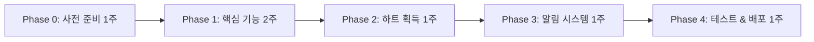

> 아카이브 문서
>
> 이 문서는 현재 운영 기준이 아니라 설계, 기록, 레거시 참고 또는 시점 한정 로그입니다.
> 현재 기준 문서는 `README.md`, `docs/README.md`, `docs/reference/ARCHITECTURE.md`, `docs/guides/DEPLOYMENT.md`를 우선 확인하세요.
# 계정 관리 시스템

**최종 업데이트**: 2026-04-18
**상태**: 현재 모바일앱 기준 (Supabase)

이 문서는 `uniqn-mobile/`과 Supabase Edge Functions에 실제 존재하는 계정 관리 기능만 정리합니다. 과거 `app2/`의 페이지 구조와 라우팅 설명은 현재 기준이 아닙니다.

## 기준 파일

앱:

- `uniqn-mobile/app/(auth)/login.tsx`
- `uniqn-mobile/app/(auth)/signup.tsx`
- `uniqn-mobile/app/(app)/settings/index.tsx`
- `uniqn-mobile/app/(app)/settings/change-password.tsx`
- `uniqn-mobile/app/(app)/settings/delete-account.tsx`
- `uniqn-mobile/app/(app)/settings/my-data.tsx`
- `uniqn-mobile/app/(app)/settings/terms.tsx`
- `uniqn-mobile/app/(app)/settings/privacy.tsx`
- `uniqn-mobile/src/services/auth/`

백엔드 (Supabase):

- `uniqn-mobile/supabase/functions/scheduled-deletion/`
- `uniqn-mobile/supabase/functions/login-notification/`
- Auth: Supabase Auth `auth.users` + `raw_app_meta_data` / `raw_user_meta_data`

## 현재 제공 기능

### 회원가입

- 약관 동의
- 계정 정보 입력
- 본인인증
- 가입 완료 후 앱 메인 이동

회원가입 화면은 `uniqn-mobile/app/(auth)/signup.tsx`입니다.

### 로그인

- 이메일/비밀번호 로그인
- 소셜 로그인
- 자동 로그인
- 생체 인증 로그인

관련 구현:

- `uniqn-mobile/app/(auth)/login.tsx`
- `uniqn-mobile/src/services/auth/authCoreService.ts`
- `uniqn-mobile/src/services/auth/socialLoginService.ts`
- `uniqn-mobile/src/services/auth/biometricService.ts`

### 약관 및 개인정보 동의

- 회원가입 시 필수 동의: 이용약관, 개인정보처리방침
- 선택 동의: 마케팅 수신
- 백엔드 저장: Supabase `user_profiles` 테이블
- 앱 내 조회 경로:
  - `/(app)/settings/terms`
  - `/(app)/settings/privacy`
  - `/(app)/settings/my-data`

### 비밀번호 변경

- 경로: `uniqn-mobile/app/(app)/settings/change-password.tsx`
- 설정 화면에서 진입합니다.

### 마이데이터 조회

- 경로: `uniqn-mobile/app/(app)/settings/my-data.tsx`
- 현재 사용자 기본 정보와 약관 동의 상태를 표시합니다.

### 마케팅 동의 변경

- 경로: `uniqn-mobile/app/(app)/settings/index.tsx`
- `updateMarketingConsent`를 통해 동의 상태를 갱신합니다.

### 계정 삭제

- 경로: `uniqn-mobile/app/(app)/settings/delete-account.tsx`
- 30일 유예 삭제 흐름을 사용합니다.
- 백엔드 정리 작업은 Supabase Edge Function `scheduled-deletion`이 담당합니다.
- 실제 계정 삭제는 Supabase Admin API로 `auth.users` 레코드를 제거하고 연관 테이블(user_profiles 등)은 RLS 및 cascade로 정리됩니다.

### 로그인 알림

- 서버 구현: Supabase Edge Function `login-notification`
- 새 로그인 기록과 알림 저장 흐름을 처리합니다(PostgreSQL `notifications` 테이블).

## 현재 설정 화면 기준 계정 관련 항목

`uniqn-mobile/app/(app)/settings/index.tsx` 기준:

- 비밀번호 변경
- 자동 로그인
- 생체 인증
- 마케팅 정보 수신
- 이용약관
- 개인정보처리방침
- 사업자정보
- 계정 삭제

## 데이터 모델 메모

- 사용자 스키마는 `language: 'ko' | 'en'` 필드를 허용합니다.
- 인증 정보는 Supabase `auth.users`에 저장되며, 앱 고유 프로필은 `user_profiles` 테이블에서 관리합니다.
- 역할은 `auth.users.raw_app_meta_data.role`(app_metadata)을 단일 소스로 사용합니다.
- 약관 동의 및 마케팅 동의는 `user_profiles`와 연관 테이블에서 함께 다뤄집니다.
- 삭제 요청은 `scheduled_deletion_at` 컬럼을 기준으로 처리됩니다(snake_case).

## 문서 작성 원칙

다음 내용은 현재 문서에 다시 넣지 않습니다.

- 과거 웹앱 파일 구조
- 레거시 라우팅 추가 절차
- 웹 전용 번역 리소스 예시
- 현재 코드에 없는 과거 설정 UI 설명
 # Feature Flag 가이드

**최종 업데이트**: 2026-04-18
**상태**: 현재 코드 기준 (Supabase)

이 문서는 `uniqn-mobile/`의 실제 Feature Flag 구현만 설명합니다. 과거 웹앱의 조건부 라우팅 패턴은 현재 기준이 아닙니다.

## 기준 파일

- `uniqn-mobile/src/services/observability/featureFlagService.ts`
- `uniqn-mobile/src/hooks/useFeatureFlag.ts`
- `uniqn-mobile/src/lib/supabase.ts`
- `uniqn-mobile/app/(admin)/settings.tsx`

## 현재 동작 방식

- Feature Flag는 `featureFlagService` 싱글톤이 관리합니다.
- 런타임 플래그는 Supabase `feature_flags` 테이블(또는 환경변수 `EXPO_PUBLIC_*`)을 소스로 사용합니다. (과거 Firebase Remote Config 기반은 제거됨)
- 테이블/환경변수 값을 가져오지 못하면 `DEFAULT_FEATURE_FLAGS`로 폴백합니다.
- 캐시 유효시간은 12시간입니다.
- 관리자 화면에서는 `/(admin)/settings`에서 현재 플래그 상태를 읽기 전용으로 확인하고 캐시 새로고침만 할 수 있습니다.

## 현재 플래그 목록

`FeatureFlags` 인터페이스 기준:

- `maintenance_mode`
- `enable_social_login`
- `enable_biometric`
- `enable_push_notifications`
- `enable_qr_checkin`
- `enable_location_search`
- `enable_new_design`
- `enable_debug_mode`
- `enable_offline_mode`
- `enable_settlement`
- `enable_advanced_filters`
- `enable_notification_grouping`

기본값은 `featureFlagService.ts`의 `DEFAULT_FEATURE_FLAGS`가 소스 오브 트루스입니다.

## 사용 방법

단일 플래그:

```tsx
import { useFeatureFlag } from '@/hooks/useFeatureFlag';

const isSettlementEnabled = useFeatureFlag('enable_settlement');
```

상태 포함:

```tsx
import { useFeatureFlagWithStatus } from '@/hooks/useFeatureFlag';

const { isEnabled, isLoading, refresh } = useFeatureFlagWithStatus('maintenance_mode');
```

복수 조회:

```tsx
import { useFeatureFlags } from '@/hooks/useFeatureFlag';

const flags = useFeatureFlags(['enable_social_login', 'enable_biometric']);
```

서비스 직접 사용:

```ts
import { featureFlagService } from '@/services/observability';

await featureFlagService.initialize();
const enabled = featureFlagService.isEnabled('enable_qr_checkin');
```

## 관리자 확인 경로

관리자는 `uniqn-mobile/app/(admin)/settings.tsx`에서 다음 항목을 확인할 수 있습니다.

- 점검 모드 상태
- 전체 Feature Flag ON/OFF 상태
- 앱 버전 / 빌드 번호 / 플랫폼
- 캐시 새로고침

주의:

- 관리자 화면은 플래그 값을 직접 수정하지 않습니다.
- 점검 모드 및 플래그 값 변경은 Supabase 대시보드의 `feature_flags` 테이블 또는 EAS 환경변수 업데이트 후 배포 기준입니다.

## 새 플래그 추가 절차

1. `FeatureFlags` 인터페이스에 키를 추가합니다.
2. `DEFAULT_FEATURE_FLAGS`에 기본값을 추가합니다.
3. 필요하면 `app/(admin)/settings.tsx`의 `FLAG_METADATA`에 라벨과 설명을 추가합니다.
4. UI에서는 `useFeatureFlag` 또는 `featureFlagService.isEnabled()`로 분기합니다.
5. 테스트가 필요하면 `src/services/observability/__tests__/featureFlagService.test.ts`와 `src/hooks/useFeatureFlag.ts` 사용부를 함께 검토합니다.

## 운영 메모

- 네이티브 앱은 Supabase 플래그를 가져오지 못하면 기본값으로 안전하게 동작합니다.
- `maintenance_mode`는 운영 영향이 크므로 관리자 화면에서 먼저 확인하고 배포합니다.
- 플래그 문서에 과거 Firebase Remote Config / 웹 전용 예시를 다시 넣으면 현재 코드와 어긋납니다.
 # 멀티 테넌트 아키텍처 구현 현황

**최종 업데이트**: 2026-04-18
**버전**: v1.0.0 (모바일앱 중심 / Supabase 기반)
**상태**: ✅ **100% 완료**

> **참고**: 이 문서는 레거시 웹앱(app2/)의 멀티테넌트 구현 현황(Firebase 시절)입니다.
> 모바일앱(uniqn-mobile/)은 Supabase PostgreSQL + RLS와 Repository 패턴, Zustand를 활용한 새로운 아키텍처를 사용합니다.
> 아래의 Firestore 경로 기반 설명은 레거시 기록이며, 현재 운영 기준은 PostgreSQL 테이블 + RLS 정책 조합입니다.

---

## 📊 전체 진행 상황

**구현 단계**: Phase 6/6 (100% 완료) 🎉

| Phase | 내용 | 상태 | 완료일 |
|-------|------|------|--------|
| Phase 1 | Store & Context에 userId 추가 | ✅ 완료 | 2025-01-17 |
| Phase 2 | Hook 시그니처 변경 | ✅ 완료 | 2025-01-17 |
| Phase 3 | 페이지 컴포넌트 수정 | ✅ 완료 | 2025-01-17 |
| Phase 4 | Hook 내부 구현 (일부) | ✅ 완료 | 2025-01-17 |
| Phase 5 | 테스트 및 검증 | ✅ 완료 | 2025-01-17 |
| Phase 6 | useTables 리팩토링 | ✅ 완료 | 2025-01-17 |

---

## ✅ 완료된 작업

### 1. TournamentContext & Store
**파일**: `src/contexts/TournamentContextAdapter.tsx`, `src/stores/tournamentStore.ts`

- ✅ `userId` 필드 추가
- ✅ AuthContext의 `currentUser` 변경 시 자동 동기화
- ✅ 모든 하위 컴포넌트에 userId 전파

```typescript
// TournamentContextAdapter.tsx (Lines 44-53)
useEffect(() => {
  if (currentUser?.uid && currentUser.uid !== store.userId) {
    logger.info('TournamentProvider: userId 업데이트', {
      component: 'TournamentContextAdapter',
      data: { userId: currentUser.uid }
    });
    store.setTournament({ userId: currentUser.uid });
  }
}, [currentUser, store]);
```

---

### 2. Hook 시그니처 변경

#### 2.1 useParticipants ✅
**파일**: `src/hooks/useParticipants.ts`

**시그니처**:
```typescript
export const useParticipants = (
  userId: string | null,
  tournamentId: string | null
) => { ... }
```

**멀티 테넌트 경로**:
```typescript
const participantsPath = `users/${userId}/tournaments/${tournamentId}/participants`;
```

**상태**: ✅ **완전 멀티 테넌트 구현 완료**
- Read: ✅
- Create: ✅
- Update: ✅
- Delete: ✅

---

#### 2.2 useSettings ✅
**파일**: `src/hooks/useSettings.ts`

**시그니처**:
```typescript
export const useSettings = (
  userId: string | null,
  tournamentId: string | null
) => { ... }
```

**멀티 테넌트 경로**:
```typescript
const settingsDocRef = doc(
  db,
  `users/${userId}/tournaments/${tournamentId}/settings`,
  'tournament'
);
```

**상태**: ✅ **완전 멀티 테넌트 구현 완료**
- Read: ✅
- Update: ✅

---

#### 2.3 useTables ✅
**파일**: `src/hooks/useTables.ts`

**시그니처**:
```typescript
export const useTables = (
  userId: string | null,
  tournamentId: string | null
) => { ... }
```

**상태**: ✅ **완전 멀티 테넌트 구현 완료 (레거시 Firestore 기록)**
- 21개 Firestore 경로 모두 멀티 테넌트 경로로 변경 (현재는 PostgreSQL 테이블 `tables`, `participants`, `tournament_settings` + `user_id` / `tournament_id` 컬럼 + RLS로 대체)
- Read: ✅ (useEffect 구독)
- Create: ✅ (openNewTable)
- Update: ✅ (updateTableDetails, updateTablePosition, updateTableOrder, activateTable)
- Delete: ✅ (closeTable)
- Complex: ✅ (moveSeat, bustOutParticipant, updateTableMaxSeats, rebalanceAndAssignAll, autoBalanceByChips)

**멀티 테넌트 경로 (현재)**:
```typescript
const tablesCollectionRef = collection(db, `users/${userId}/tournaments/${tournamentId}/tables`);
const tableRef = doc(db, `users/${userId}/tournaments/${tournamentId}/tables`, tableId);
const settingsDocRef = doc(db, `users/${userId}/tournaments/${tournamentId}/settings`, 'config');
```

---

### 3. 페이지 컴포넌트 수정

#### 3.1 ParticipantsPage ✅
**파일**: `src/pages/ParticipantsPage.tsx`

```typescript
const { state } = useTournament();
const { participants, ... } = useParticipants(state.userId, state.tournamentId);
const { tables, ... } = useTables(state.userId, state.tournamentId);
```

**상태**: ✅ 완료

---

#### 3.2 TablesPage ✅
**파일**: `src/pages/TablesPage.tsx`

```typescript
const { state } = useTournament();
const { ... } = useTables(state.userId, state.tournamentId);
const { ... } = useParticipants(state.userId, state.tournamentId);
const { settings, ... } = useSettings(state.userId, state.tournamentId);
```

**상태**: ✅ 완료

---

#### 3.3 ShiftSchedulePage ✅
**파일**: `src/pages/ShiftSchedulePage.tsx`

```typescript
const { state: tournamentState } = useTournament();
const { tables, ... } = useTables(tournamentState.userId, tournamentState.tournamentId);
```

**변수명 충돌 해결**: `state` → `tournamentState`로 rename하여 `useUnifiedData`의 `state`와 충돌 방지

**상태**: ✅ 완료

---

## 🔍 검증 결과

### 1. TypeScript 타입 체크
```bash
npm run type-check
```
**결과**: ✅ **에러 0개**

---

### 2. 데이터 흐름 검증

#### AuthContext → TournamentContext
```
AuthContext.currentUser.uid
  ↓ (useEffect 자동 동기화)
TournamentContext.state.userId
  ↓ (prop drilling)
useParticipants(userId, tournamentId)
useSettings(userId, tournamentId)
useTables(userId, tournamentId) ← 아직 내부 레거시
```

**상태**: ✅ 데이터 흐름 정상

---

### 3. Firestore 경로 검증 (레거시 — 참고용)

| Hook | 레거시 Firestore 경로 | 상태 |
|------|------------------|------|
| useParticipants | `users/{userId}/tournaments/{tournamentId}/participants` | ✅ |
| useSettings | `users/{userId}/tournaments/{tournamentId}/settings/tournament` | ✅ |
| useTables | `users/{userId}/tournaments/{tournamentId}/tables` | ✅ |

**현재(Supabase) 대응**: PostgreSQL 테이블 `participants`, `tournament_settings`, `tables`에 `user_id`, `tournament_id` 컬럼 + RLS 정책 `using (auth.uid() = user_id)`으로 동일한 격리 효과.

---

## ⚠️ 알려진 이슈

~~### Issue #1: useTables 레거시 경로~~ ✅ **해결됨 (2025-01-17)**
**설명**: useTables가 여전히 글로벌 'tables' 컬렉션 사용

**해결 완료**:
- ✅ 21개 Firestore 경로 모두 멀티 테넌트 경로로 변경
- ✅ Type-check 통과
- ✅ Build 성공
- ✅ 모든 CRUD 작업 멀티 테넌트 경로 사용

---

## 📈 마이그레이션 영향 분석

### 데이터베이스 구조 변화

#### Before (레거시 — Firestore 시절)
```
Firestore
├── participants/          ← 모든 사용자 공유
├── settings/              ← 모든 사용자 공유
└── tables/                ← 모든 사용자 공유
```

#### Intermediate (레거시 멀티 테넌트 — Firestore)
```
Firestore
└── users/
    └── {userId}/
        └── tournaments/
            └── {tournamentId}/
                ├── participants/    ✅ 격리됨
                ├── settings/        ✅ 격리됨
                └── tables/          ✅ 격리됨
```

#### 현재 (Supabase PostgreSQL + RLS)
```
PostgreSQL (public schema)
├── participants (user_id, tournament_id, ...)        + RLS
├── tournament_settings (user_id, tournament_id, ...) + RLS
└── tables (user_id, tournament_id, ...)              + RLS
```

모든 테이블은 `user_id = auth.uid()` 기반 RLS 정책으로 격리됩니다.

---

### 데이터 마이그레이션 필요 여부

**현재 상황**:
- useParticipants, useSettings는 새 경로 사용
- 기존 데이터가 레거시 경로에 있을 경우 마이그레이션 필요

**마이그레이션 전략** (향후 — 참고용):
1. Supabase Edge Function 또는 SQL 마이그레이션 스크립트 작성
2. 레거시 데이터 → 새 PostgreSQL 테이블(user_id/tournament_id 컬럼 포함)로 INSERT
3. RLS 검증 후 레거시 데이터 삭제

*참고*: 2026-04-11 Firebase→Supabase 이전에서 실데이터 마이그레이션은 별도 계획으로 진행되었습니다.

---

## 🎯 다음 단계

### ✅ 완료된 작업 (2025-01-17)
- ✅ Phase 1-6 완료 및 검증됨
- ✅ 멀티 테넌트 아키텍처 100% 구현 완료
- ✅ useTables 리팩토링 완료 (21개 경로 변경)
- ✅ Type-check 통과
- ✅ Build 성공

### 향후 작업 (프로덕션 배포 전)
- [ ] **데이터 마이그레이션 스크립트** (현재 데이터 없음 - 필요 시 진행)
  - Supabase Edge Function 또는 SQL 스크립트 작성
  - 레거시 데이터 → PostgreSQL 테이블(user_id/tournament_id 컬럼)로 INSERT
  - 검증 및 롤백 전략 수립

- [ ] **통합 테스트 강화**
  - E2E 테스트 시나리오 작성
  - 멀티 테넌트 격리 검증
  - 성능 테스트 및 최적화

- ✅ **보안 규칙 업데이트** (레거시 완료 - 2025-01-17 / Supabase 이전 후 RLS로 대체됨)
  - ✅ (레거시) Firestore Security Rules 작성
  - ✅ (현재) Supabase RLS 정책으로 사용자별 데이터 격리 강제
  - ✅ 권한 검증 로직: `auth.uid() = user_id` 기반 RLS
  - ✅ 레거시 ruleset: 12925291-b09f-49bd-a478-9da7b54e6823 (현재는 사용하지 않음)

---

## 📝 커밋 이력

### 2025-01-17: Security Rules 배포 완료 🔒 (레거시 — Firestore)
```
feat: Firestore Security Rules 멀티 테넌트 지원 추가

**주요 변경사항** (레거시):
- users/{userId}/tournaments/{tournamentId} 경로에 대한 보안 규칙 추가
- Participants, Tables, Settings 서브컬렉션 권한 설정
- 본인 데이터만 접근 가능하도록 격리 (관리자는 모든 데이터 접근 가능)
- isOwner() 함수를 활용한 소유권 검증

**보안 정책** (레거시):
- 읽기: isSignedIn() && (isOwner(userId) || isPrivileged())
- 쓰기: isSignedIn() && (isOwner(userId) || isPrivileged())
- 삭제: Settings는 관리자만 가능

**배포** (레거시):
- Ruleset ID: 12925291-b09f-49bd-a478-9da7b54e6823
- 배포 일시: 2025-01-17

*현재 운영 기준*: 2026-04-11 Supabase 이전 이후 RLS 정책으로 대체됨.
예) `create policy "owner_only" on participants for all using (auth.uid() = user_id)`
```

### 2025-01-17: Phase 6 완료 🎉
```
feat: Phase 6 - useTables 멀티 테넌트 리팩토링 완료

**주요 변경사항**:
- useTables Hook 내 21개 Firestore 경로 모두 멀티 테넌트 경로로 변경
- useEffect 구독: tables, settings 모두 멀티 테넌트 경로
- CRUD 작업: Create, Read, Update, Delete 모두 변경
- Complex 작업: moveSeat, bustOutParticipant, closeTable 등 모두 변경
- 의존성 배열: 모든 함수에 userId, tournamentId 추가
- 가드 체크: 모든 함수에 `if (!userId || !tournamentId) return` 추가

**검증**:
- TypeScript 타입 체크 통과 ✅
- Build 성공 (307.35 kB main bundle) ✅
- 21개 수정 지점 모두 완료 ✅
```

### 2025-01-17: Phase 3 완료
```
feat: Phase 3 - 멀티 테넌트 아키텍처 페이지 컴포넌트 수정 완료

**주요 변경사항**:
- ParticipantsPage: state.userId, state.tournamentId 전달
- TablesPage: state.userId, state.tournamentId 전달
- ShiftSchedulePage: tournamentState.userId, tournamentState.tournamentId 전달
- ShiftSchedulePage 변수명 충돌 해결 (state → tournamentState)

**검증**:
- TypeScript 타입 체크 통과 ✅
- 모든 페이지가 TournamentContext에서 userId/tournamentId 가져옴
```

### 이전 커밋
- Phase 1: Store & Context에 userId 추가
- Phase 2: Hook 시그니처 변경

---

## 🔗 관련 문서

- [DEVELOPMENT_GUIDE.md](../core/DEVELOPMENT_GUIDE.md) - 개발 가이드
- [CLAUDE.md](../../CLAUDE.md) - 프로젝트 전체 가이드

---

*마지막 업데이트: 2026-04-18*
*작성자: Claude Code*
*상태: **Production Ready - 모바일앱 v1.0.0 (Supabase)** 🎉*
 # 알림 시스템 구현 상태

**최종 업데이트**: 2026-04-18
**버전**: v1.0.0 (모바일앱 중심 / Supabase 기반)
**문서 버전**: 3.1.0

> **모바일앱 알림**: uniqn-mobile/은 FCM(APNs) + expo-notifications를 통해 푸시 알림을 지원합니다. 서버 측은 Supabase Edge Functions + PostgreSQL 트리거 기반입니다.
>
> 📚 **관련 문서 (역할별 참조)**:
> - 💻 **모바일앱 구현 상세**: [10-notifications.md](../../specs/react-native-app/10-notifications.md) (앱개발자용 — FCM, Zustand, UI, 30개 타입)
> - 💼 **운영 가이드**: [NOTIFICATION_OPERATIONS.md](../operations/NOTIFICATION_OPERATIONS.md) (운영팀용 — Edge Functions 관리, 모니터링)
>
> 이 문서는 **구현 현황 추적용**입니다. Phase 진행도, 테스트 결과, 해결된 이슈에 집중합니다.

---

## 📊 구현 현황 요약

### 전체 진행률
- **프론트엔드**: 100% ✅ (완성)
- **백엔드 (Supabase Edge Functions + PostgreSQL Triggers)**: 100% ✅ (Phase 1 완성 - 5개 Functions)
- **전체 시스템**: 100% ✅ (Phase 1 완성)

### 배포 상태
- ✅ Supabase Edge Functions 배포 완료 (5개 Functions)
- ✅ 프로덕션 환경에서 실시간 알림 작동 중 (Supabase Realtime)
- ✅ FCM/APNs 푸시 알림 전송 가능
- ✅ 타임존 처리 완료 (UTC → KST 변환)
- ✅ 모든 알림 타입 테스트 완료
- ✅ FCM 토큰 저장: PostgreSQL `fcm_tokens` 테이블 (user_id FK)

---

## 🎯 알림 타입 상세 (8가지)

### 1. System 카테고리 (4개)

#### 1.1 공고별 공지 전송 (job_posting_announcement) ✅

**기본 정보**
- 아이콘: 📢
- 우선순위: High
- 색상: Blue
- 설명: 특정 공고의 확정된 스태프에게 공지사항 전송
- 라우팅: /app/admin/job-postings/{jobPostingId}
- 구현 상태: ✅ 완성 (2025-10-15)

**백엔드 구현**
- Function: `send-job-posting-announcement` (Supabase Edge Function, HTTP)
- 트리거: 관리자/매니저가 공고 상세 페이지에서 공지 전송 버튼 클릭
- 수신자: 해당 공고의 확정된 스태프 전원
- 파일: `uniqn-mobile/supabase/functions/send-job-posting-announcement/index.ts`

**주요 기능**
- ✅ 권한 검증 (admin, manager만 가능 — `auth.users.raw_app_meta_data.role` 확인)
- ✅ 공지 제목/내용 입력 (최대 50자/500자)
- ✅ 공고 제목 자동 prefix ([공고제목] 공지내용)
- ✅ FCM 멀티캐스트 전송 (500명 단위 배치)
- ✅ PostgreSQL `notifications` 테이블에 알림 행 생성
- ✅ 전송 결과 추적 (성공/실패 건수)

---

#### 1.2 신규 공고 등록 (new_job_posting) ✅

**기본 정보**
- 아이콘: 🎯
- 우선순위: Medium
- 색상: Blue
- 설명: 새로운 구인공고가 등록되면 모든 사용자에게 알림
- 라우팅: /app/jobs/{postingId}
- 구현 상태: ✅ 완성 (2025-10-15)

**백엔드 구현**
- Function: `broadcast-new-job-posting` (Supabase Edge Function, PG trigger webhook)
- 트리거: PostgreSQL `job_postings` 테이블 INSERT 트리거 → Edge Function 호출 (pg_net / database webhook)
- 조건: `status = 'open'` (공개 상태 공고만)
- 수신자: 모든 사용자
- 파일: `uniqn-mobile/supabase/functions/broadcast-new-job-posting/index.ts`

**주요 기능**
- ✅ 공고 정보 유효성 검증
- ✅ 공고 제목, 지역, 시급 정보 포함
- ✅ FCM 푸시 알림 배치 전송 (500명 단위, `fcm_tokens` 조회)
- ✅ 모든 사용자에게 `notifications` 행 자동 생성
- ✅ 전송 결과 로깅 (성공/실패 건수)

---

#### 1.3 시스템 공지 (system_announcement) ⏳

**기본 정보**
- 아이콘: 🔔
- 우선순위: Medium
- 색상: Blue
- 설명: 전체 시스템 공지사항
- 라우팅: /app/announcements
- 구현 상태: ⏳ UI만 완성 (백엔드 미구현)

---

#### 1.4 앱 업데이트 (app_update) ⏳

**기본 정보**
- 아이콘: 🔄
- 우선순위: Low
- 색상: Blue
- 설명: 앱 업데이트 알림
- 라우팅: /app/announcements
- 구현 상태: ⏳ UI만 완성 (백엔드 미구현)

---

### 2. Work 카테고리 (3개)

#### 2.1 지원서 제출 (job_application) ✅

**기본 정보**
- 아이콘: 📝
- 우선순위: Medium
- 색상: Green
- 설명: 스태프가 공고에 지원하면 고용주에게 알림
- 라우팅: /applications/{applicationId}
- 구현 상태: ✅ 완성 (2025-10-15)

**백엔드 구현**
- Function: `on-application-submitted` (Supabase Edge Function, PG trigger webhook)
- 트리거: PostgreSQL `applications` 테이블 INSERT 트리거
- 수신자: 공고 작성자 (고용주)
- 파일: `uniqn-mobile/supabase/functions/on-application-submitted/index.ts`

**주요 기능**
- ✅ 공고 정보 조회 및 검증
- ✅ 고용주 정보 조회
- ✅ 지원자 이름, 공고 제목 포함
- ✅ 고용주에게 FCM 푸시 알림 전송
- ✅ PostgreSQL `notifications` 테이블에 알림 저장

---

#### 2.2 지원 확정 (staff_approval) ✅

**기본 정보**
- 아이콘: ✅
- 우선순위: High
- 색상: Green
- 설명: 지원이 확정되면 지원자에게 알림
- 라우팅: /app/my-schedule
- 구현 상태: ✅ 완성 (2025-10-15)

**백엔드 구현**
- Function: `on-application-status-changed` (Supabase Edge Function, PG trigger webhook)
- 트리거: PostgreSQL `applications` 테이블 UPDATE 트리거 (`status` 컬럼 변경)
- 조건: `status: 'applied' → 'confirmed'`
- 수신자: 지원자
- 파일: `uniqn-mobile/supabase/functions/on-application-status-changed/index.ts`

**주요 기능**
- ✅ 공고 정보 조회
- ✅ 지원자 정보 조회
- ✅ 지원자에게 FCM 푸시 알림 전송
- ✅ PostgreSQL `notifications` 테이블에 알림 저장

---

#### 2.3 지원 취소 (staff_rejection) ✅

**기본 정보**
- 아이콘: ❌
- 우선순위: Medium
- 색상: Red
- 설명: 지원이 취소되면 지원자에게 알림
- 라우팅: /app/my-schedule
- 구현 상태: ✅ 완성 (2025-10-15)

**백엔드 구현**
- Function: `on-application-status-changed` (Supabase Edge Function, PG trigger webhook)
- 조건: `status: 'applied' → 'cancelled'` 또는 `'confirmed' → 'cancelled'`
- 파일: `uniqn-mobile/supabase/functions/on-application-status-changed/index.ts`

---

### 3. Schedule 카테고리 (1개)

#### 3.1 근무시간 변경 (schedule_change) ✅

**기본 정보**
- 아이콘: 📅
- 우선순위: High
- 색상: Orange
- 설명: 근무 시간이 변경되면 해당 스태프에게 알림
- 라우팅: /app/my-schedule
- 구현 상태: ✅ 완성 (2025-10-15) - 타임존 수정 완료 ⭐

**백엔드 구현**
- Function: `on-work-time-changed` (Supabase Edge Function, PG trigger webhook)
- 트리거: PostgreSQL `work_logs` 테이블 UPDATE 트리거 (시간 컬럼 변경)
- 조건: `scheduled_start_time` 또는 `scheduled_end_time` 변경
- 수신자: 해당 근무 기록의 스태프
- 파일: `uniqn-mobile/supabase/functions/on-work-time-changed/index.ts`

**주요 기능**
- ✅ 시간 변경 감지 (timestamptz 비교)
- ✅ 타임존 변환 (UTC → KST) ⭐ 핵심 수정 완료
- ✅ staffId 파싱 ({userId}_{index} 형식 처리)
- ✅ 변경 전/후 시간 비교 정보 포함
- ✅ 스태프에게 FCM 푸시 알림 전송
- ✅ PostgreSQL `notifications` 테이블에 알림 저장

**타임존 처리 (중요! ⭐)**
PostgreSQL `timestamptz`도 UTC로 저장되므로 KST(UTC+9)로 변환 필요:
- formatTime 함수에서 UTC 시간에 9시간 추가 (또는 `AT TIME ZONE 'Asia/Seoul'`)
- 변경 전/후 시간 모두 KST로 변환하여 표시
- 예: UTC 05:00 → KST 14:00

**해결된 이슈**
1. ✅ staffId 파싱: {userId}_{index}에서 실제 userId 추출
2. ✅ 타임존 불일치: UTC → KST 변환으로 정확한 시간 표시

---

## 🚀 배포 상태

### Supabase Edge Functions 배포 현황

| Function | 타입 | 트리거 | 버전 | 배포일 | 상태 |
|----------|------|--------|------|--------|------|
| send-job-posting-announcement | Edge Function (HTTP) | HTTPS 요청 | v1.0.0 | 2026-04-11 | ✅ 작동 중 |
| broadcast-new-job-posting | Edge Function + PG Trigger | job_postings INSERT | v1.0.0 | 2026-04-11 | ✅ 작동 중 |
| on-application-submitted | Edge Function + PG Trigger | applications INSERT | v1.0.0 | 2026-04-11 | ✅ 작동 중 |
| on-application-status-changed | Edge Function + PG Trigger | applications UPDATE | v1.0.0 | 2026-04-11 | ✅ 작동 중 |
| on-work-time-changed | Edge Function + PG Trigger | work_logs UPDATE | v1.0.0 | 2026-04-11 | ✅ 작동 중 (KST) |

*이전 배포 (2025-10-15)는 Firebase Functions 기반이었으며, 2026-04-11 Supabase 이전 시 Edge Functions로 재배포되었습니다.*

---

## 🧪 테스트 결과 (2025-10-15)

### ✅ 백엔드 테스트 완료

**공고 공지 전송**
- [x] 권한 검증
- [x] 입력 데이터 검증
- [x] FCM 멀티캐스트 전송
- [x] 알림 문서 생성
- [x] 전송 결과 추적

**신규 공고 브로드캐스트**
- [x] 공고 상태 검증
- [x] 모든 사용자 알림
- [x] FCM 배치 전송
- [x] 전송 결과 로깅

**지원서 제출 알림**
- [x] 공고/고용주 조회
- [x] FCM 푸시 전송
- [x] 알림 문서 생성

**지원 상태 변경 알림**
- [x] 확정 알림
- [x] 취소 알림
- [x] FCM 푸시 전송

**근무시간 변경 알림**
- [x] 시간 변경 감지
- [x] 타임존 변환 (UTC → KST) ⭐
- [x] staffId 파싱
- [x] KST 시간 정확 표시 (14:00 → 15:00)
- [x] FCM 푸시 전송

### ✅ 프론트엔드 테스트 완료
- [x] 알림 드롭다운 UI
- [x] 알림 센터 페이지
- [x] 실시간 구독
- [x] 알림 클릭 라우팅
- [x] KST 시간 표시

---

## 🐛 해결된 이슈

### 1. staffId 파싱 문제 ✅

**문제**: staffId가 {userId}_{index} 형식인데 users 컬렉션 쿼리 시 전체 문자열 사용

**해결**: actualUserId 추출 후 쿼리

### 2. 타임존 불일치 문제 ✅

**문제**: PostgreSQL `timestamptz`가 UTC로 직렬화되어 그대로 표시됨 (14:00 → 05:00)

**해결**: formatTime 함수에 KST(UTC+9) 변환 로직 추가 (또는 SQL에서 `AT TIME ZONE 'Asia/Seoul'`)

**테스트 결과**: 14:00 → 15:00 KST 시간으로 정확하게 표시 ✅

---

## 🔮 향후 계획 (Phase 2)

### 추가 알림 타입
- Finance 카테고리: payment_processed, payment_delayed
- Reminder 카테고리: shift_reminder, attendance_alert

### 기능 개선
- 이메일/SMS 알림 통합
- 알림 히스토리 검색
- 알림 통계 대시보드
- 예약 발송 기능

### 성능 최적화
- FCM 토큰 자동 정리 (`fcm_tokens` 테이블 + PG cron)
- `notifications` 테이블 자동 아카이빙 (파티션/오래된 행 정리)
- 배치 전송 최적화

---

*최종 수정: 2026-04-18*  
*Phase 1 완성: 5개 Supabase Edge Functions 배포 및 테스트 완료 (2026-04-11 이전 포팅)*
 # 권한 시스템 가이드

**최종 업데이트**: 2026-04-18
**상태**: 현재 모바일앱 기준 (Supabase)

현재 권한 시스템은 `uniqn-mobile/`의 역할 계층과 라우트 가드를 기준으로 설명합니다.
역할의 **서버 측 단일 소스**는 Supabase `auth.users.raw_app_meta_data.role`입니다(JWT 클레임 `app_metadata.role`로 전달).

## 현재 역할

- `admin`
- `employer`
- `staff`

정의 기준:

- `uniqn-mobile/src/schemas/user.schema.ts`
- `uniqn-mobile/src/shared/role/RoleResolver.ts`
- 서버 소스: `auth.users.raw_app_meta_data.role` (구 Firebase Custom Claims 대체)

## 권한 계층

`RoleResolver` 기준:

- `admin`은 모든 하위 권한을 포함합니다.
- `employer`는 구인자 전용 기능과 일반 사용자 기능에 접근할 수 있습니다.
- `staff`는 기본 로그인 사용자 기능에 접근할 수 있습니다.

## 라우트 그룹별 접근

`uniqn-mobile/src/hooks/useAuthGuard.ts` 기준:

- `(public)`: 비로그인 접근 가능
- `(auth)`: 로그인/회원가입
- `(app)`: 로그인 사용자
- `(employer)`: `employer` 이상
- `(admin)`: `admin`

## 코드에서 쓰는 핵심 API

### 권한 확인

```ts
RoleResolver.hasPermission(userRole, 'admin');
RoleResolver.hasPermission(userRole, 'employer');
```

### 강제 검사

```ts
RoleResolver.requireAdmin(userRole);
RoleResolver.requireRole(userRole, 'employer');
```

### 역할 플래그 계산

```ts
const flags = RoleResolver.computeRoleFlags(role);
```

## 현재 화면 예시

### 관리자 전용

- `app/(admin)/index.tsx`
- `app/(admin)/users/*`
- `app/(admin)/reports/*`
- `app/(admin)/inquiries/*`

### 구인자 전용

- `app/(employer)/my-postings/*`

### 로그인 사용자 공통

- `app/(app)/(tabs)/*`
- `app/(app)/notifications.tsx`
- `app/(app)/support/*`
- `app/(app)/settings/*`

## RLS 정책 예시

Supabase PostgreSQL에서 역할 기반 접근을 제어하는 정책 예시:

```sql
-- 본인 데이터만 읽기/쓰기
create policy "owner_only_select"
on public.user_profiles
for select
using (auth.uid() = user_id);

-- 관리자 전용 (app_metadata.role 기반)
create policy "admin_manage_reports"
on public.reports
for all
using (
  (auth.jwt() -> 'app_metadata' ->> 'role') = 'admin'
);

-- 구인자 이상(employer/admin) 조회 허용
create policy "employer_or_admin_read_applications"
on public.applications
for select
using (
  (auth.jwt() -> 'app_metadata' ->> 'role') in ('employer', 'admin')
);
```

*참고*: RLS에서 앱 역할은 `auth.jwt() ->> 'role'`이 아니라 `(auth.jwt() -> 'app_metadata' ->> 'role')`을 사용해야 합니다(프로젝트 메모 기준).

## 문서화 원칙

현재 문서에는 아래 내용을 넣지 않습니다.

- 현재 코드에 없는 과거 역할명
- 레거시 웹앱 라우트 예시
- Firebase Custom Claims / firestore.rules 기반 권한 설명 (현재는 Supabase RLS + `app_metadata.role` 기준)
- 별도 커스텀 권한 엔진이 있는 것처럼 보이게 하는 설명
 # 💎 하트/다이아 포인트 시스템 구현 가이드

**최종 업데이트**: 2026년 3월 26일
**버전**: v1.0.0 (Heart/Diamond Point System)
**상태**: 📋 **설계 / 구현 준비**

> ⚠️ 이 문서는 현재 런타임 구현 완료 상태를 설명하지 않습니다.
> 포인트 정의, 가격표, 시각 디자인은 [MODEL_B_CHIP_SYSTEM_FINAL.md](./MODEL_B_CHIP_SYSTEM_FINAL.md)를 참조하세요.
> 이 문서는 **구현 단계 및 기술 가이드**에 집중합니다.
> 문서에 포함된 `heartExpiry7Days`, `heartExpiry3Days`, `heartExpiryToday`, `cleanupExpiredHearts` 작업은 현재 `tholdem-ebc18` 배포 함수 목록 기준 활성 대상이 아닙니다.

---

## 📋 목차

1. [구현 우선순위 로드맵](#-구현-우선순위-로드맵)
2. [Phase 0: 사전 준비](#-phase-0-사전-준비-1주)
3. [Phase 1: 핵심 기능](#-phase-1-핵심-기능-2주)
4. [Phase 2: 하트 획득 시스템](#-phase-2-하트-획득-시스템-1주)
5. [Phase 3: 알림 시스템](#-phase-3-알림-시스템-1주)
6. [최종 체크리스트](#-최종-우선순위-체크리스트)

---

## 📊 시스템 요약

### 포인트 타입

| 포인트 | 아이콘 | 획득 방법 | 만료 | 가치 |
|--------|--------|----------|------|------|
| 💖 하트 (Heart) | ❤️ | 무료 활동 보상 | 90일 후 만료 | ₩300/개 |
| 💎 다이아 (Diamond) | 💎 | 유료 충전 | 만료 없음 (영구) | ₩300/개 |

### 사용 우선순위

```
1. 💖 하트 (만료 임박 순서로 먼저 차감)
2. 💎 다이아 (하트 부족 시 차감)
```

### 공고 비용

| 공고 타입 | 비용 | 설명 |
|-----------|------|------|
| 일반 공고 | 1💎 | 기본 노출 |
| 긴급 공고 | 10💎 | 상단 고정 + 뱃지 |
| 상시 공고 | 5💎 | 30일 노출 |

---

## 🎯 구현 우선순위 로드맵



**총 구현 기간**: 6주
**핵심 개발자**: Frontend 1명 + Backend 1명

---

## ✅ Phase 0: 사전 준비 (1주)

### 1. 결제 시스템 선택 및 설정

**긴급도**: ⭐⭐⭐⭐⭐ (최우선)

#### RevenueCat 설정

```yaml
RevenueCat (추천):
  장점:
    - iOS/Android 앱스토어 통합
    - Apple/Google 결제 규정 준수
    - 간편한 구독/단건 결제 연동
    - 상세한 분석 대시보드
    - React Native SDK 제공

  설정 절차:
    1. RevenueCat 계정 생성
    2. App Store Connect/Google Play Console 연동
    3. Product 생성 (다이아 패키지 4개)
    4. Entitlements 설정
    5. API 키 발급
```

#### 필요 정보

```yaml
iOS (App Store Connect):
  - App Store Connect API Key
  - Shared Secret
  - In-App Purchase 상품 등록

Android (Google Play Console):
  - Service Account JSON
  - In-App Product 등록
  - 앱 서명 설정

RevenueCat:
  - Public API Key (클라이언트용)
  - Secret API Key (서버용)
  - Webhook URL 설정
```

#### 참고 링크
- RevenueCat: https://www.revenuecat.com/docs
- React Native SDK: https://docs.revenuecat.com/docs/reactnative

---

### 2. 법률 검토

**긴급도**: ⭐⭐⭐⭐⭐ (최우선)

#### 해야 할 일

```yaml
법률 자문 항목:
  1. 전자상거래법 검토
     - 포인트(이용권)의 법적 성격
     - 서비스 제공의 전자적 수단 정의

  2. 약관 작성
     - 서비스 이용약관
     - 포인트 정책 (하트/다이아)
     - 개인정보 처리방침

  3. 환불 정책
     - 앱스토어 환불 정책 준수
     - 미사용 다이아 환불 조건
     - 환불 제한 조건

  4. 미성년자 보호
     - 앱스토어 연령 제한 설정
     - 결제 한도 안내
```

#### 주요 약관 내용

**제1조: 포인트의 정의**
```
하트(💖)와 다이아(💎)는 UNIQN 플랫폼 내 서비스 제공의 전자적 수단으로,
「전자상거래법」상 서비스 이용권에 해당합니다.
현금, 재화, 경제적 가치로 환전 불가하며,
오직 UNIQN 서비스 이용 목적으로만 사용됩니다.
```

**제2조: 포인트 만료 정책**
```
- 하트(💖): 획득일로부터 90일 후 자동 소멸
- 다이아(💎): 만료 없음 (영구 보유)
- 소멸 예정 포인트는 앱 내 알림으로 안내됩니다
```

---

### 3. Firestore 데이터 스키마 설계

**긴급도**: ⭐⭐⭐⭐⭐ (최우선)

#### 컬렉션 구조

```typescript
// users/{userId}
{
  // 기존 필드들...

  // 포인트 잔액 (신규)
  points: {
    diamonds: number;        // 💎 다이아 총 잔액
    lastUpdated: Timestamp;  // 마지막 업데이트 시간
  },
}

// users/{userId}/heartBatches/{batchId}
// 💖 하트는 배치별로 만료 관리
{
  amount: number;            // 해당 배치의 하트 개수
  source: HeartSource;       // 획득 경로
  acquiredAt: Timestamp;     // 획득일
  expiresAt: Timestamp;      // 만료일 (획득일 + 90일)
  remainingAmount: number;   // 남은 하트 개수
}

// HeartSource 타입
type HeartSource =
  | 'signup'           // 첫 가입 보상 (+10)
  | 'daily_attendance' // 일일 출석 (+1)
  | 'weekly_bonus'     // 7일 연속 보너스 (+3)
  | 'review_complete'  // 리뷰 작성 (+1)
  | 'referral'         // 친구 초대 (+5)
  | 'admin_grant';     // 관리자 지급

// users/{userId}/pointTransactions/{txId}
{
  type: 'earn' | 'spend' | 'purchase' | 'expire' | 'refund';
  pointType: 'heart' | 'diamond';
  amount: number;            // 변동 포인트 개수 (양수: 획득, 음수: 사용)
  balanceAfter: number;      // 거래 후 해당 포인트 잔액
  reason: string;            // 사유 (예: "공고 등록", "일일 출석")
  relatedId?: string;        // 관련 문서 ID (예: 공고 ID)
  metadata?: {
    batchId?: string;        // 하트 배치 ID (하트 관련 시)
    packageId?: string;      // 구매 패키지 ID
  };
  createdAt: Timestamp;
}

// purchases/{purchaseId}
{
  userId: string;
  packageId: 'starter' | 'basic' | 'popular' | 'premium';
  diamonds: number;          // 구매한 다이아 개수
  bonusDiamonds: number;     // 보너스 다이아
  totalDiamonds: number;     // 총 다이아 (구매 + 보너스)
  price: number;             // 결제 금액 (원)
  currency: 'KRW';
  status: 'pending' | 'completed' | 'refunded';

  // RevenueCat 정보
  revenueCatTransactionId: string;
  store: 'app_store' | 'play_store';
  productId: string;         // 앱스토어 상품 ID

  refundedAt?: Timestamp;
  refundAmount?: number;
  createdAt: Timestamp;
}
```

#### Security Rules

```javascript
// firestore.rules
rules_version = '2';
service cloud.firestore {
  match /databases/{database}/documents {

    // 사용자 문서
    match /users/{userId} {
      // 본인만 읽기/쓰기 가능
      allow read, write: if request.auth.uid == userId;

      // 포인트 직접 수정 금지 (Functions만 가능)
      allow update: if request.auth.uid == userId
        && !request.resource.data.diff(resource.data).affectedKeys().hasAny(['points']);
    }

    // 하트 배치 (본인만 읽기, Functions만 쓰기)
    match /users/{userId}/heartBatches/{batchId} {
      allow read: if request.auth.uid == userId;
      allow write: if false; // Functions only
    }

    // 포인트 거래 내역 (본인만 읽기, Functions만 쓰기)
    match /users/{userId}/pointTransactions/{txId} {
      allow read: if request.auth.uid == userId;
      allow write: if false; // Functions only
    }

    // 구매 정보 (본인 또는 관리자만)
    match /purchases/{purchaseId} {
      allow read: if request.auth.uid == resource.data.userId
        || get(/databases/$(database)/documents/users/$(request.auth.uid)).data.role == 'admin';
      allow write: if false; // Functions only
    }
  }
}
```

---

## 🚀 Phase 1: 핵심 기능 (2주)

### Week 1: 포인트 기본 시스템

#### Day 1-2: 포인트 데이터 모델

**파일**: `uniqn-mobile/src/types/point.types.ts`

```typescript
/**
 * 포인트 타입
 */
export type PointType = 'heart' | 'diamond';

/**
 * 하트 획득 경로
 */
export type HeartSource =
  | 'signup'           // 첫 가입 보상 (+10)
  | 'daily_attendance' // 일일 출석 (+1)
  | 'weekly_bonus'     // 7일 연속 보너스 (+3)
  | 'review_complete'  // 리뷰 작성 (+1)
  | 'referral'         // 친구 초대 (+5)
  | 'admin_grant';     // 관리자 지급

/**
 * 하트 배치 (만료 관리용)
 */
export interface HeartBatch {
  id: string;
  amount: number;            // 원래 하트 개수
  remainingAmount: number;   // 남은 하트 개수
  source: HeartSource;       // 획득 경로
  acquiredAt: Date;          // 획득일
  expiresAt: Date;           // 만료일 (획득일 + 90일)
}

/**
 * 포인트 잔액
 */
export interface PointBalance {
  hearts: number;            // 💖 하트 총 잔액
  diamonds: number;          // 💎 다이아 총 잔액
  heartBatches: HeartBatch[]; // 하트 배치 목록 (만료 임박 순)
  expiringHearts: {          // 곧 만료될 하트 정보
    count: number;
    expiresIn: number;       // 일수
  } | null;
}

/**
 * 포인트 거래 타입
 */
export type PointTransactionType = 'earn' | 'spend' | 'purchase' | 'expire' | 'refund';

/**
 * 포인트 거래 내역
 */
export interface PointTransaction {
  id: string;
  type: PointTransactionType;
  pointType: PointType;
  amount: number;            // 변동 포인트 (양수: 획득, 음수: 사용)
  balanceAfter: number;      // 거래 후 잔액
  reason: string;            // 사유
  relatedId?: string;        // 관련 ID (공고 ID 등)
  metadata?: {
    batchId?: string;
    packageId?: string;
  };
  createdAt: Date;
}

/**
 * 다이아 패키지 정의
 */
export interface DiamondPackage {
  id: 'starter' | 'basic' | 'popular' | 'premium';
  name: string;
  diamonds: number;          // 기본 다이아
  bonusDiamonds: number;     // 보너스 다이아
  totalDiamonds: number;     // 총 다이아
  price: number;             // 가격 (원)
  pricePerDiamond: number;   // 다이아당 가격
  bonusPercent: number;      // 보너스 %
  badge?: string;            // 배지
  description: string;       // 설명
  productId: string;         // 앱스토어 상품 ID
}

/**
 * 다이아 패키지 목록
 */
export const DIAMOND_PACKAGES: DiamondPackage[] = [
  {
    id: 'starter',
    name: '스타터',
    diamonds: 3,
    bonusDiamonds: 0,
    totalDiamonds: 3,
    price: 1000,
    pricePerDiamond: 333,
    bonusPercent: 0,
    badge: '💡',
    description: '첫 체험용',
    productId: 'com.uniqn.diamond.starter',
  },
  {
    id: 'basic',
    name: '기본',
    diamonds: 11,
    bonusDiamonds: 0,
    totalDiamonds: 11,
    price: 3300,
    pricePerDiamond: 300,
    bonusPercent: 0,
    badge: '⭐',
    description: '소규모 채용',
    productId: 'com.uniqn.diamond.basic',
  },
  {
    id: 'popular',
    name: '인기',
    diamonds: 35,
    bonusDiamonds: 5,
    totalDiamonds: 40,
    price: 10000,
    pricePerDiamond: 250,
    bonusPercent: 14,
    badge: '🔥',
    description: '+5💎 보너스',
    productId: 'com.uniqn.diamond.popular',
  },
  {
    id: 'premium',
    name: '프리미엄',
    diamonds: 333,
    bonusDiamonds: 67,
    totalDiamonds: 400,
    price: 100000,
    pricePerDiamond: 250,
    bonusPercent: 20,
    badge: '👑',
    description: '+20% 보너스',
    productId: 'com.uniqn.diamond.premium',
  },
];

/**
 * 공고 비용 정의
 */
export const JOB_POSTING_COSTS = {
  regular: 1,   // 일반 공고
  urgent: 10,   // 긴급 공고
  fixed: 5,     // 상시 공고
} as const;

export type JobPostingType = keyof typeof JOB_POSTING_COSTS;
```

---

#### Day 3-4: Zustand Store 생성

**파일**: `uniqn-mobile/src/stores/pointStore.ts`

```typescript
import { create } from 'zustand';
import {
  doc,
  onSnapshot,
  collection,
  query,
  orderBy,
  limit,
  where,
} from 'firebase/firestore';
import { db } from '@/lib/firebase';
import {
  PointBalance,
  PointTransaction,
  HeartBatch,
} from '@/types/point.types';
import { logger } from '@/utils/logger';
import { differenceInDays } from 'date-fns';

interface PointStore {
  // State
  balance: PointBalance | null;
  transactions: PointTransaction[];
  loading: boolean;
  error: string | null;

  // Actions
  fetchBalance: (userId: string) => void;
  fetchTransactions: (userId: string) => void;
  getTotalPoints: () => number;
  getExpiringHearts: () => { count: number; daysLeft: number } | null;
  canAfford: (cost: number) => boolean;
  cleanup: () => void;
}

// 구독 해제 함수 저장
let balanceUnsubscribe: (() => void) | null = null;
let heartBatchesUnsubscribe: (() => void) | null = null;
let transactionsUnsubscribe: (() => void) | null = null;

export const usePointStore = create<PointStore>((set, get) => ({
  balance: null,
  transactions: [],
  loading: false,
  error: null,

  /**
   * 포인트 잔액 실시간 구독
   */
  fetchBalance: (userId: string) => {
    if (!userId) {
      logger.warn('fetchBalance: userId is required');
      return;
    }

    set({ loading: true, error: null });

    try {
      // 기존 구독 해제
      if (balanceUnsubscribe) balanceUnsubscribe();
      if (heartBatchesUnsubscribe) heartBatchesUnsubscribe();

      // 1. 다이아 잔액 실시간 구독
      balanceUnsubscribe = onSnapshot(
        doc(db, `users/${userId}`),
        (snapshot) => {
          if (snapshot.exists()) {
            const data = snapshot.data();
            const diamonds = data.points?.diamonds || 0;

            set((state) => ({
              balance: state.balance
                ? { ...state.balance, diamonds }
                : {
                    hearts: 0,
                    diamonds,
                    heartBatches: [],
                    expiringHearts: null,
                  },
              loading: false,
            }));

            logger.info('다이아 잔액 업데이트', { diamonds });
          }
        },
        (error) => {
          logger.error('다이아 잔액 조회 실패', error);
          set({ error: error.message, loading: false });
        }
      );

      // 2. 하트 배치 실시간 구독 (만료되지 않은 것만, 만료일 순)
      const now = new Date();
      const heartBatchesQuery = query(
        collection(db, `users/${userId}/heartBatches`),
        where('expiresAt', '>', now),
        where('remainingAmount', '>', 0),
        orderBy('expiresAt', 'asc')
      );

      heartBatchesUnsubscribe = onSnapshot(
        heartBatchesQuery,
        (snapshot) => {
          const heartBatches: HeartBatch[] = snapshot.docs.map((doc) => {
            const data = doc.data();
            return {
              id: doc.id,
              amount: data.amount,
              remainingAmount: data.remainingAmount,
              source: data.source,
              acquiredAt: data.acquiredAt?.toDate() || new Date(),
              expiresAt: data.expiresAt?.toDate() || new Date(),
            };
          });

          const totalHearts = heartBatches.reduce(
            (sum, batch) => sum + batch.remainingAmount,
            0
          );

          // 가장 빨리 만료되는 하트 정보
          let expiringHearts = null;
          if (heartBatches.length > 0) {
            const firstBatch = heartBatches[0];
            const daysLeft = differenceInDays(firstBatch.expiresAt, new Date());
            if (daysLeft <= 7) {
              expiringHearts = {
                count: firstBatch.remainingAmount,
                expiresIn: daysLeft,
              };
            }
          }

          set((state) => ({
            balance: state.balance
              ? { ...state.balance, hearts: totalHearts, heartBatches, expiringHearts }
              : {
                  hearts: totalHearts,
                  diamonds: 0,
                  heartBatches,
                  expiringHearts,
                },
          }));

          logger.info('하트 잔액 업데이트', {
            totalHearts,
            batchCount: heartBatches.length,
          });
        },
        (error) => {
          logger.error('하트 배치 조회 실패', error);
          set({ error: error.message });
        }
      );
    } catch (error) {
      logger.error('fetchBalance error', error);
      set({ error: (error as Error).message, loading: false });
    }
  },

  /**
   * 포인트 거래 내역 조회
   */
  fetchTransactions: (userId: string) => {
    if (!userId) {
      logger.warn('fetchTransactions: userId is required');
      return;
    }

    try {
      if (transactionsUnsubscribe) {
        transactionsUnsubscribe();
      }

      const q = query(
        collection(db, `users/${userId}/pointTransactions`),
        orderBy('createdAt', 'desc'),
        limit(50)
      );

      transactionsUnsubscribe = onSnapshot(
        q,
        (snapshot) => {
          const transactions: PointTransaction[] = snapshot.docs.map((doc) => {
            const data = doc.data();
            return {
              id: doc.id,
              type: data.type,
              pointType: data.pointType,
              amount: data.amount,
              balanceAfter: data.balanceAfter,
              reason: data.reason,
              relatedId: data.relatedId,
              metadata: data.metadata,
              createdAt: data.createdAt?.toDate() || new Date(),
            };
          });

          set({ transactions });
          logger.info('포인트 거래 내역 업데이트', { count: transactions.length });
        },
        (error) => {
          logger.error('포인트 거래 내역 조회 실패', error);
          set({ error: error.message });
        }
      );
    } catch (error) {
      logger.error('fetchTransactions error', error);
      set({ error: (error as Error).message });
    }
  },

  /**
   * 총 포인트 (하트 + 다이아)
   */
  getTotalPoints: () => {
    const { balance } = get();
    if (!balance) return 0;
    return balance.hearts + balance.diamonds;
  },

  /**
   * 만료 임박 하트 정보
   */
  getExpiringHearts: () => {
    const { balance } = get();
    if (!balance?.expiringHearts) return null;
    return {
      count: balance.expiringHearts.count,
      daysLeft: balance.expiringHearts.expiresIn,
    };
  },

  /**
   * 구매 가능 여부 확인
   */
  canAfford: (cost: number) => {
    const { balance } = get();
    if (!balance) return false;
    return (balance.hearts + balance.diamonds) >= cost;
  },

  /**
   * 구독 정리
   */
  cleanup: () => {
    if (balanceUnsubscribe) {
      balanceUnsubscribe();
      balanceUnsubscribe = null;
    }
    if (heartBatchesUnsubscribe) {
      heartBatchesUnsubscribe();
      heartBatchesUnsubscribe = null;
    }
    if (transactionsUnsubscribe) {
      transactionsUnsubscribe();
      transactionsUnsubscribe = null;
    }
    set({ balance: null, transactions: [], loading: false, error: null });
  },
}));
```

---

#### Day 5: 포인트 UI 컴포넌트

**파일**: `uniqn-mobile/src/components/points/PointBalance.tsx`

```typescript
import React from 'react';
import { View, Text, Pressable } from 'react-native';
import { usePointStore } from '@/stores/pointStore';
import { useRouter } from 'expo-router';
import { differenceInDays } from 'date-fns';

interface PointBalanceProps {
  compact?: boolean;
  showChargeButton?: boolean;
}

export const PointBalance: React.FC<PointBalanceProps> = ({
  compact = false,
  showChargeButton = true,
}) => {
  const router = useRouter();
  const { balance, loading } = usePointStore();

  if (loading) {
    return (
      <View className="bg-white dark:bg-gray-800 rounded-lg p-4 animate-pulse">
        <View className="h-6 bg-gray-200 dark:bg-gray-700 rounded w-1/3 mb-2" />
        <View className="h-8 bg-gray-200 dark:bg-gray-700 rounded w-1/2" />
      </View>
    );
  }

  if (!balance) {
    return (
      <View className="bg-white dark:bg-gray-800 rounded-lg p-4">
        <Text className="text-gray-500 dark:text-gray-400">
          포인트 정보를 불러올 수 없습니다.
        </Text>
      </View>
    );
  }

  const totalPoints = balance.hearts + balance.diamonds;

  if (compact) {
    return (
      <Pressable
        onPress={() => router.push('/points')}
        className="flex-row items-center gap-2 bg-gray-100 dark:bg-gray-800 rounded-full px-3 py-1.5"
      >
        <Text className="text-pink-500">💖</Text>
        <Text className="font-semibold text-gray-900 dark:text-white">
          {balance.hearts}
        </Text>
        <View className="w-px h-4 bg-gray-300 dark:bg-gray-600" />
        <Text className="text-cyan-500">💎</Text>
        <Text className="font-semibold text-gray-900 dark:text-white">
          {balance.diamonds}
        </Text>
      </Pressable>
    );
  }

  return (
    <View className="bg-white dark:bg-gray-800 rounded-2xl p-6 shadow-sm">
      {/* 헤더 */}
      <View className="flex-row items-center justify-between mb-4">
        <Text className="text-lg font-bold text-gray-900 dark:text-white">
          💰 내 포인트
        </Text>
        {showChargeButton && (
          <Pressable
            onPress={() => router.push('/points/purchase')}
            className="bg-purple-600 rounded-full px-4 py-2"
          >
            <Text className="text-white font-semibold text-sm">충전하기</Text>
          </Pressable>
        )}
      </View>

      {/* 총 포인트 */}
      <View className="mb-6">
        <Text className="text-4xl font-bold text-gray-900 dark:text-white">
          {totalPoints.toLocaleString()}
          <Text className="text-lg text-gray-500"> 포인트</Text>
        </Text>
      </View>

      {/* 포인트 상세 */}
      <View className="space-y-3">
        {/* 💖 하트 */}
        <View className="bg-pink-50 dark:bg-pink-900/20 rounded-xl p-4">
          <View className="flex-row items-center justify-between">
            <View className="flex-row items-center gap-3">
              <Text className="text-2xl">💖</Text>
              <View>
                <Text className="font-semibold text-gray-900 dark:text-white">
                  하트 {balance.hearts}개
                </Text>
                <Text className="text-sm text-gray-600 dark:text-gray-400">
                  무료 획득 포인트
                </Text>
              </View>
            </View>
            {balance.expiringHearts && (
              <View className="bg-red-100 dark:bg-red-900/30 rounded-lg px-2 py-1">
                <Text className="text-xs text-red-600 dark:text-red-400 font-medium">
                  ⏰ {balance.expiringHearts.count}개
                  {balance.expiringHearts.expiresIn}일 후 만료
                </Text>
              </View>
            )}
          </View>
        </View>

        {/* 💎 다이아 */}
        <View className="bg-cyan-50 dark:bg-cyan-900/20 rounded-xl p-4">
          <View className="flex-row items-center gap-3">
            <Text className="text-2xl">💎</Text>
            <View>
              <Text className="font-semibold text-gray-900 dark:text-white">
                다이아 {balance.diamonds}개
              </Text>
              <Text className="text-sm text-gray-600 dark:text-gray-400">
                유료 충전 포인트 • 만료 없음
              </Text>
            </View>
          </View>
        </View>
      </View>

      {/* 사용 순서 안내 */}
      <View className="mt-4 p-3 bg-blue-50 dark:bg-blue-900/20 rounded-lg">
        <View className="flex-row items-start gap-2">
          <Text className="text-lg">💡</Text>
          <View className="flex-1">
            <Text className="text-sm font-medium text-gray-900 dark:text-white mb-1">
              사용 순서
            </Text>
            <Text className="text-sm text-gray-600 dark:text-gray-400">
              💖 하트 먼저 (만료 임박 순) → 💎 다이아
            </Text>
          </View>
        </View>
      </View>
    </View>
  );
};
```

**파일**: `uniqn-mobile/src/components/points/PointTransactionHistory.tsx`

```typescript
import React from 'react';
import { View, Text, FlatList } from 'react-native';
import { usePointStore } from '@/stores/pointStore';
import { format } from 'date-fns';
import { ko } from 'date-fns/locale';
import { PointTransaction } from '@/types/point.types';

export const PointTransactionHistory: React.FC = () => {
  const { transactions, loading } = usePointStore();

  if (loading) {
    return (
      <View className="p-4">
        <Text className="text-gray-500">로딩 중...</Text>
      </View>
    );
  }

  if (transactions.length === 0) {
    return (
      <View className="p-8 items-center">
        <Text className="text-6xl mb-4">📭</Text>
        <Text className="text-gray-500 dark:text-gray-400 text-center">
          포인트 내역이 없습니다
        </Text>
      </View>
    );
  }

  const renderTransaction = ({ item: tx }: { item: PointTransaction }) => {
    const isPositive = tx.amount > 0;
    const icon = tx.pointType === 'heart' ? '💖' : '💎';

    const typeLabel = {
      earn: '획득',
      spend: '사용',
      purchase: '충전',
      expire: '만료',
      refund: '환불',
    }[tx.type];

    return (
      <View className="p-4 border-b border-gray-200 dark:border-gray-700">
        <View className="flex-row items-center justify-between">
          <View className="flex-row items-center gap-3 flex-1">
            <Text className="text-2xl">{icon}</Text>
            <View className="flex-1">
              <Text className="font-medium text-gray-900 dark:text-white">
                {tx.reason}
              </Text>
              <Text className="text-sm text-gray-500 dark:text-gray-400">
                {format(tx.createdAt, 'yyyy년 MM월 dd일 HH:mm', { locale: ko })}
              </Text>
            </View>
          </View>
          <View className="items-end">
            <Text
              className={`font-semibold ${
                isPositive
                  ? 'text-green-600 dark:text-green-400'
                  : 'text-red-600 dark:text-red-400'
              }`}
            >
              {isPositive ? '+' : ''}{tx.amount}
            </Text>
            <Text className="text-xs text-gray-500 dark:text-gray-400">
              {typeLabel} • 잔액 {tx.balanceAfter}
            </Text>
          </View>
        </View>
      </View>
    );
  };

  return (
    <View className="bg-white dark:bg-gray-800 rounded-2xl overflow-hidden">
      <View className="p-4 border-b border-gray-200 dark:border-gray-700">
        <Text className="text-lg font-bold text-gray-900 dark:text-white">
          포인트 내역
        </Text>
      </View>
      <FlatList
        data={transactions}
        keyExtractor={(item) => item.id}
        renderItem={renderTransaction}
        scrollEnabled={false}
      />
    </View>
  );
};
```

---

### Week 2: 결제 연동

#### Day 1-2: RevenueCat 연동

**1. 패키지 설치**
```bash
cd uniqn-mobile
npx expo install react-native-purchases
```

**2. 환경 변수 설정**

**파일**: `uniqn-mobile/.env`
```bash
# RevenueCat
EXPO_PUBLIC_REVENUECAT_API_KEY_IOS=appl_xxxxx
EXPO_PUBLIC_REVENUECAT_API_KEY_ANDROID=goog_xxxxx
```

**3. RevenueCat 초기화**

**파일**: `uniqn-mobile/src/lib/purchases.ts`

```typescript
import Purchases, {
  PurchasesPackage,
  CustomerInfo,
  LOG_LEVEL,
} from 'react-native-purchases';
import { Platform } from 'react-native';
import { logger } from '@/utils/logger';

const API_KEY = Platform.select({
  ios: process.env.EXPO_PUBLIC_REVENUECAT_API_KEY_IOS,
  android: process.env.EXPO_PUBLIC_REVENUECAT_API_KEY_ANDROID,
}) || '';

/**
 * RevenueCat 초기화
 */
export const initializePurchases = async (userId?: string) => {
  try {
    if (__DEV__) {
      Purchases.setLogLevel(LOG_LEVEL.DEBUG);
    }

    await Purchases.configure({
      apiKey: API_KEY,
      appUserID: userId,
    });

    logger.info('RevenueCat 초기화 완료', { userId });
  } catch (error) {
    logger.error('RevenueCat 초기화 실패', error);
    throw error;
  }
};

/**
 * 사용자 ID 설정 (로그인 시)
 */
export const identifyUser = async (userId: string) => {
  try {
    const { customerInfo } = await Purchases.logIn(userId);
    logger.info('RevenueCat 사용자 식별', { userId });
    return customerInfo;
  } catch (error) {
    logger.error('RevenueCat 사용자 식별 실패', error);
    throw error;
  }
};

/**
 * 사용자 로그아웃
 */
export const logoutUser = async () => {
  try {
    await Purchases.logOut();
    logger.info('RevenueCat 로그아웃');
  } catch (error) {
    logger.error('RevenueCat 로그아웃 실패', error);
    throw error;
  }
};

/**
 * 다이아 패키지 목록 조회
 */
export const getDiamondPackages = async (): Promise<PurchasesPackage[]> => {
  try {
    const offerings = await Purchases.getOfferings();

    if (offerings.current?.availablePackages) {
      return offerings.current.availablePackages;
    }

    return [];
  } catch (error) {
    logger.error('패키지 조회 실패', error);
    throw error;
  }
};

/**
 * 다이아 구매
 */
export const purchaseDiamonds = async (
  pkg: PurchasesPackage
): Promise<CustomerInfo> => {
  try {
    const { customerInfo } = await Purchases.purchasePackage(pkg);
    logger.info('다이아 구매 완료', {
      packageId: pkg.identifier,
      productId: pkg.product.identifier,
    });
    return customerInfo;
  } catch (error) {
    logger.error('다이아 구매 실패', error);
    throw error;
  }
};

/**
 * 구매 복원
 */
export const restorePurchases = async (): Promise<CustomerInfo> => {
  try {
    const customerInfo = await Purchases.restorePurchases();
    logger.info('구매 복원 완료');
    return customerInfo;
  } catch (error) {
    logger.error('구매 복원 실패', error);
    throw error;
  }
};
```

---

#### Day 3-4: Firebase Functions (포인트 차감)

**파일**: `functions/src/points/deductPoints.ts`

```typescript
import * as functions from 'firebase-functions';
import * as admin from 'firebase-admin';
import { logger } from 'firebase-functions';

const db = admin.firestore();
const FieldValue = admin.firestore.FieldValue;

interface DeductPointsData {
  amount: number;
  reason: string;
  relatedId?: string;
}

/**
 * 포인트 차감 (공고 등록 등)
 * 하트 먼저 (만료 임박 순) → 다이아 순서로 차감
 */
export const deductPoints = functions
  .region('asia-northeast3')
  .https.onCall(async (data: DeductPointsData, context) => {
    const userId = context.auth?.uid;

    if (!userId) {
      throw new functions.https.HttpsError('unauthenticated', '인증이 필요합니다.');
    }

    const { amount, reason, relatedId } = data;

    if (amount <= 0) {
      throw new functions.https.HttpsError('invalid-argument', '유효하지 않은 금액입니다.');
    }

    try {
      logger.info('포인트 차감 시작', { userId, amount, reason });

      await db.runTransaction(async (transaction) => {
        const userRef = db.doc(`users/${userId}`);
        const userDoc = await transaction.get(userRef);

        if (!userDoc.exists) {
          throw new Error('사용자를 찾을 수 없습니다.');
        }

        // 1. 하트 배치 조회 (만료 임박 순)
        const now = new Date();
        const heartBatchesSnapshot = await transaction.get(
          db.collection(`users/${userId}/heartBatches`)
            .where('expiresAt', '>', now)
            .where('remainingAmount', '>', 0)
            .orderBy('expiresAt', 'asc')
        );

        // 2. 총 하트 계산
        let totalHearts = 0;
        const heartBatches: { ref: FirebaseFirestore.DocumentReference; remaining: number }[] = [];

        heartBatchesSnapshot.forEach((doc) => {
          const data = doc.data();
          totalHearts += data.remainingAmount;
          heartBatches.push({
            ref: doc.ref,
            remaining: data.remainingAmount,
          });
        });

        // 3. 다이아 잔액
        const diamonds = userDoc.data()?.points?.diamonds || 0;
        const totalPoints = totalHearts + diamonds;

        // 4. 잔액 확인
        if (totalPoints < amount) {
          throw new Error(`포인트가 부족합니다. (필요: ${amount}, 보유: ${totalPoints})`);
        }

        // 5. 차감 로직 (하트 먼저, 만료 임박 순)
        let remainingAmount = amount;
        let heartsUsed = 0;
        let diamondsUsed = 0;
        const usedBatches: string[] = [];

        // 5-1. 하트 차감
        for (const batch of heartBatches) {
          if (remainingAmount <= 0) break;

          const deduct = Math.min(batch.remaining, remainingAmount);
          transaction.update(batch.ref, {
            remainingAmount: FieldValue.increment(-deduct),
          });

          heartsUsed += deduct;
          remainingAmount -= deduct;
          usedBatches.push(batch.ref.id);
        }

        // 5-2. 다이아 차감 (하트로 부족한 경우)
        if (remainingAmount > 0) {
          diamondsUsed = remainingAmount;
          transaction.update(userRef, {
            'points.diamonds': FieldValue.increment(-diamondsUsed),
            'points.lastUpdated': FieldValue.serverTimestamp(),
          });
          remainingAmount = 0;
        }

        // 6. 거래 내역 기록
        const newTotalHearts = totalHearts - heartsUsed;
        const newDiamonds = diamonds - diamondsUsed;

        // 하트 사용 내역
        if (heartsUsed > 0) {
          const heartTxRef = db.collection(`users/${userId}/pointTransactions`).doc();
          transaction.set(heartTxRef, {
            type: 'spend',
            pointType: 'heart',
            amount: -heartsUsed,
            balanceAfter: newTotalHearts,
            reason,
            relatedId,
            metadata: { batchIds: usedBatches },
            createdAt: FieldValue.serverTimestamp(),
          });
        }

        // 다이아 사용 내역
        if (diamondsUsed > 0) {
          const diamondTxRef = db.collection(`users/${userId}/pointTransactions`).doc();
          transaction.set(diamondTxRef, {
            type: 'spend',
            pointType: 'diamond',
            amount: -diamondsUsed,
            balanceAfter: newDiamonds,
            reason,
            relatedId,
            createdAt: FieldValue.serverTimestamp(),
          });
        }

        logger.info('포인트 차감 완료', {
          userId,
          heartsUsed,
          diamondsUsed,
          newBalance: { hearts: newTotalHearts, diamonds: newDiamonds },
        });
      });

      return { success: true };
    } catch (error) {
      logger.error('포인트 차감 오류', error);
      throw new functions.https.HttpsError('internal', (error as Error).message);
    }
  });
```

**파일**: `functions/src/points/grantDiamonds.ts`

```typescript
import * as functions from 'firebase-functions';
import * as admin from 'firebase-admin';
import { logger } from 'firebase-functions';

const db = admin.firestore();
const FieldValue = admin.firestore.FieldValue;

interface GrantDiamondsData {
  userId: string;
  diamonds: number;
  bonusDiamonds: number;
  packageId: string;
  transactionId: string;
  store: 'app_store' | 'play_store';
  productId: string;
  price: number;
}

/**
 * 다이아 지급 (구매 완료 시 RevenueCat Webhook에서 호출)
 */
export const grantDiamonds = functions
  .region('asia-northeast3')
  .https.onCall(async (data: GrantDiamondsData, context) => {
    // Webhook 인증 확인 (실제 구현 시 RevenueCat Webhook 시크릿 검증)

    const {
      userId,
      diamonds,
      bonusDiamonds,
      packageId,
      transactionId,
      store,
      productId,
      price,
    } = data;

    const totalDiamonds = diamonds + bonusDiamonds;

    try {
      logger.info('다이아 지급 시작', { userId, totalDiamonds, packageId });

      const purchaseRef = db.collection('purchases').doc();

      await db.runTransaction(async (transaction) => {
        const userRef = db.doc(`users/${userId}`);
        const userDoc = await transaction.get(userRef);

        if (!userDoc.exists) {
          throw new Error('사용자를 찾을 수 없습니다.');
        }

        const currentDiamonds = userDoc.data()?.points?.diamonds || 0;
        const newDiamonds = currentDiamonds + totalDiamonds;

        // 1. 구매 기록 저장
        transaction.set(purchaseRef, {
          userId,
          packageId,
          diamonds,
          bonusDiamonds,
          totalDiamonds,
          price,
          currency: 'KRW',
          status: 'completed',
          revenueCatTransactionId: transactionId,
          store,
          productId,
          createdAt: FieldValue.serverTimestamp(),
        });

        // 2. 다이아 지급
        transaction.update(userRef, {
          'points.diamonds': FieldValue.increment(totalDiamonds),
          'points.lastUpdated': FieldValue.serverTimestamp(),
        });

        // 3. 거래 내역 기록
        const txRef = db.collection(`users/${userId}/pointTransactions`).doc();
        transaction.set(txRef, {
          type: 'purchase',
          pointType: 'diamond',
          amount: totalDiamonds,
          balanceAfter: newDiamonds,
          reason: `💎 다이아 ${totalDiamonds}개 충전`,
          relatedId: purchaseRef.id,
          metadata: { packageId },
          createdAt: FieldValue.serverTimestamp(),
        });
      });

      logger.info('다이아 지급 완료', {
        userId,
        purchaseId: purchaseRef.id,
        totalDiamonds,
      });

      return {
        success: true,
        purchaseId: purchaseRef.id,
        diamonds: totalDiamonds,
      };
    } catch (error) {
      logger.error('다이아 지급 오류', error);
      throw new functions.https.HttpsError('internal', (error as Error).message);
    }
  });
```

---

## 💖 Phase 2: 하트 획득 시스템 (1주)

### Day 1-2: 하트 획득 Functions

**파일**: `functions/src/points/grantHearts.ts`

```typescript
import * as functions from 'firebase-functions';
import * as admin from 'firebase-admin';
import { logger } from 'firebase-functions';
import { addDays } from 'date-fns';

const db = admin.firestore();
const FieldValue = admin.firestore.FieldValue;

type HeartSource =
  | 'signup'
  | 'daily_attendance'
  | 'weekly_bonus'
  | 'review_complete'
  | 'referral'
  | 'admin_grant';

const HEART_AMOUNTS: Record<HeartSource, number> = {
  signup: 10,
  daily_attendance: 1,
  weekly_bonus: 3,
  review_complete: 1,
  referral: 5,
  admin_grant: 0, // 가변
};

const HEART_EXPIRY_DAYS = 90;

interface GrantHeartsData {
  userId: string;
  source: HeartSource;
  amount?: number; // admin_grant용
}

/**
 * 하트 지급
 */
export const grantHearts = functions
  .region('asia-northeast3')
  .https.onCall(async (data: GrantHeartsData, context) => {
    const { userId, source, amount: customAmount } = data;

    // admin_grant는 관리자만 가능
    if (source === 'admin_grant') {
      const callerUid = context.auth?.uid;
      if (!callerUid) {
        throw new functions.https.HttpsError('unauthenticated', '인증이 필요합니다.');
      }

      const callerDoc = await db.doc(`users/${callerUid}`).get();
      if (callerDoc.data()?.role !== 'admin') {
        throw new functions.https.HttpsError('permission-denied', '관리자만 가능합니다.');
      }
    }

    const amount = source === 'admin_grant' ? (customAmount || 0) : HEART_AMOUNTS[source];

    if (amount <= 0) {
      throw new functions.https.HttpsError('invalid-argument', '유효하지 않은 하트 개수입니다.');
    }

    try {
      logger.info('하트 지급 시작', { userId, source, amount });

      const now = new Date();
      const expiresAt = addDays(now, HEART_EXPIRY_DAYS);

      await db.runTransaction(async (transaction) => {
        const userRef = db.doc(`users/${userId}`);
        const userDoc = await transaction.get(userRef);

        if (!userDoc.exists) {
          throw new Error('사용자를 찾을 수 없습니다.');
        }

        // 1. 하트 배치 생성
        const batchRef = db.collection(`users/${userId}/heartBatches`).doc();
        transaction.set(batchRef, {
          amount,
          remainingAmount: amount,
          source,
          acquiredAt: FieldValue.serverTimestamp(),
          expiresAt,
        });

        // 2. 거래 내역 기록
        // 현재 하트 총합 계산 (새 배치 포함 전)
        const heartBatchesSnapshot = await transaction.get(
          db.collection(`users/${userId}/heartBatches`)
            .where('expiresAt', '>', now)
            .where('remainingAmount', '>', 0)
        );

        let currentHearts = 0;
        heartBatchesSnapshot.forEach((doc) => {
          currentHearts += doc.data().remainingAmount;
        });

        const txRef = db.collection(`users/${userId}/pointTransactions`).doc();
        transaction.set(txRef, {
          type: 'earn',
          pointType: 'heart',
          amount,
          balanceAfter: currentHearts + amount,
          reason: getHeartReasonText(source, amount),
          metadata: { batchId: batchRef.id, source },
          createdAt: FieldValue.serverTimestamp(),
        });
      });

      logger.info('하트 지급 완료', { userId, source, amount });

      return { success: true, amount };
    } catch (error) {
      logger.error('하트 지급 오류', error);
      throw new functions.https.HttpsError('internal', (error as Error).message);
    }
  });

function getHeartReasonText(source: HeartSource, amount: number): string {
  const reasons: Record<HeartSource, string> = {
    signup: '🎉 회원가입 환영 보상',
    daily_attendance: '📅 일일 출석 체크',
    weekly_bonus: '🔥 7일 연속 출석 보너스',
    review_complete: '⭐ 리뷰 작성 보상',
    referral: '👥 친구 초대 보상',
    admin_grant: `🎁 관리자 지급 (+${amount})`,
  };
  return reasons[source];
}
```

---

### Day 3-4: 출석 체크 시스템

**파일**: `functions/src/points/dailyAttendance.ts`

```typescript
import * as functions from 'firebase-functions';
import * as admin from 'firebase-admin';
import { logger } from 'firebase-functions';
import { addDays, startOfDay, differenceInDays } from 'date-fns';

const db = admin.firestore();
const FieldValue = admin.firestore.FieldValue;

const HEART_EXPIRY_DAYS = 90;

/**
 * 일일 출석 체크
 */
export const checkDailyAttendance = functions
  .region('asia-northeast3')
  .https.onCall(async (data, context) => {
    const userId = context.auth?.uid;

    if (!userId) {
      throw new functions.https.HttpsError('unauthenticated', '인증이 필요합니다.');
    }

    try {
      const now = new Date();
      const today = startOfDay(now);

      return await db.runTransaction(async (transaction) => {
        const userRef = db.doc(`users/${userId}`);
        const userDoc = await transaction.get(userRef);

        if (!userDoc.exists) {
          throw new Error('사용자를 찾을 수 없습니다.');
        }

        const userData = userDoc.data()!;
        const attendance = userData.attendance || {};
        const lastAttendance = attendance.lastDate?.toDate();
        const streak = attendance.streak || 0;

        // 이미 오늘 출석했는지 확인
        if (lastAttendance && startOfDay(lastAttendance).getTime() === today.getTime()) {
          return {
            success: false,
            message: '이미 오늘 출석했습니다.',
            streak,
            heartsEarned: 0,
          };
        }

        // 연속 출석 계산
        let newStreak = 1;
        if (lastAttendance) {
          const daysDiff = differenceInDays(today, startOfDay(lastAttendance));
          if (daysDiff === 1) {
            // 연속 출석
            newStreak = streak + 1;
          }
          // daysDiff > 1이면 연속 끊김, newStreak = 1
        }

        // 하트 지급량 계산
        let heartsToGrant = 1; // 기본 1하트
        let isWeeklyBonus = false;

        if (newStreak % 7 === 0) {
          // 7일 연속 보너스
          heartsToGrant += 3;
          isWeeklyBonus = true;
        }

        // 출석 정보 업데이트
        transaction.update(userRef, {
          'attendance.lastDate': FieldValue.serverTimestamp(),
          'attendance.streak': newStreak,
          'attendance.totalDays': FieldValue.increment(1),
        });

        // 하트 배치 생성 (일일 출석)
        const expiresAt = addDays(now, HEART_EXPIRY_DAYS);
        const dailyBatchRef = db.collection(`users/${userId}/heartBatches`).doc();
        transaction.set(dailyBatchRef, {
          amount: 1,
          remainingAmount: 1,
          source: 'daily_attendance',
          acquiredAt: FieldValue.serverTimestamp(),
          expiresAt,
        });

        // 거래 내역 (일일)
        const dailyTxRef = db.collection(`users/${userId}/pointTransactions`).doc();
        transaction.set(dailyTxRef, {
          type: 'earn',
          pointType: 'heart',
          amount: 1,
          balanceAfter: 0, // 클라이언트에서 재계산
          reason: '📅 일일 출석 체크',
          metadata: { batchId: dailyBatchRef.id, source: 'daily_attendance' },
          createdAt: FieldValue.serverTimestamp(),
        });

        // 7일 연속 보너스 (해당 시)
        if (isWeeklyBonus) {
          const bonusBatchRef = db.collection(`users/${userId}/heartBatches`).doc();
          transaction.set(bonusBatchRef, {
            amount: 3,
            remainingAmount: 3,
            source: 'weekly_bonus',
            acquiredAt: FieldValue.serverTimestamp(),
            expiresAt,
          });

          const bonusTxRef = db.collection(`users/${userId}/pointTransactions`).doc();
          transaction.set(bonusTxRef, {
            type: 'earn',
            pointType: 'heart',
            amount: 3,
            balanceAfter: 0,
            reason: '🔥 7일 연속 출석 보너스!',
            metadata: { batchId: bonusBatchRef.id, source: 'weekly_bonus' },
            createdAt: FieldValue.serverTimestamp(),
          });
        }

        logger.info('출석 체크 완료', {
          userId,
          streak: newStreak,
          heartsEarned: heartsToGrant,
          isWeeklyBonus,
        });

        return {
          success: true,
          streak: newStreak,
          heartsEarned: heartsToGrant,
          isWeeklyBonus,
          message: isWeeklyBonus
            ? `🔥 ${newStreak}일 연속 출석! 보너스 +3💖`
            : `📅 출석 완료! ${newStreak}일째`,
        };
      });
    } catch (error) {
      logger.error('출석 체크 오류', error);
      throw new functions.https.HttpsError('internal', (error as Error).message);
    }
  });
```

---

## 🔔 Phase 3: 알림 시스템 (1주)

### Day 1-2: 하트 만료 알림 Cron

> 참고: 아래 Cron 예시는 결제 시스템 설계 초안에 남아 있는 레거시 구현 예시입니다.
> 현재 `tholdem-ebc18` 배포 함수 목록 기준 활성 구현이 아닙니다.

**파일**: `functions/src/notifications/heartExpiryNotifications.ts`

```typescript
import * as functions from 'firebase-functions';
import * as admin from 'firebase-admin';
import { logger } from 'firebase-functions';
import { addDays, startOfDay, endOfDay } from 'date-fns';

const db = admin.firestore();

/**
 * 하트 만료 7일 전 알림
 * 매일 오전 9시 실행
 */
export const heartExpiry7Days = functions
  .region('asia-northeast3')
  .pubsub.schedule('0 9 * * *')
  .timeZone('Asia/Seoul')
  .onRun(async () => {
    logger.info('하트 7일 전 만료 알림 시작');

    try {
      const targetDate = addDays(new Date(), 7);
      const startDate = startOfDay(targetDate);
      const endDate = endOfDay(targetDate);

      // 7일 후 만료되는 하트 배치가 있는 사용자 조회
      const usersSnapshot = await db.collectionGroup('heartBatches')
        .where('expiresAt', '>=', startDate)
        .where('expiresAt', '<=', endDate)
        .where('remainingAmount', '>', 0)
        .get();

      // 사용자별로 그룹화
      const userHearts = new Map<string, number>();

      usersSnapshot.forEach((doc) => {
        const pathParts = doc.ref.path.split('/');
        const userId = pathParts[1]; // users/{userId}/heartBatches/{batchId}
        const remaining = doc.data().remainingAmount;

        userHearts.set(
          userId,
          (userHearts.get(userId) || 0) + remaining
        );
      });

      logger.info(`7일 전 알림 대상: ${userHearts.size}명`);

      for (const [userId, heartCount] of userHearts) {
        const userDoc = await db.doc(`users/${userId}`).get();
        const fcmToken = userDoc.data()?.fcmToken;

        if (!fcmToken) continue;

        await admin.messaging().send({
          token: fcmToken,
          notification: {
            title: '⏰ 하트 만료 예정',
            body: `💖 하트 ${heartCount}개가 7일 후 만료됩니다. 지금 공고에 지원하세요!`,
          },
          data: {
            type: 'heart_expiry_7d',
            action: 'open_job_board',
            hearts: String(heartCount),
          },
          android: { priority: 'normal' },
          apns: { payload: { aps: { sound: 'default' } } },
        });

        logger.info('7일 전 알림 발송', { userId, heartCount });
      }

      return null;
    } catch (error) {
      logger.error('7일 전 알림 오류', error);
      throw error;
    }
  });

/**
 * 하트 만료 3일 전 알림
 */
export const heartExpiry3Days = functions
  .region('asia-northeast3')
  .pubsub.schedule('0 9 * * *')
  .timeZone('Asia/Seoul')
  .onRun(async () => {
    logger.info('하트 3일 전 만료 알림 시작');

    try {
      const targetDate = addDays(new Date(), 3);
      const startDate = startOfDay(targetDate);
      const endDate = endOfDay(targetDate);

      const usersSnapshot = await db.collectionGroup('heartBatches')
        .where('expiresAt', '>=', startDate)
        .where('expiresAt', '<=', endDate)
        .where('remainingAmount', '>', 0)
        .get();

      const userHearts = new Map<string, number>();

      usersSnapshot.forEach((doc) => {
        const pathParts = doc.ref.path.split('/');
        const userId = pathParts[1];
        const remaining = doc.data().remainingAmount;
        userHearts.set(userId, (userHearts.get(userId) || 0) + remaining);
      });

      logger.info(`3일 전 알림 대상: ${userHearts.size}명`);

      for (const [userId, heartCount] of userHearts) {
        const userDoc = await db.doc(`users/${userId}`).get();
        const fcmToken = userDoc.data()?.fcmToken;

        if (!fcmToken) continue;

        await admin.messaging().send({
          token: fcmToken,
          notification: {
            title: '🚨 하트 만료 임박!',
            body: `💖 하트 ${heartCount}개가 3일 후 만료됩니다! 서둘러 사용하세요!`,
          },
          data: {
            type: 'heart_expiry_3d',
            action: 'open_job_board',
            hearts: String(heartCount),
          },
          android: { priority: 'high' },
        });
      }

      return null;
    } catch (error) {
      logger.error('3일 전 알림 오류', error);
      throw error;
    }
  });

/**
 * 하트 만료 당일 알림 (오전 9시)
 */
export const heartExpiryToday = functions
  .region('asia-northeast3')
  .pubsub.schedule('0 9 * * *')
  .timeZone('Asia/Seoul')
  .onRun(async () => {
    logger.info('하트 당일 만료 알림 시작');

    try {
      const today = startOfDay(new Date());
      const endToday = endOfDay(new Date());

      const usersSnapshot = await db.collectionGroup('heartBatches')
        .where('expiresAt', '>=', today)
        .where('expiresAt', '<=', endToday)
        .where('remainingAmount', '>', 0)
        .get();

      const userHearts = new Map<string, number>();

      usersSnapshot.forEach((doc) => {
        const pathParts = doc.ref.path.split('/');
        const userId = pathParts[1];
        const remaining = doc.data().remainingAmount;
        userHearts.set(userId, (userHearts.get(userId) || 0) + remaining);
      });

      logger.info(`당일 알림 대상: ${userHearts.size}명`);

      for (const [userId, heartCount] of userHearts) {
        const userDoc = await db.doc(`users/${userId}`).get();
        const fcmToken = userDoc.data()?.fcmToken;

        if (!fcmToken) continue;

        await admin.messaging().send({
          token: fcmToken,
          notification: {
            title: '🔥 오늘 자정에 하트 만료!',
            body: `💖 하트 ${heartCount}개가 오늘 24시에 사라집니다! 마지막 기회!`,
          },
          data: {
            type: 'heart_expiry_today',
            action: 'open_job_board',
            hearts: String(heartCount),
          },
          android: {
            priority: 'high',
            notification: {
              sound: 'default',
              vibrationPattern: [0, 500, 500, 500],
            },
          },
        });
      }

      return null;
    } catch (error) {
      logger.error('당일 알림 오류', error);
      throw error;
    }
  });

/**
 * 만료된 하트 자동 정리 (매일 자정)
 */
export const cleanupExpiredHearts = functions
  .region('asia-northeast3')
  .pubsub.schedule('0 0 * * *')
  .timeZone('Asia/Seoul')
  .onRun(async () => {
    logger.info('만료 하트 정리 시작');

    try {
      const now = new Date();

      const expiredBatches = await db.collectionGroup('heartBatches')
        .where('expiresAt', '<=', now)
        .where('remainingAmount', '>', 0)
        .get();

      logger.info(`만료된 배치: ${expiredBatches.size}개`);

      const batch = db.batch();
      let count = 0;

      for (const doc of expiredBatches.docs) {
        const data = doc.data();
        const pathParts = doc.ref.path.split('/');
        const userId = pathParts[1];

        // 배치 잔액 0으로 설정
        batch.update(doc.ref, { remainingAmount: 0 });

        // 만료 거래 내역 기록
        const txRef = db.collection(`users/${userId}/pointTransactions`).doc();
        batch.set(txRef, {
          type: 'expire',
          pointType: 'heart',
          amount: -data.remainingAmount,
          balanceAfter: 0, // 클라이언트에서 재계산
          reason: `💔 하트 ${data.remainingAmount}개 만료`,
          metadata: { batchId: doc.id, source: data.source },
          createdAt: admin.firestore.FieldValue.serverTimestamp(),
        });

        count++;

        // Batch 500개 제한
        if (count % 500 === 0) {
          await batch.commit();
        }
      }

      if (count % 500 !== 0) {
        await batch.commit();
      }

      logger.info(`만료 하트 정리 완료: ${count}개 배치`);

      return null;
    } catch (error) {
      logger.error('만료 하트 정리 오류', error);
      throw error;
    }
  });
```

---

## 📋 최종 우선순위 체크리스트

### ✅ 즉시 시작 (1주 안에)

```yaml
Phase 0: 사전 준비
  [ ] 1. RevenueCat 계정 설정 ⭐⭐⭐⭐⭐
      - App Store Connect 연동
      - Google Play Console 연동
      - 상품 4개 등록 (다이아 패키지)
      - API 키 발급

  [ ] 2. 법률 자문 (약관/환불정책) ⭐⭐⭐⭐⭐
      - 전자상거래법 검토
      - 포인트 정책 약관 작성
      - 환불 정책 확정

  [ ] 3. Firestore 스키마 배포 ⭐⭐⭐⭐⭐
      - 컬렉션 구조 확정
      - Security Rules 작성 및 테스트
      - 인덱스 설정

  [ ] 4. 타입 정의 작성 ⭐⭐⭐⭐
      - point.types.ts 작성
      - 패키지, 배치, 거래 타입 정의
```

### 🚀 Week 2-3: 핵심 기능

```yaml
Phase 1: 포인트 시스템
  [ ] 5. Zustand 스토어 생성 ⭐⭐⭐⭐⭐
      - pointStore.ts
      - 실시간 구독 (다이아 + 하트 배치)

  [ ] 6. 포인트 UI 컴포넌트 ⭐⭐⭐⭐
      - PointBalance.tsx
      - PointTransactionHistory.tsx
      - DiamondPurchasePage.tsx

  [ ] 7. RevenueCat SDK 연동 ⭐⭐⭐⭐⭐
      - purchases.ts 작성
      - 구매 플로우 구현

  [ ] 8. Firebase Functions (포인트) ⭐⭐⭐⭐⭐
      - deductPoints.ts (차감)
      - grantDiamonds.ts (지급)
```

### 💖 Week 4: 하트 시스템

```yaml
Phase 2: 하트 획득
  [ ] 9. 하트 지급 Functions ⭐⭐⭐⭐
      - grantHearts.ts
      - 획득 경로별 로직

  [ ] 10. 출석 체크 시스템 ⭐⭐⭐⭐
      - dailyAttendance.ts
      - 7일 연속 보너스

  [ ] 11. 출석 체크 UI ⭐⭐⭐
      - AttendanceModal.tsx
      - 연속 출석 표시
```

### 🔔 Week 5: 알림 & 테스트

> 참고: 아래 `heartExpiry7Days`, `heartExpiry3Days`, `heartExpiryToday`, `cleanupExpiredHearts` 체크리스트는 현재 배포 기준 활성 작업이 아니라 설계 단계 메모입니다.

```yaml
Phase 3: 알림 시스템
  [ ] 12. 하트 만료 알림 Cron ⭐⭐⭐⭐
      - heartExpiry7Days
      - heartExpiry3Days
      - heartExpiryToday

  [ ] 13. 만료 하트 정리 Cron ⭐⭐⭐⭐
      - cleanupExpiredHearts

  [ ] 14. 알림 설정 UI ⭐⭐⭐
      - 포인트 알림 ON/OFF
```

### 🧪 Week 6: 테스트 & 배포

```yaml
Phase 4: 테스트 & 배포
  [ ] 15. 단위 테스트 ⭐⭐⭐
      - pointStore 테스트
      - Functions 테스트

  [ ] 16. 통합 테스트 ⭐⭐⭐
      - 구매 플로우
      - 차감 플로우
      - 만료 플로우

  [ ] 17. Security Rules 배포 ⭐⭐⭐⭐⭐
  [ ] 18. Functions 배포 ⭐⭐⭐⭐⭐
  [ ] 19. 앱 배포 (TestFlight/내부 테스트) ⭐⭐⭐⭐
```

---

## 📚 참고 자료

### 공식 문서
- RevenueCat: https://docs.revenuecat.com/
- React Native Purchases: https://docs.revenuecat.com/docs/reactnative
- Firebase Functions: https://firebase.google.com/docs/functions
- Firestore: https://firebase.google.com/docs/firestore

### 무료 기간 정책

```yaml
무료 기간: 2026년 7월 1일까지 (6개월)
정책:
  - 모든 공고 비용 0다이아
  - 하트 획득 시스템 정상 운영
  - 다이아 충전 UI 표시 (선결제 가능)
  - 7/1 이후 자동으로 과금 시작
```

---

**문서 종료**

이 문서는 UNIQN 하트/다이아 포인트 시스템 구현을 위한 종합 가이드입니다.
 # 💎 UNIQN 하트/다이아 포인트 시스템 최종 정의

**최종 업데이트**: 2026년 2월 1일
**버전**: v2.0.0 (하트/다이아 포인트 시스템)
**상태**: 📋 **기획 확정 / 미구현**

> ⚠️ 이 문서는 제품 기획 기준 문서입니다. 현재 저장소의 런타임 구현 완료를 의미하지 않습니다.
>
> 📋 **관련 문서 (역할별 참조)**:
> - 🔧 **기술 아키텍처/API**: [PAYMENT_SYSTEM_DEVELOPMENT.md](./PAYMENT_SYSTEM_DEVELOPMENT.md) (개발자용)
> - 💻 **구현 가이드/코드**: [CHIP_SYSTEM_IMPLEMENTATION_GUIDE.md](./CHIP_SYSTEM_IMPLEMENTATION_GUIDE.md) (개발자용)
> - 💼 **운영 절차**: [PAYMENT_OPERATIONS.md](../../operations/PAYMENT_OPERATIONS.md) (운영팀용)
>
> ⚠️ 포인트 정의, 패키지 가격표, 하트 획득표의 **단일 소스(SSOT)**는 이 문서입니다.
> 다른 문서에서 동일 내용이 반복되는 경우 이 문서를 기준으로 합니다.

---

## 📋 목차

1. [포인트 시스템 개요](#-포인트-시스템-개요)
2. [포인트 시각 시스템](#-포인트-시각-시스템)
3. [다이아 충전 패키지](#-다이아-충전-패키지)
4. [하트 획득 방법](#-하트-획득-방법)
5. [공고 등록 가격표](#-공고-등록-가격표)
6. [어뷰징 방지 시스템](#-어뷰징-방지-시스템)
7. [법률 리스크 최소화](#-법률-리스크-최소화)
8. [만료 알림 시스템](#-만료-알림-시스템)
9. [핵심 장점 요약](#-핵심-장점-요약)
10. [구현 우선순위](#-구현-우선순위)

---

## 📊 포인트 시스템 개요

### 포인트 구조

| 포인트 타입 | 획득 방법 | 만료 | 가치 | 사용 우선순위 |
|------------|----------|------|------|--------------|
| 💖 **하트 (Heart)** | 무료 획득 | 90일 | 300원 | 먼저 사용 |
| 💎 **다이아 (Diamond)** | 유료 충전 | 없음 | 300원 | 나중에 사용 |

### 핵심 규칙

```
- 가치: 1 포인트 = 300원 (하트/다이아 동일)
- 사용 우선순위: 하트(만료 임박 순) → 다이아
- 하트 만료: 획득 후 90일
- 다이아 만료: 없음 (영구 보유)
```

### 무료 기간 정책

```typescript
const FREE_PERIOD_END = '2026-07-01'; // 출시 + 6개월

function isFreePeriod(): boolean {
  return new Date() < new Date(FREE_PERIOD_END);
}

// 무료 기간 중: 공고 등록 포인트 무료
// 유료화 이후: 정상 포인트 차감
```

---

## 🎨 포인트 시각 시스템

### 포인트 디자인 컨셉

#### 💖 하트 (Heart)

- **용도**: 무료 획득 포인트
- **색상**: 핑크/로즈 그라데이션
- **아이콘**: 하트 모양 (💖)
- **느낌**: "무료로 받은 보너스 포인트"
- **만료**: 획득 후 90일
- **우선순위**: 먼저 사용 (만료 임박 순)

#### 💎 다이아 (Diamond)

- **용도**: 유료 충전 포인트
- **색상**: 퍼플/블루 그라데이션
- **아이콘**: 다이아몬드 모양 (💎)
- **느낌**: "내가 구매한 프리미엄 포인트"
- **만료**: 없음 (영구 보유)
- **우선순위**: 나중에 사용

---

### UI 표시 방식

#### 헤더 잔액 표시
```
┌─────────────────────────────────┐
│  💖 12  💎 35                    │
└─────────────────────────────────┘
```

#### 상세 잔액 화면
```
┌─────────────────────────────────┐
│      💰 보유 포인트              │
├─────────────────────────────────┤
│                                  │
│      총 47 포인트               │
│      (₩14,100 상당)              │
│                                  │
│  💖 하트: 12개                  │
│     무료 획득 포인트             │
│     ⏰ 7일 내 3개 만료 예정      │
│                                  │
│  💎 다이아: 35개                │
│     유료 충전 포인트             │
│     ♾️ 만료 없음                │
│                                  │
├─────────────────────────────────┤
│  💡 사용 순서                   │
│  하트 먼저 → 다이아 나중에      │
│  (만료 임박한 하트 우선 사용)    │
└─────────────────────────────────┘
```

#### 공고 등록 화면
```
┌─────────────────────────────────┐
│  📢 공고 등록                    │
├─────────────────────────────────┤
│                                  │
│  공고 타입: 일반 (7일)          │
│  필요 포인트: 1💎               │
│                                  │
│  💳 현재 보유: 💖12 💎35        │
│                                  │
│  [등록하기]                     │
│                                  │
└─────────────────────────────────┘
```

#### 충전 패키지 화면
```
┌──────────────────────────────────┐
│  💎 다이아 충전                  │
├──────────────────────────────────┤
│                                   │
│  ┌─────────────────────┐        │
│  │  ₩1,000              │        │
│  │  💎 3개              │        │
│  │  [충전하기]          │        │
│  └─────────────────────┘        │
│                                   │
│  ┌─────────────────────┐        │
│  │  ₩3,000              │        │
│  │  💎 10개             │        │
│  │  [충전하기]          │        │
│  └─────────────────────┘        │
│                                   │
│  ┌─────────────────────┐  ⭐    │
│  │  ₩10,000             │        │
│  │  💎 35개 (+2 보너스)  │        │
│  │  +6% 보너스          │        │
│  │  [충전하기]          │        │
│  └─────────────────────┘        │
│                                   │
│  ┌─────────────────────┐  🏆    │
│  │  ₩30,000             │        │
│  │  💎 110개 (+10 보너스)│        │
│  │  +10% 보너스         │        │
│  │  [충전하기]          │        │
│  └─────────────────────┘        │
│                                   │
│  ┌─────────────────────┐  🔥    │
│  │  ₩50,000             │        │
│  │  💎 190개 (+23 보너스)│        │
│  │  +14% 보너스         │        │
│  │  [충전하기]          │        │
│  └─────────────────────┘        │
│                                   │
│  ┌─────────────────────┐  💎    │
│  │  ₩100,000            │        │
│  │  💎 400개 (+67 보너스)│        │
│  │  +20% 보너스 (최대)   │        │
│  │  [충전하기]          │        │
│  └─────────────────────┘        │
│                                   │
└──────────────────────────────────┘
```

---

## 💰 다이아 충전 패키지

### 패키지 정의

| 금액 | 기본 다이아 | 보너스 | 총 다이아 | 보너스율 |
|------|-----------|--------|----------|---------|
| ₩1,000 | 3 | - | 3 | - |
| ₩3,000 | 10 | - | 10 | - |
| ₩10,000 | 33 | +2 | 35 | +6% |
| ₩30,000 | 100 | +10 | 110 | +10% |
| ₩50,000 | 167 | +23 | 190 | +14% |
| ₩100,000 | 333 | +67 | 400 | +20% |

### 패키지 전략

#### ₩1,000 패키지 (3💎)
- **타겟**: 첫 충전 사용자, 소액 테스트
- **특징**: 진입 장벽 최소화
- **마케팅**: "커피 한 잔 가격으로 시작"

#### ₩3,000 패키지 (10💎)
- **타겟**: 가벼운 사용자
- **특징**: 일반 공고 10회 등록 가능
- **마케팅**: "한 달 기본 사용량"

#### ₩10,000 패키지 (35💎) ⭐ 인기
- **타겟**: 일반 구인자
- **특징**: +6% 보너스, 가성비 시작점
- **마케팅**: "가장 인기 있는 선택"

#### ₩30,000 패키지 (110💎) 🏆 추천
- **타겟**: 활발한 구인자
- **특징**: +10% 보너스
- **마케팅**: "스마트한 선택"

#### ₩50,000 패키지 (190💎)
- **타겟**: 다점포 운영자
- **특징**: +14% 보너스
- **마케팅**: "대량 할인"

#### ₩100,000 패키지 (400💎) 🔥 최대
- **타겟**: 대형 체인점, 프랜차이즈
- **특징**: +20% 보너스 (최대 할인)
- **마케팅**: "최대 할인 패키지"

---

## 💖 하트 획득 방법

### 획득 이벤트 정의

| 이벤트 | 보상 | 주기 | 조건 |
|--------|------|------|------|
| 첫 가입 | +10💖 | 1회 | 회원가입 완료 |
| 출석 체크 | +1💖 | 매일 | 앱 접속 시 버튼 클릭 |
| 7일 연속 출석 | +3💖 | 주간 | 7일 연속 출석 달성 |
| 근무 완료 리뷰 | +1💖 | 건당 | 근무 후 리뷰 작성 |
| 친구 초대 | +5💖 | 건당 | 초대 코드로 가입 시 |

### 하트 배치 관리

```typescript
// 하트는 배치 단위로 관리 (만료 추적 최적화)
interface HeartBatch {
  id: string;
  userId: string;
  amount: number;           // 남은 수량
  originalAmount: number;   // 초기 발급량
  expiresAt: Timestamp;     // 만료일 (획득 + 90일)
  source: HeartSource;      // 획득 경로
  createdAt: Timestamp;
}

type HeartSource =
  | 'signup_bonus'    // 가입 보너스
  | 'attendance'      // 출석 체크
  | 'weekly_bonus'    // 7일 연속 출석
  | 'review'          // 근무 리뷰
  | 'referral'        // 친구 초대
  | 'event'           // 이벤트
  | 'admin_grant';    // 관리자 지급
```

### 사용 순서 알고리즘

```typescript
// 포인트 차감 시 우선순위
// 1. 하트 (만료 임박 순)
// 2. 다이아

async function deductPoints(
  userId: string,
  amount: number,
  reason: string
): Promise<DeductionResult> {
  return await runTransaction(db, async (transaction) => {
    let remaining = amount;
    const usedBatches: UsedBatch[] = [];

    // 1. 하트 배치 조회 (만료 임박 순)
    const heartBatches = await getHeartBatches(userId, transaction);

    for (const batch of heartBatches) {
      if (remaining <= 0) break;

      const useAmount = Math.min(batch.amount, remaining);
      usedBatches.push({ batchId: batch.id, amount: useAmount });
      remaining -= useAmount;

      // 배치 차감
      transaction.update(batchRef, {
        amount: batch.amount - useAmount
      });
    }

    // 2. 남은 금액은 다이아에서 차감
    if (remaining > 0) {
      const wallet = await getWallet(userId, transaction);
      if (wallet.diamondBalance < remaining) {
        throw new InsufficientBalanceError();
      }

      transaction.update(walletRef, {
        diamondBalance: wallet.diamondBalance - remaining
      });
    }

    // 3. 트랜잭션 기록
    await recordTransaction(transaction, {
      userId, amount, reason, usedBatches
    });

    return { success: true };
  });
}
```

---

## 📢 공고 등록 가격표

### 공고 타입별 가격

| 공고 타입 | 포인트 | 원화 환산 | 기간 | 특징 |
|----------|--------|----------|------|------|
| regular (일반) | 1💎 | ₩300 | 7일 | 기본 공고 |
| urgent (긴급) | 10💎 | ₩3,000 | 7일 | 긴급탭 노출, 우선 표시 |
| fixed (고정) | 5💎 | ₩1,500 | 30일 | 장기 공고 |
| tournament (대회) | 협의 | - | 대회 기간 | 관리자 승인 필요 |

### 추가 옵션

| 옵션 | 포인트 | 원화 환산 | 효과 |
|------|--------|----------|------|
| 기간 연장 | 1💎 | ₩300 | +7일 연장 |
| 긴급 전환 | 10💎 | ₩3,000 | 긴급탭으로 이동 |
| 상단 노출 | 3💎 | ₩900 | 24시간 상단 고정 |
| 푸시 알림 | 5💎 | ₩1,500 | 지원자에게 알림 발송 |

---

## 🛡️ 어뷰징 방지 시스템

### 1차 방어선: 인증 시스템

#### 전화번호 인증 (필수)
```yaml
절차:
  1. 전화번호 입력 (010-XXXX-XXXX)
  2. SMS 인증 코드 발송 (6자리)
  3. 3분 내 인증 완료
  4. 인증 완료 시 첫 가입 하트 10개 지급

제한:
  - VoIP 번호 차단 (070, 050)
  - 해외 번호 차단
  - 1일 동일 번호 인증 시도 5회 제한
```

### 2차 방어선: 중복 계정 탐지

```yaml
모니터링 항목:
  IP 주소:
    - 동일 IP에서 24시간 내 3개 이상 계정 생성 → 플래그
    - VPN/프록시 사용 감지

  기기:
    - 디바이스 핑거프린트 수집
    - 동일 기기에서 다중 계정 탐지

  행동 패턴:
    - 가입 → 하트 수령 → 즉시 사용 → 계정 방치 패턴
    - 비정상적 빠른 활동 (봇 의심)

조치:
  1단계: 추가 본인 인증 요구
  2단계: 계정 일시 정지 (7일)
  3단계: 영구 정지 + IP/기기 블랙리스트
```

### 3차 방어선: 환불 악용 방지

```yaml
환불 정책:
  - 다이아만 환불 가능 (하트 환불 불가)
  - 미사용 다이아만 환불
  - 구매 후 7일 이내

환불 제한:
  - 월 1회 환불 가능
  - 연 3회 환불 제한
  - 3회 초과 시 환불 불가 계정

악용 감지:
  - 충전 → 사용 → 환불 반복 패턴
  - 환불 직후 재구매 패턴
```

---

## ⚖️ 법률 리스크 최소화

### 약관 핵심 내용

#### 제1조: 포인트의 정의

```
하트(Heart)와 다이아(Diamond)는 UNIQN 플랫폼 내
서비스 이용을 위한 전자적 수단입니다.
「전자상거래법」상 서비스 이용권에 해당하며,
현금, 재화, 경제적 가치로 환전 불가합니다.
```

#### 제2조: 하트 정책

```yaml
획득:
  - 출석, 리뷰, 초대 등 무료 이벤트로 획득
  - 관리자 지급 가능

만료:
  - 획득 후 90일 자동 소멸
  - 만료 7일 전 알림 발송

환불:
  - 환불 불가 (무료 획득이므로)

사용 순서:
  - 다이아보다 먼저 사용됨 (만료 임박 순)
```

#### 제3조: 다이아 정책

```yaml
구매:
  - 만 19세 이상만 구매 가능
  - 전화번호 인증 필수
  - RevenueCat(앱스토어) 통해 결제

만료:
  - 없음 (영구 보유)

환불:
  - 미사용분에 한해 7일 이내 환불 가능
  - 월 1회, 연 3회 제한

양도:
  - 타인에게 양도, 판매, 증여 금지
```

#### 제4조: 서비스 종료 시

```yaml
사전 고지:
  - 서비스 종료 90일 전 공지
  - 이메일, 앱 푸시, SMS 다중 안내

환불 대상:
  - 다이아: 미사용분 100% 현금 환불
  - 하트: 환불 대상 제외 (무료 획득)
  - 이벤트/프로모션 지급분: 환불 제외

환불 절차:
  - 서비스 종료일로부터 30일 이내 처리
  - 앱스토어 환불 정책 준수
```

---

## 📢 만료 알림 시스템

### 알림 스케줄 (하트 기준)

| 시점 | 발송 수단 | 메시지 톤 | 우선순위 |
|------|----------|----------|---------|
| 7일 전 | 앱 푸시 | 안내 | 보통 |
| 3일 전 | 앱 푸시 + 인앱 배너 | 주의 | 높음 |
| 당일 | 앱 푸시 + 인앱 모달 | 긴급 | 최고 |

### 알림 메시지 예시

#### 7일 전
```
💖 하트 만료 알림
3개의 하트가 7일 후 만료됩니다.
지금 공고를 등록해보세요!
[공고 등록하기]
```

#### 3일 전
```
⚠️ 하트 만료 임박!
3개의 하트가 3일 후 소멸됩니다.
사용하지 않으면 사라집니다!
[지금 사용하기]
```

#### 당일
```
🚨 오늘 하트 소멸!
3개의 하트가 오늘 자정에 완전히 사라집니다!
마지막 기회입니다!
[긴급 사용하기]
```

---

## 🎯 핵심 장점 요약

### 1. 직관성 향상

- **단순한 가치**: 1 포인트 = 300원
- **명확한 구분**: 하트(무료) vs 다이아(유료)
- **시각적 구분**: 💖 핑크 vs 💎 퍼플

### 2. 낮은 진입 장벽

- ₩1,000부터 충전 가능
- 첫 가입 시 하트 10개 제공
- 6개월 무료 기간

### 3. 사용자 유지

- 출석 체크로 일일 방문 유도
- 하트 만료 알림으로 사용 독려
- 리뷰/초대 보상으로 바이럴 효과

### 4. 확장성

- RevenueCat으로 iOS/Android 통합 결제
- Feature Flag로 점진적 유료화
- B2B 패키지로 대형 고객 공략

### 5. 법적 안정성

- 명확한 약관 (서비스 이용권)
- 환불 정책 투명화
- 미성년자 보호 (19세 이상)

---

## 📋 구현 우선순위

### Phase 1: 기반 구축 (1주)

```yaml
Day 1-2:
  - [ ] 타입 정의 (wallet.ts, point.ts)
  - [ ] Zod 스키마 작성
  - [ ] 에러 클래스 추가 (WalletErrors.ts)

Day 3-4:
  - [ ] Firestore 컬렉션 설계
  - [ ] Security Rules 작성
  - [ ] 인덱스 설정

Day 5:
  - [ ] Repository 패턴 구현
  - [ ] walletService, pointService 작성
```

### Phase 2: 핵심 기능 (1주)

```yaml
Day 1-2:
  - [ ] walletStore (Zustand) 구현
  - [ ] useWallet, useAttendance 훅

Day 3-4:
  - [ ] WalletBalance UI 컴포넌트
  - [ ] PointHistory UI 컴포넌트
  - [ ] AttendanceButton UI 컴포넌트

Day 5:
  - [ ] 공고 생성 시 포인트 연동
  - [ ] Cloud Functions (회원가입 보너스)
```

### Phase 3: 결제 시스템 (1주)

```yaml
Day 1-2:
  - [ ] RevenueCat 연동 (Provider 추상화)
  - [ ] 상품 등록 (앱스토어)

Day 3-4:
  - [ ] DiamondPurchaseModal UI
  - [ ] 결제 완료 Webhook (Cloud Functions)

Day 5:
  - [ ] Sandbox 테스트
  - [ ] 에러 처리 및 복구
```

### Phase 4: 부가 기능 (1주)

```yaml
Day 1-2:
  - [ ] 하트 만료 알림 (Cloud Functions)
  - [ ] InAppMessageManager 연동

Day 3-4:
  - [ ] 친구 초대 보상
  - [ ] 근무 리뷰 보상

Day 5:
  - [ ] 관리자 기능 (포인트 지급)
  - [ ] 환불 처리
```

---

## 📚 관련 문서

- [mobile-payment-plan.md](../../../mobile-payment-plan.md) - 상세 구현 계획
- [REVENUE_MODEL_ANALYSIS.md](./REVENUE_MODEL_ANALYSIS.md) - 수익 모델 분석
- [CHIP_SYSTEM_IMPLEMENTATION_GUIDE.md](./CHIP_SYSTEM_IMPLEMENTATION_GUIDE.md) - 구현 가이드
- [PAYMENT_SYSTEM_DEVELOPMENT.md](./PAYMENT_SYSTEM_DEVELOPMENT.md) - 개발 문서

---

**UNIQN 하트/다이아 포인트 시스템은 단순하고 직관적이며,
사용자 친화적인 결제 경험을 제공합니다. 💎**

---

*마지막 업데이트: 2026-02-01*
*버전: v2.0.0 (RevenueCat 기반)*
 # 💳 UNIQN 결제 시스템 개발 문서

**최종 업데이트**: 2026년 3월 26일
**버전**: v1.0.0 (Heart/Diamond Point System)
**상태**: 📋 **설계 / 구현 준비**
**프로젝트**: UNIQN 하트/다이아 포인트 시스템

> ⚠️ 이 문서는 현재 런타임 구현 문서가 아니라 설계 문서입니다.
> 2026년 3월 26일 기준 문서에 포함된 `cleanupExpiredHearts`, `heartExpiry7Days`, `heartExpiry3Days`, `heartExpiryToday` 예시는 현재 `tholdem-ebc18` 배포 함수 목록에 없습니다.
> Cloud Scheduler 관련 실제 영향 판단과 후속 일정은 `docs/operations/2026-03-26-cloud-scheduler-audit-log-response.md`를 기준으로 확인하세요.
>
> **관련 문서**:
> - 📊 **포인트 정의 & 가격표**: [MODEL_B_CHIP_SYSTEM_FINAL.md](./MODEL_B_CHIP_SYSTEM_FINAL.md) (마스터 문서)
> - 🔧 **구현 가이드**: [CHIP_SYSTEM_IMPLEMENTATION_GUIDE.md](./CHIP_SYSTEM_IMPLEMENTATION_GUIDE.md)
> - 💰 **수익 분석**: [REVENUE_MODEL_ANALYSIS.md](./REVENUE_MODEL_ANALYSIS.md)

---

## 📑 목차

1. [시스템 개요](#시스템-개요)
2. [아키텍처](#아키텍처)
3. [데이터 모델](#데이터-모델)
4. [API 명세](#api-명세)
5. [결제 플로우](#결제-플로우)
6. [보안](#보안)
7. [포인트 시스템](#포인트-시스템)
8. [환불 시스템](#환불-시스템)
9. [하트 획득 시스템](#하트-획득-시스템)
10. [알림 시스템](#알림-시스템)
11. [배포 가이드](#배포-가이드)
12. [문제 해결](#문제-해결)

---

## 🎯 시스템 개요

### 목적

UNIQN 플랫폼에서 **💎 다이아 충전 결제** 및 **💖 하트 획득 시스템** 제공을 위한 통합 포인트 시스템

### 핵심 포인트 구조

| 포인트 | 아이콘 | 획득 방법 | 만료 | 가치 |
|--------|--------|----------|------|------|
| 💖 하트 (Heart) | ❤️ | 무료 활동 보상 | 90일 후 만료 | ₩300/개 |
| 💎 다이아 (Diamond) | 💎 | 유료 충전 | 만료 없음 | ₩300/개 |

### 주요 기능

- ✅ **다이아 충전**: RevenueCat을 통한 앱스토어 결제
- ✅ **하트 획득**: 출석, 리뷰, 초대 등 무료 활동
- ✅ **포인트 관리**: 포인트 지급, 차감, 만료 처리
- ✅ **배치 만료 관리**: 하트 배치별 90일 만료
- ✅ **알림 시스템**: 만료 임박 알림 (7일/3일/당일)
- ✅ **환불 시스템**: 앱스토어 정책 준수
- ✅ **보안**: Rate Limiting, 남용 탐지

### 기술 스택

```yaml
Frontend (모바일앱):
  - React Native + Expo SDK 54
  - TypeScript 5.9.2
  - NativeWind 4.2.1 (Tailwind CSS)
  - Zustand 5.0.9 (상태 관리)
  - TanStack Query 5.x (서버 상태)

Backend:
  - Firebase Cloud Functions (Node.js 18)
  - Firebase Firestore (NoSQL)
  - Firebase Authentication
  - Cloud Scheduler (Cron Jobs)

Payment Gateway:
  - RevenueCat (iOS/Android 앱스토어 통합)
  - react-native-purchases SDK
```

---

## 🏗️ 아키텍처

### 시스템 구성도

```
┌─────────────────────────────────────────────────────────────┐
│                    사용자 (Mobile App)                       │
└────────────┬────────────────────────────────────────────────┘
             │
             │ React Native
             ▼
┌─────────────────────────────────────────────────────────────┐
│                   Expo App (Frontend)                        │
│  - PointBalance (잔액 표시)                                  │
│  - DiamondPurchasePage (패키지 선택)                         │
│  - AttendanceModal (출석 체크)                               │
│  - PointTransactionHistory (내역 조회)                       │
└────────────┬───────────────────────────┬────────────────────┘
             │                           │
             │ Firebase SDK              │ RevenueCat SDK
             ▼                           ▼
┌──────────────────────────┐    ┌────────────────────────────┐
│  Firebase Cloud Functions │    │   RevenueCat               │
│                          │    │   - App Store Connect      │
│  [포인트 관리]            │    │   - Google Play Console    │
│  - deductPoints()        │◄───│   - Webhook (구매 완료)    │
│  - grantDiamonds()       │    │                            │
│  - grantHearts()         │    └────────────────────────────┘
│                          │
│  [하트 획득]              │
│  - checkDailyAttendance()│
│  - grantSignupBonus()    │
│  - grantReferralBonus()  │
│                          │
│  [Scheduled]             │
│  - cleanupExpiredHearts()│    (매일 00:00)
│  - heartExpiry7Days()    │    (매일 09:00)
│  - heartExpiry3Days()    │    (매일 09:00)
│  - heartExpiryToday()    │    (매일 09:00)
│                          │
└────────────┬─────────────┘
             │
             ▼
┌──────────────────────────┐
│  Firebase Firestore      │
│  - users/{userId}        │
│    └─ points.diamonds    │
│  - users/{userId}/       │
│    └─ heartBatches/      │
│    └─ pointTransactions/ │
│  - purchases/            │
└──────────────────────────┘
```

### 디렉토리 구조

```
T-HOLDEM/
├── uniqn-mobile/                      # Frontend (React Native)
│   ├── src/
│   │   ├── components/
│   │   │   └── points/
│   │   │       ├── PointBalance.tsx           # 포인트 잔액 표시
│   │   │       ├── PointTransactionHistory.tsx # 거래 내역
│   │   │       ├── DiamondPackageCard.tsx     # 패키지 카드
│   │   │       └── AttendanceModal.tsx        # 출석 체크 모달
│   │   ├── stores/
│   │   │   └── pointStore.ts                  # Zustand 스토어
│   │   ├── types/
│   │   │   └── point.types.ts                 # 타입 정의
│   │   ├── lib/
│   │   │   └── purchases.ts                   # RevenueCat 연동
│   │   └── hooks/
│   │       └── usePoints.ts                   # 포인트 훅
│   └── app/
│       └── (app)/
│           └── points/
│               ├── index.tsx                  # 포인트 메인
│               └── purchase.tsx               # 다이아 충전
│
├── functions/                         # Backend (Firebase Functions)
│   └── src/
│       ├── points/
│       │   ├── deductPoints.ts                # 포인트 차감
│       │   ├── grantDiamonds.ts               # 다이아 지급
│       │   └── grantHearts.ts                 # 하트 지급
│       ├── attendance/
│       │   └── dailyAttendance.ts             # 일일 출석
│       ├── notifications/
│       │   └── heartExpiryNotifications.ts    # 만료 알림
│       └── scheduled/
│           └── cleanupExpiredHearts.ts        # 만료 하트 정리
│
└── docs/features/payment/
    ├── MODEL_B_CHIP_SYSTEM_FINAL.md           # 마스터 문서
    ├── CHIP_SYSTEM_IMPLEMENTATION_GUIDE.md    # 구현 가이드
    ├── REVENUE_MODEL_ANALYSIS.md              # 수익 분석
    └── PAYMENT_SYSTEM_DEVELOPMENT.md          # 이 문서
```

---

## 📊 데이터 모델

### Firestore 컬렉션 구조

#### 1. users/{userId}

**사용자 포인트 정보**

```typescript
{
  // 기존 필드들...

  // 💎 다이아 잔액
  points: {
    diamonds: number;          // 다이아 총 잔액
    lastUpdated: Timestamp;    // 마지막 업데이트
  },

  // 출석 정보
  attendance: {
    lastDate: Timestamp;       // 마지막 출석일
    streak: number;            // 연속 출석 일수
    totalDays: number;         // 총 출석 일수
  },
}
```

#### 2. users/{userId}/heartBatches/{batchId}

**💖 하트 배치 (만료 관리)**

```typescript
{
  amount: number;              // 원래 하트 개수
  remainingAmount: number;     // 남은 하트 개수
  source: HeartSource;         // 획득 경로
  acquiredAt: Timestamp;       // 획득일
  expiresAt: Timestamp;        // 만료일 (획득일 + 90일)
}

// HeartSource 타입
type HeartSource =
  | 'signup'           // 첫 가입 보상 (+10)
  | 'daily_attendance' // 일일 출석 (+1)
  | 'weekly_bonus'     // 7일 연속 보너스 (+3)
  | 'review_complete'  // 리뷰 작성 (+1)
  | 'referral'         // 친구 초대 (+5)
  | 'admin_grant';     // 관리자 지급
```

**예시**:
```json
{
  "amount": 10,
  "remainingAmount": 8,
  "source": "signup",
  "acquiredAt": "2025-01-15T10:00:00Z",
  "expiresAt": "2025-04-15T10:00:00Z"
}
```

#### 3. users/{userId}/pointTransactions/{txId}

**포인트 거래 내역**

```typescript
{
  id: string;
  type: 'earn' | 'spend' | 'purchase' | 'expire' | 'refund';
  pointType: 'heart' | 'diamond';
  amount: number;              // 변동 포인트 (양수: 획득, 음수: 사용)
  balanceAfter: number;        // 거래 후 잔액
  reason: string;              // 사유
  relatedId?: string;          // 관련 문서 ID
  metadata?: {
    batchId?: string;          // 하트 배치 ID
    packageId?: string;        // 구매 패키지 ID
    batchIds?: string[];       // 사용된 배치 ID 목록
  };
  createdAt: Timestamp;
}
```

**예시**:
```json
{
  "id": "tx_abc123",
  "type": "spend",
  "pointType": "heart",
  "amount": -1,
  "balanceAfter": 9,
  "reason": "일반 공고 등록",
  "relatedId": "job_xyz789",
  "metadata": {
    "batchIds": ["batch_001"]
  },
  "createdAt": "2025-01-20T14:30:00Z"
}
```

#### 4. purchases/{purchaseId}

**다이아 구매 기록**

```typescript
{
  userId: string;
  packageId: 'starter' | 'basic' | 'popular' | 'premium';
  diamonds: number;            // 기본 다이아
  bonusDiamonds: number;       // 보너스 다이아
  totalDiamonds: number;       // 총 다이아
  price: number;               // 결제 금액 (원)
  currency: 'KRW';
  status: 'pending' | 'completed' | 'refunded';

  // RevenueCat 정보
  revenueCatTransactionId: string;
  store: 'app_store' | 'play_store';
  productId: string;           // 앱스토어 상품 ID

  refundedAt?: Timestamp;
  refundAmount?: number;
  createdAt: Timestamp;
}
```

**예시**:
```json
{
  "userId": "user_abc123",
  "packageId": "popular",
  "diamonds": 35,
  "bonusDiamonds": 5,
  "totalDiamonds": 40,
  "price": 10000,
  "currency": "KRW",
  "status": "completed",
  "revenueCatTransactionId": "rc_tx_xyz",
  "store": "app_store",
  "productId": "com.uniqn.diamond.popular",
  "createdAt": "2025-01-24T10:30:00Z"
}
```

---

## 🔌 API 명세

### 1. deductPoints

**포인트 차감 (공고 등록 등)**

```typescript
// Request
{
  amount: number;        // 차감할 포인트 수
  reason: string;        // 사유
  relatedId?: string;    // 관련 문서 ID (공고 ID 등)
}

// Response
{
  success: boolean;
  heartsUsed: number;    // 차감된 하트 수
  diamondsUsed: number;  // 차감된 다이아 수
  newBalance: {
    hearts: number;
    diamonds: number;
  };
}

// Error Codes
- unauthenticated: 로그인 필요
- invalid-argument: 유효하지 않은 금액
- failed-precondition: 포인트 부족
```

**호출 예시**:
```typescript
const deductPoints = httpsCallable(functions, 'deductPoints');
const result = await deductPoints({
  amount: 1,
  reason: '일반 공고 등록',
  relatedId: 'job_xyz789',
});
```

### 2. grantDiamonds

**다이아 지급 (RevenueCat Webhook)**

```typescript
// Request (RevenueCat Webhook에서 호출)
{
  userId: string;
  diamonds: number;
  bonusDiamonds: number;
  packageId: string;
  transactionId: string;
  store: 'app_store' | 'play_store';
  productId: string;
  price: number;
}

// Response
{
  success: boolean;
  purchaseId: string;
  diamonds: number;      // 총 지급된 다이아
}
```

### 3. grantHearts

**하트 지급 (다양한 획득 경로)**

```typescript
// Request
{
  userId: string;
  source: HeartSource;
  amount?: number;       // admin_grant용
}

// Response
{
  success: boolean;
  amount: number;        // 지급된 하트 수
  batchId: string;       // 생성된 배치 ID
}
```

### 4. checkDailyAttendance

**일일 출석 체크**

```typescript
// Request
{} // 인증된 사용자 자동 감지

// Response
{
  success: boolean;
  streak: number;        // 현재 연속 출석 일수
  heartsEarned: number;  // 획득한 하트 (1 또는 4)
  isWeeklyBonus: boolean;
  message: string;
}

// 제한사항
- 하루 1회만 가능
- 연속 출석 7일마다 +3 보너스
```

### 5. getPointBalance

**포인트 잔액 조회**

```typescript
// Request
{} // 인증된 사용자 자동 감지

// Response
{
  hearts: number;
  diamonds: number;
  heartBatches: HeartBatch[];
  expiringHearts: {
    count: number;
    expiresIn: number;   // 일수
  } | null;
}
```

---

## 🔄 결제 플로우

### 다이아 충전 흐름도

```
[사용자] → 패키지 선택 → RevenueCat 결제 → Webhook → 다이아 지급 → 완료
   ↓           ↓              ↓              ↓          ↓           ↓
[UI]    DiamondPurchase  purchaseDiamonds  Firebase   grantDiamonds  Toast
        Page             (RevenueCat SDK)  Functions  Function       알림
```

### 단계별 상세

#### Step 1: 패키지 선택

**화면**: `DiamondPurchasePage.tsx`

```typescript
// 다이아 패키지 정의
const DIAMOND_PACKAGES = [
  { id: 'starter', name: '스타터', diamonds: 3, price: 1000, badge: '💡' },
  { id: 'basic', name: '기본', diamonds: 11, price: 3300, badge: '⭐' },
  { id: 'popular', name: '인기', diamonds: 40, price: 10000, badge: '🔥', bonus: 5 },
  { id: 'premium', name: '프리미엄', diamonds: 400, price: 100000, badge: '👑', bonus: 67 },
];

// 패키지 선택 후 결제 진행
const handlePurchase = async (pkg: DiamondPackage) => {
  try {
    const offerings = await Purchases.getOfferings();
    const purchasePackage = offerings.current?.availablePackages
      .find(p => p.product.identifier === pkg.productId);

    if (purchasePackage) {
      await Purchases.purchasePackage(purchasePackage);
      // Webhook에서 자동으로 다이아 지급
    }
  } catch (error) {
    handlePurchaseError(error);
  }
};
```

#### Step 2: RevenueCat 결제

**파일**: `src/lib/purchases.ts`

```typescript
import Purchases from 'react-native-purchases';

// 결제 실행
export const purchaseDiamonds = async (pkg: PurchasesPackage) => {
  try {
    const { customerInfo } = await Purchases.purchasePackage(pkg);
    logger.info('다이아 구매 완료', {
      packageId: pkg.identifier,
      productId: pkg.product.identifier,
    });
    return customerInfo;
  } catch (error) {
    if (error.userCancelled) {
      logger.info('사용자가 결제를 취소했습니다');
    } else {
      logger.error('다이아 구매 실패', error);
    }
    throw error;
  }
};
```

#### Step 3: Webhook 처리 (다이아 지급)

**RevenueCat → Firebase Functions**

RevenueCat 대시보드에서 Webhook URL 설정:
```
https://asia-northeast3-{project-id}.cloudfunctions.net/revenueCatWebhook
```

**파일**: `functions/src/webhooks/revenueCatWebhook.ts`

```typescript
export const revenueCatWebhook = functions
  .region('asia-northeast3')
  .https.onRequest(async (req, res) => {
    // 1. 시그니처 검증
    const signature = req.headers['x-revenuecat-signature'];
    if (!verifySignature(req.body, signature)) {
      res.status(401).send('Invalid signature');
      return;
    }

    // 2. 이벤트 타입 확인
    const { event } = req.body;

    if (event.type === 'INITIAL_PURCHASE' || event.type === 'RENEWAL') {
      const { app_user_id, product_id, price } = event;

      // 3. 다이아 지급
      await grantDiamondsFromPurchase({
        userId: app_user_id,
        productId: product_id,
        price,
        transactionId: event.transaction_id,
        store: event.store,
      });
    }

    res.status(200).send('OK');
  });
```

---

## 🔒 보안

### 1. RevenueCat Webhook 시그니처 검증

```typescript
import crypto from 'crypto';

function verifyWebhookSignature(
  payload: string,
  signature: string
): boolean {
  const webhookSecret = functions.config().revenuecat.webhook_secret;
  const expectedSignature = crypto
    .createHmac('sha256', webhookSecret)
    .update(payload)
    .digest('hex');

  return crypto.timingSafeEqual(
    Buffer.from(signature),
    Buffer.from(expectedSignature)
  );
}
```

### 2. Rate Limiting

```typescript
// 포인트 차감 제한
const RATE_LIMITS = {
  deductPoints: { maxRequests: 10, windowMs: 60000 },    // 1분에 10회
  checkAttendance: { maxRequests: 5, windowMs: 300000 }, // 5분에 5회
};

// 남용 패턴 감지
async function detectAbusePattern(userId: string): Promise<boolean> {
  // 최근 1시간 내 비정상적 활동 감지
  const recentTransactions = await getRecentTransactions(userId, 1);

  if (recentTransactions.length > 50) {
    return true; // 비정상적으로 많은 거래
  }

  return false;
}
```

### 3. 포인트 직접 수정 방지 (Security Rules)

```javascript
// firestore.rules
match /users/{userId} {
  // 포인트 필드는 클라이언트에서 직접 수정 불가
  allow update: if request.auth.uid == userId
    && !request.resource.data.diff(resource.data).affectedKeys().hasAny(['points']);
}

match /users/{userId}/heartBatches/{batchId} {
  allow read: if request.auth.uid == userId;
  allow write: if false; // Functions만 가능
}
```

### 4. 본인 확인

```typescript
// Cloud Function에서 인증 확인
const userId = context.auth?.uid;
if (!userId) {
  throw new functions.https.HttpsError('unauthenticated', '인증이 필요합니다.');
}

// 타인의 포인트 조작 방지
if (data.targetUserId && data.targetUserId !== userId) {
  // admin 권한 확인
  const isAdmin = await checkAdminRole(userId);
  if (!isAdmin) {
    throw new functions.https.HttpsError('permission-denied', '권한이 없습니다.');
  }
}
```

---

## 💎 포인트 시스템

### 포인트 종류

| 포인트 | 획득 방법 | 만료 기간 | 용도 |
|--------|----------|----------|------|
| **💖 하트** | 무료 활동 | 획득일 + 90일 | 공고 등록 |
| **💎 다이아** | 유료 충전 | 만료 없음 | 공고 등록 |

### 사용 우선순위

**💖 하트 (만료 임박 순) → 💎 다이아**

```typescript
// 포인트 차감 로직 (deductPoints.ts)
async function deductPointsLogic(
  userId: string,
  amount: number,
  transaction: FirebaseFirestore.Transaction
) {
  // 1. 하트 배치 조회 (만료 임박 순)
  const heartBatches = await getActiveHeartBatches(userId, transaction);

  // 2. 하트 먼저 차감
  let remainingAmount = amount;
  let heartsUsed = 0;

  for (const batch of heartBatches) {
    if (remainingAmount <= 0) break;

    const deduct = Math.min(batch.remainingAmount, remainingAmount);
    transaction.update(batch.ref, {
      remainingAmount: FieldValue.increment(-deduct),
    });

    heartsUsed += deduct;
    remainingAmount -= deduct;
  }

  // 3. 하트로 부족하면 다이아 차감
  if (remainingAmount > 0) {
    const userRef = db.doc(`users/${userId}`);
    transaction.update(userRef, {
      'points.diamonds': FieldValue.increment(-remainingAmount),
    });
  }

  return { heartsUsed, diamondsUsed: remainingAmount };
}
```

### 공고 비용

| 공고 타입 | 비용 | 설명 |
|-----------|------|------|
| 일반 공고 | 1💎 | 기본 노출 |
| 긴급 공고 | 10💎 | 상단 고정 + 뱃지 |
| 상시 공고 | 5💎 | 30일 노출 |

---

## 💸 환불 시스템

### 앱스토어 환불 정책

RevenueCat을 통한 앱스토어 결제는 **Apple/Google 환불 정책**을 따릅니다.

```yaml
iOS (App Store):
  - Apple을 통한 환불 요청
  - 앱 내 환불 버튼 제공 불가 (App Store 정책)
  - RevenueCat Webhook으로 환불 이벤트 수신

Android (Google Play):
  - Google Play를 통한 환불 요청
  - 48시간 이내 자동 환불 가능
  - RevenueCat Webhook으로 환불 이벤트 수신
```

### 환불 처리 (Webhook)

```typescript
// 환불 이벤트 처리
if (event.type === 'CANCELLATION' || event.type === 'REFUND') {
  const { app_user_id, product_id, transaction_id } = event;

  // 1. 구매 기록 조회
  const purchase = await findPurchaseByTransactionId(transaction_id);

  if (purchase) {
    // 2. 다이아 회수
    await db.runTransaction(async (transaction) => {
      const userRef = db.doc(`users/${app_user_id}`);
      const userDoc = await transaction.get(userRef);
      const currentDiamonds = userDoc.data()?.points?.diamonds || 0;

      // 회수할 다이아 (보유량 초과 방지)
      const deductAmount = Math.min(purchase.totalDiamonds, currentDiamonds);

      transaction.update(userRef, {
        'points.diamonds': FieldValue.increment(-deductAmount),
      });

      // 3. 거래 내역 기록
      const txRef = db.collection(`users/${app_user_id}/pointTransactions`).doc();
      transaction.set(txRef, {
        type: 'refund',
        pointType: 'diamond',
        amount: -deductAmount,
        balanceAfter: currentDiamonds - deductAmount,
        reason: '환불로 인한 다이아 회수',
        relatedId: purchase.id,
        createdAt: FieldValue.serverTimestamp(),
      });

      // 4. 구매 상태 업데이트
      transaction.update(db.doc(`purchases/${purchase.id}`), {
        status: 'refunded',
        refundedAt: FieldValue.serverTimestamp(),
      });
    });
  }
}
```

---

## 💖 하트 획득 시스템

### 획득 경로

| 활동 | 하트 | 조건 |
|------|------|------|
| 첫 가입 | +10💖 | 회원가입 시 1회 |
| 일일 출석 | +1💖 | 하루 1회 |
| 7일 연속 출석 | +3💖 | 7일 연속 시 추가 |
| 리뷰 작성 | +1💖 | 근무 후 리뷰 작성 |
| 친구 초대 | +5💖 | 초대 코드로 가입 시 |

### 출석 체크 시스템

```typescript
// 일일 출석 체크 (dailyAttendance.ts)
export const checkDailyAttendance = functions
  .region('asia-northeast3')
  .https.onCall(async (data, context) => {
    const userId = context.auth?.uid;
    if (!userId) throw new functions.https.HttpsError('unauthenticated', '인증 필요');

    const now = new Date();
    const today = startOfDay(now);

    return await db.runTransaction(async (transaction) => {
      const userRef = db.doc(`users/${userId}`);
      const userDoc = await transaction.get(userRef);
      const attendance = userDoc.data()?.attendance || {};

      // 중복 출석 확인
      const lastDate = attendance.lastDate?.toDate();
      if (lastDate && startOfDay(lastDate).getTime() === today.getTime()) {
        return { success: false, message: '이미 오늘 출석했습니다.' };
      }

      // 연속 출석 계산
      let newStreak = 1;
      if (lastDate && differenceInDays(today, startOfDay(lastDate)) === 1) {
        newStreak = (attendance.streak || 0) + 1;
      }

      // 하트 지급
      let heartsToGrant = 1;
      const isWeeklyBonus = newStreak % 7 === 0;
      if (isWeeklyBonus) heartsToGrant += 3;

      // 하트 배치 생성
      const expiresAt = addDays(now, 90);
      const batchRef = db.collection(`users/${userId}/heartBatches`).doc();
      transaction.set(batchRef, {
        amount: heartsToGrant,
        remainingAmount: heartsToGrant,
        source: isWeeklyBonus ? 'weekly_bonus' : 'daily_attendance',
        acquiredAt: FieldValue.serverTimestamp(),
        expiresAt,
      });

      // 출석 정보 업데이트
      transaction.update(userRef, {
        'attendance.lastDate': FieldValue.serverTimestamp(),
        'attendance.streak': newStreak,
        'attendance.totalDays': FieldValue.increment(1),
      });

      return {
        success: true,
        streak: newStreak,
        heartsEarned: heartsToGrant,
        isWeeklyBonus,
      };
    });
  });
```

---

## 🔔 알림 시스템

### 알림 타입

| 타입 | 제목 예시 | 발송 시점 |
|------|----------|----------|
| `heart_expiry_7d` | "⏰ 하트 만료 예정" | 7일 전 |
| `heart_expiry_3d` | "🚨 하트 만료 임박!" | 3일 전 |
| `heart_expiry_today` | "🔥 오늘 자정에 하트 만료!" | 당일 |
| `attendance_remind` | "📅 출석 체크를 잊지 마세요" | 오후 6시 |
| `purchase_complete` | "💎 다이아 충전 완료!" | 구매 직후 |

### 만료 알림 Cron

```typescript
// 하트 만료 7일 전 알림 (매일 09:00)
export const heartExpiry7Days = functions
  .region('asia-northeast3')
  .pubsub.schedule('0 9 * * *')
  .timeZone('Asia/Seoul')
  .onRun(async () => {
    const targetDate = addDays(new Date(), 7);

    // 7일 후 만료되는 하트 배치 조회
    const batchesSnapshot = await db.collectionGroup('heartBatches')
      .where('expiresAt', '>=', startOfDay(targetDate))
      .where('expiresAt', '<=', endOfDay(targetDate))
      .where('remainingAmount', '>', 0)
      .get();

    // 사용자별로 그룹화
    const userHearts = new Map<string, number>();
    batchesSnapshot.forEach((doc) => {
      const userId = doc.ref.path.split('/')[1];
      const remaining = doc.data().remainingAmount;
      userHearts.set(userId, (userHearts.get(userId) || 0) + remaining);
    });

    // 푸시 알림 발송
    for (const [userId, heartCount] of userHearts) {
      const userDoc = await db.doc(`users/${userId}`).get();
      const fcmToken = userDoc.data()?.fcmToken;

      if (fcmToken) {
        await admin.messaging().send({
          token: fcmToken,
          notification: {
            title: '⏰ 하트 만료 예정',
            body: `💖 하트 ${heartCount}개가 7일 후 만료됩니다. 지금 공고에 지원하세요!`,
          },
          data: {
            type: 'heart_expiry_7d',
            action: 'open_job_board',
          },
        });
      }
    }
  });
```

---

## 🚀 배포 가이드

### 1. 환경 변수 설정

#### Mobile App (.env)

```bash
# RevenueCat API Keys
EXPO_PUBLIC_REVENUECAT_API_KEY_IOS=appl_xxxxx
EXPO_PUBLIC_REVENUECAT_API_KEY_ANDROID=goog_xxxxx
```

#### Firebase Functions Config

```bash
# RevenueCat Webhook Secret
firebase functions:config:set revenuecat.webhook_secret="your_webhook_secret"

# 확인
firebase functions:config:get
```

### 2. RevenueCat 설정

```yaml
1. RevenueCat 계정 생성
   - https://app.revenuecat.com/

2. App Store Connect 연동
   - API Key 생성
   - Shared Secret 입력
   - In-App Purchase 상품 등록 (4개)

3. Google Play Console 연동
   - Service Account JSON 업로드
   - In-App Product 등록 (4개)

4. Webhook 설정
   - URL: https://asia-northeast3-{project}.cloudfunctions.net/revenueCatWebhook
   - Events: INITIAL_PURCHASE, RENEWAL, CANCELLATION, REFUND

5. Offerings 설정
   - default offering 생성
   - 4개 패키지 추가
```

### 3. Cloud Scheduler 배포

> 참고: 아래 Pub/Sub 기반 Cloud Scheduler job 예시는 결제 시스템 설계 초안에 남아 있는 레거시 배포 예시입니다.
> 현재 `tholdem-ebc18`의 실제 배포 상태를 설명하지 않습니다.

```bash
# 하트 만료 정리 (매일 00:00)
gcloud scheduler jobs create pubsub cleanupExpiredHearts \
  --schedule="0 0 * * *" \
  --time-zone="Asia/Seoul" \
  --topic="cleanup-expired-hearts" \
  --message-body="{}"

# 하트 만료 7일 전 알림 (매일 09:00)
gcloud scheduler jobs create pubsub heartExpiry7Days \
  --schedule="0 9 * * *" \
  --time-zone="Asia/Seoul" \
  --topic="heart-expiry-7days" \
  --message-body="{}"

# 하트 만료 3일 전 알림 (매일 09:00)
gcloud scheduler jobs create pubsub heartExpiry3Days \
  --schedule="0 9 * * *" \
  --time-zone="Asia/Seoul" \
  --topic="heart-expiry-3days" \
  --message-body="{}"

# 하트 만료 당일 알림 (매일 09:00)
gcloud scheduler jobs create pubsub heartExpiryToday \
  --schedule="0 9 * * *" \
  --time-zone="Asia/Seoul" \
  --topic="heart-expiry-today" \
  --message-body="{}"

# 확인
gcloud scheduler jobs list
```

### 4. Functions 배포

```bash
cd functions

# 타입 체크
npm run type-check

# 린트
npm run lint

# 배포
npm run deploy

# 특정 함수만 배포
firebase deploy --only functions:deductPoints
firebase deploy --only functions:grantDiamonds
firebase deploy --only functions:checkDailyAttendance
firebase deploy --only functions:revenueCatWebhook
```

### 5. Firestore Security Rules 배포

```bash
firebase deploy --only firestore:rules
```

### 6. Mobile App 배포

```bash
cd uniqn-mobile

# iOS 빌드
eas build --platform ios

# Android 빌드
eas build --platform android

# TestFlight / 내부 테스트 배포
eas submit --platform ios
eas submit --platform android
```

---

## 🛠️ 문제 해결

### 1. 다이아 지급 안 됨

**증상**: RevenueCat 결제 완료 후 다이아 미지급

**원인**:
- Webhook URL 미설정
- Webhook Secret 불일치
- Functions 에러

**해결**:
```bash
# 1. Webhook 설정 확인 (RevenueCat 대시보드)

# 2. Functions 로그 확인
firebase functions:log --only revenueCatWebhook

# 3. 수동 다이아 지급 (관리자)
# Admin Dashboard에서 수동 지급
```

### 2. 하트 만료 처리 안 됨

> 참고: 이 섹션은 `cleanupExpiredHearts` 기반 결제 시스템 설계 초안 메모입니다.
> 현재 `tholdem-ebc18` 배포 함수 기준 실제 장애 대응 절차로 사용하지 않습니다.

**증상**: 만료된 하트가 여전히 표시됨

**원인**:
- Cloud Scheduler Job 미작동
- cleanupExpiredHearts 에러

**해결**:
```bash
# 1. Job 확인
gcloud scheduler jobs list

# 2. 수동 실행
gcloud scheduler jobs run cleanupExpiredHearts

# 3. 로그 확인
firebase functions:log --only cleanupExpiredHearts
```

### 3. 출석 체크 실패

**증상**: 출석 버튼 클릭해도 반응 없음

**원인**:
- 네트워크 에러
- 이미 오늘 출석함
- Functions 에러

**해결**:
```typescript
// 에러 처리 개선
try {
  const result = await checkDailyAttendance();
  if (result.data.success) {
    toast.success(result.data.message);
  } else {
    toast.info(result.data.message); // 이미 출석한 경우
  }
} catch (error) {
  if (error.code === 'already-exists') {
    toast.info('이미 오늘 출석했습니다.');
  } else {
    toast.error('출석 체크 중 오류가 발생했습니다.');
  }
}
```

### 4. 포인트 차감 실패

**증상**: 공고 등록 시 "포인트 부족" 에러

**원인**:
- 실제 포인트 부족
- 하트 배치 조회 실패
- 트랜잭션 충돌

**해결**:
```typescript
// 포인트 부족 사전 확인
const { canAfford } = usePointStore();

if (!canAfford(postingCost)) {
  toast.error('포인트가 부족합니다. 다이아를 충전해주세요.');
  router.push('/points/purchase');
  return;
}
```

### 5. RevenueCat 초기화 실패

**증상**: "RevenueCat 초기화 실패" 에러

**원인**:
- API Key 미설정
- 잘못된 API Key

**해결**:
```typescript
// 1. .env 파일 확인
EXPO_PUBLIC_REVENUECAT_API_KEY_IOS=appl_xxxxx
EXPO_PUBLIC_REVENUECAT_API_KEY_ANDROID=goog_xxxxx

// 2. 초기화 코드 확인
const API_KEY = Platform.select({
  ios: process.env.EXPO_PUBLIC_REVENUECAT_API_KEY_IOS,
  android: process.env.EXPO_PUBLIC_REVENUECAT_API_KEY_ANDROID,
});

if (!API_KEY) {
  logger.error('RevenueCat API Key가 설정되지 않았습니다');
}
```

---

## 📝 무료 기간 정책

```yaml
무료 기간: 2026년 7월 1일까지 (6개월)
정책:
  - 모든 공고 비용 0다이아
  - 하트 획득 시스템 정상 운영
  - 다이아 충전 UI 표시 (선결제 가능)
  - 7/1 이후 자동으로 과금 시작

구현:
  const FREE_PERIOD_END = new Date('2026-07-01T00:00:00+09:00');
  const isFreePeriod = () => new Date() < FREE_PERIOD_END;

  const getPostingCost = (type: PostingType) => {
    if (isFreePeriod()) return 0;
    return JOB_POSTING_COSTS[type];
  };
```

---

## 📚 추가 문서

- [MODEL_B_CHIP_SYSTEM_FINAL.md](./MODEL_B_CHIP_SYSTEM_FINAL.md) - 포인트 시스템 마스터 문서
- [CHIP_SYSTEM_IMPLEMENTATION_GUIDE.md](./CHIP_SYSTEM_IMPLEMENTATION_GUIDE.md) - 구현 가이드
- [REVENUE_MODEL_ANALYSIS.md](./REVENUE_MODEL_ANALYSIS.md) - 수익 분석

---

**마지막 업데이트**: 2026-03-26
**버전**: v1.0.0 (💎 하트/다이아 포인트 시스템 + RevenueCat)
 # 💰 UNIQN 하트/다이아 포인트 기반 수익 모델 분석

**최종 업데이트**: 2026년 2월 1일
**버전**: v2.0.0 (하트/다이아 포인트 시스템)
**상태**: 📋 **사업 가정 문서**

> ⚠️ 이 문서는 사업 가정과 시뮬레이션 문서입니다. 현재 코드 구현 상태를 뜻하지 않습니다.
>
> 📋 **참조 문서**: [mobile-payment-plan.md](../../../mobile-payment-plan.md) - 포인트 시스템 상세 구현 계획

---

## 📋 목차

1. [전제 조건](#-전제-조건)
2. [시나리오별 수익 계산](#-시나리오별-수익-계산)
3. [수익 구조 분석](#-수익-구조-분석)
4. [3년 성장 전망](#-3년-성장-전망)
5. [추가 수익 기회](#-추가-수익-기회)
6. [종합 수익 모델](#-종합-수익-모델)
7. [핵심 인사이트](#-핵심-인사이트)

---

## 📋 전제 조건

### 포인트 구조

| 포인트 타입 | 획득 방법 | 만료 | 가치 |
|------------|----------|------|------|
| 💖 **하트 (Heart)** | 무료 획득 (출석, 리뷰, 초대) | 90일 | 300원/개 |
| 💎 **다이아 (Diamond)** | 유료 충전 | 없음 | 300원/개 |

- **가치**: 1 포인트 = 300원 (하트/다이아 동일)
- **사용 우선순위**: 하트(만료 임박 순) → 다이아

### 공고 등록 가격표

| 공고 타입 | 포인트 | 원화 | 기간 |
|----------|--------|------|------|
| regular (일반) | 1💎 | ₩300 | 7일 |
| urgent (긴급) | 10💎 | ₩3,000 | 7일 + 긴급탭 |
| fixed (고정) | 5💎 | ₩1,500 | 30일 |
| tournament (대회) | 승인 시 책정 | - | 대회기간 |
| 기간 연장 | 1💎 | ₩300 | +7일 |
| 긴급 전환 | 10💎 | ₩3,000 | 즉시 |

### 다이아 충전 패키지

| 금액 | 기본 | 보너스 | 총 다이아 | 할인율 |
|------|------|--------|----------|--------|
| ₩1,000 | 3 | - | 3 | - |
| ₩3,000 | 10 | - | 10 | - |
| ₩10,000 | 33 | +2 | 35 | +6% |
| ₩30,000 | 100 | +10 | 110 | +10% |
| ₩50,000 | 167 | +23 | 190 | +14% |
| ₩100,000 | 333 | +67 | 400 | +20% |

### 하트 획득 방법

| 이벤트 | 보상 | 주기 |
|--------|------|------|
| 첫 가입 | +10💖 | 1회 |
| 출석 체크 | +1💖 | 매일 |
| 7일 연속 출석 | +3💖 | 주간 |
| 근무 완료 리뷰 | +1💖 | 건당 |
| 친구 초대 | +5💖 | 건당 |

---

## 💰 시나리오별 수익 계산

### 시나리오 1: 보수적 추정 (Low)

#### 일일 공고 현황
```
일반 공고: 50개 × 1💎 × 300원 = 15,000원
긴급 공고: 5개 × 10💎 × 300원 = 15,000원
고정 공고: 3개 × 5💎 × 300원 = 4,500원
──────────────────────────────────
공고 등록 수익: 34,500원/일
```

#### 다이아 충전 현황 (일일)
```
₩3,000 패키지: 10건 = 30,000원
₩10,000 패키지: 3건 = 30,000원
₩30,000 패키지: 1건 = 30,000원
──────────────────────────────────
다이아 충전 수익: 90,000원/일
```

#### 수익 요약
```
💰 일일 총 수익: 124,500원
💰 월간 수익 (30일): 3,735,000원
💰 연간 수익: 44,820,000원
```

---

### 시나리오 2: 표준 추정 (Mid) ⭐ 기준

#### 일일 공고 현황
```
일반 공고: 100개 × 1💎 × 300원 = 30,000원
긴급 공고: 10개 × 10💎 × 300원 = 30,000원
고정 공고: 5개 × 5💎 × 300원 = 7,500원
기간 연장: 20건 × 1💎 × 300원 = 6,000원
──────────────────────────────────
공고 등록 수익: 73,500원/일
```

#### 다이아 충전 현황 (일일)
```
₩1,000 패키지: 15건 = 15,000원
₩3,000 패키지: 20건 = 60,000원
₩10,000 패키지: 8건 = 80,000원
₩30,000 패키지: 3건 = 90,000원
₩50,000 패키지: 1건 = 50,000원
──────────────────────────────────
다이아 충전 수익: 295,000원/일
```

#### 수익 요약
```
💰 일일 총 수익: 368,500원
💰 월간 수익 (30일): 11,055,000원 (~1,100만원)
💰 연간 수익: 132,660,000원 (~1.3억원)
```

---

### 시나리오 3: 낙관적 추정 (High)

#### 일일 공고 현황
```
일반 공고: 200개 × 1💎 × 300원 = 60,000원
긴급 공고: 25개 × 10💎 × 300원 = 75,000원
고정 공고: 15개 × 5💎 × 300원 = 22,500원
기간 연장: 50건 × 1💎 × 300원 = 15,000원
긴급 전환: 5건 × 10💎 × 300원 = 15,000원
──────────────────────────────────
공고 등록 수익: 187,500원/일
```

#### 다이아 충전 현황 (일일)
```
₩1,000 패키지: 30건 = 30,000원
₩3,000 패키지: 40건 = 120,000원
₩10,000 패키지: 20건 = 200,000원
₩30,000 패키지: 8건 = 240,000원
₩50,000 패키지: 3건 = 150,000원
₩100,000 패키지: 1건 = 100,000원
──────────────────────────────────
다이아 충전 수익: 840,000원/일
```

#### 수익 요약
```
💰 일일 총 수익: 1,027,500원
💰 월간 수익 (30일): 30,825,000원 (~3,100만원)
💰 연간 수익: 369,900,000원 (~3.7억원)
```

---

## 📊 수익 구조 분석

### 시나리오별 비교표

| 구분 | 보수적 | 표준 ⭐ | 낙관적 |
|------|--------|---------|--------|
| **일일 수익** | 124,500원 | 368,500원 | 1,027,500원 |
| **월간 수익** | 374만원 | 1,106만원 | 3,083만원 |
| **연간 수익** | 4,482만원 | 1.33억원 | 3.7억원 |

### 수익 비율 분석 (표준 시나리오 기준)

```
━━━━━━━━━━━━━━━━━━━━━━━━━━━━━━━━━━
수익원별 비중
━━━━━━━━━━━━━━━━━━━━━━━━━━━━━━━━━━

다이아 충전: 295,000원 (80.1%) ⭐ 주요 수익원
공고 등록:    73,500원 (19.9%)
──────────────────────────────────
총 수익:     368,500원 (100%)
```

**핵심 발견**:
- 다이아 충전이 전체 수익의 **80%** 차지 (핵심 수익원)
- 공고 등록은 약 **20%** (플랫폼 활성화 기여)
- 무료 하트는 사용자 유입/유지 역할

---

## 📈 3년 성장 전망

### Year 1 (출시 후 1년): 시장 진입기

```
📌 가정:
- 6개월 무료 기간 후 유료화
- 초기 사용자 확보 단계
- DAU 1,000명, 구인자 200명

월 평균 수익 (유료화 후 6개월):
- 다이아 충전: 월 500만원
- 공고 등록: 월 100만원
- 합계: 월 600만원

💰 연간 수익: ~3,600만원 (유료화 6개월 기준)
```

### Year 2 (2년차): 성장기

```
📌 가정:
- 사용자 3배 증가
- DAU 3,000명, 구인자 600명
- 대형 체인점 B2B 계약

성장률: +200% (3배)
월 평균 수익: 1,800만원

💰 연간 수익: ~2.16억원
```

### Year 3 (3년차): 확장기

```
📌 가정:
- 시장 점유율 확대
- DAU 10,000명, 구인자 2,000명
- 프리미엄 기능 추가

성장률: +150% (2.5배)
월 평균 수익: 4,500만원

💰 연간 수익: ~5.4억원
```

### 3개년 종합 수익

| 연도 | 월 평균 | 연간 수익 | 성장률 |
|------|---------|-----------|--------|
| Year 1 | 600만원 | 3,600만원 | - |
| Year 2 | 1,800만원 | 2.16억원 | +200% |
| Year 3 | 4,500만원 | 5.4억원 | +150% |
| **합계** | - | **8.12억원** | - |

---

## 💎 추가 수익 기회

### 1. 프리미엄 공고 옵션

```
상단 노출 (24시간): +3💎 (₩900)
강조 표시 (배경색): +2💎 (₩600)
푸시 알림 발송: +5💎 (₩1,500)
홈 배너 노출: +20💎 (₩6,000)
```

**예상 추가 수익**:
- 월 500건 × 평균 3💎 × 300원 = 450,000원/월

### 2. B2B 엔터프라이즈 패키지

```
스타터 (월 30만원): 다이아 1,200개 (₩250/개)
프로 (월 50만원): 다이아 2,500개 (₩200/개) + 전담 지원
엔터프라이즈 (협의): 맞춤형 패키지 + API 연동
```

**예상 추가 수익**:
- 스타터 10개 + 프로 3개 = 월 450만원

### 3. 하트 부스터 (이벤트)

```
출석 2배 이벤트 (1주): 사용자 활성화
리뷰 보상 3배: 양질의 리뷰 유도
초대 보너스 증가: 바이럴 마케팅
```

**목표**: 사용자 리텐션 30% 향상

---

## 💰 종합 수익 모델 (Year 1 기준)

```
━━━━━━━━━━━━━━━━━━━━━━━━━━━━━━━━━━━━━━━
💰 월간 수익 구조 (유료화 이후)
━━━━━━━━━━━━━━━━━━━━━━━━━━━━━━━━━━━━━━━

1. 다이아 충전:        5,000,000원 (71.4%)
   ├─ 소액(₩1K~3K):    1,500,000원 (30%)
   ├─ 중액(₩10K~30K):  2,500,000원 (50%)
   └─ 고액(₩50K~100K): 1,000,000원 (20%)

2. 공고 등록:          1,500,000원 (21.4%)
   ├─ 일반 공고:         900,000원 (60%)
   ├─ 긴급 공고:         450,000원 (30%)
   └─ 고정 공고:         150,000원 (10%)

3. 프리미엄 옵션:        500,000원 (7.2%)
   ├─ 상단 노출:         250,000원
   └─ 기타 옵션:         250,000원

━━━━━━━━━━━━━━━━━━━━━━━━━━━━━━━━━━━━━━━
💰 총 월간 수익:       7,000,000원
💰 총 연간 수익:      84,000,000원 (유료화 12개월 기준)
━━━━━━━━━━━━━━━━━━━━━━━━━━━━━━━━━━━━━━━
```

---

## 📊 비용 구조 예측 (Year 1)

### 고정 비용 (월)

```
Firebase Hosting:         50,000원
Firebase Firestore:      150,000원
Firebase Functions:      100,000원
RevenueCat 수수료:        50,000원
기타 서비스 (SMS 등):     50,000원
──────────────────────────────
총 고정 비용:           400,000원/월
```

### 변동 비용 (매출의 %)

```
앱스토어 수수료 (15%):    매출의 15%
결제 처리 수수료:         매출의 3%
──────────────────────────────
변동 비용:              ~매출의 18%
```

### 순이익 (Year 1)

```
월 매출:           7,000,000원
앱스토어 수수료:  -1,050,000원 (15%)
고정 비용:         -400,000원
결제 수수료:       -210,000원 (3%)
──────────────────────────────
월 순이익:        5,340,000원
연간 순이익:     64,080,000원
이익률:          76.3%
```

---

## 🎯 핵심 인사이트

### ✅ 강점

1. **단순한 가격 정책**
   - 1 포인트 = 300원 (직관적)
   - 하트(무료) / 다이아(유료) 명확한 구분

2. **낮은 진입 장벽**
   - ₩1,000부터 충전 가능
   - 첫 가입 시 하트 10개 제공
   - 6개월 무료 기간으로 사용자 확보

3. **확장성**
   - RevenueCat으로 iOS/Android 통합 결제
   - Feature Flag로 점진적 유료화
   - B2B 패키지로 대형 고객 공략

4. **사용자 유지**
   - 출석 체크로 일일 방문 유도
   - 하트 만료 알림으로 사용 독려
   - 리뷰/초대 보상으로 바이럴 효과

### ⚠️ 고려사항

1. **무료 기간 종료 후 이탈**
   - 대응: 하트 만료 전 다이아 전환 할인
   - 대응: 첫 충전 보너스 +20%

2. **가격 저항**
   - 현재 가격이 경쟁사 대비 적절한지 검증 필요
   - 대응: A/B 테스트로 최적 가격점 탐색

3. **하트 남용 가능성**
   - 다중 계정으로 하트 무한 획득 시도
   - 대응: 기기 ID + 전화번호 인증 필수

### 💡 개선 제안

#### 1. 다이아 패키지 보너스 강화
```
현재: ₩10,000 → 35💎 (+6%)
제안: ₩10,000 → 38💎 (+15%) - 첫 충전 한정
```

#### 2. 긴급 공고 할인 이벤트
```
평일 할인: 10💎 → 7💎 (월~목)
심야 할인: 10💎 → 5💎 (00시~06시)
```

#### 3. 하트 → 다이아 전환 옵션
```
전환 비율: 10💖 → 1💎 (만료 임박 하트 활용)
제한: 월 최대 10💎까지
```

#### 4. 구독 모델 검토 (향후)
```
프로 구독 (₩9,900/월):
- 다이아 50개/월 지급
- 긴급 공고 50% 할인
- 프리미엄 옵션 무료
```

---

## 📋 액션 아이템

### 즉시 실행 (Phase 3 시작 전)

- [ ] RevenueCat 연동 설정
- [ ] 다이아 패키지 상품 등록 (앱스토어)
- [ ] 하트 획득 로직 구현 (출석, 리뷰, 초대)
- [ ] 포인트 잔액 UI 컴포넌트 개발

### 무료 기간 중 (6개월)

- [ ] 사용자 피드백 수집
- [ ] 가격 정책 A/B 테스트
- [ ] 하트 사용 패턴 분석
- [ ] B2B 영업 시작

### 유료화 전환 시

- [ ] 기존 사용자에게 다이아 30개 보너스
- [ ] 첫 충전 20% 보너스 이벤트
- [ ] 푸시 알림 캠페인

---

**UNIQN 하트/다이아 포인트 시스템은 단순하고 직관적이며,
낮은 진입 장벽과 확장 가능한 수익 구조를 제공합니다. 🚀**

---

*이 문서는 mobile-payment-plan.md를 기반으로 작성되었습니다.*
*실제 수치는 시장 상황에 따라 변동될 수 있습니다.*

