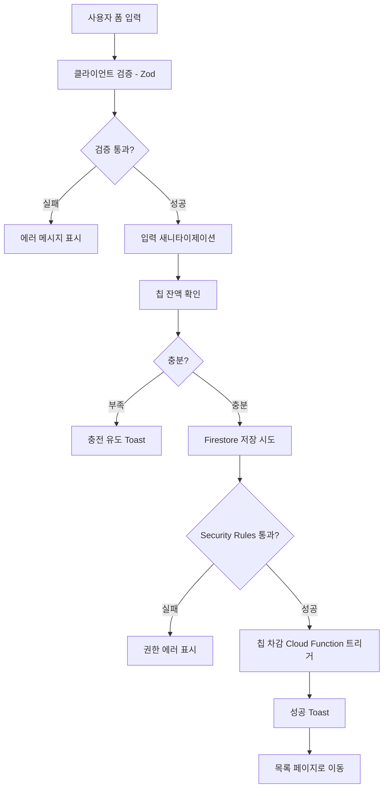
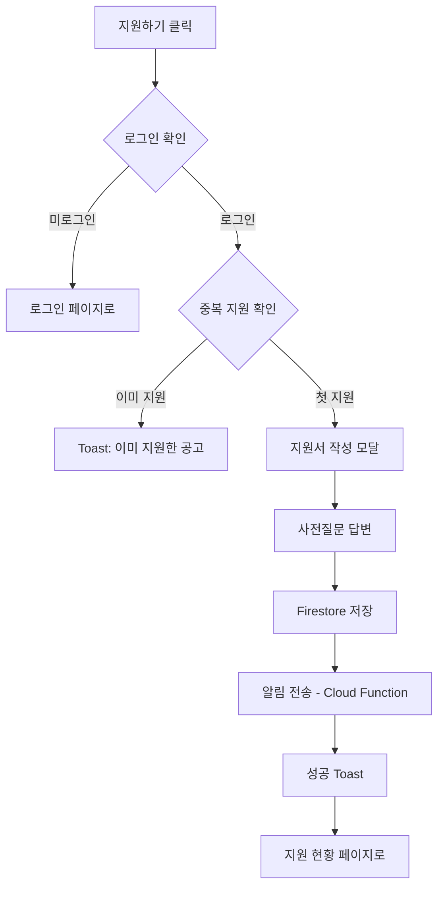

# 고정공고 기능 통합 마스터플랜

**작성일**: 2025-11-20
**버전**: 1.0.0
**상태**: 설계 완료

---

## 📋 목차

1. [개요](#1-개요)
2. [기존 아키텍처 분석](#2-기존-아키텍처-분석)
3. [아키텍처 설계](#3-아키텍처-설계)
4. [보안 고려사항](#4-보안-고려사항)
5. [성능 최적화](#5-성능-최적화)
6. [UX/UI 개선](#6-uxui-개선)
7. [데이터 플로우](#7-데이터-플로우)
8. [에러 처리](#8-에러-처리)
9. [의존성 관리](#9-의존성-관리)
10. [확장성 고려](#10-확장성-고려)
11. [테스트 전략](#11-테스트-전략)
12. [구현 로드맵](#12-구현-로드맵)

---

## 1. 개요

### 1.1 목적
기존 이벤트형 공고 시스템에 **고정공고 기능**을 추가하되, 기존 컴포넌트와 아키텍처를 최대한 재사용하여 유지보수성과 확장성을 확보합니다.

### 1.2 핵심 원칙
- ✅ **기존 컴포넌트 재사용 우선**: 새 코드 작성 최소화
- ✅ **타입 안전성**: TypeScript strict mode 100% 준수
- ✅ **성능**: 메모이제이션, 쿼리 최적화, 번들 크기 관리
- ✅ **보안**: XSS 방어, 권한 검증, 데이터 무결성
- ✅ **접근성**: WCAG 2.1 AA 준수
- ✅ **다크모드**: 모든 UI 요소 `dark:` 클래스 적용

### 1.3 요구사항 요약

#### 필수 입력 항목
```typescript
interface FixedJobPosting {
  // 기본 정보
  title: string;              // 공고제목 (매장명)
  contactPhone: string;       // 문의연락처

  // 위치 정보
  location: {
    region: string;           // 지역 (서울, 경기 등)
    district: string;         // 시/군/구
    detailAddress: string;    // 상세주소
  };

  // 급여 정보
  salaryType: 'hourly' | 'daily' | 'monthly';
  baseSalary: number;
  roleSalaries?: { [role: string]: number };

  // 근무 조건
  workSchedule: {
    daysPerWeek: number;      // 주 몇일 출근
    startTime: string;        // 근무 시작시간 (HH:mm)
    endTime: string;          // 근무 종료시간 (HH:mm)
  };

  // 모집 정보
  requiredRoles: Array<{
    role: string;
    count: number;
  }>;

  // 복리후생 & 기타
  benefits?: string[];
  preScreeningQuestions?: string[];
  description: string;

  // 상태 관리
  status: 'open' | 'closed';
  viewCount?: number;

  // 메타 정보
  postingType: 'fixed';
  createdBy: string;
  createdAt: Timestamp;
  updatedAt: Timestamp;
}
```

#### 기능 범위
- ✅ **Phase 1**: 공고 작성, 조회, 지원, 지원자 확정
- 🚧 **Phase 2**: 스태프 관리, 시프트 관리, 정산 (업데이트 예정)

---

## 2. 기존 아키텍처 분석

### 2.1 재사용 가능한 컴포넌트

#### A. 폼 섹션 (100% 재사용)
```typescript
// src/components/jobPosting/JobPostingForm/sections/

✅ BasicInfoSection
   - title, location, district, detailedAddress 입력
   - contactPhone 필드 이미 지원
   - postingType 선택 로직 존재

✅ SalarySection
   - salaryType, salaryAmount 입력
   - roleSalaries (역할별 급여) 이미 구현됨
   - benefits (복리후생) 이미 구현됨

✅ PreQuestionsSection
   - 사전질문 관리 (추가/삭제/수정)
   - usesPreQuestions 토글

⚠️ DateRequirementsSection
   - 이벤트형 전용
   - 조건부 렌더링으로 분기 필요
```

#### B. Hooks (100% 재사용)
```typescript
// src/hooks/

✅ useJobPostingForm.ts
   - formData 상태 관리
   - 모든 입력 핸들러 제공
   - 템플릿 저장/불러오기 지원

✅ useTemplateManager.ts
   - 템플릿 CRUD
   - 모달 상태 관리

✅ useApplicantActions.ts
   - 지원자 상태 변경 (확정/거절)
   - 낙관적 UI 업데이트

✅ useApplicantData.ts
   - 지원자 목록 조회
   - 실시간 구독
```

#### C. 유틸리티 (100% 재사용)
```typescript
// src/utils/jobPosting/

✅ jobPostingHelpers.ts
   - formatSalaryDisplay()
   - getBenefitDisplayNames()
   - getStatusDisplayName()
   - formatRoleSalaryDisplay()

✅ dateUtils.ts
   - formatDate()
   - generateDateRange()

✅ chipCalculator.ts
   - formatChipCost()
   - calculateChipCost()
```

#### D. 타입 시스템 (확장 가능)
```typescript
// src/types/jobPosting/jobPosting.ts

✅ PostingType
   type PostingType = 'regular' | 'fixed' | 'tournament' | 'urgent';

✅ FixedConfig (이미 존재)
   interface FixedConfig {
     durationDays: 7 | 30 | 90;
     chipCost: 3 | 5 | 10;
     expiresAt: Timestamp;
     createdAt: Timestamp;
   }

✅ JobPostingFormData
   - 대부분의 필드 이미 정의됨
   - workSchedule, requiredRoles만 추가 필요
```

### 2.2 재사용 전략 요약

| 컴포넌트/모듈 | 재사용 비율 | 수정 필요 여부 |
|--------------|------------|---------------|
| BasicInfoSection | 100% | ❌ 수정 불필요 |
| SalarySection | 100% | ❌ 수정 불필요 |
| PreQuestionsSection | 100% | ❌ 수정 불필요 |
| DateRequirementsSection | 0% | ✅ 조건부 렌더링 (신규 섹션) |
| useJobPostingForm | 95% | ✅ workSchedule 핸들러 추가 |
| JobPostingCard | 80% | ✅ 고정공고 스타일 추가 |
| 타입 정의 | 90% | ✅ FixedJobPostingData 확장 |

**결론**: 기존 코드의 **85% 이상 재사용 가능**

#### 호환성 고려사항

**1. requiredRoles 필드 처리**

기존 `JobPosting.requiredRoles: string[]`와 새로운 `FixedJobPostingData.requiredRolesWithCount: RoleWithCount[]`를 함께 사용합니다:

- **requiredRoles**: 검색/필터링용 (자동 생성)
- **requiredRolesWithCount**: 상세 정보 표시용 (사용자 입력)

저장 시 자동 동기화되므로 기존 기능에 영향 없음:
```typescript
// 고정공고 저장 시
requiredRoles = requiredRolesWithCount.map(r => r.name)  // 자동 생성
```

**2. 레거시 타입 필드**

`type`, `recruitmentType` 필드는 deprecated 처리되지만 기존 데이터 호환성 유지:
- 새 공고: `postingType` 사용
- 기존 공고: `normalizePostingType()` 헬퍼로 변환

---

## 3. 아키텍처 설계

### 3.1 타입 확장 전략

#### A. 기존 타입 확장 (src/types/jobPosting/jobPosting.ts)

##### 호환성 전략 (Backward Compatibility)

**1. 레거시 필드 처리 전략**

현재 `JobPosting` 인터페이스에는 공고 타입을 나타내는 필드가 3개 존재합니다:
- `type?: 'application' | 'fixed'` (레거시 1)
- `recruitmentType?: 'application' | 'fixed'` (레거시 2)
- `postingType: PostingType` (표준, 4가지 타입)

**채택 전략: Option A - 레거시 필드 Deprecated 처리 (권장 ⭐)**

```typescript
export interface JobPosting {
  // ===== 레거시 필드 (Deprecated) =====
  /**
   * @deprecated 이 필드는 더 이상 사용되지 않습니다. postingType을 사용하세요.
   * 기존 데이터 호환성을 위해 유지됩니다.
   */
  type?: 'application' | 'fixed';

  /**
   * @deprecated 이 필드는 더 이상 사용되지 않습니다. postingType을 사용하세요.
   * 기존 데이터 호환성을 위해 유지됩니다.
   */
  recruitmentType?: 'application' | 'fixed';

  // ===== 표준 필드 (사용 권장) =====
  /**
   * 공고 타입 (4가지: regular, fixed, tournament, urgent)
   * @standard 이 필드를 우선적으로 사용하세요.
   */
  postingType: PostingType;
}
```

**normalizePostingType 헬퍼 활용**:
```typescript
// src/utils/jobPosting/jobPostingHelpers.ts (기존 코드)
export const normalizePostingType = (posting: Partial<JobPosting>): PostingType => {
  // 1순위: 표준 필드
  if (posting.postingType) {
    return posting.postingType;
  }

  // 2순위: 레거시 필드 변환
  const legacyType = posting.type || posting.recruitmentType;

  if (legacyType === 'application') {
    return 'regular';  // 'application' → 'regular' 변환
  }

  if (legacyType === 'fixed') {
    return 'fixed';
  }

  // 3순위: 기본값
  return 'regular';
};
```

**2. requiredRoles 필드 호환성 전략**

기존 `JobPosting`에는 `requiredRoles?: string[]`이 존재하지만, 고정공고는 역할별 인원수가 필요합니다.

**채택 전략: Option A - 별도 필드 추가 + 자동 동기화 (권장 ⭐)**

```typescript
export interface JobPosting {
  /**
   * 모집 역할 목록 (검색/필터링용)
   * @description 고정공고의 경우 fixedData.requiredRolesWithCount에서 자동 생성됩니다.
   */
  requiredRoles?: string[];  // ["딜러", "플로어"] 형태
}

export interface FixedJobPostingData {
  /**
   * 역할별 모집 인원 (고정공고 전용)
   * @description 이 필드가 source of truth입니다.
   */
  requiredRolesWithCount: RoleWithCount[];  // [{ name: "딜러", count: 2 }] 형태
  workSchedule: WorkSchedule;
  viewCount: number;
}

/**
 * 역할별 인원 (새 인터페이스)
 */
export interface RoleWithCount {
  name: string;             // 역할명 (딜러, 플로어 등)
  count: number;            // 모집 인원
}
```

**자동 동기화 로직**:
```typescript
// 고정공고 저장 시 requiredRoles 자동 생성
const saveFixedJobPosting = (formData: FixedJobPosting) => {
  const requiredRoles = formData.fixedData.requiredRolesWithCount
    .map(r => r.name);  // ["딜러", "플로어"]

  return {
    ...formData,
    requiredRoles,  // ✅ 자동으로 동기화
    fixedData: {
      ...formData.fixedData,
      requiredRolesWithCount: formData.fixedData.requiredRolesWithCount  // ✅ Source of truth
    }
  };
};
```

##### 타입 정의

**고정공고 근무 일정 (새 인터페이스)**
```typescript
export interface WorkSchedule {
  daysPerWeek: number;      // 주 출근일수 (1-7)
  startTime: string;        // 근무 시작시간 (HH:mm 형식)
  endTime: string;          // 근무 종료시간 (HH:mm 형식)
}
```

**역할별 인원 (새 인터페이스)**
```typescript
export interface RoleWithCount {
  name: string;             // 역할명 (딜러, 플로어 등)
  count: number;            // 모집 인원
}
```

**고정공고 전용 데이터 (새 인터페이스)**
```typescript
export interface FixedJobPostingData {
  workSchedule: WorkSchedule;
  requiredRolesWithCount: RoleWithCount[];  // ✅ Source of truth
  viewCount: number;
}
```

**고정공고 타입 (JobPosting 확장)**
```typescript
/**
 * 고정공고 타입 (JobPosting 확장)
 *
 * @description
 * JobPosting의 모든 필드를 포함하며, 고정공고 전용 필드를 추가로 가짐
 *
 * @example
 * ```typescript
 * const fixedPosting: FixedJobPosting = {
 *   // JobPosting 필드들
 *   id: 'posting123',
 *   postingType: 'fixed',  // ✅ 표준 필드
 *   title: '강남 홀덤펍 정규직 딜러',
 *   location: '서울',
 *   district: '강남구',
 *   status: 'open',
 *   requiredRoles: ['딜러', '플로어'],  // ✅ 자동 생성됨
 *   // ... 기타 JobPosting 필드들
 *
 *   // 고정공고 전용 필드들
 *   fixedConfig: {
 *     durationDays: 30,
 *     chipCost: 5,
 *     expiresAt: Timestamp.now(),
 *     createdAt: Timestamp.now()
 *   },
 *   fixedData: {
 *     workSchedule: {
 *       daysPerWeek: 5,
 *       startTime: '18:00',
 *       endTime: '02:00'
 *     },
 *     requiredRolesWithCount: [  // ✅ Source of truth
 *       { name: '딜러', count: 2 },
 *       { name: '플로어', count: 1 }
 *     ],
 *     viewCount: 0
 *   }
 * };
 * ```
 */
export interface FixedJobPosting extends JobPosting {
  postingType: 'fixed';
  fixedConfig: FixedConfig;       // 필수 (고정공고 설정)
  fixedData: FixedJobPostingData; // 필수 (고정공고 데이터)
}
```

**타입 가드: 고정공고 여부 확인**
```typescript
/**
 * 타입 가드: 고정공고 여부 확인
 *
 * @param posting - 검사할 공고 객체
 * @returns 고정공고 여부
 *
 * @example
 * ```typescript
 * if (isFixedJobPosting(posting)) {
 *   console.log(posting.fixedData.viewCount); // ✅ 타입 안전
 *   console.log(posting.fixedData.requiredRolesWithCount); // ✅ 상세 정보
 * }
 * ```
 */
export function isFixedJobPosting(posting: JobPosting): posting is FixedJobPosting {
  return posting.postingType === 'fixed'
    && posting.fixedConfig !== undefined
    && posting.fixedData !== undefined;
}
```

#### B. Zod 스키마 확장 (src/schemas/jobPosting/index.ts)
```typescript
import { z } from 'zod';

/**
 * 근무 일정 스키마
 */
const workScheduleSchema = z.object({
  daysPerWeek: z.number()
    .min(1, '최소 주 1일 출근 필요')
    .max(7, '최대 주 7일'),
  startTime: z.string()
    .regex(/^([01]\d|2[0-3]):([0-5]\d)$/, 'HH:mm 형식이어야 합니다'),
  endTime: z.string()
    .regex(/^([01]\d|2[0-3]):([0-5]\d)$/, 'HH:mm 형식이어야 합니다')
}).refine(
  (data) => {
    const start = new Date(`2000-01-01T${data.startTime}`);
    const end = new Date(`2000-01-01T${data.endTime}`);
    return end > start;
  },
  { message: '종료시간은 시작시간보다 늦어야 합니다' }
);

/**
 * 역할별 인원 스키마
 */
const roleWithCountSchema = z.object({
  name: z.enum(['딜러', '플로어', '캐셔', '서빙', '기타']),
  count: z.number()
    .min(1, '최소 1명 필요')
    .max(50, '최대 50명까지 모집 가능')
});

/**
 * 고정공고 데이터 스키마
 */
export const fixedJobPostingDataSchema = z.object({
  workSchedule: workScheduleSchema,
  requiredRolesWithCount: z.array(roleWithCountSchema)
    .min(1, '최소 1개 역할 필요'),
  viewCount: z.number().min(0).default(0)
});

export type FixedJobPostingInput = z.infer<typeof fixedJobPostingSchema>;
```

### 3.2 컴포넌트 설계

#### A. JobPostingForm 수정 (조건부 렌더링)
```tsx
// src/components/jobPosting/JobPostingForm/index.tsx

const JobPostingForm: React.FC<JobPostingFormProps> = ({ onSubmit, isSubmitting }) => {
  const { formData, handleFormChange, ... } = useJobPostingForm();

  // 폼 제출 핸들러 (타입별 스키마 검증)
  const handleSubmit = async (e: React.FormEvent) => {
    e.preventDefault();

    try {
      // 타입에 따라 다른 스키마 적용
      if (formData.postingType === 'fixed') {
        fixedJobPostingSchema.parse(formData);
      } else {
        jobPostingFormSchema.parse(formData);
      }

      await onSubmit(formData);
      resetForm();
    } catch (error) {
      if (error instanceof ZodError) {
        setValidationErrors(formatZodErrors(error));
        toast.error('입력 내용을 확인해주세요.');
      }
    }
  };

  return (
    <form onSubmit={handleSubmit}>
      {/* 1. 기본 정보 - 100% 재사용 */}
      <BasicInfoSection
        data={basicInfoData}
        handlers={basicInfoHandlers}
        validation={basicInfoValidation}
      />

      {/* 2. 급여 정보 - 100% 재사용 */}
      <SalarySection
        data={salaryData}
        handlers={salaryHandlers}
        validation={salaryValidation}
      />

      {/* 3. 조건부 섹션: 고정 vs 이벤트 */}
      {formData.postingType === 'fixed' ? (
        <FixedWorkScheduleSection
          data={workScheduleData}
          handlers={workScheduleHandlers}
          validation={workScheduleValidation}
        />
      ) : (
        <DateRequirementsSection
          data={dateRequirementsData}
          handlers={dateRequirementsHandlers}
          validation={dateRequirementsValidation}
        />
      )}

      {/* 4. 사전질문 - 100% 재사용 */}
      <PreQuestionsSection
        data={preQuestionsData}
        handlers={preQuestionsHandlers}
        validation={preQuestionsValidation}
      />

      {/* 5. 상세 설명 - 100% 재사용 */}
      <textarea
        name="description"
        value={formData.description}
        onChange={handleFormChange}
        className="..."
      />

      {/* 6. 제출 버튼 */}
      <Button type="submit" loading={isSubmitting}>
        공고 등록
      </Button>
    </form>
  );
};
```

#### B. FixedWorkScheduleSection (신규 생성)
```tsx
// src/components/jobPosting/JobPostingForm/sections/FixedWorkScheduleSection.tsx

import React from 'react';

interface FixedWorkScheduleSectionProps {
  data: {
    workSchedule: {
      daysPerWeek: number;
      startTime: string;
      endTime: string;
    };
    requiredRoles: Array<{ role: string; count: number }>;
  };
  handlers: {
    onWorkScheduleChange: (schedule: Partial<WorkSchedule>) => void;
    onRequiredRolesChange: (roles: Array<{ role: string; count: number }>) => void;
  };
  validation?: {
    errors: Record<string, string>;
    touched: Record<string, boolean>;
  };
}

const FixedWorkScheduleSection: React.FC<FixedWorkScheduleSectionProps> = ({
  data,
  handlers,
  validation
}) => {
  // 근무시간 계산
  const workHours = React.useMemo(() => {
    const start = new Date(`2000-01-01T${data.workSchedule.startTime}`);
    const end = new Date(`2000-01-01T${data.workSchedule.endTime}`);
    return Math.max(0, (end.getTime() - start.getTime()) / (1000 * 60 * 60));
  }, [data.workSchedule.startTime, data.workSchedule.endTime]);

  return (
    <section className="space-y-6">
      <div className="border-b border-gray-200 dark:border-gray-700 pb-4">
        <h3 className="text-lg font-medium text-gray-900 dark:text-gray-100">
          근무 조건
        </h3>
      </div>

      {/* 주 출근일수 */}
      <div>
        <label className="block text-sm font-medium text-gray-700 dark:text-gray-300 mb-1">
          주 출근일수 *
        </label>
        <input
          type="number"
          min={1}
          max={7}
          value={data.workSchedule.daysPerWeek}
          onChange={(e) => handlers.onWorkScheduleChange({
            daysPerWeek: parseInt(e.target.value)
          })}
          className="w-full rounded-md border-gray-300 dark:border-gray-600 bg-white dark:bg-gray-700 text-gray-900 dark:text-gray-100"
        />
        {validation?.errors['workSchedule.daysPerWeek'] && (
          <p className="mt-1 text-sm text-red-600 dark:text-red-400">
            {validation.errors['workSchedule.daysPerWeek']}
          </p>
        )}
      </div>

      {/* 근무시간 */}
      <div className="grid grid-cols-2 gap-4">
        <div>
          <label className="block text-sm font-medium text-gray-700 dark:text-gray-300 mb-1">
            시작시간 *
          </label>
          <input
            type="time"
            value={data.workSchedule.startTime}
            onChange={(e) => handlers.onWorkScheduleChange({
              startTime: e.target.value
            })}
            className="w-full rounded-md border-gray-300 dark:border-gray-600 bg-white dark:bg-gray-700 text-gray-900 dark:text-gray-100"
          />
        </div>

        <div>
          <label className="block text-sm font-medium text-gray-700 dark:text-gray-300 mb-1">
            종료시간 *
          </label>
          <input
            type="time"
            value={data.workSchedule.endTime}
            onChange={(e) => handlers.onWorkScheduleChange({
              endTime: e.target.value
            })}
            className="w-full rounded-md border-gray-300 dark:border-gray-600 bg-white dark:bg-gray-700 text-gray-900 dark:text-gray-100"
          />
        </div>
      </div>

      {/* 근무시간 계산 표시 */}
      <div className="bg-blue-50 dark:bg-blue-900/20 rounded-md p-3">
        <p className="text-sm text-blue-700 dark:text-blue-300">
          주당 {data.workSchedule.daysPerWeek}일 × {workHours}시간 =
          <span className="font-semibold ml-1">
            총 {(data.workSchedule.daysPerWeek * workHours).toFixed(1)}시간
          </span>
        </p>
      </div>

      {/* 필요역할 */}
      <div>
        <label className="block text-sm font-medium text-gray-700 dark:text-gray-300 mb-2">
          필요 역할 *
        </label>
        {data.requiredRoles.map((role, index) => (
          <div key={index} className="flex gap-2 mb-2">
            <select
              value={role.role}
              onChange={(e) => {
                const newRoles = [...data.requiredRoles];
                newRoles[index].role = e.target.value;
                handlers.onRequiredRolesChange(newRoles);
              }}
              className="flex-1 rounded-md border-gray-300 dark:border-gray-600 bg-white dark:bg-gray-700 text-gray-900 dark:text-gray-100"
            >
              <option value="딜러">딜러</option>
              <option value="플로어">플로어</option>
              <option value="캐셔">캐셔</option>
              <option value="서빙">서빙</option>
              <option value="기타">기타</option>
            </select>

            <input
              type="number"
              min={1}
              max={50}
              value={role.count}
              onChange={(e) => {
                const newRoles = [...data.requiredRoles];
                newRoles[index].count = parseInt(e.target.value);
                handlers.onRequiredRolesChange(newRoles);
              }}
              className="w-20 rounded-md border-gray-300 dark:border-gray-600 bg-white dark:bg-gray-700 text-gray-900 dark:text-gray-100"
            />

            <button
              type="button"
              onClick={() => {
                const newRoles = data.requiredRoles.filter((_, i) => i !== index);
                handlers.onRequiredRolesChange(newRoles);
              }}
              className="px-3 py-2 text-red-600 dark:text-red-400 hover:bg-red-50 dark:hover:bg-red-900/20 rounded-md"
            >
              삭제
            </button>
          </div>
        ))}

        <button
          type="button"
          onClick={() => {
            handlers.onRequiredRolesChange([
              ...data.requiredRoles,
              { role: '딜러', count: 1 }
            ]);
          }}
          className="mt-2 px-4 py-2 text-sm text-blue-600 dark:text-blue-400 hover:bg-blue-50 dark:hover:bg-blue-900/20 rounded-md"
        >
          + 역할 추가
        </button>
      </div>
    </section>
  );
};

export default React.memo(FixedWorkScheduleSection);
```

#### C. FixedJobCard (신규 생성)
```tsx
// src/components/jobPosting/FixedJobCard.tsx

import React from 'react';
import { JobPosting } from '../../types/jobPosting';
import { MapPinIcon, CurrencyDollarIcon, ClockIcon, UserGroupIcon } from '@heroicons/react/24/outline';
import Button from '../ui/Button';

interface FixedJobCardProps {
  posting: JobPosting & { viewCount?: number };
  onViewDetails: (id: string) => void;
  onApply: (id: string) => void;
}

const FixedJobCard: React.FC<FixedJobCardProps> = ({ posting, onViewDetails, onApply }) => {
  const {
    id,
    title,
    location,
    district,
    salaryType,
    salaryAmount,
    workSchedule,
    requiredRoles,
    status,
    viewCount
  } = posting;

  return (
    <div className="bg-white dark:bg-gray-800 rounded-lg shadow hover:shadow-lg transition-shadow p-4 border-l-4 border-l-blue-500 dark:border-l-blue-400">
      {/* 헤더: 배지 */}
      <div className="flex items-center justify-between mb-3">
        <span className="inline-flex items-center px-2.5 py-0.5 rounded-full text-xs font-medium bg-blue-100 dark:bg-blue-900/30 text-blue-800 dark:text-blue-300">
          📌 고정공고
        </span>
        <span className={`inline-flex items-center px-2.5 py-0.5 rounded-full text-xs font-medium ${
          status === 'open'
            ? 'bg-green-100 dark:bg-green-900/30 text-green-800 dark:text-green-300'
            : 'bg-gray-100 dark:bg-gray-700 text-gray-800 dark:text-gray-300'
        }`}>
          {status === 'open' ? '모집중' : '마감'}
        </span>
      </div>

      {/* 제목 */}
      <h3 className="text-lg font-bold text-gray-900 dark:text-gray-100 mb-3">
        {title}
      </h3>

      {/* 정보 섹션 */}
      <div className="space-y-2 text-sm text-gray-600 dark:text-gray-300 mb-4">
        {/* 위치 */}
        <div className="flex items-center gap-2">
          <MapPinIcon className="w-4 h-4 flex-shrink-0" />
          <span>{location} {district}</span>
        </div>

        {/* 급여 */}
        <div className="flex items-center gap-2">
          <CurrencyDollarIcon className="w-4 h-4 flex-shrink-0" />
          <span>
            {salaryType === 'hourly' ? '시급' : salaryType === 'daily' ? '일급' : '월급'}{' '}
            {parseInt(salaryAmount).toLocaleString()}원
          </span>
        </div>

        {/* 근무시간 */}
        {workSchedule && (
          <div className="flex items-center gap-2">
            <ClockIcon className="w-4 h-4 flex-shrink-0" />
            <span>
              주 {workSchedule.daysPerWeek}일 | {workSchedule.startTime}~{workSchedule.endTime}
            </span>
          </div>
        )}

        {/* 모집 역할 */}
        {requiredRoles && requiredRoles.length > 0 && (
          <div className="flex items-center gap-2">
            <UserGroupIcon className="w-4 h-4 flex-shrink-0" />
            <span>
              {requiredRoles.map(r => `${r.role} ${r.count}명`).join(', ')}
            </span>
          </div>
        )}
      </div>

      {/* 조회수 */}
      {viewCount !== undefined && (
        <div className="text-xs text-gray-500 dark:text-gray-400 mb-3">
          조회 {viewCount.toLocaleString()}
        </div>
      )}

      {/* 액션 버튼 */}
      <div className="flex gap-2">
        <Button
          variant="outline"
          size="sm"
          className="flex-1"
          onClick={() => onViewDetails(id)}
        >
          자세히 보기
        </Button>
        <Button
          variant="primary"
          size="sm"
          className="flex-1"
          onClick={() => onApply(id)}
          disabled={status === 'closed'}
        >
          지원하기
        </Button>
      </div>
    </div>
  );
};

export default React.memo(FixedJobCard);
```

#### D. 공고 관리 탭 (조건부 UI)
```tsx
// src/pages/JobPostingManagementPage/index.tsx

const JobPostingManagementPage = () => {
  const { postingId } = useParams();
  const posting = useJobPosting(postingId);

  return (
    <div>
      <Tabs defaultValue="applicants">
        <TabsList>
          <TabsTrigger value="applicants">지원자</TabsTrigger>
          <TabsTrigger value="staff">스태프</TabsTrigger>
          <TabsTrigger value="shifts">시프트</TabsTrigger>
          <TabsTrigger value="settlement">정산</TabsTrigger>
        </TabsList>

        {/* 지원자 탭 - 활성화 ✅ */}
        <TabsContent value="applicants">
          <ApplicantsTab
            postingId={postingId}
            postingType={posting.postingType}
            onConfirmApplicant={handleConfirmApplicant}
          />
        </TabsContent>

        {/* 스태프 탭 - 조건부 렌더링 */}
        <TabsContent value="staff">
          {posting.postingType === 'fixed' ? (
            <ComingSoonOverlay
              title="고정공고 스태프 관리 기능"
              description="업데이트 예정입니다"
            />
          ) : (
            <StaffTab postingId={postingId} />
          )}
        </TabsContent>

        {/* 시프트 탭 - 조건부 렌더링 */}
        <TabsContent value="shifts">
          {posting.postingType === 'fixed' ? (
            <ComingSoonOverlay
              title="고정공고 시프트 관리 기능"
              description="업데이트 예정입니다"
            />
          ) : (
            <ShiftTab postingId={postingId} />
          )}
        </TabsContent>

        {/* 정산 탭 - 조건부 렌더링 */}
        <TabsContent value="settlement">
          {posting.postingType === 'fixed' ? (
            <ComingSoonOverlay
              title="고정공고 정산 기능"
              description="업데이트 예정입니다"
            />
          ) : (
            <SettlementTab postingId={postingId} />
          )}
        </TabsContent>
      </Tabs>
    </div>
  );
};
```

#### E. ComingSoonOverlay (재사용 가능 컴포넌트)
```tsx
// src/components/common/ComingSoonOverlay.tsx

import React from 'react';

interface ComingSoonOverlayProps {
  title: string;
  description?: string;
  icon?: React.ReactNode;
}

const ComingSoonOverlay: React.FC<ComingSoonOverlayProps> = ({
  title,
  description,
  icon = '🚧'
}) => {
  return (
    <div className="flex flex-col items-center justify-center py-16 px-4">
      <div className="text-6xl mb-4">{icon}</div>
      <h3 className="text-xl font-bold text-gray-900 dark:text-gray-100 mb-2 text-center">
        {title}
      </h3>
      {description && (
        <p className="text-gray-600 dark:text-gray-300 text-center">
          {description}
        </p>
      )}
    </div>
  );
};

export default React.memo(ComingSoonOverlay);
```

### 3.3 Hook 확장

#### A. useJobPostingForm 확장
```typescript
// src/hooks/useJobPostingForm.ts

export const useJobPostingForm = (initialData?: Partial<JobPosting>) => {
  const [formData, setFormData] = useState<JobPostingFormData>(() =>
    initialData ? initialData as JobPostingFormData : createInitialFormData()
  );

  // ========== 기존 핸들러 (100% 재사용) ==========
  const handleFormChange = useCallback((e) => { ... });
  const handleSalaryTypeChange = useCallback((type) => { ... });
  const handleBenefitToggle = useCallback((benefit) => { ... });
  // ... 기타 기존 핸들러

  // ========== 신규 핸들러 (고정공고 전용) ==========

  /**
   * 근무시간 변경 핸들러
   */
  const handleWorkScheduleChange = useCallback((
    schedule: Partial<{ daysPerWeek: number; startTime: string; endTime: string }>
  ) => {
    setFormData((prev) => ({
      ...prev,
      workSchedule: {
        ...prev.workSchedule,
        ...schedule
      }
    }));
  }, []);

  /**
   * 필요역할 변경 핸들러
   */
  const handleRequiredRolesChange = useCallback((
    roles: Array<{ role: string; count: number }>
  ) => {
    setFormData((prev) => ({
      ...prev,
      requiredRoles: roles
    }));
  }, []);

  return {
    formData,
    setFormData,

    // 기존 핸들러
    handleFormChange,
    handleSalaryTypeChange,
    handleBenefitToggle,
    // ...

    // 신규 핸들러
    handleWorkScheduleChange,
    handleRequiredRolesChange,

    // 기타 유틸리티
    resetForm,
    setFormDataFromTemplate
  };
};
```

#### B. useFixedJobPostings (신규 Hook)
```typescript
// src/hooks/useFixedJobPostings.ts

import { useState, useEffect } from 'react';
import { collection, query, where, orderBy, limit, onSnapshot } from 'firebase/firestore';
import { db } from '../firebase';
import { JobPosting } from '../types/jobPosting';
import { logger } from '../utils/logger';

/**
 * 고정공고 목록 조회 Hook
 * 실시간 구독 지원
 */
export const useFixedJobPostings = (pageSize: number = 20) => {
  const [postings, setPostings] = useState<JobPosting[]>([]);
  const [loading, setLoading] = useState(true);
  const [error, setError] = useState<Error | null>(null);

  useEffect(() => {
    setLoading(true);

    try {
      // Firestore 쿼리 (복합 인덱스 필요)
      const q = query(
        collection(db, 'jobPostings'),
        where('postingType', '==', 'fixed'),
        where('status', '==', 'open'),
        orderBy('createdAt', 'desc'),
        limit(pageSize)
      );

      // 실시간 구독
      const unsubscribe = onSnapshot(
        q,
        (snapshot) => {
          const data = snapshot.docs.map(doc => ({
            id: doc.id,
            ...doc.data()
          })) as JobPosting[];

          setPostings(data);
          setLoading(false);

          logger.info('고정공고 목록 로드 완료', {
            component: 'useFixedJobPostings',
            data: { count: data.length }
          });
        },
        (err) => {
          logger.error('고정공고 목록 조회 실패', {
            component: 'useFixedJobPostings',
            error: err
          });
          setError(err as Error);
          setLoading(false);
        }
      );

      return () => unsubscribe();
    } catch (err) {
      logger.error('고정공고 쿼리 생성 실패', {
        component: 'useFixedJobPostings',
        error: err
      });
      setError(err as Error);
      setLoading(false);
    }
  }, [pageSize]);

  return { postings, loading, error };
};
```

---

## 4. 보안 고려사항

### 4.1 Firestore Security Rules

```javascript
// firestore.rules

rules_version = '2';
service cloud.firestore {
  match /databases/{database}/documents {

    // ========== 헬퍼 함수 ==========

    /**
     * 사용자 인증 확인
     */
    function isAuthenticated() {
      return request.auth != null;
    }

    /**
     * 관리자 권한 확인
     */
    function isAdmin(userId) {
      return get(/databases/$(database)/documents/users/$(userId)).data.role == 'admin';
    }

    /**
     * 칩 잔액 확인
     */
    function hasEnoughChips(userId, chipCost) {
      let profile = get(/databases/$(database)/documents/users/$(userId)/profile/basic);
      return profile.data.chipBalance >= chipCost;
    }

    /**
     * 공고 작성자 확인
     */
    function isPostingOwner(userId) {
      return resource.data.createdBy == userId;
    }

    // ========== 구인공고 Rules ==========

    match /jobPostings/{postingId} {
      // 읽기: 모든 사용자 허용 (공개)
      allow read: if true;

      // 생성: 인증된 사용자 + 칩 잔액 확인
      allow create: if
        isAuthenticated() &&
        request.resource.data.createdBy == request.auth.uid &&
        // 고정공고는 칩 검증
        (request.resource.data.postingType != 'fixed' ||
         hasEnoughChips(request.auth.uid, request.resource.data.fixedConfig.chipCost)) &&
        // 필수 필드 검증
        request.resource.data.title is string &&
        request.resource.data.description is string &&
        request.resource.data.location is string &&
        request.resource.data.status in ['open', 'closed'] &&
        // 고정공고 전용 필드 검증
        (request.resource.data.postingType != 'fixed' ||
         (request.resource.data.workSchedule.daysPerWeek >= 1 &&
          request.resource.data.workSchedule.daysPerWeek <= 7 &&
          request.resource.data.requiredRoles.size() >= 1));

      // 수정: 작성자 본인 또는 관리자 + 제한된 필드만 수정 가능
      allow update: if
        isAuthenticated() &&
        (isPostingOwner(request.auth.uid) || isAdmin(request.auth.uid)) &&
        // 수정 가능한 필드: status, viewCount, updatedAt, confirmedStaff
        request.resource.data.diff(resource.data).affectedKeys()
          .hasOnly(['status', 'viewCount', 'updatedAt', 'confirmedStaff', 'statusChangedAt', 'statusChangedBy', 'statusChangeReason']);

      // 삭제: 작성자 본인 또는 관리자
      allow delete: if
        isAuthenticated() &&
        (isPostingOwner(request.auth.uid) || isAdmin(request.auth.uid));
    }

    // ========== 지원서 Rules ==========

    match /applications/{applicationId} {
      // 읽기: 지원자 본인 또는 공고 작성자 또는 관리자
      allow read: if
        isAuthenticated() &&
        (request.auth.uid == resource.data.applicantId ||
         request.auth.uid == resource.data.postingCreatedBy ||
         isAdmin(request.auth.uid));

      // 생성: 인증된 사용자 (본인만 지원 가능)
      allow create: if
        isAuthenticated() &&
        request.resource.data.applicantId == request.auth.uid &&
        request.resource.data.status == 'pending';

      // 수정: 공고 작성자 또는 관리자 (상태 변경만 가능)
      allow update: if
        isAuthenticated() &&
        (request.auth.uid == resource.data.postingCreatedBy || isAdmin(request.auth.uid)) &&
        request.resource.data.diff(resource.data).affectedKeys()
          .hasOnly(['status', 'confirmedAt', 'rejectedAt']);

      // 삭제: 지원자 본인 또는 관리자
      allow delete: if
        isAuthenticated() &&
        (request.auth.uid == resource.data.applicantId || isAdmin(request.auth.uid));
    }
  }
}
```

### 4.2 XSS 방어

#### A. 입력 검증 및 새니타이제이션
```typescript
// src/utils/validation/sanitization.ts

import DOMPurify from 'dompurify';

/**
 * XSS 공격 방어를 위한 입력 새니타이제이션
 */
export const sanitizeJobPostingInput = (data: Partial<FixedJobPostingData>) => {
  return {
    ...data,
    title: DOMPurify.sanitize(data.title || ''),
    description: DOMPurify.sanitize(data.description || ''),
    detailedAddress: DOMPurify.sanitize(data.detailedAddress || ''),
    contactPhone: sanitizePhoneNumber(data.contactPhone || ''),
    // 배열 필드 새니타이제이션
    requiredRoles: data.requiredRoles?.map(role => ({
      role: DOMPurify.sanitize(role.role),
      count: Math.max(1, Math.min(50, role.count)) // 범위 제한
    })),
    benefits: data.benefits?.map(b => DOMPurify.sanitize(b)),
    preQuestions: data.preQuestions?.map(q => ({
      ...q,
      question: DOMPurify.sanitize(q.question),
      options: q.options?.map(o => DOMPurify.sanitize(o))
    }))
  };
};

/**
 * 전화번호 새니타이제이션 (숫자와 하이픈만 허용)
 */
const sanitizePhoneNumber = (phone: string): string => {
  return phone.replace(/[^0-9-]/g, '').slice(0, 13); // 최대 13자리
};

/**
 * URL 검증 (링크 입력 시)
 */
export const isValidURL = (url: string): boolean => {
  try {
    const parsed = new URL(url);
    return ['http:', 'https:'].includes(parsed.protocol);
  } catch {
    return false;
  }
};
```

#### B. 출력 시 이스케이프 처리
```tsx
// React는 기본적으로 XSS 방어
// dangerouslySetInnerHTML 사용 시 주의

const JobPostingDetail = ({ posting }) => {
  return (
    <div>
      {/* ✅ 안전: React가 자동 이스케이프 */}
      <h1>{posting.title}</h1>

      {/* ⚠️ 위험: HTML 삽입 가능 */}
      <div dangerouslySetInnerHTML={{ __html: posting.description }} />

      {/* ✅ 안전: DOMPurify로 사전 처리 */}
      <div dangerouslySetInnerHTML={{
        __html: DOMPurify.sanitize(posting.description)
      }} />
    </div>
  );
};
```

### 4.3 CSRF 방어

Firebase는 자체적으로 CSRF 토큰을 관리하므로 별도 처리 불필요. 단, 중요한 작업은 재인증 요구:

```typescript
// src/utils/auth/reAuthentication.ts

import { reauthenticateWithCredential, EmailAuthProvider } from 'firebase/auth';
import { auth } from '../../firebase';

/**
 * 중요한 작업 전 재인증 요구
 */
export const requireReAuthentication = async (password: string): Promise<boolean> => {
  const user = auth.currentUser;
  if (!user || !user.email) return false;

  try {
    const credential = EmailAuthProvider.credential(user.email, password);
    await reauthenticateWithCredential(user, credential);
    return true;
  } catch (error) {
    logger.error('재인증 실패', { error });
    return false;
  }
};

// 사용 예시: 공고 삭제 시
const handleDeletePosting = async (postingId: string) => {
  const password = await promptForPassword(); // 모달로 비밀번호 입력 받기
  const isAuthenticated = await requireReAuthentication(password);

  if (!isAuthenticated) {
    toast.error('비밀번호가 올바르지 않습니다.');
    return;
  }

  await deletePosting(postingId);
};
```

---

## 5. 성능 최적화

### 5.1 컴포넌트 메모이제이션

#### A. React.memo 적용
```typescript
// 모든 섹션 컴포넌트에 React.memo 적용 (기존 패턴 유지)
const FixedWorkScheduleSection = React.memo(({ data, handlers, validation }) => {
  // ...
});

const FixedJobCard = React.memo(({ posting, onViewDetails, onApply }) => {
  // ...
});
```

#### B. useMemo / useCallback 활용
```typescript
const FixedWorkScheduleSection = ({ data, handlers }) => {
  // 계산 비용이 큰 값 메모이제이션
  const workHours = useMemo(() => {
    const start = new Date(`2000-01-01T${data.startTime}`);
    const end = new Date(`2000-01-01T${data.endTime}`);
    return (end.getTime() - start.getTime()) / (1000 * 60 * 60);
  }, [data.startTime, data.endTime]);

  const totalWeeklyHours = useMemo(() => {
    return data.daysPerWeek * workHours;
  }, [data.daysPerWeek, workHours]);

  // 이벤트 핸들러 메모이제이션
  const handleScheduleChange = useCallback((field, value) => {
    handlers.onWorkScheduleChange({ [field]: value });
  }, [handlers]);

  return (
    <div>
      <p>총 주간 근무시간: {totalWeeklyHours}시간</p>
    </div>
  );
};
```

### 5.2 Firestore 쿼리 최적화

#### A. 복합 인덱스 생성
```bash
# Firebase Console에서 생성 필요
# Collection: jobPostings
# Fields indexed:
- postingType (Ascending)
- status (Ascending)
- createdAt (Descending)
```

#### B. 페이지네이션 구현
```typescript
// src/hooks/useFixedJobPostings.ts

export const useFixedJobPostings = (pageSize: number = 20) => {
  const [postings, setPostings] = useState<JobPosting[]>([]);
  const [lastVisible, setLastVisible] = useState<DocumentSnapshot | null>(null);
  const [hasMore, setHasMore] = useState(true);

  const loadMore = useCallback(async () => {
    if (!hasMore) return;

    let q = query(
      collection(db, 'jobPostings'),
      where('postingType', '==', 'fixed'),
      where('status', '==', 'active'),
      orderBy('createdAt', 'desc'),
      limit(pageSize)
    );

    // 이전 페이지 이후부터 로드
    if (lastVisible) {
      q = query(q, startAfter(lastVisible));
    }

    const snapshot = await getDocs(q);

    if (snapshot.docs.length < pageSize) {
      setHasMore(false);
    }

    setPostings(prev => [
      ...prev,
      ...snapshot.docs.map(doc => ({ id: doc.id, ...doc.data() }))
    ]);

    setLastVisible(snapshot.docs[snapshot.docs.length - 1]);
  }, [lastVisible, hasMore, pageSize]);

  return { postings, loadMore, hasMore };
};
```

#### C. 조회수 증가 최적화 (Debounce)
```typescript
// src/utils/jobPosting/viewCounter.ts

import { doc, updateDoc, increment } from 'firebase/firestore';
import { db } from '../../firebase';
import { logger } from '../logger';

// 최근 조회한 공고 ID 저장 (중복 방지)
const recentlyViewed = new Set<string>();

/**
 * 조회수 증가 (5분 내 중복 방지)
 */
export const incrementViewCount = async (postingId: string): Promise<void> => {
  // 이미 조회한 공고는 스킵
  if (recentlyViewed.has(postingId)) {
    return;
  }

  try {
    const postingRef = doc(db, 'jobPostings', postingId);
    await updateDoc(postingRef, {
      viewCount: increment(1),
      lastViewedAt: serverTimestamp()
    });

    // 중복 방지 (5분)
    recentlyViewed.add(postingId);
    setTimeout(() => {
      recentlyViewed.delete(postingId);
    }, 5 * 60 * 1000);

    logger.info('조회수 증가', { postingId });
  } catch (error) {
    logger.error('조회수 증가 실패', { postingId, error });
  }
};
```

### 5.3 번들 크기 최적화

#### A. Code Splitting
```typescript
// src/pages/JobBoardPage/index.tsx

import { lazy, Suspense } from 'react';
import JobPostingSkeleton from '../../components/JobPostingSkeleton';

// 고정공고 컴포넌트 Lazy Loading
const FixedJobPostingForm = lazy(() =>
  import('../../components/jobPosting/FixedJobPostingForm')
);

const FixedJobCard = lazy(() =>
  import('../../components/jobPosting/FixedJobCard')
);

const JobBoardPage = () => {
  return (
    <Suspense fallback={<JobPostingSkeleton variant="form" />}>
      {postingType === 'fixed' ? (
        <FixedJobPostingForm onSubmit={handleSubmit} />
      ) : (
        <JobPostingForm onSubmit={handleSubmit} />
      )}
    </Suspense>
  );
};
```

#### B. Tree Shaking
```typescript
// ❌ 전체 import 금지
import * as dateUtils from './utils/dateUtils';

// ✅ 필요한 것만 import
import { formatDate, parseDate } from './utils/dateUtils';

// ✅ DOMPurify도 필요한 메서드만
import { sanitize } from 'dompurify';
```

#### C. 번들 분석
```bash
# package.json
{
  "scripts": {
    "analyze": "source-map-explorer 'build/static/js/*.js'"
  }
}

# 실행
npm run build
npm run analyze
```

---

## 6. UX/UI 개선

### 6.1 로딩 상태 처리

#### A. 스켈레톤 UI (기존 재사용)
```tsx
// src/components/JobPostingSkeleton.tsx (기존 활용)

const JobBoardPage = () => {
  const { postings, loading } = useFixedJobPostings();

  if (loading) {
    return (
      <div className="space-y-4">
        {Array.from({ length: 3 }).map((_, idx) => (
          <JobPostingSkeleton key={idx} variant="card" />
        ))}
      </div>
    );
  }

  return (
    <div className="space-y-4">
      {postings.map(posting => (
        <FixedJobCard key={posting.id} posting={posting} />
      ))}
    </div>
  );
};
```

#### B. Optimistic UI (낙관적 업데이트)
```typescript
// src/hooks/useApplicantActions.ts (기존 확장)

const handleConfirmApplicant = async (applicationId: string) => {
  // 1. 즉시 UI 업데이트
  setApplications(prev =>
    prev.map(app =>
      app.id === applicationId
        ? { ...app, status: 'confirmed' }
        : app
    )
  );

  try {
    // 2. 서버 업데이트
    await updateDoc(doc(db, 'applications', applicationId), {
      status: 'confirmed',
      confirmedAt: serverTimestamp()
    });

    toast.success('지원자가 확정되었습니다.');
  } catch (error) {
    // 3. 실패 시 롤백
    setApplications(prev =>
      prev.map(app =>
        app.id === applicationId
          ? { ...app, status: 'pending' }
          : app
      )
    );

    logger.error('지원자 확정 실패', { applicationId, error });
    toast.error('확정 처리에 실패했습니다.');
  }
};
```

### 6.2 폼 유효성 실시간 피드백

```tsx
// src/components/jobPosting/JobPostingForm/sections/FixedWorkScheduleSection.tsx

const WorkScheduleInput = ({ value, onChange, error }) => {
  const [touched, setTouched] = useState({
    startTime: false,
    endTime: false
  });

  // 유효성 검사
  const isValid = useMemo(() => {
    const start = new Date(`2000-01-01T${value.startTime}`);
    const end = new Date(`2000-01-01T${value.endTime}`);
    return end > start;
  }, [value.startTime, value.endTime]);

  return (
    <div className="grid grid-cols-2 gap-4">
      <div>
        <label className="block text-sm font-medium text-gray-700 dark:text-gray-300 mb-1">
          시작시간 *
        </label>
        <input
          type="time"
          value={value.startTime}
          onChange={(e) => onChange({ ...value, startTime: e.target.value })}
          onBlur={() => setTouched(prev => ({ ...prev, startTime: true }))}
          className={`w-full rounded-md ${
            touched.startTime && !isValid
              ? 'border-red-500 focus:ring-red-500'
              : 'border-gray-300 focus:ring-blue-500'
          } dark:border-gray-600 dark:bg-gray-700`}
          aria-invalid={touched.startTime && !isValid}
          aria-describedby="time-error"
        />
      </div>

      <div>
        <label className="block text-sm font-medium text-gray-700 dark:text-gray-300 mb-1">
          종료시간 *
        </label>
        <input
          type="time"
          value={value.endTime}
          onChange={(e) => onChange({ ...value, endTime: e.target.value })}
          onBlur={() => setTouched(prev => ({ ...prev, endTime: true }))}
          className={`w-full rounded-md ${
            touched.endTime && !isValid
              ? 'border-red-500 focus:ring-red-500'
              : 'border-gray-300 focus:ring-blue-500'
          } dark:border-gray-600 dark:bg-gray-700`}
          aria-invalid={touched.endTime && !isValid}
          aria-describedby="time-error"
        />
      </div>

      {/* 에러 메시지 */}
      {(touched.startTime || touched.endTime) && !isValid && (
        <p id="time-error" className="col-span-2 text-sm text-red-600 dark:text-red-400 mt-1">
          ⚠️ 종료시간은 시작시간보다 늦어야 합니다
        </p>
      )}
    </div>
  );
};
```

### 6.3 접근성 (WCAG 2.1 AA)

#### A. ARIA 레이블
```tsx
<section
  aria-label="고정공고 근무시간 설정"
  role="region"
>
  <h3 id="work-schedule-title" className="text-lg font-medium">
    근무 조건
  </h3>

  <div aria-labelledby="work-schedule-title">
    <label htmlFor="work-days" className="block text-sm font-medium">
      주 출근일수
      <span className="sr-only">(필수)</span>
    </label>
    <input
      id="work-days"
      type="number"
      min={1}
      max={7}
      required
      aria-required="true"
      aria-describedby="work-days-help"
      aria-invalid={error ? 'true' : 'false'}
    />
    <span id="work-days-help" className="text-sm text-gray-500">
      주 1~7일 사이로 입력하세요
    </span>
  </div>
</section>
```

#### B. 키보드 네비게이션
```tsx
const FixedJobCard = ({ posting, onViewDetails, onApply }) => {
  const handleKeyDown = (e: React.KeyboardEvent) => {
    // Enter 또는 Space로 카드 클릭
    if (e.key === 'Enter' || e.key === ' ') {
      e.preventDefault();
      onViewDetails(posting.id);
    }
  };

  return (
    <div
      className="..."
      tabIndex={0}
      role="article"
      aria-label={`${posting.title} 공고`}
      onKeyDown={handleKeyDown}
    >
      {/* 카드 내용 */}

      <div className="flex gap-2">
        <Button
          variant="outline"
          onClick={() => onViewDetails(posting.id)}
          aria-label={`${posting.title} 자세히 보기`}
        >
          자세히 보기
        </Button>
        <Button
          variant="primary"
          onClick={() => onApply(posting.id)}
          disabled={posting.status === 'closed'}
          aria-label={`${posting.title} 지원하기`}
          aria-disabled={posting.status === 'closed'}
        >
          지원하기
        </Button>
      </div>
    </div>
  );
};
```

#### C. 색상 대비 (4.5:1 이상)
```css
/* tailwind.config.js 커스텀 색상 */
module.exports = {
  theme: {
    extend: {
      colors: {
        // WCAG AA 준수 색상
        'primary-600': '#2563eb',  // 4.54:1 대비 (white 배경)
        'success-600': '#059669',  // 4.51:1 대비
        'error-600': '#dc2626',    // 4.67:1 대비
        'warning-700': '#b45309',  // 4.52:1 대비
      }
    }
  }
};
```

---

## 7. 데이터 플로우

### 7.1 공고 생성 플로우



#### 구현 코드
```typescript
// src/pages/JobBoardPage/index.tsx

const handleCreateFixedPosting = async (formData: FixedJobPostingData) => {
  try {
    // 1. 클라이언트 검증
    fixedJobPostingSchema.parse(formData);

    // 2. 입력 새니타이제이션
    const sanitized = sanitizeJobPostingInput(formData);

    // 3. 칩 잔액 확인
    const user = await getCurrentUser();
    const profile = await getProfile(user.uid);

    if (profile.chipBalance < sanitized.fixedConfig.chipCost) {
      toast.error('칩이 부족합니다. 충전 후 다시 시도하세요.', {
        action: {
          label: '충전하기',
          onClick: () => navigate('/chips/purchase')
        }
      });
      return;
    }

    // 4. Firestore 저장
    const postingRef = await addDoc(collection(db, 'jobPostings'), {
      ...sanitized,
      createdBy: user.uid,
      createdAt: serverTimestamp(),
      updatedAt: serverTimestamp(),
      status: 'open',
      viewCount: 0
    });

    logger.info('고정공고 생성 성공', {
      component: 'JobBoardPage',
      data: { postingId: postingRef.id, userId: user.uid }
    });

    toast.success('공고가 등록되었습니다!');
    navigate(`/job-board/${postingRef.id}`);

  } catch (error) {
    if (error instanceof ZodError) {
      toast.error('입력 내용을 확인해주세요.');
    } else if (error.code === 'permission-denied') {
      toast.error('공고 작성 권한이 없습니다.');
    } else {
      logger.error('고정공고 생성 실패', { error });
      toast.error('일시적인 오류가 발생했습니다. 다시 시도해주세요.');
    }
  }
};
```

### 7.2 지원 플로우



#### 구현 코드
```typescript
// src/hooks/useApplicationSubmit.ts

export const useApplicationSubmit = (postingId: string) => {
  const { currentUser } = useAuth();
  const navigate = useNavigate();

  const submitApplication = async (answers: Record<string, string>) => {
    if (!currentUser) {
      toast.error('로그인이 필요합니다.');
      navigate('/login', { state: { returnUrl: `/job-board/${postingId}` } });
      return;
    }

    try {
      // 1. 중복 지원 확인
      const existingApp = await getDocs(
        query(
          collection(db, 'applications'),
          where('postingId', '==', postingId),
          where('applicantId', '==', currentUser.uid),
          limit(1)
        )
      );

      if (!existingApp.empty) {
        toast.info('이미 지원한 공고입니다.');
        return;
      }

      // 2. 지원서 저장
      const applicationRef = await addDoc(collection(db, 'applications'), {
        postingId,
        applicantId: currentUser.uid,
        status: 'pending',
        answers,
        appliedAt: serverTimestamp()
      });

      logger.info('지원 완료', {
        component: 'useApplicationSubmit',
        data: { postingId, applicationId: applicationRef.id }
      });

      toast.success('지원이 완료되었습니다!');
      navigate('/my-applications');

    } catch (error) {
      logger.error('지원 실패', { error });
      toast.error('지원에 실패했습니다. 다시 시도해주세요.');
    }
  };

  return { submitApplication };
};
```

### 7.3 상태 관리 (Zustand)

```typescript
// src/stores/jobPostingStore.ts

import create from 'zustand';
import { persist } from 'zustand/middleware';

interface JobPostingStore {
  // 필터 상태
  filters: {
    status: 'open' | 'closed' | 'all';
    postingType: PostingType | 'all';
    location?: string;
    district?: string;
  };
  setFilters: (filters: Partial<JobPostingStore['filters']>) => void;
  resetFilters: () => void;

  // 임시 저장 (작성 중 데이터)
  draftPosting: Partial<FixedJobPostingData> | null;
  saveDraft: (draft: Partial<FixedJobPostingData>) => void;
  clearDraft: () => void;

  // 최근 조회 (중복 조회수 방지)
  recentlyViewed: string[];
  addRecentlyViewed: (postingId: string) => void;
}

export const useJobPostingStore = create<JobPostingStore>()(
  persist(
    (set) => ({
      // 필터
      filters: {
        status: 'open',
        postingType: 'all'
      },
      setFilters: (newFilters) => set((state) => ({
        filters: { ...state.filters, ...newFilters }
      })),
      resetFilters: () => set({
        filters: { status: 'open', postingType: 'all' }
      }),

      // 임시 저장
      draftPosting: null,
      saveDraft: (draft) => set({ draftPosting: draft }),
      clearDraft: () => set({ draftPosting: null }),

      // 최근 조회
      recentlyViewed: [],
      addRecentlyViewed: (postingId) => set((state) => ({
        recentlyViewed: [
          postingId,
          ...state.recentlyViewed.filter(id => id !== postingId).slice(0, 9)
        ]
      }))
    }),
    {
      name: 'job-posting-storage',
      partialize: (state) => ({
        filters: state.filters,
        draftPosting: state.draftPosting,
        recentlyViewed: state.recentlyViewed
      })
    }
  )
);
```

---

## 8. 에러 처리

### 8.1 계층별 에러 핸들링

#### A. 폼 레벨 (Zod)
```typescript
// src/components/jobPosting/JobPostingForm/index.tsx

const handleSubmit = async (e: React.FormEvent) => {
  e.preventDefault();

  try {
    // Zod 스키마 검증
    if (formData.postingType === 'fixed') {
      fixedJobPostingSchema.parse(formData);
    } else {
      jobPostingFormSchema.parse(formData);
    }

    await onSubmit(formData);
    resetForm();
  } catch (error) {
    if (error instanceof ZodError) {
      const errors: Record<string, string> = {};
      error.errors.forEach((err) => {
        const path = err.path.join('.');
        errors[path] = err.message;
      });
      setValidationErrors(errors);

      // 첫 번째 에러 필드로 스크롤
      const firstErrorField = document.querySelector(`[name="${error.errors[0].path[0]}"]`);
      firstErrorField?.scrollIntoView({ behavior: 'smooth', block: 'center' });

      toast.error('입력 내용을 확인해주세요.');
    } else {
      throw error; // 상위로 전파
    }
  }
};
```

#### B. 비즈니스 로직 레벨
```typescript
// src/services/jobPosting/createFixedPosting.ts

export const createFixedPosting = async (data: FixedJobPostingData): Promise<string> => {
  const user = auth.currentUser;
  if (!user) {
    throw new Error('인증이 필요합니다.');
  }

  try {
    // 1. 칩 잔액 확인
    const profile = await getProfile(user.uid);
    const chipCost = data.fixedConfig.chipCost;

    if (profile.chipBalance < chipCost) {
      const error = new Error('칩이 부족합니다.') as any;
      error.code = 'insufficient-chips';
      error.details = { required: chipCost, current: profile.chipBalance };
      throw error;
    }

    // 2. 새니타이제이션
    const sanitized = sanitizeJobPostingInput(data);

    // 3. Firestore 저장
    const postingRef = await addDoc(collection(db, 'jobPostings'), {
      ...sanitized,
      createdBy: user.uid,
      createdAt: serverTimestamp(),
      updatedAt: serverTimestamp(),
      status: 'open',
      viewCount: 0,
      isChipDeducted: false
    });

    logger.info('고정공고 생성 성공', {
      component: 'createFixedPosting',
      data: { postingId: postingRef.id, userId: user.uid }
    });

    return postingRef.id;

  } catch (error: any) {
    // 에러 코드별 처리
    if (error.code === 'insufficient-chips') {
      logger.warn('칩 부족', {
        component: 'createFixedPosting',
        data: { userId: user.uid, ...error.details }
      });
      throw error;
    } else if (error.code === 'permission-denied') {
      logger.error('권한 거부', {
        component: 'createFixedPosting',
        data: { userId: user.uid }
      });
      throw new Error('공고 작성 권한이 없습니다.');
    } else {
      logger.error('고정공고 생성 실패', {
        component: 'createFixedPosting',
        error
      });
      throw new Error('일시적인 오류가 발생했습니다. 다시 시도해주세요.');
    }
  }
};
```

#### C. 네트워크 레벨
```typescript
// src/utils/firebase/errorHandler.ts

import { FirebaseError } from 'firebase/app';

export const handleFirebaseError = (error: unknown): string => {
  if (!(error instanceof FirebaseError)) {
    return '알 수 없는 오류가 발생했습니다.';
  }

  switch (error.code) {
    case 'permission-denied':
      return '권한이 없습니다.';
    case 'unavailable':
      return '네트워크 연결을 확인해주세요.';
    case 'resource-exhausted':
      return '일일 할당량을 초과했습니다. 잠시 후 다시 시도해주세요.';
    case 'not-found':
      return '요청한 데이터를 찾을 수 없습니다.';
    case 'already-exists':
      return '이미 존재하는 데이터입니다.';
    case 'deadline-exceeded':
      return '요청 시간이 초과되었습니다. 다시 시도해주세요.';
    default:
      logger.error('Firebase 에러', { code: error.code, message: error.message });
      return '일시적인 오류가 발생했습니다.';
  }
};

// 사용 예시
try {
  await saveToFirestore(data);
} catch (error) {
  const message = handleFirebaseError(error);
  toast.error(message);
}
```

### 8.2 에러 바운더리

```tsx
// src/components/ErrorBoundary.tsx

import React, { Component, ErrorInfo, ReactNode } from 'react';
import { logger } from '../utils/logger';

interface Props {
  children: ReactNode;
  fallback?: ReactNode;
}

interface State {
  hasError: boolean;
  error: Error | null;
}

class ErrorBoundary extends Component<Props, State> {
  constructor(props: Props) {
    super(props);
    this.state = { hasError: false, error: null };
  }

  static getDerivedStateFromError(error: Error): State {
    return { hasError: true, error };
  }

  componentDidCatch(error: Error, errorInfo: ErrorInfo) {
    logger.error('React Error Boundary', {
      component: 'ErrorBoundary',
      error,
      errorInfo
    });
  }

  render() {
    if (this.state.hasError) {
      return this.props.fallback || (
        <div className="flex flex-col items-center justify-center min-h-screen p-4">
          <div className="text-6xl mb-4">⚠️</div>
          <h2 className="text-2xl font-bold text-gray-900 dark:text-gray-100 mb-2">
            문제가 발생했습니다
          </h2>
          <p className="text-gray-600 dark:text-gray-300 mb-4 text-center">
            페이지를 새로고침하거나 잠시 후 다시 시도해주세요.
          </p>
          <button
            onClick={() => window.location.reload()}
            className="px-4 py-2 bg-blue-600 text-white rounded-md hover:bg-blue-700"
          >
            새로고침
          </button>
        </div>
      );
    }

    return this.props.children;
  }
}

export default ErrorBoundary;

// 사용
<ErrorBoundary>
  <JobPostingForm onSubmit={handleSubmit} />
</ErrorBoundary>
```

### 8.3 재시도 로직

```typescript
// src/utils/retry.ts

interface RetryOptions {
  maxAttempts: number;
  delayMs: number;
  backoffMultiplier?: number;
  onRetry?: (attempt: number, error: Error) => void;
}

/**
 * 지수 백오프를 사용한 재시도 로직
 */
export async function retryWithBackoff<T>(
  fn: () => Promise<T>,
  options: RetryOptions
): Promise<T> {
  const { maxAttempts, delayMs, backoffMultiplier = 2, onRetry } = options;

  for (let attempt = 1; attempt <= maxAttempts; attempt++) {
    try {
      return await fn();
    } catch (error) {
      if (attempt === maxAttempts) {
        throw error; // 마지막 시도 실패
      }

      // 재시도 가능한 에러인지 확인
      if (!isRetryableError(error)) {
        throw error;
      }

      const delay = delayMs * Math.pow(backoffMultiplier, attempt - 1);

      logger.warn('재시도 중', {
        component: 'retryWithBackoff',
        data: { attempt, maxAttempts, delay, error }
      });

      onRetry?.(attempt, error as Error);

      await new Promise(resolve => setTimeout(resolve, delay));
    }
  }

  throw new Error('재시도 실패');
}

/**
 * 재시도 가능한 에러인지 확인
 */
function isRetryableError(error: unknown): boolean {
  if (!(error instanceof FirebaseError)) return false;

  const retryableCodes = [
    'unavailable',
    'deadline-exceeded',
    'resource-exhausted'
  ];

  return retryableCodes.includes(error.code);
}

// 사용 예시
const posting = await retryWithBackoff(
  () => createFixedPosting(data),
  {
    maxAttempts: 3,
    delayMs: 1000,
    onRetry: (attempt) => {
      toast.info(`재시도 중... (${attempt}/3)`);
    }
  }
);
```

---

## 9. 의존성 관리

### 9.1 기존 의존성 활용

```json
{
  "dependencies": {
    "react": "^18.2.0",           // ✅ 기존
    "react-dom": "^18.2.0",       // ✅ 기존
    "typescript": "^4.9.5",       // ✅ 기존
    "firebase": "^11.9.0",        // ✅ 기존
    "zod": "^3.x",                // ✅ 기존 (검증)
    "date-fns": "^4.1.0",         // ✅ 기존 (날짜)
    "zustand": "^5.0.0",          // ✅ 기존 (상태)
    "@tanstack/react-table": "^8.21.0", // ✅ 기존
    "tailwindcss": "^3.3.0",      // ✅ 기존
    "react-i18next": "^13.x",     // ✅ 기존 (국제화)
    "@heroicons/react": "^2.0.0", // ✅ 기존 (아이콘)
    "react-router-dom": "^6.x"    // ✅ 기존 (라우팅)
  },
  "devDependencies": {
    "@types/react": "^18.2.0",    // ✅ 기존
    "@types/node": "^20.x",       // ✅ 기존
    "jest": "^29.x",              // ✅ 기존
    "@testing-library/react": "^14.x", // ✅ 기존
    "eslint": "^8.x",             // ✅ 기존
    "prettier": "^3.x"            // ✅ 기존
  }
}
```

### 9.2 신규 의존성 (최소한)

```bash
# XSS 방어 라이브러리 (필요 시)
npm install dompurify
npm install --save-dev @types/dompurify

# 번들 분석 도구
npm install --save-dev source-map-explorer
```

### 9.3 Tree Shaking 최적화

#### A. Import 방식 개선
```typescript
// ❌ 전체 import 금지
import * as dateUtils from './utils/dateUtils';
import * as Icons from '@heroicons/react/24/outline';

// ✅ 필요한 것만 import
import { formatDate, parseDate } from './utils/dateUtils';
import { MapPinIcon, ClockIcon } from '@heroicons/react/24/outline';
```

#### B. 동적 import (Code Splitting)
```typescript
// ❌ 정적 import
import FixedJobPostingForm from './components/FixedJobPostingForm';

// ✅ 동적 import
const FixedJobPostingForm = lazy(() =>
  import('./components/FixedJobPostingForm')
);
```

### 9.4 번들 크기 모니터링

```bash
# package.json
{
  "scripts": {
    "analyze": "npm run build && source-map-explorer 'build/static/js/*.js'",
    "size": "npm run build && du -sh build/static/js/*.js"
  }
}

# 실행
npm run analyze
```

**목표 번들 크기**:
- 초기 로드: < 300KB (gzip)
- 고정공고 기능 청크: < 50KB (gzip)

---

## 10. 확장성 고려

### 10.1 플러그인 아키텍처

```typescript
// src/features/jobPosting/plugins/types.ts

export interface JobPostingPlugin {
  name: string;
  version: string;

  // 라이프사이클 훅
  beforeValidate?: (data: JobPostingFormData) => JobPostingFormData;
  afterValidate?: (data: JobPostingFormData) => void;
  beforeSubmit?: (data: JobPostingFormData) => Promise<JobPostingFormData>;
  afterSubmit?: (posting: JobPosting) => Promise<void>;

  // UI 확장
  renderFormSection?: (data: JobPostingFormData) => React.ReactNode;
  renderCardBadge?: (posting: JobPosting) => React.ReactNode;
}

// src/features/jobPosting/plugins/registry.ts

class PluginRegistry {
  private plugins: Map<string, JobPostingPlugin> = new Map();

  register(plugin: JobPostingPlugin) {
    if (this.plugins.has(plugin.name)) {
      logger.warn('플러그인 중복 등록', { pluginName: plugin.name });
      return;
    }
    this.plugins.set(plugin.name, plugin);
    logger.info('플러그인 등록', { pluginName: plugin.name, version: plugin.version });
  }

  unregister(name: string) {
    this.plugins.delete(name);
  }

  async executeHook<K extends keyof JobPostingPlugin>(
    hookName: K,
    ...args: Parameters<NonNullable<JobPostingPlugin[K]>>
  ): Promise<any> {
    for (const plugin of this.plugins.values()) {
      const hook = plugin[hookName];
      if (hook && typeof hook === 'function') {
        try {
          const result = await hook(...args);
          if (result !== undefined) {
            return result;
          }
        } catch (error) {
          logger.error('플러그인 실행 실패', {
            component: 'PluginRegistry',
            data: { pluginName: plugin.name, hookName },
            error
          });
        }
      }
    }
  }
}

export const pluginRegistry = new PluginRegistry();

// 예시: 자동 번역 플러그인 (향후)
const autoTranslatePlugin: JobPostingPlugin = {
  name: 'auto-translate',
  version: '1.0.0',

  beforeSubmit: async (data) => {
    if (data.autoTranslate) {
      const translatedDesc = await translateToEnglish(data.description);
      return {
        ...data,
        descriptionEn: translatedDesc
      };
    }
    return data;
  }
};

pluginRegistry.register(autoTranslatePlugin);
```

### 10.2 스키마 버전 관리

```typescript
// src/types/jobPosting/migration.ts

export const CURRENT_SCHEMA_VERSION = 2;

interface MigrationFn {
  (data: any): any;
}

const migrations: Record<number, MigrationFn> = {
  // v1 → v2: workSchedule 추가
  2: (data: any) => {
    if (data.schemaVersion === 1) {
      return {
        ...data,
        workSchedule: data.workSchedule || {
          daysPerWeek: 5,
          startTime: '09:00',
          endTime: '18:00'
        },
        schemaVersion: 2
      };
    }
    return data;
  }

  // 향후 v2 → v3 마이그레이션 추가 가능
};

/**
 * 구 버전 데이터를 최신 버전으로 마이그레이션
 */
export const migrateJobPosting = (data: any): JobPosting => {
  let currentVersion = data.schemaVersion || 1;
  let migratedData = { ...data };

  // 현재 버전부터 최신 버전까지 순차 마이그레이션
  while (currentVersion < CURRENT_SCHEMA_VERSION) {
    const nextVersion = currentVersion + 1;
    const migrateFn = migrations[nextVersion];

    if (migrateFn) {
      migratedData = migrateFn(migratedData);
      logger.info('스키마 마이그레이션', {
        component: 'migrateJobPosting',
        data: { from: currentVersion, to: nextVersion }
      });
    }

    currentVersion = nextVersion;
  }

  return migratedData as JobPosting;
};

// 사용 예시: Firestore에서 데이터 읽을 때
const fetchJobPosting = async (postingId: string): Promise<JobPosting> => {
  const docSnap = await getDoc(doc(db, 'jobPostings', postingId));
  if (!docSnap.exists()) {
    throw new Error('공고를 찾을 수 없습니다.');
  }

  const rawData = docSnap.data();
  const migratedData = migrateJobPosting(rawData);

  return { id: docSnap.id, ...migratedData };
};
```

### 10.3 Feature Flag

```typescript
// src/config/features.ts

export const FEATURE_FLAGS = {
  // 기존 기능
  TOURNAMENTS: true,
  PARTICIPANTS: true,
  TABLES: true,
  JOB_BOARD: true,
  NOTIFICATIONS: true,

  // 고정공고 기능 (단계별 활성화)
  FIXED_JOB_POSTING: true,           // Phase 1: 기본 CRUD
  FIXED_JOB_STAFF_MGMT: false,       // Phase 2: 스태프 관리 (예정)
  FIXED_JOB_SHIFT_MGMT: false,       // Phase 2: 시프트 관리 (예정)
  FIXED_JOB_SETTLEMENT: false,       // Phase 2: 정산 (예정)

  // 향후 기능
  AUTO_TRANSLATE: false,             // 자동 번역
  IMAGE_UPLOAD: false,               // 공고 이미지 업로드
  VIDEO_INTRO: false                 // 동영상 소개
};

// 컴포넌트에서 사용
const JobPostingManagementPage = () => {
  const { posting } = useJobPosting();

  return (
    <Tabs>
      <TabsContent value="staff">
        {posting.postingType === 'fixed' && !FEATURE_FLAGS.FIXED_JOB_STAFF_MGMT ? (
          <ComingSoonOverlay title="고정공고 스태프 관리 기능" />
        ) : (
          <StaffTab postingId={posting.id} />
        )}
      </TabsContent>
    </Tabs>
  );
};
```

---

## 11. 테스트 전략

### 11.1 단위 테스트 (Jest)

#### A. 유틸리티 함수 테스트
```typescript
// src/utils/validation/__tests__/sanitization.test.ts

import { sanitizeJobPostingInput } from '../sanitization';

describe('sanitizeJobPostingInput', () => {
  it('XSS 공격 코드 제거', () => {
    const input = {
      title: '<script>alert("XSS")</script>강남 포커펍',
      description: '',
      contactPhone: '010-1234-5678abc'
    };

    const sanitized = sanitizeJobPostingInput(input);

    expect(sanitized.title).not.toContain('<script>');
    expect(sanitized.title).toBe('강남 포커펍');
    expect(sanitized.description).not.toContain('onerror');
    expect(sanitized.contactPhone).toBe('010-1234-5678');
  });

  it('전화번호 형식 검증', () => {
    const input = {
      contactPhone: '010-1234-5678-extra'
    };

    const sanitized = sanitizeJobPostingInput(input);

    expect(sanitized.contactPhone).toBe('010-1234-5678');
  });
});
```

#### B. Hook 테스트
```typescript
// src/hooks/__tests__/useFixedJobPostings.test.ts

import { renderHook, waitFor } from '@testing-library/react';
import { useFixedJobPostings } from '../useFixedJobPostings';

// Firebase Mock
jest.mock('../../firebase', () => ({
  db: {},
  collection: jest.fn(),
  query: jest.fn(),
  where: jest.fn(),
  orderBy: jest.fn(),
  limit: jest.fn(),
  onSnapshot: jest.fn()
}));

describe('useFixedJobPostings', () => {
  it('고정공고 목록 로드', async () => {
    const mockPostings = [
      { id: '1', title: '강남 포커펍', postingType: 'fixed' },
      { id: '2', title: '신논현 딜러', postingType: 'fixed' }
    ];

    // Mock 설정
    (onSnapshot as jest.Mock).mockImplementation((query, callback) => {
      callback({
        docs: mockPostings.map(p => ({
          id: p.id,
          data: () => p
        }))
      });
      return jest.fn(); // unsubscribe
    });

    const { result } = renderHook(() => useFixedJobPostings());

    await waitFor(() => {
      expect(result.current.loading).toBe(false);
    });

    expect(result.current.postings).toHaveLength(2);
    expect(result.current.postings[0].postingType).toBe('fixed');
  });
});
```

### 11.2 통합 테스트 (React Testing Library)

```typescript
// src/components/jobPosting/__tests__/FixedJobPostingForm.integration.test.tsx

import { render, screen, fireEvent, waitFor } from '@testing-library/react';
import userEvent from '@testing-library/user-event';
import FixedJobPostingForm from '../FixedJobPostingForm';
import { AuthProvider } from '../../../contexts/AuthContext';

describe('FixedJobPostingForm 통합 테스트', () => {
  const mockSubmit = jest.fn();
  const mockUser = {
    uid: 'test-user-123',
    email: 'test@example.com'
  };

  beforeEach(() => {
    jest.clearAllMocks();
  });

  it('고정공고 생성 전체 플로우', async () => {
    const user = userEvent.setup();

    render(
      <AuthProvider value={{ currentUser: mockUser }}>
        <FixedJobPostingForm onSubmit={mockSubmit} />
      </AuthProvider>
    );

    // 1. 기본 정보 입력
    await user.type(screen.getByLabelText('공고제목'), '강남 포커펍');
    await user.type(screen.getByLabelText('연락처'), '010-1234-5678');

    // 2. 위치 정보 입력
    await user.selectOptions(screen.getByLabelText('지역'), '서울');
    await user.selectOptions(screen.getByLabelText('시/군/구'), '강남구');
    await user.type(screen.getByLabelText('상세주소'), '역삼동 123-45');

    // 3. 급여 정보 입력
    await user.click(screen.getByLabelText('시급'));
    await user.type(screen.getByLabelText('급여 금액'), '15000');

    // 4. 근무시간 입력
    await user.type(screen.getByLabelText('주 출근일수'), '5');
    await user.type(screen.getByLabelText('시작시간'), '14:00');
    await user.type(screen.getByLabelText('종료시간'), '02:00');

    // 5. 필요역할 추가
    await user.click(screen.getByRole('button', { name: '역할 추가' }));
    await user.selectOptions(screen.getAllByLabelText('역할')[0], '딜러');
    await user.type(screen.getAllByLabelText('인원')[0], '3');

    // 6. 상세설명 입력
    await user.type(screen.getByLabelText('상세 설명'), '경력 1년 이상, TDA 숙지자 우대');

    // 7. 제출
    await user.click(screen.getByRole('button', { name: '공고 등록' }));

    // 8. 검증
    await waitFor(() => {
      expect(mockSubmit).toHaveBeenCalledWith(
        expect.objectContaining({
          title: '강남 포커펍',
          contactPhone: '010-1234-5678',
          location: '서울',
          district: '강남구',
          salaryType: 'hourly',
          salaryAmount: '15000',
          workSchedule: {
            daysPerWeek: 5,
            startTime: '14:00',
            endTime: '02:00'
          },
          requiredRoles: [{ role: '딜러', count: 3 }]
        })
      );
    });
  });

  it('유효성 검사 실패 시 에러 표시', async () => {
    const user = userEvent.setup();

    render(
      <AuthProvider value={{ currentUser: mockUser }}>
        <FixedJobPostingForm onSubmit={mockSubmit} />
      </AuthProvider>
    );

    // 필수 필드 비우고 제출
    await user.click(screen.getByRole('button', { name: '공고 등록' }));

    // 에러 메시지 확인
    await waitFor(() => {
      expect(screen.getByText('공고제목을 입력해주세요')).toBeInTheDocument();
      expect(screen.getByText('연락처를 입력해주세요')).toBeInTheDocument();
    });

    // mockSubmit 호출되지 않음
    expect(mockSubmit).not.toHaveBeenCalled();
  });
});
```

### 11.3 E2E 테스트 (Playwright)

```typescript
// e2e/fixedJobPosting.spec.ts

import { test, expect } from '@playwright/test';

test.describe('고정공고 E2E 테스트', () => {
  test.beforeEach(async ({ page }) => {
    // 로그인
    await page.goto('/login');
    await page.fill('input[name="email"]', 'test@example.com');
    await page.fill('input[name="password"]', 'password123');
    await page.click('button[type="submit"]');
    await page.waitForURL('/');
  });

  test('고정공고 생성 → 조회 → 지원 전체 플로우', async ({ page }) => {
    // 1. 공고 작성 페이지 이동
    await page.goto('/job-board/new');

    // 2. 고정 타입 선택
    await page.click('input[value="fixed"]');

    // 3. 폼 입력
    await page.fill('input[name="title"]', '강남 포커펍 E2E 테스트');
    await page.fill('input[name="contactPhone"]', '010-9999-9999');
    await page.selectOption('select[name="location"]', '서울');
    await page.selectOption('select[name="district"]', '강남구');
    await page.fill('textarea[name="detailedAddress"]', 'E2E 테스트 주소');

    await page.click('input[value="hourly"]');
    await page.fill('input[name="salaryAmount"]', '20000');

    await page.fill('input[name="daysPerWeek"]', '5');
    await page.fill('input[name="startTime"]', '14:00');
    await page.fill('input[name="endTime"]', '02:00');

    await page.click('button:has-text("역할 추가")');
    await page.selectOption('select[name="role"]', '딜러');
    await page.fill('input[name="count"]', '2');

    await page.fill('textarea[name="description"]', 'E2E 테스트용 공고입니다.');

    // 4. 제출
    await page.click('button:has-text("공고 등록")');

    // 5. 성공 Toast 확인
    await expect(page.locator('text=공고가 등록되었습니다')).toBeVisible();

    // 6. 고정 탭으로 이동
    await page.goto('/job-board');
    await page.click('button:has-text("고정")');

    // 7. 작성한 공고 확인
    await expect(page.locator('text=강남 포커펍 E2E 테스트')).toBeVisible();
    await expect(page.locator('text=시급 20,000원')).toBeVisible();
    await expect(page.locator('text=주 5일')).toBeVisible();

    // 8. 상세보기
    await page.click('button:has-text("자세히 보기")');
    await expect(page.locator('h1:has-text("강남 포커펍 E2E 테스트")')).toBeVisible();

    // 9. 조회수 증가 확인
    await expect(page.locator('text=/조회 \\d+/')).toBeVisible();

    // 10. 지원하기 (다른 계정으로 로그인 필요)
    // ... (생략)
  });
});
```

### 11.4 테스트 커버리지 목표

| 영역 | 목표 커버리지 | 우선순위 |
|------|-------------|---------|
| 유틸리티 함수 | 90%+ | P0 |
| Hooks | 80%+ | P0 |
| 컴포넌트 | 70%+ | P1 |
| 통합 테스트 | 주요 플로우 100% | P0 |
| E2E 테스트 | 핵심 시나리오 100% | P1 |

```bash
# 테스트 실행
npm run test                 # 단위 테스트
npm run test:coverage        # 커버리지 확인
npm run test:e2e             # E2E 테스트
```

---

## 12. 구현 로드맵

### Phase 1: 기본 CRUD (2주)

#### Week 1: 폼 & 타입
- [ ] Day 1-2: 타입 정의 및 Zod 스키마
  - `FixedJobPostingData` 인터페이스 작성
  - `fixedJobPostingSchema` 검증 스키마
  - 타입 가드 함수 구현
  - 단위 테스트 작성

- [ ] Day 3-4: FixedWorkScheduleSection 컴포넌트
  - 근무시간 입력 UI
  - 필요역할 관리 UI
  - 실시간 유효성 검사
  - 컴포넌트 테스트

- [ ] Day 5: useJobPostingForm Hook 확장
  - `handleWorkScheduleChange` 핸들러
  - `handleRequiredRolesChange` 핸들러
  - Hook 테스트

#### Week 2: 조회 & 지원
- [ ] Day 1-2: FixedJobCard 컴포넌트
  - 카드 UI 구현
  - 다크모드 스타일링
  - 접근성 (ARIA)
  - 컴포넌트 테스트

- [ ] Day 3: useFixedJobPostings Hook
  - Firestore 쿼리
  - 실시간 구독
  - 페이지네이션
  - Hook 테스트

- [ ] Day 4: 통합 테스트
  - 생성 플로우 테스트
  - 조회 플로우 테스트
  - 지원 플로우 테스트

- [ ] Day 5: 문서화 & 배포
  - README 업데이트
  - Firestore 인덱스 생성
  - Security Rules 배포
  - 프로덕션 배포

### Phase 2: 공고 관리 (1주)

- [ ] Day 1-2: 지원자 탭 통합
  - 기존 `ApplicantsTab` 재사용
  - 확정 기능 테스트
  - 알림 전송 확인

- [ ] Day 3-4: ComingSoonOverlay
  - 스태프 탭 UI
  - 시프트 탭 UI
  - 정산 탭 UI
  - 컴포넌트 테스트

- [ ] Day 5: 최종 검증
  - E2E 테스트
  - 성능 테스트
  - 보안 감사
  - 문서화

### Phase 3: 고급 기능 (향후)

- 고정공고 전용 스태프 관리
- 주간 시프트 스케줄링
- 월별 급여 정산
- 이미지 업로드
- 자동 번역

---

## 📚 참고 자료

### 내부 문서
- [DEVELOPMENT_GUIDE.md](./DEVELOPMENT_GUIDE.md) - 개발 가이드
- [TESTING_GUIDE.md](./TESTING_GUIDE.md) - 테스트 작성 가이드
- [DATA_SCHEMA.md](../reference/DATA_SCHEMA.md) - 데이터 스키마
- [SECURITY.md](../operations/SECURITY.md) - 보안 가이드

### 외부 자료
- [React 공식 문서](https://react.dev)
- [Zod 공식 문서](https://zod.dev)
- [Firestore 보안 규칙](https://firebase.google.com/docs/firestore/security/get-started)
- [WCAG 2.1 가이드](https://www.w3.org/WAI/WCAG21/quickref/)

---

**문서 버전**: 1.0.0
**최종 수정일**: 2025-11-20
**작성자**: Claude Code
**검토자**: 팀 리더 검토 필요

---

## 13. 호환성 및 마이그레이션 전략

### 13.1 레거시 필드 마이그레이션

#### 현황 분석

기존 코드베이스에는 공고 타입을 나타내는 필드가 중복 존재:

```typescript
interface JobPosting {
  type?: 'application' | 'fixed';           // 레거시 1
  recruitmentType?: 'application' | 'fixed'; // 레거시 2
  postingType: PostingType;                  // 표준 (4가지 타입)
}
```

#### 마이그레이션 전략

**1단계: Deprecated 선언**
```typescript
export interface JobPosting {
  /**
   * @deprecated 이 필드는 더 이상 사용되지 않습니다. postingType을 사용하세요.
   * 기존 데이터 호환성을 위해 유지됩니다.
   */
  type?: 'application' | 'fixed';

  /**
   * @deprecated 이 필드는 더 이상 사용되지 않습니다. postingType을 사용하세요.
   * 기존 데이터 호환성을 위해 유지됩니다.
   */
  recruitmentType?: 'application' | 'fixed';

  /**
   * 공고 타입 (표준)
   * @standard 이 필드를 우선적으로 사용하세요.
   */
  postingType: PostingType;
}
```

**2단계: 정규화 헬퍼 유지**

기존 `normalizePostingType` 함수를 계속 사용하여 호환성 유지:

```typescript
// src/utils/jobPosting/jobPostingHelpers.ts (기존 코드)
export const normalizePostingType = (posting: Partial<JobPosting>): PostingType => {
  // 1순위: 표준 필드
  if (posting.postingType) {
    return posting.postingType;
  }

  // 2순위: 레거시 필드 변환
  const legacyType = posting.type || posting.recruitmentType;

  if (legacyType === 'application') {
    return 'regular';  // 'application' → 'regular' 변환
  }

  if (legacyType === 'fixed') {
    return 'fixed';
  }

  // 3순위: 기본값
  return 'regular';
};
```

**3단계: 신규 코드에서 표준 필드 사용**

```typescript
// ✅ 권장 사용
const createJobPosting = (data: JobPostingFormData) => {
  return {
    ...data,
    postingType: data.postingType,  // 표준 필드 사용
    // type, recruitmentType 사용 안 함
  };
};

// ✅ 기존 데이터 읽기
const getJobPosting = (posting: JobPosting) => {
  const type = normalizePostingType(posting);  // 헬퍼로 정규화
  // 이후 type 사용
};
```

**4단계: 점진적 데이터 마이그레이션 (선택사항)**

기존 데이터를 표준 필드로 마이그레이션하려면:

```typescript
// Firebase Functions으로 배치 마이그레이션
const migratePostingTypes = async () => {
  const postingsRef = db.collection('jobPostings');
  const snapshot = await postingsRef.get();

  const batch = db.batch();
  let count = 0;

  snapshot.docs.forEach((doc) => {
    const data = doc.data();

    // postingType이 없는 경우에만 마이그레이션
    if (!data.postingType) {
      const normalizedType = normalizePostingType(data);
      batch.update(doc.ref, {
        postingType: normalizedType,
        // 레거시 필드는 유지 (삭제하지 않음)
      });
      count++;
    }
  });

  if (count > 0) {
    await batch.commit();
    logger.info(\`마이그레이션 완료: \${count}개 문서\`);
  }
};
```

### 13.2 requiredRoles 필드 호환성

#### 현황 분석

기존 `JobPosting`에는 `requiredRoles?: string[]`이 존재하지만, 고정공고는 역할별 인원수가 필요합니다.

#### 호환성 전략

**Option A: 별도 필드 + 자동 동기화 (채택 ⭐)**

```typescript
export interface JobPosting {
  /**
   * 모집 역할 목록 (검색/필터링용)
   * @description 고정공고의 경우 fixedData.requiredRolesWithCount에서 자동 생성됩니다.
   */
  requiredRoles?: string[];  // ["딜러", "플로어"]
}

export interface FixedJobPostingData {
  /**
   * 역할별 모집 인원 (고정공고 전용)
   * @description Source of truth. 저장 시 requiredRoles로 자동 동기화됩니다.
   */
  requiredRolesWithCount: RoleWithCount[];  // [{ name: "딜러", count: 2 }]
  workSchedule: WorkSchedule;
  viewCount: number;
}
```

**자동 동기화 구현**:

```typescript
// 1. 폼 제출 핸들러
const handleSubmitFixedJobPosting = async (formData: FixedJobPosting) => {
  // requiredRoles 자동 생성
  const requiredRoles = formData.fixedData.requiredRolesWithCount
    .map(r => r.name);

  const dataToSave = {
    ...formData,
    requiredRoles,  // ✅ 자동 동기화
    fixedData: {
      ...formData.fixedData,
      requiredRolesWithCount: formData.fixedData.requiredRolesWithCount
    }
  };

  await saveJobPosting(dataToSave);
};

// 2. 검색/필터링 시
const filterByRole = (postings: JobPosting[], role: string) => {
  return postings.filter(p =>
    p.requiredRoles?.includes(role)  // ✅ 기존 필드 활용
  );
};

// 3. 상세 정보 표시 시
const FixedJobCard = ({ posting }: { posting: FixedJobPosting }) => {
  return (
    <div>
      {/* 역할별 인원수 표시 */}
      {posting.fixedData.requiredRolesWithCount.map(role => (
        <div key={role.name}>
          {role.name}: {role.count}명
        </div>
      ))}
    </div>
  );
};
```

**장점**:
- ✅ 기존 검색/필터링 로직 재사용 가능
- ✅ 고정공고 상세 정보 표시 가능
- ✅ 데이터 중복이지만 자동 동기화로 일관성 유지
- ✅ 기존 코드 수정 최소화

### 13.3 데이터 무결성 보장

#### Firestore Security Rules

```javascript
// firestore.rules
rules_version = '2';
service cloud.firestore {
  match /databases/{database}/documents {
    match /jobPostings/{postingId} {
      // 고정공고 생성 시 검증
      allow create: if request.auth != null
        && (
          // 일반 공고
          (request.resource.data.postingType == 'regular') ||
          // 고정공고 - 필수 필드 검증
          (
            request.resource.data.postingType == 'fixed'
            && request.resource.data.fixedConfig != null
            && request.resource.data.fixedData != null
            && request.resource.data.fixedData.workSchedule != null
            && request.resource.data.fixedData.requiredRolesWithCount != null
            // requiredRoles 동기화 검증
            && request.resource.data.requiredRoles.size() ==
               request.resource.data.fixedData.requiredRolesWithCount.size()
          )
        );

      // 업데이트 시에도 동일 검증
      allow update: if request.auth != null
        && request.auth.uid == resource.data.createdBy;
    }
  }
}
```

#### 클라이언트 측 검증

```typescript
// src/utils/jobPosting/validation.ts

/**
 * 고정공고 데이터 무결성 검증
 */
export const validateFixedJobPosting = (posting: FixedJobPosting): boolean => {
  // 1. 필수 필드 검증
  if (!posting.fixedConfig || !posting.fixedData) {
    return false;
  }

  // 2. requiredRoles 동기화 검증
  const rolesFromCount = posting.fixedData.requiredRolesWithCount.map(r => r.name);
  const isInSync =
    posting.requiredRoles?.length === rolesFromCount.length &&
    posting.requiredRoles.every((role, i) => role === rolesFromCount[i]);

  if (!isInSync) {
    logger.warn('requiredRoles와 requiredRolesWithCount가 동기화되지 않음', {
      requiredRoles: posting.requiredRoles,
      requiredRolesWithCount: posting.fixedData.requiredRolesWithCount
    });
    return false;
  }

  // 3. workSchedule 검증
  const { daysPerWeek, startTime, endTime } = posting.fixedData.workSchedule;
  if (daysPerWeek < 1 || daysPerWeek > 7) {
    return false;
  }

  if (!/^\d{2}:\d{2}$/.test(startTime) || !/^\d{2}:\d{2}$/.test(endTime)) {
    return false;
  }

  return true;
};
```

### 13.4 마이그레이션 체크리스트

#### Phase 1: 타입 시스템 업데이트

- [ ] \`JobPosting\` 인터페이스에 deprecated 주석 추가
- [ ] \`WorkSchedule\`, \`RoleWithCount\`, \`FixedJobPostingData\` 인터페이스 추가
- [ ] \`FixedJobPosting\` 타입 추가
- [ ] \`isFixedJobPosting()\` 타입 가드 추가
- [ ] 기존 \`normalizePostingType\` 헬퍼 유지 확인

#### Phase 2: 데이터 계층 구현

- [ ] \`requiredRoles\` 자동 동기화 로직 구현
- [ ] Firestore Security Rules 업데이트
- [ ] 클라이언트 측 검증 함수 추가
- [ ] 테스트: 동기화 로직 검증

#### Phase 3: UI 컴포넌트 구현

- [ ] \`FixedWorkScheduleSection\` 컴포넌트 구현
- [ ] \`requiredRolesWithCount\` 입력 UI 구현
- [ ] 기존 섹션 조건부 렌더링 적용
- [ ] 테스트: 폼 입력 및 유효성 검사

#### Phase 4: 배포 및 모니터링

- [ ] Staging 환경 배포
- [ ] 데이터 동기화 로그 모니터링
- [ ] 기존 공고 동작 확인
- [ ] Production 배포

---

**문서 버전**: 1.1.0
**최종 수정일**: 2025-11-23
**작성자**: Claude Code
**검토자**: 팀 리더 검토 필요

---

## 변경 이력

### v1.1.0 (2025-11-23)
- 호환성 및 마이그레이션 전략 섹션 추가 (§13)
- 레거시 필드 처리 전략 명시 (Option A: Deprecated 처리)
- requiredRoles 호환성 전략 명시 (Option A: 별도 필드 + 자동 동기화)
- 데이터 무결성 보장 방안 추가
- 마이그레이션 체크리스트 추가

### v1.0.0 (2025-11-20)
- 초기 문서 작성
