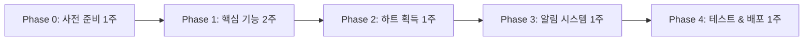

# 💎 하트/다이아 포인트 시스템 구현 가이드

**최종 업데이트**: 2026년 2월 1일
**버전**: v1.0.0 (Heart/Diamond Point System)
**상태**: 📋 **구현 준비**

> ⚠️ **마스터 문서 참조**: 포인트 정의, 가격표, 시각 디자인은 [MODEL_B_CHIP_SYSTEM_FINAL.md](./MODEL_B_CHIP_SYSTEM_FINAL.md)를 참조하세요.
> 이 문서는 **구현 단계 및 기술 가이드**에 집중합니다.

---

## 📋 목차

1. [구현 우선순위 로드맵](#-구현-우선순위-로드맵)
2. [Phase 0: 사전 준비](#-phase-0-사전-준비-1주)
3. [Phase 1: 핵심 기능](#-phase-1-핵심-기능-2주)
4. [Phase 2: 하트 획득 시스템](#-phase-2-하트-획득-시스템-1주)
5. [Phase 3: 알림 시스템](#-phase-3-알림-시스템-1주)
6. [최종 체크리스트](#-최종-우선순위-체크리스트)

---

## 📊 시스템 요약

### 포인트 타입

| 포인트 | 아이콘 | 획득 방법 | 만료 | 가치 |
|--------|--------|----------|------|------|
| 💖 하트 (Heart) | ❤️ | 무료 활동 보상 | 90일 후 만료 | ₩300/개 |
| 💎 다이아 (Diamond) | 💎 | 유료 충전 | 만료 없음 (영구) | ₩300/개 |

### 사용 우선순위

```
1. 💖 하트 (만료 임박 순서로 먼저 차감)
2. 💎 다이아 (하트 부족 시 차감)
```

### 공고 비용

| 공고 타입 | 비용 | 설명 |
|-----------|------|------|
| 일반 공고 | 1💎 | 기본 노출 |
| 긴급 공고 | 10💎 | 상단 고정 + 뱃지 |
| 상시 공고 | 5💎 | 30일 노출 |

---

## 🎯 구현 우선순위 로드맵



**총 구현 기간**: 6주
**핵심 개발자**: Frontend 1명 + Backend 1명

---

## ✅ Phase 0: 사전 준비 (1주)

### 1. 결제 시스템 선택 및 설정

**긴급도**: ⭐⭐⭐⭐⭐ (최우선)

#### RevenueCat 설정

```yaml
RevenueCat (추천):
  장점:
    - iOS/Android 앱스토어 통합
    - Apple/Google 결제 규정 준수
    - 간편한 구독/단건 결제 연동
    - 상세한 분석 대시보드
    - React Native SDK 제공

  설정 절차:
    1. RevenueCat 계정 생성
    2. App Store Connect/Google Play Console 연동
    3. Product 생성 (다이아 패키지 4개)
    4. Entitlements 설정
    5. API 키 발급
```

#### 필요 정보

```yaml
iOS (App Store Connect):
  - App Store Connect API Key
  - Shared Secret
  - In-App Purchase 상품 등록

Android (Google Play Console):
  - Service Account JSON
  - In-App Product 등록
  - 앱 서명 설정

RevenueCat:
  - Public API Key (클라이언트용)
  - Secret API Key (서버용)
  - Webhook URL 설정
```

#### 참고 링크
- RevenueCat: https://www.revenuecat.com/docs
- React Native SDK: https://docs.revenuecat.com/docs/reactnative

---

### 2. 법률 검토

**긴급도**: ⭐⭐⭐⭐⭐ (최우선)

#### 해야 할 일

```yaml
법률 자문 항목:
  1. 전자상거래법 검토
     - 포인트(이용권)의 법적 성격
     - 서비스 제공의 전자적 수단 정의

  2. 약관 작성
     - 서비스 이용약관
     - 포인트 정책 (하트/다이아)
     - 개인정보 처리방침

  3. 환불 정책
     - 앱스토어 환불 정책 준수
     - 미사용 다이아 환불 조건
     - 환불 제한 조건

  4. 미성년자 보호
     - 앱스토어 연령 제한 설정
     - 결제 한도 안내
```

#### 주요 약관 내용

**제1조: 포인트의 정의**
```
하트(💖)와 다이아(💎)는 UNIQN 플랫폼 내 서비스 제공의 전자적 수단으로,
「전자상거래법」상 서비스 이용권에 해당합니다.
현금, 재화, 경제적 가치로 환전 불가하며,
오직 UNIQN 서비스 이용 목적으로만 사용됩니다.
```

**제2조: 포인트 만료 정책**
```
- 하트(💖): 획득일로부터 90일 후 자동 소멸
- 다이아(💎): 만료 없음 (영구 보유)
- 소멸 예정 포인트는 앱 내 알림으로 안내됩니다
```

---

### 3. Firestore 데이터 스키마 설계

**긴급도**: ⭐⭐⭐⭐⭐ (최우선)

#### 컬렉션 구조

```typescript
// users/{userId}
{
  // 기존 필드들...

  // 포인트 잔액 (신규)
  points: {
    diamonds: number;        // 💎 다이아 총 잔액
    lastUpdated: Timestamp;  // 마지막 업데이트 시간
  },
}

// users/{userId}/heartBatches/{batchId}
// 💖 하트는 배치별로 만료 관리
{
  amount: number;            // 해당 배치의 하트 개수
  source: HeartSource;       // 획득 경로
  acquiredAt: Timestamp;     // 획득일
  expiresAt: Timestamp;      // 만료일 (획득일 + 90일)
  remainingAmount: number;   // 남은 하트 개수
}

// HeartSource 타입
type HeartSource =
  | 'signup'           // 첫 가입 보상 (+10)
  | 'daily_attendance' // 일일 출석 (+1)
  | 'weekly_bonus'     // 7일 연속 보너스 (+3)
  | 'review_complete'  // 리뷰 작성 (+1)
  | 'referral'         // 친구 초대 (+5)
  | 'admin_grant';     // 관리자 지급

// users/{userId}/pointTransactions/{txId}
{
  type: 'earn' | 'spend' | 'purchase' | 'expire' | 'refund';
  pointType: 'heart' | 'diamond';
  amount: number;            // 변동 포인트 개수 (양수: 획득, 음수: 사용)
  balanceAfter: number;      // 거래 후 해당 포인트 잔액
  reason: string;            // 사유 (예: "공고 등록", "일일 출석")
  relatedId?: string;        // 관련 문서 ID (예: 공고 ID)
  metadata?: {
    batchId?: string;        // 하트 배치 ID (하트 관련 시)
    packageId?: string;      // 구매 패키지 ID
  };
  createdAt: Timestamp;
}

// purchases/{purchaseId}
{
  userId: string;
  packageId: 'starter' | 'basic' | 'popular' | 'premium';
  diamonds: number;          // 구매한 다이아 개수
  bonusDiamonds: number;     // 보너스 다이아
  totalDiamonds: number;     // 총 다이아 (구매 + 보너스)
  price: number;             // 결제 금액 (원)
  currency: 'KRW';
  status: 'pending' | 'completed' | 'refunded';

  // RevenueCat 정보
  revenueCatTransactionId: string;
  store: 'app_store' | 'play_store';
  productId: string;         // 앱스토어 상품 ID

  refundedAt?: Timestamp;
  refundAmount?: number;
  createdAt: Timestamp;
}
```

#### Security Rules

```javascript
// firestore.rules
rules_version = '2';
service cloud.firestore {
  match /databases/{database}/documents {

    // 사용자 문서
    match /users/{userId} {
      // 본인만 읽기/쓰기 가능
      allow read, write: if request.auth.uid == userId;

      // 포인트 직접 수정 금지 (Functions만 가능)
      allow update: if request.auth.uid == userId
        && !request.resource.data.diff(resource.data).affectedKeys().hasAny(['points']);
    }

    // 하트 배치 (본인만 읽기, Functions만 쓰기)
    match /users/{userId}/heartBatches/{batchId} {
      allow read: if request.auth.uid == userId;
      allow write: if false; // Functions only
    }

    // 포인트 거래 내역 (본인만 읽기, Functions만 쓰기)
    match /users/{userId}/pointTransactions/{txId} {
      allow read: if request.auth.uid == userId;
      allow write: if false; // Functions only
    }

    // 구매 정보 (본인 또는 관리자만)
    match /purchases/{purchaseId} {
      allow read: if request.auth.uid == resource.data.userId
        || get(/databases/$(database)/documents/users/$(request.auth.uid)).data.role == 'admin';
      allow write: if false; // Functions only
    }
  }
}
```

---

## 🚀 Phase 1: 핵심 기능 (2주)

### Week 1: 포인트 기본 시스템

#### Day 1-2: 포인트 데이터 모델

**파일**: `uniqn-mobile/src/types/point.types.ts`

```typescript
/**
 * 포인트 타입
 */
export type PointType = 'heart' | 'diamond';

/**
 * 하트 획득 경로
 */
export type HeartSource =
  | 'signup'           // 첫 가입 보상 (+10)
  | 'daily_attendance' // 일일 출석 (+1)
  | 'weekly_bonus'     // 7일 연속 보너스 (+3)
  | 'review_complete'  // 리뷰 작성 (+1)
  | 'referral'         // 친구 초대 (+5)
  | 'admin_grant';     // 관리자 지급

/**
 * 하트 배치 (만료 관리용)
 */
export interface HeartBatch {
  id: string;
  amount: number;            // 원래 하트 개수
  remainingAmount: number;   // 남은 하트 개수
  source: HeartSource;       // 획득 경로
  acquiredAt: Date;          // 획득일
  expiresAt: Date;           // 만료일 (획득일 + 90일)
}

/**
 * 포인트 잔액
 */
export interface PointBalance {
  hearts: number;            // 💖 하트 총 잔액
  diamonds: number;          // 💎 다이아 총 잔액
  heartBatches: HeartBatch[]; // 하트 배치 목록 (만료 임박 순)
  expiringHearts: {          // 곧 만료될 하트 정보
    count: number;
    expiresIn: number;       // 일수
  } | null;
}

/**
 * 포인트 거래 타입
 */
export type PointTransactionType = 'earn' | 'spend' | 'purchase' | 'expire' | 'refund';

/**
 * 포인트 거래 내역
 */
export interface PointTransaction {
  id: string;
  type: PointTransactionType;
  pointType: PointType;
  amount: number;            // 변동 포인트 (양수: 획득, 음수: 사용)
  balanceAfter: number;      // 거래 후 잔액
  reason: string;            // 사유
  relatedId?: string;        // 관련 ID (공고 ID 등)
  metadata?: {
    batchId?: string;
    packageId?: string;
  };
  createdAt: Date;
}

/**
 * 다이아 패키지 정의
 */
export interface DiamondPackage {
  id: 'starter' | 'basic' | 'popular' | 'premium';
  name: string;
  diamonds: number;          // 기본 다이아
  bonusDiamonds: number;     // 보너스 다이아
  totalDiamonds: number;     // 총 다이아
  price: number;             // 가격 (원)
  pricePerDiamond: number;   // 다이아당 가격
  bonusPercent: number;      // 보너스 %
  badge?: string;            // 배지
  description: string;       // 설명
  productId: string;         // 앱스토어 상품 ID
}

/**
 * 다이아 패키지 목록
 */
export const DIAMOND_PACKAGES: DiamondPackage[] = [
  {
    id: 'starter',
    name: '스타터',
    diamonds: 3,
    bonusDiamonds: 0,
    totalDiamonds: 3,
    price: 1000,
    pricePerDiamond: 333,
    bonusPercent: 0,
    badge: '💡',
    description: '첫 체험용',
    productId: 'com.uniqn.diamond.starter',
  },
  {
    id: 'basic',
    name: '기본',
    diamonds: 11,
    bonusDiamonds: 0,
    totalDiamonds: 11,
    price: 3300,
    pricePerDiamond: 300,
    bonusPercent: 0,
    badge: '⭐',
    description: '소규모 채용',
    productId: 'com.uniqn.diamond.basic',
  },
  {
    id: 'popular',
    name: '인기',
    diamonds: 35,
    bonusDiamonds: 5,
    totalDiamonds: 40,
    price: 10000,
    pricePerDiamond: 250,
    bonusPercent: 14,
    badge: '🔥',
    description: '+5💎 보너스',
    productId: 'com.uniqn.diamond.popular',
  },
  {
    id: 'premium',
    name: '프리미엄',
    diamonds: 333,
    bonusDiamonds: 67,
    totalDiamonds: 400,
    price: 100000,
    pricePerDiamond: 250,
    bonusPercent: 20,
    badge: '👑',
    description: '+20% 보너스',
    productId: 'com.uniqn.diamond.premium',
  },
];

/**
 * 공고 비용 정의
 */
export const JOB_POSTING_COSTS = {
  regular: 1,   // 일반 공고
  urgent: 10,   // 긴급 공고
  fixed: 5,     // 상시 공고
} as const;

export type JobPostingType = keyof typeof JOB_POSTING_COSTS;
```

---

#### Day 3-4: Zustand Store 생성

**파일**: `uniqn-mobile/src/stores/pointStore.ts`

```typescript
import { create } from 'zustand';
import {
  doc,
  onSnapshot,
  collection,
  query,
  orderBy,
  limit,
  where,
} from 'firebase/firestore';
import { db } from '@/lib/firebase';
import {
  PointBalance,
  PointTransaction,
  HeartBatch,
} from '@/types/point.types';
import { logger } from '@/utils/logger';
import { differenceInDays } from 'date-fns';

interface PointStore {
  // State
  balance: PointBalance | null;
  transactions: PointTransaction[];
  loading: boolean;
  error: string | null;

  // Actions
  fetchBalance: (userId: string) => void;
  fetchTransactions: (userId: string) => void;
  getTotalPoints: () => number;
  getExpiringHearts: () => { count: number; daysLeft: number } | null;
  canAfford: (cost: number) => boolean;
  cleanup: () => void;
}

// 구독 해제 함수 저장
let balanceUnsubscribe: (() => void) | null = null;
let heartBatchesUnsubscribe: (() => void) | null = null;
let transactionsUnsubscribe: (() => void) | null = null;

export const usePointStore = create<PointStore>((set, get) => ({
  balance: null,
  transactions: [],
  loading: false,
  error: null,

  /**
   * 포인트 잔액 실시간 구독
   */
  fetchBalance: (userId: string) => {
    if (!userId) {
      logger.warn('fetchBalance: userId is required');
      return;
    }

    set({ loading: true, error: null });

    try {
      // 기존 구독 해제
      if (balanceUnsubscribe) balanceUnsubscribe();
      if (heartBatchesUnsubscribe) heartBatchesUnsubscribe();

      // 1. 다이아 잔액 실시간 구독
      balanceUnsubscribe = onSnapshot(
        doc(db, `users/${userId}`),
        (snapshot) => {
          if (snapshot.exists()) {
            const data = snapshot.data();
            const diamonds = data.points?.diamonds || 0;

            set((state) => ({
              balance: state.balance
                ? { ...state.balance, diamonds }
                : {
                    hearts: 0,
                    diamonds,
                    heartBatches: [],
                    expiringHearts: null,
                  },
              loading: false,
            }));

            logger.info('다이아 잔액 업데이트', { diamonds });
          }
        },
        (error) => {
          logger.error('다이아 잔액 조회 실패', error);
          set({ error: error.message, loading: false });
        }
      );

      // 2. 하트 배치 실시간 구독 (만료되지 않은 것만, 만료일 순)
      const now = new Date();
      const heartBatchesQuery = query(
        collection(db, `users/${userId}/heartBatches`),
        where('expiresAt', '>', now),
        where('remainingAmount', '>', 0),
        orderBy('expiresAt', 'asc')
      );

      heartBatchesUnsubscribe = onSnapshot(
        heartBatchesQuery,
        (snapshot) => {
          const heartBatches: HeartBatch[] = snapshot.docs.map((doc) => {
            const data = doc.data();
            return {
              id: doc.id,
              amount: data.amount,
              remainingAmount: data.remainingAmount,
              source: data.source,
              acquiredAt: data.acquiredAt?.toDate() || new Date(),
              expiresAt: data.expiresAt?.toDate() || new Date(),
            };
          });

          const totalHearts = heartBatches.reduce(
            (sum, batch) => sum + batch.remainingAmount,
            0
          );

          // 가장 빨리 만료되는 하트 정보
          let expiringHearts = null;
          if (heartBatches.length > 0) {
            const firstBatch = heartBatches[0];
            const daysLeft = differenceInDays(firstBatch.expiresAt, new Date());
            if (daysLeft <= 7) {
              expiringHearts = {
                count: firstBatch.remainingAmount,
                expiresIn: daysLeft,
              };
            }
          }

          set((state) => ({
            balance: state.balance
              ? { ...state.balance, hearts: totalHearts, heartBatches, expiringHearts }
              : {
                  hearts: totalHearts,
                  diamonds: 0,
                  heartBatches,
                  expiringHearts,
                },
          }));

          logger.info('하트 잔액 업데이트', {
            totalHearts,
            batchCount: heartBatches.length,
          });
        },
        (error) => {
          logger.error('하트 배치 조회 실패', error);
          set({ error: error.message });
        }
      );
    } catch (error) {
      logger.error('fetchBalance error', error);
      set({ error: (error as Error).message, loading: false });
    }
  },

  /**
   * 포인트 거래 내역 조회
   */
  fetchTransactions: (userId: string) => {
    if (!userId) {
      logger.warn('fetchTransactions: userId is required');
      return;
    }

    try {
      if (transactionsUnsubscribe) {
        transactionsUnsubscribe();
      }

      const q = query(
        collection(db, `users/${userId}/pointTransactions`),
        orderBy('createdAt', 'desc'),
        limit(50)
      );

      transactionsUnsubscribe = onSnapshot(
        q,
        (snapshot) => {
          const transactions: PointTransaction[] = snapshot.docs.map((doc) => {
            const data = doc.data();
            return {
              id: doc.id,
              type: data.type,
              pointType: data.pointType,
              amount: data.amount,
              balanceAfter: data.balanceAfter,
              reason: data.reason,
              relatedId: data.relatedId,
              metadata: data.metadata,
              createdAt: data.createdAt?.toDate() || new Date(),
            };
          });

          set({ transactions });
          logger.info('포인트 거래 내역 업데이트', { count: transactions.length });
        },
        (error) => {
          logger.error('포인트 거래 내역 조회 실패', error);
          set({ error: error.message });
        }
      );
    } catch (error) {
      logger.error('fetchTransactions error', error);
      set({ error: (error as Error).message });
    }
  },

  /**
   * 총 포인트 (하트 + 다이아)
   */
  getTotalPoints: () => {
    const { balance } = get();
    if (!balance) return 0;
    return balance.hearts + balance.diamonds;
  },

  /**
   * 만료 임박 하트 정보
   */
  getExpiringHearts: () => {
    const { balance } = get();
    if (!balance?.expiringHearts) return null;
    return {
      count: balance.expiringHearts.count,
      daysLeft: balance.expiringHearts.expiresIn,
    };
  },

  /**
   * 구매 가능 여부 확인
   */
  canAfford: (cost: number) => {
    const { balance } = get();
    if (!balance) return false;
    return (balance.hearts + balance.diamonds) >= cost;
  },

  /**
   * 구독 정리
   */
  cleanup: () => {
    if (balanceUnsubscribe) {
      balanceUnsubscribe();
      balanceUnsubscribe = null;
    }
    if (heartBatchesUnsubscribe) {
      heartBatchesUnsubscribe();
      heartBatchesUnsubscribe = null;
    }
    if (transactionsUnsubscribe) {
      transactionsUnsubscribe();
      transactionsUnsubscribe = null;
    }
    set({ balance: null, transactions: [], loading: false, error: null });
  },
}));
```

---

#### Day 5: 포인트 UI 컴포넌트

**파일**: `uniqn-mobile/src/components/points/PointBalance.tsx`

```typescript
import React from 'react';
import { View, Text, Pressable } from 'react-native';
import { usePointStore } from '@/stores/pointStore';
import { useRouter } from 'expo-router';
import { differenceInDays } from 'date-fns';

interface PointBalanceProps {
  compact?: boolean;
  showChargeButton?: boolean;
}

export const PointBalance: React.FC<PointBalanceProps> = ({
  compact = false,
  showChargeButton = true,
}) => {
  const router = useRouter();
  const { balance, loading } = usePointStore();

  if (loading) {
    return (
      <View className="bg-white dark:bg-gray-800 rounded-lg p-4 animate-pulse">
        <View className="h-6 bg-gray-200 dark:bg-gray-700 rounded w-1/3 mb-2" />
        <View className="h-8 bg-gray-200 dark:bg-gray-700 rounded w-1/2" />
      </View>
    );
  }

  if (!balance) {
    return (
      <View className="bg-white dark:bg-gray-800 rounded-lg p-4">
        <Text className="text-gray-500 dark:text-gray-400">
          포인트 정보를 불러올 수 없습니다.
        </Text>
      </View>
    );
  }

  const totalPoints = balance.hearts + balance.diamonds;

  if (compact) {
    return (
      <Pressable
        onPress={() => router.push('/points')}
        className="flex-row items-center gap-2 bg-gray-100 dark:bg-gray-800 rounded-full px-3 py-1.5"
      >
        <Text className="text-pink-500">💖</Text>
        <Text className="font-semibold text-gray-900 dark:text-white">
          {balance.hearts}
        </Text>
        <View className="w-px h-4 bg-gray-300 dark:bg-gray-600" />
        <Text className="text-cyan-500">💎</Text>
        <Text className="font-semibold text-gray-900 dark:text-white">
          {balance.diamonds}
        </Text>
      </Pressable>
    );
  }

  return (
    <View className="bg-white dark:bg-gray-800 rounded-2xl p-6 shadow-sm">
      {/* 헤더 */}
      <View className="flex-row items-center justify-between mb-4">
        <Text className="text-lg font-bold text-gray-900 dark:text-white">
          💰 내 포인트
        </Text>
        {showChargeButton && (
          <Pressable
            onPress={() => router.push('/points/purchase')}
            className="bg-purple-600 rounded-full px-4 py-2"
          >
            <Text className="text-white font-semibold text-sm">충전하기</Text>
          </Pressable>
        )}
      </View>

      {/* 총 포인트 */}
      <View className="mb-6">
        <Text className="text-4xl font-bold text-gray-900 dark:text-white">
          {totalPoints.toLocaleString()}
          <Text className="text-lg text-gray-500"> 포인트</Text>
        </Text>
      </View>

      {/* 포인트 상세 */}
      <View className="space-y-3">
        {/* 💖 하트 */}
        <View className="bg-pink-50 dark:bg-pink-900/20 rounded-xl p-4">
          <View className="flex-row items-center justify-between">
            <View className="flex-row items-center gap-3">
              <Text className="text-2xl">💖</Text>
              <View>
                <Text className="font-semibold text-gray-900 dark:text-white">
                  하트 {balance.hearts}개
                </Text>
                <Text className="text-sm text-gray-600 dark:text-gray-400">
                  무료 획득 포인트
                </Text>
              </View>
            </View>
            {balance.expiringHearts && (
              <View className="bg-red-100 dark:bg-red-900/30 rounded-lg px-2 py-1">
                <Text className="text-xs text-red-600 dark:text-red-400 font-medium">
                  ⏰ {balance.expiringHearts.count}개
                  {balance.expiringHearts.expiresIn}일 후 만료
                </Text>
              </View>
            )}
          </View>
        </View>

        {/* 💎 다이아 */}
        <View className="bg-cyan-50 dark:bg-cyan-900/20 rounded-xl p-4">
          <View className="flex-row items-center gap-3">
            <Text className="text-2xl">💎</Text>
            <View>
              <Text className="font-semibold text-gray-900 dark:text-white">
                다이아 {balance.diamonds}개
              </Text>
              <Text className="text-sm text-gray-600 dark:text-gray-400">
                유료 충전 포인트 • 만료 없음
              </Text>
            </View>
          </View>
        </View>
      </View>

      {/* 사용 순서 안내 */}
      <View className="mt-4 p-3 bg-blue-50 dark:bg-blue-900/20 rounded-lg">
        <View className="flex-row items-start gap-2">
          <Text className="text-lg">💡</Text>
          <View className="flex-1">
            <Text className="text-sm font-medium text-gray-900 dark:text-white mb-1">
              사용 순서
            </Text>
            <Text className="text-sm text-gray-600 dark:text-gray-400">
              💖 하트 먼저 (만료 임박 순) → 💎 다이아
            </Text>
          </View>
        </View>
      </View>
    </View>
  );
};
```

**파일**: `uniqn-mobile/src/components/points/PointTransactionHistory.tsx`

```typescript
import React from 'react';
import { View, Text, FlatList } from 'react-native';
import { usePointStore } from '@/stores/pointStore';
import { format } from 'date-fns';
import { ko } from 'date-fns/locale';
import { PointTransaction } from '@/types/point.types';

export const PointTransactionHistory: React.FC = () => {
  const { transactions, loading } = usePointStore();

  if (loading) {
    return (
      <View className="p-4">
        <Text className="text-gray-500">로딩 중...</Text>
      </View>
    );
  }

  if (transactions.length === 0) {
    return (
      <View className="p-8 items-center">
        <Text className="text-6xl mb-4">📭</Text>
        <Text className="text-gray-500 dark:text-gray-400 text-center">
          포인트 내역이 없습니다
        </Text>
      </View>
    );
  }

  const renderTransaction = ({ item: tx }: { item: PointTransaction }) => {
    const isPositive = tx.amount > 0;
    const icon = tx.pointType === 'heart' ? '💖' : '💎';

    const typeLabel = {
      earn: '획득',
      spend: '사용',
      purchase: '충전',
      expire: '만료',
      refund: '환불',
    }[tx.type];

    return (
      <View className="p-4 border-b border-gray-200 dark:border-gray-700">
        <View className="flex-row items-center justify-between">
          <View className="flex-row items-center gap-3 flex-1">
            <Text className="text-2xl">{icon}</Text>
            <View className="flex-1">
              <Text className="font-medium text-gray-900 dark:text-white">
                {tx.reason}
              </Text>
              <Text className="text-sm text-gray-500 dark:text-gray-400">
                {format(tx.createdAt, 'yyyy년 MM월 dd일 HH:mm', { locale: ko })}
              </Text>
            </View>
          </View>
          <View className="items-end">
            <Text
              className={`font-semibold ${
                isPositive
                  ? 'text-green-600 dark:text-green-400'
                  : 'text-red-600 dark:text-red-400'
              }`}
            >
              {isPositive ? '+' : ''}{tx.amount}
            </Text>
            <Text className="text-xs text-gray-500 dark:text-gray-400">
              {typeLabel} • 잔액 {tx.balanceAfter}
            </Text>
          </View>
        </View>
      </View>
    );
  };

  return (
    <View className="bg-white dark:bg-gray-800 rounded-2xl overflow-hidden">
      <View className="p-4 border-b border-gray-200 dark:border-gray-700">
        <Text className="text-lg font-bold text-gray-900 dark:text-white">
          포인트 내역
        </Text>
      </View>
      <FlatList
        data={transactions}
        keyExtractor={(item) => item.id}
        renderItem={renderTransaction}
        scrollEnabled={false}
      />
    </View>
  );
};
```

---

### Week 2: 결제 연동

#### Day 1-2: RevenueCat 연동

**1. 패키지 설치**
```bash
cd uniqn-mobile
npx expo install react-native-purchases
```

**2. 환경 변수 설정**

**파일**: `uniqn-mobile/.env`
```bash
# RevenueCat
EXPO_PUBLIC_REVENUECAT_API_KEY_IOS=appl_xxxxx
EXPO_PUBLIC_REVENUECAT_API_KEY_ANDROID=goog_xxxxx
```

**3. RevenueCat 초기화**

**파일**: `uniqn-mobile/src/lib/purchases.ts`

```typescript
import Purchases, {
  PurchasesPackage,
  CustomerInfo,
  LOG_LEVEL,
} from 'react-native-purchases';
import { Platform } from 'react-native';
import { logger } from '@/utils/logger';

const API_KEY = Platform.select({
  ios: process.env.EXPO_PUBLIC_REVENUECAT_API_KEY_IOS,
  android: process.env.EXPO_PUBLIC_REVENUECAT_API_KEY_ANDROID,
}) || '';

/**
 * RevenueCat 초기화
 */
export const initializePurchases = async (userId?: string) => {
  try {
    if (__DEV__) {
      Purchases.setLogLevel(LOG_LEVEL.DEBUG);
    }

    await Purchases.configure({
      apiKey: API_KEY,
      appUserID: userId,
    });

    logger.info('RevenueCat 초기화 완료', { userId });
  } catch (error) {
    logger.error('RevenueCat 초기화 실패', error);
    throw error;
  }
};

/**
 * 사용자 ID 설정 (로그인 시)
 */
export const identifyUser = async (userId: string) => {
  try {
    const { customerInfo } = await Purchases.logIn(userId);
    logger.info('RevenueCat 사용자 식별', { userId });
    return customerInfo;
  } catch (error) {
    logger.error('RevenueCat 사용자 식별 실패', error);
    throw error;
  }
};

/**
 * 사용자 로그아웃
 */
export const logoutUser = async () => {
  try {
    await Purchases.logOut();
    logger.info('RevenueCat 로그아웃');
  } catch (error) {
    logger.error('RevenueCat 로그아웃 실패', error);
    throw error;
  }
};

/**
 * 다이아 패키지 목록 조회
 */
export const getDiamondPackages = async (): Promise<PurchasesPackage[]> => {
  try {
    const offerings = await Purchases.getOfferings();

    if (offerings.current?.availablePackages) {
      return offerings.current.availablePackages;
    }

    return [];
  } catch (error) {
    logger.error('패키지 조회 실패', error);
    throw error;
  }
};

/**
 * 다이아 구매
 */
export const purchaseDiamonds = async (
  pkg: PurchasesPackage
): Promise<CustomerInfo> => {
  try {
    const { customerInfo } = await Purchases.purchasePackage(pkg);
    logger.info('다이아 구매 완료', {
      packageId: pkg.identifier,
      productId: pkg.product.identifier,
    });
    return customerInfo;
  } catch (error) {
    logger.error('다이아 구매 실패', error);
    throw error;
  }
};

/**
 * 구매 복원
 */
export const restorePurchases = async (): Promise<CustomerInfo> => {
  try {
    const customerInfo = await Purchases.restorePurchases();
    logger.info('구매 복원 완료');
    return customerInfo;
  } catch (error) {
    logger.error('구매 복원 실패', error);
    throw error;
  }
};
```

---

#### Day 3-4: Firebase Functions (포인트 차감)

**파일**: `functions/src/points/deductPoints.ts`

```typescript
import * as functions from 'firebase-functions';
import * as admin from 'firebase-admin';
import { logger } from 'firebase-functions';

const db = admin.firestore();
const FieldValue = admin.firestore.FieldValue;

interface DeductPointsData {
  amount: number;
  reason: string;
  relatedId?: string;
}

/**
 * 포인트 차감 (공고 등록 등)
 * 하트 먼저 (만료 임박 순) → 다이아 순서로 차감
 */
export const deductPoints = functions
  .region('asia-northeast3')
  .https.onCall(async (data: DeductPointsData, context) => {
    const userId = context.auth?.uid;

    if (!userId) {
      throw new functions.https.HttpsError('unauthenticated', '인증이 필요합니다.');
    }

    const { amount, reason, relatedId } = data;

    if (amount <= 0) {
      throw new functions.https.HttpsError('invalid-argument', '유효하지 않은 금액입니다.');
    }

    try {
      logger.info('포인트 차감 시작', { userId, amount, reason });

      await db.runTransaction(async (transaction) => {
        const userRef = db.doc(`users/${userId}`);
        const userDoc = await transaction.get(userRef);

        if (!userDoc.exists) {
          throw new Error('사용자를 찾을 수 없습니다.');
        }

        // 1. 하트 배치 조회 (만료 임박 순)
        const now = new Date();
        const heartBatchesSnapshot = await transaction.get(
          db.collection(`users/${userId}/heartBatches`)
            .where('expiresAt', '>', now)
            .where('remainingAmount', '>', 0)
            .orderBy('expiresAt', 'asc')
        );

        // 2. 총 하트 계산
        let totalHearts = 0;
        const heartBatches: { ref: FirebaseFirestore.DocumentReference; remaining: number }[] = [];

        heartBatchesSnapshot.forEach((doc) => {
          const data = doc.data();
          totalHearts += data.remainingAmount;
          heartBatches.push({
            ref: doc.ref,
            remaining: data.remainingAmount,
          });
        });

        // 3. 다이아 잔액
        const diamonds = userDoc.data()?.points?.diamonds || 0;
        const totalPoints = totalHearts + diamonds;

        // 4. 잔액 확인
        if (totalPoints < amount) {
          throw new Error(`포인트가 부족합니다. (필요: ${amount}, 보유: ${totalPoints})`);
        }

        // 5. 차감 로직 (하트 먼저, 만료 임박 순)
        let remainingAmount = amount;
        let heartsUsed = 0;
        let diamondsUsed = 0;
        const usedBatches: string[] = [];

        // 5-1. 하트 차감
        for (const batch of heartBatches) {
          if (remainingAmount <= 0) break;

          const deduct = Math.min(batch.remaining, remainingAmount);
          transaction.update(batch.ref, {
            remainingAmount: FieldValue.increment(-deduct),
          });

          heartsUsed += deduct;
          remainingAmount -= deduct;
          usedBatches.push(batch.ref.id);
        }

        // 5-2. 다이아 차감 (하트로 부족한 경우)
        if (remainingAmount > 0) {
          diamondsUsed = remainingAmount;
          transaction.update(userRef, {
            'points.diamonds': FieldValue.increment(-diamondsUsed),
            'points.lastUpdated': FieldValue.serverTimestamp(),
          });
          remainingAmount = 0;
        }

        // 6. 거래 내역 기록
        const newTotalHearts = totalHearts - heartsUsed;
        const newDiamonds = diamonds - diamondsUsed;

        // 하트 사용 내역
        if (heartsUsed > 0) {
          const heartTxRef = db.collection(`users/${userId}/pointTransactions`).doc();
          transaction.set(heartTxRef, {
            type: 'spend',
            pointType: 'heart',
            amount: -heartsUsed,
            balanceAfter: newTotalHearts,
            reason,
            relatedId,
            metadata: { batchIds: usedBatches },
            createdAt: FieldValue.serverTimestamp(),
          });
        }

        // 다이아 사용 내역
        if (diamondsUsed > 0) {
          const diamondTxRef = db.collection(`users/${userId}/pointTransactions`).doc();
          transaction.set(diamondTxRef, {
            type: 'spend',
            pointType: 'diamond',
            amount: -diamondsUsed,
            balanceAfter: newDiamonds,
            reason,
            relatedId,
            createdAt: FieldValue.serverTimestamp(),
          });
        }

        logger.info('포인트 차감 완료', {
          userId,
          heartsUsed,
          diamondsUsed,
          newBalance: { hearts: newTotalHearts, diamonds: newDiamonds },
        });
      });

      return { success: true };
    } catch (error) {
      logger.error('포인트 차감 오류', error);
      throw new functions.https.HttpsError('internal', (error as Error).message);
    }
  });
```

**파일**: `functions/src/points/grantDiamonds.ts`

```typescript
import * as functions from 'firebase-functions';
import * as admin from 'firebase-admin';
import { logger } from 'firebase-functions';

const db = admin.firestore();
const FieldValue = admin.firestore.FieldValue;

interface GrantDiamondsData {
  userId: string;
  diamonds: number;
  bonusDiamonds: number;
  packageId: string;
  transactionId: string;
  store: 'app_store' | 'play_store';
  productId: string;
  price: number;
}

/**
 * 다이아 지급 (구매 완료 시 RevenueCat Webhook에서 호출)
 */
export const grantDiamonds = functions
  .region('asia-northeast3')
  .https.onCall(async (data: GrantDiamondsData, context) => {
    // Webhook 인증 확인 (실제 구현 시 RevenueCat Webhook 시크릿 검증)

    const {
      userId,
      diamonds,
      bonusDiamonds,
      packageId,
      transactionId,
      store,
      productId,
      price,
    } = data;

    const totalDiamonds = diamonds + bonusDiamonds;

    try {
      logger.info('다이아 지급 시작', { userId, totalDiamonds, packageId });

      const purchaseRef = db.collection('purchases').doc();

      await db.runTransaction(async (transaction) => {
        const userRef = db.doc(`users/${userId}`);
        const userDoc = await transaction.get(userRef);

        if (!userDoc.exists) {
          throw new Error('사용자를 찾을 수 없습니다.');
        }

        const currentDiamonds = userDoc.data()?.points?.diamonds || 0;
        const newDiamonds = currentDiamonds + totalDiamonds;

        // 1. 구매 기록 저장
        transaction.set(purchaseRef, {
          userId,
          packageId,
          diamonds,
          bonusDiamonds,
          totalDiamonds,
          price,
          currency: 'KRW',
          status: 'completed',
          revenueCatTransactionId: transactionId,
          store,
          productId,
          createdAt: FieldValue.serverTimestamp(),
        });

        // 2. 다이아 지급
        transaction.update(userRef, {
          'points.diamonds': FieldValue.increment(totalDiamonds),
          'points.lastUpdated': FieldValue.serverTimestamp(),
        });

        // 3. 거래 내역 기록
        const txRef = db.collection(`users/${userId}/pointTransactions`).doc();
        transaction.set(txRef, {
          type: 'purchase',
          pointType: 'diamond',
          amount: totalDiamonds,
          balanceAfter: newDiamonds,
          reason: `💎 다이아 ${totalDiamonds}개 충전`,
          relatedId: purchaseRef.id,
          metadata: { packageId },
          createdAt: FieldValue.serverTimestamp(),
        });
      });

      logger.info('다이아 지급 완료', {
        userId,
        purchaseId: purchaseRef.id,
        totalDiamonds,
      });

      return {
        success: true,
        purchaseId: purchaseRef.id,
        diamonds: totalDiamonds,
      };
    } catch (error) {
      logger.error('다이아 지급 오류', error);
      throw new functions.https.HttpsError('internal', (error as Error).message);
    }
  });
```

---

## 💖 Phase 2: 하트 획득 시스템 (1주)

### Day 1-2: 하트 획득 Functions

**파일**: `functions/src/points/grantHearts.ts`

```typescript
import * as functions from 'firebase-functions';
import * as admin from 'firebase-admin';
import { logger } from 'firebase-functions';
import { addDays } from 'date-fns';

const db = admin.firestore();
const FieldValue = admin.firestore.FieldValue;

type HeartSource =
  | 'signup'
  | 'daily_attendance'
  | 'weekly_bonus'
  | 'review_complete'
  | 'referral'
  | 'admin_grant';

const HEART_AMOUNTS: Record<HeartSource, number> = {
  signup: 10,
  daily_attendance: 1,
  weekly_bonus: 3,
  review_complete: 1,
  referral: 5,
  admin_grant: 0, // 가변
};

const HEART_EXPIRY_DAYS = 90;

interface GrantHeartsData {
  userId: string;
  source: HeartSource;
  amount?: number; // admin_grant용
}

/**
 * 하트 지급
 */
export const grantHearts = functions
  .region('asia-northeast3')
  .https.onCall(async (data: GrantHeartsData, context) => {
    const { userId, source, amount: customAmount } = data;

    // admin_grant는 관리자만 가능
    if (source === 'admin_grant') {
      const callerUid = context.auth?.uid;
      if (!callerUid) {
        throw new functions.https.HttpsError('unauthenticated', '인증이 필요합니다.');
      }

      const callerDoc = await db.doc(`users/${callerUid}`).get();
      if (callerDoc.data()?.role !== 'admin') {
        throw new functions.https.HttpsError('permission-denied', '관리자만 가능합니다.');
      }
    }

    const amount = source === 'admin_grant' ? (customAmount || 0) : HEART_AMOUNTS[source];

    if (amount <= 0) {
      throw new functions.https.HttpsError('invalid-argument', '유효하지 않은 하트 개수입니다.');
    }

    try {
      logger.info('하트 지급 시작', { userId, source, amount });

      const now = new Date();
      const expiresAt = addDays(now, HEART_EXPIRY_DAYS);

      await db.runTransaction(async (transaction) => {
        const userRef = db.doc(`users/${userId}`);
        const userDoc = await transaction.get(userRef);

        if (!userDoc.exists) {
          throw new Error('사용자를 찾을 수 없습니다.');
        }

        // 1. 하트 배치 생성
        const batchRef = db.collection(`users/${userId}/heartBatches`).doc();
        transaction.set(batchRef, {
          amount,
          remainingAmount: amount,
          source,
          acquiredAt: FieldValue.serverTimestamp(),
          expiresAt,
        });

        // 2. 거래 내역 기록
        // 현재 하트 총합 계산 (새 배치 포함 전)
        const heartBatchesSnapshot = await transaction.get(
          db.collection(`users/${userId}/heartBatches`)
            .where('expiresAt', '>', now)
            .where('remainingAmount', '>', 0)
        );

        let currentHearts = 0;
        heartBatchesSnapshot.forEach((doc) => {
          currentHearts += doc.data().remainingAmount;
        });

        const txRef = db.collection(`users/${userId}/pointTransactions`).doc();
        transaction.set(txRef, {
          type: 'earn',
          pointType: 'heart',
          amount,
          balanceAfter: currentHearts + amount,
          reason: getHeartReasonText(source, amount),
          metadata: { batchId: batchRef.id, source },
          createdAt: FieldValue.serverTimestamp(),
        });
      });

      logger.info('하트 지급 완료', { userId, source, amount });

      return { success: true, amount };
    } catch (error) {
      logger.error('하트 지급 오류', error);
      throw new functions.https.HttpsError('internal', (error as Error).message);
    }
  });

function getHeartReasonText(source: HeartSource, amount: number): string {
  const reasons: Record<HeartSource, string> = {
    signup: '🎉 회원가입 환영 보상',
    daily_attendance: '📅 일일 출석 체크',
    weekly_bonus: '🔥 7일 연속 출석 보너스',
    review_complete: '⭐ 리뷰 작성 보상',
    referral: '👥 친구 초대 보상',
    admin_grant: `🎁 관리자 지급 (+${amount})`,
  };
  return reasons[source];
}
```

---

### Day 3-4: 출석 체크 시스템

**파일**: `functions/src/points/dailyAttendance.ts`

```typescript
import * as functions from 'firebase-functions';
import * as admin from 'firebase-admin';
import { logger } from 'firebase-functions';
import { addDays, startOfDay, differenceInDays } from 'date-fns';

const db = admin.firestore();
const FieldValue = admin.firestore.FieldValue;

const HEART_EXPIRY_DAYS = 90;

/**
 * 일일 출석 체크
 */
export const checkDailyAttendance = functions
  .region('asia-northeast3')
  .https.onCall(async (data, context) => {
    const userId = context.auth?.uid;

    if (!userId) {
      throw new functions.https.HttpsError('unauthenticated', '인증이 필요합니다.');
    }

    try {
      const now = new Date();
      const today = startOfDay(now);

      return await db.runTransaction(async (transaction) => {
        const userRef = db.doc(`users/${userId}`);
        const userDoc = await transaction.get(userRef);

        if (!userDoc.exists) {
          throw new Error('사용자를 찾을 수 없습니다.');
        }

        const userData = userDoc.data()!;
        const attendance = userData.attendance || {};
        const lastAttendance = attendance.lastDate?.toDate();
        const streak = attendance.streak || 0;

        // 이미 오늘 출석했는지 확인
        if (lastAttendance && startOfDay(lastAttendance).getTime() === today.getTime()) {
          return {
            success: false,
            message: '이미 오늘 출석했습니다.',
            streak,
            heartsEarned: 0,
          };
        }

        // 연속 출석 계산
        let newStreak = 1;
        if (lastAttendance) {
          const daysDiff = differenceInDays(today, startOfDay(lastAttendance));
          if (daysDiff === 1) {
            // 연속 출석
            newStreak = streak + 1;
          }
          // daysDiff > 1이면 연속 끊김, newStreak = 1
        }

        // 하트 지급량 계산
        let heartsToGrant = 1; // 기본 1하트
        let isWeeklyBonus = false;

        if (newStreak % 7 === 0) {
          // 7일 연속 보너스
          heartsToGrant += 3;
          isWeeklyBonus = true;
        }

        // 출석 정보 업데이트
        transaction.update(userRef, {
          'attendance.lastDate': FieldValue.serverTimestamp(),
          'attendance.streak': newStreak,
          'attendance.totalDays': FieldValue.increment(1),
        });

        // 하트 배치 생성 (일일 출석)
        const expiresAt = addDays(now, HEART_EXPIRY_DAYS);
        const dailyBatchRef = db.collection(`users/${userId}/heartBatches`).doc();
        transaction.set(dailyBatchRef, {
          amount: 1,
          remainingAmount: 1,
          source: 'daily_attendance',
          acquiredAt: FieldValue.serverTimestamp(),
          expiresAt,
        });

        // 거래 내역 (일일)
        const dailyTxRef = db.collection(`users/${userId}/pointTransactions`).doc();
        transaction.set(dailyTxRef, {
          type: 'earn',
          pointType: 'heart',
          amount: 1,
          balanceAfter: 0, // 클라이언트에서 재계산
          reason: '📅 일일 출석 체크',
          metadata: { batchId: dailyBatchRef.id, source: 'daily_attendance' },
          createdAt: FieldValue.serverTimestamp(),
        });

        // 7일 연속 보너스 (해당 시)
        if (isWeeklyBonus) {
          const bonusBatchRef = db.collection(`users/${userId}/heartBatches`).doc();
          transaction.set(bonusBatchRef, {
            amount: 3,
            remainingAmount: 3,
            source: 'weekly_bonus',
            acquiredAt: FieldValue.serverTimestamp(),
            expiresAt,
          });

          const bonusTxRef = db.collection(`users/${userId}/pointTransactions`).doc();
          transaction.set(bonusTxRef, {
            type: 'earn',
            pointType: 'heart',
            amount: 3,
            balanceAfter: 0,
            reason: '🔥 7일 연속 출석 보너스!',
            metadata: { batchId: bonusBatchRef.id, source: 'weekly_bonus' },
            createdAt: FieldValue.serverTimestamp(),
          });
        }

        logger.info('출석 체크 완료', {
          userId,
          streak: newStreak,
          heartsEarned: heartsToGrant,
          isWeeklyBonus,
        });

        return {
          success: true,
          streak: newStreak,
          heartsEarned: heartsToGrant,
          isWeeklyBonus,
          message: isWeeklyBonus
            ? `🔥 ${newStreak}일 연속 출석! 보너스 +3💖`
            : `📅 출석 완료! ${newStreak}일째`,
        };
      });
    } catch (error) {
      logger.error('출석 체크 오류', error);
      throw new functions.https.HttpsError('internal', (error as Error).message);
    }
  });
```

---

## 🔔 Phase 3: 알림 시스템 (1주)

### Day 1-2: 하트 만료 알림 Cron

**파일**: `functions/src/notifications/heartExpiryNotifications.ts`

```typescript
import * as functions from 'firebase-functions';
import * as admin from 'firebase-admin';
import { logger } from 'firebase-functions';
import { addDays, startOfDay, endOfDay } from 'date-fns';

const db = admin.firestore();

/**
 * 하트 만료 7일 전 알림
 * 매일 오전 9시 실행
 */
export const heartExpiry7Days = functions
  .region('asia-northeast3')
  .pubsub.schedule('0 9 * * *')
  .timeZone('Asia/Seoul')
  .onRun(async () => {
    logger.info('하트 7일 전 만료 알림 시작');

    try {
      const targetDate = addDays(new Date(), 7);
      const startDate = startOfDay(targetDate);
      const endDate = endOfDay(targetDate);

      // 7일 후 만료되는 하트 배치가 있는 사용자 조회
      const usersSnapshot = await db.collectionGroup('heartBatches')
        .where('expiresAt', '>=', startDate)
        .where('expiresAt', '<=', endDate)
        .where('remainingAmount', '>', 0)
        .get();

      // 사용자별로 그룹화
      const userHearts = new Map<string, number>();

      usersSnapshot.forEach((doc) => {
        const pathParts = doc.ref.path.split('/');
        const userId = pathParts[1]; // users/{userId}/heartBatches/{batchId}
        const remaining = doc.data().remainingAmount;

        userHearts.set(
          userId,
          (userHearts.get(userId) || 0) + remaining
        );
      });

      logger.info(`7일 전 알림 대상: ${userHearts.size}명`);

      for (const [userId, heartCount] of userHearts) {
        const userDoc = await db.doc(`users/${userId}`).get();
        const fcmToken = userDoc.data()?.fcmToken;

        if (!fcmToken) continue;

        await admin.messaging().send({
          token: fcmToken,
          notification: {
            title: '⏰ 하트 만료 예정',
            body: `💖 하트 ${heartCount}개가 7일 후 만료됩니다. 지금 공고에 지원하세요!`,
          },
          data: {
            type: 'heart_expiry_7d',
            action: 'open_job_board',
            hearts: String(heartCount),
          },
          android: { priority: 'normal' },
          apns: { payload: { aps: { sound: 'default' } } },
        });

        logger.info('7일 전 알림 발송', { userId, heartCount });
      }

      return null;
    } catch (error) {
      logger.error('7일 전 알림 오류', error);
      throw error;
    }
  });

/**
 * 하트 만료 3일 전 알림
 */
export const heartExpiry3Days = functions
  .region('asia-northeast3')
  .pubsub.schedule('0 9 * * *')
  .timeZone('Asia/Seoul')
  .onRun(async () => {
    logger.info('하트 3일 전 만료 알림 시작');

    try {
      const targetDate = addDays(new Date(), 3);
      const startDate = startOfDay(targetDate);
      const endDate = endOfDay(targetDate);

      const usersSnapshot = await db.collectionGroup('heartBatches')
        .where('expiresAt', '>=', startDate)
        .where('expiresAt', '<=', endDate)
        .where('remainingAmount', '>', 0)
        .get();

      const userHearts = new Map<string, number>();

      usersSnapshot.forEach((doc) => {
        const pathParts = doc.ref.path.split('/');
        const userId = pathParts[1];
        const remaining = doc.data().remainingAmount;
        userHearts.set(userId, (userHearts.get(userId) || 0) + remaining);
      });

      logger.info(`3일 전 알림 대상: ${userHearts.size}명`);

      for (const [userId, heartCount] of userHearts) {
        const userDoc = await db.doc(`users/${userId}`).get();
        const fcmToken = userDoc.data()?.fcmToken;

        if (!fcmToken) continue;

        await admin.messaging().send({
          token: fcmToken,
          notification: {
            title: '🚨 하트 만료 임박!',
            body: `💖 하트 ${heartCount}개가 3일 후 만료됩니다! 서둘러 사용하세요!`,
          },
          data: {
            type: 'heart_expiry_3d',
            action: 'open_job_board',
            hearts: String(heartCount),
          },
          android: { priority: 'high' },
        });
      }

      return null;
    } catch (error) {
      logger.error('3일 전 알림 오류', error);
      throw error;
    }
  });

/**
 * 하트 만료 당일 알림 (오전 9시)
 */
export const heartExpiryToday = functions
  .region('asia-northeast3')
  .pubsub.schedule('0 9 * * *')
  .timeZone('Asia/Seoul')
  .onRun(async () => {
    logger.info('하트 당일 만료 알림 시작');

    try {
      const today = startOfDay(new Date());
      const endToday = endOfDay(new Date());

      const usersSnapshot = await db.collectionGroup('heartBatches')
        .where('expiresAt', '>=', today)
        .where('expiresAt', '<=', endToday)
        .where('remainingAmount', '>', 0)
        .get();

      const userHearts = new Map<string, number>();

      usersSnapshot.forEach((doc) => {
        const pathParts = doc.ref.path.split('/');
        const userId = pathParts[1];
        const remaining = doc.data().remainingAmount;
        userHearts.set(userId, (userHearts.get(userId) || 0) + remaining);
      });

      logger.info(`당일 알림 대상: ${userHearts.size}명`);

      for (const [userId, heartCount] of userHearts) {
        const userDoc = await db.doc(`users/${userId}`).get();
        const fcmToken = userDoc.data()?.fcmToken;

        if (!fcmToken) continue;

        await admin.messaging().send({
          token: fcmToken,
          notification: {
            title: '🔥 오늘 자정에 하트 만료!',
            body: `💖 하트 ${heartCount}개가 오늘 24시에 사라집니다! 마지막 기회!`,
          },
          data: {
            type: 'heart_expiry_today',
            action: 'open_job_board',
            hearts: String(heartCount),
          },
          android: {
            priority: 'high',
            notification: {
              sound: 'default',
              vibrationPattern: [0, 500, 500, 500],
            },
          },
        });
      }

      return null;
    } catch (error) {
      logger.error('당일 알림 오류', error);
      throw error;
    }
  });

/**
 * 만료된 하트 자동 정리 (매일 자정)
 */
export const cleanupExpiredHearts = functions
  .region('asia-northeast3')
  .pubsub.schedule('0 0 * * *')
  .timeZone('Asia/Seoul')
  .onRun(async () => {
    logger.info('만료 하트 정리 시작');

    try {
      const now = new Date();

      const expiredBatches = await db.collectionGroup('heartBatches')
        .where('expiresAt', '<=', now)
        .where('remainingAmount', '>', 0)
        .get();

      logger.info(`만료된 배치: ${expiredBatches.size}개`);

      const batch = db.batch();
      let count = 0;

      for (const doc of expiredBatches.docs) {
        const data = doc.data();
        const pathParts = doc.ref.path.split('/');
        const userId = pathParts[1];

        // 배치 잔액 0으로 설정
        batch.update(doc.ref, { remainingAmount: 0 });

        // 만료 거래 내역 기록
        const txRef = db.collection(`users/${userId}/pointTransactions`).doc();
        batch.set(txRef, {
          type: 'expire',
          pointType: 'heart',
          amount: -data.remainingAmount,
          balanceAfter: 0, // 클라이언트에서 재계산
          reason: `💔 하트 ${data.remainingAmount}개 만료`,
          metadata: { batchId: doc.id, source: data.source },
          createdAt: admin.firestore.FieldValue.serverTimestamp(),
        });

        count++;

        // Batch 500개 제한
        if (count % 500 === 0) {
          await batch.commit();
        }
      }

      if (count % 500 !== 0) {
        await batch.commit();
      }

      logger.info(`만료 하트 정리 완료: ${count}개 배치`);

      return null;
    } catch (error) {
      logger.error('만료 하트 정리 오류', error);
      throw error;
    }
  });
```

---

## 📋 최종 우선순위 체크리스트

### ✅ 즉시 시작 (1주 안에)

```yaml
Phase 0: 사전 준비
  [ ] 1. RevenueCat 계정 설정 ⭐⭐⭐⭐⭐
      - App Store Connect 연동
      - Google Play Console 연동
      - 상품 4개 등록 (다이아 패키지)
      - API 키 발급

  [ ] 2. 법률 자문 (약관/환불정책) ⭐⭐⭐⭐⭐
      - 전자상거래법 검토
      - 포인트 정책 약관 작성
      - 환불 정책 확정

  [ ] 3. Firestore 스키마 배포 ⭐⭐⭐⭐⭐
      - 컬렉션 구조 확정
      - Security Rules 작성 및 테스트
      - 인덱스 설정

  [ ] 4. 타입 정의 작성 ⭐⭐⭐⭐
      - point.types.ts 작성
      - 패키지, 배치, 거래 타입 정의
```

### 🚀 Week 2-3: 핵심 기능

```yaml
Phase 1: 포인트 시스템
  [ ] 5. Zustand 스토어 생성 ⭐⭐⭐⭐⭐
      - pointStore.ts
      - 실시간 구독 (다이아 + 하트 배치)

  [ ] 6. 포인트 UI 컴포넌트 ⭐⭐⭐⭐
      - PointBalance.tsx
      - PointTransactionHistory.tsx
      - DiamondPurchasePage.tsx

  [ ] 7. RevenueCat SDK 연동 ⭐⭐⭐⭐⭐
      - purchases.ts 작성
      - 구매 플로우 구현

  [ ] 8. Firebase Functions (포인트) ⭐⭐⭐⭐⭐
      - deductPoints.ts (차감)
      - grantDiamonds.ts (지급)
```

### 💖 Week 4: 하트 시스템

```yaml
Phase 2: 하트 획득
  [ ] 9. 하트 지급 Functions ⭐⭐⭐⭐
      - grantHearts.ts
      - 획득 경로별 로직

  [ ] 10. 출석 체크 시스템 ⭐⭐⭐⭐
      - dailyAttendance.ts
      - 7일 연속 보너스

  [ ] 11. 출석 체크 UI ⭐⭐⭐
      - AttendanceModal.tsx
      - 연속 출석 표시
```

### 🔔 Week 5: 알림 & 테스트

```yaml
Phase 3: 알림 시스템
  [ ] 12. 하트 만료 알림 Cron ⭐⭐⭐⭐
      - heartExpiry7Days
      - heartExpiry3Days
      - heartExpiryToday

  [ ] 13. 만료 하트 정리 Cron ⭐⭐⭐⭐
      - cleanupExpiredHearts

  [ ] 14. 알림 설정 UI ⭐⭐⭐
      - 포인트 알림 ON/OFF
```

### 🧪 Week 6: 테스트 & 배포

```yaml
Phase 4: 테스트 & 배포
  [ ] 15. 단위 테스트 ⭐⭐⭐
      - pointStore 테스트
      - Functions 테스트

  [ ] 16. 통합 테스트 ⭐⭐⭐
      - 구매 플로우
      - 차감 플로우
      - 만료 플로우

  [ ] 17. Security Rules 배포 ⭐⭐⭐⭐⭐
  [ ] 18. Functions 배포 ⭐⭐⭐⭐⭐
  [ ] 19. 앱 배포 (TestFlight/내부 테스트) ⭐⭐⭐⭐
```

---

## 📚 참고 자료

### 공식 문서
- RevenueCat: https://docs.revenuecat.com/
- React Native Purchases: https://docs.revenuecat.com/docs/reactnative
- Firebase Functions: https://firebase.google.com/docs/functions
- Firestore: https://firebase.google.com/docs/firestore

### 무료 기간 정책

```yaml
무료 기간: 2026년 7월 1일까지 (6개월)
정책:
  - 모든 공고 비용 0다이아
  - 하트 획득 시스템 정상 운영
  - 다이아 충전 UI 표시 (선결제 가능)
  - 7/1 이후 자동으로 과금 시작
```

---

**문서 종료**

이 문서는 UNIQN 하트/다이아 포인트 시스템 구현을 위한 종합 가이드입니다.
