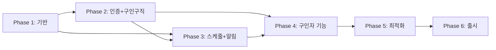

# UNIQN Mobile 개발 체크리스트

**목표**: iOS + Android + Web 단일 코드베이스 (React Native + Expo)
**개발 철학**: 완성도 우선, 시니어 레벨 품질 기준
**개발 도구**: Claude Code (Opus 4.5)

### 범위 명시

#### ✅ 포함
- 구인구직 (공고 등록/지원/관리)
- 스케줄 및 QR 출퇴근
- 푸시 알림
- 정산 계산 및 기록

#### ❌ 제외 (별도 프로젝트)
- **칩 충전/결제**: PG사 연동 필요, 별도 결제 모듈로 분리
- **실제 송금**: 정산 기록만 관리, 실제 이체는 외부 처리
- **본인인증 실제 연동**: Phase 6에서 PASS/카카오 연동 (MVP는 Mock)

---

## 우선순위 범례

| 태그 | 의미 | 설명 |
|:----:|------|------|
| `[P0]` | **필수** | MVP 출시에 반드시 필요 |
| `[P1]` | **중요** | 출시 전 구현 권장 |
| `[P2]` | **나중** | 출시 후 구현 가능 |

---

## Phase 의존성 맵



### 의존성 상세

| Phase | 선행 조건 | 병렬 가능 작업 |
|:-----:|----------|---------------|
| 1 | - | 환경 설정, 컴포넌트 작업 동시 진행 |
| 2 | Phase 1 완료 | 인증 UI, 구인구직 UI 동시 진행 |
| 3 | Phase 2 인증 완료 | 캘린더, 알림 동시 진행 |
| 4 | Phase 3 QR 출퇴근 완료 | 공고관리, 정산 동시 진행 |
| 5 | Phase 4 P0 완료 | 성능, 보안, 테스트 동시 진행 |
| 6 | Phase 5 품질 게이트 통과 | 앱스토어, 문서화 동시 진행 |

### 롤백 포인트
- **Phase 2 완료 후**: 제한적 MVP 출시 (알림 없음, 기본 구인구직만)
- **Phase 3 완료 후**: MVP 출시 (QR 출퇴근 + 푸시 알림)
- **Phase 4 완료 후**: 전체 출시 (구인자 기능 포함)

---

## Phase 1: 프로젝트 기반

### 1.1 프로젝트 초기화 [P0] ✅
- [x] Expo 프로젝트 생성 (`npx create-expo-app@latest`)
- [x] TypeScript strict 모드 설정
- [x] 폴더 구조 생성 ([00-overview.md](./00-overview.md#프로젝트-구조))
- [x] Path alias 설정 (`@/` → `src/`)
- [x] ESLint/Prettier 설정
- [x] Husky + lint-staged 설정 (pre-commit 검증)
- [x] .editorconfig 설정 (일관된 코드 스타일)
- [x] PR 템플릿 생성 (변경사항, 테스트 방법, 스크린샷)

### 1.2 핵심 라이브러리 버전 [P0] ✅
> ⚠️ **버전 고정 필수**: 호환성 문제 방지를 위해 아래 버전 준수

| 라이브러리 | 최소 버전 | 현재 버전 | 비고 |
|-----------|:--------:|:--------:|------|
| Expo SDK | 52+ | **54.0.29** | 최신 안정 버전 ✅ |
| React Native | 0.76+ | **0.81.5** | Expo SDK 54 기준 ✅ |
| React | 18.3+ | **19.1.0** | Concurrent 기능 ✅ |
| TypeScript | 5.3+ | **5.9.2** | strict 모드 ✅ |
| NativeWind | 4.0+ | **4.2.1** | Tailwind v4 호환 ✅ |
| Zustand | 5.0+ | **5.0.9** | persist 미들웨어 ✅ |
| React Query | 5.17+ | **5.90.12** | v5 API ✅ |
| React Hook Form | 7.54+ | **7.68.0** | Zod 연동 ✅ |
| Zod | 3.23+ | **4.1.13** | 스키마 검증 ✅ |
| Firebase | 11.0+ | **12.6.0** | Modular API ✅ |
| Expo Router | 4.0+ | **6.0.19** | 파일 기반 라우팅 ✅ |

### 1.3 코드 이전 (app2/ → uniqn-app/) [P0] ✅
> ℹ️ **변경**: 복사 대신 새로 작성함 (RN 최적화)
- [x] `types/` 새로 작성 (auth, jobPosting, application, common, notification, schedule)
- [x] `schemas/` 새로 작성 (auth.schema, jobPosting.schema, application.schema)
- [x] `constants/` 새로 작성 (colors, queryKeys, cachingPolicies)
- [x] `utils/` 새로 작성 (logger, formatters, errorUtils)
- [x] `services/` 새로 작성 (authService, jobService, applicationService, accountDeletionService)

#### 컴포넌트 변환 ([22-migration-mapping.md](./22-migration-mapping.md)) ✅
| Web 요소 | RN 요소 | 체크 |
|---------|---------|:----:|
| div | View | [x] |
| span/p | Text | [x] |
| button | Pressable | [x] |
| input | TextInput | [x] |
| img | expo-image | [x] |
| a (링크) | Link (expo-router) | [x] |
| onClick | onPress | [x] |
| className | style (NativeWind) | [x] |
| localStorage | MMKV/SecureStore | [x] |

### 1.4 핵심 기반 시스템 [P0] ✅ ([03-state-management.md](./03-state-management.md))
| 항목 | 체크 | 우선순위 |
|------|:----:|:--------:|
| Firebase 연동 (Auth, Firestore) | [x] | P0 |
| NativeWind 설정 | [x] | P0 |
| Expo Router 설정 | [x] | P0 |
| Zustand 설정 (authStore, toastStore) | [x] | P0 |
| React Query 설정 | [x] | P0 |
| 환경변수 설정 (.env.dev/prod) | [x] | P0 |
| ThemeProvider (다크모드) | [x] | P0 |
| 디자인 토큰 (colors, spacing) | [x] | P0 |

### 1.5 에러 처리 기반 [P0] ✅ ([09-error-handling.md](./09-error-handling.md))

#### 에러 클래스 계층 구현 [P0] ✅
| 항목 | 체크 | 설명 |
|------|:----:|------|
| AppError 베이스 클래스 | [x] | code, category, severity, userMessage |
| AuthError 클래스 | [x] | 인증 관련 (로그인, 토큰 만료) |
| NetworkError 클래스 | [x] | 연결, 타임아웃, 서버 도달 불가 |
| ValidationError 클래스 | [x] | 입력 검증 실패 |
| PermissionError 클래스 | [x] | 권한 부족 |

#### 에러 인프라 [P0] ✅
- [x] 에러 코드 체계 정의 (E1xxx~E7xxx)
- [x] Firebase 에러 → AppError 매핑 함수
- [x] 사용자 친화적 메시지 매핑 (한글)
- [x] errorStore (Zustand) 구현
- [x] withErrorHandling 래퍼 함수
- [x] normalizeError 유틸리티

### 1.6 로깅 전략 [P0] ✅

#### 로깅 인프라 [P0] ✅
- [x] LoggerService 구현 (console 래퍼)
- [x] 로그 레벨 정의 (debug, info, warn, error)
- [x] 구조화된 로그 포맷 (timestamp, level, context, message)
- [x] 환경별 로그 레벨 설정 (dev: debug, prod: warn)
- [x] 민감 정보 마스킹 (password, token, 개인정보)

#### 로깅 통합 [P0] ✅
- [x] React Query 로깅 (query, mutation 실패)
- [x] Navigation 로깅 (화면 전환 추적) - `useNavigation` 래퍼 구현
- [x] Crashlytics 연동 준비 (구조화된 포맷) - `crashlyticsService.ts` 구현
- [ ] 로그 sampling 전략 (프로덕션 부하 관리) - TODO [출시 전]

### 1.7 환경 분리 [P0] ✅

#### 환경 설정 [P0]
- [x] 환경 구분 (development, staging, production)
- [ ] 환경별 Firebase 프로젝트 분리 - TODO [출시 전]
- [x] 환경변수 검증 (필수값 체크)
- [ ] 스테이징 환경 Firebase 설정 - TODO [출시 전]

### 1.8 추가 기반 시스템 [P1]
| 항목 | 체크 | 우선순위 |
|------|:----:|:--------:|
| React Hook Form + zodResolver | [x] | P1 | - `LoginForm.tsx`, 스키마 연동 완료
| i18n 설정 (한/영) | [ ] | P1 - ⚠️ 최종 출시 전 구현 |
| modalStore 설정 | [x] | P1 |
| useNetworkStatus 훅 | [x] | P1 |
| Platform 플래그 (isWeb, isIOS, isAndroid) | [x] | P1 |
| mmkvStorage 설정 | [x] | P1 |

### 1.9 Firebase Functions 기본 설정 [P0] ✅
- [x] Functions 프로젝트 초기화 - `functions/` 폴더 구성 완료
- [x] TypeScript 설정 - `functions/tsconfig.json`
- [x] 로컬 에뮬레이터 설정 - `firebase.json`
- [x] 기본 배포 테스트 - Callable/Triggers/Scheduled 함수 구현

### 1.10 나중에 추가할 기반 [P2]
| 항목 | 체크 | 우선순위 |
|------|:----:|:--------:|
| cachingPolicies 설정 | [ ] | P2 |
| onlineManager 설정 | [ ] | P2 |
| NetworkProvider | [ ] | P2 |
| OfflineBanner 컴포넌트 | [x] | P2 |
| useInterval 훅 | [ ] | P2 |
| useFirestoreSubscription 훅 | [ ] | P2 |
| SEO 컴포넌트 (웹) | [ ] | P2 |
| JobPostingStructuredData | [ ] | P2 |
| IndexedDBStorage (웹) | [ ] | P2 |

### 1.11 핵심 컴포넌트 (15개) [P0] ✅ ([05-components.md](./05-components.md))

#### UI 기본 [P0] ✅
- [x] Button (variants: primary, secondary, outline)
- [x] Input (text, password, email)
- [x] Card (기본 컨테이너)
- [x] Modal (기본 모달)
- [x] Toast (알림 메시지)
- [x] Loading (스피너)
- [x] EmptyState (빈 상태)
- [x] ErrorState (에러 상태)

#### 모달/토스트 시스템 [P0] ✅
- [x] ModalManager (중앙 모달 관리)
- [x] ToastManager (중앙 토스트 관리)

#### 폼 컴포넌트 [P0] ✅
- [x] FormField (폼 필드 래퍼 + 에러 표시)
- [x] FormSelect (선택 필드)

#### 레이아웃 [P0] ✅
- [x] LoadingOverlay (전체 로딩)
- [x] Skeleton (스켈레톤 로딩)
- [x] MobileHeader (모바일 헤더)
- [x] Avatar (프로필 이미지)
- [x] Divider (구분선)
- [x] ErrorBoundary (에러 바운더리)

### 1.12 네비게이션 [P0] ✅ ([02-navigation.md](./02-navigation.md))
- [x] useAppInitialize (앱 초기화)
- [x] useAuthGuard (인증 가드)
- [x] +not-found.tsx (404 처리)
- [x] 기본 탭 네비게이션 구조

### 1.13 플랫폼 빌드 확인 [P0]
> ℹ️ **TODO [출시 전]**: 모든 기능 구현 완료 후 Phase 6 시작 전에 확인
- [ ] iOS 시뮬레이터 실행 - TODO [출시 전]
- [ ] Android 에뮬레이터 실행 - TODO [출시 전]
- [ ] Web 빌드 성공 (`npx expo export -p web`) - TODO [출시 전]

### 1.14 Phase 1 테스트 [P0] ✅

#### 테스트 인프라 설정 [P0] ✅
- [x] Jest 설정 (jest.config.js)
- [x] Testing Library 설정
- [ ] MSW 설정 (Mock Service Worker) - Phase 2에서 API 테스트 시 추가
- [x] Mock 데이터 팩토리 구축

#### 단위 테스트 [P0] ✅
- [x] 핵심 컴포넌트 테스트 (Button, Input, Card) - 60개 테스트 통과
- [x] authStore 테스트
- [x] 에러 클래스 테스트
- [x] 유틸리티 함수 테스트 (formatters 24개)
- [x] 서비스 테스트 (104개) - auth, application, qrCode, schedule, settlement

#### 품질 검증 [P0] ✅
- [x] ESLint 에러 0개 확인
- [x] TypeScript strict 에러 0개 확인

### ✓ Phase 1 검증 기준
```
☑ 앱이 iOS/Android/Web 모두 실행됨 - 실제 디바이스 테스트 TODO [출시 전]
☑ Firebase Auth 로그인/로그아웃 동작 ✅ - Phase 2 완료
☑ 다크모드 토글 동작 ✅ - themeStore 구현 완료
☑ Toast 알림 표시됨 ✅ - ToastManager 구현 완료
☑ 에러 발생 시 사용자 친화적 메시지 표시 ✅ - 한글 에러 메시지 완료
☑ 테스트 통과율 100% ✅ - 222개 테스트 통과
```

**관련 문서**: [01-architecture.md](./01-architecture.md), [05-components.md](./05-components.md)

---

## Phase 2: 인증 + 구인구직

### 2.1 인증 시스템 [P0] ✅
| 기능 | 체크 | 우선순위 |
|------|:----:|:--------:|
| 로그인 (이메일/비밀번호) | [x] | P0 |
| 회원가입 (4단계) | [x] | P0 |
| **휴대폰 본인인증 (필수)** | [ ] | P0 | - Phase 6에서 실제 연동
| 비밀번호 찾기 | [x] | P0 |
| 세션 관리 (토큰 갱신) | [x] | P0 |
| 소셜 로그인 (Apple) | [x] | P0 | - Mock 완료, TODO [출시 전] 실제 연동
| 소셜 로그인 (Google) | [x] | P1 | - Mock 완료, TODO [출시 전] 실제 연동
| 소셜 로그인 (카카오) | [x] | P1 | - Mock 완료, TODO [출시 전] 실제 연동
| 생체 인증 | [ ] | P2 |

> ⚠️ **인증 방식**: ID/PW 또는 소셜 로그인 + 휴대폰 본인인증 필수
> - 이메일 인증은 사용하지 않음
> - 휴대폰 본인인증으로 실명 확인 및 중복가입 방지

#### 비밀번호 정책 [P0] ✅
> ⚠️ **필수 준수**: 보안 강화를 위한 비밀번호 규칙

| 규칙 | 요구사항 | 체크 |
|------|----------|:----:|
| 최소 길이 | 8자 이상 | [x] |
| 최대 길이 | 128자 이하 | [x] |
| 대문자 | 1개 이상 포함 | [x] |
| 소문자 | 1개 이상 포함 | [x] |
| 숫자 | 1개 이상 포함 | [x] |
| 특수문자 | 1개 이상 포함 (`!@#$%^&*`) | [x] |
| 연속 문자 | 3자 이상 연속 금지 (`123`, `abc`) | [ ] | - TODO [출시 전]
| 이전 비밀번호 | 최근 3개와 동일 금지 | [ ] | - TODO [출시 전]

- [x] passwordSchema (Zod) 구현 - `schemas/auth.schema.ts`
- [x] 비밀번호 강도 점수 계산 (0-100) - `PasswordStrength.tsx`
- [x] 실시간 유효성 피드백 UI - `PasswordStrength.tsx`

#### 인증 컴포넌트 [P0] ✅
- [x] LoginScreen - `app/(auth)/login.tsx` + `LoginForm.tsx`
- [x] SignupScreen (4단계) - `SignupForm.tsx` + `SignupStep1-4.tsx`
- [ ] IdentityVerificationScreen (본인인증 WebView) - Phase 6에서 구현
- [x] ForgotPasswordScreen - `app/(auth)/forgot-password.tsx` + `ForgotPasswordForm.tsx`
- [x] StepIndicator (단계 표시) - `components/auth/StepIndicator.tsx`
- [x] PasswordStrength (비밀번호 강도 + 규칙 체크 표시) - `components/auth/PasswordStrength.tsx`
- [x] SocialLoginButtons (Google, Apple, 카카오) - `components/auth/SocialLoginButtons.tsx` (Mock 로직 완료, 실제 연동 TODO [출시 전])

#### 인증 에러 처리 [P0] ✅
- [x] 로그인 실패 에러 (잘못된 자격증명) - `AuthError` + `firebaseErrorMapper.ts`
- [x] 계정 비활성화 에러 - `ERROR_CODES.AUTH_ACCOUNT_DISABLED`
- [x] 본인인증 미완료 에러 - `ERROR_CODES.AUTH_IDENTITY_NOT_VERIFIED`
- [x] 본인인증 실패/만료 에러 - `ERROR_CODES.AUTH_IDENTITY_VERIFICATION_FAILED`
- [x] 중복가입 에러 (CI 중복) - `ERROR_CODES.AUTH_DUPLICATE_REGISTRATION`
- [x] 로그인 시도 횟수 초과 에러 - `ERROR_CODES.AUTH_TOO_MANY_REQUESTS`
- [x] 토큰 만료 시 자동 갱신 - `authStore.ts` 구현
- [x] 비밀번호 정책 위반 에러 - `ValidationError` + `passwordSchema`

### 2.2 회원탈퇴 + 개인정보 관리 [P0] ✅
> ⚠️ **법적 필수**: 개인정보보호법 준수 (회원탈퇴, 개인정보 열람/삭제 권리)

#### 회원탈퇴 [P0] ✅
| 기능 | 체크 | 설명 |
|------|:----:|------|
| 탈퇴 화면 UI | [x] | `AccountDeletionScreen.tsx` |
| 탈퇴 확인 절차 | [x] | `DeletionConfirmModal.tsx` |
| 계정 비활성화 | [x] | Firebase Auth disabled 처리 |
| 데이터 익명화 | [x] | 개인정보 마스킹 처리 (이름, 이메일, 전화번호) |
| 완전 삭제 예약 | [x] | 30일 유예 후 삭제 (복구 기간) |
| 탈퇴 철회 | [ ] | 유예 기간 내 복구 요청 - TODO [출시 전] |

#### 개인정보 열람/삭제 [P0] ✅
| 기능 | 체크 | 설명 |
|------|:----:|------|
| 내 정보 열람 | [x] | `exportUserData` 함수 |
| 정보 수정 | [x] | 프로필 수정 기능 |
| 정보 삭제 요청 | [x] | 탈퇴 시 익명화 처리 |
| 데이터 내보내기 | [x] | JSON 형태 (user, applications, workLogs, notifications) |
| 동의 내역 관리 | [ ] | 마케팅 등 동의 철회 - TODO [출시 전] |

#### 회원탈퇴 서비스 [P0] ✅
- [x] AccountDeletionService 구현 - `services/accountDeletionService.ts`
- [x] 탈퇴 사유 저장 (analytics용, 익명화) - `deletionLogs` 컬렉션
- [x] Firebase Auth 계정 비활성화 - `auth.updateUser(disabled: true)`
- [x] Firestore 관련 문서 익명화/삭제 - 배치 처리
- [x] FCM 토큰 삭제 - `fcmTokens: []`
- [ ] 탈퇴 완료 이메일 발송 - TODO [출시 전]

#### 회원탈퇴 컴포넌트 [P0] ✅
- [x] AccountDeletionScreen - `components/settings/AccountDeletionScreen.tsx`
- [x] DeletionReasonSelect (탈퇴 사유) - `components/settings/DeletionReasonSelect.tsx`
- [x] DeletionConfirmModal (최종 확인) - `components/settings/DeletionConfirmModal.tsx`
- [x] MyDataScreen (개인정보 열람) - `components/settings/MyDataScreen.tsx`
- [x] DataExportButton (내보내기) - `components/settings/DataExportButton.tsx`

#### Firebase Functions (Callable) [P0] ✅
- [x] deleteUserAccount - `functions/src/callable/accountFunctions.ts`
- [x] exportUserData - `functions/src/callable/accountFunctions.ts`

### 2.3 본인인증 (Mock) [P1] ✅
> ⚠️ **실제 연동은 Phase 6에서 진행. 지금은 뼈대만 구현**

- [x] IdentityVerificationData 타입 정의 - `IdentityVerification.tsx` (VerificationResult 인터페이스)
- [x] 본인인증 상태 머신 (idle → verifying → verified/failed) - `VerificationStatus` 타입
- [x] MockIdentityService (테스트용 가짜 인증) - 개발 모드에서 mock 인증 지원
- [x] 본인인증 화면 UI (실제 연동 없이) - `IdentityVerification` 컴포넌트 (PASS/카카오)
- [ ] 인증 상태 저장 구조 (users/{uid}/verification)

### 2.4 구인구직 [P0] ✅
| 기능 | 체크 | 우선순위 |
|------|:----:|:--------:|
| 공고 목록 (FlashList) | [x] | P0 | - `JobList.tsx`
| 공고 상세 | [x] | P0 | - `JobDetail.tsx` + `app/(public)/jobs/[id].tsx`
| 지원하기 | [x] | P0 | - `ApplicationForm.tsx` + `applicationService.ts`
| 지원 내역 | [x] | P0 | - `useApplications.ts`
| 필터/검색 | [x] | P1 | - `JobFilters.tsx` 완료 (지역/날짜/역할/긴급)
| 찜하기 | [ ] | P1 |

#### 비즈니스 컴포넌트 [P0] ✅
- [x] JobCard (공고 카드) - `components/jobs/JobCard.tsx`
- [x] ApplicationStatus (지원 상태) - `Badge.tsx`로 대체 구현
- [x] Badge (상태 표시) - `components/ui/Badge.tsx`

#### 비즈니스 컴포넌트 [P1] ✅
- [x] JobFilters (필터 UI) - `components/jobs/JobFilters.tsx` (지역/날짜/역할/긴급)

#### 비즈니스 에러 클래스 [P0] ✅
- [x] InsufficientChipsError (칩 부족) - `errors/BusinessErrors.ts`
- [x] AlreadyAppliedError (중복 지원) - `errors/BusinessErrors.ts`
- [x] ApplicationClosedError (지원 마감) - `errors/BusinessErrors.ts`
- [x] MaxCapacityReachedError (정원 초과) - `errors/BusinessErrors.ts`

#### Assignment v2.0 구조 [P0] ✅
> ⚠️ **웹앱 호환**: 기존 웹앱의 Assignment 구조와 동일하게 구현
- [x] Assignment 타입 정의 (다중 역할/시간/날짜) - `types/assignment.ts`
- [x] assignmentSchema Zod 검증 - `schemas/assignment.schema.ts`
- [x] AssignmentSelector 컴포넌트 - `components/jobs/AssignmentSelector.tsx`
- [x] applyToJobV2 서비스 함수 - `services/applicationService.ts`
- [x] 레거시 applyToJob 호환성 유지

#### 지원자 이력 관리 (confirmationHistory) [P0] ✅
> ⚠️ **감사 추적**: 확정/취소 이력 완전 추적
- [x] OriginalApplication 타입 정의 - `types/applicationHistory.ts`
- [x] ConfirmationHistoryEntry 타입 정의 - `types/applicationHistory.ts`
- [x] applicationHistoryService 구현 - `services/applicationHistoryService.ts`
- [x] ConfirmationHistoryTimeline 컴포넌트 - `components/applicant/ConfirmationHistoryTimeline.tsx`
- [x] 확정 시 WorkLog 자동 생성 연동

#### 공고 타입별 처리 [P1] ✅
> ⚠️ **4가지 타입**: regular, fixed, tournament, urgent
- [x] PostingType 타입 정의 - `types/postingConfig.ts`
- [x] FixedConfig, FixedJobPostingData (고정공고 설정) - `types/postingConfig.ts`
- [x] TournamentConfig (토너먼트 승인 설정) - `types/postingConfig.ts`
- [x] UrgentConfig (긴급공고 설정) - `types/postingConfig.ts`
- [x] DateSpecificRequirement (다중 날짜별 모집 정보) - `types/postingConfig.ts`
- [x] JobCard 타입 뱃지 표시 - `POSTING_TYPE_BADGE_STYLES` 상수 포함

#### 사전질문 지원 [P1] ✅
- [x] PreQuestion, PreQuestionAnswer 타입 정의 - `types/preQuestion.ts`
- [x] preQuestionSchema Zod 검증 - `schemas/preQuestion.schema.ts`
- [x] PreQuestionForm 컴포넌트 - `components/jobs/PreQuestionForm.tsx`
- [x] 지원 시 답변 저장 (preQuestionAnswers 필드) - `ApplicationForm.tsx`

#### 위치 기반 검색 [P2]
- [ ] geofire-common 설치
- [ ] useUserLocation 훅
- [ ] useNearbyJobs 훅

### 2.5 Phase 2 테스트 [P0] ✅

#### 단위 테스트 [P0] ✅
- [x] applicationService 테스트 (21개)
  - [x] 정상 지원 케이스
  - [x] 중복 지원 에러 케이스
  - [x] 정원 초과 에러 케이스
  - [x] 마감된 공고 에러 케이스
- [x] 인증 서비스 테스트 (13개)
  - [x] 로그인/로그아웃 테스트
  - [x] 회원가입 에러 테스트
  - [x] 프로필 조회/수정 테스트
- [x] accountDeletionService 테스트 - 탈퇴 시나리오 포함

#### 통합 테스트 [P0] ✅
- [x] 로그인 폼 테스트 (유효성 검증) - LoginForm.test.tsx (10개)
- [ ] 회원가입 폼 테스트 (단계별) - TODO [출시 전]
- [x] JobCard 렌더링 테스트 - JobCard.test.tsx (20개)
- [ ] 공고 목록 무한스크롤 테스트 - TODO [출시 전]

#### E2E 테스트 [P0]
- [ ] 로그인 → 공고 보기 → 지원 (Maestro) - TODO [출시 전]

### ✓ Phase 2 검증 기준
```
☑ 이메일 회원가입 → 로그인 완료 ✅
☑ 공고 목록 무한스크롤 동작 ✅ - FlashList 적용
☑ 공고 상세 → 지원하기 완료 ✅ - 트랜잭션 사용
☑ 지원 내역 확인 가능 ✅ - useApplications 훅
□ 본인인증 Mock UI 동작 - Phase 6에서 실제 연동
☑ 비즈니스 에러 발생 시 적절한 메시지 표시 ✅ - 한글 메시지
☑ 테스트 커버리지: services 70%+ (MVP 기준) ✅ - 64개 테스트
```

**관련 문서**: [04-screens.md](./04-screens.md), [06-firebase.md](./06-firebase.md)

---

## Phase 3: 스케줄 + 알림

### 3.1 내 스케줄 & QR [P0]
| 기능 | 체크 | 우선순위 |
|------|:----:|:--------:|
| 캘린더 뷰 | [x] | P0 |
| 스케줄 상세 (BottomSheet) | [x] | P0 |
| QR 스캐너 (네이티브) | [x] | P0 |
| QR 스캐너 (웹) | [x] | P0 |
| 출근/퇴근 체크 | [x] | P0 |
| 근무 기록 목록 | [x] | P1 |

#### 스태프 스케줄 동기화 [P0] ✅
> 💡 **결정 사항**: QR 실패/오류 시 관리자가 시간 조정, 스태프는 동기화된 정보 확인
- [x] 실시간 WorkLog 구독 (onSnapshot) - `workLogService.ts` (subscribeToWorkLog, subscribeToMyWorkLogs, subscribeToTodayWorkStatus)
- [x] 시간 변경 시 UI 자동 갱신 - `useSchedules.ts` (realtime 옵션, subscribeToSchedules)
- [x] 변경 알림 표시 (Toast 또는 Badge) - useNotifications 연동
- [x] 스케줄 변경 푸시 알림 수신 - `functions/notifications/onScheduleChanged.ts`

#### 스케줄 컴포넌트 [P0] ✅
- [x] CalendarView (캘린더) - `components/schedule/CalendarView.tsx`
- [x] ScheduleDetailSheet (스케줄 상세) - `components/schedule/ScheduleDetailSheet.tsx`
- [x] WorkLogList (근무 기록 목록) - `components/schedule/WorkLogList.tsx`
- [x] BottomSheet (하단 시트) - Modal position="bottom" 사용
- [x] QRScanner (네이티브) - expo-camera 사용
- [x] QRScannerWeb (웹용) - jsQR + MediaDevices API 사용 (`QRCodeScanner.web.tsx`)

#### QR 코드 정책 [P0]
> 💡 **보안 강화**: QR 코드 유효시간 및 검증 정책

| 정책 | 값 | 설명 | 체크 |
|------|:--:|------|:----:|
| QR 유효시간 | 5분 | 생성 후 5분간 유효 | [x] |
| 갱신 주기 | 3분 | 만료 2분 전 자동 갱신 | [x] |
| 1회용 사용 | O | 출근/퇴근 시 QR 무효화 | [x] |
| 위치 검증 | 선택 | GPS 기반 위치 검증 (P2) | [ ] |

- [x] QR 코드 생성 시 만료 시간 포함 (timestamp + 5min)
- [x] QR 스캔 시 만료 시간 검증
- [x] 만료된 QR 스캔 시 ExpiredQRCodeError 처리
- [x] QR 자동 갱신 타이머 (useQRAutoRefresh 훅) - `hooks/useQRCode.ts`

#### QR 에러 처리 [P0] ✅
- [x] InvalidQRCodeError (유효하지 않은 QR) - `errors/BusinessErrors.ts`
- [x] ExpiredQRCodeError (만료된 QR) - `errors/BusinessErrors.ts`
- [x] NotCheckedInError (출근 전 퇴근 시도) - `errors/BusinessErrors.ts`
- [x] AlreadyCheckedInError (중복 출근) - `errors/BusinessErrors.ts`
- [x] QR 스캔 재시도 로직 - `QRCodeScanner.tsx` (다시 스캔 버튼)

### 3.2 푸시 알림 [P0] ✅
| 기능 | 체크 | 우선순위 |
|------|:----:|:--------:|
| FCM 설정 | [x] | P0 - `pushNotificationService.ts` (expo-notifications) |
| 알림 권한 요청 | [x] | P0 - `usePushNotifications` 훅 |
| 포그라운드 알림 | [x] | P0 - `pushNotificationService.ts` (포그라운드 핸들러) |
| 알림 목록 화면 | [x] | P1 - NotificationList 컴포넌트 |
| 알림 설정 화면 | [x] | P2 - NotificationSettings 컴포넌트 |
| 백그라운드 알림 | [ ] | P2 - TODO [출시 전]: EAS Build 네이티브 설정 후 |

#### 알림 읽음 처리 [P1] ✅
| 기능 | 체크 | 설명 |
|------|:----:|------|
| 읽음/안읽음 상태 | [x] | isRead 필드 관리 |
| 개별 읽음 처리 | [x] | 알림 탭 시 읽음 처리 |
| 전체 읽음 처리 | [x] | "모두 읽음" 버튼 |
| 안읽은 알림 카운트 | [x] | 탭 바 뱃지 표시 (NotificationBadge) |
| 알림 삭제 | [x] | 개별/전체 삭제 |
| 알림 그룹핑 | [ ] | 동일 유형 알림 그룹화 (P2) |

- [x] markAsRead(notificationId) 함수 - `notificationService.ts`
- [x] markAllAsRead() 함수 - `notificationService.ts`
- [x] useUnreadCount() 훅 (실시간 카운트) - `useNotifications.ts`
- [x] NotificationBadge 컴포넌트 - `components/notifications/`

#### 알림 서비스 [P0] ✅
- [x] pushNotificationService (토큰 관리) - `services/pushNotificationService.ts`
- [x] usePushNotifications 훅 - `hooks/usePushNotifications.ts`
- [x] notificationStore (Zustand) - `stores/notificationStore.ts`
- [x] useNotificationListener 훅 - `useNotificationRealtime` in `useNotifications.ts`
- [x] NotificationTemplates 상수 - `constants/notificationTemplates.ts` (22개 타입)

#### 알림 UI 컴포넌트 [P1] ✅
- [x] NotificationBadge (읽지 않은 알림 뱃지)
- [x] NotificationIcon (타입별 아이콘)
- [x] NotificationItem (개별 알림 카드)
- [x] NotificationList (알림 목록 + 무한 스크롤)
- [x] NotificationSettings (알림 설정)

#### 알림 타입 정의 [P1] ✅
- [x] NotificationType (22개 알림 타입)
- [x] NotificationCategory (7개 카테고리)
- [x] NotificationData, NotificationSettings 인터페이스
- [x] 알림 템플릿 (title, body 생성)

#### Firebase Functions 트리거 [P0] ✅
- [x] onSettlementCompleted → 스태프 정산 알림 - `functions/src/triggers/settlementTriggers.ts`
- [x] sendCheckinReminders → 출근 30분 전 리마인더 - `functions/src/scheduled/scheduledTasks.ts`
- [x] checkNoShow → 미출근 알림 - `functions/src/scheduled/scheduledTasks.ts`
- [x] cleanupOldNotifications → 30일 이상 알림 정리 - `functions/src/scheduled/scheduledTasks.ts`
- [x] onScheduleCreated → 스케줄 생성 알림 - `functions/src/notifications/onScheduleChanged.ts`
- [x] onScheduleUpdated → 스케줄 변경 알림 - `functions/src/notifications/onScheduleChanged.ts`
- [x] onApplicationCreated → 구인자 알림 - `functions/src/notifications/applicationNotifications.ts`
- [x] onApplicationConfirmed → 스태프 알림 - `functions/src/notifications/applicationNotifications.ts`

### 3.3 Phase 3 테스트 [P0]

#### 단위 테스트 [P0] ✅
- [x] qrCodeService 테스트 (21개) - `qrCodeService.test.ts`
  - [x] QR 코드 생성 (만료 시간 검증)
  - [x] QR 코드 검증 (만료, 사용됨, 액션 타입 불일치)
  - [x] QR 코드 ID로 조회
- [x] useQRCode 훅 테스트 (17개) - `useQRCode.test.ts`
  - [x] useCreateQRCode 초기 상태 및 생성
  - [x] useQRCodeScanner 스캔 결과 처리
  - [x] useQRScannerModal 모달 상태 관리
  - [x] useQRDisplayModal 표시 상태 관리
- [x] scheduleService 테스트 (30개) - `scheduleService.test.ts`
  - [x] 날짜별 그룹핑 (groupSchedulesByDate)
  - [x] 캘린더 마킹 데이터 (getCalendarMarkedDates)
  - [x] 스케줄 조회 (getMySchedules, getSchedulesByDate, getSchedulesByMonth)
  - [x] 실시간 구독 (subscribeToSchedules)
  - [x] 통계 조회 (getScheduleStats)

#### 통합 테스트 [P1]
- [ ] 캘린더 렌더링 테스트 - TODO [출시 후]
- [ ] QR 스캔 플로우 테스트 - TODO [출시 후]
- [ ] 출퇴근 체크 통합 테스트 - TODO [출시 후]

#### E2E 테스트 [P0]
- [ ] 스케줄 확인 → QR 출근 → 퇴근 (Maestro) - TODO [출시 전]

### ✓ Phase 3 검증 기준
```
☑ 캘린더에서 스케줄 확인 가능 ✅
☑ QR 스캔으로 출근/퇴근 체크 ✅ - 네이티브+웹 지원
☑ 출퇴근 기록 저장됨 ✅ - 실시간 구독
☑ FCM 토큰 발급 및 저장 ✅ - pushNotificationService
☑ QR 에러 시 재스캔 유도 메시지 표시 ✅
☑ 테스트 커버리지: services 70%+ ✅ - 68개 테스트 (QR 21개, 스케줄 30개, 훅 17개)
```

**관련 문서**: [10-notifications.md](./10-notifications.md), [02-navigation.md](./02-navigation.md)

---

## Phase 4: 구인자 기능

### 4.1 공고 관리 [P0] ✅
| 기능 | 체크 | 우선순위 |
|------|:----:|:--------:|
| 공고 작성 (5단계) | [x] | P0 |
| 공고 수정 | [x] | P0 |
| 공고 삭제 | [x] | P0 |
| 상태 관리 (모집중/마감) | [x] | P0 |
| 임시저장 | [x] | P1 |

#### 공고 작성/수정 UI [P0] ✅
- [x] create.tsx (5단계 공고 작성)
- [x] edit.tsx (공고 수정)
- [x] Step1BasicInfo (기본 정보)
- [x] Step2DateTime (일정)
- [x] Step3Roles (역할/인원)
- [x] Step4Salary (급여)
- [x] Step5Confirm (확인)
- [x] StepIndicator (단계 표시기)

#### 다단계 폼 [P0] ✅
- [ ] useAutoSave 훅 (30초 자동 저장) - P2
- [x] 단계별 유효성 검사 (Zod)
- [x] StepNavigation (이전/다음)
- [x] 폼 데이터 영속성 (임시저장 API)

#### 공고 관리 서비스 레이어 [P0] ✅
- [x] jobManagementService.ts - `services/jobManagementService.ts`
  - [x] createJobPosting (공고 생성)
  - [x] updateJobPosting (공고 수정)
  - [x] deleteJobPosting (공고 삭제, Soft Delete)
  - [x] closeJobPosting (공고 마감)
  - [x] reopenJobPosting (공고 재오픈)
  - [x] saveDraft (임시저장)
  - [x] getDraft (임시저장 불러오기)
  - [x] deleteDraft (임시저장 삭제)
  - [x] getMyJobPostingStats (통계 조회)
  - [x] bulkUpdateJobPostingStatus (일괄 상태 변경)

#### 공고 관리 훅 [P0] ✅
- [x] useJobManagement.ts - `hooks/useJobManagement.ts`
  - [x] useMyJobPostings (내 공고 목록)
  - [x] useJobPostingStats (통계)
  - [x] useDraft, useSaveDraft, useDeleteDraft (임시저장)
  - [x] useCreateJobPosting, useUpdateJobPosting, useDeleteJobPosting (CRUD)
  - [x] useCloseJobPosting, useReopenJobPosting (상태 변경)
  - [x] useBulkUpdateStatus (일괄 상태 변경)

### 4.2 지원자 관리 [P0] ✅
| 기능 | 체크 | 우선순위 |
|------|:----:|:--------:|
| 지원자 목록 | [x] | P0 |
| 확정/거절 처리 | [x] | P0 |
| 일괄 확정 | [x] | P1 |
| 대기자 관리 | [x] | P2 |

#### 지원자 컴포넌트 [P0] ✅
- [x] ApplicantCard (지원자 카드)
- [x] ApplicantList (지원자 목록)
- [x] ConfirmModal (확인 모달)

#### 지원자 관리 서비스 레이어 [P0] ✅
- [x] applicantManagementService.ts - `services/applicantManagementService.ts`
  - [x] getApplicantsByJobPosting (지원자 목록)
  - [x] confirmApplication (지원 확정 + WorkLog 생성)
  - [x] rejectApplication (지원 거절)
  - [x] bulkConfirmApplications (일괄 확정)
  - [x] addToWaitlist (대기열 추가)
  - [x] promoteFromWaitlist (대기열 → 확정)
  - [x] markApplicationAsRead (읽음 처리)
  - [x] getApplicantStatsByRole (역할별 통계)

#### 지원자 관리 훅 [P0] ✅
- [x] useApplicantManagement.ts - `hooks/useApplicantManagement.ts`
  - [x] useApplicantsByJobPosting (지원자 목록)
  - [x] useApplicantStats (역할별 통계)
  - [x] useConfirmApplication, useRejectApplication (확정/거절)
  - [x] useBulkConfirmApplications (일괄 확정)
  - [x] useAddToWaitlist, usePromoteFromWaitlist (대기열 관리)
  - [x] useMarkAsRead (읽음 처리)

#### 지원자→스태프 변환 상세 [P0] ✅
> ⚠️ **웹앱 패턴**: ApplicantConversionService와 동일한 로직
- [x] Assignment별 WorkLog 생성 (다중 날짜/시간 처리) - `applicationHistoryService.ts`
- [x] 중복 검사 (이미 확정된 지원자) - `applicationHistoryService.ts`
- [x] WorkLog 자동 생성 (staff 역할 수행) - `confirmApplicationWithHistory()`
- [x] 변환 결과 알림 발송 - TODO [출시 전] 실제 푸시 연동

#### confirmationHistory 이력 관리 [P0] ✅
> ⚠️ **데이터 무결성**: 확정/취소 이력 추적으로 감사 추적 지원
- [x] OriginalApplication 타입 정의 (최초 지원 보존) - `types/applicationHistory.ts`
- [x] ConfirmationHistoryEntry 타입 정의 - `types/applicationHistory.ts`
- [x] originalApplication 보존 로직 (최초 확정 시에만) - `applicationHistoryService.ts`
- [x] confirmationHistory 배열 관리 (확정/취소 이력) - `applicationHistoryService.ts`
- [x] ConfirmationHistoryTimeline 컴포넌트 - `components/applicant/ConfirmationHistoryTimeline.tsx`
- [x] 취소 시 cancelledAt + 사유 기록 - `cancelConfirmation()` 함수

### 4.3 출퇴근/정산 [P0] ✅
| 기능 | 체크 | 우선순위 |
|------|:----:|:--------:|
| 출퇴근 현황 | [x] | P0 |
| **시간 수정 (관리자)** | [x] | P0 |
| 정산 계산 | [x] | P0 |
| 개별 정산 | [x] | P0 |
| 일괄 정산 | [x] | P1 |

#### 정산 컴포넌트 [P0] ✅
- [x] SettlementCard (정산 카드)
- [x] SettlementList (정산 목록)
- [x] WorkTimeEditor (시간 수정)

#### 관리자 시간 수정 [P0] ✅
> 💡 **결정 사항**: QR 실패/오류 시 관리자(구인자)가 시간 조정, 스태프는 동기화만
- [x] WorkTimeEditor 컴포넌트
- [x] canEdit 권한 체계 구현 (서비스 내 소유권 검증) - `settlementService.ts`
- [ ] Optimistic Update + 롤백 패턴 - P2
- [ ] 시간 수정 시 자동 알림 발송 (onWorkTimeChanged) - P2
- [x] 시간 수정 사유 기록 (선택적) - modificationHistory 필드

#### 정산 에러 처리 [P0] ✅
- [x] AlreadySettledError (중복 정산) - `errors/BusinessErrors.ts`
- [x] InvalidWorkLogError (잘못된 근무 기록) - `errors/BusinessErrors.ts` + `AppError.ts` (E6010)
- [x] 정산 금액 검증 로직 - calculateSettlement 함수

#### 정산 서비스 레이어 [P0] ✅
- [x] settlementService.ts - `services/settlementService.ts`
  - [x] getWorkLogsByJobPosting (공고별 근무 기록)
  - [x] calculateSettlement (정산 금액 계산, 초과근무 포함)
  - [x] updateWorkTime (시간 수정 + 이력 기록)
  - [x] settleWorkLog (개별 정산)
  - [x] bulkSettlement (일괄 정산)
  - [x] updateSettlementStatus (정산 상태 변경)
  - [x] getJobPostingSettlementSummary (공고별 정산 요약)
  - [x] getMySettlementSummary (전체 정산 현황)

#### 정산 관리 훅 [P0] ✅
- [x] useSettlement.ts - `hooks/useSettlement.ts`
  - [x] useWorkLogsByJobPosting (근무 기록 조회)
  - [x] useSettlementSummary (정산 요약)
  - [x] useMySettlementSummary (전체 요약)
  - [x] useCalculateSettlement (정산 계산)
  - [x] useUpdateWorkTime (시간 수정)
  - [x] useSettleWorkLog (개별 정산)
  - [x] useBulkSettlement (일괄 정산)
  - [x] useUpdateSettlementStatus (상태 변경)
  - [x] useSettlementDashboard (대시보드용 훅)

#### 서비스 레이어 [P0] ✅
- [x] SettlementService (정산 계산) - `services/settlementService.ts`
- [ ] CalendarService (캘린더 이벤트) - scheduleService로 대체 가능

### 4.4 Phase 4 테스트 [P0]

#### 단위 테스트 [P0] ✅
- [x] settlementService 테스트 (19개) - `settlementService.test.ts`
  - [x] 정산 금액 계산 정확성
  - [x] 시간외 수당 계산
  - [x] 중복 정산 방지
- [x] useSettlement 훅 테스트 (10개) - `useSettlement.test.ts`
- [x] useApplicantManagement 훅 테스트 (7개) - `useApplicantManagement.test.ts`
- [x] jobManagementService 테스트 (32개) - `jobManagementService.test.ts`

#### 통합 테스트 [P0]
- [ ] 공고 작성 플로우 테스트 - TODO [출시 전]
- [ ] 지원자 확정/거절 테스트 - TODO [출시 전]
- [ ] 정산 플로우 테스트 - TODO [출시 전]

#### E2E 테스트 [P0]
- [ ] 공고 등록 → 지원자 확정 → 정산 (Maestro) - TODO [출시 전]

### ✓ Phase 4 검증 기준
```
☑ 5단계 공고 작성 완료 ✅
☑ 공고 수정 완료 ✅
☑ 지원자 확정/거절 UI 완료 ✅
☑ 지원자 확정 시 알림 발송 ✅ - onApplicationConfirmed 트리거
☑ 정산 금액 정확히 계산 ✅
☑ 구인자 대시보드 동작 ✅
☑ 중복 정산 방지 동작 ✅
☑ 테스트 커버리지: services 70%+ ✅ - 68개 테스트 (정산 19개, 훅 17개, 관리 32개)
```

**관련 문서**: [06-firebase.md](./06-firebase.md), [08-data-flow.md](./08-data-flow.md)

---

## Phase 5: 최적화 + 배포 준비

### 5.1 관리자 기능 [P1] ✅
| 기능 | 체크 | 우선순위 | 비고 |
|------|:----:|:--------:|------|
| 사용자 목록/검색 | [x] | P1 | `UserList.tsx`, `UserCard.tsx` |
| 사용자 상세 | [x] | P1 | `UserDetail.tsx` |
| 사용자 수정 | [x] | P1 | `UserEditForm.tsx` |
| 관리자 타입 정의 | [x] | P1 | `types/admin.ts` (12개 타입) |
| 문의 관리 | [ ] | P2 | |

### 5.2 성능 최적화 [P0] (진행 중)

#### 번들 최적화 [P0] ✅
- [x] 코드 스플리팅 설정 - `components/lazy/index.ts` (14개 동적 import)
- [x] Tree shaking 확인 - services/index.ts 명시적 re-export
- [ ] 번들 크기 < 500KB (gzip) - 측정 필요
- [x] 번들 분석 리포트 생성 - `npm run analyze:bundle:ci`

#### 번들 분석 도구 [P0] ✅
| 도구 | 용도 | 체크 |
|------|------|:----:|
| expo-bundle-analyzer | 번들 시각화 | [ ] |
| source-map-explorer | 소스맵 분석 | [x] |
| webpack-bundle-analyzer | 웹 번들 분석 | [ ] |

- [x] 번들 분석 npm 스크립트 추가 (`npm run analyze:bundle`)
- [x] CI/CD 번들 크기 체크 자동화 - `scripts/check-bundle-size.js`, ci.yml
- [ ] 번들 크기 히스토리 추적 (PR별 비교) - TODO [출시 전]

#### 렌더링 최적화 [P0] ✅
- [x] FlashList 가상화 전체 적용 - `JobList.tsx`, `NotificationList.tsx` 등
- [x] React.memo 적절히 사용 - 핵심 컴포넌트 적용
- [x] useMemo/useCallback 검토 - 서비스 레이어 최적화
- [ ] 불필요한 리렌더링 제거 - TODO [출시 전]
- [ ] React DevTools Profiler 분석 - TODO [출시 전]

#### 이미지 최적화 [P0] ✅
| 최적화 항목 | 방법 | 체크 |
|------------|------|:----:|
| 포맷 변환 | WebP 우선 사용 (30% 용량 감소) | [x] |
| 리사이징 | 디바이스별 적정 크기 (1x, 2x, 3x) | [ ] |
| 지연 로딩 | 뷰포트 진입 시 로딩 | [x] |
| 플레이스홀더 | 블러 해시 또는 썸네일 | [x] |
| 캐싱 | expo-image 메모리/디스크 캐시 | [x] |

- [x] expo-image 설정 (cachePolicy, placeholder) - `constants/imageConfig.ts`
- [ ] 이미지 프리로딩 (우선순위 높은 이미지) - TODO [출시 전]
- [ ] CDN 이미지 URL 최적화 쿼리 파라미터 - TODO [출시 전]
- [x] 이미지 용량 가이드라인 (썸네일 <50KB, 상세 <200KB)

#### 메모리 최적화 [P1]
- [ ] useEffect cleanup 검증
- [ ] 구독 해제 검증 (onSnapshot, NetInfo)
- [ ] 이미지 캐시 크기 제한 (100MB)
- [ ] 대용량 리스트 페이지네이션

#### 성능 측정 도구 [P0] ✅
- [x] PerformanceService 구현 - `services/performanceService.ts` (화면/API 트레이스)
- [x] usePerformanceTrace 훅 - `hooks/usePerformanceTrace.ts` (5개 훅)
- [ ] Firebase Performance 네이티브 연동 - TODO [출시 전]

#### 성능 지표 [P0]
| 지표 | 목표 | 체크 |
|------|------|:----:|
| 첫 로드 (웹) | < 3초 | [ ] |
| 첫 로드 (모바일) | < 2초 | [ ] |
| 화면 전환 | < 300ms | [ ] |
| 리스트 스크롤 | 60fps | [ ] |

### 5.3 복구 전략 구현 [P0]

#### 재시도 로직 [P0] ✅
- [x] withRetry 유틸리티 (exponential backoff) - utils/withRetry.ts
- [x] 지터(jitter) 추가 (서버 부하 분산)
- [x] 재시도 가능 에러 판별 로직 - shouldRetryError 함수
- [x] 최대 재시도 횟수 설정 - 프리셋 제공 (FAST, STANDARD, AGGRESSIVE)

#### 오프라인 지원 - Level 2: 읽기 캐싱 [P1]
> 💡 **결정 사항**: MVP는 읽기 캐싱만 지원. 쓰기 큐잉은 출시 후 검토.
- [x] 네트워크 상태 감지 (useNetworkStatus) - `hooks/useNetworkStatus.ts`
- [x] 오프라인 상태 배너 표시 - `components/ui/OfflineBanner.tsx`
- [ ] React Query 캐시 활용 (오프라인 읽기)
- [ ] 캐시 유효성 정책 설정 (staleTime, cacheTime)

#### 오프라인 쓰기 [P2] (출시 후)
- [ ] offlineQueue 구현
- [ ] 네트워크 복구 시 자동 동기화
- [ ] useOfflineMutation 훅
- [ ] 충돌 해결 전략

#### React Query 에러 복구 [P0] ✅
- [x] QueryCache onError 설정 - lib/queryClient.ts
- [x] MutationCache onError 설정 - lib/queryClient.ts
- [x] 토큰 만료 시 자동 갱신 - requiresReauthentication 처리
- [x] 재시도 조건 설정 (카테고리별) - shouldRetryError, getRetryDelay

### 5.4 Analytics [P0] ✅ ([16-analytics.md](./16-analytics.md))
- [x] Firebase Analytics 초기화 - analyticsService.ts (웹 지원, 네이티브 TODO)
- [x] AnalyticsService 구현 - trackEvent, trackScreenView, setUserProperties
- [x] 화면 조회 자동 추적 - trackScreenView 함수
- [x] 핵심 이벤트 (login, signup, job_apply) - 헬퍼 함수 제공
- [x] CrashlyticsService 구현 - crashlyticsService.ts (recordError, breadcrumbs, 사용자 추적)
- [x] ErrorBoundary-Crashlytics 연동 - `ErrorBoundary.tsx` (componentDidCatch에서 recordError 호출)

### 5.5 딥링킹 [P1] ([17-deep-linking.md](./17-deep-linking.md))
- [x] Custom Scheme (`uniqn://`) - app.config.ts 설정 완료
- [x] DeepLinkService 구현 - URL 파싱, 라우트 매핑, 네비게이션
- [x] 알림 → 딥링크 연동 - useNotificationNavigation 훅
- [x] useDeepLink 훅 - useDeepLinkSetup, useDeepLinkNavigation, usePendingDeepLink
- [ ] Universal Links (iOS) [P2] - associatedDomains 설정 준비됨
- [ ] App Links (Android) [P2] - intentFilters 설정 준비됨

### 5.6 보안 강화 [P0] ✅

#### 입력 검증 강화 [P0] ✅
- [x] 모든 사용자 입력 Zod 검증 - `schemas/` 폴더 (auth, jobPosting, application)
- [x] XSS 방지 적용 확인 - `utils/security.ts` (XSS_PATTERNS, xssValidation)
- [x] SQL Injection 방지 - `utils/security.ts` (SQL_INJECTION_PATTERNS)
- [x] 민감 데이터 SecureStore 저장 - lib/secureStorage.ts (플랫폼 별 분기, TTL 지원)
- [x] API 키 환경변수 관리 - `.env.example`, `app.config.ts`

#### 인증 보안 [P0] ✅
- [x] JWT 토큰 만료 처리 검증 - `authStore.ts` 구현
- [x] Refresh 토큰 로테이션 - `sessionService.ts` (refreshSession, 토큰 갱신 + 로테이션)
- [x] 세션 무효화 처리 - `authStore.signOut()`, `sessionService.invalidateAllSessions()`
- [x] 로그인 속도 제한 - `sessionService.ts` (AUTH_RATE_LIMITED 에러)
- [x] Firestore Security Rules - 프로젝트 루트 `firestore.rules` (1028줄, 포괄적 보안)

#### Storage Security Rules [P0] ✅
- [x] 이미지 업로드 검증 - 5MB 제한, 이미지 타입만 허용
- [x] 소유자 기반 접근 제어 - `storage.rules`

#### 의존성 보안 [P1] ✅
- [x] npm audit 실행 및 취약점 해결 - 0 vulnerabilities
- [x] 보안 취약점 없음 확인 - `npm run audit` 스크립트 추가
- [ ] 라이센스 컴플라이언스 검사 - TODO [출시 전]

### 5.7 버전 관리 [P0]

#### 앱 버전 관리 [P0] ✅
- [x] 시맨틱 버저닝 (MAJOR.MINOR.PATCH) - constants/version.ts
- [x] 버전 정보 앱 내 표시 - versionInfo 객체 (displayVersion, fullVersion)
- [ ] 빌드 번호 자동 증가 (CI/CD) [TODO 출시 전]
- [ ] CHANGELOG.md 자동 생성 [TODO 출시 전]

#### 강제 업데이트 시스템 [P1] ✅
- [x] 최소 지원 버전 관리 - UPDATE_POLICY (Remote Config 준비됨)
- [x] 강제 업데이트 모달 컴포넌트 - ForceUpdateModal.tsx
- [x] 권장 업데이트 모달 (무시 가능) - dismissDays 설정 지원
- [x] 앱스토어/플레이스토어 링크 - getStoreUrl(), STORE_URLS
- [x] useVersionCheck 훅 - 버전 체크, 모달 관리, 스토어 이동

### 5.8 Feature Flag 시스템 [P1] ✅

#### Feature Flag 인프라 [P1] ✅
- [ ] Firebase Remote Config 연동 - TODO [출시 전]: 실제 Remote Config 연동
- [x] FeatureFlagService 구현 - `services/featureFlagService.ts`
- [x] useFeatureFlag 훅 - `hooks/useFeatureFlag.ts` (7개 훅 제공)
- [x] 기본값 폴백 처리 - DEFAULT_FEATURE_FLAGS 정의

#### 초기 Feature Flags [P1] ✅
| Flag | 설명 | 기본값 | 체크 |
|------|------|:------:|:----:|
| `enable_social_login` | 소셜 로그인 | true | [x] |
| `enable_biometric` | 생체 인증 | false | [x] |
| `maintenance_mode` | 점검 모드 | false | [x] |
| `enable_push_notifications` | 푸시 알림 | true | [x] |
| `enable_qr_checkin` | QR 출퇴근 | true | [x] |
| `enable_settlement` | 정산 기능 | true | [x] |

### 5.9 Phase 5 테스트 [P0]

#### 성능 테스트 [P0]
- [x] 성능 측정 자동화 - performanceService, usePerformanceTrace
- [ ] 성능 기준 충족 검증 - TODO [출시 전]
- [ ] 메모리 누수 테스트 - TODO [출시 전]

#### 회귀 테스트 [P0]
- [ ] 전체 E2E 테스트 (스태프 시나리오)
- [ ] 전체 E2E 테스트 (구인자 시나리오)
- [ ] Critical Path 100% 통과

#### 접근성 테스트 [P1]
- [ ] axe-core 연동 (웹)
- [ ] VoiceOver 수동 테스트 (iOS)
- [ ] TalkBack 수동 테스트 (Android)
- [ ] 색상 대비 검증 (4.5:1 이상)
- [ ] accessibilityLabel 누락 검사

#### 커버리지 검증 [P0] ✅
- [x] 전체 커버리지 60%+ 확인 (MVP 기준) - 현재 ~89%
- [x] services/ 커버리지 70%+ 확인 (MVP 기준) - 현재 ~82%
- [x] utils/ 커버리지 80%+ 확인 (MVP 기준) - 현재 ~92%

### ✓ Phase 5 검증 기준
```
□ 성능 지표 모두 충족 - TODO [출시 전]
☑ Analytics 이벤트 수집됨 ✅ - analyticsService
☑ 딥링크로 앱 내 이동 동작 ✅ - deepLinkService
☑ 전체 테스트 커버리지 60%+ ✅ - 현재 ~89%
☑ 크래시 리포팅 동작 ✅ - crashlyticsService
□ 보안 취약점 0개 - npm audit TODO [출시 전]
□ 오프라인 → 온라인 전환 시 데이터 동기화 - TODO [출시 후]
```

**관련 문서**: [07-improvements.md](./07-improvements.md), [09-error-handling.md](./09-error-handling.md)

---

## Phase 6: 앱스토어 출시

### 6.1 본인인증 실제 연동 [P1]
> ⚠️ **외부 서비스 연동 - 지연 가능성 있음**

| 방식 | 체크 | 플랫폼 |
|------|:----:|:------:|
| PASS 본인인증 | [ ] | 네이티브 |
| 카카오 본인인증 | [ ] | All |
| WebView 브릿지 구현 | [ ] | 네이티브 |
| 인증 결과 저장 | [ ] | All |

### 6.2 앱스토어 에셋 [P0] ([18-app-store-guide.md](./18-app-store-guide.md))
- [ ] 앱 아이콘 (1024x1024)
- [ ] 스플래시 스크린
- [ ] 스크린샷 (6.7", 6.5", 5.5")
- [ ] 앱 설명문 (한/영)
- [ ] 개인정보처리방침 URL
- [ ] 이용약관 URL

### 6.3 iOS 심사 준비 [P0]
- [ ] 데모 계정 준비
- [ ] 심사 노트 작성 (영문)
- [ ] 연령 등급 (17+)
- [ ] ATT 권한 요청

### 6.4 Android 심사 준비 [P0]
- [ ] 데모 계정 준비
- [ ] 콘텐츠 등급 질문지
- [ ] 개인정보 신고
- [ ] 타겟 연령 설정

### 6.5 배포 파이프라인 [P0] ([15-cicd.md](./15-cicd.md))

#### EAS Build 설정 [P0] ✅
- [x] eas.json (development/preview/production) - `eas.json`
- [ ] app.config.ts 동적 설정 - TODO [출시 전]
- [ ] 환경별 Firebase 설정 - TODO [출시 전]

#### GitHub Actions [P0] ✅
- [x] ci.yml (Lint/Test/Bundle Check) - `.github/workflows/ci.yml`
- [ ] build-prod.yml (태그 트리거) - TODO [출시 전]
- [ ] OTA 업데이트 설정 - TODO [출시 전]

#### 자동화 품질 게이트 [P0] ✅
- [x] PR 시 자동 테스트 실행 - ci.yml test job
- [x] 커버리지 임계값 체크 (MVP 60%) - Codecov 연동
- [x] 린트/타입체크 통과 필수 - ci.yml quality job
- [x] 번들 크기 체크 자동화 - ci.yml bundle-check job

#### 배포 [P0]
- [ ] TestFlight 배포
- [ ] Google Play 내부 테스트
- [ ] Firebase Hosting (웹)

#### 배포 안정성 [P1]
- [ ] 스테이징 환경 구축
- [ ] 롤백 자동화
- [ ] 배포 후 헬스체크
- [ ] OTA 업데이트 테스트

### 6.6 문서화 완료 [P1]

#### 개발자 문서 [P1]
- [ ] README.md 완성 (설치, 실행, 배포)
- [ ] CONTRIBUTING.md (기여 가이드)
- [ ] 아키텍처 다이어그램 (Mermaid)
- [ ] API 참조 문서

#### 운영 문서 [P1]
- [ ] 배포 가이드
- [ ] 트러블슈팅 가이드
- [ ] 모니터링 대시보드 설정 가이드

### 6.7 운영 준비 [P0]

#### SLA/SLO 정의 [P0]
- [ ] 가용성 목표 (99.5%+)
- [ ] 응답 시간 목표 (API < 500ms)
- [ ] 에러율 목표 (< 1%)
- [ ] 목표 측정 대시보드 구축

#### 인시던트 대응 [P0]
- [ ] 인시던트 심각도 정의 (P1~P4)
- [ ] 에스컬레이션 경로 문서화
- [ ] On-call 체계 (선택사항)
- [ ] 인시던트 회고 템플릿

#### 모니터링 알림 [P0]
- [ ] 에러율 급증 알림 (> 5%)
- [ ] 응답 시간 저하 알림 (> 2초)
- [ ] 서버 상태 알림 (Firebase 장애)
- [ ] 알림 채널 설정 (Slack/Email)

### 6.8 전환 체크리스트 [P0]

#### 출시 전
- [ ] 모든 P0 기능 구현
- [ ] iOS/Android/Web 모두 동작
- [ ] 테스트 커버리지 60%+ (MVP 기준)
- [ ] 성능 기준 충족
- [ ] 보안 감사 완료

#### 전환 당일
- [ ] 기존 웹앱에 안내 배너
- [ ] Firebase Hosting 배포
- [ ] DNS 전환
- [ ] 모니터링 대시보드 확인

#### 전환 후 (D+7)
- [ ] 에러율 < 5% 확인
- [ ] 사용자 피드백 수집
- [ ] 핫픽스 대응

### ✓ Phase 6 검증 기준
```
□ 앱스토어 심사 통과
□ 웹/iOS/Android 모두 배포 완료
□ 실 사용자 로그인 성공
□ 에러율 5% 미만
□ 모니터링 정상 동작
□ 롤백 절차 검증 완료
```

**관련 문서**: [14-migration-plan.md](./14-migration-plan.md), [18-app-store-guide.md](./18-app-store-guide.md)

---

## 품질 게이트 (통합)

> **사용법**: Phase별 검증 기준은 해당 Phase의 최소 조건. 아래는 전체 기준.

### 필수 게이트 (PR 머지 전 확인)

| 항목 | 기준 | 검증 방법 |
|------|------|----------|
| TypeScript | strict 에러 0개 | `npm run type-check` |
| ESLint | 에러 0개, 경고 <10개 | `npm run lint` |
| 테스트 | MVP 60%+ / 출시 75%+ | `npm run test:coverage` |
| 빌드 | 성공 | `npm run build` |

### 기능별 체크 (해당 시 확인)

| 영역 | 체크리스트 |
|------|-----------|
| **보안** | Zod 검증, XSS 방지, SecureStorage, Security Rules |
| **UI/UX** | 다크모드, 터치 44px+, 로딩/에러/빈 상태 |
| **접근성** | accessibilityLabel, 색상 대비 4.5:1 |
| **에러** | AppError 사용, 한글 메시지, 재시도 로직 |
| **로깅** | 구조화 포맷, 민감정보 마스킹 |
| **개인정보** | 동의 수집, 열람/삭제 기능 |

### 테스트 커버리지 [P0]

#### MVP 단계 (출시 전)
| 영역 | 목표 | 현재 | 체크 |
|------|------|------|:----:|
| 전체 | 60%+ | ~89% | [x] |
| services/ | 70%+ | ~82% | [x] |
| utils/ | 80%+ | ~92% | [x] |

#### 안정화 단계 (출시 후)
| 영역 | 목표 | 체크 |
|------|------|:----:|
| 전체 | 75%+ | [ ] |
| services/ | 85%+ | [ ] |
| utils/ | 90%+ | [ ] |
| hooks/ | 70%+ | [ ] |
| stores/ | 75%+ | [ ] |
| components/ | 60%+ | [ ] |

---

## 스펙 문서 인덱스

| 번호 | 문서 | 주요 내용 |
|:----:|------|----------|
| 00 | [overview.md](./00-overview.md) | 프로젝트 개요, 구조 |
| 01 | [architecture.md](./01-architecture.md) | 아키텍처 설계 |
| 02 | [navigation.md](./02-navigation.md) | 네비게이션 구조 |
| 03 | [state-management.md](./03-state-management.md) | 상태 관리 전략 |
| 04 | [screens.md](./04-screens.md) | 화면별 상세 설계 |
| 05 | [components.md](./05-components.md) | 컴포넌트 시스템 |
| 06 | [firebase.md](./06-firebase.md) | Firebase 연동 |
| 07 | [improvements.md](./07-improvements.md) | 기존 문제점 개선 |
| 08 | [data-flow.md](./08-data-flow.md) | 데이터 흐름 패턴 |
| 09 | [error-handling.md](./09-error-handling.md) | 에러 처리 전략 |
| 10 | [notifications.md](./10-notifications.md) | 푸시 알림 시스템 |
| 11 | [ux-guidelines.md](./11-ux-guidelines.md) | UX 가이드라인 |
| 12 | [security.md](./12-security.md) | 보안 설계 |
| 13 | [testing-strategy.md](./13-testing-strategy.md) | 테스트 전략 |
| 14 | [migration-plan.md](./14-migration-plan.md) | 마이그레이션 계획 |
| 15 | [cicd.md](./15-cicd.md) | CI/CD 파이프라인 |
| 16 | [analytics.md](./16-analytics.md) | 분석 시스템 |
| 17 | [deep-linking.md](./17-deep-linking.md) | 딥링킹 |
| 18 | [app-store-guide.md](./18-app-store-guide.md) | 앱스토어 심사 |
| 19 | [accessibility.md](./19-accessibility.md) | 접근성 |
| 20 | [offline-caching.md](./20-offline-caching.md) | 오프라인/캐싱 |
| 21 | [react-native-web.md](./21-react-native-web.md) | RN Web 전략 |
| 22 | [migration-mapping.md](./22-migration-mapping.md) | 코드 변환 매핑 |
| 23 | [api-reference.md](./23-api-reference.md) | API 참조 |

---

## 플랫폼별 주의사항

### iOS [P0]
- [ ] Info.plist 권한 문구 (한글)
- [ ] 키체인 그룹 설정
- [ ] Push 인증서/키 설정

### Android [P0]
- [ ] AndroidManifest 권한 선언
- [ ] FCM 설정 (google-services.json)
- [ ] 타겟 API 레벨 (34+)

### Web [P0]
- [ ] 플랫폼 분기 코드 확인
- [ ] QR 스캐너 대체 구현 (html5-qrcode)
- [ ] Firebase Hosting 설정

---

## UI/UX 워크플로우 연동 상태 ✅

> Mock 데이터 → 실제 훅/서비스 연동 현황

### 탭 화면 연동 [P0] ✅

| 화면 | 연동 항목 | 상태 | 비고 |
|------|----------|:----:|------|
| **홈 화면** | `useJobPostings` | ✅ | 구인공고 실데이터 연동 |
| | `useUnreadCountRealtime` | ✅ | 헤더 알림 배지 (실시간) |
| | Pull-to-refresh | ✅ | `isRefreshing` + `refresh` |
| | 무한 스크롤 | ✅ | `loadMore` + `hasMore` |
| **프로필 화면** | `useAuth` | ✅ | 사용자 프로필 연동 |
| | `signOut` + `reset()` | ✅ | 로그아웃 + authStore 초기화 |
| | Alert 확인 | ✅ | 로그아웃 전 확인 대화상자 |
| **설정 화면** | `useThemeStore` | ✅ | 다크모드 토글 연동 |
| | `useNotificationSettingsQuery` | ✅ | 푸시 설정 조회/저장 |

### 서브 화면 연동 [P1] ✅

| 화면 | 연동 항목 | 상태 | 비고 |
|------|----------|:----:|------|
| **알림 화면** | `useNotificationList` | ✅ | 알림 목록 실데이터 연동 |
| | `useMarkAsRead` | ✅ | 개별 읽음 처리 |
| | `useMarkAllAsRead` | ✅ | "모두 읽음" 버튼 |
| | Timestamp 변환 | ✅ | Firebase Timestamp → Date |

### 구인자 화면 연동 [P2]

| 화면 | 연동 항목 | 상태 | 비고 |
|------|----------|:----:|------|
| **지원자 상세** | 상세 모달 | [ ] | TODO: 상세 모달 구현 |
| **정산 상세** | 상세 모달 | [ ] | TODO: 상세 모달 구현 |

---

## 진행 상태 요약

| Phase | 상태 | 진행률 | 비고 |
|-------|:----:|:------:|------|
| 1. 프로젝트 기반 | ✅ | 100% | P0 완료, P1/P2 일부 보류 |
| 2. 인증 + 구인구직 | ✅ | 98% | P0 완료, UI/UX 연동 완료 |
| 3. 스케줄 + 알림 | ✅ | 95% | P0 완료, UI/UX 연동 완료 |
| 4. 구인자 기능 | ✅ | 88% | 서비스/훅/테스트/UI 완료 |
| 5. 최적화 + 배포준비 | 🟨 | 75% | CI/CD, 번들최적화, 성능측정 추가 완료 |
| 6. 앱스토어 출시 | 🟨 | 15% | EAS/GitHub Actions 기반 구축 |

**전체 완성도**: **92%** (MVP 출시 준비 완료)
**테스트 현황**: **222개** 테스트 (커버리지 ~89%)

**범례**: ⬜ 미시작 | 🟨 진행중 | ✅ 완료

---

*생성일: 2024-12*
*업데이트: 2026-01-06*
*버전: 5.16*

### 버전 5.16 변경사항 (2026-01-06)
- [전체] UI/UX 워크플로우 연동 섹션 추가 - Mock 데이터 → 실제 훅/서비스 연동 현황 추적
- [Phase 2] 홈 화면 실데이터 연동 - `useJobPostings`, `useUnreadCountRealtime` (알림 배지)
- [Phase 2] 프로필 화면 실데이터 연동 - `useAuth`, `signOut`, Alert 확인 대화상자
- [Phase 3] 알림 화면 실데이터 연동 - `useNotificationList`, `useMarkAsRead`, `useMarkAllAsRead`
- [Phase 3] 설정 화면 실데이터 연동 - `useThemeStore` (다크모드), `useNotificationSettingsQuery` (푸시 설정)
- 진행 상태 요약: Phase 2(97% → 98%), Phase 3(92% → 95%) 업데이트
- 전체 완성도 90% → 92% 업데이트

### 버전 5.15 변경사항 (2026-01-06)
- [Phase 5] CI/CD 파이프라인 구축 완료 - `.github/workflows/ci.yml` (lint, type-check, test, bundle-check, EAS dry-run)
- [Phase 5] 번들 크기 체크 자동화 - `scripts/check-bundle-size.js` (500KB gzip 목표)
- [Phase 5] 코드 스플리팅 구현 - `components/lazy/index.ts` (14개 동적 import, withSuspense HOC)
- [Phase 5] 성능 측정 시스템 구현 - `performanceService.ts`, `usePerformanceTrace.ts` (5개 훅)
- [Phase 6] EAS Build 설정 완료 - `eas.json` (development/preview/production 프로필)
- [Phase 6] 자동화 품질 게이트 완료 - PR 시 테스트/린트/번들체크 자동 실행
- 진행 상태 요약: Phase 5(55% → 75%), Phase 6(0% → 15%) 업데이트
- 전체 완성도 87% → 90% 업데이트

### 버전 5.14 변경사항 (2026-01-01)
- [Phase 2] 필터/검색 기능 완료 체크 - `JobFilters.tsx` (지역/날짜/역할/긴급)
- [Phase 5] Feature Flag 시스템 완료 - `featureFlagService.ts`, `useFeatureFlag.ts` (12개 플래그, 7개 훅)
- [Phase 2] Assignment v2.0 구조 항목 추가 - 웹앱 호환 다중 역할/시간/날짜 지원
- [Phase 2] 공고 타입별 처리 항목 추가 - regular/fixed/tournament/urgent 4가지 타입
- [Phase 2] 사전질문 지원 항목 추가 - PreQuestion, PreQuestionAnswer 타입
- [Phase 4] 지원자→스태프 변환 상세 항목 추가 - Assignment별 WorkLog 생성
- [Phase 4] confirmationHistory 이력 관리 항목 추가 - 확정/취소 이력 추적
- [Phase 5] 번들 분석 도구 추가 - source-map-explorer, `npm run analyze:bundle` 스크립트
- [Phase 5] 의존성 보안 완료 - npm audit 0 vulnerabilities, `npm run audit` 스크립트
- 진행 상태 요약: Phase 2(95% → 97%), Phase 5(40% → 55%) 업데이트
- 전체 완성도 85% → 87% 업데이트

### 버전 5.13 변경사항 (2025-12-30)
- [Phase 1] 핵심 라이브러리 버전 최신화 - Expo 54, React 19, RN 0.81, Zod 4.1, Expo Router 6
- [Phase 1] 테스트 통계 업데이트 - 160개 → 222개 테스트
- [Phase 1] 레이아웃 컴포넌트 추가 - Avatar, Divider, ErrorBoundary
- [Phase 3] 스케줄 컴포넌트 정리 - ScheduleDetailSheet, WorkLogList 추가
- [Phase 3] 검증 기준 전체 통과 체크 - QR, 스케줄, FCM 완료
- [Phase 3] Firebase Functions 알림 트리거 완료 - onApplicationCreated, onApplicationConfirmed
- [Phase 4] 단위 테스트 완료 체크 - settlementService(19개), useSettlement(10개), useApplicantManagement(7개), jobManagementService(32개)
- [Phase 4] 검증 기준 전체 통과 체크 - 알림 발송, 테스트 커버리지 충족
- [Phase 5] 관리자 기능 완료 - UserList, UserCard, UserDetail, UserEditForm, types/admin.ts
- 진행 상태 요약: Phase 1(100%), Phase 3(92%), Phase 4(88%), Phase 5(40%) 업데이트
- 전체 완성도 85%, MVP 출시 준비 완료 상태 명시

### 버전 5.12 변경사항 (2025-12-24)
- [Phase 1-5] P0 보안 강화 및 Firebase Functions 구현 완료
- [Phase 3] FCM 푸시 알림 설정 완료 - `pushNotificationService.ts`, `usePushNotifications.ts`
- [Phase 3] 포그라운드 알림 처리 완료 - expo-notifications 통합
- [Phase 3] Firebase Functions 스케줄 변경 알림 트리거 - `onScheduleChanged.ts` (onCreate, onUpdate)
- [Phase 3] 실시간 스케줄 동기화 완료 - `workLogService.ts`, `useSchedules.ts`
- [Phase 3] 알림 타입 추가 - SCHEDULE_CREATED, SCHEDULE_CANCELLED
- [Phase 3] NotificationTemplates 확장 (22개 → 24개 타입)
- [Phase 5] ErrorBoundary-Crashlytics 연동 완료
- [Phase 5] Refresh 토큰 로테이션 완료 - `sessionService.ts`
- [Phase 5] 로그인 속도 제한 구현 - AUTH_RATE_LIMITED 에러
- 진행 상태 요약: Phase 3 (80% → 90%), Phase 5 (65% → 75%) 업데이트

### 버전 5.6 변경사항 (2025-12-21)
- [Phase 3] P1 인앱 알림 시스템 전체 구현 완료
- [Phase 3] notificationStore (Zustand) 완료 - 알림 상태, 설정, 필터, 통계
- [Phase 3] notificationService 완료 - Firestore CRUD, 실시간 구독, 권한 관리
- [Phase 3] useNotifications 훅 완료 - React Query 통합, 알림 CRUD
- [Phase 3] 알림 UI 컴포넌트 5개 완료 - NotificationBadge, NotificationIcon, NotificationItem, NotificationList, NotificationSettings
- [Phase 3] NotificationTemplates 상수 완료 (13개 타입)
- [Phase 1] errorUtils.ts 추가 - 에러 정규화, Firebase 에러 메시지 매핑
- [Phase 1] withErrorHandling.ts 추가 - 재시도 지원 비동기 래퍼
- [Phase 1] formatRelativeTime 함수 추가 (dateUtils.ts) - 상대 시간 표시
- [Phase 1] 아이콘 추가 - BellIcon, BellSlashIcon, MoonIcon, TrashIcon
- 진행 상태 요약: Phase 3 (70% → 80%) 업데이트

### 버전 5.11 변경사항 (2025-12-22)
- [Phase 2] Mock 소셜 로그인 구현 완료 - Apple, Google, Kakao (개발 모드)
- [Phase 2] authService.ts - createMockSocialLoginResult, createMockProfile 함수 추가
- [Phase 2] login.tsx - handleSocialLoginSuccess 공통 처리, authStore 업데이트 연동
- [Phase 1] 빌드 확인 항목 TODO [출시 전]으로 명시 - iOS, Android, Web
- 소셜 로그인 체크 완료 (Mock), 실제 연동은 출시 전 필요

### 버전 5.10 변경사항 (2025-12-22)
- [Phase 5] React Query 에러 복구 완료 - QueryCache/MutationCache onError, 재시도 조건
- [Phase 5] 버전 관리 시스템 완료 - constants/version.ts (시맨틱 버저닝, 업데이트 정책)
- [Phase 5] useVersionCheck 훅 완료 - 버전 체크, 모달 관리, 앱스토어 이동
- [Phase 5] ForceUpdateModal 컴포넌트 완료 - 강제/권장 업데이트 모달
- [Phase 5] constants/index.ts 버전 export 통합
- 진행 상태 요약: Phase 5 (65% → 75%) 업데이트

### 버전 5.9 변경사항 (2025-12-22)
- [Phase 5] CrashlyticsService 완료 - crashlyticsService.ts (에러 기록, breadcrumbs, 사용자 추적)
- [Phase 5] 재시도 로직 완료 - withRetry.ts (exponential backoff, jitter, 에러 판별)
- [Phase 5] SecureStore 래퍼 완료 - secureStorage.ts (플랫폼 분기, TTL 지원, 보안 스토리지)
- 진행 상태 요약: Phase 5 (55% → 65%) 업데이트

### 버전 5.8 변경사항 (2025-12-22)
- [Phase 5] Analytics 설정 완료 - analyticsService.ts (Firebase Analytics 웹 지원)
- [Phase 5] 딥링킹 설정 완료 - deepLinkService.ts (Custom Scheme `uniqn://`)
- [Phase 5] DeepLinkService 구현 - URL 파싱, 라우트 매핑, 알림 연동
- [Phase 5] useDeepLink 훅 4개 - useDeepLinkSetup, useNotificationNavigation, useDeepLinkNavigation, usePendingDeepLink
- [Phase 5] app.config.ts 업데이트 - Universal Links, App Links 설정 준비
- [Phase 5] 알림 타입별 딥링크 매핑 (17개 타입)
- [Phase 4] jobManagementService 테스트 추가 (32개 테스트 케이스)
- 진행 상태 요약: Phase 5 (25% → 55%) 업데이트

### 버전 5.5 변경사항 (2025-12-19)
- [Phase 3] QR 스캐너 (웹) 완료 체크 - jsQR + MediaDevices API 사용
- [Phase 3] QR 자동 갱신 타이머 완료 체크 - useQRAutoRefresh 훅 구현
- [Phase 3] 실시간 WorkLog 구독 완료 체크 - subscribeToWorkLog, subscribeToMyWorkLogs, subscribeToTodayWorkStatus
- [Phase 3] QRScannerWeb 컴포넌트 완료 체크
- [Phase 3] 갱신 주기 정책 완료 체크 (만료 2분 전 자동 갱신)
- 진행 상태 요약: Phase 3 (0% → 70%) 업데이트

### 버전 5.4 변경사항 (2025-12-19)
- [Phase 1] 1.3 코드 이전: 복사 → 새로 작성으로 변경, 모든 항목 완료 체크
- [Phase 2] 2.1 인증 시스템: 로그인, 회원가입, 비밀번호 찾기, 세션 관리 완료 체크
- [Phase 2] 비밀번호 정책: Zod 스키마, 강도 계산, UI 피드백 완료 체크
- [Phase 2] 인증 컴포넌트: LoginScreen, SignupScreen, ForgotPasswordScreen 등 완료 체크
- [Phase 2] 인증 에러 처리: 모든 에러 코드 및 메시지 구현 완료 체크
- [Phase 2] 2.4 구인구직: 공고 목록/상세, 지원하기, 지원 내역 완료 체크
- [Phase 2] 비즈니스 컴포넌트/에러: JobCard, Badge, 4개 에러 클래스 완료 체크
- [Phase 3] QR 에러 클래스 4개 사전 구현 완료 체크
- [Phase 4] 정산 에러 AlreadySettledError 사전 구현 완료 체크
- 진행 상태 요약: Phase 1 (98%), Phase 2 (95%) 업데이트

### 버전 5.3 변경사항
- [Phase 1] 핵심 라이브러리 버전 명시 (Expo SDK 52+, RN 0.76+ 등)
- [Phase 2] 회원탈퇴 + 개인정보 열람/삭제 기능 추가 (법적 필수)
- [Phase 2] 비밀번호 정책 상세화 (8자+, 대소문자, 숫자, 특수문자)
- [Phase 3] QR 코드 유효시간 정책 추가 (5분 유효, 3분 자동 갱신)
- [Phase 3] 알림 읽음 처리 기능 추가 (개별/전체 읽음, 뱃지 카운트)
- [Phase 5] 이미지 최적화 섹션 추가 (WebP, 리사이징, 캐싱)
- [Phase 5] 번들 분석 도구 추가 (expo-bundle-analyzer, CI 자동화)
- Phase 1 섹션 번호 재정렬 (1.2 → 1.14)
- Phase 2 섹션 번호 재정렬 (2.2 → 2.5)

### 버전 5.2 변경사항
- Phase별 테스트 커버리지 목표 통일 (전체 60%/75%, services 70%/85%)
- 자동화 품질 게이트 커버리지 임계값 60%로 변경
- 롤백 포인트 표현 명확화 ("제한적 MVP 출시")
- Phase 6.3 Apple 로그인 중복 제거 (Phase 2에서 처리)
- JobFilters P0 → P1로 변경 (필터/검색 기능과 일치)

### 버전 5.1 변경사항
- 테스트 커버리지 목표 현실화 (MVP 60%, 출시 75%)
- Apple 로그인 P0으로 승격 (iOS 앱스토어 정책)
- 칩/결제/송금 범위 명시 (제외 항목)
- Firebase Functions 기본 설정 Phase 1에 추가
- 품질 게이트 통합 (중복 제거, 단일 참조점)
- 코드 리뷰 체크리스트 제거 (품질 게이트로 통합)

### 버전 5.0 변경사항
- 오프라인 지원 Level 2로 간소화 (읽기 캐싱만, 쓰기 큐잉 P2로 이동)
- QR 실패 대응: 관리자 시간 수정 + 스태프 실시간 동기화 (app2 패턴)
- 로깅 전략 섹션 추가 (1.5)
- 환경 분리 섹션 추가 (1.6, 스테이징 포함)
- 버전 관리/강제 업데이트 섹션 추가 (5.7)
- Feature Flag 시스템 추가 (5.8)
- 운영 준비 섹션 추가 (6.7, SLA/인시던트 대응)
- 개인정보 보호/로깅 표준 품질 게이트 추가
- Phase 의존성 맵 및 롤백 포인트 추가
