# UNIQN Mobile UX / IA Report

## 개요

`uniqn-mobile`만 기준으로 보면 이 앱은 단순 알바앱이 아니라, 포커/토너먼트 행사 인력을 모집하고 운영하는 플랫폼에 가깝다.  
핵심 정체성은 다음 3가지를 동시에 가진다.

- 구인구직 앱
- 행사 운영 도구
- 출퇴근/정산/리뷰 관리 시스템

즉, 공고를 올리고 지원을 받는 데서 끝나지 않고, 현장 운영과 근무 종료 후 정산까지 닫는 구조다.

핵심 진입/분기 참고:

- `app/index.tsx`
- `src/shared/navigation/authRedirect.ts`
- `src/hooks/useAuthGuard.ts`
- `src/hooks/useAppInitialize.ts`

## 앱이 하려는 일

이 앱은 크게 3명의 사용자를 동시에 위한 구조다.

- 일반 스태프: 공고 탐색, 지원, 일정 확인, QR 출퇴근, 리뷰 작성
- 고용주: 공고 생성, 지원자 선발, 현장 QR 운영, 정산 처리
- 관리자: 대회 공고 승인, 문의/신고/공지/유저 관리, 운영 통계 확인

역할 구조는 사실상 다음 계층으로 보인다.

- `staff`
- `employer`
- `admin`

이 구조는 `src/shared/role/RoleResolver.ts`, `src/types/role.ts`에 잘 드러난다.

또 직무도 일반적인 알바앱보다 훨씬 행사 운영형이다.

- dealer
- floor
- serving
- manager
- staff

즉, 일반 카페/편의점 단기 알바보다 “이벤트/포커/토너먼트 운영 스태프 매칭”에 더 가깝다.

## 전체 사용자 여정 요약

### 1. 앱 실행

앱은 실행 직후 단순 로그인 여부만 보는 구조가 아니다.

- 자동로그인 여부 확인
- 세션 복구 여부 확인
- 프로필 완성 여부 확인
- 소셜 가입 미완료 여부 확인
- 강제 업데이트 여부 확인
- 유지보수 모드 여부 확인

이후 적절한 화면으로 보낸다.

### 2. 비회원 상태

비회원은 공개 공고를 볼 수 있다.

- 공고 목록 열람 가능
- 공고 상세 열람 가능
- 지원 시 로그인/회원가입 유도

이 설계는 유입 장벽을 낮추고, 지원 시점에 가입을 유도하려는 의도로 보인다.

### 3. 회원가입/로그인

로그인은 다음을 지원한다.

- 이메일 로그인
- Apple 로그인
- 자동로그인
- 생체인증 로그인

회원가입은 단일 화면이 아니라 멀티스텝 구조다.

- 약관 동의
- 계정 정보 입력
- 본인인증

소셜 로그인 사용자는 계정 생성 일부를 건너뛰고 약관 및 본인인증 위주로 흐른다.

### 4. 가입 직후

가입했다고 바로 메인 기능에 진입하지 않는다.

- 프로필이 미완성이면 `profile-setup`
- 소셜 가입 미완료면 추가 가입 흐름
- 앱 사용 가능 상태가 되어야 메인 탭 진입

즉 이 앱은 “계정 생성”과 “서비스 사용 준비 완료”를 분리한다.

### 5. 일반 스태프 메인 흐름

메인 탭은 아래 성격을 가진다.

- 구인구직
- 스케줄
- 고용주
- 프로필

현재 구현 기준으로 QR 화면은 탭바의 고정 탭이 아니라, 스케줄 상세에서 진입하는 숨김 경로다.

실제 일반 스태프의 중심 흐름은 다음과 같다.

- 공고 탐색
- 공고 상세 확인
- 지원
- 일정 확인
- 현장 QR 출퇴근
- 근무 완료
- 정산 확인
- 리뷰 작성

### 6. 고용주 흐름

고용주는 별도 운영 모드다.

- 고용주 등록
- 공고 생성
- 지원자 관리
- 확정 인력 관리
- 현장 QR 생성
- 근무시간 수정
- 정산 처리
- 취소 요청 처리
- 노쇼/신고 처리

즉 고용주 탭은 단순 공고 게시판이 아니라 운영 콘솔에 가깝다.

다만 현재 구현에서는 고용주 탭 자체는 항상 노출되고, 고용주가 아닌 사용자는 `구인자로 등록하기` 안내 화면을 먼저 본다.

### 7. 관리자 흐름

관리자 영역은 별도 백오피스 구조다.

- 대회 공고 승인
- 사용자 관리
- 신고 관리
- 문의 관리
- 공지 관리
- 서비스 통계

특히 대회 공고는 관리자 승인 후 게시되는 구조라, 완전 자유게시형 서비스가 아니라 운영 통제가 강한 플랫폼이다.

## 전체 IA 표

### 공개 / 인증 / 온보딩

| 1차 영역 | 2차 화면/기능    | 주 사용자                  | 핵심 목적                      | 어디로 연결되는가                                      | 참고 코드                        |
| -------- | ---------------- | -------------------------- | ------------------------------ | ------------------------------------------------------ | -------------------------------- |
| 공개     | 공고 목록        | 비회원, 회원               | 가입 전 공고 탐색              | 공고 상세, 로그인                                      | `app/(public)/jobs/index.tsx`    |
| 공개     | 공고 상세        | 비회원, 회원               | 공고 정보 확인, 지원 유도      | 로그인, 지원 화면                                      | `app/(public)/jobs/[id].tsx`     |
| 인증     | 로그인           | 비회원                     | 계정 진입                      | 메인탭, 회원가입, 비밀번호 재설정, 원래 보던 화면 복귀 | `app/(auth)/login.tsx`           |
| 인증     | 회원가입         | 비회원, 소셜 미완료 사용자 | 약관 동의, 계정 생성, 본인인증 | 프로필 설정, 메인탭                                    | `app/(auth)/signup.tsx`          |
| 인증     | 비밀번호 재설정  | 비회원                     | 계정 복구                      | 로그인                                                 | `app/(auth)/forgot-password.tsx` |
| 온보딩   | 프로필 설정      | 가입 직후 회원             | 서비스 사용 전 프로필 완성     | 메인탭, 이전 redirect                                  | `app/(app)/profile-setup.tsx`    |
| 온보딩   | 알림 권한 온보딩 | 로그인 완료 회원           | 푸시 권한 허용/건너뛰기        | 앱 내부 화면 유지                                      | `app/(app)/_layout.tsx`          |

### 일반 사용자 영역

| 1차 영역 | 2차 화면/기능  | 핵심 목적                                    | 연결 흐름                                         | 참고 코드                                |
| -------- | -------------- | -------------------------------------------- | ------------------------------------------------- | ---------------------------------------- |
| 메인탭   | 구인구직 홈    | 공고 검색, 유형 필터, 날짜 탐색              | 공고 상세                                         | `app/(app)/(tabs)/index.tsx`             |
| 구인     | 공고 상세      | 급여, 일정, 역할, 사전질문, 고용주 정보 확인 | 지원, 일정 탭                                     | `app/(app)/jobs/[id]/index.tsx`          |
| 구인     | 지원하기       | 날짜/역할 선택, 사전질문 제출                | 지원 완료 후 일정 탭                              | `app/(app)/jobs/[id]/apply.tsx`          |
| 일정     | 스케줄 메인    | 지원중/확정/완료 일정 확인                   | 상세 모달, QR, 취소 요청, 리뷰                    | `app/(app)/(tabs)/schedule.tsx`          |
| 일정     | 지원 취소 요청 | 확정된 일정 취소 요청                        | 일정 탭 복귀                                      | `app/(app)/applications/[id]/cancel.tsx` |
| QR       | QR 스캔 홈     | 출근/퇴근 처리                               | 스케줄 상세 CTA에서 진입하는 숨김 경로, QR 스캐너 | `app/(app)/(tabs)/qr.tsx`                |
| 알림     | 알림 목록      | 상태 변화, 운영 알림, 딥링크 이동            | 일정, 고용주 공고, 관리자 화면 등                 | `app/(app)/notifications.tsx`            |
| 공지     | 공지 목록/상세 | 운영 공지 확인                               | 공지 상세                                         | `app/(app)/notices/index.tsx`            |
| 리뷰     | 리뷰 대기      | 작성해야 할 리뷰 확인                        | 리뷰 작성                                         | `app/(app)/reviews/pending.tsx`          |
| 리뷰     | 리뷰 작성      | 근무 후 평가 입력                            | 이전 화면 복귀                                    | `app/(app)/reviews/write.tsx`            |
| 리뷰     | 리뷰 이력      | 받은 리뷰, 작성한 리뷰, 버블스코어 확인      | 리뷰 맥락 확인                                    | `app/(app)/reviews/history.tsx`          |
| 프로필   | 프로필 메인    | 내 정보 허브                                 | 설정, 공지, 고객센터, 관리자                      | `app/(app)/(tabs)/profile.tsx`           |
| 고객센터 | 고객센터 메인  | FAQ, 1:1 문의, 문의내역 허브                 | FAQ, 문의 작성, 문의 상세                         | `app/(app)/support/index.tsx`            |
| 고객센터 | FAQ            | 자주 묻는 질문 조회                          | 1:1 문의                                          | `app/(app)/support/faq.tsx`              |
| 고객센터 | 문의 작성      | 운영진 문의 접수                             | 문의내역                                          | `app/(app)/support/create-inquiry.tsx`   |
| 고객센터 | 문의내역       | 내 문의 진행상태 확인                        | 문의 상세                                         | `app/(app)/support/my-inquiries.tsx`     |
| 고객센터 | 문의 상세      | 문의 내용과 답변 확인                        | 고객센터 메인                                     | `app/(app)/support/inquiry/[id].tsx`     |

### 설정 / 계정

| 1차 영역 | 2차 화면/기능            | 핵심 목적                                       | 연결 흐름      | 참고 코드                                 |
| -------- | ------------------------ | ----------------------------------------------- | -------------- | ----------------------------------------- |
| 설정     | 설정 메인                | 알림, 자동로그인, 생체인증, 다크모드, 약관 관리 | 세부 설정 화면 | `app/(app)/settings/index.tsx`            |
| 설정     | 프로필 수정              | 닉네임, 지역, 경력, 메모 등 수정                | 프로필 탭 복귀 | `app/(app)/settings/profile.tsx`          |
| 설정     | 비밀번호 변경            | 계정 보안                                       | 설정 메인      | `app/(app)/settings/change-password.tsx`  |
| 설정     | 개인정보 열람/내보내기   | 법적 개인정보 접근권 대응                       | 설정 메인      | `app/(app)/settings/my-data.tsx`          |
| 설정     | 회원탈퇴                 | 계정 삭제 요청                                  | 로그인         | `app/(app)/settings/delete-account.tsx`   |
| 설정     | 약관/개인정보/사업자정보 | 정책 문서 제공                                  | 설정 메인      | `app/(app)/settings/terms.tsx`            |
| 설정     | 개인정보처리방침         | 개인정보 처리 기준 제공                         | 설정 메인      | `app/(app)/settings/privacy.tsx`          |
| 설정     | 사업자정보               | 사업자 정보 제공                                | 설정 메인      | `app/(app)/settings/business-info.tsx`    |
| 설정     | 고용주 약관/면책         | 고용주 전환 동의 문서                           | 고용주 등록    | `app/(app)/settings/employer-terms.tsx`   |
| 설정     | 면책 동의서              | 책임 범위 및 면책 문구 확인                     | 설정 메인      | `app/(app)/settings/liability-waiver.tsx` |

### 고용주 영역

| 1차 영역    | 2차 화면/기능                | 핵심 목적                                              | 연결 흐름                             | 참고 코드                                                   |
| ----------- | ---------------------------- | ------------------------------------------------------ | ------------------------------------- | ----------------------------------------------------------- |
| 고용주 전환 | 고용주 등록                  | 본인확인, 약관동의 후 역할 전환                        | 고용주 탭 활성화                      | `app/(app)/employer-register.tsx`                           |
| 고용주 탭   | 내 공고 목록 / 비구인자 안내 | 생성한 공고 조회, 상태 필터 또는 고용주 등록 유도      | 공고 생성, 공고 상세, QR, 고용주 등록 | `app/(app)/(tabs)/employer.tsx`                             |
| 고용주      | 공고 생성                    | 행사/긴급/대회 공고 작성                               | 공고 목록                             | `app/(employer)/my-postings/create.tsx`                     |
| 고용주      | 공고 수정                    | 기존 공고 수정                                         | 공고 상세                             | `app/(employer)/my-postings/[id]/edit.tsx`                  |
| 고용주      | 공고 상세 운영               | 모집 현황, 지원자 수, 정산 진입, 취소 요청 관리        | 지원자 관리, 정산, 수정, 삭제         | `app/(employer)/my-postings/[id]/index.tsx`                 |
| 고용주      | 지원자 관리                  | 지원자 열람, 프로필 보기, 확정/거절                    | 확정 인력 관리, 일정 생성 맥락        | `app/(employer)/my-postings/[id]/applicants.tsx`            |
| 고용주      | 취소 요청 관리               | 확정 인력의 취소 요청 검토                             | 수락/거절 후 일정/정산 반영           | `app/(employer)/my-postings/[id]/cancellation-requests.tsx` |
| 고용주      | 정산/확정인력 관리           | 현장 QR, 역할변경, 노쇼/신고, 근무시간 수정, 정산 처리 | 정산 상세/설정 모달                   | `app/(employer)/my-postings/[id]/settlements.tsx`           |
| 고용주      | 이벤트 QR                    | 현장용 출퇴근 QR 생성                                  | 스태프 QR 스캔과 연결                 | `src/components/employer/qr/EventQRModal.tsx`               |

### 관리자 영역

| 1차 영역 | 2차 화면/기능  | 핵심 목적                                | 연결 흐름                              | 참고 코드                                  |
| -------- | -------------- | ---------------------------------------- | -------------------------------------- | ------------------------------------------ |
| 관리자   | 대시보드       | 운영 메뉴 허브                           | 통계, 유저, 신고, 문의, 대회승인, 공지 | `app/(admin)/index.tsx`                    |
| 관리자   | 서비스 통계    | 유저, 공고, 지원, 신고, 시스템 상태 확인 | 운영 판단 자료                         | `app/(admin)/stats/index.tsx`              |
| 관리자   | 사용자 목록    | 사용자 검색, 역할 필터, 상태 확인        | 사용자 상세                            | `app/(admin)/users/index.tsx`              |
| 관리자   | 사용자 상세    | 개별 사용자 정보 및 관리                 | 사용자 목록 복귀                       | `app/(admin)/users/[id].tsx`               |
| 관리자   | 신고 목록      | 신고 검색, 상태/심각도 필터              | 신고 상세                              | `app/(admin)/reports/index.tsx`            |
| 관리자   | 신고 상세      | 신고 검토, 처리                          | 신고 목록                              | `app/(admin)/reports/[id].tsx`             |
| 관리자   | 문의 목록      | 전체 문의 관리, 미답변 수 확인           | 문의 상세                              | `app/(admin)/inquiries/index.tsx`          |
| 관리자   | 문의 상세      | 답변 작성, 상태 변경                     | 문의 목록                              | `app/(admin)/inquiries/[id].tsx`           |
| 관리자   | 공지 목록      | 초안/발행/보관 공지 관리                 | 공지 생성, 상세, 수정                  | `app/(admin)/announcements/index.tsx`      |
| 관리자   | 공지 생성      | 새 공지 작성                             | 공지 목록                              | `app/(admin)/announcements/create.tsx`     |
| 관리자   | 공지 상세      | 공지 내용 확인                           | 수정                                   | `app/(admin)/announcements/[id]/index.tsx` |
| 관리자   | 공지 수정      | 기존 공지 수정                           | 공지 상세                              | `app/(admin)/announcements/[id]/edit.tsx`  |
| 관리자   | 대회 공고 승인 | 대회 공고 승인/반려                      | 공고 상세, 승인 모달                   | `app/(admin)/tournaments/index.tsx`        |

## 역할별 접근 구조

| 역할     | 기본 진입점                      | 접근 가능한 핵심 영역                                   | 제한되는 영역                          |
| -------- | -------------------------------- | ------------------------------------------------------- | -------------------------------------- |
| 비회원   | 공개 공고 목록                   | 공고 탐색, 공고 상세                                    | 지원, 일정, QR, 프로필, 고용주, 관리자 |
| staff    | 메인탭                           | 구인, 지원, 일정, QR, 리뷰, 알림, 고객센터, 설정        | 고용주 전용 운영, 관리자               |
| employer | 메인탭 + 고용주 탭 + 고용주 스택 | 스태프 기능 대부분 + 공고운영, 지원자관리, QR생성, 정산 | 관리자                                 |
| admin    | 메인탭 + 관리자 대시보드         | 스태프/고용주 상위 권한 + 관리자 운영 기능              | 사실상 없음                            |

## 왜 이런 기능이 필요한가

- 공개 공고 열람: 가입 전 유입 확보
- 본인인증 + 프로필완성: 행사 인력 신뢰 확보
- 날짜/역할 선택 지원: 행사형 배정 구조 반영
- 일정 + QR: 현장 운영 자동화
- 정산: 채용 이후 실제 운영 완료까지 닫기 위함
- 리뷰 + 버블스코어: 다음 선발 품질 향상
- 관리자 승인: 대회 공고 리스크 통제
- 문의/신고/공지/통계: 플랫폼 운영 완성

## 이 앱의 본질적 방향성

겉으로는 구인구직 앱처럼 보이지만, 실제 중심은 `공고 게시`보다 아래에 있다.

- 배정
- 출퇴근
- 정산
- 리뷰
- 운영 통제

즉 이 앱은 “포커/이벤트 스태프 인력 운영 OS”에 가깝다.

## 현재 V3 canonical 제약

- 고정 공고는 현재 V3 canonical 범위에서 제외되어 있다.
- 따라서 공개 상세, 앱 상세, 지원, 고용주 편집/일부 템플릿 로드 등은 날짜 기반 canonical 공고를 중심으로 동작한다.
- UX/IA 해석 시에도 “모든 공고 타입이 동일하게 열린다”기보다, dated/canonical 공고가 현재 주 경로라고 보는 편이 실제 구현과 가깝다.

---

## 회원가입부터 정산까지 전체 플로우차트

```mermaid
flowchart TD

A["앱 실행"] --> B{"로그인 상태?"}

B -- "아니오" --> C["공개 공고 목록"]
C --> D["공고 상세"]
D --> E{"지원하려는가?"}
E -- "아니오" --> C
E -- "예" --> F["로그인 / 회원가입"]

B -- "예" --> G{"프로필 완료?"}
G -- "아니오" --> H["프로필 설정"]
H --> I["메인 탭 진입"]
G -- "예" --> I

F --> J{"기존 계정?"}
J -- "예" --> K["로그인"]
J -- "아니오" --> L["회원가입 시작"]

L --> M["약관 동의"]
M --> N{"가입 방식?"}
N -- "일반 가입" --> O["계정 정보 입력"]
O --> P["본인인증"]
N -- "소셜 가입" --> P

P --> Q["회원가입 완료"]
Q --> G

K --> G

I --> R["구인구직 홈"]
R --> S["공고 검색 / 필터 / 날짜 선택"]
S --> T["공고 상세"]
T --> U{"이미 지원했는가?"}

U -- "예" --> V["일정 탭에서 상태 확인"]
U -- "아니오" --> W["지원서 작성"]
W --> X["날짜/역할 선택"]
X --> Y["사전질문 응답"]
Y --> Z["자기소개/메시지 입력"]
Z --> AA["지원 제출"]

AA --> AB["지원 완료"]
AB --> V

subgraph EMPLOYER["고용주 흐름"]
EC["고용주 등록"] --> ED["고용주 탭 활성화"]
ED --> EE["공고 생성"]
EE --> EF["공고 유형 선택 regular/urgent/tournament"]
EF --> EG["날짜/시간/역할/급여/질문 설정"]
EG --> EH{"대회 공고인가?"}
EH -- "아니오" --> EI["공고 게시"]
EH -- "예" --> EJ["관리자 승인 대기"]
end

subgraph ADMIN["관리자 흐름"]
AJ["대회 공고 승인 목록"] --> AK{"승인 여부"}
AK -- "승인" --> AL["대회 공고 게시"]
AK -- "반려" --> AM["반려 사유 전달"]
end

EI --> AN["지원자 유입"]
AL --> AN
AM --> ED

AN --> AO["지원자 관리"]
AO --> AP["지원자 프로필 열람"]
AP --> AQ{"확정할 것인가?"}
AQ -- "아니오" --> AR["거절"]
AQ -- "예" --> AS["역할/배정 확인 후 확정"]

AS --> AT["스태프 일정 생성"]
AT --> AU["스태프 일정 탭에 노출"]
AU --> V

V --> BA{"근무일 도래?"}
BA -- "아니오" --> V
BA -- "예" --> BB["현장 도착"]

BB --> BC["고용주가 이벤트 QR 생성"]
BC --> BD["스태프 QR 탭 진입"]
BD --> BE["QR 스캔"]
BE --> BF{"현재 상태?"}
BF -- "출근 전" --> BG["출근 체크인"]
BF -- "근무 중" --> BH["퇴근 체크아웃"]

BG --> BI["근무 진행"]
BI --> BH
BH --> BJ["근무 기록 생성/완료"]

BJ --> BK["고용주가 확정 인력/근무시간 확인"]
BK --> BL{"시간 수정 필요?"}
BL -- "예" --> BM["근무시간 수정"]
BM --> BN["정산 금액 재계산"]
BL -- "아니오" --> BN

BN --> BO["정산 화면 진입"]
BO --> BP{"정산 방식?"}
BP -- "개별 정산" --> BQ["개별 지급 처리"]
BP -- "일괄 정산" --> BR["복수 인원 일괄 처리"]

BQ --> BS["정산 완료"]
BR --> BS

BS --> BT["스태프 일정/알림에 정산 완료 반영"]
BT --> BU["스태프가 일정 탭에서 정산 확인"]

BU --> BV{"리뷰 작성 대상인가?"}
BV -- "아니오" --> BW["플로우 종료"]
BV -- "예" --> BX["리뷰 대기 배너 노출"]
BX --> BY["리뷰 작성"]
BY --> BZ["버블스코어 반영"]
BZ --> BW["플로우 종료"]
```

## 플로우 해석

이 플로우의 핵심은 단순히 `회원가입 -> 지원`이 아니라 아래처럼 닫힌다는 점이다.

- 스태프 기준: 가입 -> 공고 탐색 -> 지원 -> 일정 확인 -> QR 출퇴근 -> 정산 확인 -> 리뷰
- 고용주 기준: 고용주 등록 -> 공고 생성 -> 지원자 선발 -> QR 운영 -> 근무시간 관리 -> 정산
- 관리자 기준: 대회 공고 승인 -> 문의/신고/공지/유저 관리

즉 이 앱은 채용까지만 다루는 앱이 아니라, 근무 완료와 정산 완료까지 닫는 운영형 서비스다.
